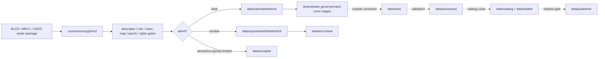

<!-- [KFM_META_BLOCK_V2]
doc_id: kfm://doc/connectors-usgs-nlcd-readme
title: connectors/usgs/nlcd/ — USGS NLCD Connector Lane
type: readme
version: v0.1
status: draft
owners: OWNER_TBD — Connector steward · Source steward · USGS steward · MRLC steward · NLCD steward · Habitat steward · Agriculture steward · Hydrology steward · Spatial Foundation steward · Data steward · Validation steward · Docs steward
created: 2026-06-20
updated: 2026-06-20
policy_label: public; nested-lane; land-cover; raster; modeled; source-admission-only; raw-quarantine-only
related:
  - ../README.md
  - ../../../docs/sources/catalog/usgs/README.md
  - ../../../docs/sources/catalog/usgs/nlcd.md
  - ../../../docs/domains/habitat/sublanes/land_cover.md
  - ../../../docs/domains/habitat/README.md
  - ../../../docs/domains/agriculture/sublanes/cropland.md
  - ../../../docs/domains/hydrology/README.md
  - ../../../data/registry/sources/
  - ../../../data/raw/
  - ../../../data/quarantine/
  - ../../../data/receipts/
  - ../../../data/proofs/
  - ../../../policy/rights/
  - ../../../policy/sensitivity/
  - ../../../release/
tags: [kfm, connectors, usgs, mrlc, nlcd, national-land-cover-database, land-cover, habitat, agriculture, hydrology, spatial-foundation, raster, modeled, class-map, change-products, source-admission, raw, quarantine, governance]
notes:
  - "Draft nested connector lane for NLCD source intake and admission helpers."
  - "Placement is draft / ADR-class: usgs/nlcd/ product sublane convention remains NEEDS VERIFICATION unless ratified by Directory Rules or ADR."
  - "NLCD family placement remains open between USGS and MRLC conventions; this README does not settle that ADR."
  - "NLCD is uniformly modeled: every pixel is a classifier-assigned class label, not a direct land-cover measurement."
  - "Native class-map version and epoch must be preserved; cross-release comparison requires reconciliation, not raw pixel-code equality."
  - "NLCD wetlands are not regulatory wetlands; NLCD agriculture is not crop-specific CDL truth; NLCD class labels are not habitat assertions by themselves."
  - "Connector output may enter raw or quarantine admission lanes only."
[/KFM_META_BLOCK_V2] -->

<a id="top"></a>

# USGS NLCD Connector Lane

> Draft nested connector boundary for National Land Cover Database source material. This lane admits NLCD raster/source packages; it does not decide habitat truth, crop truth, regulatory wetland status, or release state.

<p>
  
  
  
  
  
  
</p>

`connectors/usgs/nlcd/`

## Quick jumps

[Status](#status) · [Scope](#scope) · [Repo fit](#repo-fit) · [Accepted inputs](#accepted-inputs) · [Exclusions](#exclusions) · [Admission model](#admission-model) · [Source-role discipline](#source-role-discipline) · [Class-map and epoch discipline](#class-map-and-epoch-discipline) · [Lifecycle sketch](#lifecycle-sketch) · [Authority boundary](#authority-boundary) · [Evidence basis](#evidence-basis) · [Validation](#validation) · [Rollback](#rollback) · [Definition of done](#definition-of-done)

---

## Status

> [!IMPORTANT]
> **Status:** `draft` / `NEEDS VERIFICATION`  
> **Owner:** `OWNER_TBD`  
> **Path:** `connectors/usgs/nlcd/`  
> **Mode:** nested product connector lane  
> **Truth posture:** `CONFIRMED` file path and README content; connector code, source descriptors, endpoint/package configuration, fixtures, tests, CI wiring, emitted receipts, and release behavior remain `NEEDS VERIFICATION`.

---

## Scope

`connectors/usgs/nlcd/` is a draft nested connector lane for NLCD source intake and admission helpers.

This folder may contain connector-local documentation, descriptor-gated client helpers, MRLC/USGS distribution manifest helpers, raster package inventory helpers, epoch/version helpers, class-map preservation helpers, change-product lineage helpers, GeoTIFF/COG metadata helpers, projection/resolution/nodata helpers, provenance/digest helpers, no-network fixture pointers, and raw/quarantine handoff adapters for approved NLCD source material.

It must not become NLCD product doctrine, USGS or MRLC source-family doctrine, Habitat doctrine, Agriculture doctrine, Hydrology doctrine, Spatial Foundation doctrine, habitat truth, crop truth, wetland regulatory truth, ground-observation truth, SourceDescriptor authority, rights policy authority, sensitivity policy authority, schema authority, catalog/triplet authority, proof authority, release authority, public API behavior, public UI behavior, public map authority, tile authority, or publication authority.

---

## Repo fit

```text
connectors/
└── usgs/
    ├── README.md
    ├── 3dep/
    │   └── README.md
    ├── nhdplus_hr/
    │   └── README.md
    └── nlcd/
        └── README.md
```

Related responsibility roots:

```text
connectors/usgs/                          # USGS connector-family coordination lane
connectors/usgs/nlcd/                     # this draft NLCD product connector lane
docs/sources/catalog/usgs/nlcd.md         # NLCD product page
docs/domains/habitat/sublanes/land_cover.md # habitat land-cover sublane doctrine
data/registry/sources/                    # source descriptors and activation state
data/raw/                                 # raw staged source outputs by owning domain
data/quarantine/                          # held material requiring review
data/receipts/                            # ingest, checksum, package, transform, and review receipts
data/proofs/                              # EvidenceBundles and proof packs
policy/rights/                            # source-use and attribution review
policy/sensitivity/                       # precision, joins, and release review
release/                                  # release decisions and rollback state
```

---

## Accepted inputs

| Accepted item | Required posture |
|---|---|
| Source-reference manifest | Preserve NLCD product identity, descriptor reference, source URL, retrieval/import time, rights posture, review posture, and digest. |
| Package/raster manifest | Preserve file inventory, epoch, sub-product, projection, resolution, nodata, valid-pixel footprint, and digest. |
| Class-map helper | Preserve native NLCD class-map version and class labels without silently mapping to KFM common vocabulary. |
| Change-product helper | Preserve epoch-pair lineage, source class maps, change-product identity, and modeled-role posture. |
| Impervious/canopy helper | Preserve continuous raster identity, units/percent interpretation, epoch, nodata, and digest. |
| Crosswalk note | Record NLCD/CDL/LANDFIRE/GAP crosswalks as advisory only. |
| Test references | Point to owning fixture/test roots; fixtures do not become source authority. |

---

## Exclusions

| Do not store here | Correct home |
|---|---|
| NLCD product doctrine | `../../../docs/sources/catalog/usgs/nlcd.md` |
| USGS or MRLC source-family doctrine | `../../../docs/sources/catalog/` after accepted placement |
| Habitat, Agriculture, Hydrology, or Spatial Foundation doctrine | `../../../docs/domains/<domain>/` |
| Authoritative SourceDescriptor records | `../../../data/registry/sources/` |
| Rights or sensitivity rules | `../../../policy/rights/`, `../../../policy/sensitivity/` |
| Receipts or proof packs as authority | `../../../data/receipts/`, `../../../data/proofs/` |
| Processed land-cover records or tile products | `../../../data/processed/` or release-specific published roots after gates |
| Catalog or triplet records | `../../../data/catalog/`, `../../../data/triplets/` |
| Public artifacts | `../../../data/published/` after governed release |
| Public API or UI behavior | governed application roots after verification |

---

## Admission model

NLCD source material must be admitted product-first, class-map-first, epoch-first, source-role-first, rights-first, and raster-shape-aware.

| Concern | Required connector posture |
|---|---|
| Source identity | Preserve NLCD/MRLC/USGS product identity, descriptor reference, source URL/reference, retrieval time, rights posture, citation posture, and digest. |
| Product separation | Keep land-cover, impervious surface, tree canopy cover, and change products separate. |
| Source role | Preserve modeled source role across all pixels and sub-products; do not upgrade by promotion. |
| Class map | Preserve native class-map version, class labels, nodata, and crosswalk status. |
| Epoch | Preserve NLCD epoch/release year, change-product epoch pair, and release metadata. |
| Raster shape | Preserve projection, resolution, valid-pixel footprint, tiling/package identity, nodata, and overview behavior. |
| Publication | No connector output is public. Publication is a separate governed transition outside this folder. |

---

## Source-role discipline

NLCD is uniformly modeled.

| Surface | Connector rule |
|---|---|
| Land Cover raster | Treat every pixel as classifier-assigned modeled class, not a direct measurement. |
| Impervious Surface raster | Treat as modeled percentage/continuous raster with units and uncertainty/caveats preserved. |
| Tree Canopy Cover raster | Treat as modeled percentage/continuous raster with units and uncertainty/caveats preserved. |
| Change products | Treat as modeled epoch-pair derivatives requiring class-map reconciliation. |
| Crosswalked class products | Treat crosswalks as advisory unless an accepted contract says otherwise. |

---

## Class-map and epoch discipline

- Native NLCD class codes and labels must be preserved with their class-map version.
- Cross-release comparison requires class-map reconciliation, not raw class-code equality.
- NLCD/CDL/LANDFIRE/GAP crosswalks are advisory and must not overwrite native classifications.
- NLCD wetlands are not regulatory wetlands.
- NLCD agriculture classes are not crop-specific CDL classifications.
- NLCD class labels are source classifications, not habitat assertions by themselves.
- Habitat claims require downstream EvidenceBundle closure, review state, and policy decisions.

---

## Lifecycle sketch



Connector code admits, quarantines, denies, or records source probes. It does not decide habitat truth, crop truth, wetland regulatory status, public map precision, delivery artifacts, or release state.

---

## Authority boundary

```text
OUTPUT LIMIT:
  data/raw/habitat/nlcd/<run_id>/
  data/quarantine/habitat/nlcd/<run_id>/
  data/receipts/<run_id>/              # run/probe evidence, not proof closure

NOT HERE:
  NLCD product doctrine
  USGS/MRLC source-family doctrine
  habitat truth
  crop truth
  regulatory wetland truth
  SourceDescriptor authority
  rights or sensitivity policy
  processed records
  catalog records
  triplet records
  delivery artifact release authority
  receipts / proofs as publication authority
  release decisions
  public API behavior
  public UI behavior
```

---

## Evidence basis

| Source | Status | Supports | Limits |
|---|---|---|---|
| `docs/sources/catalog/usgs/nlcd.md` | `CONFIRMED` | Product identity, MRLC/USGS placement issue, modeled source-role posture, native class-map preservation, and crosswalk disclaimers. | Does not prove connector implementation exists. |
| `docs/domains/habitat/sublanes/land_cover.md` | `CONFIRMED` | Land-cover sublane treats categorical land-cover labels as source classifications, not habitat assertions; downstream joins are governed. | Does not make this connector active. |
| `connectors/usgs/nlcd/README.md` before this edit | `CONFIRMED` | Target file existed but was blank. | No implementation proof. |

---

## Validation

Before relying on this connector, verify:

- nested `connectors/usgs/nlcd/` placement is ratified or recorded in the drift/open-question register;
- USGS vs MRLC source-family placement is resolved or recorded as open ADR-class drift;
- SourceDescriptor records exist and validate;
- current NLCD/MRLC package surfaces, endpoint behavior, access constraints, cadence/freshness, and rights terms are verified;
- class-map, epoch, raster shape, nodata, projection, and change-product gates are implemented;
- modeled source-role separation is enforced;
- no-network fixtures exist for tests;
- run receipts are emitted for successful, failed, denied, skipped, no-op, and rate-limited probes;
- outputs are limited to raw or quarantine admission lanes;
- downstream processed, catalog, triplet, proof, delivery, and release artifacts are produced only outside connectors;
- public clients do not read connector outputs directly.

---

## Rollback

Rollback is required if this README creates parallel product authority, misstates canonical connector placement, weakens source-role separation, implies endpoint activation without tests, or conflicts with an accepted ADR.

Rollback target: initial blank file content SHA `8b137891791fe96927ad78e64b0aad7bded08bdc`.

---

## Definition of done

- [ ] Owners are confirmed and `OWNER_TBD` is replaced.
- [ ] Connector placement and USGS/MRLC source-family convention are resolved or recorded as open drift.
- [ ] Actual connector contents are inventoried.
- [ ] SourceDescriptor IDs, product identities, source roles, rights, sensitivity, cadence, endpoint/package behavior, class-map versions, epochs, and activation state are verified.
- [ ] Tests prevent modeled/observed collapse, class-map version collapse, cross-release pixel-equality overclaim, NLCD/CDL collapse, NLCD/regulatory-wetlands collapse, habitat-assertion overclaim, rights bypass, sensitivity bypass, and release misuse.
- [ ] Outputs are verified to enter raw or quarantine admission lanes only.
- [ ] Run receipts exist for successful, failed, denied, skipped, no-op, and rate-limited source probes.
- [ ] No source-family, product, domain, processed, catalog, triplet, published, release, schema, policy, proof, registry, fixture, API, UI, or public-claim authority lives here.
- [ ] Tests, fixtures, and CI behavior are verified or marked `NEEDS VERIFICATION`.

---

## Status summary

`connectors/usgs/nlcd/` is a draft nested NLCD source-admission lane. It is not the canonical NLCD connector home unless ratified. It is not NLCD product doctrine, USGS/MRLC source-family doctrine, habitat truth, crop truth, regulatory wetland truth, SourceDescriptor authority, policy authority, schema authority, catalog/triplet authority, proof closure, release authority, public map authority, public API behavior, public UI behavior, or pipeline authority.

<p align="right"><a href="#top">Back to top</a></p>
