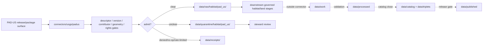

<!-- [KFM_META_BLOCK_V2]
doc_id: kfm://doc/connectors-usgs-padus-readme
title: connectors/usgs/padus/ — USGS PAD-US Connector Lane
type: readme
version: v0.1
status: draft
owners: OWNER_TBD — Connector steward · Source steward · USGS steward · PAD-US steward · Habitat steward · Data steward · Validation steward · Docs steward
created: 2026-06-20
updated: 2026-06-20
policy_label: public; nested-lane; protected-areas; versioned-context; source-admission-only; raw-quarantine-only
related:
  - ../README.md
  - ../../../docs/sources/catalog/usgs/README.md
  - ../../../docs/sources/catalog/blm/pad-us.md
  - ../../../docs/domains/habitat/SOURCE_REGISTRY.md
  - ../../../data/registry/sources/
  - ../../../data/raw/
  - ../../../data/quarantine/
  - ../../../data/receipts/
  - ../../../data/proofs/
  - ../../../policy/rights/
  - ../../../policy/sensitivity/
  - ../../../release/
tags: [kfm, connectors, usgs, pad-us, padus, protected-areas, conservation, habitat, gap-status, versioned-context, boundary-diff, source-admission, raw, quarantine, governance]
notes:
  - "Draft nested connector lane for PAD-US source intake and admission helpers under the USGS connector family."
  - "Placement is draft / ADR-class: usgs/padus/ product sublane convention remains NEEDS VERIFICATION unless ratified by Directory Rules or ADR."
  - "Current repo evidence found PAD-US product doctrine under docs/sources/catalog/blm/pad-us.md for the BLM-contributed federal-lands slice; this README does not supersede that BLM slice."
  - "Full PAD-US aggregate vs contributor-specific slices must remain separate until SourceDescriptor and placement decisions resolve authority."
  - "PAD-US is versioned protected-area/stewardship context, not cadastral truth, title truth, current management decision truth, habitat truth, or release approval."
  - "Connector output may enter raw or quarantine admission lanes only."
[/KFM_META_BLOCK_V2] -->

<a id="top"></a>

# USGS PAD-US Connector Lane

> Draft nested connector boundary for Protected Areas Database of the United States source material. This lane admits versioned protected-area context; it does not decide cadastral truth, title truth, habitat truth, current management decision truth, or release state.

<p>
  
  
  
  
  
  
</p>

`connectors/usgs/padus/`

## Quick jumps

[Status](#status) · [Scope](#scope) · [Repo fit](#repo-fit) · [Relationship to PAD-US slice lanes](#relationship-to-pad-us-slice-lanes) · [Accepted inputs](#accepted-inputs) · [Exclusions](#exclusions) · [Admission model](#admission-model) · [Version discipline](#version-discipline) · [Anti-collapse posture](#anti-collapse-posture) · [Lifecycle sketch](#lifecycle-sketch) · [Authority boundary](#authority-boundary) · [Evidence basis](#evidence-basis) · [Validation](#validation) · [Rollback](#rollback) · [Definition of done](#definition-of-done)

---

## Status

> [!IMPORTANT]
> **Status:** `draft` / `NEEDS VERIFICATION`  
> **Owner:** `OWNER_TBD`  
> **Path:** `connectors/usgs/padus/`  
> **Mode:** nested product connector lane candidate  
> **Truth posture:** `CONFIRMED` file path and README content; connector code, source descriptors, endpoint/package configuration, fixtures, tests, CI wiring, emitted receipts, and release behavior remain `NEEDS VERIFICATION`.

---

## Scope

`connectors/usgs/padus/` is a draft nested connector lane for PAD-US source intake and admission helpers under the USGS connector family.

This folder may contain connector-local documentation, descriptor-gated client helpers, release/package manifest helpers, version-pin helpers, contributor-slice separation notes, GAP-status field preservation helpers, boundary-diff helper notes, topology preflight notes, provenance/digest helpers, no-network fixture pointers, and raw/quarantine handoff adapters for approved PAD-US source material.

It must not become PAD-US product doctrine, USGS source-family doctrine, BLM source-family doctrine, Habitat doctrine, cadastral truth, title truth, current management decision truth, habitat truth, SourceDescriptor authority, rights policy authority, sensitivity policy authority, schema authority, catalog/triplet authority, proof authority, release authority, public API behavior, public UI behavior, public map authority, or publication authority.

---

## Repo fit

```text
connectors/
└── usgs/
    ├── README.md
    ├── nlcd/
    │   └── README.md
    └── padus/
        └── README.md
```

Related responsibility roots:

```text
connectors/usgs/                          # USGS connector-family coordination lane
connectors/usgs/padus/                    # this draft PAD-US aggregate connector lane
docs/sources/catalog/blm/pad-us.md        # confirmed PAD-US BLM federal-lands slice product page
docs/sources/catalog/usgs/                # USGS source-family docs; aggregate PAD-US page remains NEEDS VERIFICATION
docs/domains/habitat/                     # habitat source registry and protected-area context
data/registry/sources/                    # source descriptors and activation state
data/raw/                                 # raw staged source outputs by owning domain
data/quarantine/                          # held material requiring review
data/receipts/                            # ingest, checksum, package, boundary-diff, and review receipts
data/proofs/                              # EvidenceBundles and proof packs
policy/rights/                            # source-use and attribution review
policy/sensitivity/                       # location, land, ecology, and release review
release/                                  # release decisions and rollback state
```

---

## Relationship to PAD-US slice lanes

| Surface | Connector implication |
|---|---|
| Full PAD-US aggregate | Candidate scope for this `connectors/usgs/padus/` lane, pending SourceDescriptor and placement review. |
| BLM-contributed PAD-US slice | Already documented under `docs/sources/catalog/blm/pad-us.md`; do not supersede or merge silently. |
| Other contributor slices | Require source-specific descriptor, contributor fields, rights posture, and review state. |
| Habitat/Fauna/Flora consumers | Consume released evidence through governed catalog/proof interfaces, not direct connector output. |

No move, delete, rename, redirect, or deprecation is implied by this README.

---

## Accepted inputs

| Accepted item | Required posture |
|---|---|
| Source-reference manifest | Preserve PAD-US product identity, descriptor reference, source URL, retrieval/import time, rights posture, review posture, and digest. |
| Release manifest | Preserve PAD-US version, release date, package inventory, source URI where available, and digest. |
| Contributor-slice manifest | Preserve contributor/manager/owner fields, slice rule, filter expression, row count, and digest. |
| Polygon package helper | Preserve geometry lineage, topology warnings, projection, feature count, and source fields. |
| GAP-status helper | Preserve GAP status fields and interpretation caveats without turning them into policy conclusions. |
| Boundary-diff helper | Preserve prior version, current version, changed features, topology caveats, and diff receipt. |
| Test references | Point to owning fixture/test roots; fixtures do not become source authority. |

---

## Exclusions

| Do not store here | Correct home |
|---|---|
| PAD-US product doctrine | `../../../docs/sources/catalog/` after accepted placement |
| BLM PAD-US slice doctrine | `../../../docs/sources/catalog/blm/pad-us.md` |
| Habitat, Fauna, Flora, or land-domain doctrine | `../../../docs/domains/<domain>/` |
| Authoritative SourceDescriptor records | `../../../data/registry/sources/` |
| Rights or sensitivity rules | `../../../policy/rights/`, `../../../policy/sensitivity/` |
| Receipts or proof packs as authority | `../../../data/receipts/`, `../../../data/proofs/` |
| Processed protected-area records | `../../../data/processed/` |
| Catalog or triplet records | `../../../data/catalog/`, `../../../data/triplets/` |
| Public artifacts | `../../../data/published/` after governed release |
| Public API or UI behavior | governed application roots after verification |

---

## Admission model

PAD-US source material must be admitted version-first, contributor-first, geometry-first, source-role-first, rights-first, and review-aware.

| Concern | Required connector posture |
|---|---|
| Source identity | Preserve PAD-US product identity, descriptor reference, source URL/reference, retrieval time, rights posture, citation posture, and digest. |
| Version pin | Preserve PAD-US version/release identity and do not merge versions without diff receipts. |
| Contributor separation | Preserve contributor, manager, owner, designation, and slice/filter context. |
| Source role | Preserve versioned context/observed designation posture assigned at admission; do not upgrade by promotion. |
| Geometry | Preserve polygon identity, geometry lineage, topology warnings, projection, and transform state. |
| GAP/status fields | Preserve source fields and caveats; do not turn status fields into standalone legal or habitat conclusions. |
| Publication | No connector output is public. Publication is a separate governed transition outside this folder. |

---

## Version discipline

- Every admitted PAD-US package must carry a version/release identifier.
- Boundary comparisons must cite both source versions and preserve diff receipts.
- Contributor slices must preserve the filter expression and source fields used to create the slice.
- Geometry repair, simplification, projection, generalization, or tiling belongs downstream and requires transform receipts.
- Release dashboards must show the version pin and rollback target.

---

## Anti-collapse posture

| Rule | Connector implication |
|---|---|
| PAD-US is versioned context. | Do not treat polygons as sovereign truth roots or live management decisions. |
| PAD-US is not cadastral truth. | Do not claim title, legal boundary, or ownership certainty from connector output. |
| PAD-US is not habitat truth. | Do not turn stewardship designation into biophysical habitat assertion. |
| GAP status is not a policy conclusion by itself. | Preserve source fields and caveats for downstream review. |
| Contributor slices are not the full aggregate. | Do not merge BLM, USGS aggregate, or other slices without explicit descriptor and lineage. |
| Public display is downstream. | The connector must not build public API/UI/map/release payloads. |

---

## Lifecycle sketch



Connector code admits, quarantines, denies, or records source probes. It does not decide cadastral truth, habitat truth, public map precision, or release state.

---

## Authority boundary

```text
OUTPUT LIMIT:
  data/raw/habitat/pad_us/<run_id>/
  data/quarantine/habitat/pad_us/<run_id>/
  data/receipts/<run_id>/              # run/probe evidence, not proof closure

NOT HERE:
  PAD-US product doctrine
  USGS or BLM source-family doctrine
  cadastral truth
  title truth
  habitat truth
  management-decision authority
  SourceDescriptor authority
  rights or sensitivity policy
  processed records
  catalog records
  triplet records
  receipts / proofs as publication authority
  release decisions
  public API behavior
  public UI behavior
```

---

## Evidence basis

| Source | Status | Supports | Limits |
|---|---|---|---|
| `docs/sources/catalog/blm/pad-us.md` | `CONFIRMED` | PAD-US BLM slice doctrine, versioned context posture, non-cadastral and non-management-decision boundaries, BLM slice vs full aggregate distinction. | Does not prove a USGS aggregate connector exists. |
| `connectors/usgs/README.md` | `CONFIRMED` | USGS connector-family coordination lane and source-admission-only boundary. | Does not settle PAD-US placement by itself. |
| `connectors/usgs/padus/README.md` before this edit | `CONFIRMED` | Target file existed but was blank. | No implementation proof. |

---

## Validation

Before relying on this connector, verify:

- nested `connectors/usgs/padus/` placement is ratified or recorded in the drift/open-question register;
- USGS aggregate vs BLM slice source-family placement is resolved or recorded as open ADR-class drift;
- SourceDescriptor records exist and validate;
- current PAD-US package surfaces, endpoint behavior, access constraints, cadence/freshness, version, source URI, and rights terms are verified;
- contributor, manager, owner, GAP status, geometry, topology, version, and boundary-diff gates are implemented;
- no-network fixtures exist for tests;
- run receipts are emitted for successful, failed, denied, skipped, no-op, and rate-limited probes;
- outputs are limited to raw or quarantine admission lanes;
- downstream processed, catalog, triplet, proof, delivery, and release artifacts are produced only outside connectors;
- public clients do not read connector outputs directly.

---

## Rollback

Rollback is required if this README creates parallel product authority, misstates canonical connector placement, weakens contributor-slice separation, implies endpoint activation without tests, or conflicts with an accepted ADR.

Rollback target: initial blank file content SHA `8b137891791fe96927ad78e64b0aad7bded08bdc`.

---

## Definition of done

- [ ] Owners are confirmed and `OWNER_TBD` is replaced.
- [ ] Connector placement and USGS aggregate / BLM slice source-family convention are resolved or recorded as open drift.
- [ ] Actual connector contents are inventoried.
- [ ] SourceDescriptor IDs, product identities, source roles, version pins, contributor fields, rights, sensitivity, cadence, endpoint/package behavior, and activation state are verified.
- [ ] Tests prevent full-aggregate/slice collapse, version collapse, boundary-diff omission, PAD-US/cadastre collapse, habitat-assertion overclaim, rights bypass, sensitivity bypass, and release misuse.
- [ ] Outputs are verified to enter raw or quarantine admission lanes only.
- [ ] Run receipts exist for successful, failed, denied, skipped, no-op, and rate-limited source probes.
- [ ] No source-family, product, domain, processed, catalog, triplet, published, release, schema, policy, proof, registry, fixture, API, UI, or public-claim authority lives here.
- [ ] Tests, fixtures, and CI behavior are verified or marked `NEEDS VERIFICATION`.

---

## Status summary

`connectors/usgs/padus/` is a draft nested PAD-US source-admission lane under the USGS connector family. It is not the canonical PAD-US connector home unless ratified. It is not PAD-US product doctrine, USGS source-family doctrine, BLM slice doctrine, cadastral truth, title truth, habitat truth, SourceDescriptor authority, policy authority, schema authority, catalog/triplet authority, proof closure, release authority, public map authority, public API behavior, public UI behavior, or pipeline authority.

<p align="right"><a href="#top">Back to top</a></p>
