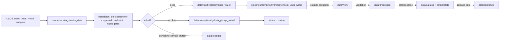

<!-- [KFM_META_BLOCK_V2]
doc_id: kfm://doc/connectors-usgs-water-data-readme
title: connectors/usgs/water_data/ — USGS Water Data Connector Lane
type: readme
version: v0.1
status: draft
owners: OWNER_TBD — Connector steward · Source steward · USGS steward · Water Data steward · Hydrology steward · Hazards steward · Data steward · Validation steward · Docs steward
created: 2026-06-20
updated: 2026-06-20
policy_label: public; nested-lane; water-data; nwis; time-series; source-admission-only; raw-quarantine-only
related:
  - ../README.md
  - ../../../docs/sources/catalog/usgs/README.md
  - ../../../docs/sources/catalog/usgs/nwis-water.md
  - ../../../pipelines/domains/hydrology/ingest_usgs_water/README.md
  - ../../../docs/domains/hydrology/README.md
  - ../../../docs/domains/hydrology/source-role-matrix.md
  - ../../../data/registry/sources/
  - ../../../data/raw/
  - ../../../data/quarantine/
  - ../../../data/receipts/
  - ../../../data/proofs/
  - ../../../policy/rights/
  - ../../../policy/sensitivity/
  - ../../../release/
tags: [kfm, connectors, usgs, water-data, nwis, api-waterdata, hydrology, hazards, gauges, time-series, instantaneous-values, daily-values, peak-flows, site-metadata, provisional-approved, source-admission, raw, quarantine, receipts, governance]
notes:
  - "Draft nested connector lane for USGS Water Data / NWIS source intake and admission helpers."
  - "Placement is draft / ADR-class: usgs/water_data/ product sublane convention remains NEEDS VERIFICATION unless ratified by Directory Rules or ADR."
  - "USGS Water source-role posture is heterogeneous: instantaneous values and peak flows are observed, daily values and annual statistics are aggregates, and site metadata is administrative."
  - "Provisional and approved values are distinct lifecycle states and must not be silently substituted."
  - "Modern api.waterdata.usgs.gov and legacy waterservices.usgs.gov / NWIS endpoints require cutover discipline until the SourceDescriptor closes migration posture."
  - "USGS Water Data is scientific/informational source material, not flood warning authority, dam-operation authority, water-rights enforcement, safety guidance, or release approval."
  - "Connector output may enter raw or quarantine admission lanes only."
[/KFM_META_BLOCK_V2] -->

<a id="top"></a>

# USGS Water Data Connector Lane

> Draft nested connector boundary for USGS Water Data / NWIS source material. This lane admits station time-series and site metadata; it does not decide hydrologic truth, flood-warning status, water-right compliance, operational decisions, or release state.

<p>
  
  
  
  
  
  
</p>

`connectors/usgs/water_data/`

## Quick jumps

[Status](#status) · [Scope](#scope) · [Repo fit](#repo-fit) · [Accepted inputs](#accepted-inputs) · [Exclusions](#exclusions) · [Admission model](#admission-model) · [Source-role discipline](#source-role-discipline) · [Temporal and approval-state discipline](#temporal-and-approval-state-discipline) · [API migration discipline](#api-migration-discipline) · [Lifecycle sketch](#lifecycle-sketch) · [Authority boundary](#authority-boundary) · [Evidence basis](#evidence-basis) · [Validation](#validation) · [Rollback](#rollback) · [Definition of done](#definition-of-done)

---

## Status

> [!IMPORTANT]
> **Status:** `draft` / `NEEDS VERIFICATION`  
> **Owner:** `OWNER_TBD`  
> **Path:** `connectors/usgs/water_data/`  
> **Mode:** nested product connector lane  
> **Truth posture:** `CONFIRMED` file path and README content; connector code, source descriptors, endpoint configuration, fixtures, tests, CI wiring, emitted receipts, and release behavior remain `NEEDS VERIFICATION`.

---

## Scope

`connectors/usgs/water_data/` is a draft nested connector lane for USGS Water Data / NWIS source intake and admission helpers.

This folder may contain connector-local documentation, descriptor-gated client helpers, modern API and legacy NWIS endpoint notes, site metadata parsers, instantaneous-values helpers, daily-values helpers, peak-flow helpers, annual-statistics helpers, water-quality pointer helpers, parameter-code preservation helpers, provisional/approved state helpers, provenance/digest helpers, no-network fixture pointers, and raw/quarantine handoff adapters for approved source material.

It must not become USGS Water product doctrine, Hydrology doctrine, Hazards doctrine, hydrologic truth, flood-warning authority, dam-operation authority, water-rights enforcement, safety guidance, SourceDescriptor authority, rights policy authority, sensitivity policy authority, schema authority, catalog/triplet authority, proof authority, release authority, public API behavior, public UI behavior, public map authority, or publication authority.

---

## Repo fit

```text
connectors/
└── usgs/
    ├── README.md
    ├── nhdplus_hr/
    │   └── README.md
    └── water_data/
        └── README.md
```

Related responsibility roots:

```text
connectors/usgs/                          # USGS connector-family coordination lane
connectors/usgs/water_data/               # this draft Water Data product connector lane
docs/sources/catalog/usgs/nwis-water.md   # USGS Water Data product page
pipelines/domains/hydrology/ingest_usgs_water/ # downstream ingest pipeline boundary
docs/domains/hydrology/                   # hydrology source roles, identity, lifecycle
data/registry/sources/                    # source descriptors and activation state
data/raw/                                 # raw staged source outputs by owning domain
data/quarantine/                          # held material requiring review
data/receipts/                            # ingest, checksum, endpoint, query, approval, and review receipts
data/proofs/                              # EvidenceBundles and proof packs
policy/rights/                            # source-use and attribution review
policy/sensitivity/                       # hydrology/infrastructure precision and release review
release/                                  # release decisions and rollback state
```

---

## Accepted inputs

| Accepted item | Required posture |
|---|---|
| Source-reference manifest | Preserve USGS Water Data identity, descriptor reference, source URL, retrieval/import time, rights posture, review posture, and digest. |
| Endpoint/query manifest | Preserve endpoint family, legacy/modern flag, query parameters, time window, site count, parameter codes, response status, and digest. |
| Site metadata helper | Preserve site ID, location, datum, station type, active/inactive status, and administrative metadata. |
| Instantaneous-values helper | Preserve site ID, parameter code, timestamp, value, unit, qualifier, approval/provisional status, and digest. |
| Daily-values helper | Preserve aggregation unit, statistic type, source IV lineage where available, date, unit, approval status, and digest. |
| Peak-flow helper | Preserve peak-flow record identity, water year, value, uncertainty/qualification fields, and source role. |
| Water-quality helper | Preserve method metadata, sample timestamp, parameter code, unit, qualifier, and approval state. |
| Test references | Point to owning fixture/test roots; fixtures do not become source authority. |

---

## Exclusions

| Do not store here | Correct home |
|---|---|
| USGS Water product doctrine | `../../../docs/sources/catalog/usgs/nwis-water.md` |
| USGS source-family doctrine | `../../../docs/sources/catalog/usgs/` |
| Hydrology or Hazards doctrine | `../../../docs/domains/hydrology/`, `../../../docs/domains/hazards/` |
| Authoritative SourceDescriptor records | `../../../data/registry/sources/` |
| Rights or sensitivity rules | `../../../policy/rights/`, `../../../policy/sensitivity/` |
| Executable hydrology normalization pipeline | `../../../pipelines/domains/hydrology/ingest_usgs_water/` |
| Receipts or proof packs as authority | `../../../data/receipts/`, `../../../data/proofs/` |
| Processed hydrology records | `../../../data/processed/` |
| Catalog or triplet records | `../../../data/catalog/`, `../../../data/triplets/` |
| Public artifacts | `../../../data/published/` after governed release |
| Public API or UI behavior | governed application roots after verification |

---

## Admission model

USGS Water Data source material must be admitted site-first, parameter-first, timestamp-first, approval-state-first, source-role-first, rights-first, and endpoint-aware.

| Concern | Required connector posture |
|---|---|
| Source identity | Preserve USGS Water Data product identity, descriptor reference, endpoint URL/reference, retrieval time, rights posture, citation posture, and digest. |
| Site identity | Preserve stable USGS site ID, site metadata, location, datum, and active/inactive status. |
| Parameter identity | Preserve parameter code, unit, method metadata where available, qualifier fields, and value type. |
| Source role | Preserve observed, aggregate, administrative, and uncertainty/caveat distinctions by surface. |
| Approval state | Preserve provisional vs approved state; never substitute one for the other. |
| Endpoint migration | Preserve modern API vs legacy NWIS endpoint identity and cutover/cadence posture. |
| Publication | No connector output is public. Publication is a separate governed transition outside this folder. |

---

## Source-role discipline

USGS Water Data is source-role heterogeneous.

| Surface | Connector rule |
|---|---|
| Site metadata | Treat as administrative source material, not an observation. |
| Instantaneous Values | Treat as observed readings with timestamp, parameter code, qualifier, and approval/provisional state. |
| Peak flows | Treat as observed or observed-with-uncertainty according to source fields; preserve caveats. |
| Daily Values | Treat as aggregate values; preserve statistic and aggregation unit. |
| Annual statistics | Treat as aggregate values; preserve statistic and period. |
| Water quality | Treat as observed sample/analysis records with method metadata and qualifiers where available. |

---

## Temporal and approval-state discipline

- Timestamp, timezone/date convention, site ID, and parameter code are load-bearing.
- Provisional values and approved values are distinct lifecycle states.
- Revisions must be represented with source update/approval metadata and receipts.
- Daily means, annual statistics, and other summaries must not be cited as instantaneous observations.
- Observed water readings are not flood warnings, dam-operation directives, safety guidance, or water-rights determinations.

---

## API migration discipline

- Modern `api.waterdata.usgs.gov` and legacy `waterservices.usgs.gov` / NWIS endpoint families must be kept distinct.
- Endpoint family, query parameters, response status, retrieval time, and digest must be preserved.
- Dual-endpoint comparison must not merge values without reconciliation receipts.
- SourceDescriptor records must close endpoint activation and migration posture before production reliance.
- Rate-limit, no-op, failure, and denial outcomes should emit receipts where applicable.

---

## Lifecycle sketch



Connector code admits, quarantines, denies, or records source probes. It does not decide hydrologic truth, operational guidance, public map precision, or release state.

---

## Authority boundary

```text
OUTPUT LIMIT:
  data/raw/hydrology/usgs_water/<run_id>/
  data/quarantine/hydrology/usgs_water/<run_id>/
  data/receipts/<run_id>/              # run/probe evidence, not proof closure

NOT HERE:
  USGS Water product doctrine
  hydrologic truth
  flood-warning authority
  dam-operation authority
  water-rights enforcement
  safety guidance
  SourceDescriptor authority
  rights or sensitivity policy
  executable pipeline authority
  processed records
  catalog records
  triplet records
  receipts / proofs as publication authority
  release decisions
  public API behavior
  public UI behavior
```

---

## Evidence basis

| Source | Status | Supports | Limits |
|---|---|---|---|
| `docs/sources/catalog/usgs/nwis-water.md` | `CONFIRMED` | Product identity, endpoint migration posture, observed/aggregate/administrative source-role split, provisional/approved lifecycle, and non-operational disclaimer. | Does not prove connector implementation exists. |
| `pipelines/domains/hydrology/ingest_usgs_water/README.md` | `CONFIRMED` | Downstream executable pipeline boundary and anti-collapse rules for provisional/approved, observed/aggregate, site metadata, and public release. | Pipeline README does not make connector active. |
| `connectors/usgs/water_data/README.md` before this edit | `CONFIRMED` | Target file existed but was blank. | No implementation proof. |

---

## Validation

Before relying on this connector, verify:

- nested `connectors/usgs/water_data/` placement is ratified or recorded in the drift/open-question register;
- SourceDescriptor records exist and validate;
- current modern and legacy endpoint behavior, access constraints, cadence/freshness, parameter-code enumeration, rate limits, and rights terms are verified;
- site ID, parameter code, timestamp, approval state, qualifier, unit, and source-role gates are implemented;
- observed vs aggregate vs administrative separation is enforced;
- provisional vs approved state is enforced;
- no-network fixtures exist for tests;
- run receipts are emitted for successful, failed, denied, skipped, no-op, and rate-limited probes;
- outputs are limited to raw or quarantine admission lanes;
- downstream work, processed, catalog, triplet, proof, and release artifacts are produced only outside connectors;
- public clients do not read connector outputs directly.

---

## Rollback

Rollback is required if this README creates parallel product authority, misstates canonical connector placement, weakens source-role separation, implies endpoint activation without tests, or conflicts with an accepted ADR.

Rollback target: initial blank file content SHA `8b137891791fe96927ad78e64b0aad7bded08bdc`.

---

## Definition of done

- [ ] Owners are confirmed and `OWNER_TBD` is replaced.
- [ ] Connector placement and product sublane convention are resolved or recorded as open drift.
- [ ] Actual connector contents are inventoried.
- [ ] SourceDescriptor IDs, product identities, source roles, rights, sensitivity, cadence, endpoint behavior, parameter codes, site IDs, approval-state handling, and activation state are verified.
- [ ] Tests prevent provisional/approved substitution, IV/DV/statistics collapse, site-metadata/observation collapse, NHDPlus/Water Data collapse, operational-guidance overclaim, rights bypass, sensitivity bypass, and release misuse.
- [ ] Outputs are verified to enter raw or quarantine admission lanes only.
- [ ] Run receipts exist for successful, failed, denied, skipped, no-op, and rate-limited source probes.
- [ ] No source-family, product, domain, processed, catalog, triplet, published, release, schema, policy, proof, registry, fixture, API, UI, or public-claim authority lives here.
- [ ] Tests, fixtures, and CI behavior are verified or marked `NEEDS VERIFICATION`.

---

## Status summary

`connectors/usgs/water_data/` is a draft nested USGS Water Data / NWIS source-admission lane. It is not the canonical Water Data connector home unless ratified. It is not USGS Water product doctrine, hydrologic truth, flood-warning authority, dam-operation authority, water-rights enforcement, SourceDescriptor authority, policy authority, schema authority, catalog/triplet authority, proof closure, release authority, public map authority, public API behavior, public UI behavior, or pipeline authority.

<p align="right"><a href="#top">Back to top</a></p>
