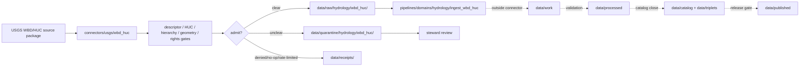

<!-- [KFM_META_BLOCK_V2]
doc_id: kfm://doc/connectors-usgs-wbd-huc-readme
title: connectors/usgs/wbd_huc/ — USGS WBD/HUC Connector Lane
type: readme
version: v0.1
status: draft
owners: OWNER_TBD — Connector steward · Source steward · USGS steward · WBD/HUC steward · Hydrology steward · Spatial Foundation steward · Data steward · Validation steward · Docs steward
created: 2026-06-20
updated: 2026-06-20
policy_label: public; nested-lane; watershed-boundaries; administrative-hydrography; source-admission-only; raw-quarantine-only
related:
  - ../README.md
  - ../../../docs/sources/catalog/usgs/README.md
  - ../../../docs/sources/catalog/usgs/watershed-boundary-dataset.md
  - ../../../docs/adr/ADR-0026-hydrology-source-spine-starts-with-wbd-huc12.md
  - ../../../pipelines/domains/hydrology/ingest_wbd_huc/README.md
  - ../../../docs/domains/hydrology/README.md
  - ../../../docs/domains/hydrology/source-role-matrix.md
  - ../../../data/registry/sources/
  - ../../../data/raw/
  - ../../../data/quarantine/
  - ../../../data/receipts/
  - ../../../data/proofs/
  - ../../../policy/rights/
  - ../../../policy/sensitivity/
  - ../../../release/
tags: [kfm, connectors, usgs, wbd, huc, huc12, watershed-boundary-dataset, hydrology, spatial-foundation, administrative-hydrography, watershed, hucunit, source-admission, raw, quarantine, receipts, governance]
notes:
  - "Draft nested connector lane for USGS Watershed Boundary Dataset / Hydrologic Unit Code source intake and admission helpers."
  - "Placement is draft / ADR-class: usgs/wbd_huc/ product sublane convention remains NEEDS VERIFICATION unless ratified by Directory Rules or ADR."
  - "WBD/HUC records provide administrative hydrography framework and identity backbone for Watershed and HUCUnit object families; they are not observed streamflow, modeled network topology, flood context, watershed condition, or release approval by themselves."
  - "HUC code hierarchy, level, name, source vintage, geometry lineage, CRS, topology/context links, and receipt lineage must be preserved."
  - "ADR-0026 treats WBD HUC12 as the hydrology source-spine head; this connector README does not by itself accept that ADR or activate a connector."
  - "Connector output may enter raw or quarantine admission lanes only."
[/KFM_META_BLOCK_V2] -->

<a id="top"></a>

# USGS WBD/HUC Connector Lane

> Draft nested connector boundary for USGS Watershed Boundary Dataset / Hydrologic Unit Code source material. This lane admits administrative hydrography boundaries; it does not decide observed hydrology, watershed condition, flood context, modeled network topology, or release state.

<p>
  
  
  
  
  
  
</p>

`connectors/usgs/wbd_huc/`

## Quick jumps

[Status](#status) · [Scope](#scope) · [Repo fit](#repo-fit) · [Accepted inputs](#accepted-inputs) · [Exclusions](#exclusions) · [Admission model](#admission-model) · [Source-role discipline](#source-role-discipline) · [HUC identity discipline](#huc-identity-discipline) · [Lifecycle sketch](#lifecycle-sketch) · [Authority boundary](#authority-boundary) · [Evidence basis](#evidence-basis) · [Validation](#validation) · [Rollback](#rollback) · [Definition of done](#definition-of-done)

---

## Status

> [!IMPORTANT]
> **Status:** `draft` / `NEEDS VERIFICATION`  
> **Owner:** `OWNER_TBD`  
> **Path:** `connectors/usgs/wbd_huc/`  
> **Mode:** nested product connector lane  
> **Truth posture:** `CONFIRMED` file path and README content; connector code, source descriptors, endpoint/package configuration, fixtures, tests, CI wiring, emitted receipts, and release behavior remain `NEEDS VERIFICATION`.

---

## Scope

`connectors/usgs/wbd_huc/` is a draft nested connector lane for USGS Watershed Boundary Dataset / Hydrologic Unit Code source intake and admission helpers.

This folder may contain connector-local documentation, descriptor-gated client helpers, package manifest helpers, HUC hierarchy inventory helpers, source-vintage helpers, geometry/CRS preflight helpers, topology/context-link helper notes, provenance/digest helpers, no-network fixture pointers, and raw/quarantine handoff adapters for approved WBD/HUC source material.

It must not become WBD/HUC product doctrine, Hydrology doctrine, Spatial Foundation doctrine, hydrologic truth, observed streamflow authority, modeled network topology authority, flood-zone/regulatory authority, watershed-condition truth, SourceDescriptor authority, rights policy authority, sensitivity policy authority, schema authority, catalog/triplet authority, proof authority, release authority, public API behavior, public UI behavior, public map authority, or publication authority.

---

## Repo fit

```text
connectors/
└── usgs/
    ├── README.md
    ├── nhdplus_hr/
    │   └── README.md
    ├── water_data/
    │   └── README.md
    └── wbd_huc/
        └── README.md
```

Related responsibility roots:

```text
connectors/usgs/                          # USGS connector-family coordination lane
connectors/usgs/wbd_huc/                  # this draft WBD/HUC product connector lane
docs/sources/catalog/usgs/watershed-boundary-dataset.md # WBD/HUC product page
docs/adr/ADR-0026-hydrology-source-spine-starts-with-wbd-huc12.md # draft source-spine ADR
pipelines/domains/hydrology/ingest_wbd_huc/ # downstream ingest pipeline boundary
docs/domains/hydrology/                   # hydrology source roles, identity, lifecycle
data/registry/sources/                    # source descriptors and activation state
data/raw/                                 # raw staged source outputs by owning domain
data/quarantine/                          # held material requiring review
data/receipts/                            # ingest, checksum, package, transform, and review receipts
data/proofs/                              # EvidenceBundles and proof packs
policy/rights/                            # source-use and attribution review
policy/sensitivity/                       # hydrology/spatial join and release review
release/                                  # release decisions and rollback state
```

---

## Accepted inputs

| Accepted item | Required posture |
|---|---|
| Source-reference manifest | Preserve WBD/HUC product identity, descriptor reference, source URL, retrieval/import time, rights posture, review posture, and digest. |
| Package manifest | Preserve package identity, file inventory, product version/vintage, geographic scope, CRS, and digest. |
| HUC hierarchy helper | Preserve HUC code, HUC level, name, parent/child relationship, and hierarchy lineage. |
| Geometry helper | Preserve feature geometry identity, CRS, geometry hash inputs, topology warnings, and transform state. |
| Source-vintage helper | Preserve source vintage, load/edit dates as signals, and reviewer-diff/digest state. |
| Context-link helper | Preserve governed links to soils, habitat, agriculture, hazards, settlements, infrastructure, and other lanes without direct file reach-around. |
| Test references | Point to owning fixture/test roots; fixtures do not become source authority. |

---

## Exclusions

| Do not store here | Correct home |
|---|---|
| WBD/HUC product doctrine | `../../../docs/sources/catalog/usgs/watershed-boundary-dataset.md` |
| USGS source-family doctrine | `../../../docs/sources/catalog/usgs/` |
| Hydrology or Spatial Foundation doctrine | `../../../docs/domains/hydrology/`, `../../../docs/domains/spatial-foundation/` |
| Hydrology source-spine ADR | `../../../docs/adr/ADR-0026-hydrology-source-spine-starts-with-wbd-huc12.md` |
| Authoritative SourceDescriptor records | `../../../data/registry/sources/` |
| Rights or sensitivity rules | `../../../policy/rights/`, `../../../policy/sensitivity/` |
| Executable hydrology normalization pipeline | `../../../pipelines/domains/hydrology/ingest_wbd_huc/` |
| Receipts or proof packs as authority | `../../../data/receipts/`, `../../../data/proofs/` |
| Processed hydrology records | `../../../data/processed/` |
| Catalog or triplet records | `../../../data/catalog/`, `../../../data/triplets/` |
| Public artifacts | `../../../data/published/` after governed release |
| Public API or UI behavior | governed application roots after verification |

---

## Admission model

WBD/HUC source material must be admitted package-first, HUC-code-first, hierarchy-first, geometry-first, source-vintage-first, rights-first, and review-aware.

| Concern | Required connector posture |
|---|---|
| Source identity | Preserve USGS WBD product identity, descriptor reference, source URL/reference, retrieval time, rights posture, citation posture, and digest. |
| HUC identity | Preserve HUC code, HUC level, HUC name, and parent/child hierarchy. |
| Geometry | Preserve geometry lineage, CRS, topology warnings, geometry hash inputs, and transform state. |
| Source vintage | Preserve product version/vintage, load/edit dates as signals, and reviewer-diff evidence. |
| Source role | Preserve administrative-hydrography / watershed-boundary context posture; do not upgrade by promotion. |
| Publication | No connector output is public. Publication is a separate governed transition outside this folder. |

---

## Source-role discipline

WBD/HUC is administrative hydrography context.

| Surface | Connector rule |
|---|---|
| HUC boundary polygons | Treat as administrative watershed-boundary context, not observed streamflow. |
| HUC codes and names | Preserve as identity fields; do not treat names as hydrologic evidence by themselves. |
| HUC hierarchy | Preserve parent/child lineage; do not collapse HUC levels. |
| Load/edit dates | Treat as change signals, not proof of geometry/content change. |
| Context joins | Require governed joins and policy checks; do not use direct file reach-around. |

---

## HUC identity discipline

- HUC code and HUC level are load-bearing.
- HUC2, HUC4, HUC6, HUC8, HUC10, and HUC12 must remain distinguishable.
- Parent/child hierarchy must be preserved.
- HUC12 first-slice use must remain evidence-bound and release-gated.
- WBD/HUC must not collapse into NHDPlus HR COMID topology, USGS Water Data/NWIS observations, FEMA NFHL regulatory context, or 3DEP terrain derivatives.
- Geometry/content fingerprints and reviewer diff are required before treating update metadata as change proof.

---

## Lifecycle sketch



Connector code admits, quarantines, denies, or records source probes. It does not decide hydrologic truth, watershed condition, public map precision, public API behavior, or release state.

---

## Authority boundary

```text
OUTPUT LIMIT:
  data/raw/hydrology/wbd_huc/<run_id>/
  data/quarantine/hydrology/wbd_huc/<run_id>/
  data/receipts/<run_id>/              # run/probe evidence, not proof closure

NOT HERE:
  WBD/HUC product doctrine
  hydrologic truth
  observed streamflow authority
  modeled network topology authority
  flood-zone/regulatory authority
  watershed-condition truth
  SourceDescriptor authority
  rights or sensitivity policy
  executable pipeline authority
  processed records
  catalog records
  triplet records
  receipts / proofs as publication authority
  release decisions
  public API behavior
  public UI behavior
```

---

## Evidence basis

| Source | Status | Supports | Limits |
|---|---|---|---|
| `docs/sources/catalog/usgs/watershed-boundary-dataset.md` | `CONFIRMED` | Product identity, WBD/HUC as administrative hydrography framework, HUC2-HUC12 hierarchy, SourceDescriptor boundary, lifecycle and catalog posture. | Does not prove connector implementation exists. |
| `docs/adr/ADR-0026-hydrology-source-spine-starts-with-wbd-huc12.md` | `CONFIRMED draft ADR` | WBD HUC12 source-spine decision proposal, first-slice rationale, and non-decisions including live connector activation. | Draft ADR text does not by itself activate connector behavior. |
| `pipelines/domains/hydrology/ingest_wbd_huc/README.md` | `CONFIRMED` | Downstream pipeline boundary, anti-collapse rules, HUC hierarchy and source-vintage preservation, and no direct publication posture. | Pipeline README does not make connector active. |
| `connectors/usgs/wbd_huc/README.md` before this edit | `CONFIRMED` | Target file existed but was blank. | No implementation proof. |

---

## Validation

Before relying on this connector, verify:

- nested `connectors/usgs/wbd_huc/` placement is ratified or recorded in the drift/open-question register;
- SourceDescriptor records exist and validate;
- current WBD package surfaces, endpoint behavior, access constraints, cadence/freshness, source version/vintage, and rights terms are verified;
- HUC code, level, name, hierarchy, source vintage, geometry lineage, CRS, topology/context-link, and receipt gates are implemented;
- WBD/HUC administrative boundary context is not collapsed into observed streamflow, NHDPlus HR network topology, NFHL regulatory context, or 3DEP terrain derivatives;
- no-network fixtures exist for tests;
- run receipts are emitted for successful, failed, denied, skipped, no-op, and rate-limited probes;
- outputs are limited to raw or quarantine admission lanes;
- downstream work, processed, catalog, triplet, proof, and release artifacts are produced only outside connectors;
- public clients do not read connector outputs directly.

---

## Rollback

Rollback is required if this README creates parallel product authority, misstates canonical connector placement, weakens HUC identity discipline, implies endpoint activation without tests, or conflicts with an accepted ADR.

Rollback target: initial blank file content SHA `8b137891791fe96927ad78e64b0aad7bded08bdc`.

---

## Definition of done

- [ ] Owners are confirmed and `OWNER_TBD` is replaced.
- [ ] Connector placement and product sublane convention are resolved or recorded as open drift.
- [ ] Actual connector contents are inventoried.
- [ ] SourceDescriptor IDs, product identities, source roles, rights, sensitivity, cadence, endpoint/package behavior, HUC levels, source vintage, and activation state are verified.
- [ ] Tests prevent HUC-level collapse, HUC/NHDPlus collapse, WBD/observed-water-data collapse, WBD/NFHL collapse, load-date/change-proof collapse, rights bypass, sensitivity bypass, and release misuse.
- [ ] Outputs are verified to enter raw or quarantine admission lanes only.
- [ ] Run receipts exist for successful, failed, denied, skipped, no-op, and rate-limited source probes.
- [ ] No source-family, product, domain, processed, catalog, triplet, published, release, schema, policy, proof, registry, fixture, API, UI, or public-claim authority lives here.
- [ ] Tests, fixtures, and CI behavior are verified or marked `NEEDS VERIFICATION`.

---

## Status summary

`connectors/usgs/wbd_huc/` is a draft nested USGS WBD/HUC source-admission lane. It is not the canonical WBD/HUC connector home unless ratified. It is not WBD/HUC product doctrine, hydrologic truth, observed streamflow authority, modeled network topology authority, flood-zone/regulatory authority, watershed-condition truth, SourceDescriptor authority, policy authority, schema authority, catalog/triplet authority, proof closure, release authority, public map authority, public API behavior, public UI behavior, or pipeline authority.

<p align="right"><a href="#top">Back to top</a></p>
