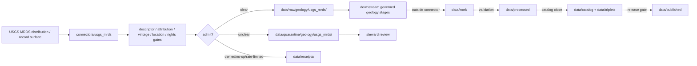

<!-- [KFM_META_BLOCK_V2]
doc_id: kfm://doc/connectors-usgs-mrds-readme
title: connectors/usgs_mrds/ — USGS MRDS Connector Lane
type: readme
version: v0.1
status: draft
owners: OWNER_TBD — Connector steward · Source steward · USGS steward · MRDS steward · Geology steward · Data steward · Validation steward · Docs steward
created: 2026-06-20
updated: 2026-06-20
policy_label: public; compound-lane; geology; historical-compilation; source-admission-only; raw-quarantine-only
related:
  - ../usgs/README.md
  - ../../docs/sources/catalog/usgs/README.md
  - ../../docs/sources/catalog/usgs/usgs-mrds.md
  - ../../docs/domains/geology/README.md
  - ../../data/registry/sources/
  - ../../data/raw/
  - ../../data/quarantine/
  - ../../data/receipts/
  - ../../data/proofs/
  - ../../policy/rights/
  - ../../policy/sensitivity/
  - ../../release/
tags: [kfm, connectors, usgs, mrds, geology, historical-records, administrative-compilation, source-admission, raw, quarantine, receipts, governance]
notes:
  - "Draft compound connector lane for USGS MRDS source intake and admission helpers."
  - "Placement is draft / ADR-class: connectors/usgs_mrds/ is the compound underscore pattern surfaced by the MRDS product page; connector-home convention remains unresolved."
  - "MRDS source-role posture is heterogeneous and historical: administrative compilation is the primary mode; stronger roles require explicit provenance."
  - "Connector output may enter raw or quarantine admission lanes only."
[/KFM_META_BLOCK_V2] -->

<a id="top"></a>

# USGS MRDS Connector Lane

> Draft compound connector boundary for USGS MRDS source material. This lane admits historical geology records; it does not decide final geology truth, cross-lane legal status, current site status, public map precision, or release state.

<p>
  
  
  
  
  
</p>

`connectors/usgs_mrds/`

## Quick jumps

[Status](#status) · [Scope](#scope) · [Repo fit](#repo-fit) · [Accepted inputs](#accepted-inputs) · [Exclusions](#exclusions) · [Admission model](#admission-model) · [Source-role discipline](#source-role-discipline) · [Lifecycle sketch](#lifecycle-sketch) · [Authority boundary](#authority-boundary) · [Evidence basis](#evidence-basis) · [Validation](#validation) · [Rollback](#rollback) · [Definition of done](#definition-of-done)

---

## Status

> [!IMPORTANT]
> **Status:** `draft` / `NEEDS VERIFICATION`  
> **Owner:** `OWNER_TBD`  
> **Path:** `connectors/usgs_mrds/`  
> **Mode:** compound connector lane candidate  
> **Truth posture:** `CONFIRMED` file path and README content; connector code, source descriptors, endpoint/package configuration, fixtures, tests, CI wiring, emitted receipts, and release behavior remain `NEEDS VERIFICATION`.

---

## Scope

`connectors/usgs_mrds/` is a draft compound connector lane for USGS MRDS source intake and admission helpers.

This folder may contain connector-local documentation, descriptor-gated client helpers, distribution/package manifest helpers, historical-record parsers, source-attribution/vintage helpers, location-uncertainty helpers, provenance/digest helpers, no-network fixture pointers, and raw/quarantine handoff adapters for approved MRDS source material.

It must not become MRDS product doctrine, USGS source-family doctrine, Geology doctrine, final geology truth, cross-lane legal-status authority, current site-status authority, SourceDescriptor authority, rights policy authority, sensitivity policy authority, schema authority, catalog/triplet authority, proof authority, release authority, public API behavior, public UI behavior, public map authority, or publication authority.

---

## Repo fit

```text
connectors/
├── usgs/
│   └── README.md
└── usgs_mrds/
    └── README.md
```

Related responsibility roots:

```text
connectors/usgs_mrds/                     # this draft compound MRDS connector lane
docs/sources/catalog/usgs/usgs-mrds.md    # MRDS product page
docs/sources/catalog/usgs/                # USGS source-family docs
docs/domains/geology/                     # geology-domain meaning and object families
data/registry/sources/                    # source descriptors and activation state
data/raw/                                 # raw staged source outputs by owning domain
data/quarantine/                          # held material requiring review
data/receipts/                            # ingest, checksum, package, transform, and review receipts
data/proofs/                              # EvidenceBundles and proof packs
policy/rights/                            # source-use and attribution review
policy/sensitivity/                       # geology and cross-lane review
release/                                  # release decisions and rollback state
```

> [!NOTE]
> The MRDS product page surfaces `connectors/usgs_mrds/` as a third connector-home pattern. This README documents that requested path but does not settle connector-home convention.

---

## Accepted inputs

| Accepted item | Required posture |
|---|---|
| Source-reference manifest | Preserve MRDS product identity, descriptor reference, source URL, retrieval/import time, rights posture, review posture, and digest. |
| Distribution/package manifest | Preserve file inventory, distribution format, retrieval time, maintenance/disposition status, and digest. |
| Record parser helper | Preserve MRDS record ID, source fields, source references, and vintage. |
| Location helper | Preserve coordinates, coordinate precision, location uncertainty, datum/CRS, and locality caveats. |
| Source-attribution helper | Preserve attribution chain where available. |
| Test references | Point to owning fixture/test roots; fixtures do not become source authority. |

---

## Exclusions

| Do not store here | Correct home |
|---|---|
| MRDS product doctrine | `../../docs/sources/catalog/usgs/usgs-mrds.md` |
| USGS source-family doctrine | `../../docs/sources/catalog/usgs/` |
| Geology domain doctrine | `../../docs/domains/geology/` |
| Authoritative SourceDescriptor records | `../../data/registry/sources/` |
| Rights or sensitivity rules | `../../policy/rights/`, `../../policy/sensitivity/` |
| Cross-lane legal or operational claims | Separate governed source lanes after explicit review |
| Receipts or proof packs as authority | `../../data/receipts/`, `../../data/proofs/` |
| Processed geology records | `../../data/processed/` |
| Catalog or triplet records | `../../data/catalog/`, `../../data/triplets/` |
| Public artifacts | `../../data/published/` after governed release |
| Public API or UI behavior | governed application roots after verification |

---

## Admission model

MRDS source material must be admitted record-first, attribution-first, vintage-first, location-uncertainty-first, source-role-first, rights-first, and sensitivity-aware.

| Concern | Required connector posture |
|---|---|
| Source identity | Preserve USGS MRDS product identity, descriptor reference, source URL/reference, retrieval time, rights posture, citation posture, and digest. |
| Record identity | Preserve MRDS record ID, source fields, status fields, and source references. |
| Source attribution | Preserve source-attribution chain where available. |
| Location uncertainty | Preserve coordinate precision, locality language, datum/CRS, and uncertainty caveats. |
| Source role | Preserve administrative, observed, candidate, or mixed role assigned at admission. |
| Publication | No connector output is public. Publication is a separate governed transition outside this folder. |

---

## Source-role discipline

MRDS is source-role heterogeneous and historical.

| Surface | Connector rule |
|---|---|
| Compiled MRDS record | Treat as administrative compilation unless source attribution proves a stronger role. |
| First-party field evidence | Treat as observed only where provenance supports that role. |
| Legacy or state-source record | Preserve compiled role and source vintage. |
| Unverified historical record | Treat as candidate until corroborated. |
| Source vocabularies | Preserve as source classification fields, not final geology truth by themselves. |

---

## Lifecycle sketch



Connector code admits, quarantines, denies, or records source probes. It does not decide final geology truth, cross-lane legal status, current site status, public map precision, or release state.

---

## Authority boundary

```text
OUTPUT LIMIT:
  data/raw/geology/usgs_mrds/<run_id>/
  data/quarantine/geology/usgs_mrds/<run_id>/
  data/receipts/<run_id>/              # run/probe evidence, not proof closure

NOT HERE:
  MRDS product doctrine
  geology truth
  cross-lane legal-status truth
  current site-status truth
  SourceDescriptor authority
  rights or sensitivity policy
  processed records
  catalog records
  triplet records
  receipts / proofs as publication authority
  release decisions
  public API behavior
  public UI behavior
```

---

## Evidence basis

| Source | Status | Supports | Limits |
|---|---|---|---|
| `docs/sources/catalog/usgs/usgs-mrds.md` | `CONFIRMED` | MRDS product identity, heterogeneous/historical source-role posture, compound connector path issue, maintenance-disposition uncertainty, and anti-collapse concerns. | Does not prove connector implementation exists. |
| `connectors/usgs_mrds/README.md` before this edit | `CONFIRMED` | Target file existed but was blank. | No implementation proof. |

---

## Validation

Before relying on this connector, verify:

- `connectors/usgs_mrds/` placement is ratified or recorded in the drift/open-question register;
- SourceDescriptor records exist and validate;
- current MRDS distribution surfaces, endpoint behavior, access constraints, maintenance/disposition status, cadence/freshness, and rights terms are verified;
- record ID, source attribution, source vintage, source fields, location uncertainty, and source-role gates are implemented;
- final-claim overreach and cross-lane claim overreach are blocked;
- no-network fixtures exist for tests;
- run receipts are emitted for successful, failed, denied, skipped, no-op, and rate-limited probes;
- outputs are limited to raw or quarantine admission lanes;
- downstream work, processed, catalog, triplet, proof, and release artifacts are produced only outside connectors;
- public clients do not read connector outputs directly.

---

## Rollback

Rollback is required if this README creates parallel product authority, misstates canonical connector placement, weakens source-role separation, implies endpoint activation without tests, or conflicts with an accepted ADR.

Rollback target: initial blank file content SHA `8b137891791fe96927ad78e64b0aad7bded08bdc`.

---

## Definition of done

- [ ] Owners are confirmed and `OWNER_TBD` is replaced.
- [ ] Connector placement and USGS MRDS connector-home convention are resolved or recorded as open drift.
- [ ] Actual connector contents are inventoried.
- [ ] SourceDescriptor IDs, product identities, source roles, rights, sensitivity, cadence, endpoint/package behavior, maintenance/disposition status, source attribution, source vintage, location precision, and activation state are verified.
- [ ] Tests prevent administrative/observed/candidate collapse, final-claim overreach, cross-lane claim overreach, rights bypass, sensitivity bypass, and release misuse.
- [ ] Outputs are verified to enter raw or quarantine admission lanes only.
- [ ] Run receipts exist for successful, failed, denied, skipped, no-op, and rate-limited source probes.
- [ ] No source-family, product, domain, processed, catalog, triplet, published, release, schema, policy, proof, registry, fixture, API, UI, or public-claim authority lives here.
- [ ] Tests, fixtures, and CI behavior are verified or marked `NEEDS VERIFICATION`.

---

## Status summary

`connectors/usgs_mrds/` is a draft compound USGS MRDS source-admission lane. It is not the canonical MRDS connector home unless ratified. It is not MRDS product doctrine, final geology truth, cross-lane legal-status truth, current site-status truth, SourceDescriptor authority, policy authority, schema authority, catalog/triplet authority, proof closure, release authority, public map authority, public API behavior, public UI behavior, or pipeline authority.

<p align="right"><a href="#top">Back to top</a></p>
