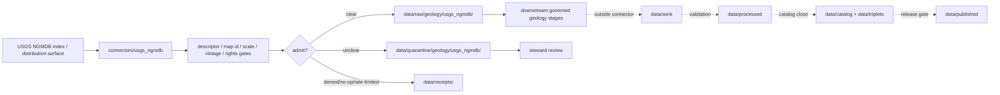

<!-- [KFM_META_BLOCK_V2]
doc_id: kfm://doc/connectors-usgs-ngmdb-readme
title: connectors/usgs_ngmdb/ — USGS NGMDB Connector Lane
type: readme
version: v0.1
status: draft
owners: OWNER_TBD — Connector steward · Source steward · USGS steward · NGMDB steward · Geology steward · Data steward · Validation steward · Docs steward
created: 2026-06-20
updated: 2026-06-20
policy_label: public; compound-lane; geology; geologic-maps; interpreted-evidence; source-admission-only; raw-quarantine-only
related:
  - ../usgs/README.md
  - ../../docs/sources/catalog/usgs/README.md
  - ../../docs/sources/catalog/usgs/usgs-ngmdb.md
  - ../../docs/sources/catalog/usgs/usgs-mrds.md
  - ../../docs/domains/geology/README.md
  - ../../data/registry/sources/
  - ../../data/raw/
  - ../../data/quarantine/
  - ../../data/receipts/
  - ../../data/proofs/
  - ../../policy/rights/
  - ../../policy/sensitivity/
  - ../../release/
tags: [kfm, connectors, usgs, ngmdb, geologic-maps, geology, interpreted, map-scale, multi-vintage, source-admission, raw, quarantine, receipts, governance]
notes:
  - "Draft compound connector lane for USGS National Geologic Map Database source intake and admission helpers."
  - "Placement is draft / ADR-class: connectors/usgs_ngmdb/ is the compound underscore pattern surfaced by the NGMDB product page; connector-home convention remains unresolved."
  - "NGMDB source-role posture is heterogeneous, with interpreted evidence as the dominant mode; administrative index records and observed source inputs must remain distinct where present."
  - "Map scale, map vintage, publisher, author, source-map identity, distribution format, and interpretation lineage are gate-critical."
  - "Connector output may enter raw or quarantine admission lanes only."
[/KFM_META_BLOCK_V2] -->

<a id="top"></a>

# USGS NGMDB Connector Lane

> Draft compound connector boundary for USGS National Geologic Map Database source material. This lane admits geologic-map index and distribution records; it does not decide final geology truth, cross-map certainty, public artifact status, or release state.

<p>
  
  
  
  
  
  
</p>

`connectors/usgs_ngmdb/`

## Quick jumps

[Status](#status) · [Scope](#scope) · [Repo fit](#repo-fit) · [Accepted inputs](#accepted-inputs) · [Exclusions](#exclusions) · [Admission model](#admission-model) · [Source-role discipline](#source-role-discipline) · [Scale and interpretation discipline](#scale-and-interpretation-discipline) · [Lifecycle sketch](#lifecycle-sketch) · [Authority boundary](#authority-boundary) · [Evidence basis](#evidence-basis) · [Validation](#validation) · [Rollback](#rollback) · [Definition of done](#definition-of-done)

---

## Status

> [!IMPORTANT]
> **Status:** `draft` / `NEEDS VERIFICATION`  
> **Owner:** `OWNER_TBD`  
> **Path:** `connectors/usgs_ngmdb/`  
> **Mode:** compound connector lane candidate  
> **Truth posture:** `CONFIRMED` file path and README content; connector code, source descriptors, endpoint/package configuration, fixtures, tests, CI wiring, emitted receipts, and release behavior remain `NEEDS VERIFICATION`.

---

## Scope

`connectors/usgs_ngmdb/` is a draft compound connector lane for USGS NGMDB source intake and admission helpers.

This folder may contain connector-local documentation, descriptor-gated client helpers, bibliographic-index parsers, distribution pointer helpers, map-scale preservation helpers, map-vintage and publisher/author preservation helpers, interpretation-lineage helpers, provenance/digest helpers, no-network fixture pointers, and raw/quarantine handoff adapters for approved NGMDB source material.

It must not become NGMDB product doctrine, USGS source-family doctrine, Geology doctrine, final geology truth, cross-map certainty authority, SourceDescriptor authority, rights policy authority, sensitivity policy authority, schema authority, catalog/triplet authority, proof authority, release authority, public API behavior, public UI behavior, public artifact authority, or publication authority.

---

## Repo fit

```text
connectors/
├── usgs/
│   └── README.md
├── usgs_mrds/
│   └── README.md
└── usgs_ngmdb/
    └── README.md
```

Related responsibility roots:

```text
connectors/usgs_ngmdb/                    # this draft compound NGMDB connector lane
docs/sources/catalog/usgs/usgs-ngmdb.md   # NGMDB product page
docs/sources/catalog/usgs/usgs-mrds.md    # MRDS sibling context
docs/sources/catalog/usgs/                # USGS source-family docs
docs/domains/geology/                     # geology-domain meaning and object families
data/registry/sources/                    # source descriptors and activation state
data/raw/                                 # raw staged source outputs by owning domain
data/quarantine/                          # held material requiring review
data/receipts/                            # ingest, checksum, package, transform, and review receipts
data/proofs/                              # EvidenceBundles and proof packs
policy/rights/                            # source-use and attribution review
policy/sensitivity/                       # release and join review
release/                                  # release decisions and rollback state
```

> [!NOTE]
> The NGMDB product page surfaces `connectors/usgs_ngmdb/` as the second compound `connectors/usgs_<program>/` pattern after MRDS. This README documents the requested path but does not settle connector-home convention.

---

## Accepted inputs

| Accepted item | Required posture |
|---|---|
| Source-reference manifest | Preserve NGMDB product identity, descriptor reference, source URL, retrieval/import time, rights posture, review posture, and digest. |
| Bibliographic-index helper | Preserve map title, author, publisher, publication year, series, scale, source ID, and digest. |
| Distribution helper | Preserve distribution format, source URI, file inventory, CRS where available, and digest. |
| Map-scale helper | Preserve map scale and block cross-scale equivalence unless explicitly reviewed. |
| Vintage helper | Preserve publication date, revision/update date, and interpretation lineage. |
| Carrier helper | Preserve whether the asset is vector, raster scan, GeoPDF, image, geodatabase, or pointer-only. |
| Test references | Point to owning fixture/test roots; fixtures do not become source authority. |

---

## Exclusions

| Do not store here | Correct home |
|---|---|
| NGMDB product doctrine | `../../docs/sources/catalog/usgs/usgs-ngmdb.md` |
| USGS source-family doctrine | `../../docs/sources/catalog/usgs/` |
| Geology domain doctrine | `../../docs/domains/geology/` |
| Authoritative SourceDescriptor records | `../../data/registry/sources/` |
| Rights or sensitivity rules | `../../policy/rights/`, `../../policy/sensitivity/` |
| Final geologic interpretation choices | Downstream governed geology/evidence workflows |
| Receipts or proof packs as authority | `../../data/receipts/`, `../../data/proofs/` |
| Processed geology records | `../../data/processed/` |
| Catalog or triplet records | `../../data/catalog/`, `../../data/triplets/` |
| Public artifacts | `../../data/published/` after governed release |
| Public API or UI behavior | governed application roots after verification |

---

## Admission model

NGMDB source material must be admitted map-record-first, publisher-first, scale-first, vintage-first, interpretation-first, rights-first, and review-aware.

| Concern | Required connector posture |
|---|---|
| Source identity | Preserve USGS NGMDB product identity, descriptor reference, source URL/reference, retrieval time, rights posture, citation posture, and digest. |
| Map identity | Preserve map title, author, publisher, series, year, scale, and NGMDB/source ID. |
| Distribution identity | Preserve distribution format, source URI, file inventory, CRS where available, and digest. |
| Source role | Preserve interpreted, administrative, observed, or mixed role assigned at admission. |
| Scale and vintage | Preserve map scale, publication date, revision/update state, and interpretation lineage. |
| Publication | No connector output is public. Publication is a separate governed transition outside this folder. |

---

## Source-role discipline

NGMDB is source-role heterogeneous, with interpreted evidence as the dominant mode.

| Surface | Connector rule |
|---|---|
| Bibliographic index | Treat as administrative source material. |
| Geologic map representation | Treat as interpreted evidence unless a narrower descriptor says otherwise. |
| First-party evidence referenced by a map | Treat as observed only where provenance supports that role. |
| Raster scans / GeoPDFs / map images | Preserve as source carriers; do not infer complete vector truth. |
| MapView or discovery surfaces | Treat as access/discovery surfaces unless descriptor says otherwise. |

---

## Scale and interpretation discipline

- Geologic maps are interpretations of evidence, not direct measurements.
- Map scale is gate-blocking evidence and must be preserved where available.
- Cross-scale comparison must not be treated as direct equivalence.
- Multiple maps for the same area may represent different interpretations and must remain distinct.
- Publisher, author, date, series, scale, and format are load-bearing provenance.
- NGMDB geologic context may support MRDS interpretation, but NGMDB and MRDS are complementary, not redundant.

---

## Lifecycle sketch



Connector code admits, quarantines, denies, or records source probes. It does not decide final geology truth, cross-map certainty, public artifact status, or release state.

---

## Authority boundary

```text
OUTPUT LIMIT:
  data/raw/geology/usgs_ngmdb/<run_id>/
  data/quarantine/geology/usgs_ngmdb/<run_id>/
  data/receipts/<run_id>/              # run/probe evidence, not proof closure

NOT HERE:
  NGMDB product doctrine
  geology truth
  cross-map certainty authority
  SourceDescriptor authority
  rights or sensitivity policy
  processed records
  catalog records
  triplet records
  receipts / proofs as publication authority
  release decisions
  public API behavior
  public UI behavior
```

---

## Evidence basis

| Source | Status | Supports | Limits |
|---|---|---|---|
| `docs/sources/catalog/usgs/usgs-ngmdb.md` | `CONFIRMED` | NGMDB product identity, interpreted source-role posture, map-scale gate, multi-vintage interpretation chain, compound connector path issue, and MRDS sibling relationship. | Does not prove connector implementation exists. |
| `connectors/usgs_ngmdb/README.md` before this edit | `CONFIRMED` | Target file existed but was blank. | No implementation proof. |

---

## Validation

Before relying on this connector, verify:

- `connectors/usgs_ngmdb/` placement is ratified or recorded in the drift/open-question register;
- SourceDescriptor records exist and validate;
- current NGMDB index/distribution surfaces, endpoint behavior, access constraints, maintenance/disposition status, cadence/freshness, and rights terms are verified;
- map ID, author, publisher, publication year, scale, format, source URI, vintage, and source-role gates are implemented;
- interpreted/administrative/observed separation is enforced;
- map-scale and multi-interpretation separation are enforced;
- no-network fixtures exist for tests;
- run receipts are emitted for successful, failed, denied, skipped, no-op, and rate-limited probes;
- outputs are limited to raw or quarantine admission lanes;
- downstream work, processed, catalog, triplet, proof, and release artifacts are produced only outside connectors;
- public clients do not read connector outputs directly.

---

## Rollback

Rollback is required if this README creates parallel product authority, misstates canonical connector placement, weakens scale or interpretation separation, implies endpoint activation without tests, or conflicts with an accepted ADR.

Rollback target: initial blank file content SHA `8b137891791fe96927ad78e64b0aad7bded08bdc`.

---

## Definition of done

- [ ] Owners are confirmed and `OWNER_TBD` is replaced.
- [ ] Connector placement and NGMDB connector-home convention are resolved or recorded as open drift.
- [ ] Actual connector contents are inventoried.
- [ ] SourceDescriptor IDs, product identities, source roles, rights, sensitivity, cadence, endpoint/package behavior, map identity fields, scale, vintage, distribution format, and activation state are verified.
- [ ] Tests prevent interpreted/observed collapse, map-scale collapse, multi-interpretation collapse, NGMDB/MRDS collapse, rights bypass, sensitivity bypass, and release misuse.
- [ ] Outputs are verified to enter raw or quarantine admission lanes only.
- [ ] Run receipts exist for successful, failed, denied, skipped, no-op, and rate-limited source probes.
- [ ] No source-family, product, domain, processed, catalog, triplet, published, release, schema, policy, proof, registry, fixture, API, UI, or public-claim authority lives here.
- [ ] Tests, fixtures, and CI behavior are verified or marked `NEEDS VERIFICATION`.

---

## Status summary

`connectors/usgs_ngmdb/` is a draft compound USGS NGMDB source-admission lane. It is not the canonical NGMDB connector home unless ratified. It is not NGMDB product doctrine, final geology truth, cross-map certainty authority, SourceDescriptor authority, policy authority, schema authority, catalog/triplet authority, proof closure, release authority, public map authority, public API behavior, public UI behavior, or pipeline authority.

<p align="right"><a href="#top">Back to top</a></p>
