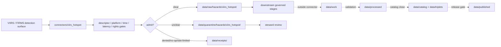

<!-- [KFM_META_BLOCK_V2]
doc_id: kfm://doc/connectors-viirs-hotspot-readme
title: connectors/viirs_hotspot/ — VIIRS Hotspot Connector Lane
type: readme
version: v0.1
status: draft
owners: OWNER_TBD — Connector steward · Source steward · NOAA steward · NASA/FIRMS steward · Data steward · Validation steward · Docs steward
created: 2026-06-20
updated: 2026-06-20
policy_label: public; flat-lane; satellite-detection; thermal-anomaly; source-admission-only; raw-quarantine-only
related:
  - ../README.md
  - ../../docs/sources/catalog/noaa/viirs-hotspot.md
  - ../../docs/sources/catalog/nasa/nasa-firms.md
  - ../../data/registry/sources/
  - ../../data/raw/
  - ../../data/quarantine/
  - ../../data/receipts/
  - ../../data/proofs/
  - ../../policy/rights/
  - ../../policy/sensitivity/
  - ../../release/
tags: [kfm, connectors, viirs, hotspot, firms, thermal-anomaly, satellite, source-admission, raw, quarantine, receipts, governance]
notes:
  - "Draft flat connector lane for VIIRS hotspot / thermal-anomaly source intake and admission helpers."
  - "Placement is draft / ADR-class: NOAA satellite ownership, NASA FIRMS distribution, and flat connector path convention remain NEEDS VERIFICATION unless ratified by Directory Rules or ADR."
  - "Dominant anti-collapse: a detection record is not the same as a downstream interpreted event."
  - "NRT and Standard products, platform, scan time, confidence, FRP, day/night flag, pixel footprint, and dataset version must be preserved."
  - "Connector output may enter raw or quarantine admission lanes only."
[/KFM_META_BLOCK_V2] -->

<a id="top"></a>

# VIIRS Hotspot Connector Lane

> Draft connector boundary for VIIRS hotspot / thermal-anomaly source material. This lane admits satellite detection records; it does not decide downstream interpretation, public artifact status, or release state.

<p>
  
  
  
  
  
</p>

`connectors/viirs_hotspot/`

## Quick jumps

[Status](#status) · [Scope](#scope) · [Repo fit](#repo-fit) · [Accepted inputs](#accepted-inputs) · [Exclusions](#exclusions) · [Admission model](#admission-model) · [Source-role discipline](#source-role-discipline) · [Detection discipline](#detection-discipline) · [Lifecycle sketch](#lifecycle-sketch) · [Authority boundary](#authority-boundary) · [Evidence basis](#evidence-basis) · [Validation](#validation) · [Rollback](#rollback) · [Definition of done](#definition-of-done)

---

## Status

> [!IMPORTANT]
> **Status:** `draft` / `NEEDS VERIFICATION`  
> **Owner:** `OWNER_TBD`  
> **Path:** `connectors/viirs_hotspot/`  
> **Mode:** flat connector lane candidate  
> **Truth posture:** `CONFIRMED` file path and README content; connector code, source descriptors, endpoint configuration, fixtures, tests, CI wiring, emitted receipts, and release behavior remain `NEEDS VERIFICATION`.

---

## Scope

`connectors/viirs_hotspot/` is a draft flat connector lane for VIIRS hotspot / thermal-anomaly source intake and admission helpers.

This folder may contain connector-local documentation, descriptor-gated client helpers, distribution manifest helpers, platform/latency helpers, hotspot record parsers, FRP/confidence/day-night metadata helpers, pixel-footprint and geolocation helpers, dataset-version helpers, provenance/digest helpers, no-network fixture pointers, and raw/quarantine handoff adapters for approved source material.

It must not become VIIRS product doctrine, NASA FIRMS product doctrine, NOAA source-family doctrine, NASA source-family doctrine, downstream interpretation authority, SourceDescriptor authority, rights policy authority, sensitivity policy authority, schema authority, catalog/triplet authority, proof authority, release authority, public API behavior, public UI behavior, public artifact authority, or publication authority.

---

## Repo fit

```text
connectors/
└── viirs_hotspot/
    └── README.md
```

Related responsibility roots:

```text
connectors/viirs_hotspot/                 # this draft flat VIIRS hotspot connector lane
docs/sources/catalog/noaa/viirs-hotspot.md # NOAA-side VIIRS product page
docs/sources/catalog/nasa/nasa-firms.md   # NASA FIRMS product page
data/registry/sources/                    # source descriptors and activation state
data/raw/                                 # raw staged source outputs by owning domain
data/quarantine/                          # held material requiring review
data/receipts/                            # ingest, checksum, query, supersession, and review receipts
data/proofs/                              # EvidenceBundles and proof packs
policy/rights/                            # source-use and attribution review
policy/sensitivity/                       # release review
release/                                  # release decisions and rollback state
```

> [!NOTE]
> Current repo evidence places VIIRS hotspot doctrine under `docs/sources/catalog/noaa/viirs-hotspot.md` while NASA FIRMS also documents active-detection distribution. This README does not settle NOAA-vs-NASA family placement or connector-home convention.

---

## Accepted inputs

| Accepted item | Required posture |
|---|---|
| Source-reference manifest | Preserve VIIRS/FIRMS product identity, descriptor reference, source URL, retrieval/import time, rights posture, review posture, and digest. |
| Endpoint/query manifest | Preserve endpoint family, query parameters, time window, dataset/version, response status, and digest. |
| Hotspot record helper | Preserve latitude/longitude, acquisition date/time, platform, confidence, FRP, brightness fields, day/night flag, and version. |
| Latency helper | Preserve NRT vs Standard/reprocessed status and supersession pointers where applicable. |
| Pixel-footprint helper | Preserve pixel center, footprint/resolution fields, geolocation caveats, and transform state. |
| Cross-product note | Record joins as downstream context only; do not merge source roles here. |
| Test references | Point to owning fixture/test roots; fixtures do not become source authority. |

---

## Exclusions

| Do not store here | Correct home |
|---|---|
| VIIRS product doctrine | `../../docs/sources/catalog/noaa/viirs-hotspot.md` |
| NASA FIRMS product doctrine | `../../docs/sources/catalog/nasa/nasa-firms.md` |
| Authoritative SourceDescriptor records | `../../data/registry/sources/` |
| Rights or sensitivity rules | `../../policy/rights/`, `../../policy/sensitivity/` |
| Downstream interpreted products | Downstream governed evidence/release lanes after review |
| Receipts or proof packs as authority | `../../data/receipts/`, `../../data/proofs/` |
| Processed records | `../../data/processed/` |
| Catalog or triplet records | `../../data/catalog/`, `../../data/triplets/` |
| Public artifacts | `../../data/published/` after governed release |
| Public API or UI behavior | governed application roots after verification |

---

## Admission model

VIIRS hotspot source material must be admitted detection-first, platform-first, timestamp-first, latency-first, source-role-first, rights-first, and review-aware.

| Concern | Required connector posture |
|---|---|
| Source identity | Preserve VIIRS/FIRMS product identity, descriptor reference, source URL/reference, retrieval time, rights posture, citation posture, and digest. |
| Detection identity | Preserve detection record identity, acquisition timestamp, platform, confidence, FRP, day/night flag, and dataset version. |
| Source role | Preserve observation/candidate/aggregate distinctions by source surface and latency class. |
| Latency state | Preserve NRT vs Standard/reprocessed status and supersession relationship. |
| Geometry | Preserve pixel center, footprint/resolution metadata, geolocation caveats, and transform state. |
| Publication | No connector output is public. Publication is a separate governed transition outside this folder. |

---

## Source-role discipline

VIIRS hotspot source material is detection evidence.

| Surface | Connector rule |
|---|---|
| Standard VIIRS hotspot | Treat as observation of a thermal-anomaly detection. |
| NRT VIIRS hotspot | Treat as candidate detection pending later disposition/supersession. |
| FRP/confidence fields | Treat as contextual detection metadata, not final event size. |
| Aggregated clusters | Treat as aggregate/derived context outside raw connector output. |
| Corroborating surfaces | Keep as separate source surfaces with governed downstream joins. |

---

## Detection discipline

- A detection record is not the same as a downstream interpreted event.
- A pixel center is not an exact event location.
- FRP is not area or final event size.
- NRT and Standard/reprocessed records must remain distinguishable.
- Platform, scan time, confidence, day/night flag, dataset version, and extraction time are load-bearing.

---

## Lifecycle sketch



Connector code admits, quarantines, denies, or records source probes. It does not decide downstream interpretation, public artifact status, public API behavior, or release state.

---

## Authority boundary

```text
OUTPUT LIMIT:
  data/raw/hazards/viirs_hotspot/<run_id>/
  data/quarantine/hazards/viirs_hotspot/<run_id>/
  data/receipts/<run_id>/              # run/probe evidence, not proof closure

NOT HERE:
  VIIRS product doctrine
  FIRMS product doctrine
  downstream interpretation authority
  SourceDescriptor authority
  rights or sensitivity policy
  processed records
  catalog records
  triplet records
  receipts / proofs as publication authority
  release decisions
  public API behavior
  public UI behavior
```

---

## Evidence basis

| Source | Status | Supports | Limits |
|---|---|---|---|
| `docs/sources/catalog/noaa/viirs-hotspot.md` | `CONFIRMED` | VIIRS product identity, NOAA/NASA placement issue, thermal-anomaly detection posture, NRT/Standard distinction, platform metadata, FRP/confidence caveats, and public-boundary posture. | Does not prove connector implementation exists. |
| `docs/sources/catalog/nasa/nasa-firms.md` | `CONFIRMED` | FIRMS active-detection framing, candidate-detection posture, NRT/reprocessed distinction, and public-boundary posture. | Does not settle VIIRS connector placement. |
| `connectors/viirs_hotspot/README.md` before this edit | `CONFIRMED` | Target file existed but was blank. | No implementation proof. |

---

## Validation

Before relying on this connector, verify:

- `connectors/viirs_hotspot/` placement is ratified or recorded in the drift/open-question register;
- NOAA/NASA/FIRMS source-family placement is resolved or recorded as open ADR-class drift;
- SourceDescriptor records exist and validate;
- current endpoint behavior, access constraints, cadence/freshness, dataset versions, rate limits, key requirements, and rights terms are verified;
- platform, timestamp, latency class, confidence, FRP, day/night, pixel-footprint, and source-role gates are implemented;
- detection/interpretation, FRP/area, pixel-center/location, and NRT/Standard collapse are blocked;
- no-network fixtures exist for tests;
- run receipts are emitted for successful, failed, denied, skipped, no-op, and rate-limited probes;
- outputs are limited to raw or quarantine admission lanes;
- downstream work, processed, catalog, triplet, proof, and release artifacts are produced only outside connectors;
- public clients do not read connector outputs directly.

---

## Rollback

Rollback is required if this README creates parallel product authority, misstates canonical connector placement, weakens detection/interpretation separation, implies endpoint activation without tests, or conflicts with an accepted ADR.

Rollback target: initial blank file content SHA `8b137891791fe96927ad78e64b0aad7bded08bdc`.

---

## Definition of done

- [ ] Owners are confirmed and `OWNER_TBD` is replaced.
- [ ] Connector placement and NOAA/NASA/FIRMS family convention are resolved or recorded as open drift.
- [ ] Actual connector contents are inventoried.
- [ ] SourceDescriptor IDs, product identities, source roles, rights, sensitivity, cadence, endpoint behavior, platform metadata, latency class, dataset version, and activation state are verified.
- [ ] Tests prevent detection/interpretation collapse, NRT/Standard collapse, FRP/area collapse, pixel-center/location collapse, rights bypass, sensitivity bypass, and release misuse.
- [ ] Outputs are verified to enter raw or quarantine admission lanes only.
- [ ] Run receipts exist for successful, failed, denied, skipped, no-op, and rate-limited source probes.
- [ ] No source-family, product, domain, processed, catalog, triplet, published, release, schema, policy, proof, registry, fixture, API, UI, or public-claim authority lives here.
- [ ] Tests, fixtures, and CI behavior are verified or marked `NEEDS VERIFICATION`.

---

## Status summary

`connectors/viirs_hotspot/` is a draft flat VIIRS hotspot source-admission lane. It is not the canonical VIIRS connector home unless ratified. It is not VIIRS product doctrine, NASA FIRMS product doctrine, downstream interpretation authority, SourceDescriptor authority, policy authority, schema authority, catalog/triplet authority, proof closure, release authority, public map authority, public API behavior, public UI behavior, or pipeline authority.

<p align="right"><a href="#top">Back to top</a></p>
