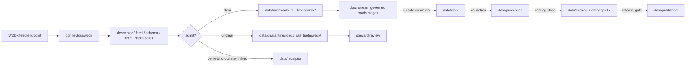

<!-- [KFM_META_BLOCK_V2]
doc_id: kfm://doc/connectors-wzdx-readme
title: connectors/wzdx/ — WZDx Connector Lane
type: readme
version: v0.1
status: draft
owners: OWNER_TBD — Connector steward · Source steward · USDOT/FHWA steward · Roads/Rail/Trade steward · Hazards steward · Data steward · Validation steward · Docs steward
created: 2026-06-20
updated: 2026-06-20
policy_label: public; flat-lane; work-zone-data; near-real-time; schema-version-gated; source-admission-only; raw-quarantine-only
related:
  - ../README.md
  - ../../docs/sources/catalog/usdot/wzdx.md
  - ../../docs/sources/catalog/usdot/README.md
  - ../../docs/domains/roads-rail-trade/README.md
  - ../../docs/domains/hazards/README.md
  - ../../data/registry/sources/
  - ../../data/raw/
  - ../../data/quarantine/
  - ../../data/receipts/
  - ../../data/proofs/
  - ../../policy/rights/
  - ../../policy/sensitivity/
  - ../../release/
tags: [kfm, connectors, wzdx, usdot, fhwa, work-zone-data, roadworks, roads-rail-trade, hazards, near-real-time, schema-gated, source-admission, raw, quarantine, receipts, governance]
notes:
  - "Draft flat connector lane for WZDx source intake and admission helpers."
  - "Placement is draft / ADR-class: WZDx standard origin, feed origin, and connector-home convention remain NEEDS VERIFICATION unless ratified by Directory Rules or ADR."
  - "WZDx is a standard, not a publisher; individual feeds must be admitted through feed-specific SourceDescriptor records."
  - "Schema version, feed ID, event ID, update time, geometry, lane impact fields, and debounce/supersession receipts are gate-critical."
  - "Connector output may enter raw or quarantine admission lanes only."
[/KFM_META_BLOCK_V2] -->

<a id="top"></a>

# WZDx Connector Lane

> Draft connector boundary for Work Zone Data Exchange source material. This lane admits WZDx feed records; it does not decide road-network truth, traveler guidance, incident authority, lane-impact policy, public API behavior, or release state.

<p>
  
  
  
  
  
  
</p>

`connectors/wzdx/`

## Quick jumps

[Status](#status) · [Scope](#scope) · [Repo fit](#repo-fit) · [Accepted inputs](#accepted-inputs) · [Exclusions](#exclusions) · [Admission model](#admission-model) · [Standard-vs-feed discipline](#standard-vs-feed-discipline) · [Schema and temporal discipline](#schema-and-temporal-discipline) · [Lifecycle sketch](#lifecycle-sketch) · [Authority boundary](#authority-boundary) · [Evidence basis](#evidence-basis) · [Validation](#validation) · [Rollback](#rollback) · [Definition of done](#definition-of-done)

---

## Status

> [!IMPORTANT]
> **Status:** `draft` / `NEEDS VERIFICATION`  
> **Owner:** `OWNER_TBD`  
> **Path:** `connectors/wzdx/`  
> **Mode:** flat connector lane candidate  
> **Truth posture:** `CONFIRMED` file path and README content; connector code, source descriptors, endpoint configuration, fixtures, tests, CI wiring, emitted receipts, and release behavior remain `NEEDS VERIFICATION`.

---

## Scope

`connectors/wzdx/` is a draft flat connector lane for WZDx feed intake and admission helpers.

This folder may contain connector-local documentation, descriptor-gated client helpers, feed-discovery notes, schema-version guards, feed metadata parsers, event/road-event parsers, geometry and temporal metadata helpers, debounce/supersession helpers, provenance/digest helpers, no-network fixture pointers, and raw/quarantine handoff adapters for approved WZDx source material.

It must not become WZDx product doctrine, USDOT/FHWA source-family doctrine, state-DOT feed doctrine, Roads/Rail/Trade doctrine, Hazards doctrine, road-network truth, incident authority, traveler guidance, lane-impact policy, SourceDescriptor authority, rights policy authority, sensitivity policy authority, schema authority, catalog/triplet authority, proof authority, release authority, public API behavior, public UI behavior, public map authority, or publication authority.

---

## Repo fit

```text
connectors/
└── wzdx/
    └── README.md
```

Related responsibility roots:

```text
connectors/wzdx/                          # this draft WZDx connector lane
docs/sources/catalog/usdot/wzdx.md        # WZDx product page
docs/sources/catalog/usdot/               # USDOT source-family docs
docs/domains/roads-rail-trade/            # roads / rail / trade domain context
docs/domains/hazards/                     # secondary hazard-context consumers
data/registry/sources/                    # standard/feed descriptors and activation state
data/raw/                                 # raw staged source outputs by owning domain
data/quarantine/                          # held material requiring review
data/receipts/                            # ingest, schema, debounce, supersession, and review receipts
data/proofs/                              # EvidenceBundles and proof packs
policy/rights/                            # source-use and attribution review
policy/sensitivity/                       # join and release review
release/                                  # release decisions and rollback state
```

---

## Accepted inputs

| Accepted item | Required posture |
|---|---|
| Standard-reference manifest | Preserve WZDx spec identity, spec version, descriptor reference, review posture, and digest. |
| Feed-reference manifest | Preserve feed publisher, feed URL/reference, retrieval/import time, rights posture, review posture, and digest. |
| Endpoint/query manifest | Preserve query scope, response status, timestamp, source feed ID, and digest. |
| Event parser helper | Preserve WZDx event/work-zone ID, update timestamp, road names/refs, direction, geometry, restrictions/impacts, and feed version. |
| Schema-version helper | Fail closed when schema version is missing, unsupported, or unvalidated. |
| Debounce/supersession helper | Preserve prior value, replacement value, debounce window, and receipt lineage. |
| Test references | Point to owning fixture/test roots; fixtures do not become source authority. |

---

## Exclusions

| Do not store here | Correct home |
|---|---|
| WZDx product doctrine | `../../docs/sources/catalog/usdot/wzdx.md` |
| USDOT/FHWA source-family doctrine | `../../docs/sources/catalog/usdot/` |
| Roads/Rail/Trade or Hazards doctrine | `../../docs/domains/roads-rail-trade/`, `../../docs/domains/hazards/` |
| Authoritative SourceDescriptor records | `../../data/registry/sources/` |
| WZDx schema authority | schema/contract roots after accepted placement |
| Rights or sensitivity rules | `../../policy/rights/`, `../../policy/sensitivity/` |
| Processed road-event records | `../../data/processed/` |
| Catalog or triplet records | `../../data/catalog/`, `../../data/triplets/` |
| Public artifacts | `../../data/published/` after governed release |
| Public API or UI behavior | governed application roots after verification |

---

## Admission model

WZDx source material must be admitted standard-first, feed-first, schema-version-first, event-identity-first, temporal-first, rights-first, and review-aware.

| Concern | Required connector posture |
|---|---|
| Standard identity | Preserve WZDx spec version and validator disposition separately from feed identity. |
| Feed identity | Preserve feed publisher, feed URL/reference, retrieval time, descriptor reference, rights posture, and digest. |
| Event identity | Preserve work-zone/event ID, update timestamp, geometry, road reference fields, restrictions/impacts, and feed version. |
| Schema gate | Fail closed when version, required fields, geometry, or validator result is invalid or unknown. |
| Temporal cadence | Preserve feed timestamp, event start/end/update times, freshness window, debounce window, and supersession relationship. |
| Publication | No connector output is public. Publication is a separate governed transition outside this folder. |

---

## Standard-vs-feed discipline

- WZDx is a standard, not a publisher.
- FHWA/USDOT standard identity and state/MPO feed identity must remain separate.
- A valid standard does not imply any particular feed is authoritative, current, complete, or released.
- Each admitted feed requires its own descriptor, cadence, rights, review state, and rollback target.
- Kansas-specific feed placement remains a family/cross-listing question unless settled by ADR or SourceDescriptor policy.

---

## Schema and temporal discipline

- WZDx schema version is load-bearing.
- Unsupported or unknown schema versions must fail closed.
- High-cadence feeds require debounce/supersession receipts.
- Feed freshness and event timestamps must be preserved separately.
- Geometry, road references, direction, closure/restriction fields, and lane-impact fields are source claims requiring downstream validation.
- Connector output is not traveler guidance or an operational instruction.

---

## Lifecycle sketch



Connector code admits, quarantines, denies, or records source probes. It does not decide road-network truth, public artifact status, public API behavior, or release state.

---

## Authority boundary

```text
OUTPUT LIMIT:
  data/raw/roads_rail_trade/wzdx/<run_id>/
  data/quarantine/roads_rail_trade/wzdx/<run_id>/
  data/receipts/<run_id>/              # run/probe evidence, not proof closure

NOT HERE:
  WZDx product doctrine
  USDOT/FHWA source-family doctrine
  road-network truth
  traveler guidance
  incident authority
  lane-impact policy
  SourceDescriptor authority
  rights or sensitivity policy
  schema authority
  processed records
  catalog records
  triplet records
  receipts / proofs as publication authority
  release decisions
  public API behavior
  public UI behavior
```

---

## Evidence basis

| Source | Status | Supports | Limits |
|---|---|---|---|
| `docs/sources/catalog/usdot/wzdx.md` | `CONFIRMED` | WZDx product identity, standard-vs-feed distinction, spec-version moving-target posture, fail-closed schema gate, feed publisher framing, near-real-time cadence, and connector path. | Does not prove connector implementation exists. |
| `connectors/wzdx/README.md` before this edit | `CONFIRMED` | Target file existed but was blank. | No implementation proof. |

---

## Validation

Before relying on this connector, verify:

- `connectors/wzdx/` placement is ratified or recorded in the drift/open-question register;
- standard-level and feed-level SourceDescriptor records exist and validate;
- current feed URLs, spec version, endpoint behavior, access constraints, cadence/freshness, rate limits, and rights terms are verified;
- schema-version, required-field, geometry, event ID, timestamp, debounce, and supersession gates are implemented;
- standard/feed, feed/event, raw/processed, and connector/release boundaries are enforced;
- no-network fixtures exist for tests;
- run receipts are emitted for successful, failed, denied, skipped, no-op, and rate-limited probes;
- outputs are limited to raw or quarantine admission lanes;
- downstream work, processed, catalog, triplet, proof, and release artifacts are produced only outside connectors;
- public clients do not read connector outputs directly.

---

## Rollback

Rollback is required if this README creates parallel product authority, misstates canonical connector placement, weakens schema-version gates, implies feed activation without tests, or conflicts with an accepted ADR.

Rollback target: initial blank file content SHA `8b137891791fe96927ad78e64b0aad7bded08bdc`.

---

## Definition of done

- [ ] Owners are confirmed and `OWNER_TBD` is replaced.
- [ ] Connector placement and WZDx standard/feed convention are resolved or recorded as open drift.
- [ ] Actual connector contents are inventoried.
- [ ] SourceDescriptor IDs, spec version, feed IDs, source roles, rights, sensitivity, cadence, endpoint behavior, schema-version handling, and activation state are verified.
- [ ] Tests prevent standard/feed collapse, schema-version bypass, high-cadence debounce omission, connector/release collapse, rights bypass, sensitivity bypass, and release misuse.
- [ ] Outputs are verified to enter raw or quarantine admission lanes only.
- [ ] Run receipts exist for successful, failed, denied, skipped, no-op, and rate-limited source probes.
- [ ] No source-family, product, domain, processed, catalog, triplet, published, release, schema, policy, proof, registry, fixture, API, UI, or public-claim authority lives here.
- [ ] Tests, fixtures, and CI behavior are verified or marked `NEEDS VERIFICATION`.

---

## Status summary

`connectors/wzdx/` is a draft flat WZDx source-admission lane. It is not the canonical WZDx connector home unless ratified. It is not WZDx product doctrine, USDOT/FHWA source-family doctrine, road-network truth, traveler guidance, incident authority, lane-impact policy, SourceDescriptor authority, policy authority, schema authority, catalog/triplet authority, proof closure, release authority, public map authority, public API behavior, public UI behavior, or pipeline authority.

<p align="right"><a href="#top">Back to top</a></p>
