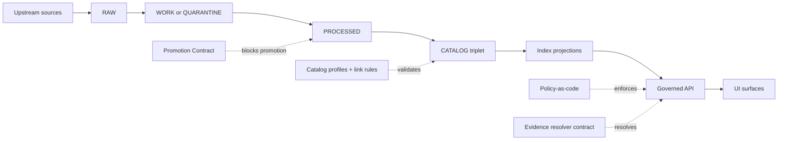

<!-- [KFM_META_BLOCK_V2]
doc_id: kfm://doc/b5e9f8c2-1e25-4f09-8a55-9201a05f9b2d
title: contracts/ — KFM contract surfaces (schemas, APIs, gates)
type: standard
version: v1
status: draft
owners: TBD
created: 2026-02-22
updated: 2026-02-22
policy_label: public
related:
  - ../docs/
  - ../schemas/
  - ../docs/templates/
  - ../docs/standards/
  - ../docs/governance/
tags: [kfm, contracts, governance, schema, api]
notes:
  - Contract-first + fail-closed: contracts define enforceable interfaces for data promotion and runtime access.
[/KFM_META_BLOCK_V2] -->

# `contracts/` — Contract surfaces for KFM
Contract-first • fail-closed • governed-by-default • evidence-first • time-aware

**Status:** draft • **Owners:** TBD (Eng + Governance)  
**Purpose:** Make KFM interfaces *explicit, versioned, and machine-validated* so that promotion + runtime behavior can’t drift.


---

## Navigation
- [Purpose](#purpose)
- [What is a contract artifact](#what-is-a-contract-artifact)
- [Non-negotiable invariants](#non-negotiable-invariants)
- [Contract surfaces in KFM](#contract-surfaces-in-kfm)
- [Directory layout](#directory-layout)
- [How to add or change a contract](#how-to-add-or-change-a-contract)
- [Validation and gates](#validation-and-gates)
- [Governance and safety](#governance-and-safety)
- [Glossary](#glossary)
- [Appendix](#appendix)

---

## Purpose
KFM treats “contracts” as **governance intent turned into enforceable behavior**.

This directory is intended to be the canonical home for **interface-defining artifacts** that MUST remain stable and testable across:
- ingestion → promotion (RAW → WORK/QUARANTINE → PROCESSED → CATALOG/TRIPLET)
- catalogs and provenance (DCAT + STAC + PROV) as runtime interfaces
- governed API surfaces (including stable error models + versioning rules)
- evidence resolution (EvidenceRef → EvidenceBundle)
- policy-as-code semantics shared between CI and runtime

> **Fail-closed posture:** if a required contract is missing, invalid, or ambiguous, the system MUST block promotion and/or refuse to serve affected data.

[Back to top](#navigation)

---

## What is a contract artifact
A **contract artifact** is a *machine-validated schema or specification* that defines an interface (examples: JSON Schema, OpenAPI, GraphQL SDL, UI configuration schema).  
Contracts are **versioned and honored by implementations** — no breaking changes without a version bump.

**Practical implication:** if you change a contract, you must also change:
- validations (schema + link checks)
- fixtures (known-good and known-bad)
- compatibility notes (what changed, what breaks)
- dependent code paths (pipeline, API, UI, Focus)

[Back to top](#navigation)

---

## Non-negotiable invariants
These are “guardrails” that contracts exist to *enforce*, not merely describe.

### Trust membrane
- **Clients/UI never access databases or object storage directly.**
- **Backend logic never bypasses repository interfaces** to talk directly to storage.
- **All access flows through governed APIs** applying policy, redaction, and logging.

Breaking this membrane breaks enforceability.

### Policy semantics must match in CI and runtime
Contracts that depend on policy (promotion gates, evidence resolution, download/export rules) must produce the **same outcomes** in:
- CI policy tests (merge gates)
- runtime API enforcement
- evidence resolver behavior

### Deterministic identity and hashing
Contract specs that are referenced by hash (e.g., `spec_hash`) should be **deterministically serialized** (canonical JSON) to prevent “hash drift”.

[Back to top](#navigation)

---

## Contract surfaces in KFM
KFM has several “contract surfaces.” Think of them as **interfaces between subsystems**.

| Surface | What it defines | Typical artifacts | Enforced where |
|---|---|---|---|
| Promotion Contract | Minimum gates to move a DatasetVersion into runtime | promotion manifest schema, gate checklist, run-receipt schema | CI + pipeline runner |
| Catalog Triplet | DCAT/STAC/PROV profiles + cross-link rules | profile docs, JSON Schemas, link rules | CI + catalog builders |
| Governed API | Endpoint set, response envelopes, error model, versioning policy | OpenAPI / schema docs, error schema | API gateway/server + CI |
| Evidence Resolver | EvidenceRef schemes and EvidenceBundle schema | evidence_bundle schema + fixtures | API + Focus Mode |
| Policy-as-code | Decisions + obligations + fixtures | Rego policies, decision fixtures | CI + API + resolver |
| Audit & receipts | Run receipts and audit ledger event shapes | receipt schema, audit entry schema | pipeline + API logs |

### Conceptual flow


[Back to top](#navigation)

---

## Directory layout
> **Note:** exact contents are repo-dependent. This is a **recommended** skeleton that keeps contracts versioned, testable, and reviewable.

```text
contracts/
├── README.md
├── _registry/                         # (PROPOSED) contract index + version map
│   ├── contracts.manifest.json        # list of contract packages + versions
│   └── contracts.lock.json            # digests/spec_hashes for reproducibility
├── promotion/                         # Promotion Contract + gates + templates
│   ├── promotion_manifest.schema.json
│   ├── run_receipt.schema.json
│   └── gates.md
├── catalogs/                          # DCAT/STAC/PROV profiles + link rules
│   ├── dcat.profile.md
│   ├── stac.profile.md
│   ├── prov.profile.md
│   └── cross_links.rules.yaml
├── api/                               # Governed API contracts
│   ├── openapi.v1.yaml
│   ├── error_model.schema.json
│   └── response_envelopes.schema.json
├── evidence/                           # EvidenceRef/EvidenceBundle contracts
│   ├── evidence_ref.schema.json
│   ├── evidence_bundle.schema.json
│   └── fixtures/
├── policy/                             # Policy-as-code contract artifacts
│   ├── rego/
│   └── fixtures/
└── tests/                              # Contract tests + link checks + QA invariants
    ├── contract_test_plan.md
    └── fixtures/
```

### Relationship to `schemas/` (if present)
Some repos store low-level JSON schemas under a top-level `schemas/` directory (e.g., `schemas/stac`, `schemas/dcat`, `schemas/prov`, `schemas/storynodes`).  
If that structure exists here, treat `contracts/` as:
- the **governance and registry layer** (versioning, fixtures, test plans, cross-link rules), and/or
- a consolidation target (move canonical contract artifacts here over time)

[Back to top](#navigation)

---

## How to add or change a contract
### 1) Decide the contract surface
- Promotion/pipeline gate?
- Catalog profile (DCAT/STAC/PROV)?
- API endpoint shape?
- Evidence resolver bundle shape?
- Policy decision and obligations?

### 2) Create or bump a version
Rules of thumb:
- **Backwards-compatible**: add optional fields; keep default behaviors stable.
- **Breaking**: bump the major version (or introduce `/api/v2` for API breaking changes).
- If you must support old+new concurrently, add dual-read adapters and a migration plan.

### 3) Include fixtures (required)
Every contract change must ship with:
- **known-good** examples that validate
- **known-bad** examples that fail for the right reasons

### 4) Add/extend contract tests
At minimum:
- schema validation
- cross-link validation (for triplet and evidence resolution)
- policy fixture checks (allow/deny + obligations)
- stable error model checks (policy-safe messages; no “ghost metadata” leaks)

### 5) Document the change
- What changed?
- Why?
- What breaks?
- Required follow-up changes (pipeline/API/UI)

> **Tip:** If your repo uses an “API contract extension” template, use it for endpoint changes so reviewers can reason about compatibility and policy impact.

[Back to top](#navigation)

---

## Validation and gates
Contracts are only valuable if they’re enforced.

### Minimum expected gates (promotion)
A dataset version promotion should be blocked unless required artifacts exist and validate, including:
- identity/versioning
- licensing/rights metadata
- sensitivity classification + redaction plan
- catalog triplet validation (DCAT+STAC+PROV)
- run receipt + checksums
- policy tests + contract tests

### Evidence resolver constraints (runtime)
Evidence resolution should:
- accept `EvidenceRef` or structured references
- apply policy and return allow/deny + obligations
- return an **EvidenceBundle** including policy, license, provenance, artifact digests, and an audit reference
- fail closed when unresolvable or unauthorized

<details>
<summary>Example: EvidenceBundle shape (illustrative)</summary>

```json
{
  "bundle_id": "sha256:bundle...",
  "dataset_version_id": "2026-02.abcd1234",
  "title": "Storm event record: 2026-02-19",
  "policy": {
    "decision": "allow",
    "policy_label": "public",
    "obligations_applied": []
  },
  "license": { "spdx": "CC-BY-4.0", "attribution": "Source org" },
  "provenance": { "run_id": "kfm://run/2026-02-20T12:00:00Z.abcd" },
  "artifacts": [
    { "href": "processed/events.parquet", "digest": "sha256:2222", "media_type": "application/x-parquet" }
  ],
  "checks": { "catalog_valid": true, "links_ok": true },
  "audit_ref": "kfm://audit/entry/123"
}
```
</details>

### Optional but high-value: graph invariants as contract tests
If you maintain a provenance/lineage graph, treat it as a last-line gate:
- missing attestations
- duplicate asset href collisions
- digest mismatches

These checks should run in CI before promotion.

[Back to top](#navigation)

---

## Governance and safety
Contracts must encode the “trust membrane” and sovereignty constraints, not bypass them.

### Licensing and rights are policy inputs
- Promotion should require license + rights holder metadata for every distribution.
- “Metadata-only reference” mode is allowed when you cannot mirror assets.
- Exports must include attribution and license text automatically.
- Story publishing should block if rights are unclear.

### Sensitive locations and restricted data
- Store precise geometries only in restricted datasets.
- Produce generalized public derivatives when allowed.
- Enforce policy at tile serving and download endpoints.
- Avoid leaking restricted existence through subtle 403/404 differences.

### Focus Mode: cite or abstain
Focus Mode is governed behavior:
- select admissible evidence based on policy
- construct an evidence bundle
- answer with citations **or abstain**
- log retrieval context (auditability)

[Back to top](#navigation)

---

## Glossary
- **Contract artifact:** machine-validated interface definition (schema/spec) that is versioned and enforced.
- **Promotion Contract:** the gate spec that controls movement into publishable/runtime surfaces.
- **Triplet:** DCAT (dataset metadata) + STAC (asset metadata) + PROV (lineage).
- **EvidenceRef:** stable reference to evidence (scheme-based) that can be resolved without guessing.
- **EvidenceBundle:** resolved evidence package including policy decision, license, provenance, artifacts, and audit ref.
- **PDP / PEP:** policy decision point / policy enforcement point.
- **Audit ref:** opaque identifier used for steward review and policy-safe debugging.

[Back to top](#navigation)

---

## Appendix
### Contract change checklist (copy/paste)
- [ ] Contract version bumped appropriately (or `/api/v2` introduced if breaking)
- [ ] Schema/spec validates (machine check)
- [ ] Fixtures updated: good + bad examples included
- [ ] Cross-link checks updated (DCAT ↔ STAC ↔ PROV ↔ artifacts)
- [ ] Policy fixtures updated (allow/deny + obligations)
- [ ] Error model remains policy-safe (no restricted existence leaks)
- [ ] Dependent implementations updated (pipeline/API/UI)
- [ ] Changelog / migration notes included
