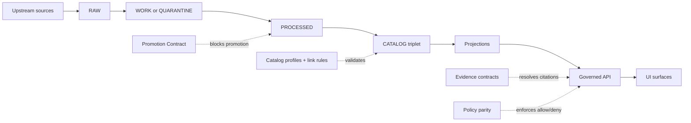

<!-- [KFM_META_BLOCK_V2]
doc_id: kfm://doc/b5e9f8c2-1e25-4f09-8a55-9201a05f9b2d
title: contracts/ — KFM contract surfaces (schemas, APIs, gates)
type: standard
version: v2
status: draft
owners: TBD (set via CODEOWNERS)
created: 2026-02-22
updated: 2026-02-27
policy_label: public
related:
  - ../README.md
  - ../.github/README.md
  - ../configs/README.md
  - ../docs/
  - ../policy/
tags:
  - kfm
  - contracts
  - governance
  - schema
  - api
  - evidence
  - promotion-contract
notes:
  - Contract-first + fail-closed: contracts define enforceable interfaces for data promotion and runtime access.
  - This README is fail-closed: repo-specific wiring (exact filenames, generators, emitted CI check names) remains UNKNOWN until verified in-repo.
  - Prefer versioned artifacts + fixtures + CI validation over “tribal knowledge.”
[/KFM_META_BLOCK_V2] -->

<a id="top"></a>

# `contracts/` — KFM contract surfaces
**Contract-first • fail-closed • governed-by-default • evidence-first • time-aware**

**Status:** draft • **Owners:** TBD via `CODEOWNERS`  
**Purpose:** Make KFM interfaces **explicit, versioned, and machine-validated** so promotion + runtime behavior can’t drift.


> [!IMPORTANT]
> **A contract is not documentation.**  
> A contract is a **machine-validated interface** with fixtures + tests. If a contract is missing/invalid/ambiguous, KFM must **block promotion** and/or **refuse to serve** affected data (policy-safe).

---

## Navigation

- [Truth status legend](#truth-status-legend)
- [Directory contract](#directory-contract)
- [What is a contract artifact](#what-is-a-contract-artifact)
- [Non-negotiable invariants](#non-negotiable-invariants)
- [Contract surfaces in KFM](#contract-surfaces-in-kfm)
- [Relationship to configs/ and policy/](#relationship-to-configs-and-policy)
- [Directory layout](#directory-layout)
- [How to add or change a contract](#how-to-add-or-change-a-contract)
- [Validation and gates](#validation-and-gates)
- [Governance and safety](#governance-and-safety)
- [Glossary](#glossary)
- [Appendix](#appendix)

---

## Truth status legend

This README uses explicit labels so we don’t “invent repo state”:

- **CONFIRMED (design):** required KFM posture (must hold regardless of stack)
- **UNKNOWN (repo):** not verified in this repository yet (treat as TODO; fail-closed)
- **PROPOSED:** recommended template/pattern (adopt only after verification)

> [!NOTE]
> Repo facts should graduate from **UNKNOWN → CONFIRMED (repo)** by attaching paths/snippets in PRs.

---

## Directory contract

This section satisfies the **Directory Documentation Standard** (purpose, where it fits, acceptable inputs, exclusions).

### Where this fits in the repo

`contracts/` is the system’s **trust membrane in file form**:
- CI uses `contracts/` to decide what’s promotable.
- Runtime services use `contracts/` to decide what’s servable.
- UIs and tools treat contracts as **authoritative interface definitions**, not suggestions.

Dependency direction (ideal):
- **Upstream inputs:** governance standards in `docs/` and policy posture in `policy/`
- **Downstream consumers:** pipelines, validators, catalog builders, governed API, evidence resolver, Focus Mode, UI SDKs

### Acceptable inputs

| Category | Examples | Why it belongs here |
|---|---|---|
| Interface schemas/specs | JSON Schema, OpenAPI, GraphQL SDL, protobuf | Defines externally visible shapes |
| Profiles + constraints | DCAT/STAC/PROV profiles, field requirements, cross-link rules | Makes catalogs enforceable |
| Evidence contracts | EvidenceRef scheme rules, EvidenceBundle schema | Enables cite-or-abstain guarantees |
| Promotion contracts | promotion manifest schema, run receipt schema, gate codes | Blocks unsafe promotion/serving |
| Fixtures | known-good / known-bad examples | Prevent “it validates but breaks” |
| Contract tests | schema validation, linkcheck, parity checks | Turns intent into enforcement |
| Version metadata | registries/locks/changelogs | Prevent drift + enable rollback |

### Exclusions (must not go here)

| Excluded | Put it elsewhere | Reason |
|---|---|---|
| Runtime code / business logic | `apps/`, `packages/`, `infra/` | Contracts define interfaces, not implementations |
| Secrets / tokens / credentials | secret manager / CI secrets | Contracts are reviewable and often public-ish |
| Large datasets or derived data | `data/` truth path zones | Keep contracts diff-friendly and small |
| Binary artifacts | release/build outputs | Contracts must be text + reviewable |
| “Docs only” explanations | `docs/` | If it can’t be tested/validated, it isn’t a contract |

<p align="right"><a href="#top">Back to top ↑</a></p>

---

## What is a contract artifact

A **contract artifact** is a *machine-validated schema or specification* that defines an interface.

Examples:
- OpenAPI for governed endpoints
- JSON Schema for promotion manifests / run receipts / EvidenceBundle
- Profile constraints for DCAT/STAC/PROV
- Cross-link rules that enforce resolvability (no guessing)

**Practical implication:** If you change a contract, you must also change:
- validation and tests
- fixtures (known-good and known-bad)
- compatibility notes (what changes, what breaks)
- dependent implementations (pipeline/API/UI/Focus)

> [!IMPORTANT]
> A contract change without fixtures is **code without tests**. Treat as merge-blocking.

<p align="right"><a href="#top">Back to top ↑</a></p>

---

## Non-negotiable invariants

These are **CONFIRMED (design)** and apply to all contract surfaces.

### 1) Trust membrane
- Clients/UI **never** access databases/object storage directly.
- Backend logic **never** bypasses repository interfaces to reach storage.
- All access flows through governed APIs that apply **policy + obligations + audit** consistently.

### 2) Policy semantics parity (CI == runtime)
Contracts that depend on policy (promotion gates, evidence resolution, exports) must produce the **same outcomes** in:
- CI policy tests (merge gates)
- runtime enforcement (API + evidence resolver)
- Focus Mode citation verification

If CI and runtime disagree, CI guarantees are meaningless → **release blocker**.

### 3) Deterministic identity and hashing
Anything used in dataset identity (`spec_hash`, version IDs, locks) must be deterministically serialized and versioned. Prevent “hash drift.”

### 4) No silent looseness
- Removing a required field/gate or weakening validation is a breaking change.
- Ambiguity defaults to **deny** (fail-closed), then tighten the contract.

<p align="right"><a href="#top">Back to top ↑</a></p>

---

## Contract surfaces in KFM

Treat these as the core interface boundaries KFM must keep stable.

| Surface | What it defines | Typical artifacts | Enforced where |
|---|---|---|---|
| **Promotion Contract** | Gates A–F for promoting DatasetVersions | promotion manifest schema, run receipt schema, gate codes | CI + pipeline runner |
| **Catalog triplet** | DCAT/STAC/PROV profiles + cross-link rules | profile docs/schemas, link rules | CI + catalog builders |
| **Governed API** | endpoint set, response envelopes, error model, versioning | OpenAPI, error schemas | API services + CI |
| **Evidence resolver** | EvidenceRef schemes + EvidenceBundle shape | EvidenceRef rules, EvidenceBundle schema + fixtures | API + resolver |
| **Policy-as-code interface** | decision shapes + obligations + parity fixtures | fixtures, decision schema (rules may live in `policy/`) | CI + runtime |
| **Audit & receipts** | run receipts + audit entry shapes | receipt schemas, audit schema | pipelines + API |

### Conceptual flow



<p align="right"><a href="#top">Back to top ↑</a></p>

---

## Relationship to configs/ and policy/

To avoid duplicate “sources of truth,” use this division of labor:

- `contracts/` = **canonical interface definitions**
  - schemas, profiles, OpenAPI, cross-link rules
  - fixtures and contract tests that enforce interfaces

- `configs/` = **governed wiring / selection / knobs**
  - which profile set is active
  - gate thresholds and environment-safe defaults
  - registry of configs and validators
  - (No secrets; no raw restricted data)

- `policy/` = **policy engine source** (rules and bundles)
  - policy code (e.g., Rego) + tests + bundles
  - parity fixtures may live in `configs/policy/fixtures/` or `contracts/policy/fixtures/` depending on repo convention,
    but outcomes MUST match CI and runtime.

> [!IMPORTANT]
> If a contract is required for promotion or serving, do **not** duplicate it across directories.
> Choose one canonical location and reference it.

<p align="right"><a href="#top">Back to top ↑</a></p>

---

## Directory layout

> [!NOTE]
> This is a **PROPOSED** expansion aligned to the earlier repo layout (`openapi/`, `schemas/`, `profiles/`, `vocab/`).  
> Keep repo-specific filenames **UNKNOWN (repo)** until verified on-branch.

```text
contracts/
├─ README.md
├─ CHANGELOG.md                           # OPTIONAL: contract changes + migration notes
│
├─ registry/                              # PROPOSED: contract index + locks (audit + reproducibility)
│  ├─ contracts.manifest.v1.json          # What contracts exist + versions + owners + validators
│  ├─ contracts.lock.v1.json              # Deterministic digests of contract artifacts (spec_hash posture)
│  └─ schemas/                            # Schema for the manifest/lock
│     ├─ kfm.contract_manifest.v1.schema.json
│     └─ kfm.contract_lock.v1.schema.json
│
├─ openapi/                               # Governed API contracts (versioned)
│  ├─ v1/
│  │  ├─ openapi.yaml
│  │  ├─ error_model.schema.json
│  │  └─ response_envelopes.schema.json
│  └─ v2/                                 # OPTIONAL: only when breaking changes require it
│     └─ openapi.yaml
│
├─ schemas/                               # JSON Schemas (or equivalent) for contract surfaces
│  ├─ promotion/
│  │  ├─ promotion_manifest.v1.schema.json
│  │  ├─ run_receipt.v1.schema.json
│  │  └─ audit_entry.v1.schema.json
│  ├─ evidence/
│  │  ├─ evidence_ref.v1.schema.json
│  │  └─ evidence_bundle.v1.schema.json
│  ├─ ui/
│  │  ├─ view_state.v1.schema.json
│  │  └─ layer_config.v1.schema.json
│  └─ catalogs/
│     ├─ dcat.v1.schema.json              # if you vendor/define it here (else reference external schema)
│     ├─ stac.v1.schema.json
│     └─ prov.v1.schema.json
│
├─ profiles/                              # Governed profiles/constraints (what “valid” means in KFM)
│  ├─ catalogs/
│  │  ├─ dcat.profile.v1.yaml             # Required fields + kfm extensions + validation rules
│  │  ├─ stac.profile.v1.yaml
│  │  ├─ prov.profile.v1.yaml
│  │  └─ crosslinks.profile.v1.yaml       # DCAT↔STAC↔PROV link rules
│  ├─ promotion/
│  │  └─ promotion_contract.v1.yaml       # Gates A–F requirements (high-level) + required checks mapping
│  └─ evidence/
│     └─ evidence_resolver.profile.v1.yaml# Resolution rules + fail-closed requirements
│
├─ vocab/                                 # Controlled vocabularies (versioned)
│  ├─ policy_labels.v1.yaml
│  ├─ themes.v1.yaml
│  ├─ artifact_types.v1.yaml
│  └─ citation_kinds.v1.yaml
│
├─ linkcheck/                             # Cross-link and resolvability rules (may also live under profiles/)
│  ├─ evidence_ref_schemes.v1.yaml
│  ├─ catalog_crosslinks.v1.yaml
│  ├─ artifact_digest_rules.v1.yaml
│  └─ url_allowlist.v1.yaml               # if url:// is allowed at all
│
├─ fixtures/                              # Known-good / known-bad artifacts (required for contract changes)
│  ├─ promotion/
│  ├─ evidence/
│  ├─ catalogs/
│  └─ api/
│
└─ tests/                                 # Contract tests (schema validate + linkcheck + parity checks)
   ├─ contract_test_plan.md
   ├─ validate_schemas.testplan.md
   ├─ validate_crosslinks.testplan.md
   └─ fixtures/                           # test-only inputs if needed (bounded + synthetic)
```

> [!TIP]
> If your repo prefers `contracts/tests` to be executable code, keep the *plans* here and put implementations under `tools/validators/` (or repo-standard tooling), but ensure CI runs them as required checks.

<p align="right"><a href="#top">Back to top ↑</a></p>

---

## How to add or change a contract

### Step 1 — Choose the contract surface
- Promotion? Catalog? API? Evidence? UI view state? Audit?

### Step 2 — Decide whether this is breaking
- **Backwards-compatible:** add optional fields; preserve defaults
- **Breaking:** bump major version (or add `openapi/v2/`) and document a migration plan

### Step 3 — Add fixtures (required)
Every contract change MUST include:
- at least one **known-good** example
- at least one **known-bad** example that fails for the correct reason

### Step 4 — Add/extend contract tests (required)
At minimum:
- schema validation
- cross-link validation (catalog triplet + evidence resolution)
- policy parity outcomes for any allow/deny behavior the contract touches
- stable error model checks (policy-safe)

### Step 5 — Update registry/lock (if used)
If you use `contracts/registry/`:
- add the contract/version entry to `contracts.manifest.v1.json`
- update `contracts.lock.v1.json` digests deterministically (audit posture)

### Step 6 — Document the change
- what changed and why
- what breaks (if anything)
- required downstream updates (pipeline/API/UI)
- rollback plan (how to revert safely)

> [!IMPORTANT]
> A contract change with no migration notes is not “agile,” it’s “unreproducible.”

<p align="right"><a href="#top">Back to top ↑</a></p>

---

## Validation and gates

Contracts are only valuable if they’re **enforced continuously**.

### Minimum CI gates (required posture)

- Validate all schemas in `contracts/schemas/**`
- Validate all profiles in `contracts/profiles/**`
- Validate all fixtures (known-good must pass; known-bad must fail)
- Validate link rules (DCAT↔STAC↔PROV; EvidenceRef resolvability)
- Validate policy-safe error model invariants
- **Anti-skip:** a single always-runs “gate summary” job fails if any required validator didn’t run

> [!WARNING]
> Required gates MUST NOT be bypassable by `paths:` filters or conditional workflow logic.
> Prefer one required status check (`contracts / gate-summary`) for branch protection/rulesets.

### Promotion Contract A–F mapping (contract responsibility)

| Gate | Contract artifacts typically involved |
|---|---|
| A Identity/versioning | promotion contract profile, manifest schema fields for `spec_hash` |
| B Rights/licensing | license fields required by schemas/profiles; vocab where needed |
| C Sensitivity | policy label vocab + obligations/evidence constraints |
| D Catalog triplet | DCAT/STAC/PROV profile sets + cross-link rules |
| E Receipts/checksums | run receipt schema + artifact digest rules |
| F Policy/contracts | policy decision schema (if used) + parity fixtures + OpenAPI/schema checks |

<p align="right"><a href="#top">Back to top ↑</a></p>

---

## Governance and safety

### Rights and licensing are enforceable
- Promotion requires explicit license + attribution requirements per distribution.
- “Metadata-only reference” is allowed when assets cannot be mirrored.
- Exports must be rights-aware by default and policy-safe.

### Sensitive locations and restricted data
- Store precise geometries in restricted datasets only.
- Publish generalized public derivatives when allowed.
- Never leak restricted existence via subtle error behavior.

### Focus Mode: cite-or-abstain depends on contracts
- EvidenceRefs must be resolvable without guessing.
- EvidenceBundles must carry policy decision + obligations + provenance references.
- Citation verification is a hard gate; contracts enable that verification.

<p align="right"><a href="#top">Back to top ↑</a></p>

---

## Glossary

- **Contract artifact:** machine-validated interface definition with versioning + fixtures + tests.
- **Profile:** additional constraints that define “valid” for KFM (beyond base schemas).
- **Promotion Contract:** gates A–F controlling what can reach runtime surfaces.
- **Triplet:** DCAT (dataset), STAC (assets), PROV (lineage).
- **EvidenceRef:** stable reference (scheme-based) resolvable to an EvidenceBundle.
- **EvidenceBundle:** resolved evidence record including policy, license, provenance, artifact digests, and audit reference.
- **Policy-safe errors:** error behavior that prevents inferring restricted existence.

---

## Appendix

### Contract change checklist (copy/paste)

- [ ] Contract version bumped appropriately (or `openapi/v2` introduced if breaking)
- [ ] Schema/spec validates
- [ ] Fixtures updated (known-good + known-bad)
- [ ] Cross-link rules updated (DCAT↔STAC↔PROV↔artifacts; EvidenceRef resolvability)
- [ ] Policy parity outcomes preserved (or explicitly changed with fixtures + review)
- [ ] Error model remains policy-safe (no restricted inference)
- [ ] Dependent implementations updated (pipeline/API/UI/Focus)
- [ ] Migration notes + rollback plan included

<p align="right"><a href="#top">Back to top ↑</a></p>
