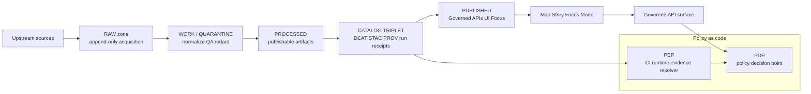

# Contracts
Canonical, machine-validated contract surfaces for KFM (schemas, catalogs, policy, APIs, and evidence resolution).

**Status:** Draft (baseline) • **Owners:** Steward (governance) + Platform/API + Data Engineering (assign via `CODEOWNERS`)  
**Badges:** `contract-first` `fail-closed` `evidence-first` `map-first` `time-aware` `policy-as-code`

## Quick navigation
- [What lives here](#what-lives-here)
- [Why contracts exist](#why-contracts-exist)
- [System invariants](#system-invariants)
- [Contract surfaces](#contract-surfaces)
- [Directory layout](#directory-layout)
- [Versioning and compatibility](#versioning-and-compatibility)
- [Change workflow](#change-workflow)
- [Definition of Done](#definition-of-done)
- [Contract registry](#contract-registry)
- [References](#references)

---

## What lives here

This directory is the repo’s **contract boundary**.

A **contract artifact** is any **machine-validated** schema or specification that defines an interface—e.g., JSON Schema, OpenAPI, GraphQL SDL, policy bundles, or UI/story configuration. Contracts are **versioned**, and implementations must **honor them**.

KFM is explicitly:
- **Contract-first:** build from schemas + API contracts; changes trigger strict compatibility checks.
- **Deterministic + auditable:** transforms are idempotent, config-driven, and fully logged via run receipts/provenance.

> NOTE  
> This folder is intentionally “boring.” It should contain stable, reviewable, testable artifacts—not ad hoc prototypes.

---

## Why contracts exist

KFM makes governance enforceable by requiring that data and narratives move through a **truth path** with **fail-closed gates**, and that runtime access happens through **governed APIs** and an **evidence resolver**.



---

## System invariants

These are non-negotiable behaviors enforced by contracts + CI tests:

1. **Promotion is fail-closed:** nothing moves “forward” unless gates pass.
2. **Catalogs are a contract surface:** runtime reads from validated DCAT/STAC/PROV (+ run receipts), not from “mystery files.”
3. **Evidence is resolvable:** every claim/feature can point to evidence that resolves deterministically into an EvidenceBundle.
4. **Policy is enforced consistently:** CI and runtime evaluate the same policy semantics/fixtures; the UI *displays* policy results but never decides them.
5. **Sensitivity-safe by default:** do not emit precise coordinates or restricted metadata unless policy explicitly allows; prefer generalized public derivatives when needed.

---

## Contract surfaces

### 1) Data schemas (JSON Schema)
**What:** DTOs and artifacts used across pipelines, catalogs, APIs, and UI.  
**Where:** `contracts/schemas/`

Minimum schema set typically includes:
- Dataset + DatasetVersion specs (including the canonical spec input for deterministic `spec_hash`)
- Artifact descriptors (zone + digest + media type + size)
- Run receipts (inputs/outputs + environment capture)
- Policy decision objects (allow/deny + obligations + reason codes)
- EvidenceBundle and EvidenceRef forms
- Story Node sidecar structures (citations + map/time state)

**Rule:** If code emits/consumes it across a boundary, it MUST have a schema here.

---

### 2) Catalog triplet profiles (DCAT + STAC + PROV)
**What:** KFM’s canonical interface between pipeline outputs and runtime access.  
**Where:** `contracts/catalog/`

KFM expects:
- **DCAT** for dataset/distribution discovery (publisher, license/rights, distributions, coverage)
- **STAC** for spatiotemporal assets + extents (collections, items, assets)
- **PROV** for lineage (activities, entities, agents, parameters, environment)

**Rule:** Catalog artifacts MUST be cross-linked deterministically and validated in CI. Link-checking is a contract test.

---

### 3) Evidence Resolver contract
**What:** The contract that makes provenance usable in the UI and Focus Mode.  
**Where:** `contracts/evidence/` (or `contracts/api/` if implemented as API surface)

Expected behaviors:
- Accept EvidenceRefs (e.g., `dcat://`, `stac://`, `prov://`, `doc://`, `graph://`) or structured references.
- Apply policy and return **allow/deny + obligations**.
- Return an **EvidenceBundle** that contains:
  - human view (renderable card)
  - machine metadata (JSON)
  - artifact links (only if allowed)
  - digests + dataset_version identifiers
  - audit references

**Rule:** Evidence resolution SHOULD be doable in **≤ 2 calls** from the UI (feature click → bundle).

---

### 4) Policy contracts (labels, obligations, fixtures)
**What:** Policy-as-code bundle (OPA/Rego or equivalent), plus tests/fixtures that CI and runtime share.  
**Where:** `contracts/policy/`

Required elements:
- Policy label vocabulary (e.g., `public`, `public_generalized`, `restricted`, …)
- Obligation vocabulary (e.g., generalize geometry, remove attributes, watermark, etc.)
- Test fixtures proving allow/deny behavior and “no metadata leakage” for denied cases

**Rule:** Policy changes are breaking changes unless proven otherwise by fixtures + runtime contract tests.

---

### 5) Governed API contracts
**What:** OpenAPI specs/fragments and/or GraphQL SDL for all endpoints that cross the trust membrane.  
**Where:** `contracts/api/`

Rules of engagement:
- API MUST enforce policy decisions before serving data.
- API MUST NOT leak restricted metadata in error modes.
- API contract tests MUST run in CI and gate merges/deploys.

---

### 6) Story + Focus contracts
**What:** Templates and schemas that make narratives governed artifacts (with citations and reproducible map/time state).  
**Where:** `contracts/story/` (or `contracts/ux/`)

If your repo uses a standardized doc metadata block (e.g., “MetaBlock v2” without YAML frontmatter), Story Nodes and governed docs MUST follow that template and be policy-labeled.

---

## Directory layout

> NOTE  
> This is the **recommended** layout inferred from KFM contract-first guidance. If your repo already differs, update this section to match reality.

```text
contracts/
  README.md                      # this file

  schemas/                        # JSON Schema for boundary objects
    README.md                     # (optional) schema index + conventions
    dataset_spec.schema.json
    dataset_version.schema.json
    artifact.schema.json
    run_receipt.schema.json
    policy_decision.schema.json
    evidence_ref.schema.json
    evidence_bundle.schema.json
    story_node_sidecar.schema.json
    map_state.schema.json

  catalog/                        # profiles + schema for DCAT/STAC/PROV (and link rules)
    dcat/
    stac/
    prov/
    link_rules/

  api/                            # governed API contracts
    openapi/
    graphql/

  policy/                          # policy-as-code + fixtures
    bundle/
    tests/
    fixtures/

  examples/                       # “golden” example instances for schemas/contracts
  tests/                          # contract test harnesses (schema + link + resolver)
  adr/                            # architecture decision records for contract changes
```

---

## Versioning and compatibility

### Contract versions
Every contract artifact MUST declare:
- **contract_id** (stable)
- **version** (SemVer recommended: `vMAJOR.MINOR.PATCH`)
- **status** (`draft`, `review`, `active`, `deprecated`)
- **owner** (role/team)

### Compatibility rules
- **PATCH:** tightening docs, adding examples, fixing typos; no behavior change.
- **MINOR:** additive, backward compatible changes (e.g., new optional fields).
- **MAJOR:** breaking changes (renames, type changes, required fields, semantics).

> WARNING  
> “Silent drift” is a failure mode. If a contract changes but tests do not, treat that as a process bug.

### Deterministic identity (datasets)
DatasetVersion identity MUST be derived from a canonical dataset specification (“spec_hash” pattern). Once promoted, a DatasetVersion is immutable—changes produce a new version.

---

## Change workflow

### When adding a new dataset/pipeline output
1. Add/extend **dataset spec** inputs that define the canonical `spec_hash`.
2. Add/extend **schemas** for outputs + metadata produced.
3. Ensure **Promotion Contract gates** are enforceable by deterministic checks:
   - identity/versioning
   - licensing/rights
   - sensitivity label + redaction plan
   - catalog triplet validation
   - run receipt + checksums
   - policy + contract tests
   - operational readiness (if required)
4. Add “golden” **examples/** for schemas and any catalogs produced.
5. Add CI tests:
   - JSON schema validation
   - link-checker for DCAT/STAC/PROV cross-links
   - evidence resolver contract tests
   - “restricted evidence returns deny with no leakage” tests
   - spec_hash stability tests and deterministic output tests

### When adding/changing an API endpoint
1. Update OpenAPI/GraphQL contract in `contracts/api/`.
2. Add contract tests that prove:
   - policy is enforced (allow/deny)
   - obligations are returned/applied appropriately
   - errors do not leak restricted metadata
3. Update any affected DTO schemas in `contracts/schemas/`.

### When changing policy
1. Update policy bundle.
2. Add/adjust fixtures proving allow/deny outcomes + obligations.
3. Run both CI and runtime contract test suites (or prove semantic equivalence).

---

## Definition of Done

A contract change is “done” only when:

- [ ] Contract artifact exists in `contracts/**` and is versioned
- [ ] Schema/spec validates and has **at least 1** passing example instance
- [ ] Breaking changes include a MAJOR bump + migration notes
- [ ] Contract tests exist and run in CI (fail closed)
- [ ] Policy implications are documented (label + obligations)
- [ ] Provenance implications are documented (run receipt + catalogs updated)
- [ ] If culturally sensitive / restricted: review escalation path is recorded and enforced

---

## Contract registry

Add every “real” contract artifact here so discovery is deterministic.

| Contract ID | Path | Kind | Version | Status | Owner | CI checks |
|---|---|---|---|---|---|---|
| `TBD` | `contracts/schemas/TBD.schema.json` | JSON Schema | `v0.1.0` | draft | TBD | schema + examples |

---

## References

These documents define the contract philosophy and minimum expectations (update links/paths to match the repo):

- KFM — Definitive Design & Governance Guide (vNext)
- KFM — Grand Master Blueprint / Most Expansive Compendium (vNext)
- KFM — Markdown / Documentation work protocol (if present)
- Story Node v3 template and API Contract Extension template (if present)

---

_Back to top:_ [Quick navigation](#quick-navigation)
