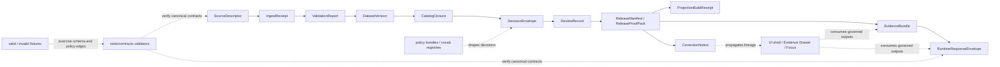

<!-- [KFM_META_BLOCK_V2]
doc_id: kfm://doc/<NEEDS_VERIFICATION_UUID>
title: Contracts
type: standard
version: v1
status: draft
owners: @bartytime4life
created: <NEEDS_VERIFICATION_YYYY-MM-DD>
updated: <NEEDS_VERIFICATION_YYYY-MM-DD>
policy_label: <NEEDS_VERIFICATION_POLICY_LABEL>
related: [../README.md, ../schemas/README.md, ../policy/README.md, ../tests/README.md, ../docs/standards/README.md, ../.github/workflows/README.md, ../.github/CODEOWNERS, ../.github/PULL_REQUEST_TEMPLATE.md]
tags: [kfm, contracts, trust-objects, json-schema, validation]
notes: [Current public main confirms /contracts/ ownership and README-only tree visibility; current public main also exposes /tests/contracts/ as a sibling verification surface; doc_id, created, updated, and policy_label need commit-time verification.]
[/KFM_META_BLOCK_V2] -->

# Contracts

Machine-readable contract backbone for KFM source admission, policy mediation, release proof, runtime trust, and correction lineage.

> [!IMPORTANT]
> **Status:** `experimental` *(INFERRED from current public repo documentation surfaces; verify against the checked-out branch before commit)*  
> **Doc status:** `draft`  
> **Owners:** `@bartytime4life`  
> **Path:** `contracts/README.md`  
>         
> **Quick jumps:** [Scope](#scope) · [Repo fit](#repo-fit) · [Accepted inputs](#accepted-inputs) · [Exclusions](#exclusions) · [Directory tree](#directory-tree) · [Quickstart](#quickstart) · [Usage](#usage) · [Diagram](#diagram) · [Tables](#tables) · [Task list](#task-list--definition-of-done) · [FAQ](#faq) · [Appendix](#appendix)  
> **Repo fit:** path `contracts/README.md` · upstream [`../README.md`](../README.md), [`../schemas/README.md`](../schemas/README.md), [`../policy/README.md`](../policy/README.md), [`../tests/README.md`](../tests/README.md), [`../tests/contracts/README.md`](../tests/contracts/README.md), [`../docs/standards/README.md`](../docs/standards/README.md), [`../.github/workflows/README.md`](../.github/workflows/README.md) · control surfaces [`../.github/CODEOWNERS`](../.github/CODEOWNERS), [`../.github/PULL_REQUEST_TEMPLATE.md`](../.github/PULL_REQUEST_TEMPLATE.md) · downstream governed APIs, release assembly, `EvidenceBundle` resolution, `RuntimeResponseEnvelope` emitters, correction lineage, and the hydrology-first thin slice

> [!NOTE]
> Current public `main` still shows `contracts/` as a real boundary surface with `README.md` only. Treat that as a deliberate documentation edge, not as proof that the machine-readable contract lattice is already mounted here.

> [!WARNING]
> KFM doctrine is stronger than the currently visible public contract inventory. This README therefore keeps **current public repo evidence** separate from **PROPOSED starter structure** and leaves canonical schema-home authority explicitly **UNKNOWN / NEEDS VERIFICATION** until the checked-out branch proves it.

## Scope

`contracts/` is where KFM stops speaking only in doctrine and starts publishing typed trust objects.

In KFM, contracts are not ornamental API notes. They are the machine-readable edge of the governed truth path: the object shapes that make source admission, validation, policy decisions, release readiness, runtime evidence, and correction lineage testable instead of merely persuasive.

### Truth posture used in this README

| Label | Meaning here |
|---|---|
| **CONFIRMED** | Directly supported by current public repo evidence or by the attached KFM doctrinal corpus used for this revision |
| **INFERRED** | Conservative completion drawn from adjacent repo surfaces or repeated KFM doctrine, but not directly proven as mounted implementation |
| **PROPOSED** | Doctrine-consistent starter layout, schema path, validator shape, or route-family support not yet proven as checked-in implementation |
| **UNKNOWN / NEEDS VERIFICATION** | Branch-specific details, canonical schema-home ADR, checked-in schema inventory, real validator entrypoints, fixture density, workflow YAML, and mounted runtime emitters not yet re-verified on the working branch |

### What this directory is for

`contracts/` should answer questions like these:

- What object must exist before a source is admitted?
- What fields make a policy decision reconstructable?
- What release object proves publication readiness?
- What runtime envelope makes an answer accountable?
- What correction object prevents silent overwrite?

### Why this matters in KFM

KFM doctrine is explicit that trust changes state through governed transitions, not through casual file movement, UI smoothness, or implied enforcement. That means named, typed, diffable, machine-validatable objects are part of the operating system of trust.

Without machine-checkable contracts, KFM can stay architecturally strong while remaining operationally under-enforced.

[Back to top](#contracts)

## Repo fit

| Item | Value |
|---|---|
| **Path** | `contracts/README.md` |
| **Directory role** | Contract publication and machine-readable trust-object reference surface |
| **Upstream constraints** | [`../schemas/README.md`](../schemas/README.md) · [`../policy/README.md`](../policy/README.md) · [`../tests/README.md`](../tests/README.md) · [`../tests/contracts/README.md`](../tests/contracts/README.md) · [`../docs/standards/README.md`](../docs/standards/README.md) · [`../.github/workflows/README.md`](../.github/workflows/README.md) |
| **Downstream consumers** | Governed APIs, release assembly, policy mediation, `EvidenceBundle` resolution, `RuntimeResponseEnvelope` emitters, correction lineage, and the hydrology-first thin slice |
| **Current repo signal** | `contracts/` remains a README-only documentation surface on current public `main`; `schemas/` remains a parallel README-only surface; `tests/contracts/` now exists as a sibling verification family; `docs/standards/README.md` still routes machine contracts toward `../contracts/` |
| **Trust rule** | Contracts define shapes and minimum semantics; contracts alone do **not** grant publication, approval, or runtime permission |

### Current verified snapshot

| Area | Status | What that means here |
|---|---|---|
| `contracts/README.md` as a repo documentation surface | **CONFIRMED** | The contracts lane exists as a real directory README |
| Current visible `contracts/` inventory | **CONFIRMED** | Current public `main` shows `README.md` only inside `contracts/` |
| `schemas/README.md` as a parallel documentation surface | **CONFIRMED** | Authority is still ambiguous across two top-level documentation surfaces |
| Current visible `schemas/` inventory | **CONFIRMED** | Current public `main` shows `README.md` only inside `schemas/` |
| `tests/contracts/README.md` as a sibling verification surface | **CONFIRMED** | Contract verification now has an explicit public-tree home under `tests/contracts/` |
| Current visible `tests/contracts/` inventory | **CONFIRMED** | Current public `main` shows `README.md` only inside `tests/contracts/` |
| Broader `tests/` family presence | **CONFIRMED** | Current public `main` exposes `accessibility`, `contracts`, `e2e`, `integration`, `policy`, `reproducibility`, and `unit` under `tests/` |
| Current visible `policy/` family presence | **CONFIRMED** | Current public `main` exposes `bundles`, `fixtures`, `policy-runtime`, `tests`, and `README.md` under `policy/` |
| Current visible `.github/workflows/` inventory | **CONFIRMED** | Current public `main` still shows `README.md` only inside `.github/workflows/` |
| `/contracts/` ownership in `CODEOWNERS` | **CONFIRMED** | Current public `CODEOWNERS` routes `/contracts/` to `@bartytime4life` |
| PR truth/evidence checklist | **CONFIRMED** | The repo PR template requires explicit truth posture plus linked validation / proof material |
| Standards routing toward `contracts/` | **CONFIRMED** | `docs/standards/README.md` continues to point machine contracts toward `../contracts/` |
| Authoritative schema home | **UNKNOWN / NEEDS VERIFICATION** | A repo-level authority decision still needs to make one home canonical |
| Real machine-readable contract inventory inside `contracts/` | **UNKNOWN / NEEDS VERIFICATION** | The visible public `contracts/` tree does not yet prove checked-in `.schema.json` files here |
| Real validator command and merge-blocking workflow YAML | **UNKNOWN / NEEDS VERIFICATION** | Current public tree does not expose active workflow YAML under `.github/workflows/` |
| Shared fixture shape | **PROPOSED** | `tests/contracts/README.md` supports a dedicated contract verification family and proposes companion fixture locations, but no mounted fixture inventory is visible yet |

> [!NOTE]
> The repo has moved beyond a pure “tests intent only” posture: `tests/contracts/` is now a visible sibling family. This README therefore treats contract publication and contract verification as adjacent but non-competing boundaries.

[Back to top](#contracts)

## Accepted inputs

The following belong in `contracts/`:

| Belongs here | Why it belongs here |
|---|---|
| Versioned JSON Schema files for trust-bearing objects | They make KFM object families explicit enough to validate, diff, gate, and evolve |
| Shared header/profile schema(s) | They stabilize common fields, version grammar, and minimum contract identity |
| Contract-local migration notes | They keep additive evolution and breaking-change handling explicit |
| Vocabulary registries for reasons / obligations / reviewer roles | Only if the authoritative-home decision assigns shared vocab ownership here rather than `policy/` |
| Companion examples or excerpts tied to schema publication | Useful when they clarify semantics without replacing tests as the authoritative validation surface |
| OpenAPI starter fragments for governed route families | Only when this directory is the agreed publication home for boundary contracts, not merely narrative route notes |

### Minimum bar for anything added here

- It has a clear lifecycle seam.
- It is versioned.
- It is machine-validatable.
- It has at least one valid example.
- It has at least one invalid example.
- Required fields are explicit.
- Time basis is explicit.
- Rights or sensitivity posture is explicit where relevant.
- Correction or supersession behavior is explicit where relevant.
- At least one named gate, test, or drill is intended to exercise it.

[Back to top](#contracts)

## Exclusions

The following do **not** belong in `contracts/` as source-of-truth assets:

| Does **not** belong here | Goes instead | Why |
|---|---|---|
| Executable policy bundles and Rego logic | [`../policy/`](../policy/) | Policy should stay executable and separately reviewable |
| Validator harnesses, case runners, and contract-specific test orchestration | [`../tests/contracts/`](../tests/contracts/) | Verification should consume canonical contracts, not redefine them |
| Workflow YAML and merge-gate wiring | [`../.github/workflows/`](../.github/workflows/) | CI wiring enforces contracts but is not itself the contract layer |
| Runtime or service implementation code | service / app / package surfaces | Emitters, resolvers, and handlers should consume contracts, not live inside them |
| Canonical or derived data artifacts | `../data/` or equivalent lifecycle zones | Contracts describe objects; they are not the objects themselves |
| Release proof artifacts themselves | release / proof or published stores | `ReleaseManifest` schema belongs here; emitted release evidence does not |
| UI payload renderers and shell state logic | app / shell packages | The contract surface should stay transport- and renderer-independent |
| Exploratory notebooks and ad hoc test scraps | notebooks / scratch / examples | Trust-bearing law should not be hidden in ephemeral work areas |

### Contract / schema authority hazard

A strong exclusion rule for this README is **parallel schema law**.

If `contracts/` and `schemas/` both evolve as authoritative homes, CI can validate one tree while code, docs, review logic, or runtime expectations silently drift against the other. Until the repo resolves that split, any new contract work should be accompanied by an explicit authority note and a migration plan.

### Contract / verification boundary hazard

A second exclusion rule is **parallel test authority**.

`tests/contracts/` should prove contract behavior, not become a second place where contract meaning silently changes. Tests should consume the declared canonical contract source, whether that source ultimately lives in `contracts/`, `schemas/`, or another explicitly ratified path.

[Back to top](#contracts)

## Directory tree

### Current confirmed public-main snapshot

```text
repo-root/
├─ contracts/
│  └─ README.md
├─ schemas/
│  └─ README.md
├─ policy/
│  ├─ bundles/
│  ├─ fixtures/
│  ├─ policy-runtime/
│  ├─ tests/
│  └─ README.md
├─ tests/
│  ├─ accessibility/
│  ├─ contracts/
│  │  └─ README.md
│  ├─ e2e/
│  │  ├─ correction/
│  │  ├─ release_assembly/
│  │  └─ runtime_proof/
│  ├─ integration/
│  ├─ policy/
│  ├─ reproducibility/
│  ├─ unit/
│  └─ README.md
└─ .github/
   └─ workflows/
      └─ README.md
```

### Starter target shape after the authority ADR (**PROPOSED**)

```text
contracts/
├─ README.md
├─ v1/
│  ├─ common/
│  │  └─ header_profile.schema.json
│  ├─ source/
│  │  └─ source_descriptor.schema.json
│  ├─ policy/
│  │  └─ decision_envelope.schema.json
│  ├─ data/
│  │  └─ dataset_version.schema.json
│  ├─ release/
│  │  └─ release_manifest.schema.json
│  ├─ evidence/
│  │  └─ evidence_bundle.schema.json
│  ├─ runtime/
│  │  └─ runtime_response_envelope.schema.json
│  └─ correction/
│     └─ correction_notice.schema.json
└─ vocab/
   ├─ reason_codes.json
   ├─ obligation_codes.json
   └─ reviewer_roles.json
```

### Verification companion shape aligned to current public repo families (**PROPOSED**)

```text
tests/
├─ contracts/
│  ├─ README.md
│  ├─ cases/
│  │  └─ wave_01_core/
│  ├─ helpers/
│  ├─ validators/
│  └─ reports/
└─ fixtures/
   └─ contracts/
      └─ v1/
         ├─ valid/
         └─ invalid/
```

> [!TIP]
> This split keeps publication law in `contracts/`, executable policy in `policy/`, and contract verification choreography in `tests/contracts/`.

[Back to top](#contracts)

## Quickstart

The safest path here is **inspection first**, not assumption first.

### 1) Inspect the visible contract lane and adjacent authority surfaces

```bash
# inspect the visible contracts lane
find contracts -maxdepth 3 -type f 2>/dev/null | sort

# inspect adjacent schema, policy, and verification lanes
find schemas -maxdepth 3 -type f 2>/dev/null | sort
find policy -maxdepth 3 -type f 2>/dev/null | sort
find tests/contracts -maxdepth 4 -type f 2>/dev/null | sort
find .github/workflows -maxdepth 3 -type f 2>/dev/null | sort

# inspect ownership and review boundaries
sed -n '1,220p' .github/CODEOWNERS 2>/dev/null || true
sed -n '1,260p' .github/PULL_REQUEST_TEMPLATE.md 2>/dev/null || true

# inspect adjacent documentation surfaces
sed -n '1,260p' contracts/README.md 2>/dev/null || true
sed -n '1,260p' schemas/README.md 2>/dev/null || true
sed -n '1,260p' policy/README.md 2>/dev/null || true
sed -n '1,260p' tests/README.md 2>/dev/null || true
sed -n '1,260p' tests/contracts/README.md 2>/dev/null || true
sed -n '1,260p' docs/standards/README.md 2>/dev/null || true
sed -n '1,260p' .github/workflows/README.md 2>/dev/null || true
```

### 2) Resolve schema-home authority first

Before adding a merge-blocking validator, declare **one** authoritative schema home.

That decision should do three things:

1. name the canonical publication path,
2. mark the non-authoritative sibling surface clearly, and
3. update this README, sibling docs, and CI references together.

### 3) Add the smallest first contract wave

Recommended **Wave 01**:

- `SourceDescriptor`
- `DatasetVersion`
- `DecisionEnvelope`
- `ReleaseManifest`
- `EvidenceBundle`
- `RuntimeResponseEnvelope`
- `CorrectionNotice`

Recommended **Wave 01.5**:

- `CatalogClosure`
- `ProjectionBuildReceipt`
- `IngestReceipt`
- `ValidationReport`
- `ReviewRecord`

### 4) Add valid and invalid fixtures immediately

```bash
# Illustrative only — verify the repo's real validator entrypoint before commit.
python -m jsonschema \
  -i tests/fixtures/contracts/v1/valid/runtime_response_envelope.min.json \
  contracts/v1/runtime/runtime_response_envelope.schema.json
```

```bash
# Illustrative only — invalid fixtures should fail on purpose.
python -m jsonschema \
  -i tests/fixtures/contracts/v1/invalid/runtime_response_envelope.missing_citations.json \
  contracts/v1/runtime/runtime_response_envelope.schema.json
```

### 5) Keep `tests/contracts/` authoritative for verification choreography, not for contract law

```text
PSEUDOCODE ONLY
---------------
tests/contracts/validators/run_wave_01.py
  -> loads canonical contract source from the authority-declared path
  -> validates Wave 01 schemas
  -> validates valid fixtures
  -> confirms invalid fixtures fail
  -> emits a report for CI
  -> exits non-zero on any drift
```

### 6) Keep negative outcomes first-class

For KFM, the following are not embarrassing edge cases:

- `ABSTAIN`
- `DENY`
- `ERROR`
- `STALE-VISIBLE`
- `GENERALIZED`
- `SUPERSEDED`
- `WITHDRAWN`
- `CORRECTION-PENDING`

If a contract wave cannot express and test those states where relevant, it is incomplete.

[Back to top](#contracts)

## Usage

### Add a new contract family safely

1. Add it only if it governs a real lifecycle step, trust seam, or visible state.
2. Place it in the most specific contract family path available.
3. Define minimum identifiers, timestamps, rights/sensitivity fields, and review/policy linkage where relevant.
4. Add one valid and one invalid fixture.
5. Add or update the corresponding registry values if the object depends on reason/obligation/role vocab.
6. Add or extend the `tests/contracts/` validation path that proves the object matters operationally.
7. Update adjacent docs and route-family notes if boundary behavior changes.

### Change an existing contract safely

- Prefer additive evolution by default.
- Add fields before renaming them.
- Version meaning changes explicitly.
- Keep old fixtures interpretable long enough to preserve audit history.
- Do not let runtime code depend on undocumented fields.
- Do not let a convenience DTO quietly replace the public contract.
- Update tests and fixtures in the same review set, not later.

### Keep transport separate from contract law

A route may change. A service may move. A framework may be replaced.

The trust-bearing object role should survive those changes. That is why KFM repeatedly treats filenames, DTOs, and route names as less important than stable object semantics.

[Back to top](#contracts)

## Diagram


```mermaid
flowchart LR
    A[SourceDescriptor] --> B[IngestReceipt]
    B --> C[ValidationReport]
    C --> D[DatasetVersion]
    D --> E[CatalogClosure]
    E --> F[DecisionEnvelope]
    F --> G[ReviewRecord]
    G --> H[ReleaseManifest / ReleaseProofPack]
    H --> I[ProjectionBuildReceipt]
    H --> J[EvidenceBundle]
    J --> K[RuntimeResponseEnvelope]
    H --> L[CorrectionNotice]

    M[policy bundles / vocab registries] -. shapes decisions .-> F
    N[tests/contracts validators] -. verify canonical contracts .-> A
    N -. verify canonical contracts .-> K
    O[valid / invalid fixtures] -. exercise schema and policy edges .-> N
    P[UI shell / Evidence Drawer / Focus] -. consumes governed outputs .-> J
    P -. consumes governed outputs .-> K
    L -. propagates lineage .-> P
```

[Back to top](#contracts)

## Tables

### Contract family registry

| Contract family | Minimum purpose | Fail-closed consequence | First-wave priority |
|---|---|---|---|
| `SourceDescriptor` | Declare the governed intake contract for a source family, endpoint, archive, or acquisition pattern | No governed admission; reject, hold, or quarantine | Wave 01 |
| `IngestReceipt` | Prove what was fetched, when, from where, and with what integrity result | Hold or quarantine; replay cannot be trusted | Wave 01.5 |
| `ValidationReport` | Record structural, spatial, temporal, unit, and policy-adjacent checks | Return to quarantine or block canonical write | Wave 01.5 |
| `DatasetVersion` | Carry an authoritative candidate or promoted subject set | No authoritative write; remain in governed processing | Wave 01 |
| `CatalogClosure` | Publish outward discoverability, lineage, and rights/review closure | No releasable scope | Wave 01.5 |
| `DecisionEnvelope` | Express a machine-readable policy result | Deny, hold, generalize, or require review instead of publishing by convenience | Wave 01 |
| `ReviewRecord` | Capture human approval, denial, escalation, or note | Require second review or no publication | Wave 01.5 |
| `ReleaseManifest` | Assemble the public-safe release inventory and promotion metadata | Deployment cannot stand in for release | Wave 01 |
| `ReleaseProofPack` | Bundle proof that a release is publishable | Release remains candidate or blocked | Later / adjacent |
| `ProjectionBuildReceipt` | Prove a derived tile, export, search, graph, or scene artifact came from a known release | Block, rebuild, mark stale-visible, or withdraw output | Wave 01.5 |
| `EvidenceBundle` | Package inspectable support for a claim, feature, story node, export preview, or answer | `ABSTAIN`, `DENY`, or `ERROR` rather than bluffing | Wave 01 |
| `RuntimeResponseEnvelope` | Make runtime outcomes accountable and finite | No uncited answer; no silent fifth outcome | Wave 01 |
| `CorrectionNotice` | Preserve visible lineage under rollback, supersession, withdrawal, narrowing, or corrected republication | No silent overwrite or invisible narrowing | Wave 01 |

### Current repo boundary matrix

| Surface | Current visible role | What it should not become |
|---|---|---|
| `contracts/` | Contract publication / contract law reference surface | A vague prose mirror of runtime DTOs |
| `schemas/` | Parallel documentation surface awaiting authority resolution | A competing canonical schema universe |
| `policy/` | Executable policy bundle / runtime / fixture family | The place where contract semantics quietly drift |
| `tests/contracts/` | Contract verification lane | A second source of contract truth |
| `.github/workflows/` | CI workflow documentation surface on current public `main` | Assumed proof of active merge gates without YAML evidence |

### First schema wave and verification plan

| Wave | Proposed path | Why it lands early |
|---|---|---|
| Wave 01 | `contracts/v1/source/source_descriptor.schema.json` | Source admission is where truth-path discipline starts |
| Wave 01 | `contracts/v1/data/dataset_version.schema.json` | Canonical write semantics need a typed subject set |
| Wave 01 | `contracts/v1/policy/decision_envelope.schema.json` | Turns deny-by-default policy into machine-readable structure |
| Wave 01 | `contracts/v1/release/release_manifest.schema.json` | Keeps publication as a governed state transition |
| Wave 01 | `contracts/v1/evidence/evidence_bundle.schema.json` | Makes evidence drill-through explicit and reusable |
| Wave 01 | `contracts/v1/runtime/runtime_response_envelope.schema.json` | Enforces finite runtime outcomes and cite-or-abstain |
| Wave 01 | `contracts/v1/correction/correction_notice.schema.json` | Prevents silent overwrite and anchors correction lineage |
| Companion | `tests/contracts/cases/wave_01_core/*` | Gives CI an explicit execution path |
| Companion | `tests/fixtures/contracts/v1/valid/*` | Proves happy-path structure intentionally |
| Companion | `tests/fixtures/contracts/v1/invalid/*` | Proves fail-closed rejection intentionally |
| Companion | `contracts/vocab/*.json` or authority-approved equivalent | Stabilizes reasons, obligations, and reviewer roles |

[Back to top](#contracts)

## Task list & definition of done

### First enforceable slice

- [ ] One ADR declares the single authoritative schema home.
- [ ] Wave 01 contract files exist as real machine-readable artifacts.
- [ ] Shared vocab registries exist in the authority-approved location.
- [ ] `tests/contracts/` contains a real validator or case runner for Wave 01.
- [ ] Shared valid and invalid fixtures exist and are wired into that validator path.
- [ ] A deterministic validator command exists and is documented.
- [ ] One merge-blocking workflow gate runs that validator without skip-risk.
- [ ] `contracts/README.md` and `schemas/README.md` no longer imply competing authority.
- [ ] Runtime contracts prove finite outcomes and citation requirements.
- [ ] Correction contracts prove visible lineage under supersession or withdrawal.
- [ ] Docs, fixtures, validator output, and policy vocab stay in sync.

### Review gates

- [ ] No new contract silently broadens public-safe scope.
- [ ] No field appears in runtime or review payloads without contract coverage.
- [ ] No free-text-only decision logic is introduced where registries are required.
- [ ] No invalid fixture unexpectedly passes.
- [ ] No valid fixture unexpectedly fails.
- [ ] No change weakens release linkage, correction lineage, or audit reconstruction.
- [ ] No `UNKNOWN` is silently promoted to implementation fact.

[Back to top](#contracts)

## FAQ

### Why does this README talk about both `contracts/` and `schemas/`?

Because current public repo evidence still points to both as documentation surfaces. That is useful as a warning signal and dangerous as long-term authority practice. This README keeps the conflict visible instead of pretending it is already resolved.

### Why does this README now mention `tests/contracts/` explicitly?

Because current public `main` now exposes `tests/contracts/README.md` as a real sibling verification surface. Ignoring that family would make this README less faithful to the actual repo shape.

### Why start with `RuntimeResponseEnvelope` and `CorrectionNotice`?

Because they touch the public trust seam fastest: outward answers must be finite, cited, and accountable, and published meaning must change visibly rather than by silent overwrite.

### Why are invalid fixtures mandatory?

Because KFM is fail-closed by design. A valid fixture proves the happy path; an invalid fixture proves the system rejects bad structure on purpose.

### Why is hydrology mentioned in a contracts README?

Because the doctrinal corpus repeatedly treats hydrology as the strongest first governed thin slice, and that slice exercises the exact contract chain this directory is supposed to define.

[Back to top](#contracts)

## Appendix

<details>
<summary><strong>Evidence basis, verification backlog, and merge-time fill items</strong></summary>

### Evidence basis used for this README

This README is grounded in three layers that should be read together:

1. **Current public repo evidence** describing what public `main` exposes around `contracts/`, `schemas/`, `tests/contracts/`, `policy/`, `.github/workflows/`, ownership, and PR review discipline.
2. **The current repo-native documentation pattern** already present in adjacent README surfaces, especially the contract, schema, tests, and standards lanes.
3. **The attached KFM doctrinal corpus**, which defines the contract families, fail-closed semantics, route families, proof objects, hydrology-first sequencing, and correction burden.

Where those layers differ, this README follows the stronger truth path:

- current public repo evidence determines what can be stated as visible now,
- adjacent repo docs determine local terminology and boundary shape,
- attached doctrine determines what KFM still needs even when the current tree is thinner than the doctrine.

### Pre-merge verification backlog

Before committing this README as authoritative repo documentation, verify at least:

1. the actual `contracts/` tree in the checked-out branch,
2. whether `schemas/` is being retained, demoted, or removed,
3. whether any real `.schema.json` files already exist under another path,
4. whether `tests/contracts/` has grown beyond README-only on the working branch,
5. where fixtures actually live,
6. whether shared vocab lives under `contracts/`, `policy/`, or another declared authority path,
7. whether `.github/workflows/` now contains real merge-blocking validator YAML,
8. whether `contracts/v1/` or another layout is the repo’s preferred publication path,
9. commit-time values for `doc_id`, `created`, `updated`, and `policy_label`,
10. whether the checked-out branch still wants `experimental` retained as the surface-status label.

### Why this file still prefers a small first wave

The corpus consistently prefers a small, enforceable artifact wave over a broad but weakly tested schema universe. That is why this README recommends:

- a single authoritative schema home,
- a small Wave 01,
- valid and invalid fixtures,
- an explicit `tests/contracts/` verification path,
- a deterministic validator command,
- one merge-blocking workflow,
- and one correction drill.

That sequence makes the trust doctrine executable without pretending the whole platform is already mounted.

</details>

[Back to top](#contracts)
