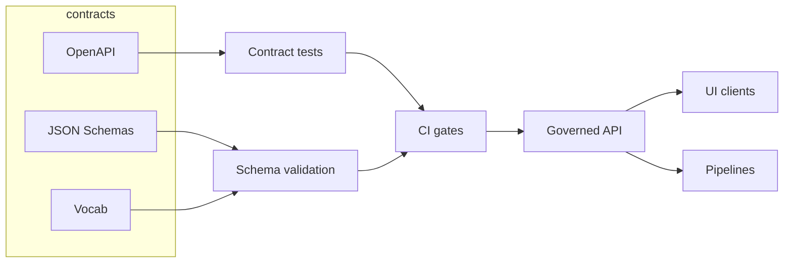

<!-- [KFM_META_BLOCK_V2]
doc_id: kfm://doc/5c4c213f-c067-4ada-8e8a-544fc4274a82
title: contracts — Governed API and Schema Contracts
type: standard
version: v1
status: draft
owners: KFM Platform Team (TBD)
created: 2026-03-03
updated: 2026-03-03
policy_label: public
related:
  - ../policy/
  - ../tools/
  - ../tests/
  - ../docs/
tags: [kfm, contracts, openapi, json-schema, governance]
notes:
  - This README is a directory contract. It avoids asserting unverified repo structure beyond what is documented.
[/KFM_META_BLOCK_V2] -->

# `contracts/` — Governed API & Schema Contracts
One place for **machine-readable contracts** (APIs + schemas + vocabularies) that define KFM’s policy-boundary interfaces.

   

**Status:** `draft` • **Owners:** `TBD` (suggest: `CODEOWNERS` entry for `contracts/**`)  
**Audience:** contributors changing APIs/schemas, reviewers enforcing governance, CI maintainers

> NOTE  
> **Confirmed:** KFM’s architecture depends on a *trust membrane*: clients/UI must not bypass the governed API + policy enforcement. Contracts are part of that membrane.

---

## Quick navigation
- [Evidence tags](#evidence-tags)
- [Purpose](#purpose)
- [Where this fits](#where-this-fits)
- [What belongs here](#what-belongs-here)
- [What must not go here](#what-must-not-go-here)
- [Directory layout](#directory-layout)
- [Contract registry](#contract-registry)
- [Versioning & compatibility](#versioning--compatibility)
- [Validation & CI gates](#validation--ci-gates)
- [Change workflow](#change-workflow)
- [Security & sensitivity](#security--sensitivity)
- [Unknowns & verification steps](#unknowns--verification-steps)

---

## Evidence tags
KFM docs and PRs must keep claims traceable.

- **Confirmed** = explicitly documented in KFM artifacts (may still require repo checkout verification).
- **Proposed** = recommended standard/pattern, not guaranteed implemented everywhere yet.
- **Unknown** = not verified; includes the *smallest verification step* to make it Confirmed.

---

## Purpose
- **Confirmed:** This directory centralizes **API contracts and schemas** (e.g., OpenAPI definitions, JSON Schemas, controlled vocab/vocabulary files).
- **Confirmed:** These contracts are treated as **governance surfaces**: they enable contract tests, schema validation, and policy gating across the pipeline.
- **Proposed:** Treat `contracts/` as the *source of truth* for interface shape; generated artifacts (clients/stubs) should be reproducible outputs with receipts (not hand-edited).

[Back to top](#contracts---governed-api--schema-contracts)

---

## Where this fits
- **Confirmed:** KFM enforces a “trust membrane”: **UI/clients do not access storage directly**; requests flow through a governed API and policy engine.
- **Confirmed:** The **catalog triplet** (DCAT + STAC + PROV) is also a contract surface used for deterministic discovery/citations and CI validation.
- **Proposed:** `contracts/` provides the machine-readable “boundary definitions” that keep these invariants testable.


```mermaid
flowchart LR
  subgraph C[contracts]
    OA[OpenAPI]
    JS[JSON Schemas]
    V[Vocab]
  end

  OA --> CT[Contract tests]
  JS --> SV[Schema validation]
  V --> SV

  CT --> CI[CI gates]
  SV --> CI

  CI --> API[Governed API]
  API --> UI[UI clients]
  API --> Pipelines[Pipelines]
```

[Back to top](#contracts---governed-api--schema-contracts)

---

## What belongs here
- **Confirmed:** **OpenAPI** documents (REST API interface contracts).
- **Confirmed:** **JSON Schemas** for request/response payloads, receipts/manifests, and other contract-checked objects.
- **Confirmed:** **Controlled vocabularies** (enumerations / code lists) required for normalization and consistent semantics.

**Proposed additional “contract surfaces” (only if you already use them):**
- **Proposed:** GraphQL schema (`.graphql`) if the project exposes GraphQL.
- **Proposed:** Event/telemetry schemas (if not already centralized under `schemas/`).
- **Proposed:** STAC/DCAT/PROV *profiles* (if you pin/extend these in-repo as contracts).

[Back to top](#contracts---governed-api--schema-contracts)

---

## What must not go here
> WARNING  
> This folder is a **contract surface**, not a data or secrets store.

- **Confirmed:** No secrets, tokens, credentials, private keys.
- **Confirmed:** No raw datasets or large binary artifacts (those belong in the data lifecycle zones: RAW/WORK/PROCESSED/PUBLISHED).
- **Proposed:** No generated client SDKs or generated stubs committed unless you have a reproducible-generation policy + receipt and the repo explicitly allows it.
- **Proposed:** No “one-off” schemas without ownership/versioning; everything here should have a maintainer and a compatibility story.

[Back to top](#contracts---governed-api--schema-contracts)

---

## Directory layout
Because the live repo checkout isn’t inspected here, this layout is expressed as **documented minimum + expected extensions**.

### Minimal documented contents
- **Confirmed:** `contracts/` exists as a top-level area for OpenAPI, JSON Schemas, and vocab files.

### Expected layout (Proposed)
```text
contracts/
├─ openapi/               # Confirmed: OpenAPI definitions (REST boundary)
├─ jsonschema/            # Confirmed: JSON Schemas (payloads, receipts, manifests, etc.)
├─ vocab/                 # Confirmed: controlled vocabularies / code lists
├─ stac/                  # Proposed: STAC profiles/extensions pinned for KFM usage
├─ dcat/                  # Proposed: DCAT profile constraints/pinning
├─ prov/                  # Proposed: PROV profile constraints/pinning
├─ examples/              # Proposed: minimal example payloads used by tests
└─ README.md              # this file
```

[Back to top](#contracts---governed-api--schema-contracts)

---

## Contract registry
Use this table as a checklist for “what contract surfaces exist” and “how are they validated”.

| Contract surface | Primary consumers | Where used | Gate/validation (expected) | Tag |
|---|---|---|---|---|
| OpenAPI (REST) | UI clients, API server | API boundary | Contract tests + lint + breaking-change detection | **Confirmed** |
| JSON Schema | Pipelines, API, validators, policy tests | payload validation | Schema validation on examples/fixtures + CI enforcement | **Confirmed** |
| Controlled vocab | Pipelines, UI filters, policy | normalization + UI | enum checks + policy allowlists | **Confirmed** |
| STAC profile pinning | Catalog tooling | catalog triplet | STAC validator + link checks | **Proposed** |
| DCAT profile pinning | Catalog tooling | catalog triplet | DCAT validator | **Proposed** |
| PROV profile pinning | Catalog tooling | catalog triplet | PROV schema checks | **Proposed** |
| GraphQL schema | UI clients, API | API boundary | schema diff + contract tests | **Proposed** |

[Back to top](#contracts---governed-api--schema-contracts)

---

## Versioning & compatibility
- **Proposed:** Contracts should be versioned so downstreams can evolve safely.
- **Proposed:** Prefer additive changes:
  - Add optional fields before requiring them.
  - Deprecate before removal.
  - Avoid renames without compatibility layers.
- **Proposed:** Every breaking change must include:
  - a migration note,
  - updated tests/fixtures,
  - and an explicit version bump (SemVer or equivalent).

### Minimal compatibility rubric (Proposed)
| Change type | Examples | Compatible? |
|---|---|---|
| Add optional field | new property with default | ✅ yes |
| Add required field | new non-null / required key | ❌ breaking |
| Remove/rename field | deletes/renames keys | ❌ breaking |
| Tighten enum | remove allowed values | ❌ breaking |
| Clarify docs only | text changes | ✅ yes |

[Back to top](#contracts---governed-api--schema-contracts)

---

## Validation & CI gates
- **Confirmed:** KFM uses automated gates to prevent unsafe promotion; schema/contract validation is a core mechanism.
- **Confirmed:** “Fail closed” is the default: missing/invalid contracts should block merges/releases when they impact governed surfaces.
- **Proposed:** Minimum CI checks for `contracts/**`:
  1. OpenAPI syntax + lint.
  2. JSON Schema validation on example payloads.
  3. Contract tests (API requests/responses) against a mock or test server.
  4. Breaking-change detection (diff against main branch contract snapshot).
  5. Policy alignment: ensure contracts don’t allow bypassing governed routes.

### PR Definition of Done (contracts change)
- [ ] **Confirmed/Proposed:** Contract change is scoped and reversible (small diff).
- [ ] **Proposed:** Versioning updated (if needed) and migration notes provided.
- [ ] **Confirmed/Proposed:** Examples/fixtures updated to match.
- [ ] **Proposed:** Contract tests updated/added.
- [ ] **Confirmed/Proposed:** Policy implications documented (what access expands/tightens).
- [ ] **Unknown:** Verify CI has a merge-blocking job for contract validation. (See: [Unknowns & verification steps](#unknowns--verification-steps))

[Back to top](#contracts---governed-api--schema-contracts)

---

## Change workflow
- **Proposed:** Treat contract changes like public APIs:
  1. Open a PR labeled `contracts`.
  2. Include a short “compatibility statement”:
     - **Confirmed/Proposed:** what breaks, who is impacted, and migration path.
  3. Add/adjust fixtures and contract tests.
  4. Require CODEOWNERS review from platform/governance owners.
  5. Merge only when CI gates pass (fail closed).

<details>
<summary>Proposed PR template snippet</summary>

```text
## Contract change summary
Tag: Confirmed | Proposed | Unknown

- What changed:
- Why:
- Compatibility (additive vs breaking):
- Migration notes:
- Tests/fixtures updated:
- Policy impact:
```

</details>

[Back to top](#contracts---governed-api--schema-contracts)

---

## Security & sensitivity
- **Confirmed:** The trust membrane exists to prevent policy bypass; contracts must not introduce “side doors” (e.g., new endpoints that expose storage directly).
- **Confirmed:** If contract payloads can include location data, follow classification/redaction obligations (default-deny; generalize where required).
- **Proposed:** Add schema-level constraints when feasible (e.g., pattern/format constraints, max precision rules for sensitive coordinates).
- **Proposed:** Ensure contracts never require clients to submit secrets that should stay server-side.

[Back to top](#contracts---governed-api--schema-contracts)

---

## Unknowns & verification steps
These are quick steps to convert Unknown → Confirmed for this checkout.

1) **Unknown:** What is the *actual* `contracts/` tree in this repo?
- Verification: run `tree -L 3 contracts` and paste the output into this README under “Directory layout”.

2) **Unknown:** Which CI jobs validate contracts and block merge?
- Verification: inspect `.github/workflows/*` for jobs touching `contracts/**`; link them here.

3) **Unknown:** What exact schema drafts/tooling are used (OpenAPI 3.0 vs 3.1, JSON Schema draft)?
- Verification: open the contract files and record the declared versions at the top of the docs.

4) **Unknown:** Is there a canonical “contract test harness” path?
- Verification: search the repo for `contract test`, `openapi lint`, `spectral`, `dredd`, `schemathesis`, or similar; link the chosen approach here.

[Back to top](#contracts---governed-api--schema-contracts)
