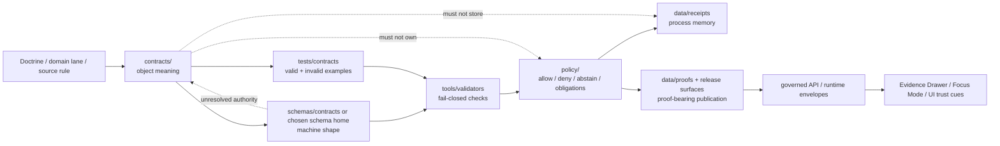

<!-- [KFM_META_BLOCK_V2]
doc_id: kfm://doc/TODO-contracts-readme-uuid
title: contracts
type: standard
version: v1
status: draft
owners: @bartytime4life
created: TODO-NEEDS-VERIFICATION
updated: 2026-04-22
policy_label: TODO-NEEDS-VERIFICATION
related: [../README.md, ../schemas/README.md, ../schemas/contracts/README.md, ../schemas/contracts/v1/README.md, ../policy/README.md, ../tests/README.md, ../tests/contracts/README.md, ../tools/validators/README.md, ../data/receipts/README.md]
tags: [kfm, contracts, schemas, policy, validators, evidence, proof-objects, governance]
notes: [doc_id and created date need live-repo verification; policy_label needs policy-owner confirmation; active-checkout inventory must be rechecked before merge; this revision preserves the current contracts lane role while making the root-vs-schema authority split more explicit.]
[/KFM_META_BLOCK_V2] -->

<a id="top"></a>

# `contracts/`

Contract-first lane for KFM’s shared object meanings, trust-bearing envelopes, proof-object semantics, and compatibility rules.

<div align="left">


</div>

> [!IMPORTANT]
> **Status:** experimental  
> **Owners:** `@bartytime4life`  
> **Path:** `contracts/README.md`  
> **Primary job:** define object meaning, field intent, lifecycle expectations, compatibility posture, and trust-visible semantics.  
> **Not this lane:** policy logic, runtime code, receipt storage, workflow orchestration, or silent schema-home authority.  
> **Evidence posture:** doctrine-grounded and public-`main` snapshot-aware; active checkout inventory remains **NEEDS VERIFICATION** before merge.  
> **Quick jumps:** [Scope](#scope) · [Repo fit](#repo-fit) · [Accepted inputs](#accepted-inputs) · [Exclusions](#exclusions) · [Directory tree](#directory-tree) · [Quickstart](#quickstart) · [Usage](#usage) · [Diagram](#diagram) · [Reference tables](#reference-tables) · [Versioning](#versioning) · [Validation and gates](#validation-and-gates) · [Task list](#task-list--definition-of-done) · [FAQ](#faq) · [Appendix](#appendix)

> [!WARNING]
> `contracts/` is a real and important root lane, but it must not quietly overrule `schemas/contracts/` by directory name alone. Until the repo records one canonical machine-contract home, contract, schema, fixture, validator, and runtime-proof surfaces must be updated together and reviewed as one trust boundary.

---

## Scope

`contracts/` converts KFM doctrine into stable, reviewable contract language for trust-bearing objects.

Contracts exist here so that:

- doctrine does not remain prose-only
- proof-bearing objects are testable before promotion
- runtime surfaces receive stable payload semantics
- process memory, proof, correction, release, and runtime envelopes stay distinct
- validators and tests can consume declared shapes without becoming semantic authority
- contributors can see where object meaning stops and policy, storage, validation, and runtime behavior begin

### What this README must preserve

This file has six jobs:

1. define what the contract lane owns
2. keep the contract / schema / policy / validator / storage split explicit
3. reflect the current public `contracts/` root shape without overstating active-checkout inventory
4. route contributors toward adjacent lanes before responsibilities blur
5. keep root-vs-schema machine-contract ambiguity visible
6. prevent proposed files from hardening into “implemented fact” by tone, path, or repetition

### Why contracts first

| Reason | Contract-lane outcome |
|---|---|
| Prevent silent drift | object meaning has a named home before schemas and fixtures encode it |
| Enable validation | validators consume stable shape and linkage expectations |
| Preserve trust | proof objects remain inspectable and reviewable |
| Support runtime | APIs and UI trust surfaces can emit stable envelopes |
| Enable correction | correction and supersession lineage stays machine-visible |
| Support release discipline | promotion, receipts, proofs, and release manifests can join through declared refs |

[Back to top](#top)

---

## Repo fit

| Field | Value |
|---|---|
| Path | `contracts/README.md` |
| Role | root contract lane for shared object definitions, field semantics, and compatibility expectations |
| Upstream | `../README.md` — repo identity, doctrine, and navigation |
| Lateral authority surfaces | `../schemas/README.md`, `../schemas/contracts/README.md`, `../schemas/contracts/v1/README.md`, `../policy/README.md` |
| Verification surfaces | `../tests/README.md`, `../tests/contracts/README.md`, `../tools/validators/README.md` |
| Process-memory / proof adjacency | `../data/receipts/README.md`, proof-pack and release lanes when present |
| Current maturity | experimental; public-`main` snapshot-aware; active checkout remains **NEEDS VERIFICATION** |

### Neighbor map

| Surface | Owns | Must not silently own |
|---|---|---|
| `contracts/` | object meaning, field intent, lifecycle semantics, compatibility expectations | policy decisions, emitted instances, workflow behavior |
| `schemas/` / `schemas/contracts/` | machine-checkable shape, schema fragments, executable constraints | semantic doctrine as the only source of meaning |
| `policy/` | allow / deny / abstain / obligation logic, rights, sensitivity, publication admissibility | object schemas or receipt storage |
| `tests/contracts/` | valid and invalid examples, fail-closed proof, contract drift detection | contract authority or policy authority |
| `tools/validators/` | deterministic checks, linkage validation, reviewable reports | schema ownership, policy sovereignty, publication |
| `data/receipts/` | process-memory instances | normative contract definitions |
| `data/proofs/` | release-grade proof-bearing objects | raw contract meaning or runtime behavior |

> [!TIP]
> A healthy KFM contract change should make each adjacent lane stronger without making any lane pretend to be another.

[Back to top](#top)

---

## Accepted inputs

This lane accepts:

- contract definitions and object-family boundaries
- field-level meaning and required linkage semantics
- compatibility and versioning rules
- contract-level examples tied to validation, interpretation, or review
- source-admission contract notes when they define object meaning rather than source policy
- migration notes when contract authority moves or is reconciled
- README/object-card updates for proof-object families
- explicit placeholder warnings where active-checkout inventory is not verified

### Current contract pressure

The strongest recurring contract families are:

| Family | Contract reason | Current posture |
|---|---|---|
| `SourceDescriptor` | source identity, admission context, source role, refresh expectations | **CONFIRMED concept / machine home NEEDS VERIFICATION** |
| `DatasetVersion` | dataset identity and version semantics | **CONFIRMED concept / machine home NEEDS VERIFICATION** |
| `EvidenceBundle` | support and evidence grouping | **CONFIRMED concept / machine home NEEDS VERIFICATION** |
| `DecisionEnvelope` | finite decision object and policy-result carrier | **CONFIRMED concept / machine home NEEDS VERIFICATION** |
| `ReleaseManifest` | release-bearing object and publication linkage | **CONFIRMED concept / machine home NEEDS VERIFICATION** |
| `RuntimeResponseEnvelope` | outward governed runtime response | **CONFIRMED concept / machine home NEEDS VERIFICATION** |
| `CorrectionNotice` | correction, withdrawal, supersession, and lineage | **CONFIRMED concept / machine home NEEDS VERIFICATION** |
| `run_receipt` / `ai_receipt` | process memory and model/runtime trace | **CONFIRMED concept / placement NEEDS VERIFICATION** |

### Minimum bar for adding or changing a contract

A change belongs here only when it:

- defines object meaning or compatibility rather than execution behavior
- keeps policy rules out of the contract body
- keeps emitted receipts and proof artifacts out of the contract lane
- does not create a second silent source of truth beside `schemas/contracts/`
- names compatibility impact when the change is not purely additive
- updates fixtures, validators, tests, and docs when downstream behavior depends on the change

[Back to top](#top)

---

## Exclusions

Do **not** place these here:

| Item | Better home | Why |
|---|---|---|
| policy rules or allow/deny logic | `../policy/` | policy must remain executable and decision-sovereign |
| runtime code | `../apps/`, `../packages/`, or `../tools/` | implementations consume contracts; they do not live here |
| actual receipts | `../data/receipts/` or `../data/run_receipts/` | this lane defines objects; it does not store instances |
| proof packs, signatures, attestations | proof / attest lanes | integrity artifacts are adjacent, not contract definitions |
| workflow YAML | `../.github/workflows/` | orchestration belongs in the control plane |
| exploratory notes | `../docs/` or an explicitly labeled archive | narrative design notes must not masquerade as contract authority |
| duplicate mirror files | one canonical home plus explicit pointer strategy | duplicate truth surfaces create semantic drift |

> [!CAUTION]
> Contracts define objects. They never store events, decide policy, publish artifacts, or orchestrate execution.

[Back to top](#top)

---

## Directory tree

### Current public `contracts/` snapshot

The public `main` snapshot shows the root lane is not empty. Treat this as a navigation baseline, not proof that every subtree is mature in the active checkout.

```text
contracts/
├── README.md
├── adaptive_change/
├── consent_ledger/
├── hydro_mapping/
├── source/
├── tiler/
├── vocab/
└── promotion_review_handoff.md
```

### Safe reading of current subtrees

| Subtree or file | Safe interpretation | Review posture |
|---|---|---|
| `adaptive_change/` | domain or object-family contract area | purpose and contents **NEED VERIFICATION** before this README explains more |
| `consent_ledger/` | consent / ledger-shaped contract area | sensitive semantics; verify owner and policy adjacency |
| `hydro_mapping/` | hydrology mapping contract area | likely tied to hydrology proof lane; verify current scope |
| `source/` | source-admission contract lane | source descriptors belong nearby, but source rights and policy stay separate |
| `tiler/` | tile or delivery-facing contract lane | must not become runtime or publication authority |
| `vocab/` | governed vocabulary / token lane | must stay reconciled with schema-side vocab registries |
| `promotion_review_handoff.md` | promotion / review handoff note | should cross-link policy, tests, proof, and release docs when verified |

### Adjacent machine-file signal

```text
schemas/
└── contracts/
    ├── README.md
    ├── v1/
    │   ├── common/
    │   ├── correction/
    │   ├── data/
    │   ├── evidence/
    │   ├── policy/
    │   ├── release/
    │   ├── runtime/
    │   └── source/
    └── vocab/
```

> [!NOTE]
> The `schemas/contracts/v1/` subtree is a real machine-file signal in the public snapshot, but current schema-home authority remains unresolved. Do not infer enforcement-grade maturity from file presence alone.

[Back to top](#top)

---

## Quickstart

### Before adding a contract

1. Reopen `contracts/README.md`, `schemas/README.md`, `schemas/contracts/README.md`, and `schemas/contracts/v1/README.md` together.
2. Confirm whether the object belongs in the current canonical contract home or is blocked on schema-home resolution.
3. Define meaning and machine shape together.
4. Add valid and invalid fixtures in the verified fixture home.
5. Wire validators and tests to one authoritative path.
6. Review policy impact before relying on the object downstream.
7. Update docs and task lists in the same change.

### Safe inspection commands

```bash
# Inspect root and schema-side contract surfaces together.
find contracts -maxdepth 3 -type f | sort
find schemas/contracts -maxdepth 4 -type f | sort

# Reopen lane docs before adding trust-bearing files.
sed -n '1,260p' contracts/README.md
sed -n '1,260p' schemas/README.md
sed -n '1,260p' schemas/contracts/README.md
sed -n '1,260p' schemas/contracts/v1/README.md
sed -n '1,220p' tests/contracts/README.md
sed -n '1,220p' tools/validators/README.md

# Search for canonical-home and object-family language.
git grep -nE 'canonical|schema home|contract home|EvidenceBundle|DecisionEnvelope|SourceDescriptor|ReleaseManifest|RuntimeResponseEnvelope|CorrectionNotice|run_receipt|ai_receipt' -- \
  contracts schemas tests policy tools docs .github
```

### Minimal illustrative contract companion

```json
{
  "$schema": "https://json-schema.org/draft/2020-12/schema",
  "title": "Illustrative KFM Contract Object",
  "type": "object",
  "required": ["id", "object_family", "spec_hash"],
  "properties": {
    "id": { "type": "string" },
    "object_family": { "type": "string" },
    "spec_hash": { "type": "string" }
  },
  "additionalProperties": false
}
```

> [!IMPORTANT]
> The JSON above is illustrative. Do not land it as a canonical schema without checking the current schema-home ADR or creating one.

[Back to top](#top)

---

## Usage

### Contract card pattern

Use object cards when a family becomes important enough to affect schemas, validators, fixtures, policy, runtime, or release behavior.

```markdown
## ObjectName

| Field | Value |
|---|---|
| Status | CONFIRMED concept / PROPOSED implementation / NEEDS VERIFICATION |
| Purpose | What this object means in KFM |
| Upstream authority | Doctrine, source registry, domain lane, ADR, or governing doc |
| Downstream consumers | Schemas, fixtures, validators, policy, runtime, UI, receipts, proofs |
| Storage home | Where emitted instances live, if any |
| Schema home | Chosen canonical schema path or NEEDS VERIFICATION |
| Fixture home | Valid/invalid fixture path or NEEDS VERIFICATION |
| Validator | Entrypoint or validator runbook |
| Policy adjacency | Allow/deny/obligation rules affected |
| Compatibility note | Breaking / additive / docs-only |
| Open questions | What must be verified before promotion |
```

### Contract flow

```text
doctrine or source rule
  -> contract meaning
  -> schema shape
  -> valid / invalid fixtures
  -> validator report
  -> policy decision
  -> receipt / proof / release / runtime consumer
```

### Root-vs-schema reading rule

Use `contracts/` for **meaning and family boundaries**. Use the chosen schema surface for **machine-checkable shape**. Until the repo records one canonical machine-contract home:

- do not add the same object family under both roots without an explicit mirror strategy
- do not point validators at one path and tests at another
- do not let runtime-proof fixtures choose authority by convenience
- do not let README wording outrun the actual tree

[Back to top](#top)

---

## Diagram


```mermaid
flowchart LR
  D[Doctrine / domain lane / source rule] --> C[contracts/<br/>object meaning]
  C --> S[schemas/contracts or chosen schema home<br/>machine shape]
  C --> F[tests/contracts<br/>valid + invalid examples]
  S --> V[tools/validators<br/>fail-closed checks]
  F --> V
  V --> P[policy/<br/>allow / deny / abstain / obligations]
  P --> R[data/receipts<br/>process memory]
  P --> PF[data/proofs + release surfaces<br/>proof-bearing publication]
  PF --> API[governed API / runtime envelopes]
  API --> UI[Evidence Drawer / Focus Mode / UI trust cues]

  C -. must not own .-> P
  C -. must not store .-> R
  S -. unresolved authority .-> C
```

[Back to top](#top)

---

## Reference tables

### Contract family registry

| Family | Role | Status | Companion burden |
|---|---|---|---|
| `SourceDescriptor` | source identity and source-role declaration | **CONFIRMED concept** | schema, source fixture, connector/admission validator, policy adjacency |
| `DatasetVersion` | dataset identity and version record | **CONFIRMED concept** | schema, version fixture, catalog/proof linkage |
| `EvidenceBundle` | evidence grouping and support object | **CONFIRMED concept** | bundle schema, sufficiency fixtures, Evidence Drawer / runtime consumers |
| `DecisionEnvelope` | finite decision record | **CONFIRMED concept** | policy schema, valid/invalid outcomes, promotion/runtime validation |
| `ReleaseManifest` | release object and publication linkage | **CONFIRMED concept** | release fixtures, proof-pack linkage, rollback reference |
| `RuntimeResponseEnvelope` | outward runtime response contract | **CONFIRMED concept** | runtime-proof fixtures, finite outcomes, citation/evidence checks |
| `CorrectionNotice` | correction, supersession, withdrawal lineage | **CONFIRMED concept** | correction fixtures, propagation checks, release/correction drill |
| `run_receipt` | process-memory trace | **CONFIRMED concept** | receipt schema or contract, process-memory storage, validator report |
| `ai_receipt` | AI/model/runtime trace | **CONFIRMED concept** | bounded-AI policy, citation validation, no-chain-of-thought storage rule |
| lane-specific overlays | domain-specific contract additions | **PROPOSED / NEEDS VERIFICATION** | source steward review, sensitivity policy, fixture coverage |

### Contract-home caution matrix

| Situation | Safe action |
|---|---|
| both `contracts/` and `schemas/contracts/` look plausible | stop and reopen both parent READMEs before adding files |
| validator examples point one way but tests point another | reconcile authority before merging |
| a runtime-proof slice wants a new envelope quickly | do not let test convenience choose the contract home |
| a vocabulary term appears in multiple schemas | reconcile with `contracts/vocab/` and schema-side vocab registries |
| a domain lane wants a shortcut contract | add object card, fixtures, and policy adjacency before use |
| a proposed file path appears in a prior PDF | treat it as lineage or proposal until active checkout confirms it |

[Back to top](#top)

---

## Versioning

| Change | Compatibility impact |
|---|---|
| add optional field without changing meaning | usually non-breaking |
| add required field | breaking |
| remove required or optional field | breaking unless explicitly deprecated first |
| rename field | breaking |
| change field meaning without changing field name | breaking |
| narrow enum / reason codes | usually breaking |
| widen enum / reason codes | review-required; may be non-breaking |
| clarify prose without changing validators or fixtures | docs-only |
| move canonical home | breaking unless an ADR, aliases, and migration notes exist |

### Compatibility rule

When in doubt, choose the stricter interpretation:

- if validators, fixtures, runtime-proof, or release expectations change, treat it as contract-impacting
- if two homes would need updating together, stop and resolve canonical authority before versioning both
- if the change affects public trust cues, Evidence Drawer, Focus Mode, or release/correction behavior, require policy-aware review

[Back to top](#top)

---

## Validation and gates

A contract is not ready for downstream reliance until it has proof pressure near it.

| Gate | Purpose | Expected lane |
|---|---|---|
| object card | explain object meaning and status | `contracts/` |
| schema validation | enforce machine shape | `schemas/` or chosen schema home |
| valid fixtures | prove accepted shape | `tests/contracts/` or chosen fixture home |
| invalid fixtures | prove fail-closed behavior | `tests/contracts/` or chosen fixture home |
| validator invocation | produce deterministic pass/fail report | `tools/validators/` |
| policy adjacency | review allow/deny/obligation impact | `policy/` |
| runtime-proof | prove outward finite response behavior | `tests/e2e/runtime_proof/` when present |
| release/correction drill | prove publication, rollback, and correction semantics | release / proof / correction surfaces |

### Healthy promotion sequence

1. Define the contract.
2. Define or reconcile the machine-checkable shape.
3. Add valid and invalid fixtures.
4. Wire validators to one authoritative path.
5. Review policy consequences.
6. Prove runtime or release behavior when the object crosses a public boundary.
7. Promote only after the object can fail closed.

[Back to top](#top)

---

## Task list / Definition of done

### For a new contract family

- [ ] family placement is reconciled against current contract-home authority
- [ ] object card exists and uses truth labels honestly
- [ ] schema and semantics are documented together
- [ ] valid fixture exists
- [ ] invalid fixture exists
- [ ] validator entrypoint or validator runbook exists
- [ ] policy impact is reviewed
- [ ] runtime-proof impact is reviewed when outward-facing
- [ ] receipt/proof/storage home is named if emitted instances exist
- [ ] release/correction impact is reviewed when publication-significant
- [ ] docs are updated in the same change

### For reviewing this README

- [ ] no path is described as canonical without evidence
- [ ] no schema-side competing signal is ignored
- [ ] no runtime-proof surface redefines contract authority silently
- [ ] no storage lane responsibility is pulled into this lane
- [ ] no policy or workflow logic is smuggled into contract definitions
- [ ] current public tree claims are rechecked against the active branch
- [ ] placeholders in the KFM meta block are either resolved or intentionally retained with notes

[Back to top](#top)

---

## FAQ

### Are contracts the same as schemas?

No. Contracts define meaning, compatibility intent, and family boundaries. Schemas enforce machine shape. KFM needs both, and it needs their relationship to be explicit.

### Is `contracts/` the canonical machine-contract home?

**NEEDS VERIFICATION.** `contracts/` is a real and important root lane, but the repo also shows a real `schemas/contracts/` machine-file-bearing signal. The authority decision should be recorded in an ADR and reflected in both parent READMEs.

### Are receipts stored here?

No. Receipt-shaped objects may be defined here, but emitted receipts belong under receipt/process-memory lanes.

### Can policy rules live in contract files?

No. Contracts may name the policy adjacency, but allow/deny/abstain logic belongs in `policy/`.

### Why mention Evidence Drawer, Focus Mode, or runtime proof here?

Because outward-facing envelopes and evidence bundles depend on stable contract meaning. Runtime and UI trust surfaces should consume contracts; they should not improvise their own object semantics.

### What should happen when a prior PDF proposes a path?

Treat the proposed path as lineage until the active checkout confirms it. If it still fits, land it through contract, schema, fixture, validator, and policy review rather than copying it in by inertia.

[Back to top](#top)

---

## Appendix

<details>
<summary><strong>Status vocabulary</strong></summary>

| Label | Meaning in this README |
|---|---|
| **CONFIRMED** | directly supported by active-checkout evidence, public snapshot evidence, or attached KFM doctrine |
| **INFERRED** | conservative interpretation of visible structure or repeated doctrine, not formal implementation proof |
| **PROPOSED** | recommended behavior, file family, or placement not yet verified as landed implementation |
| **UNKNOWN** | not verified strongly enough to state |
| **NEEDS VERIFICATION** | must be checked against active branch, owner registry, workflow, or runtime evidence before stronger claims |

</details>

<details>
<summary><strong>Review triggers</strong></summary>

| Change type | Minimum review burden |
|---|---|
| contract family added | contract/schema owner + fixture and validator evidence |
| field removed, renamed, or reinterpreted | contract/schema owner + downstream consumer review |
| schema-home or contract-home changed | ADR + contract/schema owner + policy-aware reviewer |
| policy-adjacent meaning changed | policy owner + negative-case tests |
| release or correction object changed | release steward + proof/correction drill evidence |
| runtime envelope changed | runtime/API reviewer + runtime-proof evidence |
| Evidence Drawer or Focus Mode payload affected | shell/UI reviewer + trust-visible state review |
| source-admission contract changed | source steward + rights/sensitivity review |

</details>

<details>
<summary><strong>Root-vs-schema contradiction watchlist</strong></summary>

Keep these tensions visible until an ADR resolves them:

1. `contracts/` is a real root lane, but `schemas/contracts/` is also a real machine-file-bearing signal.
2. root `contracts/vocab/` and schema-side vocab registries can drift if no explicit relationship is written down.
3. validators, fixtures, and runtime-proof should consume one authoritative path.
4. object families may be conceptually confirmed while their machine homes remain **NEEDS VERIFICATION**.
5. public tree presence is not the same as active-checkout enforcement.

</details>

[Back to top](#top)
