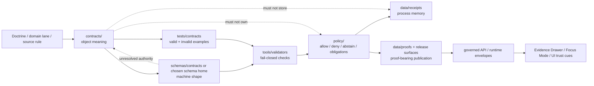

<!-- [KFM_META_BLOCK_V2]
doc_id: kfm://doc/TODO-contracts-readme-uuid
title: contracts
type: standard
version: v1
status: draft
owners: @bartytime4life
created: TODO-NEEDS-VERIFICATION
updated: 2026-04-26
policy_label: TODO-NEEDS-VERIFICATION
related: [../README.md, ../schemas/README.md, ../schemas/contracts/README.md, ../schemas/contracts/v1/README.md, ../policy/README.md, ../tests/README.md, ../tests/contracts/README.md, ../tools/validators/README.md, ../data/receipts/README.md]
tags: [kfm, contracts, schemas, policy, validators, evidence, proof-objects, governance]
notes: [doc_id and created date need live-repo verification; policy_label needs policy-owner confirmation; active-checkout inventory must be rechecked before merge; this revision preserves the current contracts lane role while making the root-vs-schema authority split explicit; all tree snapshots in this README must be refreshed against the active checkout before being treated as current implementation evidence.]
[/KFM_META_BLOCK_V2] -->

<a id="top"></a>

# `contracts/`

Contract-first lane for KFM’s shared object meanings, trust-bearing envelopes,
proof-object semantics, and compatibility rules.

<div align="left">


</div>

> [!IMPORTANT]
> **Status:** experimental  
> **Owners:** `@bartytime4life`  
> **Path:** `contracts/README.md`  
> **Primary job:** define object meaning, field intent, lifecycle expectations,
> compatibility posture, and trust-visible semantics.  
> **Not this lane:** policy logic, runtime code, receipt storage, workflow
> orchestration, emitted proof packs, or silent schema-home authority.  
> **Evidence posture:** doctrine-grounded; active-checkout and public-snapshot
> inventory remain **NEEDS VERIFICATION** before merge.

> [!WARNING]
> `contracts/` is a real and important root lane, but it must not quietly
> overrule `schemas/contracts/` by directory name alone. Until the repo records
> one canonical machine-contract home, contract, schema, fixture, validator, and
> runtime-proof surfaces must be updated together and reviewed as one trust
> boundary.

## Navigation

| Start here | Build / review | Reference |
|---|---|---|
| [Purpose](#purpose) | [Quickstart](#quickstart) | [Contract family registry](#contract-family-registry) |
| [Scope](#scope) | [Contract card pattern](#contract-card-pattern) | [Compatibility matrix](#compatibility-matrix) |
| [Repo fit](#repo-fit) | [Validation and gates](#validation-and-gates) | [FAQ](#faq) |
| [Boundary rules](#boundary-rules) | [Definition of done](#definition-of-done) | [Appendix](#appendix) |

---

## Purpose

`contracts/` converts KFM doctrine into stable, reviewable contract language for
trust-bearing objects.

Contracts exist here so that:

- doctrine does not remain prose-only;
- proof-bearing objects can be tested before promotion;
- runtime surfaces receive stable payload semantics;
- process memory, proof, correction, release, and runtime envelopes stay
  distinct;
- validators and tests can consume declared shapes without becoming semantic
  authority;
- contributors can see where object meaning stops and policy, storage,
  validation, and runtime behavior begin.

### The governing sentence

A KFM contract defines what an object **means**, what it must remain compatible
with, what downstream trust surfaces may rely on, and what adjacent lanes must
validate before the object is used for publication or runtime claims.

It does **not** publish data, make policy decisions, store receipts, execute
pipelines, or replace evidence.

[Back to top](#top)

---

## Scope

This README has six jobs:

1. Define what the contract lane owns.
2. Keep the contract / schema / policy / validator / storage split explicit.
3. Reflect the known root-lane shape without overstating active-checkout
   inventory.
4. Route contributors toward adjacent lanes before responsibilities blur.
5. Keep root-vs-schema machine-contract ambiguity visible until an ADR resolves
   it.
6. Prevent proposed files from hardening into “implemented fact” by tone, path,
   or repetition.

### Why contracts first

| Reason | Contract-lane outcome |
|---|---|
| Prevent silent drift | Object meaning has a named home before schemas and fixtures encode it. |
| Enable validation | Validators consume stable shape and linkage expectations. |
| Preserve trust | Proof objects remain inspectable and reviewable. |
| Support runtime | APIs and UI trust surfaces can emit stable envelopes. |
| Enable correction | Correction and supersession lineage stays machine-visible. |
| Support release discipline | Promotion, receipts, proofs, and release manifests can join through declared refs. |

### Current maturity split

| Claim type | Current README posture |
|---|---|
| KFM needs a contract lane | **CONFIRMED doctrine** |
| `contracts/` owns meaning and compatibility language | **CONFIRMED doctrine / README intent** |
| Root-vs-schema machine-contract authority | **CONFLICTED / NEEDS VERIFICATION** |
| Exact active-checkout file inventory | **NEEDS VERIFICATION** |
| Validator, CI, runtime, and publication enforcement | **UNKNOWN** unless proven by current repo evidence |

[Back to top](#top)

---

## Repo fit

| Field | Value |
|---|---|
| Path | `contracts/README.md` |
| Role | Root contract lane for shared object definitions, field semantics, lifecycle semantics, and compatibility expectations. |
| Upstream | `../README.md` — repo identity, doctrine, and navigation. |
| Lateral authority surfaces | `../schemas/README.md`, `../schemas/contracts/README.md`, `../schemas/contracts/v1/README.md`, `../policy/README.md`. |
| Verification surfaces | `../tests/README.md`, `../tests/contracts/README.md`, `../tools/validators/README.md`. |
| Process-memory / proof adjacency | `../data/receipts/README.md`, proof-pack lanes, release lanes, and correction lanes when present. |
| Current maturity | Experimental; active checkout remains **NEEDS VERIFICATION**. |

### Neighbor map

| Surface | Owns | Must not silently own |
|---|---|---|
| `contracts/` | Object meaning, field intent, lifecycle semantics, compatibility expectations. | Policy decisions, emitted instances, workflow behavior. |
| `schemas/` / `schemas/contracts/` | Machine-checkable shape, schema fragments, executable constraints. | Semantic doctrine as the only source of meaning. |
| `policy/` | Allow / deny / abstain / obligation logic, rights, sensitivity, publication admissibility. | Object schemas or receipt storage. |
| `tests/contracts/` | Valid and invalid examples, fail-closed proof, contract drift detection. | Contract authority or policy authority. |
| `tools/validators/` | Deterministic checks, linkage validation, reviewable reports. | Schema ownership, policy sovereignty, publication. |
| `data/receipts/` | Process-memory instances. | Normative contract definitions. |
| `data/proofs/` | Release-grade proof-bearing objects. | Raw contract meaning or runtime behavior. |
| governed API / UI | Runtime presentation of released, policy-safe objects. | Canonical object meaning or evidence authority. |

> [!TIP]
> A healthy KFM contract change should make each adjacent lane stronger without
> making any lane pretend to be another.

[Back to top](#top)

---

## Boundary rules

### Accepted inputs

This lane accepts:

- contract definitions and object-family boundaries;
- field-level meaning and required linkage semantics;
- compatibility and versioning rules;
- object cards for proof-bearing or runtime-facing families;
- contract-level examples tied to validation, interpretation, or review;
- source-admission contract notes when they define object meaning rather than
  source policy;
- migration notes when contract authority moves or is reconciled;
- explicit placeholder warnings where active-checkout inventory is not verified.

### Exclusions

Do **not** place these here:

| Item | Better home | Why |
|---|---|---|
| Policy rules or allow/deny logic | `../policy/` | Policy must remain executable and decision-sovereign. |
| Runtime code | `../apps/`, `../packages/`, or `../tools/` | Implementations consume contracts; they do not live here. |
| Actual receipts | `../data/receipts/` or `../data/run_receipts/` | This lane defines objects; it does not store instances. |
| Proof packs, signatures, attestations | proof / attest lanes | Integrity artifacts are adjacent, not contract definitions. |
| Workflow YAML | `../.github/workflows/` | Orchestration belongs in the delivery/control plane. |
| Exploratory notes | `../docs/` or an explicitly labeled archive | Narrative design notes must not masquerade as contract authority. |
| Duplicate mirror files | One canonical home plus explicit pointer strategy | Duplicate truth surfaces create semantic drift. |

> [!CAUTION]
> Contracts define objects. They never store events, decide policy, publish
> artifacts, or orchestrate execution.

### Stop signs

Pause and resolve authority before merging when:

- the same object family is being added under both `contracts/` and
  `schemas/contracts/`;
- validators point to one path while fixtures or runtime-proof point to another;
- a field meaning changes but the field name does not;
- policy consequences are implied but no policy reviewer has signed off;
- Evidence Drawer, Focus Mode, release, or correction behavior changes without
  a runtime-proof or release-proof test plan;
- a prior PDF or source packet is being copied in as if it were current repo
  evidence.

[Back to top](#top)

---

## Directory tree

> [!NOTE]
> The tree below is a working contract-lane map. Re-run the inspection commands
> in [Quickstart](#quickstart) against the active checkout before treating any
> path as current implementation evidence.

### Root contract lane

```text
contracts/
├── README.md
├── adaptive_change/
├── consent_ledger/
├── hydro_mapping/
├── source/
├── tiler/
├── vocab/
└── promotion_review_handoff.md
```

### Safe reading of current subtrees

| Subtree or file | Safe interpretation | Review posture |
|---|---|---|
| `adaptive_change/` | Domain or object-family contract area. | Purpose and contents **NEED VERIFICATION** before this README explains more. |
| `consent_ledger/` | Consent / ledger-shaped contract area. | Sensitive semantics; verify owner and policy adjacency. |
| `hydro_mapping/` | Hydrology mapping contract area. | Likely tied to hydrology proof lane; verify current scope. |
| `source/` | Source-admission contract lane. | Source descriptors belong nearby, but source rights and policy stay separate. |
| `tiler/` | Tile or delivery-facing contract lane. | Must not become runtime or publication authority. |
| `vocab/` | Governed vocabulary / token lane. | Must stay reconciled with schema-side vocab registries. |
| `promotion_review_handoff.md` | Promotion / review handoff note. | Should cross-link policy, tests, proof, and release docs when verified. |

### Adjacent machine-file signal

```text
schemas/
└── contracts/
    ├── README.md
    ├── v1/
    │   ├── common/
    │   ├── correction/
    │   ├── data/
    │   ├── evidence/
    │   ├── policy/
    │   ├── release/
    │   ├── runtime/
    │   └── source/
    └── vocab/
```

> [!IMPORTANT]
> `schemas/contracts/v1/` is a machine-file signal, but schema-home authority
> remains unresolved here. Do not infer enforcement-grade maturity from file
> presence alone.

[Back to top](#top)

---

## Quickstart

### Before adding a contract

1. Reopen `contracts/README.md`, `schemas/README.md`,
   `schemas/contracts/README.md`, and `schemas/contracts/v1/README.md`
   together.
2. Confirm whether the object belongs in the current canonical contract home or
   is blocked on schema-home resolution.
3. Define meaning and machine shape together.
4. Add valid and invalid fixtures in the verified fixture home.
5. Wire validators and tests to one authoritative path.
6. Review policy impact before relying on the object downstream.
7. Update docs and task lists in the same change.

### Safe inspection commands

```bash
# Inspect root and schema-side contract surfaces together.
find contracts -maxdepth 3 -type f | sort
find schemas/contracts -maxdepth 4 -type f | sort

# Reopen lane docs before adding trust-bearing files.
sed -n '1,260p' contracts/README.md
sed -n '1,260p' schemas/README.md
sed -n '1,260p' schemas/contracts/README.md
sed -n '1,260p' schemas/contracts/v1/README.md
sed -n '1,220p' tests/contracts/README.md
sed -n '1,220p' tools/validators/README.md

# Search for canonical-home and object-family language.
git grep -nE 'canonical|schema home|contract home|EvidenceBundle|DecisionEnvelope|SourceDescriptor|ReleaseManifest|RuntimeResponseEnvelope|CorrectionNotice|run_receipt|ai_receipt' -- \
  contracts schemas tests policy tools docs .github
```

### Minimal illustrative schema companion

```json
{
  "$schema": "https://json-schema.org/draft/2020-12/schema",
  "title": "Illustrative KFM Contract Object",
  "type": "object",
  "required": ["id", "object_family", "spec_hash"],
  "properties": {
    "id": { "type": "string" },
    "object_family": { "type": "string" },
    "spec_hash": { "type": "string" }
  },
  "additionalProperties": false
}
```

> [!WARNING]
> The JSON above is illustrative. Do not land it as a canonical schema without
> checking the current schema-home ADR or creating one.

[Back to top](#top)

---

## Contract card pattern

Use object cards when a family becomes important enough to affect schemas,
validators, fixtures, policy, runtime, release, or correction behavior.

```markdown
## ObjectName

| Field | Value |
|---|---|
| Status | CONFIRMED concept / PROPOSED implementation / NEEDS VERIFICATION |
| Purpose | What this object means in KFM |
| Upstream authority | Doctrine, source registry, domain lane, ADR, or governing doc |
| Downstream consumers | Schemas, fixtures, validators, policy, runtime, UI, receipts, proofs |
| Storage home | Where emitted instances live, if any |
| Schema home | Chosen canonical schema path or NEEDS VERIFICATION |
| Fixture home | Valid/invalid fixture path or NEEDS VERIFICATION |
| Validator | Entrypoint or validator runbook |
| Policy adjacency | Allow/deny/obligation rules affected |
| Compatibility note | Breaking / additive / docs-only |
| Open questions | What must be verified before promotion |
```

### Root-vs-schema reading rule

Use `contracts/` for **meaning and family boundaries**. Use the chosen schema
surface for **machine-checkable shape**. Until the repo records one canonical
machine-contract home:

- do not add the same object family under both roots without an explicit mirror
  strategy;
- do not point validators at one path and tests at another;
- do not let runtime-proof fixtures choose authority by convenience;
- do not let README wording outrun the actual tree.

[Back to top](#top)

---

## Contract flow


```mermaid
flowchart LR
  D[Doctrine / domain lane / source rule] --> C[contracts/<br/>object meaning]
  C --> S[schemas/contracts or chosen schema home<br/>machine shape]
  C --> F[tests/contracts<br/>valid + invalid examples]
  S --> V[tools/validators<br/>fail-closed checks]
  F --> V
  V --> P[policy/<br/>allow / deny / abstain / obligations]
  P --> R[data/receipts<br/>process memory]
  P --> PF[data/proofs + release surfaces<br/>proof-bearing publication]
  PF --> API[governed API / runtime envelopes]
  API --> UI[Evidence Drawer / Focus Mode / UI trust cues]

  C -. must not own .-> P
  C -. must not store .-> R
  S -. unresolved authority .-> C
```

### Lifecycle placement

```text
RAW -> WORK / QUARANTINE -> PROCESSED -> CATALOG / TRIPLET -> PUBLISHED
          |                    |                 |                    |
          |                    |                 |                    └─ governed API / UI
          |                    |                 └─ proof + release objects
          |                    └─ normalized object instances
          └─ contracts describe meaning; they do not store lifecycle data
```

[Back to top](#top)

---

## Contract family registry

| Family | Role | Status | Companion burden |
|---|---|---|---|
| `SourceDescriptor` | Source identity, admission context, source role, refresh expectations. | **CONFIRMED concept** | Source registry fixture, source-role policy, rights/sensitivity review. |
| `DatasetVersion` | Dataset identity and version semantics. | **CONFIRMED concept** | Version fixture, catalog linkage, deterministic hash rule. |
| `EvidenceBundle` | Support and evidence grouping. | **CONFIRMED concept** | EvidenceRef resolution, citation checks, Evidence Drawer payload. |
| `DecisionEnvelope` | Finite decision and policy-result carrier. | **CONFIRMED concept** | Policy outcome fixtures, promotion/runtime validation. |
| `ReleaseManifest` | Release object and publication linkage. | **CONFIRMED concept** | Release fixtures, proof-pack linkage, rollback reference. |
| `RuntimeResponseEnvelope` | Outward runtime response contract. | **CONFIRMED concept** | Runtime-proof fixtures, finite outcomes, citation/evidence checks. |
| `CorrectionNotice` | Correction, supersession, withdrawal lineage. | **CONFIRMED concept** | Correction fixtures, propagation checks, release/correction drill. |
| `run_receipt` | Process-memory trace. | **CONFIRMED concept** | Receipt schema or contract, process-memory storage, validator report. |
| `ai_receipt` | AI/model/runtime trace. | **CONFIRMED concept** | Bounded-AI policy, citation validation, no-chain-of-thought storage rule. |
| Lane-specific overlays | Domain-specific contract additions. | **PROPOSED / NEEDS VERIFICATION** | Source steward review, sensitivity policy, fixture coverage. |

### Contract-home caution matrix

| Situation | Safe action |
|---|---|
| Both `contracts/` and `schemas/contracts/` look plausible. | Stop and reopen both parent READMEs before adding files. |
| Validator examples point one way but tests point another. | Reconcile authority before merging. |
| A runtime-proof slice wants a new envelope quickly. | Do not let test convenience choose the contract home. |
| A vocabulary term appears in multiple schemas. | Reconcile with `contracts/vocab/` and schema-side vocab registries. |
| A domain lane wants a shortcut contract. | Add object card, fixtures, and policy adjacency before use. |
| A proposed file path appears in a prior PDF. | Treat it as lineage or proposal until active checkout confirms it. |

[Back to top](#top)

---

## Compatibility matrix

| Change | Compatibility impact |
|---|---|
| Add optional field without changing meaning. | Usually non-breaking. |
| Add required field. | Breaking. |
| Remove required or optional field. | Breaking unless explicitly deprecated first. |
| Rename field. | Breaking. |
| Change field meaning without changing field name. | Breaking. |
| Narrow enum / reason codes. | Usually breaking. |
| Widen enum / reason codes. | Review-required; may be non-breaking. |
| Clarify prose without changing validators or fixtures. | Docs-only. |
| Move canonical home. | Breaking unless an ADR, aliases, and migration notes exist. |

### Compatibility rule

When in doubt, choose the stricter interpretation:

- if validators, fixtures, runtime-proof, or release expectations change, treat
  it as contract-impacting;
- if two homes would need updating together, stop and resolve canonical
  authority before versioning both;
- if the change affects public trust cues, Evidence Drawer, Focus Mode, or
  release/correction behavior, require policy-aware review.

[Back to top](#top)

---

## Validation and gates

A contract is not ready for downstream reliance until it has proof pressure near
it.

| Gate | Purpose | Expected lane |
|---|---|---|
| Object card | Explain object meaning and status. | `contracts/` |
| Schema validation | Enforce machine shape. | `schemas/` or chosen schema home. |
| Valid fixtures | Prove accepted shape. | `tests/contracts/` or chosen fixture home. |
| Invalid fixtures | Prove fail-closed behavior. | `tests/contracts/` or chosen fixture home. |
| Validator invocation | Produce deterministic pass/fail report. | `tools/validators/` |
| Policy adjacency | Review allow/deny/obligation impact. | `policy/` |
| Runtime-proof | Prove outward finite response behavior. | `tests/e2e/runtime_proof/` when present. |
| Release/correction drill | Prove publication, rollback, and correction semantics. | release / proof / correction surfaces. |

### Healthy promotion sequence

1. Define the contract.
2. Define or reconcile the machine-checkable shape.
3. Add valid and invalid fixtures.
4. Wire validators to one authoritative path.
5. Review policy consequences.
6. Prove runtime or release behavior when the object crosses a public boundary.
7. Promote only after the object can fail closed.

### Suggested negative tests

| Risk | Negative test |
|---|---|
| Contract exists with no schema companion. | Validator reports missing schema home or approved ADR exception. |
| Runtime emits uncited answer envelope. | Runtime proof returns `ABSTAIN`, `DENY`, or validation failure. |
| Policy-sensitive object lacks policy adjacency. | Promotion gate fails closed. |
| Release object lacks rollback reference. | Release manifest validation fails. |
| Correction notice cannot trace prior release. | Correction drill fails. |
| Receipt is stored inside `contracts/`. | Repository hygiene check fails. |

[Back to top](#top)

---

## Definition of done

### For a new contract family

- [ ] Family placement is reconciled against current contract-home authority.
- [ ] Object card exists and uses truth labels honestly.
- [ ] Schema and semantics are documented together.
- [ ] Valid fixture exists.
- [ ] Invalid fixture exists.
- [ ] Validator entrypoint or validator runbook exists.
- [ ] Policy impact is reviewed.
- [ ] Runtime-proof impact is reviewed when outward-facing.
- [ ] Receipt/proof/storage home is named if emitted instances exist.
- [ ] Release/correction impact is reviewed when publication-significant.
- [ ] Docs are updated in the same change.

### For reviewing this README

- [ ] No path is described as canonical without evidence.
- [ ] No schema-side competing signal is ignored.
- [ ] No runtime-proof surface redefines contract authority silently.
- [ ] No storage lane responsibility is pulled into this lane.
- [ ] No policy or workflow logic is smuggled into contract definitions.
- [ ] Current tree claims are rechecked against the active branch.
- [ ] Placeholders in the KFM meta block are either resolved or intentionally
      retained with notes.

### Do not merge until

- [ ] `doc_id`, `created`, and `policy_label` placeholders are either resolved
      or explicitly approved as TODOs.
- [ ] The root-vs-schema authority question is captured in an ADR or an existing
      ADR is linked here.
- [ ] The active checkout inventory has been re-run and any tree/table claims
      have been corrected.

[Back to top](#top)

---

## FAQ

### Are contracts the same as schemas?

No. Contracts define meaning, compatibility intent, and family boundaries.
Schemas enforce machine shape. KFM needs both, and it needs their relationship
to be explicit.

### Is `contracts/` the canonical machine-contract home?

**NEEDS VERIFICATION.** `contracts/` is a real and important root lane, but the
repo also carries a `schemas/contracts/` machine-file signal. The authority
decision should be recorded in an ADR and reflected in both parent READMEs.

### Are receipts stored here?

No. Receipt-shaped objects may be defined here, but emitted receipts belong
under receipt/process-memory lanes.

### Can policy rules live in contract files?

No. Contracts may name the policy adjacency, but allow/deny/abstain logic
belongs in `policy/`.

### Why mention Evidence Drawer, Focus Mode, or runtime proof here?

Because outward-facing envelopes and evidence bundles depend on stable contract
meaning. Runtime and UI trust surfaces should consume contracts; they should not
improvise their own object semantics.

### What should happen when a prior PDF proposes a path?

Treat the proposed path as lineage until the active checkout confirms it. If it
still fits, land it through contract, schema, fixture, validator, and policy
review rather than copying it in by inertia.

[Back to top](#top)

---

## Appendix

<details>
<summary><strong>Status vocabulary</strong></summary>

| Label | Meaning in this README |
|---|---|
| **CONFIRMED** | Directly supported by active-checkout evidence, public snapshot evidence, attached KFM doctrine, or reviewed repository documentation. |
| **INFERRED** | Conservative interpretation of visible structure or repeated doctrine, not formal implementation proof. |
| **PROPOSED** | Recommended behavior, file family, or placement not yet verified as landed implementation. |
| **UNKNOWN** | Not verified strongly enough to state. |
| **NEEDS VERIFICATION** | Must be checked against active branch, owner registry, workflow, or runtime evidence before stronger claims. |
| **CONFLICTED** | Authority or evidence is unresolved, usually because two plausible homes or meanings exist. |

</details>

<details>
<summary><strong>Review triggers</strong></summary>

| Change type | Minimum review burden |
|---|---|
| Contract family added. | Contract/schema owner + fixture and validator evidence. |
| Field removed, renamed, or reinterpreted. | Contract/schema owner + downstream consumer review. |
| Schema-home or contract-home changed. | ADR + contract/schema owner + policy-aware reviewer. |
| Policy-adjacent meaning changed. | Policy owner + negative-case tests. |
| Release or correction object changed. | Release steward + proof/correction drill evidence. |
| Runtime envelope changed. | Runtime/API reviewer + runtime-proof evidence. |
| Evidence Drawer or Focus Mode payload affected. | Shell/UI reviewer + trust-visible state review. |
| Source-admission contract changed. | Source steward + rights/sensitivity review. |

</details>

<details>
<summary><strong>Root-vs-schema contradiction watchlist</strong></summary>

Keep these tensions visible until an ADR resolves them:

1. `contracts/` is a real root lane, but `schemas/contracts/` is also a real
   machine-file-bearing signal.
2. Root `contracts/vocab/` and schema-side vocab registries can drift if no
   explicit relationship is written down.
3. Validators, fixtures, and runtime-proof should consume one authoritative path.
4. Object families may be conceptually confirmed while their machine homes remain
   **NEEDS VERIFICATION**.
5. Public tree presence is not the same as active-checkout enforcement.

</details>

<details>
<summary><strong>Contributor quick prompts</strong></summary>

Before opening a PR, answer these in the PR body:

1. What object meaning changes?
2. What schema, fixture, validator, and policy surfaces changed with it?
3. What public or steward-facing runtime surfaces consume the object?
4. What breaks if this contract is wrong?
5. What proof shows this object can fail closed?
6. What rollback or correction path exists?

</details>

[Back to top](#top)
