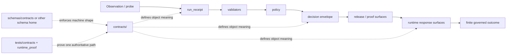

<!-- [KFM_META_BLOCK_V2]
doc_id: kfm://doc/<UUID_NEEDS_VERIFICATION>
title: Contracts
type: standard
version: v1
status: draft
owners: @bartytime4life
created: <DATE_NEEDS_VERIFICATION>
updated: 2026-04-18
policy_label: <POLICY_LABEL_NEEDS_VERIFICATION>
related: [../README.md, ../CONTRIBUTING.md, ../schemas/README.md, ../schemas/contracts/README.md, ../policy/README.md, ../tools/validators/README.md, ../tools/probes/README.md, ../tests/README.md, ../tests/contracts/README.md, ../tests/e2e/runtime_proof/, ../data/receipts/README.md, ../.github/workflows/README.md]
tags: [kfm, contracts, schemas, proof-objects, receipts, trust-objects, runtime-proof]
notes: [Root contracts lane aligned to the current doctrinal split across schemas, policy, validators, and tests., This revision makes root-vs-schema contract-home ambiguity explicit rather than letting path names imply authority., run_receipt remains a concrete thin-slice contract concept under process-memory doctrine., Exact subtree inventory, owners, policy label, and final canonical machine-contract home remain branch-verification items.]
[/KFM_META_BLOCK_V2] -->

<a id="top"></a>

# `contracts/`

Machine-checkable contract lane for KFM’s shared object definitions, trust-visible envelopes, proof-bearing references, and contract-first release semantics.

<div align="left">


</div>

| Field | Value |
|---|---|
| **Path** | `contracts/README.md` |
| **Status** | experimental |
| **Owners** | `@bartytime4life` |
| **Primary job** | define object shape, semantics, and compatibility expectations for contract-bearing surfaces |
| **Not this lane** | policy logic, runtime code, receipt storage, workflow orchestration, silent schema-home authority |
| **Current emphasis** | doctrine, routing, thin-slice contract concepts, and explicit root-vs-schema placement caution |

**Quick jumps:** [Scope](#scope) · [Evidence posture](#evidence-posture) · [Repo fit](#repo-fit) · [Accepted inputs](#accepted-inputs) · [Exclusions](#exclusions) · [Directory tree](#directory-tree) · [Quickstart](#quickstart) · [Usage](#usage) · [Diagram](#diagram) · [Reference tables](#reference-tables) · [Starter contract wave](#starter-contract-wave) · [Versioning rules](#versioning-rules) · [Validation and gates](#validation-and-gates) · [Task list](#task-list--definition-of-done) · [FAQ](#faq) · [Appendix](#appendix)

> [!IMPORTANT]
> This lane defines **shape and declared meaning**, not behavior.
>
> Contracts here should remain:
> - machine-checkable
> - versionable
> - validator-consumable
> - policy-compatible
> - runtime-consumable without becoming runtime logic
>
> They must **not** become:
> - policy engines
> - receipt stores
> - workflow glue
> - agent orchestration
> - a silent winner in the current machine-contract home split

> [!WARNING]
> Current evidence is strongest for **doctrine, routing, and lane boundaries**, not full subtree population.  
> Treat concrete file presence and directory completeness as **NEEDS VERIFICATION** unless confirmed on the active branch.

> [!TIP]
> Read `contracts/` as a **root contract lane with unresolved canonical-home implications**.  
> It is real, meaningful, and adjacent to enforcement — but current project evidence does not let this README quietly overrule `schemas/contracts/` by path name alone.

---

## Scope

This directory converts KFM doctrine into **machine-checkable truth objects**.

Contracts here exist so that:

- doctrine does not remain prose-only
- proof-bearing objects are testable before promotion
- runtime surfaces receive stable payloads
- process memory, proof, correction, release, and runtime envelopes stay distinct
- validators and tests can consume one declared shape at a time

This README now has six jobs:

1. define what a contract lane is responsible for
2. keep the contract / schema / policy / validator / storage split explicit
3. describe the thin-slice contract concepts already visible in project doctrine
4. route contributors toward the correct adjacent lane before they mix responsibilities
5. make root-vs-schema machine-contract ambiguity explicit
6. prevent the root `contracts/` path from silently being treated as sovereign law when the broader repo still shows split signals

### Why contracts exist

| Reason | Outcome |
|---|---|
| Prevent silent drift | schema + fixtures can fail closed |
| Enable validation | validators consume stable shapes |
| Preserve trust | objects remain inspectable and reviewable |
| Support runtime | APIs and request-time surfaces emit stable envelopes |
| Enable correction | lineage remains machine-visible |
| Support release discipline | promotion and proof surfaces can join the same declared objects |

### Evidence posture used here

| Label | Meaning |
|---|---|
| **CONFIRMED** | supported by the supplied draft or adjacent repo doctrine already surfaced |
| **INFERRED** | strongly implied by KFM doctrine, but not directly proven by mounted inventory |
| **PROPOSED** | recommended lane behavior or placement that should not be mistaken for landed state |
| **UNKNOWN** | not supported strongly enough by current evidence |
| **NEEDS VERIFICATION** | branch-specific inventory, file presence, ownership, or placement must still be checked |

[Back to top](#top)

---

## Evidence posture

| Surface or claim | Status | Why it matters |
|---|---|---|
| `contracts/` is a real top-level lane | **CONFIRMED** | root contract routing is no longer hypothetical |
| this lane is adjacent to `schemas/`, `policy/`, `tools/validators/`, `tests/contracts/`, and `data/receipts/` | **CONFIRMED** | the split between meaning, validation, policy, and storage is central to KFM doctrine |
| `run_receipt` is a concrete thin-slice contract concept | **CONFIRMED** | process-memory doctrine already pressures this lane |
| release-, runtime-, correction-, evidence-, and policy-shaped contract families are doctrinally expected | **INFERRED** | they are repeatedly present in surrounding KFM vocabulary and prior lane docs |
| root `contracts/` is the canonical machine-contract home | **NEEDS VERIFICATION** | `schemas/contracts/` remains a real competing signal |
| root `contracts/vocab/` is the canonical machine-readable vocabulary home | **NEEDS VERIFICATION** | schema-side JSON vocab placeholders also exist |
| runtime-proof tests should consume one authoritative contract path only | **INFERRED** | this follows directly from fail-closed doctrine and anti-drift rules |
| `building_block` and `evidence_bundle` should land under this root | **PROPOSED** | useful candidate direction, but not yet branch-proven or authority-resolved |

[Back to top](#top)

---

## Repo fit

**Path:** `contracts/README.md`  
**Role in repo:** root contract lane for shared object definitions and compatibility semantics.

### Neighbor map

| Surface | Role | Relationship |
|---|---|---|
| `contracts/` | root contract lane | this file defines lane role and routing |
| [`../schemas/README.md`](../schemas/README.md) | parent schema boundary and live subtree index | adjacent machine-shape surface with unresolved authority overlap |
| [`../schemas/contracts/README.md`](../schemas/contracts/README.md) | schema-side contract subtree | visible machine-file-bearing signal that prevents silent root authority claims |
| [`../policy/README.md`](../policy/README.md) | decision logic | contracts define shape; policy decides allow/deny/obligations |
| [`../tools/validators/README.md`](../tools/validators/README.md) | validation lane | validators consume declared shapes and linkage |
| [`../tools/probes/README.md`](../tools/probes/README.md) | observation lane | probes may emit receipt-shaped process memory against declared contracts |
| [`../tests/README.md`](../tests/README.md) | repo-wide verification surface | broader proof and coverage belong there |
| [`../tests/contracts/README.md`](../tests/contracts/README.md) | contract-facing verification lane | tests should target one authoritative contract path |
| [`../tests/e2e/runtime_proof/`](../tests/e2e/runtime_proof/) | request-time proof family | runtime-proof should consume, not redefine, contract authority |
| [`../data/receipts/README.md`](../data/receipts/README.md) | receipt storage lane | actual instances live there, not here |
| [`../.github/workflows/README.md`](../.github/workflows/README.md) | orchestration and gatehouse | workflows run checks; they do not define contract meaning |

### Boundary rule

| Question | Correct lane |
|---|---|
| What fields exist? | `contracts/` or the chosen canonical machine-contract home |
| What shape-checking artifact enforces it? | `schemas/` / schema surface |
| Did it pass validation? | `tools/validators/` |
| Should it be allowed? | `policy/` |
| Where is the instance stored? | `data/receipts/` or another data lane |
| Where is request-time behavior proved? | `tests/e2e/runtime_proof/` |

> [!TIP]
> If a file mixes two of these responsibilities, it is in the wrong lane.

### Working interpretation

The safest reading today is:

1. `contracts/` is a **real root lane**
2. it is doctrinally important and should not be treated as empty or decorative
3. it should describe object families and compatibility semantics clearly
4. it should **not** quietly overrule `schemas/contracts/` until the repo explicitly resolves canonical machine-contract authority
5. tests, validators, and runtime-proof should eventually point at **one** authoritative path only

[Back to top](#top)

---

## Accepted inputs

This lane accepts:

- contract definitions and family boundaries
- object semantics and field-level meaning
- compatibility and versioning rules
- contract-level examples when they are directly tied to validation or interpretation
- root-lane routing notes for trust-bearing object families
- migration notes when contract authority moves or is reconciled

### Thin-slice focus (current)

The strongest current pressure is:

- **`run_receipt`** — process-memory contract concept
- **release / runtime / correction / evidence / policy envelopes** — repeatedly implied object families
- **PROPOSED:** `building_block` and `evidence_bundle` as contract-facing additions that must be reconciled against schema-home authority before landing

This implies support for:

- probe receipts
- validator inputs
- runtime trace carriers
- release linkage inputs
- finite outcome envelopes
- request-time proof surfaces that depend on stable shapes

### Minimum bar for anything added here

- it defines object shape or semantics rather than execution behavior
- it keeps policy rules out of the contract body
- it keeps receipt storage out of the contract lane
- it does not create a second silent source of truth alongside another contract home
- it names compatibility impact when the change is not purely additive

[Back to top](#top)

---

## Exclusions

Do **not** place here:

| Item | Better home | Why |
|---|---|---|
| policy rules or allow/deny logic | `policy/` | policy must stay executable and reviewable in its own lane |
| runtime code | `apps/`, `packages/`, or `tools/` | implementations consume contracts; they do not live here |
| actual receipts | `data/receipts/` | this lane defines objects; it does not store instances |
| proof packs or attestations | proof / attest lanes | integrity artifacts are adjacent, not identical to contract definitions |
| workflow YAML | `.github/workflows/` | control-plane logic belongs outside the contract lane |
| exploratory notes | `docs/` | narrative design notes should not masquerade as contract authority |
| mirror files created only for convenience | one canonical home plus explicit pointer strategy | duplicate truth surfaces create drift |

> [!CAUTION]
> Contracts define objects.  
> They never **store events**, **decide policy**, or **orchestrate execution**.

[Back to top](#top)

---

## Directory tree

### Conservative root-lane shape

```text
contracts/
├── README.md
├── source/       # PROPOSED
├── core/         # PROPOSED
├── policy/       # PROPOSED
├── release/      # PROPOSED
├── runtime/      # PROPOSED
├── correction/   # PROPOSED
└── profiles/     # PROPOSED
```

### Current thin-slice signal

```text
contracts/
└── run_receipt.schema.json   # NEEDS VERIFICATION
```

### Adjacent competing signal

```text
schemas/
└── contracts/
    ├── README.md
    ├── v1/
    └── vocab/
```

> [!NOTE]
> The first tree above is a **conservative lane-fit sketch**, not a claim that each family directory already exists on the active branch.  
> The second and third blocks are included because current project documentation now requires this README to acknowledge the schema-side contract signal instead of pretending the root path settles the question by itself.

[Back to top](#top)

---

## Quickstart

### Before adding a contract

1. inspect `contracts/README.md` and `schemas/README.md` together
2. reopen `schemas/contracts/README.md` and `tests/contracts/README.md`
3. decide whether the new object belongs in the currently chosen contract home or is still blocked on authority resolution
4. define schema and semantics together
5. add valid and invalid fixtures
6. wire validators and tests to the **same** authoritative path
7. update docs in the same reviewed change

### Minimal schema example

```json
{
  "$schema": "https://json-schema.org/draft/2020-12/schema",
  "type": "object",
  "required": ["id"],
  "properties": {
    "id": { "type": "string" }
  }
}
```

### Minimal `run_receipt` example

```json
{
  "source": "example",
  "fetch_ts": "2026-04-16T00:00:00Z",
  "spec_hash": "abc...",
  "changed_items": [],
  "transport_status": 200
}
```

### Safe inspection commands

```bash
# Reopen contract and schema surfaces together
sed -n '1,260p' contracts/README.md
sed -n '1,260p' schemas/README.md
sed -n '1,260p' schemas/contracts/README.md
sed -n '1,260p' tests/contracts/README.md

# Search for contract-home and schema-home language before adding files
git grep -nE 'canonical|contract home|schema home|run_receipt|evidence_bundle|building_block' -- \
  contracts schemas tests policy docs .github
```

[Back to top](#top)

---

## Usage

### Contract flow

```python
obj = Model.validate(payload)
out = transform(obj)
Model.validate(out)
```

### Contracts should prove

- shape correctness
- semantic stability
- failure-mode clarity
- compatibility expectations
- trust-visible linkage surfaces

### Root-vs-schema reading rule

Use this lane for **contract meaning and family boundaries**.

Use the schema-side material for **machine-shape enforcement details** where that is the currently mounted source of truth.

Until the repo writes down one canonical machine-contract home:

- do not add the same family under both roots without an explicit mirror strategy
- do not point validators at one path and tests at another
- do not let runtime-proof fixtures choose authority by convenience
- do not let README wording outrun the actual tree

### Thin-slice process-memory rule

`run_receipt` belongs here as a contract concept because it defines a process-memory object shape.

The actual emitted receipt instance belongs elsewhere:

- probes may emit it
- validators may check it
- receipts lanes may store it
- policy may react to it
- but this lane should only define what it **is**

[Back to top](#top)

---

## Diagram


```mermaid
flowchart LR
    P[Observation / probe] --> RR[run_receipt]
    RR --> V[validators]
    V --> POL[policy]
    POL --> DEC[decision envelope]
    DEC --> REL[release / proof surfaces]
    REL --> RT[runtime response surfaces]
    RT --> OUT[finite governed outcome]

    C[contracts/] -. defines object meaning .-> RR
    C -. defines object meaning .-> DEC
    C -. defines object meaning .-> RT

    S[schemas/contracts or other schema home] -. enforces machine shape .-> C
    T[tests/contracts + runtime_proof] -. prove one authoritative path .-> C
```

[Back to top](#top)

---

## Reference tables

### Contract families

| Family | Purpose | Current posture |
|---|---|---|
| SourceDescriptor | intake definition | **INFERRED** |
| DatasetVersion | authoritative version object | **INFERRED** |
| DecisionEnvelope | policy output | **INFERRED** |
| ReleaseManifest | publication / release object | **INFERRED** |
| EvidenceBundle | support and evidence object | **INFERRED** |
| RuntimeResponseEnvelope | runtime output | **INFERRED** |
| CorrectionNotice | lineage correction | **INFERRED** |
| run_receipt | process memory | **CONFIRMED concept** |
| ai_receipt | model trace | **CONFIRMED concept** in broader doctrine; file placement remains **NEEDS VERIFICATION** |
| building_block | agent-safe component declaration | **PROPOSED** |
| evidence_bundle (top-root form) | proposed root contract addition | **PROPOSED** |

### Proof-bearing object split

| Object | Role | Should this lane store instances? |
|---|---|---|
| `spec_hash` | identity anchor | no |
| `run_receipt` | execution / process-memory trace | no |
| `ai_receipt` | model or tool trace | no |
| `attestation` | integrity proof | no |
| `bundle_ref` | evidence linkage | no |

### Contract-home caution matrix

| Situation | Safe action |
|---|---|
| both `contracts/` and `schemas/contracts/` look plausible | reopen both READMEs before adding files |
| validator examples point one way but tests point another | stop and reconcile authority first |
| runtime-proof wants a new envelope schema quickly | do not let test convenience choose the contract home |
| new vocabulary terms appear | reconcile with `contracts/vocab/` and schema-side vocab surfaces first |

[Back to top](#top)

---

## Starter contract wave

| Contract | Status | Notes |
|---|---|---|
| SourceDescriptor | **PROPOSED** | intake / source onboarding family |
| DatasetVersion | **PROPOSED** | authoritative versioning family |
| DecisionEnvelope | **PROPOSED** | policy output family |
| ReleaseManifest | **PROPOSED** | release-bearing family |
| EvidenceBundle | **PROPOSED** | support / evidence family |
| RuntimeResponseEnvelope | **PROPOSED** | request-time outward response family |
| CorrectionNotice | **PROPOSED** | lineage correction family |
| run_receipt | **CONFIRMED concept** | thin-slice process-memory object |
| ai_receipt | **CONFIRMED concept** | broader proof object concept |
| building_block | **PROPOSED** | recent Focus Mode / validator thread addition |
| evidence_bundle.schema.json at root | **PROPOSED** | useful candidate, not authority-settled |

> [!NOTE]
> “Starter wave” here means **doctrinally expected families**, not a guarantee that every corresponding file is already mounted under this root.

[Back to top](#top)

---

## Versioning rules

| Change | Impact |
|---|---|
| remove required field | breaking |
| add optional field | non-breaking |
| change semantics without field change | breaking |
| strengthen enum or allowed set | usually breaking |
| docs-only clarification | patch-level documentation change |

### Compatibility rule

When in doubt, choose the stricter interpretation:

- if validators, fixtures, or runtime-proof expectations would change, treat it as contract-impacting
- if two homes would need updating together, stop and resolve canonical authority before versioning both

[Back to top](#top)

---

## Validation and gates

| Gate | Purpose | Lane |
|---|---|---|
| schema validation | enforce shape | schema / validator surfaces |
| valid + invalid fixtures | prove fail-closed behavior | tests |
| validators | enforce linkage and report shape | `tools/validators/` |
| policy checks | enforce allow/deny/obligations | `policy/` |
| runtime-proof | prove request-time governed outcomes | `tests/e2e/runtime_proof/` |

### Gate discipline

A healthy sequence is:

1. define the contract
2. define or reconcile the machine-checkable shape
3. add fixtures
4. wire validators
5. prove runtime or release behavior where relevant
6. only then promote or rely on the object in downstream surfaces

[Back to top](#top)

---

## Task list / Definition of done

### For a new contract family

- [ ] family placement is reconciled against current contract-home authority
- [ ] schema and semantics are documented together
- [ ] valid and invalid fixtures exist where required
- [ ] validators point at one authoritative path
- [ ] policy impact is reviewed
- [ ] runtime-proof impact is reviewed when the object is outward-facing
- [ ] docs are updated in the same change

### For reviewing changes to this README

- [ ] no path is described as canonical without evidence
- [ ] no schema-side competing signal is ignored
- [ ] no runtime-proof surface is allowed to redefine contract authority silently
- [ ] no storage lane responsibility is pulled into this lane
- [ ] no policy or workflow logic is smuggled into contract definitions

[Back to top](#top)

---

## FAQ

### Why contracts?

To prevent drift, preserve trust-visible objects, and give validators, tests, and runtime surfaces stable things to consume.

### Are receipts stored here?

No. They live in `data/receipts/` or related data lanes.

### Are schemas enough?

No. Schemas enforce shape; contracts also define meaning, compatibility intent, and family boundaries.

### Is this the canonical machine-contract home?

That remains **NEEDS VERIFICATION**. This is a real and important root lane, but current project evidence still shows `schemas/contracts/` as a competing machine-file-bearing signal.

### Why mention runtime-proof here?

Because outward-facing envelopes and bundle-like objects will be consumed by request-time proof. That makes contract consistency a downstream runtime concern, not just a static schema concern.

[Back to top](#top)

---

## Appendix

<details>
<summary><strong>Illustrative starter codes</strong></summary>

| Code | Meaning |
|---|---|
| `rights.unknown` | unresolved rights |
| `validation.failed` | schema or contract failure |
| `runtime.missing` | missing evidence or outward trust cue |

### Notes

- These values are **illustrative only**.
- They show the kind of compact contract-adjacent code surface this lane may reference.
- They do **not** claim that this exact registry is already mounted here.

</details>

<details>
<summary><strong>Root-vs-schema contradiction watchlist</strong></summary>

Keep these tensions visible until a later review resolves them:

1. `contracts/` is a real root lane, but `schemas/contracts/` is also a real machine-file-bearing signal.
2. root `contracts/vocab/` and schema-side vocab placeholders can drift if no explicit relationship is written down.
3. validators, fixtures, and runtime-proof must eventually consume one authoritative path, not three adjacent hints.
4. `building_block` and `evidence_bundle` are useful additions, but usefulness does not settle where they belong.

</details>

[Back to top](#top)
