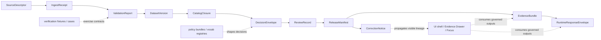

<!-- [KFM_META_BLOCK_V2]
doc_id: kfm://doc/<NEEDS_VERIFICATION_UUID>
title: Contracts
type: standard
version: v1
status: draft
owners: @bartytime4life
created: <NEEDS_VERIFICATION_YYYY-MM-DD>
updated: <NEEDS_VERIFICATION_YYYY-MM-DD>
policy_label: <NEEDS_VERIFICATION_POLICY_LABEL>
related: [../README.md, ../schemas/README.md, ../schemas/contracts/README.md, ../schemas/contracts/v1/README.md, ../schemas/contracts/vocab/README.md, ../schemas/tests/README.md, ../tests/README.md, ../tests/contracts/README.md, ../policy/README.md, ../docs/standards/README.md, ../.github/workflows/README.md, ../.github/CODEOWNERS, ../.github/PULL_REQUEST_TEMPLATE.md]
tags: [kfm, contracts, trust-objects, json-schema, validation]
notes: [Current public main confirms `contracts/` is still README-only while `schemas/contracts/` now exposes `v1/` and `vocab/` scaffold files; canonical schema-home authority remains unresolved; `doc_id`, `created`, `updated`, and `policy_label` need commit-time verification.]
[/KFM_META_BLOCK_V2] -->

# Contracts

Human-readable contract law and authority-facing guidance for KFM trust objects, while current public machine-file scaffolds remain visibly split across adjacent lanes.

> [!IMPORTANT]
> **Status:** `experimental` *(current public-main surface status; verify against the checked-out branch before commit)*  
> **Doc status:** `draft`  
> **Owners:** `@bartytime4life`  
> **Path:** `contracts/README.md`  
>         
> **Quick jumps:** [Scope](#scope) · [Repo fit](#repo-fit) · [Accepted inputs](#accepted-inputs) · [Exclusions](#exclusions) · [Directory tree](#directory-tree) · [Quickstart](#quickstart) · [Usage](#usage) · [Diagram](#diagram) · [Tables](#tables) · [Task list](#task-list--definition-of-done) · [FAQ](#faq) · [Appendix](#appendix)  
> **Repo fit:** path `contracts/README.md` · upstream [`../README.md`](../README.md), [`../schemas/README.md`](../schemas/README.md), [`../schemas/contracts/README.md`](../schemas/contracts/README.md), [`../schemas/tests/README.md`](../schemas/tests/README.md), [`../policy/README.md`](../policy/README.md), [`../tests/README.md`](../tests/README.md), [`../tests/contracts/README.md`](../tests/contracts/README.md), [`../docs/standards/README.md`](../docs/standards/README.md), [`../.github/workflows/README.md`](../.github/workflows/README.md) · control surfaces [`../.github/CODEOWNERS`](../.github/CODEOWNERS), [`../.github/PULL_REQUEST_TEMPLATE.md`](../.github/PULL_REQUEST_TEMPLATE.md) · downstream governed APIs, release assembly, `EvidenceBundle` resolution, `RuntimeResponseEnvelope` emitters, correction lineage, and the hydrology-first thin slice

> [!NOTE]
> Current public `main` now shows a **split but asymmetric contract surface**:
>
> - `contracts/` remains a real root boundary with `README.md` only.
> - `schemas/contracts/` now exposes `v1/` and `vocab/` plus branch-visible `*.schema.json` and JSON registry files.
>
> Treat that as **current public tree reality**, not as proof that canonical schema-home authority has already moved.

> [!WARNING]
> The older “`schemas/` is README-only” story is now wrong on current public `main`.
>
> The real risk is harder: a human-readable contract story still points strongly to `contracts/`, while branch-visible machine-file scaffolds now live under `schemas/contracts/`. If those surfaces drift independently, KFM can end up validating one contract universe while docs, review logic, and runtime assumptions quietly point to another.

## Scope

`contracts/` is no longer the only place the repo speaks about machine contracts.

On current public `main`, this directory functions as KFM’s **root contract guide**: the human-readable lane that explains what trust-bearing objects are for, how they relate to policy and verification, and how contributors should reason about authority while the repo’s machine-file placement remains unresolved.

That is a different role from the one this file could safely describe when `schemas/` still looked flat. Today, `contracts/README.md` needs to do four jobs well:

1. keep KFM’s contract doctrine stable and readable,
2. acknowledge the live `schemas/contracts/` scaffold honestly,
3. prevent silent duplication between `contracts/` and `schemas/contracts/`, and
4. keep policy, tests, workflows, and release proof in their own governed lanes.

### Truth posture used in this README

| Label | Meaning here |
|---|---|
| **CONFIRMED** | Directly supported by current public repo evidence or by the attached KFM doctrinal corpus used for this revision |
| **INFERRED** | Conservative completion drawn from adjacent repo surfaces or repeated KFM doctrine, but not directly proven as mounted implementation |
| **PROPOSED** | Repo-native guidance that fits the visible tree and current KFM doctrine, but is not asserted as settled checked-in behavior |
| **UNKNOWN / NEEDS VERIFICATION** | Branch-specific details, canonical schema-home ADR, real validator entrypoints, workflow YAML, platform settings, and mounted runtime emitters not yet re-verified on the working branch |

### What this directory is for

`contracts/` should answer questions like these:

- What object must exist before a source is admitted?
- What fields make a policy decision reconstructable?
- What release object proves publication readiness?
- What runtime envelope makes an answer accountable?
- What correction object prevents silent overwrite?
- Which lane currently owns machine files, and which lane currently owns the human-readable authority story?

### Why this matters in KFM

KFM doctrine is explicit that trust changes state through governed transitions, not through casual file movement, UI smoothness, or implied enforcement. That means named, typed, diffable, machine-validatable objects are part of the operating system of trust.

The current repo tension does not weaken that rule. It raises the cost of getting it wrong.

Without a singular contract story, KFM can stay architecturally strong while becoming operationally ambiguous: docs can say one thing, machine files can say another, tests can point at a third path, and workflows can silently target whichever surface happened to be easiest.

[Back to top](#contracts)

## Repo fit

| Item | Value |
|---|---|
| **Path** | `contracts/README.md` |
| **Directory role** | Root contract guide and human-readable authority-facing contract surface |
| **Adjacent machine-file lane** | [`../schemas/contracts/README.md`](../schemas/contracts/README.md) |
| **Upstream constraints** | [`../README.md`](../README.md) · [`../schemas/README.md`](../schemas/README.md) · [`../policy/README.md`](../policy/README.md) · [`../tests/README.md`](../tests/README.md) · [`../tests/contracts/README.md`](../tests/contracts/README.md) · [`../docs/standards/README.md`](../docs/standards/README.md) · [`../.github/workflows/README.md`](../.github/workflows/README.md) |
| **Downstream consumers** | Governed APIs, release assembly, policy mediation, `EvidenceBundle` resolution, `RuntimeResponseEnvelope` emitters, correction lineage, and the hydrology-first thin slice |
| **Current repo signal** | `contracts/` remains README-only on current public `main`; `schemas/contracts/` now carries branch-visible first-wave schema scaffolds and starter vocab registries; `schemas/tests/` exposes nested fixture scaffolds; `tests/contracts/` remains a sibling verification lane; `.github/workflows/` remains README-only on public `main` |
| **Working rule** | Do not let `contracts/` prose and `schemas/contracts/` machine files diverge silently. Resolve authority explicitly, then keep every adjacent lane synchronized. |

### Current public split-state

| Surface | Current public reading | Consequence for this README |
|---|---|---|
| `contracts/` | `README.md` only | Keep this file doctrinal and boundary-aware; do not invent a root machine-file inventory |
| `schemas/` | No longer README-only; nested child lanes are visible | Stop describing the whole `schemas/` tree as a flat documentation surface |
| `schemas/contracts/` | `README.md`, `v1/`, and `vocab/` are present | Acknowledge real machine-file placement without silently treating it as settled authority |
| `schemas/contracts/v1/*/*.schema.json` | Present under first-wave family directories | File presence is real; enforcement maturity still needs verification |
| `schemas/contracts/vocab/*.json` | Present as starter registries | Registry placement is real; semantic fill still needs verification |
| `schemas/tests/fixtures/contracts/v1/{valid,invalid}` | Visible nested scaffold | Fixture intent is branch-visible, but authoritative fixture-home law is still unresolved |
| `tests/contracts/` | Real sibling verification family, still README-only on public `main` | Verification family exists; executable harnesses must still be proven, not assumed |
| `docs/standards/README.md` | Still routes machine contracts toward `../contracts/` and the eventual authoritative schema home | Adjacent documentary routing and visible machine-file placement are currently out of sync |
| `.github/workflows/` | README-only on public `main` | Public-tree evidence still does not prove active merge-blocking validator YAML |

### Current verified snapshot

| Area | Status | What that means here |
|---|---|---|
| `contracts/README.md` as a repo documentation surface | **CONFIRMED** | The root contract lane exists as a real directory README |
| Current visible `contracts/` inventory | **CONFIRMED** | Current public `main` shows `README.md` only inside `contracts/` |
| `schemas/README.md` as a parent boundary index | **CONFIRMED** | The parent schema lane now indexes a live nested subtree instead of a flat README-only surface |
| Current visible `schemas/` inventory | **CONFIRMED** | Current public `main` shows `contracts/`, `schemas/`, `standards/`, `tests/`, `workflows`, and `README.md` under `schemas/` |
| `schemas/contracts/README.md` as a live child-lane guide | **CONFIRMED** | The nested contract scaffold has its own substantive boundary doc |
| `schemas/contracts/v1/` family directories | **CONFIRMED** | First-wave family lanes are visible under `common/`, `correction/`, `data/`, `evidence/`, `policy/`, `release/`, `runtime/`, and `source/` |
| Representative opened schema file | **CONFIRMED** | `schemas/contracts/v1/runtime/runtime_response_envelope.schema.json` currently contains scaffold-state `{}` |
| `schemas/contracts/vocab/` registry lane | **CONFIRMED** | `README.md`, `reason_codes.json`, `obligation_codes.json`, and `reviewer_roles.json` are visible |
| Representative opened vocab file | **CONFIRMED** | `schemas/contracts/vocab/reason_codes.json` currently contains scaffold-state `{}` |
| `schemas/tests/README.md` as nested fixture-boundary doc | **CONFIRMED** | The repo now documents a schema-adjacent fixture lane separately from repo-wide `tests/` |
| `schemas/tests/fixtures/contracts/v1/{valid,invalid}` | **CONFIRMED** | A nested valid/invalid scaffold is visible on current public `main` |
| `tests/contracts/README.md` as sibling verification surface | **CONFIRMED** | Contract verification now has an explicit repo-wide sibling home under `tests/contracts/` |
| Current visible `tests/contracts/` inventory | **CONFIRMED** | Current public `main` still shows `README.md` only inside `tests/contracts/` |
| Broader `tests/` family presence | **CONFIRMED** | Current public `main` exposes `accessibility`, `contracts`, `e2e`, `integration`, `policy`, `reproducibility`, and `unit` under `tests/` |
| Current visible `policy/` family presence | **CONFIRMED** | Current public `main` exposes `bundles`, `fixtures`, `policy-runtime`, `tests`, and `README.md` under `policy/` |
| Current visible `.github/workflows/` inventory | **CONFIRMED** | Current public `main` still shows `README.md` only inside `.github/workflows/` |
| `/contracts/` ownership in `CODEOWNERS` | **CONFIRMED** | Current public `CODEOWNERS` routes `/contracts/` explicitly to `@bartytime4life` |
| `/schemas/` ownership signal | **CONFIRMED** | No narrower `/schemas/` rule is visible on current public `main`; ownership falls back to the public global owner signal |
| PR truth/evidence checklist | **CONFIRMED** | The repo PR template requires explicit truth labels plus linked evidence, proof material, or working-branch delta notes |
| Standards routing toward `contracts/` | **CONFIRMED** | `docs/standards/README.md` still treats `contracts/README.md` as the current machine-contract reference surface and routes API endpoint schemas and machine contracts toward `../../contracts/` and the eventual authoritative schema home |
| Authoritative schema home | **UNKNOWN / NEEDS VERIFICATION** | Current public machine-file placement and current doctrinal routing still point to different homes |
| Real validator command and merge-blocking workflow YAML | **UNKNOWN / NEEDS VERIFICATION** | Current public tree does not expose active workflow YAML under `.github/workflows/` |
| Enforcement-grade schema semantics | **UNKNOWN / NEEDS VERIFICATION** | Public branch-visible schema and vocab files exist, but representative opened files are still placeholder bodies |

> [!TIP]
> The safe current reading is neither “canonical here” nor “empty here.”
>
> It is: **root contract law remains human-readable here; machine-file scaffolds are visible next door; canonical authority is still unresolved.**

[Back to top](#contracts)

## Accepted inputs

The following belong in `contracts/` **right now**:

| Belongs here now | Why it belongs here |
|---|---|
| Root-level contract doctrine and contract-family framing | This directory is still the strongest public human-readable contract narrative surface |
| Authority-resolution notes and ADR links | The repo’s most dangerous current contract problem is split authority, not missing prose |
| Cross-links that keep `contracts/`, `schemas/contracts/`, `policy/`, `tests/`, and workflow docs synchronized | Contributors need one place to understand the boundary between law, file placement, policy, proof, and automation |
| Migration notes explaining how visible machine files relate to root contract guidance | Current public placement and current documentary routing are not yet aligned |
| Human-readable summaries of first-wave contract families | Useful when they clarify semantics without becoming a second live machine-file registry |
| Contract-local review guidance about negative outcomes, correction lineage, and release proof | These are core KFM trust seams and belong in the root contract guide even while file placement is unsettled |

### Minimum bar for anything added here

- It clarifies contract law, boundary ownership, or authority reconciliation.
- It does **not** create a second live copy of a machine-file family already visible under `../schemas/contracts/`.
- It names the stronger adjacent lanes for policy, verification, and workflow enforcement.
- It keeps the public tree description more accurate than before.
- It makes current uncertainty explicit instead of smoothing it away.
- It preserves finite runtime outcomes, cite-or-abstain posture, and visible correction lineage where relevant.

[Back to top](#contracts)

## Exclusions

The following do **not** belong in `contracts/` as source-of-truth assets on current public `main`:

| Does **not** belong here | Goes instead | Why |
|---|---|---|
| A second copy of first-wave `*.schema.json` files already visible under `schemas/contracts/v1/**` | One authority-declared machine-file home only | Duplicate machine-file families create validator, review, and runtime drift |
| A second copy of starter vocab registries already visible under `schemas/contracts/vocab/**` | One authority-declared registry home only | Reason, obligation, and reviewer-role codes should not fork silently |
| Executable policy bundles and Rego logic | [`../policy/`](../policy/) | Policy should stay executable and separately reviewable |
| Validator harnesses, case runners, and contract-specific test orchestration | [`../tests/contracts/`](../tests/contracts/) and the stronger repo-wide `tests/` surface | Verification should consume canonical contracts, not redefine them |
| Workflow YAML and merge-gate wiring | [`../.github/workflows/`](../.github/workflows/) | CI wiring enforces contracts but is not itself the contract layer |
| Runtime or service implementation code | service / app / package surfaces | Emitters, resolvers, and handlers should consume contracts, not live inside them |
| Canonical or derived data artifacts | `../data/` or equivalent lifecycle zones | Contracts describe objects; they are not the objects themselves |
| Release proof artifacts themselves | release / proof or published stores | `ReleaseManifest` schema belongs in the machine-file lane; emitted release evidence does not belong in this root guide |
| UI payload renderers and shell state logic | app / shell packages | The contract surface should stay transport- and renderer-independent |
| Exploratory notes that bypass current boundary docs | research / idea / planning surfaces | Trust-bearing law should not be hidden in ephemeral work areas |

### Highest-risk failure modes

**1. Parallel schema law**

If `contracts/` and `schemas/contracts/` both evolve as authoritative homes, CI can validate one tree while code, docs, review logic, and runtime expectations quietly drift against the other.

**2. Parallel test authority**

If `schemas/tests/fixtures/**` and repo-wide `tests/contracts/**` both grow without an explicit authority rule, contributors can end up proving different things with different fixture packs.

**3. Silent placeholder inflation**

A visible `*.schema.json` file or JSON registry with body `{}` is still meaningful repo evidence, but it is not the same thing as an enforcement-grade contract. This README should keep that difference explicit.

[Back to top](#contracts)

## Directory tree

### Current confirmed public-main snapshot

```text
repo-root/
├─ contracts/
│  └─ README.md
├─ schemas/
│  ├─ README.md
│  ├─ contracts/
│  │  ├─ README.md
│  │  ├─ v1/
│  │  │  ├─ README.md
│  │  │  ├─ common/
│  │  │  ├─ correction/
│  │  │  ├─ data/
│  │  │  ├─ evidence/
│  │  │  ├─ policy/
│  │  │  ├─ release/
│  │  │  ├─ runtime/
│  │  │  └─ source/
│  │  └─ vocab/
│  │     ├─ README.md
│  │     ├─ obligation_codes.json
│  │     ├─ reason_codes.json
│  │     └─ reviewer_roles.json
│  ├─ schemas/
│  │  └─ README.md
│  ├─ standards/
│  │  └─ README.md
│  ├─ tests/
│  │  ├─ README.md
│  │  └─ fixtures/
│  │     └─ contracts/
│  │        └─ v1/
│  │           ├─ README.md
│  │           ├─ invalid/
│  │           │  └─ README.md
│  │           └─ valid/
│  │              └─ README.md
│  └─ workflows/
│     └─ README.md
├─ policy/
│  ├─ bundles/
│  ├─ fixtures/
│  ├─ policy-runtime/
│  ├─ tests/
│  └─ README.md
├─ tests/
│  ├─ accessibility/
│  ├─ contracts/
│  │  └─ README.md
│  ├─ e2e/
│  ├─ integration/
│  ├─ policy/
│  ├─ reproducibility/
│  ├─ unit/
│  └─ README.md
└─ .github/
   ├─ ISSUE_TEMPLATE/
   ├─ actions/
   ├─ watchers/
   ├─ workflows/
   │  └─ README.md
   ├─ CODEOWNERS
   ├─ PULL_REQUEST_TEMPLATE.md
   ├─ README.md
   ├─ SECURITY.md
   └─ dependabot.yml
```

### Safe end state A — `contracts/` becomes the canonical machine-contract home (**PROPOSED**)

```text
contracts/
├─ README.md
├─ v1/
│  ├─ common/
│  ├─ correction/
│  ├─ data/
│  ├─ evidence/
│  ├─ policy/
│  ├─ release/
│  ├─ runtime/
│  └─ source/
└─ vocab/
   ├─ obligation_codes.json
   ├─ reason_codes.json
   └─ reviewer_roles.json

schemas/
├─ README.md
├─ contracts/
│  └─ README.md   # redirect / boundary only
└─ ...
```

### Safe end state B — `schemas/contracts/` becomes the canonical machine-contract home (**PROPOSED**)

```text
contracts/
└─ README.md       # root guide / authority explanation / routing only

schemas/
├─ README.md
├─ contracts/
│  ├─ README.md
│  ├─ v1/
│  │  ├─ common/
│  │  ├─ correction/
│  │  ├─ data/
│  │  ├─ evidence/
│  │  ├─ policy/
│  │  ├─ release/
│  │  ├─ runtime/
│  │  └─ source/
│  └─ vocab/
│     ├─ obligation_codes.json
│     ├─ reason_codes.json
│     └─ reviewer_roles.json
└─ ...
```

> [!TIP]
> Either end state can be governed.
>
> The unsafe state is the invisible hybrid: root docs implying one home, machine files growing in another, and tests/workflows quietly targeting whichever one happened to be easiest.

[Back to top](#contracts)

## Quickstart

The safest path here is **inspection first**, not assumption first.

### 1) Inspect the visible contract, schema, policy, workflow, and verification lanes together

```bash
# root contract guide
find contracts -maxdepth 3 -type f 2>/dev/null | sort

# nested schema scaffold
find schemas -maxdepth 4 -type f 2>/dev/null | sort

# currently visible contract-family machine files
find schemas/contracts/v1 -name '*.schema.json' -type f 2>/dev/null | sort
find schemas/contracts/vocab -maxdepth 1 -name '*.json' -type f 2>/dev/null | sort

# nested fixture scaffold and repo-wide contract verification lane
find schemas/tests -maxdepth 6 -type f 2>/dev/null | sort
find tests/contracts -maxdepth 4 -type f 2>/dev/null | sort

# workflow and control surfaces
find .github/workflows -maxdepth 3 -type f 2>/dev/null | sort
sed -n '1,220p' .github/CODEOWNERS 2>/dev/null || true
sed -n '1,260p' .github/PULL_REQUEST_TEMPLATE.md 2>/dev/null || true
```

### 2) Read the boundary docs as a set, not one file at a time

```bash
sed -n '1,260p' contracts/README.md 2>/dev/null || true
sed -n '1,260p' schemas/README.md 2>/dev/null || true
sed -n '1,260p' schemas/contracts/README.md 2>/dev/null || true
sed -n '1,260p' schemas/contracts/v1/README.md 2>/dev/null || true
sed -n '1,260p' schemas/tests/README.md 2>/dev/null || true
sed -n '1,260p' tests/README.md 2>/dev/null || true
sed -n '1,260p' tests/contracts/README.md 2>/dev/null || true
sed -n '1,260p' policy/README.md 2>/dev/null || true
sed -n '1,260p' docs/standards/README.md 2>/dev/null || true
sed -n '1,260p' .github/workflows/README.md 2>/dev/null || true
```

### 3) Resolve schema-home authority before adding parallel files

Before adding a merge-blocking validator or a second copy of any contract family, declare **one** authoritative machine-file home.

That decision should do three things:

1. name the canonical publication path,
2. mark the non-authoritative sibling surface clearly, and
3. update this README, sibling docs, and validator references together.

### 4) Make the smallest next change in the authority-approved lane

Safe next steps are small and explicit:

- reconcile root and nested README language,
- choose the canonical machine-file home,
- fill or deliberately keep placeholder `{}` files with status language that matches reality,
- add fixtures where the authority rule says they live, and
- wire validation against **one** path only.

### 5) Treat negative outcomes as first-class

For KFM, these are not embarrassing edge cases:

- `ABSTAIN`
- `DENY`
- `ERROR`
- `STALE-VISIBLE`
- `GENERALIZED`
- `SUPERSEDED`
- `WITHDRAWN`
- `CORRECTION-PENDING`

If a contract wave cannot express and test those states where relevant, it is incomplete.

[Back to top](#contracts)

## Usage

### Update this root guide safely

1. Keep public-tree facts current.
2. Name adjacent machine-file and fixture lanes explicitly.
3. Keep authority uncertainty visible until the ADR exists.
4. Update sibling docs in the same review set when this file changes meaningfully.
5. Do not let the root guide imply a machine-file inventory it does not actually contain.

### Update machine-file contract scaffolds safely

1. If a family already exists under `schemas/contracts/v1/`, change that family there instead of creating a duplicate under `contracts/`.
2. If a shared registry already exists under `schemas/contracts/vocab/`, update it there or move it only as part of an explicit authority decision.
3. If a new family is needed beyond the current first wave, pair it with an authority note or ADR reference.
4. Keep `contracts/README.md`, `schemas/README.md`, `schemas/contracts/README.md`, and the relevant verification docs synchronized in the same change set.
5. Do not confuse placeholder file presence with finished contract semantics.

### Keep transport and execution separate from contract law

A route may change. A service may move. A framework may be replaced. A workflow YAML may stay private or unmounted on public `main`.

The trust-bearing object role should survive those changes. That is why KFM repeatedly treats filenames, DTOs, and route names as less important than stable object semantics, explicit policy results, visible correction lineage, and inspectable evidence.

[Back to top](#contracts)

## Diagram

### Current public split-state

```mermaid
flowchart LR
    A[contracts/README.md<br/>root contract guide] -.human-readable law / routing.-> B[schemas/contracts/README.md<br/>live machine-file scaffold lane]
    B --> C[schemas/contracts/v1/*.schema.json<br/>family scaffold files]
    B --> D[schemas/contracts/vocab/*.json<br/>starter registries]
    E[schemas/tests/fixtures/contracts/v1/{valid,invalid}<br/>nested fixture scaffold] -.schema-adjacent examples.-> C
    F[tests/contracts/README.md<br/>repo-wide contract verification family] -.verification choreography.-> C
    G[policy/README.md<br/>executable policy lane] -.reasons / obligations / deny-by-default.-> D
    H[.github/workflows/README.md<br/>workflow docs only on public main] -.future merge / validation gates.-> F
    I[docs/standards/README.md<br/>cross-cutting standards routing] -.still points more strongly toward root contracts.-> A
```

### Target doctrinal contract chain


```mermaid
flowchart LR
    SD[SourceDescriptor] --> IR[IngestReceipt]
    IR --> VR[ValidationReport]
    VR --> DV[DatasetVersion]
    DV --> CC[CatalogClosure]
    CC --> DE[DecisionEnvelope]
    DE --> RR[ReviewRecord]
    RR --> RM[ReleaseManifest]
    RM --> EB[EvidenceBundle]
    EB --> RRE[RuntimeResponseEnvelope]
    RM --> CN[CorrectionNotice]

    P[policy bundles / vocab registries] -. shapes decisions .-> DE
    T[verification fixtures / cases] -. exercise contracts .-> VR
    UI[UI shell / Evidence Drawer / Focus] -. consumes governed outputs .-> EB
    UI -. consumes governed outputs .-> RRE
    CN -. propagates visible lineage .-> UI
```

[Back to top](#contracts)

## Tables

### Contract family registry

| Contract family | Minimum purpose | Fail-closed consequence | Current public machine-file signal |
|---|---|---|---|
| `SourceDescriptor` | Declare the governed intake contract for a source family, endpoint, archive, or acquisition pattern | No governed admission; reject, hold, or quarantine | `schemas/contracts/v1/source/` visible |
| `IngestReceipt` | Prove what was fetched, when, from where, and with what integrity result | Hold or quarantine; replay cannot be trusted | Not yet visibly materialized as a confirmed file family on public `main` |
| `ValidationReport` | Record structural, spatial, temporal, unit, and policy-adjacent checks | Return to quarantine or block canonical write | Not yet visibly materialized as a confirmed file family on public `main` |
| `DatasetVersion` | Carry an authoritative candidate or promoted subject set | No authoritative write; remain in governed processing | `schemas/contracts/v1/data/` visible |
| `CatalogClosure` | Publish outward discoverability, lineage, and rights/review closure | No releasable scope | Not yet visibly materialized as a confirmed file family on public `main` |
| `DecisionEnvelope` | Express a machine-readable policy result | Deny, hold, generalize, or require review instead of publishing by convenience | `schemas/contracts/v1/policy/` visible |
| `ReviewRecord` | Capture human approval, denial, escalation, or note | Require second review or no publication | Not yet visibly materialized as a confirmed file family on public `main` |
| `ReleaseManifest` | Assemble the public-safe release inventory and promotion metadata | Deployment cannot stand in for release | `schemas/contracts/v1/release/` visible |
| `EvidenceBundle` | Package inspectable support for a claim, feature, story node, export preview, or answer | `ABSTAIN`, `DENY`, or `ERROR` rather than bluffing | `schemas/contracts/v1/evidence/` visible |
| `RuntimeResponseEnvelope` | Make runtime outcomes accountable and finite | No uncited answer; no silent fifth outcome | `schemas/contracts/v1/runtime/` visible |
| `CorrectionNotice` | Preserve visible lineage under rollback, supersession, withdrawal, narrowing, or corrected republication | No silent overwrite or invisible narrowing | `schemas/contracts/v1/correction/` visible |

### Authority-resolution matrix

| End-state option | What must happen | What must not remain |
|---|---|---|
| `contracts/` becomes canonical | Move or repoint machine files, align standards/tests/workflows, and demote `schemas/contracts/` to boundary or redirect status | A second live machine-file family under `schemas/contracts/` |
| `schemas/contracts/` becomes canonical | Update `contracts/README.md` into a pure root guide, align standards routing, and make validators target `schemas/contracts/` explicitly | Root docs continuing to imply that `contracts/` is the active machine-file home |
| Either option | Keep policy in `policy/`, verification in `tests/`, and workflows in `.github/workflows/` | Mixed silent authority across docs, machine files, fixtures, and CI |

### First enforceable slice

| Slice | Why it matters now | Current public constraint |
|---|---|---|
| Authority ADR | It is the only durable fix for the current split | Not visible on public `main` |
| One canonical validator path | Prevents CI and reviewers from drifting across roots | Public `.github/workflows/` still shows README-only |
| First-wave family semantics | The visible family scaffold already exists and needs meaning, not more directories | Representative opened schema files are still `{}` |
| Valid / invalid fixture packs | Fail-closed behavior needs intentional examples | Nested fixture scaffold is visible, but authoritative fixture-home law is unresolved |
| Runtime + correction contracts | Public trust seams are the fastest place for ambiguity to leak | Current public tree does not prove merge-gated enforcement yet |

[Back to top](#contracts)

## Task list & definition of done

### First enforceable slice

- [ ] One ADR declares the single authoritative machine-file home for trust-bearing contract families.
- [ ] `contracts/README.md`, `schemas/README.md`, `schemas/contracts/README.md`, `schemas/tests/README.md`, `tests/contracts/README.md`, and `docs/standards/README.md` tell the same placement story.
- [ ] The non-canonical sibling lane is explicitly demoted, redirected, or clearly marked boundary-only.
- [ ] Visible placeholder `*.schema.json` and JSON registry files are either filled intentionally or kept scaffold-state with matching docs and tests.
- [ ] One deterministic validator path exists and targets the authority-declared home only.
- [ ] Fixtures exist in the authority-approved fixture lane and do not silently fork across roots.
- [ ] One merge-blocking workflow gate exists and is documented without ambiguity.
- [ ] Runtime contracts prove finite outcomes and citation requirements.
- [ ] Correction contracts prove visible lineage under supersession, withdrawal, narrowing, or rollback.
- [ ] Docs, fixtures, validator output, and policy vocab stay in sync.

### Review gates

- [ ] No new contract silently broadens public-safe scope.
- [ ] No field appears in runtime or review payloads without contract coverage.
- [ ] No free-text-only decision logic is introduced where shared registries are required.
- [ ] No second live copy of a schema family or registry is introduced across `contracts/` and `schemas/contracts/`.
- [ ] No invalid fixture unexpectedly passes.
- [ ] No valid fixture unexpectedly fails.
- [ ] No change weakens release linkage, correction lineage, or audit reconstruction.
- [ ] No `UNKNOWN` is silently promoted to implementation fact.
- [ ] No README keeps stale tree language once adjacent public-main evidence changed.

[Back to top](#contracts)

## FAQ

### Why does this README still exist if machine files are now visible under `schemas/contracts/`?

Because current public repo evidence still gives `contracts/README.md` the strongest root-level human-readable contract narrative, while machine-file placement and canonical authority remain unresolved. Contributors still need one place that explains the split rather than hiding it.

### Why does this README now talk about `schemas/contracts/` so much?

Because current public `main` now exposes a real machine-file scaffold there. Ignoring it would be less faithful to the actual repo than the older README-only story.

### Why mention placeholder `{}` files explicitly?

Because file presence and semantic maturity are not the same thing. A visible schema or registry file matters for tree truth, but a `{}` body is still scaffold-state, not proof of enforcement-grade semantics.

### Why are `schemas/tests/fixtures/**` and `tests/contracts/**` both mentioned?

Because both are now part of the visible public surface. The nested fixture scaffold is real, and the repo-wide contract verification family is real. The unresolved question is which lane becomes authoritative for actual fixture and validation ownership.

### Why start with `RuntimeResponseEnvelope` and `CorrectionNotice`?

Because they touch the public trust seam fastest: outward answers must be finite, cited, and accountable, and published meaning must change visibly rather than by silent overwrite.

### Why is hydrology mentioned in a contracts README?

Because the doctrinal corpus repeatedly treats hydrology as the strongest first governed thin slice, and that slice exercises the exact contract chain this directory is supposed to explain.

[Back to top](#contracts)

## Appendix

<details>
<summary><strong>Evidence basis, verification backlog, and merge-time fill items</strong></summary>

### Evidence basis used for this README

This README is grounded in four layers that should be read together:

1. **Current public repo evidence** describing what public `main` exposes around `contracts/`, `schemas/`, `schemas/contracts/`, `schemas/tests/`, `tests/contracts/`, `policy/`, `.github/workflows/`, ownership, and PR review discipline.
2. **The uploaded draft for this file**, which already carried a strong root-contract structure and KFM-native terminology.
3. **The current repo-native documentation pattern** already present in adjacent README surfaces, especially the schema, policy, tests, standards, and `.github` lanes.
4. **The attached KFM doctrinal corpus**, which defines the contract families, fail-closed semantics, route families, proof objects, hydrology-first sequencing, and correction burden.

Where those layers differ, this README follows the stronger truth path:

- current public repo evidence determines what can be stated as visible now,
- the uploaded draft preserves the strongest existing document structure,
- adjacent repo docs determine local terminology and boundary shape,
- attached doctrine determines what KFM still needs even when the current tree is thinner than the doctrine.

### Pre-merge verification backlog

Before committing this README as authoritative repo documentation, verify at least:

1. the actual `contracts/` tree in the checked-out branch,
2. whether `contracts/` or `schemas/contracts/` is being retained as the canonical machine-file home,
3. whether the visible `schemas/contracts/v1/*/*.schema.json` files are still placeholder-state on the working branch,
4. whether the visible `schemas/contracts/vocab/*.json` files are still placeholder-state on the working branch,
5. whether `schemas/tests/fixtures/contracts/v1/{valid,invalid}` remains the chosen fixture lane or is being superseded by repo-wide `tests/`,
6. whether `tests/contracts/` has grown beyond README-only on the working branch,
7. where the real validator entrypoint lives,
8. whether `.github/workflows/` now contains real merge-blocking validator YAML,
9. whether `docs/standards/README.md` has been reconciled to the live nested `schemas/` subtree,
10. commit-time values for `doc_id`, `created`, `updated`, and `policy_label`.

### Why this file still prefers a small first wave

The corpus consistently prefers a small, enforceable artifact wave over a broad but weakly tested schema universe. That is why this README still recommends:

- a single authoritative machine-file home,
- a small first wave,
- valid and invalid fixtures,
- an explicit verification path,
- a deterministic validator command,
- one merge-blocking workflow,
- and one correction drill.

That sequence makes the trust doctrine executable without pretending the whole platform is already mounted.

</details>

[Back to top](#contracts)
