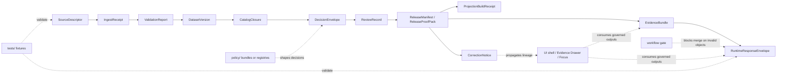

<!-- [KFM_META_BLOCK_V2]
doc_id: kfm://doc/<TODO-UUID>
title: Contracts
type: standard
version: v1
status: draft
owners: <TODO: verify owners / CODEOWNERS>
created: <TODO: YYYY-MM-DD>
updated: <TODO: YYYY-MM-DD>
policy_label: <TODO: verify public|restricted|internal|...>
related: [../schemas/README.md, ../policy/README.md, ../tests/README.md, ../.github/workflows/README.md]
tags: [kfm, contracts, schemas, verification]
notes: [Grounded in March 2026 KFM doctrine plus repo-grounded March 2026 audit documents; current live schema inventory, fixture inventory, workflow YAML, owners, and authoritative schema-home ADR remain unverified before commit.]
[/KFM_META_BLOCK_V2] -->

# Contracts

Machine-readable contract backbone for KFM source admission, policy mediation, release proof, runtime trust, and correction lineage.

> [!IMPORTANT]
> **Status:** `<TODO: verify experimental|active|stable|deprecated>` · **Doc status:** `draft`  
> **Owners:** `<TODO: verify owners / CODEOWNERS>`  
> **Path:** `contracts/README.md`  
>      
> **Quick jumps:** [Scope](#scope) · [Repo fit](#repo-fit) · [Accepted inputs](#accepted-inputs) · [Exclusions](#exclusions) · [Directory tree](#directory-tree) · [Quickstart](#quickstart) · [Usage](#usage) · [Diagram](#diagram) · [Tables](#tables) · [Task list](#task-list) · [FAQ](#faq) · [Appendix](#appendix)

> [!WARNING]
> Current March 2026 evidence is strong on doctrine and stronger than usual on repo-grounded gap analysis, but it still does **not** prove a mounted live schema inventory, fixture inventory, or merge-blocking workflow YAML in this session. This README therefore distinguishes **CONFIRMED doctrine** from **PROPOSED starter structure** and keeps schema-home authority explicitly **UNKNOWN / NEEDS VERIFICATION** until the repo retires that ambiguity.

## Scope

`contracts/` is where KFM stops speaking only in doctrine and starts publishing typed trust objects.

In KFM, contracts are not ornamental API notes. They are the machine-readable edge of the governed truth path: the object shapes that make source admission, validation, policy decisions, release readiness, runtime evidence, and correction lineage testable instead of merely persuasive.

### Truth posture used in this README

| Label | Meaning here |
| --- | --- |
| **CONFIRMED** | Directly supported by the March 2026 KFM corpus or by repo-grounded audit material available in this session |
| **PROPOSED** | Doctrine-consistent starter layout, schema path, fixture layout, validator pattern, or route-family shape not yet proven as mounted implementation |
| **UNKNOWN / NEEDS VERIFICATION** | Live repo tree details, authoritative schema-home ADR, real `.schema.json` inventory, fixture inventory, workflow YAML, mounted policy bundles, and exact runtime emitters |

### What this directory is for

`contracts/` should answer questions like these:

- What object must exist before a source is admitted?
- What fields make a policy decision reconstructable?
- What release object proves publication readiness?
- What runtime envelope makes an answer accountable?
- What correction object prevents silent overwrite?

### Why this matters in KFM

KFM’s doctrine is unusually explicit that trust changes state through governed transitions, not through casual file movement or smooth UI presentation. That means named, typed, diffable, testable objects are part of the operating system of trust.

Without machine-checkable contracts, KFM stays architecturally strong but operationally under-enforced.

[Back to top](#contracts)

## Repo fit

| Item | Value |
| --- | --- |
| Path | `contracts/README.md` |
| Directory role | Contract publication and machine-readable trust-object reference surface |
| Upstream constraints | [`../schemas/README.md`](../schemas/README.md) · [`../policy/README.md`](../policy/README.md) · [`../tests/README.md`](../tests/README.md) · [`../.github/workflows/README.md`](../.github/workflows/README.md) |
| Downstream consumers | Governed APIs, release assembly, policy mediation, EvidenceBundle resolution, RuntimeResponseEnvelope emitters, correction lineage, hydrology-first thin slice |
| Current repo signal | `contracts/` and `schemas/` are both described as schema/contract documentation surfaces; one authoritative schema home still needs explicit resolution |
| Trust rule | Contracts define shapes and minimum semantics; contracts alone do **not** grant publication, approval, or runtime permission |

### Current status snapshot

| Area | Status | What that means here |
| --- | --- | --- |
| `contracts/README.md` as a repo documentation surface | **CONFIRMED** | The contracts lane exists as a documentation surface |
| `schemas/README.md` as a parallel documentation surface | **CONFIRMED** | Authority is currently ambiguous across two top-level surfaces |
| Authoritative schema home | **UNKNOWN / NEEDS VERIFICATION** | An ADR or equivalent decision should make one home canonical before CI gates depend on it |
| Real `.schema.json` inventory | **UNKNOWN / NEEDS VERIFICATION** | Current evidence does not prove a mounted schema registry in this session |
| Valid / invalid contract fixtures | **PROPOSED** | Doctrine and repo-grounded analysis call for them, but they are not yet evidenced as live artifacts here |
| Merge-blocking validator workflow | **PROPOSED** | The repo-grounded audit treats this as the next highest-value enforcement slice |

> [!NOTE]
> The March 2026 corpus converges strongly on **which** contract families KFM needs. It does **not** yet prove one settled mounted folder convention. This README uses a versioned `contracts/v1/` publication shape as the default starter pattern because it is the clearest repo-grounded next step, but that pathing remains **PROPOSED** until the repo’s authoritative-home ADR lands.

## Accepted inputs

The following belong in `contracts/`:

| Belongs here | Why it belongs here |
| --- | --- |
| Versioned JSON Schema files for trust-bearing objects | They make KFM object families explicit enough to validate, diff, gate, and evolve |
| Shared header/profile schema(s) | They stabilize common fields, version grammar, and minimum contract identity |
| Contract-local migration notes | They keep additive evolution and breaking-change handling explicit |
| Vocabulary registries for reasons / obligations / reviewer roles | Only if the repo’s authoritative-home decision assigns shared vocab ownership here |
| Companion examples or excerpts tied to schema publication | Useful when they clarify semantics without replacing test fixtures as the authoritative validation surface |
| OpenAPI starter fragments for governed route families | Only when this directory is the agreed publication home for boundary contracts, not merely narrative route notes |

### Minimum bar for anything added here

- It has a clear lifecycle seam.
- It is versioned.
- It is machine-validatable.
- It has at least one valid example.
- It has at least one invalid example.
- Required fields are explicit.
- Time basis is explicit.
- Rights or sensitivity posture is explicit where relevant.
- Correction or supersession behavior is explicit where relevant.
- At least one named gate, test, or drill is intended to exercise it.

## Exclusions

The following do **not** belong in `contracts/` as source-of-truth assets:

| Does **not** belong here | Goes instead | Why |
| --- | --- | --- |
| Executable policy bundles and Rego logic | `../policy/` | Policy should stay executable and separately reviewable |
| Workflow YAML and merge-gate wiring | `../.github/workflows/` | CI wiring enforces contracts but is not itself the contract layer |
| Runtime/service implementation code | service or app packages | Emitters, resolvers, and handlers should consume contracts, not live inside them |
| Canonical or derived data artifacts | `../data/` or equivalent lifecycle zones | Contracts describe objects; they are not the objects themselves |
| Release proof artifacts themselves | release/proof or published stores | `ReleaseManifest` schema belongs here; emitted release evidence does not |
| UI payload renderers and shell state logic | app / shell packages | The contract surface should stay transport- and renderer-independent |
| Exploratory notebooks and ad hoc test scraps | notebooks / scratch / examples | Trust-bearing law should not be hidden in ephemeral work areas |

### Contract / schema authority hazard

A strong exclusion rule for this README is **parallel schema law**.

If `contracts/` and `schemas/` both evolve as authoritative homes, CI can validate one tree while code, docs, or review logic silently drift against the other. Until the repo resolves that split, any new contract work should be accompanied by an explicit authority note and a migration plan.

## Directory tree

### Current evidence snapshot (partial)

```text
repo-root/
├─ contracts/
│  └─ README.md
├─ schemas/
│  └─ README.md
├─ policy/
│  └─ README.md
├─ tests/
│  └─ README.md
└─ .github/
   └─ workflows/
      └─ README.md
```

### Starter target shape after the authoritative-home ADR (**PROPOSED**)

```text
contracts/
├─ README.md
├─ v1/
│  ├─ common/
│  │  └─ header_profile.schema.json
│  ├─ policy/
│  │  └─ decision_envelope.schema.json
│  ├─ evidence/
│  │  └─ evidence_bundle.schema.json
│  ├─ runtime/
│  │  └─ runtime_response_envelope.schema.json
│  ├─ correction/
│  │  └─ correction_notice.schema.json
│  ├─ release/
│  │  └─ release_manifest.schema.json
│  ├─ source/
│  │  └─ source_descriptor.schema.json
│  └─ data/
│     └─ dataset_version.schema.json
└─ vocab/
   ├─ reason_codes.json
   ├─ obligation_codes.json
   └─ reviewer_roles.json
```

### Companion fixture location recommended by the current evidence (**PROPOSED**)

```text
tests/
└─ fixtures/
   └─ contracts/
      └─ v1/
         ├─ valid/
         └─ invalid/
```

## Quickstart

### 1) Resolve schema-home authority first

Before adding a merge-blocking validator, declare **one** authoritative schema home.

That decision should do three things:

1. name the canonical publication path,
2. mark the non-authoritative sibling surface clearly, and
3. update this README, sibling docs, and CI references together.

### 2) Add the smallest first contract wave

Recommended first wave:

- `DecisionEnvelope`
- `EvidenceBundle`
- `RuntimeResponseEnvelope`
- `CorrectionNotice`
- `ReleaseManifest`

Recommended follow-on wave:

- `SourceDescriptor`
- `DatasetVersion`

### 3) Add valid and invalid fixtures immediately

```bash
# Illustrative only — verify the repo's real validator entrypoint before commit.
python -m jsonschema \
  -i tests/fixtures/contracts/v1/valid/runtime_response_envelope.min.json \
  contracts/v1/runtime/runtime_response_envelope.schema.json
```

```bash
# Illustrative only — invalid fixtures should fail the build on purpose.
python -m jsonschema \
  -i tests/fixtures/contracts/v1/invalid/runtime_response_envelope.missing_citations.json \
  contracts/v1/runtime/runtime_response_envelope.schema.json
```

### 4) Wire one deterministic merge gate

```bash
# Pseudocode — replace with the repo's real validator command.
<contracts-validator-command>
```

### 5) Keep negative outcomes first-class

For KFM, the following are not embarrassing edge cases:

- `ABSTAIN`
- `DENY`
- `ERROR`
- `STALE-VISIBLE`
- `GENERALIZED`
- `SUPERSEDED`
- `WITHDRAWN`
- `CORRECTION-PENDING`

If a contract wave cannot express and test those states where relevant, it is incomplete.

[Back to top](#contracts)

## Usage

### Add a new contract family safely

1. Add it only if it governs a real lifecycle step, trust seam, or visible state.
2. Place it in the most specific contract family path available.
3. Define minimum identifiers, timestamps, rights/sensitivity fields, and review/policy linkage where relevant.
4. Add one valid and one invalid fixture.
5. Add or update the corresponding registry values if the object depends on reason/obligation/role vocab.
6. Update adjacent docs and route-family notes if boundary behavior changes.
7. Add or extend a gate, drill, or test that proves the object matters operationally.

### Change an existing contract safely

Prefer additive evolution by default.

- Add fields before renaming them.
- Version meaning changes explicitly.
- Keep old fixtures interpretable long enough to preserve audit history.
- Do not let runtime code depend on undocumented fields.
- Do not let a convenience DTO quietly replace the public contract.

### Keep transport separate from contract law

A route may change.
A service may move.
A framework may be replaced.

The trust-bearing object role should survive those changes.

That is why KFM repeatedly treats filenames and route names as less important than stable object semantics.

## Diagram


```mermaid
flowchart LR
    A[SourceDescriptor] --> B[IngestReceipt]
    B --> C[ValidationReport]
    C --> D[DatasetVersion]
    D --> E[CatalogClosure]
    E --> F[DecisionEnvelope]
    F --> G[ReviewRecord]
    G --> H[ReleaseManifest / ReleaseProofPack]
    H --> I[ProjectionBuildReceipt]
    H --> J[EvidenceBundle]
    J --> K[RuntimeResponseEnvelope]
    H --> L[CorrectionNotice]

    M[policy/ bundles or registries] -. shapes decisions .-> F
    N[tests/ fixtures] -. validate .-> A
    N -. validate .-> K
    O[workflow gate] -. blocks merge on invalid objects .-> K
    P[UI shell / Evidence Drawer / Focus] -. consumes governed outputs .-> J
    P -. consumes governed outputs .-> K
    L -. propagates lineage .-> P
```

## Tables

### Contract family registry

| Contract family | Minimum purpose | Fail-closed consequence | First-wave priority |
| --- | --- | --- | --- |
| `SourceDescriptor` | Declare the governed intake contract for a source family, endpoint, archive, or acquisition pattern | No governed admission; reject, hold, or quarantine | Wave 01.5 |
| `IngestReceipt` | Prove what was fetched, when, from where, and with what integrity result | Hold or quarantine; replay cannot be trusted | Later / adjacent |
| `ValidationReport` | Record structural, spatial, temporal, unit, and policy-adjacent checks | Return to quarantine or block canonical write | Later / adjacent |
| `DatasetVersion` | Carry an authoritative candidate or promoted subject set | No authoritative write; remain in governed processing | Wave 01.5 |
| `CatalogClosure` | Publish outward discoverability, lineage, and rights/review closure | No releasable scope | Later / adjacent |
| `DecisionEnvelope` | Express a machine-readable policy result | Deny, hold, generalize, or require review instead of publishing by convenience | Wave 01 |
| `ReviewRecord` | Capture human approval, denial, escalation, or note | Require second review or no publication | Later / adjacent |
| `ReleaseManifest` | Assemble the public-safe release inventory and promotion metadata | Deployment cannot stand in for release | Wave 01 |
| `ReleaseProofPack` | Bundle proof that a release is publishable | Release remains candidate or blocked | Later / adjacent |
| `ProjectionBuildReceipt` | Prove a derived tile, export, search, graph, or scene artifact came from a known release | Block, rebuild, mark stale-visible, or withdraw output | Later / adjacent |
| `EvidenceBundle` | Package inspectable support for a claim, feature, story node, export preview, or answer | `ABSTAIN`, `DENY`, or `ERROR` rather than bluffing | Wave 01 |
| `RuntimeResponseEnvelope` | Make runtime outcomes accountable and finite | No uncited answer; no silent fifth outcome | Wave 01 |
| `CorrectionNotice` | Preserve visible lineage under rollback, supersession, withdrawal, narrowing, or corrected republication | No silent overwrite or invisible narrowing | Wave 01 |

### First schema wave and fixture plan

| Wave | Proposed path | Why it lands early |
| --- | --- | --- |
| Wave 01 | `contracts/v1/common/header_profile.schema.json` | Shared minimum grammar makes later families more coherent |
| Wave 01 | `contracts/v1/policy/decision_envelope.schema.json` | Turns deny-by-default policy into machine-readable structure |
| Wave 01 | `contracts/v1/evidence/evidence_bundle.schema.json` | Makes evidence drill-through explicit and reusable |
| Wave 01 | `contracts/v1/runtime/runtime_response_envelope.schema.json` | Enforces finite runtime outcomes and cite-or-abstain |
| Wave 01 | `contracts/v1/correction/correction_notice.schema.json` | Prevents silent overwrite and anchors correction lineage |
| Wave 01 | `contracts/v1/release/release_manifest.schema.json` | Keeps publication as a governed state transition |
| Wave 01.5 | `contracts/v1/source/source_descriptor.schema.json` | Starts making source admission contract-governed |
| Wave 01.5 | `contracts/v1/data/dataset_version.schema.json` | Begins anchoring canonical truth and stable version identity |
| Companion | `tests/fixtures/contracts/v1/valid/*` | Proves happy-path structure intentionally |
| Companion | `tests/fixtures/contracts/v1/invalid/*` | Proves fail-closed rejection intentionally |
| Companion | `contracts/vocab/reason_codes.json` | Stabilizes decision grammar |
| Companion | `contracts/vocab/obligation_codes.json` | Stabilizes obligations without free-text drift |
| Companion | `contracts/vocab/reviewer_roles.json` | Stabilizes review vocabulary and separation-of-duty semantics |

### Route-family touchpoints that contracts must support

| Route family | Primary objects | Visible fail-closed behavior |
| --- | --- | --- |
| Catalog / discovery | `CatalogClosure`, `ReleaseManifest` | restricted preview, empty result with reason, or `ERROR`; never leak unpublished scope |
| Map / tile / vector delivery | `ReleaseManifest`, `ProjectionBuildReceipt` | `404/410`, stale-visible state, or `ERROR`; never synthesize truth from cache alone |
| Dossier / story / Focus read surfaces | `EvidenceBundle`, `RuntimeResponseEnvelope`, `ReleaseManifest` | `ABSTAIN`, `DENY`, or `ERROR` with visible reason blocks; no detached chat fallback |
| EvidenceBundle resolution | `EvidenceBundle`, `DecisionEnvelope`, `ReviewRecord` | deny, generalize, or error rather than leak hidden items or unfiltered citations |
| Correction lineage lookup | `CorrectionNotice`, `ReleaseManifest`, `ProjectionBuildReceipt`, `RuntimeResponseEnvelope` | superseded / withdrawn / correction-pending state; never silently replace history |
| Release / proof inspection | `ReleaseManifest`, `ReleaseProofPack`, `ProjectionBuildReceipt` | no publication or restricted proof summary when release is absent, candidate-only, or withdrawn |
| Review / steward workflows | `ReviewRecord`, `DecisionEnvelope`, `CatalogClosure`, `ReleaseManifest` | hold or require second review; no silent administrative bypass |

[Back to top](#contracts)

## Task list

### Definition of done for this directory’s first enforceable slice

- [ ] One ADR declares the single authoritative schema home.
- [ ] Wave 01 contract files exist as real machine-readable artifacts.
- [ ] `reason_codes.json`, `obligation_codes.json`, and `reviewer_roles.json` exist if this directory owns shared vocab.
- [ ] Each Wave 01 contract has at least one valid and one invalid fixture.
- [ ] A deterministic validator command exists and is documented.
- [ ] One merge-blocking workflow gate runs that validator without skip-risk.
- [ ] `contracts/README.md` and `schemas/README.md` no longer imply competing authority.
- [ ] Runtime contracts prove finite outcomes and citation requirements.
- [ ] Correction contracts prove visible lineage under supersession or withdrawal.
- [ ] Docs, fixtures, and validator output stay in sync.

### Review gates

- [ ] No new contract silently broadens public-safe scope.
- [ ] No field appears in runtime or review payloads without contract coverage.
- [ ] No free-text-only decision logic is introduced where registries are required.
- [ ] No invalid fixture unexpectedly passes.
- [ ] No valid fixture unexpectedly fails.
- [ ] No change weakens release linkage, correction lineage, or audit reconstruction.
- [ ] No **UNKNOWN** is silently promoted to implementation fact.

## FAQ

### Why does this README talk about both `contracts/` and `schemas/`?

Because current repo-grounded evidence points to both as documentation surfaces. That is useful as a warning signal and dangerous as long-term authority practice. This README keeps the conflict visible instead of pretending it is already resolved.

### Why start with `RuntimeResponseEnvelope` and `CorrectionNotice`?

Because they touch the public trust seam fastest: outward answers must be finite, cited, and accountable, and published meaning must change visibly rather than by silent overwrite.

### Why are invalid fixtures mandatory?

Because KFM is fail-closed by design. A valid fixture proves the happy path; an invalid fixture proves the system rejects bad structure on purpose.

### Why is hydrology mentioned in a contracts README?

Because the corpus repeatedly treats hydrology as the strongest first governed thin slice, and that slice exercises the exact contract chain this directory is supposed to define.

## Appendix

<details>
<summary><strong>Evidence basis used for this README</strong></summary>

This README is grounded in two layers that should be read together:

1. **Fresh repo-grounded March 2026 audit evidence** that describes what the repo currently exposes or fails to expose around `contracts/`, `schemas/`, fixtures, and workflow gates.
2. **March 2026 doctrinal KFM manuals** that define the contract families, fail-closed semantics, route families, proof objects, hydrology-first sequencing, and correction/rollback burden.

Where those layers differ, this README prefers the stronger truth posture:
- doctrine may define what KFM needs,
- repo-grounded evidence limits what can be claimed as implemented now.

</details>

<details>
<summary><strong>Pre-merge verification backlog</strong></summary>

Before committing this README as authoritative repo documentation, verify at least:

1. The actual `contracts/` tree in the mounted repo.
2. Whether `schemas/` is being retained, demoted, or removed.
3. Whether any real `.schema.json` files already exist under a different path.
4. Where fixtures actually live.
5. Whether policy registries already exist, and under what names.
6. Whether `.github/workflows/` now contains a real merge-blocking contracts gate.
7. Whether `contracts/v1/` or `contracts/jsonschema/` is the repo’s preferred publication layout.
8. CODEOWNERS-derived owners, created date, updated date, and policy label for the meta block.

</details>

<details>
<summary><strong>Why this file prefers a small first wave</strong></summary>

The corpus consistently prefers a small, enforceable artifact wave over a large but weakly tested schema universe.

That is why this README recommends:
- a single authoritative schema home,
- a minimal Wave 01,
- valid and invalid fixtures,
- a deterministic validator command,
- one merge-blocking workflow,
- and one correction drill.

That sequence makes the trust doctrine executable without pretending the whole platform is already mounted.

</details>

[Back to top](#contracts)
