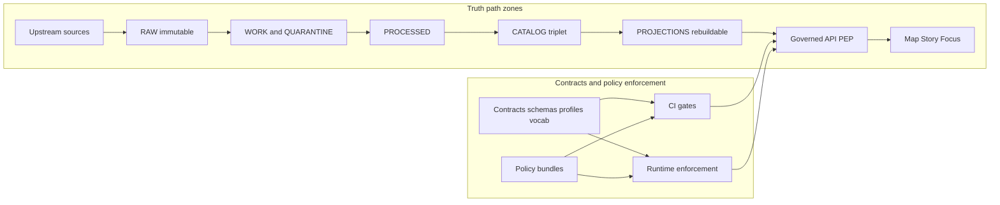
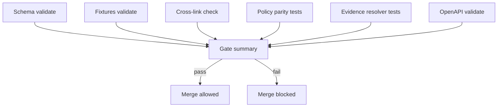

<!-- [KFM_META_BLOCK_V2]
doc_id: kfm://doc/b5e9f8c2-1e25-4f09-8a55-9201a05f9b2d
title: contracts/ — KFM contract surfaces (schemas, APIs, profiles, gates)
type: standard
version: v5
status: draft
owners: TBD (set via CODEOWNERS)
created: 2026-02-22
updated: 2026-03-02
policy_label: public
related:
  - ../README.md
  - ../.github/README.md
  - ../configs/README.md
  - ../docs/
  - ../policy/
tags: [kfm, contracts, governance, schema, api, evidence, promotion-contract]
notes:
  - Upgraded to align with KFM vNext: truth-path zones + Promotion Contract gates A–G + triplet cross-link requirements + evidence resolver and governed API posture.
  - Explicitly models PROJECTIONS as rebuildable outputs between canonical catalogs and governed runtime.
  - Fail-closed: repo-specific wiring (exact filenames, generators, emitted CI check names) remains UNKNOWN until verified in-repo.
  - Prefer versioned artifacts + fixtures + CI validation over tribal knowledge.
[/KFM_META_BLOCK_V2] -->

<a id="top"></a>

# `contracts/` — KFM contract surfaces
**Contract-first • fail-closed • governed-by-default • evidence-first • time-aware**

**Status:** draft • **Owners:** TBD via `CODEOWNERS` • **Policy label:** public  
**Purpose:** Make KFM interfaces **explicit, versioned, and machine-validated** so promotion and runtime behavior can’t drift.


-informational)

-critical)
<!-- TODO: replace placeholders with real workflow/status badges once repo workflows exist -->
<!-- e.g., https://img.shields.io/github/actions/workflow/status/<org>/<repo>/contracts-gate-summary.yml?branch=main -->

> [!IMPORTANT]
> **A contract is not documentation.**
> A contract is a **machine-validated interface** (schema/spec/profile) plus fixtures and tests.
> If a required contract is missing, invalid, or ambiguous, KFM must **block promotion** and/or **refuse to serve** affected data (policy-safe).

---

## Quickstart

If you only do three things:

1) **Start here:** `contracts/registry/` (what contracts exist) and `contracts/openapi/` (what clients can call).  
2) **Validate locally (PROPOSED command names):**
```bash
# (repo-specific tooling UNKNOWN)
make contracts-validate
# or
python -m tools.contracts.validate --fail-closed
```
3) **Never merge a contract change without fixtures** (known-good + known-bad).

---

## Navigation

- [Truth status legend](#truth-status-legend)
- [Normative keywords](#normative-keywords)
- [Directory contract](#directory-contract)
- [Contracts in the truth path](#contracts-in-the-truth-path)
- [Contract surfaces](#contract-surfaces)
- [Non-negotiable invariants](#non-negotiable-invariants)
- [Promotion Contract gates A–G](#promotion-contract-gates-a-g)
- [Catalog triplet and EvidenceRef](#catalog-triplet-and-evidenceref)
- [Evidence bundle contract](#evidence-bundle-contract)
- [Governed API contract](#governed-api-contract)
- [Policy contract parity](#policy-contract-parity)
- [Registry and lock files](#registry-and-lock-files)
- [Directory layout](#directory-layout)
- [How to add or change a contract](#how-to-add-or-change-a-contract)
- [Validation and CI gates](#validation-and-ci-gates)
- [Governance and safety](#governance-and-safety)
- [Glossary](#glossary)
- [Appendix](#appendix)

---

## Truth status legend

This README uses explicit labels so we don’t “invent repo state”:

- **CONFIRMED design:** required KFM posture (must hold regardless of stack)
- **PROPOSED:** recommended template/pattern (adopt after verification)
- **UNKNOWN repo:** not verified in this repository yet (treat as TODO; fail-closed)
- **CONFIRMED repo:** verified here (link exact path + snippet + CI check name)

> [!NOTE]
> Repo facts graduate from **UNKNOWN → CONFIRMED repo** only by attaching paths/snippets in PRs.

---

## Normative keywords

This document uses these keywords intentionally:

- **MUST / MUST NOT:** merge-blocking requirements
- **SHOULD / SHOULD NOT:** strong defaults; exceptions require explicit justification
- **MAY:** optional; do not rely on it for safety

> [!TIP]
> When you add a new MUST, add the **test** in the same PR.

<p align="right"><a href="#top">Back to top ↑</a></p>

---

## Directory contract

This section satisfies the **Directory Documentation Standard**.

### Where this fits in the repo

`contracts/` is the system’s **trust membrane in file form**:

- CI uses `contracts/` to decide what’s promotable.
- Runtime services use `contracts/` to decide what’s servable.
- UIs and tools treat contracts as **authoritative interface definitions**, not suggestions.

Dependency direction (ideal):

- **Upstream inputs:** governance standards in `docs/` and policy posture in `policy/`
- **Downstream consumers:** pipelines, validators, catalog builders, governed API + evidence resolver, Focus Mode, UI SDKs

### Acceptable inputs

| Category | Examples | Why it belongs here |
|---|---|---|
| Interface schemas/specs | JSON Schema, OpenAPI, GraphQL SDL, protobuf | Defines externally visible shapes |
| Profiles + constraints | DCAT/STAC/PROV profiles; cross-link rules | Makes catalogs enforceable |
| Promotion contracts | promotion manifest schema; gate vocab; release record schema | Blocks unsafe promotion/serving |
| Evidence contracts | EvidenceRef grammar; EvidenceBundle schema | Enables cite-or-abstain guarantees |
| Policy decision envelopes | allow/deny; obligations; reason codes | Enables CI/runtime parity + audit |
| Fixtures | known-good / known-bad examples | Prevent “it validates but breaks” |
| Contract tests | schema validation; linkcheck; parity tests | Turns intent into enforcement |
| Controlled vocab | policy labels; artifact zones; reason codes | Prevent taxonomy drift |
| Version metadata | registries/locks/changelogs | Prevent drift + enable rollback |

### Exclusions

| Excluded | Put it elsewhere | Reason |
|---|---|---|
| Runtime code / business logic | `apps/`, `packages/`, `infra/` | Contracts define interfaces, not implementations |
| Secrets / tokens / credentials | secret manager / CI secrets | Contracts are reviewable and often public-ish |
| Large datasets or derived data | `data/` truth-path zones | Keep contracts diff-friendly and small |
| Binary artifacts | release/build outputs | Contracts MUST be text + reviewable |
| “Docs only” explanations | `docs/` | If it can’t be tested/validated, it isn’t a contract |

<p align="right"><a href="#top">Back to top ↑</a></p>

---

## Contracts in the truth path

KFM’s lifecycle is not a metaphor; it is a set of zones + gates that create an auditable truth path.


```mermaid
flowchart LR
  subgraph Z["Truth path zones"]
    U[Upstream sources] --> R[RAW immutable]
    R --> W[WORK and QUARANTINE]
    W --> P[PROCESSED]
    P --> C[CATALOG triplet]
    C --> X[PROJECTIONS rebuildable]
    X --> G[Governed API PEP]
    G --> UI[Map Story Focus]
  end

  subgraph K["Contracts and policy enforcement"]
    CON[Contracts schemas profiles vocab] --> CI[CI gates]
    CON --> RT[Runtime enforcement]
    POL[Policy bundles] --> CI
    POL --> RT
    CI --> G
    RT --> G
  end
```

> [!NOTE]
> **PROJECTIONS are rebuildable.** Canonical truth is immutable artifacts + catalogs + provenance + receipts.
> Projections include tiles, DB/search indexes, and graphs.

<p align="right"><a href="#top">Back to top ↑</a></p>

---

## Contract surfaces

This matrix is **design-level**. Exact filenames and CI job names are **UNKNOWN repo** until verified.

| Surface | What it defines | Primary consumers | Minimum enforcement |
|---|---|---|---|
| Promotion Contract | What qualifies for promotion and serving | CI, stewards, runtime | schema + fixtures + anti-skip summary |
| Catalog triplet | Canonical metadata, assets, lineage | CI, API, UI, Focus | profiles + cross-link linkcheck |
| Evidence resolution | EvidenceRef grammar + EvidenceBundle shape | evidence resolver, UI, Focus | parse + policy checks + fixtures |
| Governed API | Client-callable endpoints and error behavior | UI, external clients, Focus | OpenAPI validation + error invariants |
| Policy decisions | allow/deny, obligations, reason codes | CI and runtime PEP/PDP | parity fixtures CI == runtime |
| Diff reports | What changed between versions | stewards, UI | schema + golden fixtures |
| Focus eval harness | cite-or-abstain regression suite | CI, Focus | fixtures + deterministic checks |

<p align="right"><a href="#top">Back to top ↑</a></p>

---

## Non-negotiable invariants

These are **CONFIRMED design** across all stacks.

### 1) Trust membrane

- UI/clients **MUST NOT** access databases/object storage directly.
- Backend logic **MUST NOT** bypass repository interfaces to reach storage.
- All access flows through governed APIs that apply **policy + obligations + audit** consistently.

### 2) Truth path zones are enforceable boundaries

- **RAW:** immutable, append-only acquisition + checksums.
- **WORK:** intermediate transforms + QA + candidate redactions/generalizations.
- **QUARANTINE:** failed validation, unclear licensing, sensitivity concerns; **not promotable**.
- **PROCESSED:** publishable artifacts in approved formats + checksums.
- **CATALOG triplet:** DCAT + STAC + PROV cross-linked.
- **PROJECTIONS:** rebuildable runtime indexes (tiles, DB, search, graph).
- **PUBLISHED:** governed API + UI surfaces (policy enforced).

**Invariant:** Published surfaces may only serve promoted dataset versions that have processed artifacts, validated catalogs, run receipts, and policy label assignment.

### 3) Policy semantics parity

Contracts that depend on policy (promotion, evidence, exports) **MUST** produce the same outcomes in:

- CI policy tests (merge gates)
- runtime enforcement (API + evidence resolver)
- Focus Mode citation verification

If CI and runtime disagree, CI guarantees are meaningless → **release blocker**.

### 4) Deterministic identity and hashing

Anything used in identity (`dataset_version_id`, `spec_hash`, lock digests) MUST be:

- deterministically serialized
- stable under benign ordering/whitespace differences
- regression-tested (goldens)

### 5) Evidence is a UX hard requirement

Evidence resolution MUST be usable in **≤ 2 calls** from UI interactions; otherwise provenance will not be used.

### 6) Policy-safe errors

Errors and abstentions MUST NOT leak restricted existence via different shapes, timing, or “helpful” metadata.

<p align="right"><a href="#top">Back to top ↑</a></p>

---

## Promotion Contract gates A–G

These are the minimum fail-closed gates that MUST be automatable in CI and reviewable during steward sign-off.

> [!WARNING]
> Weakening a gate is a **breaking governance change**.
> Treat as high-risk: require explicit review, migration notes, and rollback plan.

### Gate summary table

| Gate | What it protects | Contract artifacts typically involved |
|---|---|---|
| **A — Identity and versioning** | Immutable DatasetVersion identity | dataset id rules; `spec_hash` rules; promotion manifest schema |
| **B — Licensing and rights metadata** | Legal permission + obligations | license fields; rights holder + attribution requirements |
| **C — Sensitivity classification and redaction plan** | Safety + community constraints | `policy_label` vocab; obligations schema; redaction recorded in PROV |
| **D — Catalog triplet validation** | Interop + evidence surface | DCAT/STAC/PROV profiles; cross-link rules; EvidenceRef schemes |
| **E — Run receipt and checksums** | Reproducibility + supply chain | run receipt schema; artifact digests; environment capture |
| **F — Policy tests and contract tests** | CI/runtime parity + resolvability | OPA tests; evidence resolver fixtures; OpenAPI/schema validation |
| **G — Optional but recommended** | Production posture | SBOM/provenance; performance and accessibility smoke checks |

### Compatibility note

Some older gate breakdowns treat **QA thresholds** and a **release manifest** as separate gates.
KFM vNext posture is:

- QA evidence SHOULD exist and failures MUST be quarantined (often produced in WORK/PROCESSED).
- A release record MAY exist; if present, it MUST be digest-addressed and consistent with promotion artifacts.

Keep your implementation strict; keep your naming consistent.

<p align="right"><a href="#top">Back to top ↑</a></p>

---

## Catalog triplet and EvidenceRef

KFM treats catalogs not as “nice metadata,” but as the canonical interface between pipeline outputs and runtime.

### Triplet responsibilities

- **DCAT** answers: “What is this dataset? Who published it? What is the license? What are the distributions?”
- **STAC** answers: “What assets exist? What are their spatiotemporal extents? Where are the files?”
- **PROV** answers: “How were these outputs created? Which inputs/tools/parameters produced which outputs?”

### EvidenceRef schemes

Schemes are interfaces. Keep them stable and parseable:

- `dcat://...` resolves to dataset/distribution metadata
- `stac://...` resolves to collection/item/asset metadata
- `prov://...` resolves to lineage (activities/entities/agents)
- `doc://...` resolves to governed docs and story citations
- `graph://...` resolves to entity relations (if graph is enabled)

### Cross-link rules

Cross-links MUST be deterministic so EvidenceRefs resolve without guessing:

- DCAT dataset → distributions → artifact digests
- DCAT dataset → PROV bundle or activity references
- STAC collection → link to DCAT dataset
- STAC items/assets → link to digests + media types + producing run receipt
- EvidenceRef schemes resolve into these objects without heuristics

**CI MUST include link-checkers** verifying cross-links for every promoted dataset version.

### Time axes

KFM is time-aware by default:

- **Event time:** when something happened
- **Transaction time:** when KFM acquired or published the record
- **Valid time (optional):** when a statement is considered true

If time axes are present, they MUST be explicit and consistent across catalogs and query surfaces.

<p align="right"><a href="#top">Back to top ↑</a></p>

---

## Evidence bundle contract

Evidence resolution is central: the evidence resolver accepts an EvidenceRef (or structured ref),
applies policy, and returns an EvidenceBundle suitable for both humans and machines.

### EvidenceBundle shape

**PROPOSED minimal shape** (exact schema path UNKNOWN repo):

```json
{
  "bundle_id": "sha256:bundle...",
  "dataset_version_id": "YYYY-MM.abcd1234",
  "title": "Human-friendly title",
  "policy": {
    "decision": "allow",
    "policy_label": "public",
    "obligations_applied": []
  },
  "license": { "spdx": "CC-BY-4.0", "attribution": "Source org" },
  "provenance": { "run_id": "kfm://run/..." },
  "artifacts": [
    { "href": "processed/example.parquet", "digest": "sha256:...", "media_type": "application/x-parquet" }
  ],
  "checks": { "catalog_valid": true, "links_ok": true },
  "audit_ref": "kfm://audit/entry/..."
}
```

### Evidence resolver requirements

- MUST fail closed on unresolvable references.
- MUST apply policy and return allow/deny + obligations.
- MUST be usable by UI in ≤ 2 calls.
- MUST NOT leak restricted existence via error differences.

<p align="right"><a href="#top">Back to top ↑</a></p>

---

## Governed API contract

The governed API is the enforcement boundary:

- applies policy decisions + obligations
- enforces versioning + audit
- provides evidence resolution for UI and Focus Mode

### API contract requirements

- Responses SHOULD include `dataset_version_id` (when applicable) and digests (when applicable).
- Errors MUST follow a stable error model (e.g., `error_code`, policy-safe message, `audit_ref`).
- Versioning MUST freeze `/api/v1` semantics; introduce `/api/v2` only for breaking changes.

### Illustrative endpoints

Exact routes are repo-specific; these represent required capability surfaces:

- `GET /api/v1/catalog/datasets` — dataset discovery
- `GET /api/v1/datasets/{dataset_version_id}/query` — bbox/time/filters query
- `GET /api/v1/tiles/{layer_id}/{z}/{x}/{y}` — tile delivery (policy-safe)
- `POST /api/v1/evidence/resolve` — EvidenceRef → EvidenceBundle
- `GET /api/v1/lineage/{dataset_id}` — lineage graph + run receipts (policy-safe)
- `POST /api/v1/focus/ask` — Focus Mode Q&A (MUST cite or abstain)

<p align="right"><a href="#top">Back to top ↑</a></p>

---

## Policy contract parity

Policy is not “config.” It is part of the trust membrane.

### Required posture

- Default behavior MUST be deny when uncertain.
- Policy evaluation MUST return:
  - decision allow/deny
  - reason codes (normalized)
  - obligations (e.g., generalize geometry, remove fields)
- CI and runtime MUST share the same semantics and fixtures.

### Recommended contract artifacts

- `policy_labels.vN.yaml` — controlled vocabulary for policy labels
- `policy_decision.vN.schema.json` — allow/deny + obligations envelope
- parity fixtures — golden cases where CI == runtime decisions

> [!WARNING]
> Policy and provenance artifacts MUST NOT contain raw protected coordinates, secrets, or “how to locate” instructions.

<p align="right"><a href="#top">Back to top ↑</a></p>

---

## Registry and lock files

A registry/lock makes contract sets reproducible and reviewable in audits.

> [!NOTE]
> Registry/lock formats are **PROPOSED** until confirmed in this repo.

### Manifest should include

- contract identifier (stable ID)
- kind (`schema`, `profile`, `vocab`, `openapi`)
- semantic version
- canonical path
- digest (e.g., sha256)
- owners/review group
- required validators and CI checks

### Lock should include

- deterministic digests for every contract artifact
- optional bundle digest for the entire contracts set

If you adopt a lock file, you MUST define how it is updated and how drift is detected.

<p align="right"><a href="#top">Back to top ↑</a></p>

---

## Directory layout

This is a **PROPOSED** layout aligned to KFM vNext. Keep repo-specific filenames **UNKNOWN repo** until verified.

```text
contracts/                                              # Governed contract surfaces: schemas, profiles, vocabularies, and API specs that define KFM’s stable interfaces
├─ README.md                                             # Contract overview: what “contract” means, versioning rules, review gates, and how contracts map to CI + promotion
├─ CHANGELOG.md                                          # OPTIONAL: contract change history (breaking vs non-breaking), migration notes, and deprecation timelines
│
├─ registry/                                             # PROPOSED: contract index + locks for reproducible builds and validator pinning
│  ├─ contracts.manifest.v1.json                          # Manifest of contract artifacts (paths, versions, owners, schemas, compatibility class, consumers)
│  ├─ contracts.lock.v1.json                              # Lockfile pinning exact contract versions/digests used by CI and runtimes (prevents drift)
│  └─ schemas/                                            # Schemas validating the manifest/lock shapes (fail-closed)
│     ├─ kfm.contract_manifest.v1.schema.json             # Schema: validates manifest entries (IDs, paths, versions, ownership, dependencies)
│     └─ kfm.contract_lock.v1.schema.json                 # Schema: validates lock content (digests, pinned versions, integrity fields)
│
├─ openapi/                                              # Governed API contracts (versioned; changes reviewed like code; used for contract tests)
│  ├─ v1/openapi.yaml                                     # API v1: additive-compatible evolution within v1 (no breaking changes)
│  └─ v2/openapi.yaml                                     # API v2: breaking changes only (major version bump; migration required)
│
├─ schemas/                                              # JSON Schemas (or equivalents) for KFM artifacts and envelopes consumed across the repo
│  ├─ promotion/                                         # Promotion + release record contracts
│  │  ├─ promotion_manifest.v1.schema.json               # Schema: what gets promoted (inputs/outputs/digests/gate results/approvals)
│  │  └─ release_record.v1.schema.json                   # OPTIONAL: digest-addressed release record (immutable reference for published drops)
│  ├─ run/                                               # Pipeline run contracts
│  │  └─ run_receipt.v1.schema.json                      # Schema: deterministic run receipt (inputs, transforms, tools, outputs, digests, timings)
│  ├─ audit/                                             # Audit ledger contracts
│  │  └─ audit_entry.v1.schema.json                      # Schema: audit entry (event type, actor, refs, timestamps, reason codes; policy-safe fields)
│  ├─ policy/                                            # Policy decision + obligation contracts
│  │  ├─ policy_decision.v1.schema.json                  # Schema: PDP decision envelope (allow/deny + policy_label + obligations + reason codes)
│  │  └─ obligations.v1.schema.json                      # Schema: obligation objects (types + params) consumable by UI/API enforcement layers
│  ├─ evidence/                                          # Evidence primitives (cite-or-abstain enforcement depends on these shapes)
│  │  ├─ evidence_ref.v1.schema.json                     # Schema: EvidenceRef (stable pointer to a source/claim support; resolvable + hashable)
│  │  └─ evidence_bundle.v1.schema.json                  # Schema: EvidenceBundle (collection + provenance; supports auditable citation graphs)
│  ├─ catalogs/                                          # Catalog profile schemas (discovery + traceability surfaces)
│  │  ├─ dcat.profile.v1.schema.json                     # Schema: DCAT profile constraints for dataset metadata (fields, types, required links)
│  │  ├─ stac.profile.v1.schema.json                     # Schema: STAC profile constraints for geospatial assets/items/collections
│  │  └─ prov.profile.v1.schema.json                     # Schema: PROV profile constraints for lineage/provenance (agents/activities/entities)
│  └─ ui/                                                # UI-facing contracts (trust surfaces consume these shapes)
│     ├─ view_state.v1.schema.json                       # Schema: view-state serialization (bbox/time/layers/query; versioned for compatibility)
│     ├─ story_node.v3.schema.json                       # Schema: governed story node (claims, citations, layers, time anchors, policy labels)
│     └─ focus_eval.v1.schema.json                       # Schema: Focus evaluation harness (golden queries, expected citations, score thresholds)
│
├─ profiles/                                             # Profile YAMLs: “how to validate” a family of artifacts beyond bare schema
│  ├─ catalogs/                                          # Catalog validation profiles (rulesets + cross-link expectations)
│  │  ├─ dcat.profile.v1.yaml                            # Profile: DCAT required fields, controlled vocab usage, and link integrity rules
│  │  ├─ stac.profile.v1.yaml                            # Profile: STAC constraints (asset roles, spatial/temporal fields, extension requirements)
│  │  ├─ prov.profile.v1.yaml                            # Profile: PROV constraints (required relations, identifiers, audit-friendly fields)
│  │  └─ crosslinks.profile.v1.yaml                      # Profile: cross-link rules (DCAT↔STAC↔PROV↔receipts↔evidence; no dangling references)
│  ├─ promotion/                                         # Promotion eligibility rules beyond per-file schema
│  │  └─ promotion_contract.v1.yaml                      # Profile: promotion contract requirements (gate mapping, required artifacts by class/zone)
│  └─ time/                                              # Time model profiles (axes + precision + semantics)
│     └─ time_axes.profile.v1.yaml                       # Profile: time axes semantics (instant/interval, precision, uncertainty bounds, calendar rules)
│
├─ vocab/                                                # Controlled vocabularies used across contracts/policy/catalogs (versioned; machine-validated where possible)
│  ├─ policy_labels.v1.yaml                              # Allowed policy labels + meanings + ordering (shared by policy + docs + tooling)
│  ├─ artifact_zones.v1.yaml                             # Truth-path zones vocabulary (raw/work/quarantine/processed/catalog/published/audit)
│  ├─ reason_codes.v1.yaml                               # Reason code vocabulary (why allow/deny/obligation; supports UX + audit + analytics)
│  └─ themes.v1.yaml                                     # Theme vocabulary (topic tags/categories) used by catalog/story discovery and filtering
│
├─ fixtures/                                             # Contract fixtures (small, synthetic) used by tests and documentation to prove validators
│  ├─ promotion/                                         # Example manifests/records (valid/invalid) for promotion validators
│  ├─ run/                                               # Example run receipts (valid/invalid) for run receipt validators
│  ├─ evidence/                                          # Example EvidenceRef/Bundles for resolver and schema tests
│  ├─ catalogs/                                          # Example DCAT/STAC/PROV artifacts + cross-link cases
│  ├─ policy/                                            # Example decision envelopes + obligation objects + reason codes
│  └─ api/                                               # Example API requests/responses for contract tests (golden snapshots)
│
└─ tests/                                                # Contract test plans (what to validate, how to validate, and what “pass” means)
   ├─ contract_test_plan.md                              # Master plan: suites, gating level, CI jobs, and artifact/report expectations
   ├─ validate_schemas.testplan.md                       # Test plan: schema validation scope + tooling + severity rules (fail-closed defaults)
   ├─ validate_crosslinks.testplan.md                    # Test plan: cross-link integrity (no dangling refs; profile compliance)
   ├─ validate_policy_parity.testplan.md                 # Test plan: policy decision envelope compatibility with contracts + fixtures parity
   └─ validate_evidence_resolver.testplan.md             # Test plan: EvidenceRef/Bundles resolvability + hash/digest correctness + failure shaping
```

<p align="right"><a href="#top">Back to top ↑</a></p>

---

## How to add or change a contract

### Step 1 — Choose the surface

Promotion? Catalog? Evidence? API? Policy? UI state? Eval harness?

### Step 2 — Determine if breaking

- Breaking: remove/rename required fields, change gate semantics, change error behavior relied on by clients → bump major.
- Additive: new optional fields or new vocab values handled safely → no major bump.

### Step 3 — Add fixtures

Every contract change MUST include:

- at least one **known-good** example
- at least one **known-bad** example that fails for the correct reason

### Step 4 — Add tests

At minimum:

- schema validation
- cross-link validation (DCAT↔STAC↔PROV and EvidenceRef resolvability)
- policy parity fixtures (CI == runtime)
- policy-safe error invariants
- hashing determinism tests for any identity-affecting change

### Step 5 — Update registry and lock

If used:

- add/update manifest entry
- update lock digests deterministically

### Step 6 — Document compatibility

- what changed and why
- who must update (pipeline/API/UI/Focus)
- migration notes and rollback plan

<p align="right"><a href="#top">Back to top ↑</a></p>

---

## Validation and CI gates

Contracts only matter if they are enforced continuously.

### Minimum required CI posture

- validate all schemas in `contracts/schemas/**`
- validate all profiles in `contracts/profiles/**`
- validate fixtures (good passes; bad fails)
- validate cross-links (catalog triplet + EvidenceRef resolvability)
- validate evidence resolver behavior (policy-safe allow/deny)
- validate policy parity (CI == runtime semantics)
- validate API invariants (OpenAPI + envelopes + error model)
- validate deterministic hashing for identity-affecting artifacts

### Anti-skip requirement

Required gates MUST NOT be bypassable via conditional workflow logic.

Prefer one always-runs required check such as:

- `contracts / gate-summary`

This job MUST fail if any required validator did not run.


```mermaid
flowchart TD
  A[Schema validate] --> S[Gate summary]
  B[Fixtures validate] --> S
  C[Cross-link check] --> S
  D[Policy parity tests] --> S
  E[Evidence resolver tests] --> S
  F[OpenAPI validate] --> S
  S -->|pass| M[Merge allowed]
  S -->|fail| X[Merge blocked]
```

<p align="right"><a href="#top">Back to top ↑</a></p>

---

## Governance and safety

### Rights and licensing

- Promotion MUST capture license and rights holder details.
- If license is unclear, dataset stays in QUARANTINE (fail closed).
- Exports MUST be rights-aware and policy-safe by default.

### Sensitive locations and restricted data

- Default deny for sensitive-location and restricted datasets unless policy explicitly allows.
- Publish generalized public derivatives when allowed (separate dataset version).
- Never leak restricted existence via subtle error behavior.

### Audit is required and sensitive

- Governed operations MUST emit audit records capturing who/what/when/why plus inputs/outputs by digest and policy decisions.
- Audit logs require retention and access policy.

### Focus Mode depends on contracts

- EvidenceRefs MUST be resolvable without guessing.
- EvidenceBundles MUST carry policy, license, provenance, digests, and `audit_ref`.
- Focus Mode MUST cite or abstain; citation verification is a hard gate.

<p align="right"><a href="#top">Back to top ↑</a></p>

---

## Glossary

- **Contract artifact:** machine-validated interface definition with versioning + fixtures + tests.
- **Profile:** constraints that define “valid” for KFM (beyond base schemas).
- **Promotion Contract:** fail-closed gates A–G controlling what can reach runtime surfaces.
- **Triplet:** DCAT (dataset), STAC (assets), PROV (lineage).
- **EvidenceRef:** stable reference (scheme-based) resolvable to an EvidenceBundle.
- **EvidenceBundle:** resolved evidence record including policy, license, provenance, digests, and audit reference.
- **Policy decision:** allow/deny + obligations + reason codes with an audit trail.
- **Policy-safe errors:** prevent inferring restricted existence.

---

## Appendix

### Contract change checklist

- [ ] Version bumped appropriately (breaking vs additive)
- [ ] Schema/spec validates
- [ ] Fixtures updated (known-good + known-bad)
- [ ] Cross-link rules updated (DCAT↔STAC↔PROV; EvidenceRef)
- [ ] Policy parity outcomes preserved (or explicitly changed with fixtures + review)
- [ ] Error model remains policy-safe (no restricted inference)
- [ ] Deterministic hashing tests updated (if identity-affecting)
- [ ] Downstream implementations updated (pipeline/API/UI/Focus)
- [ ] Migration notes + rollback plan included

### Repo verification checklist

To graduate UNKNOWN repo → CONFIRMED repo:

- [ ] Confirm actual contract storage locations and substructure.
- [ ] List CI jobs that validate contracts and identify required status check names.
- [ ] Identify canonical policy bundle location and how CI/runtime load it.
- [ ] Identify evidence resolver interface and its contract test harness.
- [ ] Confirm which release/production posture artifacts are used in practice (Gate G).
