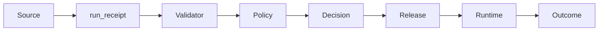

<!-- [KFM_META_BLOCK_V2]
doc_id: kfm://doc/<UUID_NEEDS_VERIFICATION>
title: Contracts
type: standard
version: v1
status: draft
owners: <OWNER_NEEDS_VERIFICATION>
created: <DATE_NEEDS_VERIFICATION>
updated: 2026-04-16
policy_label: <POLICY_LABEL_NEEDS_VERIFICATION>
related: [
  ../README.md,
  ../CONTRIBUTING.md,
  ../schemas/README.md,
  ../policy/README.md,
  ../tools/validators/README.md,
  ../tools/probes/README.md,
  ../tests/README.md,
  ../tests/contracts/README.md,
  ../data/receipts/README.md
]
tags: [kfm, contracts, schemas, proof-objects, receipts, trust-objects]
notes: [
  Root contracts lane aligned to the user-requested path and doctrinal starter paths.
  Contract/policy/schema split is explicit and consistent with adjacent lane READMEs.
  `run_receipt` is surfaced as a concrete thin-slice contract under process-memory doctrine.
  Exact subtree inventory, owners, and schema placement remain branch-verification items.
]
[/KFM_META_BLOCK_V2] -->

<a id="top"></a>

# `contracts/`

Machine-checkable contract lane for KFM’s shared schemas, trust objects, proof objects, and contract-first release rules.

> [!NOTE]
> **Status:** `experimental`  
> **Doc state:** `draft`  
> **Owners:** `<OWNER_NEEDS_VERIFICATION>`  
> **Path:** `contracts/README.md`  
> **Repo fit:** root contract lane adjacent to schemas, policy, validators, tests, and receipts  
> **Quick jumps:** [Scope](#scope) · [Repo fit](#repo-fit) · [Accepted inputs](#accepted-inputs) · [Exclusions](#exclusions) · [Directory tree](#directory-tree) · [Quickstart](#quickstart) · [Usage](#usage) · [Diagram](#diagram) · [Reference tables](#reference-tables) · [Starter schema wave](#starter-schema-wave) · [Versioning rules](#versioning-rules) · [Validation and gates](#validation-and-gates) · [Task list](#task-list--definition-of-done) · [FAQ](#faq) · [Appendix](#appendix)


> [!IMPORTANT]
> This lane defines **shape**, not behavior.  
> Contracts must remain:
> - machine-checkable  
> - versionable  
> - validator-consumable  
> - policy-compatible  
>
> They must **not** become:
> - policy engines  
> - runtime logic  
> - receipt storage  
> - workflow glue  

> [!WARNING]
> Current evidence is strongest for **doctrine and routing**, not full subtree population.  
> Treat file presence and directory completeness as **NEEDS VERIFICATION** unless confirmed by the active branch.

---

## Scope

This directory converts KFM doctrine into **artifactized truth objects**.

Contracts here exist to ensure:

- doctrine does not remain prose-only  
- proof objects are testable before promotion  
- runtime surfaces receive stable payloads  
- process memory, proof, and runtime envelopes stay distinct  

### Why contracts exist

| Reason | Outcome |
|---|---|
| Prevent silent drift | Schema + fixtures fail closed |
| Enable validation | Validators consume consistent shapes |
| Preserve trust | Objects remain inspectable |
| Support runtime | APIs emit stable envelopes |
| Enable correction | Lineage remains machine-visible |

### Status vocabulary

| Label | Meaning |
|---|---|
| **CONFIRMED** | Supported by doctrine or adjacent repo docs |
| **INFERRED** | Strongly implied but not directly proven |
| **PROPOSED** | Recommended but not yet mounted |
| **UNKNOWN** | Not supported by current evidence |
| **NEEDS VERIFICATION** | Must be confirmed on active branch |

[Back to top](#top)

---

## Repo fit

| Surface | Role |
|---|---|
| `contracts/` | defines object shape and semantics |
| [`../schemas/`](../schemas/README.md) | machine validation layer |
| [`../policy/`](../policy/README.md) | decision logic |
| [`../tools/validators/`](../tools/validators/README.md) | enforcement layer |
| [`../tools/probes/`](../tools/probes/README.md) | observation + receipt emission |
| [`../tests/contracts/`](../tests/contracts/README.md) | contract verification |
| [`../data/receipts/`](../data/receipts/README.md) | process memory storage |

### Boundary rule

| Question | Correct lane |
|---|---|
| What fields exist? | `contracts/` |
| How is it validated? | `schemas/` |
| Did it pass validation? | `validators/` |
| Should it be allowed? | `policy/` |
| Where is the instance stored? | `data/receipts/` |

> [!TIP]
> If a file mixes two of these responsibilities, it is in the wrong lane.

[Back to top](#top)

---

## Accepted inputs

This lane accepts:

- JSON Schema definitions
- typed-model exports (when schema is derived)
- contract-level examples (only if used for validation)
- standards profiles (STAC / DCAT / PROV constraints)
- compatibility notes

### Thin-slice focus (current)

The strongest current pressure is:

- **`run_receipt` (process-memory contract)**

This implies support for:

- probe receipts  
- validator inputs  
- runtime trace carriers  
- release linkage inputs  

[Back to top](#top)

---

## Exclusions

Do NOT place here:

| Item | Reason |
|---|---|
| Policy rules | belong in `policy/` |
| Runtime code | belongs in `apps/`, `packages/`, `tools/` |
| Actual receipts | belong in `data/receipts/` |
| Proof packs | belong in release/proof lanes |
| Workflow YAML | belongs in `.github/workflows/` |
| Experimental notes | belongs in `docs/` |

> [!CAUTION]
> Contracts define objects.  
> They never **store events**.

[Back to top](#top)

---

## Directory tree

```text
contracts/
├── README.md
├── source/       # PROPOSED
├── core/         # PROPOSED
├── policy/       # PROPOSED
├── release/      # PROPOSED
├── runtime/      # PROPOSED
├── correction/   # PROPOSED
└── profiles/     # PROPOSED
```

### Current thin-slice signal

```text
contracts/
└── run_receipt.schema.json   # NEEDS VERIFICATION
```

[Back to top](#top)

---

## Quickstart

### Add a contract

1. Choose correct family
2. Define schema
3. Add valid + invalid fixtures
4. Declare compatibility impact
5. Wire validator + tests
6. Update docs

### Minimal example

```json
{
  "$schema": "https://json-schema.org/draft/2020-12/schema",
  "type": "object",
  "required": ["id"],
  "properties": {
    "id": { "type": "string" }
  }
}
```

### Minimal `run_receipt`

```json
{
  "source": "example",
  "fetch_ts": "2026-04-16T00:00:00Z",
  "spec_hash": "abc...",
  "changed_items": [],
  "transport_status": 200
}
```

[Back to top](#top)

---

## Usage

### Typed flow

```python
obj = Model.validate(payload)
out = transform(obj)
Model.validate(out)
```

### Contracts prove:

- shape correctness
- failure modes
- compatibility
- trust visibility

---

## Diagram


```mermaid
flowchart LR
    Source --> Receipt[run_receipt]
    Receipt --> Validator
    Validator --> Policy
    Policy --> Decision
    Decision --> Release
    Release --> Runtime
    Runtime --> Outcome
```

[Back to top](#top)

---

## Reference tables

### Contract families

| Family | Purpose |
|---|---|
| SourceDescriptor | intake definition |
| DatasetVersion | authoritative version |
| DecisionEnvelope | policy output |
| ReleaseManifest | publication |
| EvidenceBundle | support objects |
| RuntimeResponseEnvelope | runtime output |
| CorrectionNotice | lineage correction |
| run_receipt | process memory |

### Proof quartet

| Object | Role |
|---|---|
| spec_hash | identity |
| run_receipt | execution trace |
| ai_receipt | model trace |
| attestation | integrity |

[Back to top](#top)

---

## Starter schema wave

| Contract | Status |
|---|---|
| SourceDescriptor | PROPOSED |
| DatasetVersion | PROPOSED |
| DecisionEnvelope | PROPOSED |
| ReleaseManifest | PROPOSED |
| EvidenceBundle | PROPOSED |
| RuntimeResponseEnvelope | PROPOSED |
| CorrectionNotice | PROPOSED |
| run_receipt | CONFIRMED concept |
| ai_receipt | CONFIRMED concept |

[Back to top](#top)

---

## Versioning rules

| Change | Impact |
|---|---|
| Remove field | breaking |
| Add optional field | non-breaking |
| Change semantics | breaking |
| Docs only | patch |

---

## Validation and gates

| Gate | Purpose |
|---|---|
| Schema validation | enforce shape |
| Fixtures | prove fail-closed |
| Validators | enforce correctness |
| Policy | enforce rules |

---

## Task list / definition of done

- [ ] contract added
- [ ] fixtures present
- [ ] validator updated
- [ ] policy impact checked
- [ ] docs updated

---

## FAQ

### Why contracts?

To prevent drift and enforce trust.

### Are receipts stored here?

No. They live in `data/receipts/`.

### Are schemas enough?

No. Contracts define meaning.

---

## Appendix

<details>
<summary>Starter codes</summary>

| Code | Meaning |
|---|---|
| rights.unknown | unresolved rights |
| validation.failed | schema failure |
| runtime.missing | missing evidence |

</details>

[Back to top](#top)