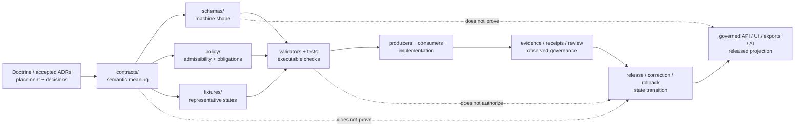

<!-- [KFM_META_BLOCK_V2]
doc_id: kfm://doc/contracts-readme
title: contracts/ — Canonical Semantic Contract Root
type: README; directory-readme; canonical-semantic-root; object-family-index
version: v0.3
status: draft; repository-grounded; canonical-semantic-root; mixed-maturity; partial-cross-root-enforcement; direct-semantic-suite-unestablished; object-family-register-empty; non-release; non-publication
owner: NEEDS VERIFICATION — CODEOWNERS routes /contracts/ to @bartytime4life; accepted contracts stewardship, required-review enforcement, and independent approval controls were not established
created: NEEDS VERIFICATION — a short root stub existed before the v0.2 expansion
updated: 2026-07-23
supersedes: v0.2 documentation at the same path; no semantic contract, schema, policy, fixture, validator, workflow, runtime, release, or publication behavior is superseded
policy_label: repository-facing; contracts; semantic-meaning; bounded-contexts; no-parallel-authority; evidence-first; release-gated; correction-aware; rollback-aware
current_path: contracts/README.md
owning_root: contracts/
responsibility: own human-readable object-family meaning, field intent, invariants, claim limits, lifecycle semantics, compatibility notes, and cross-root relationships without becoming machine shape, policy, evidence, lifecycle, release, or runtime authority
truth_posture: >
  CONFIRMED same-path target; contracts as the canonical semantic-meaning responsibility root; Directory Rules
  contract/schema/policy/test split; evidence-limited OBJECT_MAP; directly inspected source, evidence, runtime, policy,
  release, data, correction, governance, Focus Mode, UI, and domain lane READMEs; contracts/v1 compatibility guard;
  configured contracts/schema workflows; related schema-fixture tests; empty machine object-family register; and
  CODEOWNERS routing / PROPOSED root-wide authoring contract, applicability-aware readiness model, generated inventory,
  semantic test suite, compatibility convergence, and implementation sequence / CONFLICTED configured contract/schema
  split versus unaccepted ADR state, complete semantic inventory versus evidence-limited indexes, correction versus
  release placement seams, and selected alias/domain-lane paths / UNKNOWN exhaustive recursive contract inventory,
  complete contract-schema-policy-fixture-test-validator parity, direct semantic coverage, runtime consumers, branch-rule
  significance, release integration, published contract projections, and operational rollback.
evidence_snapshot:
  repository: bartytime4life/Kansas-Frontier-Matrix
  base_ref: main
  base_commit: e2466421ced8e41430737d4e7d51f19e3ab61d9f
  target_prior_blob: 6e05ba40fcc255e392210e56ef9519203aec6006
  directory_rules_blob: 2affb080e6f0043867c64c7f06c1ca52030fbd55
  object_map_blob: 002366e3aac3086287eca93e1c69057da7cecebe
  schemas_readme_blob: 15c84131862c00584664dfafa497c012ae765d33
  adr_0001_blob: 3c520ea8f2f8bcb3d478329a87d98b135ea335fd
  adr_0002_blob: 2da10fcf5836a44d46186c233b6b9664c9ccfda5
  contracts_validate_workflow_blob: 7a14c94784c596b4f74996439217d8128d641bd1
  contract_drift_workflow_blob: fc429fe6fd0991744903b0ab84eaf6cc535343a5
  tests_contracts_readme_blob: f58e0222de1c8228daff6d4dc6243ed713927607
  makefile_blob: 51537af34ee065c2de571134688415042b83b22a
  object_family_register_blob: 930a9da30d5481f8d7ed5b7789d7846a30d3f4e1
  codeowners_blob: dd2a84aa514d8ecd9208bc347f90f9a2ed37dd61
related:
  - ./OBJECT_MAP.md
  - ./domains/README.md
  - ./source/README.md
  - ./evidence/README.md
  - ./runtime/README.md
  - ./policy/README.md
  - ./release/README.md
  - ./data/README.md
  - ./correction/README.md
  - ./governance/README.md
  - ./focus_mode/README.md
  - ./ui/README.md
  - ./v1/README.md
  - ../schemas/README.md
  - ../schemas/contracts/v1/README.md
  - ../policy/README.md
  - ../fixtures/README.md
  - ../tests/contracts/README.md
  - ../tools/validators/README.md
  - ../control_plane/object_family_register.yaml
  - ../docs/doctrine/directory-rules.md
  - ../docs/adr/ADR-0001-schema-home--schemas-contracts-v1-is-canonical.md
  - ../docs/adr/ADR-0002-contracts-vs-schemas-split.md
  - ../.github/workflows/contracts-validate.yml
  - ../.github/workflows/contract-drift.yml
  - ../.github/CODEOWNERS
notes:
  - "Same-path modernization of v0.2; no contract meaning, machine shape, policy, fixture, test, validator, workflow, runtime, lifecycle, release, or publication state changes."
  - "The first twelve H2 sections follow the Directory Rules folder-README contract exactly."
  - "The repository partially exercises contract/schema checks, but a direct root-wide semantic-contract test suite is not established."
  - "Static badges summarize inspected repository state only; they are not CI, review, acceptance, release, or publication proof."
[/KFM_META_BLOCK_V2] -->

<a id="top"></a>

# contracts

> **One-line purpose.** `contracts/` is KFM's canonical responsibility root for human-readable semantic meaning: what governed object families mean, which invariants and claim limits they carry, how their fields should be interpreted, and which evidence, policy, lifecycle, review, release, correction, and rollback relationships must remain visible.

[](#status)
[](#authority-level)
[](#validation)
[](#validation)
[](../control_plane/object_family_register.yaml)
[](#authority-level)
[](#last-reviewed)

> [!IMPORTANT]
> **Safe current conclusion:** the semantic-contract root and multiple family/domain contract lanes exist; `schemas/contracts/v1/` is a configured machine-shape surface; selected schema-fixture tests and contract/schema workflows exist; and `contracts/v1/` is explicitly guarded against parallel authority. Current evidence does **not** establish a complete contract inventory, a populated machine object-family register, root-wide semantic-contract tests, complete policy/fixture/validator parity, production consumers, accepted ADR closure, release integration, or public-safe publication.

> [!CAUTION]
> A well-written contract is necessary but not sufficient. Contract prose does not make an object instance true, schema-valid, evidence-closed, policy-allowed, reviewed, released, public, or correctly implemented. `EvidenceBundle`, applicable policy, validation, review, release, correction, and rollback evidence remain separate and stronger for those questions.

> [!WARNING]
> [`OBJECT_MAP.md`](./OBJECT_MAP.md) calls itself evidence-limited rather than exhaustive, while [`control_plane/object_family_register.yaml`](../control_plane/object_family_register.yaml) currently contains `entries: []`. Do not infer a complete or synchronized object-family registry from file presence, links, badges, or Markdown tables.

**Quick navigation:** [Purpose](#purpose) · [Authority](#authority-level) · [Status](#status) · [Belongs](#what-belongs-here) · [Exclusions](#what-does-not-belong-here) · [Inputs](#inputs) · [Outputs](#outputs) · [Validation](#validation) · [Review](#review-burden) · [Related](#related-folders) · [ADRs](#adrs) · [Last reviewed](#last-reviewed) · [Topology](#contract-topology-and-current-lanes) · [Anatomy](#semantic-contract-anatomy) · [Readiness](#object-family-readiness-model) · [Compatibility](#compatibility-and-versioned-paths) · [Consumers](#consumer-public-and-ai-boundary) · [Rollback](#correction-and-rollback) · [Done](#definition-of-done) · [Open verification](#open-verification-register)

---

## Purpose

`contracts/` owns **semantic contract Markdown** for KFM's governed object families and messages.

A semantic contract answers questions such as:

- What is this object or message called inside its bounded context?
- What identity, continuity, and versioning rules distinguish it from adjacent objects?
- What do its fields mean, independent of JSON encoding?
- Which invariants, claim limits, source roles, time facets, spatial scopes, and uncertainty rules apply?
- Which evidence, policy, rights, sensitivity, review, release, correction, withdrawal, and rollback relationships are required?
- Which producers and consumers may rely on the object, and what must they refuse to infer?
- Which compatibility aliases, supersession links, and migration rules preserve meaning across change?

A contract does **not** make an external claim true. It provides a stable published language for maintainers, domain stewards, schema authors, policy authors, validators, producers, consumers, reviewers, and release tooling while keeping each authority in its own responsibility root.

**Primary audience**

- contract and object-family maintainers;
- domain, source, evidence, policy, runtime, UI, correction, and release stewards;
- schema, fixture, test, and validator authors;
- API, pipeline, package, connector, and UI implementers;
- reviewers checking bounded-context clarity, no-parallel-authority discipline, and downstream trust obligations.

[Back to top](#top)

---

<a id="authority-boundary"></a>

## Authority level

**Canonical responsibility root for human-readable semantic meaning; non-schema, non-policy, non-evidence, non-lifecycle, non-release, and non-runtime authority.**

Directory Rules place object-family meaning under `contracts/` and machine-checkable shape under `schemas/`. The repository currently implements that split as guidance and partial validation, while ADR-0001 and ADR-0002 remain proposed rather than accepted.

| Concern | Owning authority | `contracts/` role |
|---|---|---|
| Object-family meaning, field intent, invariants, claim limits | `contracts/` | Owns the semantic contract and bounded-context language. |
| Human architecture explanation | [`docs/`](../docs/) | Explains systems and rationale; may cite contracts but must not silently redefine them. |
| Machine-checkable shape | [`schemas/contracts/v1/`](../schemas/contracts/v1/) | Implements structural constraints; must link back to reviewed contract meaning where applicable. |
| Admissibility, rights, sensitivity, consent, access, obligations | [`policy/`](../policy/) plus governed review | Decides whether and how an object may be used; contracts define policy-object meaning only. |
| Representative examples | [`fixtures/`](../fixtures/) or accepted test-local fixture home | Supplies valid, invalid, edge, denied, stale, correction, and rollback cases. |
| Executable proof | [`tests/`](../tests/) | Proves selected behavior; must not redefine contract meaning. |
| Reusable validation | [`tools/validators/`](../tools/validators/) | Executes checks; must not hide semantic or policy authority in validator code. |
| Source identity and activation | governed source registries and source policy | Contracts may define `SourceDescriptor`; stored records and activation decisions remain elsewhere. |
| Evidence and provenance | evidence authorities, `data/proofs/`, `data/receipts/` | Contracts define evidence-object meaning; materialized evidence and process memory remain separate. |
| Lifecycle material | governed [`data/`](../data/) phases | Contracts may define lifecycle object semantics; they do not store or promote instances. |
| Release, correction, withdrawal, rollback | [`release/`](../release/) and reviewed decision records | Contracts define release-object meaning; they cannot approve or execute a state transition. |
| Runtime, API, UI, MapLibre, AI behavior | accepted app, package, runtime, and delivery roots | Implement reviewed semantics through governed interfaces; contracts are not a direct public data source. |

### Anti-collapse rules

`contracts/` must never collapse:

- prose into executable validation;
- schema fields into complete semantic meaning;
- object shape into source or evidence truth;
- policy-object semantics into a policy allow decision;
- a fixture into canonical meaning;
- a passing test into review, release, or publication;
- an instance into the normative definition of its object family;
- a versioned or alias path into parallel authority;
- an AI-generated explanation into evidence;
- a commit or pull request into contract acceptance.

[Back to top](#top)

---

## Status

### Repository-grounded snapshot

| Surface | Current evidence at `main@e2466421ced8…` | Safe conclusion |
|---|---|---|
| Root README | **CONFIRMED** v0.2 baseline at blob `6e05ba4…` | Same-path v0.3 modernization; no semantic behavior change. |
| Directory Rules | **CONFIRMED** `contracts/` is canonical for object meaning; §15 governs this README | Placement is clear; existence and maturity of every object family still require repository evidence. |
| [`OBJECT_MAP.md`](./OBJECT_MAP.md) | **CONFIRMED evidence-limited crosswalk** | Useful navigation, not a generated or complete inventory. |
| Directly inspected family lanes | **CONFIRMED** `source`, `evidence`, `runtime`, `policy`, `release`, `data`, `correction`, `governance`, `focus_mode`, and `ui` READMEs | Family guidance exists with mixed maturity and many open verification items. |
| Domain contracts | **CONFIRMED** [`contracts/domains/README.md`](./domains/README.md) | Active domain semantic-contract lane; complete domain inventory is not established by the README. |
| Versioned path | **CONFIRMED** [`contracts/v1/README.md`](./v1/README.md) is a compatibility guard | It must not mirror schemas or become a second semantic root without accepted governance. |
| Proposed MapLibre / 3D families | **NOT FOUND at checked `contracts/maplibre/README.md` and `contracts/3d/README.md` paths** | Directory Rules describe proposed family homes; this README does not create or claim them. |
| Schema pairing surface | **CONFIRMED configured** [`schemas/contracts/v1/`](../schemas/contracts/v1/) | Machine-shape checks exist for a bounded set; schema validity is not semantic or release proof. |
| Aggregate validator surface | **CONFIRMED six fixture-backed validators configured** | Bounded object-family shape coverage only. |
| `contracts-validate` workflow | **CONFIRMED command-bearing** | Runs `make test`; a green run means selected repository tests passed for that revision. |
| `contract-drift` workflow | **CONFIRMED command-bearing** | Runs strict pytest over `tests/schemas` and `tests/contracts`; does not prove complete semantic equivalence. |
| Direct semantic-contract tests | **NOT ESTABLISHED in bounded `tests/contracts/` inspection** | The direct lane is README-only; related schema/fixture tests exist under `tests/schemas/`. |
| Object-family machine register | **CONFIRMED file with `entries: []`** | Machine synchronization and completeness are not established. |
| ADR-0001 / ADR-0002 | **CONFIRMED present; effective decisions remain `proposed`** | Current repository configuration must not be described as reviewed ADR acceptance. |
| CODEOWNERS | **CONFIRMED `/contracts/` routes to `@bartytime4life`** | Review routing exists; stewardship and independent approval are not proved. |
| Complete recursive contract inventory | **UNKNOWN** | This update does not claim exhaustive file or object-family coverage. |
| Runtime, release, publication | **UNKNOWN / DENIED as inference** | Contract presence, validation, CI, or merge does not establish operational release or public truth. |

### Truth labels used here

| Label | Meaning |
|---|---|
| `CONFIRMED` | Verified from pinned repository bytes, workflow definitions, tests, or directly inspected child documentation. |
| `PROPOSED` | Recommended design, future state, coupling rule, migration, or test surface not established as current implementation. |
| `UNKNOWN` | Available evidence is insufficient for a stronger statement. |
| `NEEDS VERIFICATION` | A concrete check exists but has not been closed strongly enough to act as fact. |
| `CONFLICTED` | Relevant authority surfaces, names, placements, or maturity claims disagree. |

Document lifecycle (`draft`), object-family maturity (`semantic-only`, `schema-linked`, `validated`, `released`), policy/runtime outcomes, workflow results, and truth labels are separate vocabularies.

[Back to top](#top)

---

## What belongs here

Place content under `contracts/` when its primary responsibility is to define **semantic meaning** for one KFM object family, message, envelope, decision, receipt family, projection, or bounded-context concept.

| Accepted content | Examples | Required posture |
|---|---|---|
| Root and family README files | `README.md`, `source/README.md`, `domains/README.md` | State authority, exclusions, inputs, outputs, validation, review, ADR, and rollback boundaries. |
| Object semantic contracts | `evidence/evidence_bundle.md`, `runtime/decision_envelope.md` | Define identity, terms, field intent, invariants, claim limits, and cross-root relationships. |
| Domain-specific object meaning | `domains/<domain>/<object>.md` | Preserve Domain Placement Law and adjacent-domain ownership. |
| Governance and release-object meaning | `governance/`, `release/`, `correction/` Markdown | Keep decisions, execution, and stored instances in their own roots. |
| Public/runtime projection meaning | `runtime/`, `ui/`, `focus_mode/` Markdown | Preserve EvidenceBundle, policy, release, correction, accessibility, and finite-outcome obligations. |
| Compatibility pointers | alias READMEs, migration notes, backlink audits | Identify canonical target, class, consumers, sunset or retention, and rollback; never duplicate semantics. |
| Semantic indexes and crosswalks | [`OBJECT_MAP.md`](./OBJECT_MAP.md) | Navigation only; completeness and generation status must be explicit. |
| Versioning and supersession notes | compatibility maps, semantic-version notes | Preserve old meaning, migration, correction, and rollback lineage. |
| Diagrams and tables that explain meaning | state relationships, object boundaries, lifecycle semantics | Must be illustrative and subordinate to the contract text; not architecture or runtime proof. |

Contract files are normally Markdown. JSON Schema, Rego, fixture payloads, test code, validator code, lifecycle data, receipts, proofs, and release records belong in their owning roots even when they use the same object name.

[Back to top](#top)

---

## What does NOT belong here

| Do not place in `contracts/` | Correct responsibility root | Why |
|---|---|---|
| JSON Schema, JSON-LD contexts, machine validation grammars | [`schemas/`](../schemas/) | Machine shape is separate from human semantic meaning. |
| Executable policy, rights, sensitivity, consent, redaction rules | [`policy/`](../policy/) | Admissibility and obligations require executable/reviewed policy authority. |
| Valid, invalid, golden, denied, stale, or rollback payloads | [`fixtures/`](../fixtures/) or accepted test-local fixtures | Examples support proof; they are not normative definitions. |
| Test modules and reusable validators | [`tests/`](../tests/), [`tools/validators/`](../tools/validators/) | Enforceability and reusable checks remain separately inspectable. |
| SourceDescriptor instances or activation records | governed source registry / `data/registry/sources/` | Stored source authority records are not contract prose. |
| RAW, WORK, QUARANTINE, PROCESSED, CATALOG, TRIPLET, or PUBLISHED records | governed [`data/`](../data/) phases | Lifecycle state must remain visible and auditable. |
| Materialized EvidenceBundles, proof packs, receipts, or attestations | `data/proofs/`, `data/receipts/`, accepted signing/attestation roots | Process and proof artifacts must not become normative definitions. |
| ReleaseManifest, PromotionDecision, CorrectionNotice, or RollbackCard instances | [`release/`](../release/) | Release decisions and records are not semantic contract files. |
| API routes, clients, packages, pipeline logic, connector code, UI components | accepted implementation roots | Executable behavior must not hide inside Markdown authority. |
| Public tiles, layers, exports, reports, dashboards, or AI answers | released artifact and governed delivery roots | Downstream carriers do not define their own truth. |
| Secrets, credentials, source tokens, private records, restricted geometry | approved secret, source, or restricted lifecycle systems | Contract prose is not an operational secret or protected-data store. |
| Generated inventories presented as authoritative without generator identity and validation | generated docs/artifact surface or reviewed control plane | A generated table requires provenance, reproducibility, and a declared authority boundary. |

[Back to top](#top)

---

## Inputs

Contract authors may use the following **authoring inputs**. The inputs inform contract meaning; they do not belong in this folder as copied authority.

| Input | Required use | Failure posture |
|---|---|---|
| Current KFM doctrine and accepted ADRs | Establish responsibility, lifecycle, trust, and settled decisions. | Do not treat a draft or proposed ADR as accepted. |
| Bounded-context language from domain and subsystem stewards | Define ubiquitous language, object identity, responsibilities, and exclusions. | Mark unresolved terminology `CONFLICTED` or `NEEDS VERIFICATION`. |
| Current repository implementation | Verify producers, consumers, aliases, compatibility paths, and observable behavior before claiming it. | Use `UNKNOWN` when implementation evidence is missing. |
| Companion schema surface | Cross-reference field names and shape without copying machine constraints into prose. | Record `schema-missing`, `schema-stub`, or `schema-conflicted` explicitly. |
| Applicable policy, rights, sensitivity, consent, and release requirements | Define semantic obligations and prohibited inferences. | Fail closed; do not infer permission from field presence. |
| Evidence and source requirements | Define what support must be referenced and what the object cannot prove. | Cite or abstain; `EvidenceRef` alone does not guarantee closure. |
| Lifecycle, receipt, proof, correction, and rollback requirements | Define relationships without storing instances. | Do not collapse process memory, proof, and release authority. |
| Fixtures, tests, validator source, workflow runs, logs, or artifacts | Support maturity claims and change impact. | File or workflow presence alone is not a passing observed run. |
| Migration, deprecation, and backlink evidence | Preserve semantic identity and compatibility. | Do not create or retire aliases without reversible mapping. |
| Current authoritative external standards, when applicable | Clarify external format or vocabulary semantics. | Reverify unstable/version-sensitive facts and keep KFM authority distinct. |

### Minimum authoring packet

A material new or revised semantic contract should have, as applicable:

1. stable document/object identity and bounded context;
2. semantic definition and explicit non-definition;
3. invariant and claim-limit set;
4. field-intent or term table;
5. companion schema posture;
6. evidence, source-role, spatial, temporal, rights, and sensitivity posture;
7. policy and finite-outcome relationship;
8. producer and consumer obligations;
9. lifecycle, release, correction, and rollback relationships;
10. compatibility, supersession, and open-verification notes.

Missing applicable inputs should narrow the contract rather than be replaced with plausible prose.

[Back to top](#top)

---

## Outputs

`contracts/` emits **reviewable semantic documentation**, not governed object instances.

| Output | Intended consumer | What it does not authorize |
|---|---|---|
| Object semantic contract | schema, policy, validator, producer, consumer, review, and release maintainers | Schema validity, runtime behavior, source admission, release, or publication. |
| Family/domain README | maintainers navigating a bounded context | A complete inventory or maturity claim unless generated and verified. |
| Object map row | maintainers joining companion surfaces | Canonical registry status or implementation completeness. |
| Compatibility pointer or migration note | old-path consumers and reviewers | Parallel maintenance of the same meaning. |
| Field-intent and invariant tables | schema/API/implementation authors | Silent divergence from schema or executable behavior. |
| Change-impact and rollback notes | reviewers, migration owners, release/correction stewards | Approval to change downstream systems outside the reviewed scope. |

### Downstream use

Reviewed contracts may guide:

- schemas that encode structure;
- policies that evaluate admissibility and obligations;
- fixtures and tests that exercise positive and negative states;
- validators that check reusable conformance;
- producers and consumers that implement the object;
- review and release tooling that confirms required relationships;
- governed APIs, UI projections, MapLibre layers, exports, and AI envelopes that preserve the contract's trust obligations.

Those consumers must remain traceable to current evidence and accepted governance. Contract Markdown is not an ordinary public data endpoint.

[Back to top](#top)

---

<a id="validation-checklist"></a>

## Validation

### Current configured checks

| Check | Current command or workflow | Confirmed scope | Important limit |
|---|---|---|---|
| Local repository test target | `make test` | `python -m pytest tests/schemas tests/contracts -q` | Does not prove every Markdown contract is discovered or semantically complete. |
| Contracts validation workflow | [`.github/workflows/contracts-validate.yml`](../.github/workflows/contracts-validate.yml) | Installs test dependencies and runs `make test`. | A green revision proves only the selected repository tests passed. |
| Contract drift workflow | [`.github/workflows/contract-drift.yml`](../.github/workflows/contract-drift.yml) | Runs strict pytest over `tests/schemas` and `tests/contracts`. | Does not prove complete contract/schema semantic equivalence. |
| Schema aggregate | `make schemas` | Runs six configured fixture-backed validators. | Primarily shape/fixture coverage, not root-wide semantic-contract proof. |
| Direct semantic test lane | [`tests/contracts/`](../tests/contracts/) | README boundary confirmed. | Direct executable `test_*.py` coverage was not established in the bounded inspection. |
| Related schema/fixture tests | `tests/schemas/test_common_contracts.py` | Selected schema families and valid/invalid fixtures. | Machine-shape evidence is not complete semantic enforcement. |
| Documentation checks | repository docs, link, and accessibility workflows when triggered | Markdown structure and repository references as configured. | Passing docs checks do not accept a contract or authorize release. |

### Required source validation for this README

- one H1 and logical heading hierarchy;
- Directory Rules first-twelve-H2 order;
- unique explicit and generated anchors;
- valid internal fragment links;
- valid relative repository paths for directly asserted links;
- balanced Markdown fences, HTML tags, tables, and `<details>`;
- static badges whose labels reflect inspected evidence;
- no secrets, credential examples, or protected payloads;
- preservation of the prior path, `doc_id`, created-value uncertainty, rollback identities, and legacy fragment anchors;
- one-file scope and exact remote-byte readback.

### Contract review checklist

Before a material contract is described as more than semantic-only, verify as applicable:

- [ ] stable identity, bounded context, ubiquitous language, and exclusions are explicit;
- [ ] no second canonical contract path exists for the same meaning;
- [ ] companion schema exists and its metadata points to the reviewed contract;
- [ ] valid and invalid fixtures cover required states;
- [ ] reusable validator and executable tests exist;
- [ ] policy, rights, sensitivity, consent, and release relationships are explicit;
- [ ] evidence and source-role requirements support the claims the object may carry;
- [ ] producers and consumers preserve required semantics;
- [ ] correction, supersession, withdrawal, and rollback behavior is defined;
- [ ] observed runs or emitted artifacts support any implementation or release maturity claim.

> [!NOTE]
> Silent omission is not proof. When a companion surface is not applicable, record the reviewed rationale rather than pretending the object family is complete.

[Back to top](#top)

---

## Review burden

[`CODEOWNERS`](../.github/CODEOWNERS) routes `/contracts/` changes to `@bartytime4life`. That is review-request routing only. It does not establish a `StewardshipAssignment`, specialist approval, separation of duties, branch protection, semantic acceptance, or release authority.

Review should be proportional to semantic impact:

| Change class | Review concerns |
|---|---|
| Presentation, navigation, or typo repair | Document identity, no-loss, links, anchors, and absence of semantic drift. |
| Field meaning, invariant, outcome, or claim-limit change | Contract owner/bounded-context expert, affected schema and policy maintainers, producer and consumer impact. |
| Cross-family or shared object change | Architecture/contract coordination, object-family register impact, multiple consumer lanes, versioning and migration. |
| Domain contract change | Domain steward, adjacent-domain anti-collapse, source roles, time/spatial scope, sensitivity, and public projection. |
| Evidence, policy, runtime, UI, Focus Mode, or AI contract change | Evidence closure, finite outcomes, citation, trust membrane, safe failure, and consumer behavior. |
| Release, correction, withdrawal, or rollback contract change | Release/correction reviewers, lifecycle state, separation of duties, public notices, reversibility. |
| Compatibility path, rename, move, consolidation, or retirement | Directory Rules, accepted ADR or migration note, backlinks, parity window, deprecation, and rollback. |
| Rights-, consent-, living-person-, DNA-, archaeology-, rare-species-, infrastructure-, cultural-, or precise-location-sensitive change | Appropriate specialist and policy review; fail closed until authority is clear. |

### Review evidence to retain

A material semantic change should leave enough evidence to reconstruct:

- prior and new semantic text;
- reason for change;
- affected schemas, policy, fixtures, tests, validators, producers, consumers, docs, and releases;
- compatibility and migration decision;
- validation results and known gaps;
- correction and rollback target;
- reviewer/approval record when governance requires it.

Accepted owners and independent-approval controls remain **NEEDS VERIFICATION**.

[Back to top](#top)

---

## Related folders

| Surface | Responsibility | Relationship to `contracts/` |
|---|---|---|
| [`docs/`](../docs/) | Doctrine, architecture, ADRs, runbooks, human explanation | Explains rationale and governance; links to contracts without replacing semantic authority. |
| [`control_plane/`](../control_plane/) | Machine-readable governance indexes | Should eventually register object-family homes; current object-family register is empty. |
| [`schemas/`](../schemas/) | Machine-checkable shape | Encodes reviewed object structure and links back to semantic contracts. |
| [`policy/`](../policy/) | Admissibility and obligations | Evaluates rights, sensitivity, access, source role, promotion, and release context. |
| [`fixtures/`](../fixtures/) | Reusable representative examples | Exercises contract/schema/policy boundaries without becoming truth. |
| [`tests/`](../tests/) | Executable proof | Tests selected semantics, shape, policy, integration, and negative states. |
| [`tools/validators/`](../tools/validators/) | Reusable validation | Runs checks for CI, pipelines, review, or gates. |
| [`data/`](../data/) | Lifecycle material, receipts, proofs, catalogs, published artifacts | Stores governed instances and process/proof records, never normative contract meaning. |
| [`release/`](../release/) | Promotion, release, correction, withdrawal, rollback decisions | Consumes semantic release-object definitions but owns decision records and state transitions. |
| [`apps/governed-api/`](../apps/governed-api/) | Dynamic public trust path | Implements governed envelopes; must not infer permission or truth from contract text alone. |
| [`apps/explorer-web/`](../apps/explorer-web/) | Map-first UI | Consumes governed released projections and preserves trust-visible states. |
| [`packages/`](../packages/) | Reusable implementation | May implement contract-aware types/adapters but must remain subordinate to semantic, schema, policy, and release authorities. |
| [`connectors/`](../connectors/) and [`pipelines/`](../pipelines/) | Source admission and lifecycle transformation | Produce candidates/records under reviewed contracts; cannot redefine meaning or publish directly. |

[Back to top](#top)

---

## ADRs

| Decision record | Current status | Relevance |
|---|---|---|
| [`ADR-0001 — Schema Home`](../docs/adr/ADR-0001-schema-home--schemas-contracts-v1-is-canonical.md) | **Proposed** | Proposes `schemas/contracts/v1/` as the default machine-schema home and preserves `contracts/` for meaning. |
| [`ADR-0002 — Contracts vs Schemas Split`](../docs/adr/ADR-0002-contracts-vs-schemas-split.md) | Source metadata `draft`; effective decision **proposed** | Proposes one responsibility per canonical surface across contracts, schemas, policy, fixtures, tests, and validators. |

### Current decision boundary

The repository already documents and partially exercises the split, but configuration is not reviewed ADR acceptance. This README therefore says:

```text
contracts/  = confirmed responsibility root for semantic meaning
schemas/contracts/v1/ = confirmed configured machine-shape surface
ADR-0001 / ADR-0002 = proposed decisions, not accepted authority
```

An accepted ADR or migration note is required before:

- creating a parallel semantic-contract root;
- making `contracts/v1/` a second canonical contract home;
- moving machine schemas into `contracts/`;
- merging semantic contract and schema authority;
- retiring a compatibility path with active consumers;
- changing an object identity through rename or split;
- changing a root-level responsibility boundary.

No ADR is accepted, modified, or superseded by this README update.

[Back to top](#top)

---

## Last reviewed

**Reviewed:** 2026-07-23  
**Review type:** same-path repository-grounded root README modernization  
**Pinned evidence:** `main@e2466421ced8e41430737d4e7d51f19e3ab61d9f` and the blob identities recorded in the KFM Meta Block  
**Scope:** `contracts/README.md` only; representative adjacent contract, schema, ADR, workflow, test, register, and ownership surfaces were inspected to bound claims  
**Host render:** source validation and repository CI may support rendering confidence, but a formal human GitHub-render inspection is not claimed here

Review again when any of these occur:

- ADR-0001 or ADR-0002 changes status;
- the object-family register is populated;
- `OBJECT_MAP.md` becomes generated or complete;
- a semantic-contract test suite lands;
- contract/schema/policy/fixture/test/validator topology changes;
- a family or domain lane is added, renamed, merged, versioned, or retired;
- a public API or release starts treating a contract as externally binding;
- a compatibility path is promoted or deprecated;
- six months pass without review.

[Back to top](#top)

---

<a id="current-lanes"></a>

## Contract topology and current lanes

This is an **inspected navigation map**, not an exhaustive recursive inventory.

| Lane or surface | Current evidence | Safe posture |
|---|---|---|
| [`OBJECT_MAP.md`](./OBJECT_MAP.md) | Directly inspected v0.1 evidence-limited crosswalk | Navigation and gap visibility only; not canonical machine registry. |
| [`domains/`](./domains/) | Directly inspected v0.2 domain contract root | Active domain meaning lane; path and slug conflicts remain. |
| [`source/`](./source/) | Directly inspected v0.2 source contract lane | `SourceDescriptor` semantics present; schema/registry/activation authority remains separate. |
| [`evidence/`](./evidence/) | Directly inspected v0.2 evidence contract lane | EvidenceRef/EvidenceBundle semantics; materialized proof stays in `data/proofs/`. |
| [`runtime/`](./runtime/) | Directly inspected v0.2 runtime contract lane | Decision/runtime envelope semantics; aliases and scaffolds require convergence. |
| [`policy/`](./policy/) | Directly inspected v0.2 semantic policy-object lane | Meaning only; executable policy remains under singular `policy/`. |
| [`release/`](./release/) | Directly inspected v0.2 mixed-maturity release-contract lane | Release object meaning; release records and execution remain in `release/`. |
| [`data/`](./data/) | Directly inspected v0.2 data semantic-contract lane | Defines data-object meaning; actual lifecycle material remains under `data/`. |
| [`correction/`](./correction/) | Directly inspected v0.2 correction semantic lane | Correction semantics exist; correction/release placement seam remains conflicted. |
| [`governance/`](./governance/) | Directly inspected v0.1 governance semantic lane | Proposed governance object meanings; actual approvals and controls remain elsewhere. |
| [`focus_mode/`](./focus_mode/) | Directly inspected v0.1 Focus Mode semantic lane | Payload-side meaning; multiple focus/focus_mode schema/request surfaces require convergence. |
| [`ui/`](./ui/) | Directly inspected v0.2 UI semantic lane | Trust-surface payload meaning; implementation and release behavior remain unverified. |
| [`v1/`](./v1/) | Directly inspected v0.1 compatibility guard | No canonical contracts or schema mirror should land there without accepted governance. |
| `maplibre/` | README not found at checked path | Directory Rules propose the family; current root-lane maturity remains `NEEDS VERIFICATION`. |
| `3d/` | README not found at checked path | Directory Rules propose the family; current root-lane maturity remains `NEEDS VERIFICATION`. |
| Other top-level families and object files | Not exhaustively inventoried in this edit | Use repository search or a reviewed generated inventory before claiming completeness. |

### Naming and topology risks already visible

- flat contract versus object-folder README;
- snake_case versus CamelCase compatibility aliases;
- `air` versus `atmosphere`;
- `roads-rail-trade` versus `transport`;
- `source` versus `sources` schema metadata;
- `focus`, `focus_mode`, and AI request/payload partitions;
- `correction` family versus release-adjacent correction objects;
- active root lanes versus versioned `contracts/v1/` guards;
- proposed Directory Rules families whose exact README paths are absent.

These are correction and migration questions, not invitations to create another home.

[Back to top](#top)

---

<a id="authoring-rules"></a>

## Semantic contract anatomy

A contract should be as formal as its significance requires while remaining readable to domain and software practitioners.

### Recommended section surface

| Section | What it must make clear |
|---|---|
| Identity and bounded context | Canonical name, aliases, object identity, owning context, and adjacent contexts. |
| Semantic definition | What the object means in KFM and why it exists. |
| Explicit exclusions | What the object is not and what it cannot prove or authorize. |
| Invariants | Rules that remain true across encodings, implementations, and releases. |
| Field or term intent | Human meaning, units, allowed absence, cardinality intent, and dependencies—without replacing schema syntax. |
| Source and evidence posture | Source roles, EvidenceRef/EvidenceBundle expectations, claim support, provenance, and citation. |
| Spatial and temporal posture | Geometry scope, precision, scale, valid/source/retrieval/release/correction times where material. |
| Rights, sensitivity, consent, and policy | Required decisions, obligations, fail-closed conditions, redaction/generalization semantics. |
| Lifecycle and release posture | Allowed phases, transition prerequisites, review, release, correction, withdrawal, rollback. |
| Producer obligations | What a producer must preserve, validate, and emit. |
| Consumer obligations | What a consumer may rely on, must display, must withhold, or must refuse. |
| Finite outcomes and failures | Allowed outcomes, reason/obligation semantics, stale/denied/error behavior. |
| Compatibility and versioning | Old names, migration, semantic version changes, supersession, parity, rollback. |
| Companion surfaces | Schema, policy, fixtures, tests, validators, registries, implementations, evidence, release. |
| Verification boundary | What is confirmed, proposed, unknown, conflicted, and still checkable. |

### Bounded-context discipline

A contract uses a **published language inside an explicit bounded context**. The same word may legitimately mean something different elsewhere, but the boundary must be visible. When two contexts exchange objects, define an adapter, crosswalk, or shared contract rather than silently assuming equivalence.

### Semantic change classification

| Change | Typical classification | Required response |
|---|---|---|
| Typo or presentation repair | Non-semantic | Preserve anchors/identity; validate no meaning changed. |
| Clarification without changed obligations | Semantic clarification | Review affected consumers and schema comments/examples. |
| New optional meaning with backward-compatible behavior | Additive semantic change | Update contract, schema posture, fixtures/tests, consumers, and version notes. |
| Required field meaning, invariant, enum, outcome, or claim-limit change | Potentially breaking | Version/migration decision, old-fixture parity, consumer impact, correction/release review. |
| Object split, merge, rename, or bounded-context reassignment | Identity-changing | ADR or accepted migration, compatibility map, backlinks, deprecation, rollback. |
| Public-use, rights, sensitivity, or release obligation change | Policy-significant | Policy/review/release updates and re-evaluation of affected artifacts. |

[Back to top](#top)

---

## Object-family readiness model

Object-family readiness is **applicability-aware**. A companion surface may be unnecessary, but silent absence is never evidence of completion.


```mermaid
flowchart LR
    D["Doctrine / accepted ADRs<br/>placement + decisions"] --> C["contracts/<br/>semantic meaning"]
    C --> S["schemas/<br/>machine shape"]
    C --> P["policy/<br/>admissibility + obligations"]
    C --> F["fixtures/<br/>representative states"]
    S --> V["validators + tests<br/>executable checks"]
    F --> V
    P --> V
    V --> I["producers + consumers<br/>implementation"]
    I --> E["evidence / receipts / review<br/>observed governance"]
    E --> R["release / correction / rollback<br/>state transition"]
    R --> G["governed API / UI / exports / AI<br/>released projection"]

    C -. "does not prove" .-> R
    S -. "does not prove" .-> G
    V -. "does not authorize" .-> R
```

> [!NOTE]
> The diagram shows coupling and evidence progression, not a claim that every object family has completed every step.

### Readiness states

<a id="maturity-labels"></a>

| State | Minimum evidence | What may be claimed |
|---|---|---|
| `scaffold` | Placeholder or pointer only | Path intent, not object meaning or implementation. |
| `semantic-only` / `draft` | Reviewed-enough contract prose exists | Bounded meaning and open questions; no shape or runtime claim. |
| `schema-missing` | Contract exists; paired shape not established | Field semantics are documented but machine conformance is not. |
| `schema-stub` | Paired permissive/incomplete schema exists | A machine path exists; maturity remains limited. |
| `schema-linked` | Contract and schema identify each other and agree on the checked surface | Selected meaning/shape alignment; not policy or runtime proof. |
| `fixture-backed` | Representative positive and negative examples exist | Examples exercise selected boundaries. |
| `validated` | Reusable validator and tests pass for the revision | Selected enforceability proof, with scope stated. |
| `policy-bound` | Applicable policy and obligations are tested | Admissibility behavior for the tested context, not release. |
| `consumer-backed` | Producers/consumers and integration tests preserve semantics | Implemented behavior for the tested revision and interfaces. |
| `release-backed` | Evidence, review, release, correction, and rollback records exist | Governed release state for named artifacts/scope only. |
| `corrected` / `withdrawn` / `rolled-back` | Post-release records and dependent-surface handling observed | Historical and current state with visible lineage. |
| `compatibility-guard` | Pointer/mirror/deprecation contract with canonical target | Compatibility only; no independent semantic evolution. |
| `path-conflicted` | Two or more plausible homes or identities remain | No canonical promotion until governance resolves the conflict. |

A badge, README, schema file, fixture, workflow definition, or passing check must not skip intermediate claims.

[Back to top](#top)

---

<a id="versioned-paths"></a>

## Compatibility and versioned paths

### `contracts/v1/`

[`contracts/v1/README.md`](./v1/README.md) is a confirmed compatibility guard. It exists to prevent a versioned path from becoming either:

1. a second semantic-contract root; or
2. a Markdown mirror of `schemas/contracts/v1/`.

Until an accepted ADR or migration changes the posture:

- canonical semantic changes land in reviewed `contracts/<family>/` paths;
- machine shape lands in `schemas/contracts/v1/<family>/`;
- `contracts/v1/` contains pointers, migration notes, backlinks, and compatibility metadata only;
- duplicate full contracts are denied;
- any active consumer of a versioned alias must be inventoried before retirement.

### Other compatibility forms

| Form | Current risk | Required guardrail |
|---|---|---|
| Flat file and object folder | `runtime/decision_envelope.md` versus `runtime/decision_envelope/README.md` | One canonical semantic file; folder README is a pointer/supporting guide. |
| CamelCase and snake_case | `DecisionEnvelope.md` versus `decision_envelope.md` | Freeze alias, document canonical target, test backlinks/import references. |
| Domain aliases | `air` / `atmosphere`, `transport` / `roads-rail-trade` | Resolve by ADR or migration; do not create a third hybrid home. |
| Source family plurality | `source` / `sources` metadata and schema paths | Reconcile contract/schema/validator/fixture references before migration. |
| Focus naming | `focus`, `focus_mode`, AI request, UI payload lanes | Define request versus payload versus runtime projection boundaries and one canonical identifier map. |
| Correction/release seam | `contracts/correction/` versus release-adjacent correction references | Keep one semantic owner, use links or compatibility pointers, preserve post-release lineage. |
| Proposed MapLibre / 3D family paths | Directory Rules names families; exact README paths were not found | Do not manufacture maturity. Open a separately governed creation task when evidence and scope support it. |

### Compatibility exit criteria

A compatibility surface may be removed only after:

- canonical target and class are accepted;
- consumers, links, generators, schemas, policy, tests, and release references are inventoried;
- parity or redirect behavior is tested;
- deprecation/sunset or retention rationale is recorded;
- correction and rollback impacts are known;
- a reversible change is reviewed and validated.

[Back to top](#top)

---

## Consumer, public, and AI boundary

Contracts are part of the working control plane, but they are **not ordinary public data sources**.

### Consumer rules

| Consumer | Required posture |
|---|---|
| Schema author | Encode reviewed shape; link to contract; do not invent semantic authority from field names. |
| Policy author | Use explicit contract meanings and applicable source/evidence/release fields; fail closed on unresolved semantics. |
| Fixture/test author | Exercise representative and negative states; do not copy prose as a shadow contract. |
| Validator author | Implement reusable checks with finite diagnostics; do not hide policy or meaning inside validator code. |
| Producer | Preserve required identity, source/evidence, temporal/spatial, policy, correction, and version semantics. |
| Consumer/API/UI | Accept only validated/governed projections; preserve finite outcomes, citations, obligations, staleness, correction, and release state. |
| Release tooling | Confirm required semantics and companion evidence; never equate schema pass with release approval. |
| AI adapter | Use contracts to interpret object meaning only after evidence retrieval and policy checks; never cite contract prose as evidence for an external-world claim. |

### Public trust rule

```text
contract meaning
  + schema-valid instance
  + admissible source/evidence
  + policy and review
  + release / correction / rollback state
  -> governed public projection
```

Missing any material term narrows, abstains, denies, holds, or errors. It does not default to a fluent answer.

### Generated language

AI may summarize a contract for maintainers or explain a released object to a user, but:

- the summary is interpretive;
- the contract is semantic authority only for the KFM object, not evidence for real-world facts;
- EvidenceBundle and source records outrank generated language;
- policy, rights, sensitivity, consent, review, and release remain independent;
- citations must resolve to admissible evidence where claims depend on evidence;
- private reasoning is not a proof artifact.

[Back to top](#top)

---

## Change impact and rollout discipline

A semantic contract change can affect more than Markdown even when this PR changes one file.

### Impact map

| Change surface | Questions to answer |
|---|---|
| Contract identity | Does the object remain the same object? Are aliases or supersession needed? |
| Schema | Do field names, requiredness, enums, references, or version identifiers change? |
| Policy | Do allow/deny/restrict/hold/abstain reasons or obligations change? |
| Fixtures and tests | Which positive, negative, stale, correction, withdrawal, and rollback cases change? |
| Validators | Which reusable diagnostics, reason codes, and exit behavior change? |
| Producers | Can existing emitters still produce conforming objects without semantic loss? |
| Consumers | Can APIs, UI, maps, exports, and AI adapters interpret old and new versions safely? |
| Registry and catalog | Do object-family maps, identifiers, crosswalks, or discovery records change? |
| Evidence and receipts | Do provenance, support, transform, or review references change? |
| Release and correction | Must released artifacts be revalidated, corrected, superseded, withdrawn, or rolled back? |
| Documentation | Which architecture docs, runbooks, examples, indexes, and migration notes must change? |

### Smallest sound rollout

1. Pin the current contract and all affected companion surfaces.
2. Classify the change as non-semantic, clarifying, additive, breaking, identity-changing, or policy-significant.
3. Update the semantic contract first or in the same governed packet as dependent surfaces.
4. Update schemas, fixtures, tests, validators, policy, producers, consumers, and docs in dependency order.
5. Run no-network and negative-state checks.
6. Produce review, migration, correction, and rollback evidence appropriate to impact.
7. Promote only through the applicable release path.

A documentation-only change must explicitly say which downstream changes were not made.

[Back to top](#top)

---

<a id="rollback"></a>

## Correction and rollback

Rollback is required if this README or a child contract is used to:

- replace schema, policy, evidence, source, lifecycle, release, or runtime authority;
- claim implementation or release maturity without evidence;
- make a compatibility path independently canonical;
- hide a known contract/schema/path conflict;
- authorize public use or AI answers directly from contract prose;
- erase correction, supersession, withdrawal, or rollback lineage.

### This README update

- **Before merge:** close the draft pull request and abandon the branch.
- **After merge:** revert the documentation commit or merge commit; do not rewrite shared history.
- **Prior v0.2 target blob:** `6e05ba40fcc255e392210e56ef9519203aec6006`.
- **Prior short-stub rollback identity retained from v0.2:** `a2c5150814c1cac5a360fb03b8ddbfb4d98bb2d7`.

### Contract correction sequence

For a material semantic error:

1. identify affected contract versions, schemas, policy, fixtures, validators, producers, consumers, and releases;
2. stop or narrow unsafe production/use paths;
3. issue an explicit correction or supersession record where public/released meaning was affected;
4. update the contract with preserved lineage and compatibility guidance;
5. revalidate dependent object families and public projections;
6. invalidate or repoint affected catalogs, caches, exports, maps, UI payloads, and AI summaries;
7. record rollback target and observed outcome.

Silent mutation is not correction.

[Back to top](#top)

---

## Definition of done

### Completed by this documentation change

- [x] Existing `contracts/README.md` read completely and upgraded at the same path.
- [x] Original `doc_id`, created-value uncertainty, semantic-root purpose, authority split, maturity concepts, compatibility guard, validation cautions, and rollback identities preserved.
- [x] Directory Rules first-twelve-H2 folder-README order applied.
- [x] Current repository evidence separated from proposed root-wide design.
- [x] Current contract/schema workflows, direct semantic-test gap, object-family-register gap, and proposed-ADR state made visible.
- [x] Legacy anchors retained for stable links.
- [x] No contract, schema, policy, fixture, test, validator, workflow, data, release, runtime, or publication behavior changed.

### Still required for root-wide contract-system closure

- [ ] Generate and review a complete recursive contract inventory.
- [ ] Populate the machine object-family register with reviewed homes and status.
- [ ] Decide ADR-0001 and ADR-0002 through the repository's ADR process.
- [ ] Establish applicability-aware contract/schema/policy/fixture/test/validator parity.
- [ ] Implement direct semantic-contract tests with positive and negative states.
- [ ] Classify and converge aliases, flat/folder forms, domain slugs, and versioned paths.
- [ ] Verify producer and consumer conformance for material object families.
- [ ] Bind release, correction, withdrawal, and rollback evidence where public reliance exists.
- [ ] Confirm owners, required checks, branch protections, and independent approval controls.
- [ ] Exercise and record a rollback/correction drill for at least one released contract-backed object family.

[Back to top](#top)

---

## Open verification register

| ID | Question | Status |
|---|---|---:|
| CON-OV-001 | What is the exhaustive recursive `contracts/**/*.md` inventory, including aliases, generated files, empty placeholders, and untracked consumers? | **UNKNOWN** |
| CON-OV-002 | What reviewed process will populate and maintain `control_plane/object_family_register.yaml`? | **UNKNOWN** |
| CON-OV-003 | Will ADR-0001 and ADR-0002 be accepted, revised, superseded, or rejected, and what migration follows? | **NEEDS VERIFICATION** |
| CON-OV-004 | What direct semantic-contract test runner, metadata model, and CI gate are accepted? | **PROPOSED / NEEDS VERIFICATION** |
| CON-OV-005 | Which contracts have bidirectional, field-level alignment with schemas, and which are semantic-only, stubbed, or conflicted? | **UNKNOWN** |
| CON-OV-006 | Which object families have applicable fixtures, validators, policy, negative tests, and observed passing runs? | **UNKNOWN** |
| CON-OV-007 | Which flat-file, folder, CamelCase, versioned, and compatibility paths remain active, and which consumers use them? | **NEEDS VERIFICATION** |
| CON-OV-008 | How will `air`/`atmosphere` and `transport`/`roads-rail-trade` contract identities be resolved without a third authority? | **CONFLICTED** |
| CON-OV-009 | Should `contracts/maplibre/` and `contracts/3d/` be created, and under which accepted renderer/3D decision? | **PROPOSED / NEEDS VERIFICATION** |
| CON-OV-010 | Which family owns `CorrectionNotice` semantics, and what release compatibility pointer is required? | **CONFLICTED / NEEDS VERIFICATION** |
| CON-OV-011 | Which owners, CODEOWNERS, rulesets, required checks, and separation-of-duties controls govern material contract changes? | **UNKNOWN** |
| CON-OV-012 | Which producers and consumers currently enforce reviewed contract semantics at runtime? | **UNKNOWN** |
| CON-OV-013 | Which contract-backed object families are release-backed or public-consumable, and where are their review/correction/rollback records? | **UNKNOWN** |
| CON-OV-014 | Should `OBJECT_MAP.md` become a generated artifact, a reviewed human index, or a projection of the object-family register? | **PROPOSED / NEEDS VERIFICATION** |
| CON-OV-015 | What rollback drill proves a semantic correction propagates through schema, policy, evidence, catalog, API/UI, export, and AI surfaces? | **UNKNOWN** |

[Back to top](#top)

---

<a id="evidence-basis"></a>

<details>
<summary><strong>No-loss and evidence ledger</strong></summary>

| Baseline v0.2 element | Disposition in v0.3 |
|---|---|
| Same path, H1, `doc_id`, semantic-root purpose | **KEEP / CLARIFY** |
| Created date uncertainty | **KEEP** — not replaced with an invented date |
| Contract versus schema/policy/test/data/release split | **KEEP / ENRICH** with current workflows, ADR status, and readiness limits |
| `OBJECT_MAP.md` reference | **KEEP / NARROW** as evidence-limited navigation, not inventory authority |
| Current lane list | **KEEP / ENRICH** with directly inspected lanes and exact-path absences |
| What belongs / exclusions | **KEEP / REORDER / ENRICH** under Directory Rules §15 |
| Authoring rules | **KEEP / ENRICH** as Semantic contract anatomy |
| Maturity labels | **KEEP / ENRICH** as an applicability-aware readiness model |
| `contracts/v1/` compatibility posture | **KEEP / ENRICH** with alias and migration rules |
| Validation checklist | **KEEP / REPAIR** with actual commands, workflows, and direct semantic-suite gap |
| Rollback target | **KEEP** v0.2 prior stub identity and add the v0.2 blob |
| Truth posture | **REPAIR** from generic uncertainty to a pinned evidence snapshot |
| Owners | **REPAIR** from role placeholders to verified CODEOWNERS routing plus stewardship uncertainty |
| Inputs, outputs, review burden, related folders, ADRs, last reviewed | **ADD** because Directory Rules requires them |
| Badge strip and quick navigation | **REPAIR** to static, evidence-bounded, anchor-linked presentation |
| Lifecycle/trust membrane | **KEEP / ENRICH** without making contracts a lifecycle authority |
| Public/API/UI/AI boundary | **KEEP / ENRICH** with consumer obligations and cite-or-abstain |
| Complete-inventory implication | **DENY** — object map and machine register remain incomplete/empty |

**Evidence used:** target blob `6e05ba4…`; Directory Rules `2affb08…`; object map `002366e…`; schemas README `15c8413…`; ADR-0001 `3c520ea…`; ADR-0002 `2da10fc…`; contracts workflow `7a14c94…`; drift workflow `fc429fe…`; tests/contracts README `f58e022…`; Makefile `51537af…`; object-family register `930a9da…`; CODEOWNERS `dd2a84a…`; and directly inspected family/domain/compatibility READMEs.

</details>

## Changelog

| Version | Date | Change | Rollback |
|---|---|---|---|
| Short stub | Before v0.2 | Declared that contracts define semantic meaning and pair with schemas. | Restore blob `a2c5150814c1cac5a360fb03b8ddbfb4d98bb2d7`. |
| v0.2 | 2026-06-24 | Expanded root purpose, authority split, lane navigation, authoring rules, maturity labels, versioned-path guard, validation checklist, and rollback. | Restore blob `6e05ba40fcc255e392210e56ef9519203aec6006`. |
| v0.3 | 2026-07-23 | Same-path repository-grounded modernization: Directory Rules order, current evidence snapshot, partial CI/test boundaries, empty register warning, directly inspected topology, contract anatomy, readiness model, compatibility discipline, consumer boundary, rollback, no-loss ledger, and open-verification register. | Before merge, close the draft PR. After merge, revert the documentation commit without rewriting shared history. |

## Status summary

`contracts/` is KFM's canonical semantic-meaning responsibility root. It contains substantial family and domain documentation and participates in bounded contract/schema validation, but it is not yet a synchronized, root-wide, machine-registered, semantically tested, consumer-verified, release-backed contract system.

Until inventory, ADR closure, object-family registration, applicability-aware companion surfaces, direct semantic tests, compatibility convergence, consumer evidence, review controls, and rollback drills are established, the safe posture is:

```text
repository-grounded
canonical semantic root
mixed maturity
partial cross-root enforcement
direct semantic suite not established
object-family register empty
evidence- and policy-aware
release-gated
non-release
non-publication
```

<p align="right"><a href="#top">Back to top</a></p>
