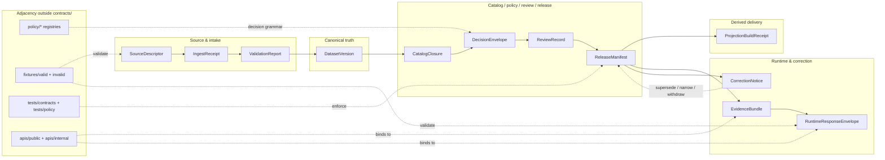

<!-- [KFM_META_BLOCK_V2]
doc_id: kfm://doc/<TODO-UUID>
title: Contracts
type: standard
version: v1
status: draft
owners: <TODO: verify owners / CODEOWNERS>
created: <TODO: YYYY-MM-DD>
updated: <TODO: YYYY-MM-DD>
policy_label: <TODO: verify public|restricted|internal|...>
related: [<TODO: verify related paths and kfm:// ids>]
tags: [kfm, contracts, schemas, verification]
notes: [Mounted March 2026 PDF corpus and current-session PDF-only workspace inspection; repo tree, owners, dates, schema inventory, fixture placement, workflow inventory, and related links require direct verification before commit.]
[/KFM_META_BLOCK_V2] -->

# Contracts

Machine-readable contract backbone for KFM source admission, release, runtime trust, and correction.

> [!IMPORTANT]
> **Status:** `<TODO: verify experimental|active|stable|deprecated>` · **Doc status:** `draft`  
> **Owners:** `<TODO: verify owners / CODEOWNERS>`  
> **Path:** `contracts/README.md`  
>      
> **Quick jumps:** [Scope](#scope) · [Repo fit](#repo-fit) · [Accepted inputs](#accepted-inputs) · [Exclusions](#exclusions) · [Directory tree](#directory-tree) · [Quickstart](#quickstart) · [Usage](#usage) · [Diagram](#diagram) · [Tables](#tables) · [Task list](#task-list) · [FAQ](#faq) · [Appendix](#appendix)

> [!WARNING]
> This README is grounded in the March 2026 KFM PDF corpus and direct current-session workspace inspection only. The target path `contracts/README.md` is user-specified, but the live repo tree, CODEOWNERS file, schema inventory, fixture placement, workflow names, and runtime implementations remain **UNKNOWN / NEEDS VERIFICATION** until the repository itself is mounted.

## Scope

`contracts/` is where KFM stops speaking only in doctrine and starts publishing typed trust objects.

This directory is the machine-validatable home for the object shapes that govern source admission, ingest memory, validation, canonical versioning, catalog closure, policy outcome, review, release, runtime trust, and visible correction. In KFM terms, these are not decorative files. They are part of the trust system.

### Truth posture used in this README

| Label | Meaning here |
| --- | --- |
| **CONFIRMED** | Directly supported by the mounted March 2026 KFM corpus or by current-session workspace inspection |
| **INFERRED** | A dependency-led consequence or placement choice strongly implied by the corpus |
| **PROPOSED** | A doctrine-consistent starter layout, file path, or workflow shape not yet proven in a mounted repo |
| **UNKNOWN / NEEDS VERIFICATION** | Repo topology, CODEOWNERS, live schema files, fixture inventory, workflow YAML, manifests, route inventory, and runtime implementations |

### Why this directory matters

Across the visible KFM corpus, the next meaningful step is **artifactization**: turning doctrine into schemas, examples, proof objects, and gates. That is why the contract layer sits so close to the center of KFM’s governed truth path. Without typed contract families, valid and invalid examples, explicit standards pins, and fail-closed verification, KFM stays persuasive but less executable than its own doctrine requires.

### What `contracts/` is for

`contracts/` should answer questions like these:

- What object shape must exist before a source can be admitted?
- What fields make a runtime response accountable?
- What release and correction objects keep publication inspectable?
- What schemas define the public-safe boundary between release, runtime, and review?

It should **not** silently absorb policy engines, deployment manifests, or application code merely because they are adjacent.

[Back to top](#contracts)

## Repo fit

| Item | Value |
| --- | --- |
| Path | `contracts/README.md` |
| Directory role | Contract-source home for KFM trust-bearing object families and standards-profile pins |
| Upstream | [Scope](#scope) · [Accepted inputs](#accepted-inputs) · [Exclusions](#exclusions) |
| Downstream | [Quickstart](#quickstart) · [Usage](#usage) · [Tables](#tables) · [Task list](#task-list) |
| Main consumers | Catalog/policy/review planes, governed APIs, release assembly, runtime trust surfaces, correction workflows, and verification gates |
| Expected adjacent surfaces | **PROPOSED / NEEDS VERIFICATION:** `policy/`, `fixtures/`, `tests/contracts/`, `tests/policy/`, `apis/public/`, `apis/internal/`, `docs/runbooks/`, `observability/`, `runtime/phase1/` |
| Trust rule | Contracts define shapes and minimum semantics; they do not by themselves grant publication, approval, or runtime permission |

> [!NOTE]
> The visible corpus is strong on contract doctrine and weak on directly mounted repo reality. Paths outside `contracts/README.md` are therefore presented here as **starter placement guidance**, not as confirmed repository facts.

## Accepted inputs

The following belong in `contracts/`:

| Belongs here | Why it belongs here |
| --- | --- |
| Contract family schema files (`*.schema.json`) | They make KFM trust objects explicit enough to validate, diff, and test |
| Standards/profile pins under `profiles/` | They keep outward profile choices explicit instead of leaving them buried in prose |
| Contract-local notes | They clarify join keys, lifecycle state, naming patterns, and correction behavior close to the schemas |
| **PROPOSED / NEEDS VERIFICATION:** co-located examples | Only when the mounted repo intentionally keeps examples beside schemas rather than under top-level `fixtures/` |

### Minimum bar for anything added here

- It is versioned.
- It is machine-validatable.
- It has at least one valid example.
- It has at least one invalid example.
- Required fields are explicit.
- Time basis is explicit.
- Join keys are explicit.
- Rights or sensitivity posture is explicit where relevant.
- Correction or supersession behavior is explicit.
- A named gate or test family exercises it.

## Exclusions

The following do **not** belong in `contracts/` as source-of-truth assets:

| Does **not** belong here | Goes instead | Why |
| --- | --- | --- |
| Policy bundles and deny-by-default logic | `policy/` | Policy should remain executable and separately reviewable |
| Reason, obligation, and reviewer-role registries | `policy/reason_codes.json`, `policy/obligation_codes.json`, `policy/reviewer_roles.json` | Prevents free-text drift in policy-significant decisions |
| Public or internal route descriptions | `apis/public/`, `apis/internal/` | Route contracts are adjacent to object contracts, not the same thing |
| Valid/invalid fixtures and gate execution | `fixtures/`, `tests/contracts/`, `tests/policy/` | Example placement and test execution are related, but not the contract-source layer itself |
| Runbooks, ADRs, and long operator prose | `docs/runbooks/`, `docs/adr/` | Narrative guidance should not replace machine-readable objects |
| Observability join-key notes | `observability/` | Audit and telemetry rules are contract-adjacent, not the schema-definition layer |
| Deployment manifests, systemd units, or infrastructure overlays | `runtime/`, `deployment/`, or equivalent | Runtime topology must remain reviewable without hiding contract sources |

## Directory tree

**PROPOSED starter layout aligned to the strongest current corpus evidence**

```text
contracts/
├─ README.md
├─ source/
│  └─ source_descriptor.schema.json
├─ intake/
│  ├─ ingest_receipt.schema.json
│  └─ validation_report.schema.json
├─ core/
│  └─ dataset_version.schema.json
├─ catalog/
│  └─ catalog_closure.schema.json
├─ policy/
│  └─ decision_envelope.schema.json
├─ review/
│  └─ review_record.schema.json
├─ release/
│  ├─ release_manifest.schema.json
│  └─ projection_build_receipt.schema.json
├─ runtime/
│  ├─ evidence_bundle.schema.json
│  └─ runtime_response_envelope.schema.json
├─ correction/
│  └─ correction_notice.schema.json
└─ profiles/
   └─ standards_profile.yaml
```

**Adjacent starter surfaces from the same artifact plan — not necessarily inside `contracts/`**

```text
policy/reason_codes.json
policy/obligation_codes.json
policy/reviewer_roles.json
fixtures/valid/*
fixtures/invalid/*
tests/contracts/*
tests/policy/*
apis/public/openapi.yaml
apis/internal/README.md
docs/runbooks/publication.md
docs/runbooks/correction.md
docs/runbooks/stale_projection.md
docs/runbooks/rollback.md
```

## Quickstart

### 1) Validate a passing example

```bash
# Illustrative only — verify the repo's actual validator entrypoint first.
python -m jsonschema \
  -i fixtures/valid/source_descriptor.min.json \
  contracts/source/source_descriptor.schema.json
```

### 2) Prove that an invalid example fails

```bash
# Illustrative only — replace <invalid-specimen>.json with a real failing fixture.
python -m jsonschema \
  -i fixtures/invalid/<invalid-specimen>.json \
  contracts/source/source_descriptor.schema.json
```

### 3) Run the contract and policy gates

```bash
# Pseudocode — replace with the repo's real entrypoint once the tree is mounted.
<contract-and-policy-test-command>
```

### 4) Update standards pins explicitly

When a contract depends on a new external profile or a version-sensitive standards choice, update `contracts/profiles/standards_profile.yaml` instead of leaving the choice implicit in prose or code comments.

### Illustrative minimal runtime envelope skeleton

```json
{
  "$schema": "https://json-schema.org/draft/2020-12/schema",
  "$id": "kfm://schema/runtime_response_envelope/v1",
  "type": "object",
  "required": [
    "schema_version",
    "object_type",
    "audit_ref",
    "request_id",
    "evaluated_at",
    "surface_class",
    "surface_state",
    "result",
    "decision_ref"
  ]
}
```

> The skeleton above is **illustrative only**. The corpus strongly confirms the contract family and its minimum semantic burden, but not a mounted field-by-field schema inventory.

## Usage

### Add a new contract family

1. Add it only if it governs a real lifecycle step, trust boundary, or visible state.
2. Put the schema in the most specific contract subdirectory available.
3. Add at least one valid example and one invalid example in the repo’s mounted fixture pattern.
4. Update standards pins if a new outward profile or version-sensitive dependency is introduced.
5. Extend contract and policy tests.
6. Confirm required fields, time basis, join keys, and correction behavior are explicit.
7. Update adjacent runbooks if operator-visible behavior changes.

### Change an existing contract safely

Keep changes additive by default.

- Prefer versioned expansion over silent semantic drift.
- Do not quietly rename trust-visible object families.
- Do not reinterpret an existing field without migration and correction handling.
- Do not let examples drift away from schemas.
- Do not let UI or route logic depend on undocumented fields.
- Do not let a compatibility shim become the real contract by inertia.

### Cross-contract seams that should not disappear

| Seam | Why it must stay explicit |
| --- | --- |
| Identity + time | Keeps publication, runtime, and correction joins reconstructable |
| Rights + sensitivity | Preserves public-safe release behavior and precision control |
| Lineage + evidence | Keeps `EvidenceBundle` drill-through operational |
| Audit + telemetry | Makes runtime disputes and failures explainable |
| Docs + contracts | Prevents public behavior from drifting away from machine rules |

### Gate-to-contract closure rule

Every proof-bearing object should eventually have:

- a schema,
- a valid example,
- an invalid example, and
- a named gate or test family that proves it.

[Back to top](#contracts)

## Diagram


```mermaid
flowchart LR
    subgraph A["Source & intake"]
        SD[SourceDescriptor]
        IR[IngestReceipt]
        VR[ValidationReport]
    end

    subgraph B["Canonical truth"]
        DV[DatasetVersion]
    end

    subgraph C["Catalog / policy / review / release"]
        CC[CatalogClosure]
        DE[DecisionEnvelope]
        RR[ReviewRecord]
        RM[ReleaseManifest]
    end

    subgraph D["Derived delivery"]
        PBR[ProjectionBuildReceipt]
    end

    subgraph E["Runtime & correction"]
        EB[EvidenceBundle]
        RRE[RuntimeResponseEnvelope]
        CN[CorrectionNotice]
    end

    SD --> IR --> VR --> DV --> CC --> DE --> RR --> RM
    RM --> PBR
    RM --> EB --> RRE
    RM --> CN
    CN -. supersede / narrow / withdraw .-> RM

    subgraph F["Adjacency outside contracts/"]
        REG[policy/* registries]
        FIX[fixtures/valid + invalid]
        TST[tests/contracts + tests/policy]
        API[apis/public + apis/internal]
    end

    REG -. decision grammar .-> DE
    FIX -. validate .-> SD
    FIX -. validate .-> RRE
    TST -. enforce .-> RM
    API -. binds to .-> EB
    API -. binds to .-> RRE
```

## Tables

### Contract family starter map

| Contract family | Likely starter file (**PROPOSED**) | Minimum purpose | Must include at least |
| --- | --- | --- | --- |
| `SourceDescriptor` | `source/source_descriptor.schema.json` | Declare the intake contract for a source or endpoint | identity; owner/steward; access mode; rights posture; support; cadence; validation plan; publication intent |
| `IngestReceipt` | `intake/ingest_receipt.schema.json` | Prove that a fetch and landing event occurred | source reference; fetch time; integrity checks; result; output pointers |
| `ValidationReport` | `intake/validation_report.schema.json` | Record what checks passed, failed, or quarantined | checklist; severity; reason codes; subject refs |
| `DatasetVersion` | `core/dataset_version.schema.json` | Carry an authoritative candidate or promoted subject set | stable ID; version ID; support; time semantics; provenance links |
| `CatalogClosure` | `catalog/catalog_closure.schema.json` | Publish outward metadata closure and lineage linkage | STAC/DCAT/PROV refs; identifiers; release linkage; outward profile refs |
| `DecisionEnvelope` | `policy/decision_envelope.schema.json` | Express a policy result machine-readably | subject; action; lane; result; reason codes; obligation codes; policy basis; `audit_ref`; effective window |
| `ReviewRecord` | `review/review_record.schema.json` | Capture human approval, denial, escalation, or note | reviewer role; decision; timestamp; refs; comments |
| `ReleaseManifest` / `ReleaseProofPack` | `release/release_manifest.schema.json` | Assemble a public-safe release and its proof | version refs; catalog refs; decision refs; docs/accessibility gate; rollback/correction posture; profile versions; bundle plan |
| `ProjectionBuildReceipt` | `release/projection_build_receipt.schema.json` | Prove a derived layer was built from a known release scope | release ref; projection type; surface class; build time; freshness basis; stale-after policy |
| `EvidenceBundle` | `runtime/evidence_bundle.schema.json` | Package support for a claim, feature, story, export preview, or answer | bundle ID; source basis; dataset refs; lineage summary; preview policy; transform receipts; rights/sensitivity state; `audit_ref` |
| `RuntimeResponseEnvelope` | `runtime/runtime_response_envelope.schema.json` | Make runtime outcome accountable | schema version; object type; `audit_ref`; `request_id`; evaluated-at time; surface class; surface state; result; citations check; decision ref |
| `CorrectionNotice` | `correction/correction_notice.schema.json` | Preserve visible lineage under change | affected releases; replacement releases; affected surface classes; rebuild refs; cause; public note |

### Route family touchpoints

| Route family | Primary objects | Boundary profile | Contract touchpoints / trust rule |
| --- | --- | --- | --- |
| Catalog and discovery | release metadata; dataset/distribution discovery; catalog closures | DCAT 3; STAC; OGC API Records; OpenAPI | closure and identifier consistency must resolve cleanly |
| Feature or subject read | released authoritative features; place dossiers; claims; detail views | OGC API Features where fit; KFM-specific OpenAPI where needed | stable subject ID, support/time semantics, rights posture, and release scope are mandatory |
| Map / tile / portrayal | released maps; tiles; legends; styles; portrayals | OGC API Maps / Tiles plus internal portrayal contracts | must inherit release linkage, policy posture, freshness, and correction state |
| Evidence resolution | `EvidenceRef -> EvidenceBundle` | KFM-specific governed API described in OpenAPI | every bundle must resolve to admissible published scope with visible rights/sensitivity state and audit linkage |
| Story / dossier / compare | narrative and comparison inputs anchored in the same shell | KFM-specific governed API described in OpenAPI | must preserve spatial anchor, temporal anchor, and drill-through to evidence |
| Export and report | public-safe exports; previews; packaged report objects | KFM-specific governed API plus release-manifest references | exports never outrun release state, policy posture, or correction linkage |
| Focus / governed assistance | bounded natural-language investigation over released scope | KFM-specific governed API plus `RuntimeResponseEnvelope` | scope, citations, policy, and audit linkage must be visible in the same pane |
| Review / stewardship | internal moderation; quarantine inspection; approval; denial; rollback; rights handling | internal governed API | no hidden approvals; every action must emit review and decision artifacts |
| Ops / status | health; status; metrics; traces; audit joins | internal ops endpoints | may not expose raw canonical data or become a second truth surface |

### Starter policy registries adjacent to `contracts/`

| Adjacent registry (**PROPOSED**) | Purpose |
| --- | --- |
| `policy/reason_codes.json` | machine-readable reasons for deny, hold, conflict, or failure states |
| `policy/obligation_codes.json` | machine-readable obligations such as redact, generalize, attribute, or embargo |
| `policy/reviewer_roles.json` | machine-readable review and separation-of-duty vocabulary |

### Example reason codes

| Example reason code | Typical meaning |
| --- | --- |
| `rights.unknown` | rights or redistribution posture is unresolved |
| `sensitivity.exact_location` | exact location is too sensitive for the requested audience |
| `validation.schema_failed` | required schema or semantic validation failed |
| `corroboration.conflicted` | independent admissible sources disagree materially |

### Verification by plane

| Plane | Verification role | Primary proof objects |
| --- | --- | --- |
| Source and intake | source admissibility; fetch integrity; validation outcome; quarantine routing | `SourceDescriptor`, `IngestReceipt`, `ValidationReport` |
| Canonical truth | deterministic identity; schema validity; unit discipline; spatial/time semantics; controlled canonical write | `DatasetVersion` plus validation outputs |
| Catalog / policy / review | catalog closure; rights/sensitivity decisions; separation of duty; promotion readiness; correction governance | `CatalogClosure`, `DecisionEnvelope`, `ReviewRecord`, `ReleaseManifest`, `CorrectionNotice` |
| Derived delivery | freshness; release linkage; rebuildability; inherited policy boundaries | `ProjectionBuildReceipt` and export manifests |
| Runtime and trust surfaces | evidence resolution; citation checks; answer/abstain/deny/error handling; audit reconstruction | `EvidenceBundle`, `RuntimeResponseEnvelope`, `audit_ref` |

<details>
<summary><strong>Corpus-supported standards publication profile</strong></summary>

| Concern | Corpus-supported profile | Why `contracts/` cares |
| --- | --- | --- |
| Contract schemas | JSON Schema Draft 2020-12 | machine-validatable contract files and examples |
| Dataset/distribution metadata | DCAT 3 | outward dataset and distribution closure |
| Provenance vocabulary | PROV-O | lineage and correction linkage |
| Spatiotemporal asset metadata | STAC 1.1.0 | release-level asset and scene packaging |
| Discovery routes | OGC API Records | catalog/discovery route family |
| Authoritative feature reads | OGC API Features | released feature and subject reads |
| Map/tile portrayal | OGC API Maps / Tiles | standards-aligned portrayal surfaces |
| Route descriptions | OpenAPI | governed API publication and boundary clarity |

</details>

[Back to top](#contracts)

## Task list

### Definition of done for any contract added here

- [ ] schema file exists
- [ ] at least one valid example exists
- [ ] at least one invalid example exists
- [ ] required fields are explicit
- [ ] time basis is explicit
- [ ] lifecycle or publication state is explicit
- [ ] rights or sensitivity posture is explicit where relevant
- [ ] correction or supersession path is explicit
- [ ] join keys are explicit
- [ ] examples and schema are in sync
- [ ] a named test family exercises the contract
- [ ] adjacent docs or runbooks are updated when operator-visible behavior changes

### Review gates

- [ ] no free-text-only decision logic where registries are required
- [ ] no client-visible trust behavior depends on undocumented fields
- [ ] no contract change silently broadens release scope or runtime answer scope
- [ ] no invalid example now passes unexpectedly
- [ ] no valid example now fails unexpectedly
- [ ] no change weakens audit reconstruction or correction lineage
- [ ] no schema/example/docs drift leaves `contracts/` out of sync with gates or surfaces
- [ ] no **UNKNOWN** has been silently promoted to fact without direct repo evidence

## FAQ

### Why keep invalid examples?

Because KFM is fail-closed. A passing example proves the happy path; an invalid example proves the gate rejects bad structure on purpose.

### Why keep policy registries outside `contracts/`?

Because the visible artifact plan separates structural contract files from executable policy vocabulary and decision bundles. The README should make those registries visible without collapsing them into schema comments.

### Why are some literal paths still marked `PROPOSED`?

Because the corpus is explicit about contract families and about a few starter paths, but it does **not** prove a mounted repo tree for every subdirectory listed here.

### Why start with hydrology?

Because the visible KFM corpus repeatedly treats hydrology as the smallest high-value, public-safe first thin slice: place-rich, time-rich, and operationally legible enough to prove the trust path without opening the hardest rights lanes first.

### Why is this README still useful before the repo is mounted?

Because the contract families, verification burden, route-family obligations, and contract-first sequencing are already strongly convergent in the March 2026 KFM corpus. What remains unresolved is local repo reality, not the role of the contract layer.

## Appendix

<details>
<summary><strong>Evidence basis and current-session limits</strong></summary>

This README is grounded in the March 2026 KFM doctrine and realization corpus, with the strongest weight given to the canonical replacement-grade materials that explicitly surface:

- contract families and their minimum semantic burden,
- the first schema wave,
- route-family and trust obligations,
- verification and proof families,
- the minimal next artifact plan, and
- explicit `CONFIRMED / INFERRED / PROPOSED / UNKNOWN` discipline.

Current-session limits remain material:

- the visible workspace inspection surfaced PDF artifacts only
- no repo checkout, `.git` metadata, CODEOWNERS file, schema files, fixture directories, workflow YAML, manifests, dashboards, or runtime traces were directly visible
- treat file paths outside this README as starter guidance until the mounted repo confirms them

</details>

<details>
<summary><strong>Direct verification backlog before commit</strong></summary>

The following should be checked against the real repo before merge:

1. Whether `contracts/` already exists and how it is currently split.
2. Whether schemas are grouped by family, by plane, or in a flat directory.
3. Where valid and invalid examples live.
4. Whether policy registries already exist, and under what names.
5. Whether public/internal OpenAPI route descriptions already bind to these contracts.
6. Whether contract tests and policy tests are separate or combined.
7. Whether release proof packs and runtime envelope samples already exist.
8. CODEOWNERS, review boundaries, created/updated date rules, and any document-template automation.

</details>

<details>
<summary><strong>Minimal first PR pack</strong></summary>

A practical first PR should stay small and trust-bearing:

- contract core: first schema wave
- policy vocabulary: reason, obligation, and reviewer-role registries
- fixtures: one valid and one invalid example per first-wave family
- tests: schema validation plus policy grammar checks
- one thin slice: hydrology-first end-to-end proof
- one runtime proof: `EvidenceBundle` + `RuntimeResponseEnvelope`
- one correction drill: supersede, narrow, or withdraw with visible lineage

That is enough to make the system materially more real without pretending the entire architecture is already mounted.

</details>

[Back to top](#contracts)
