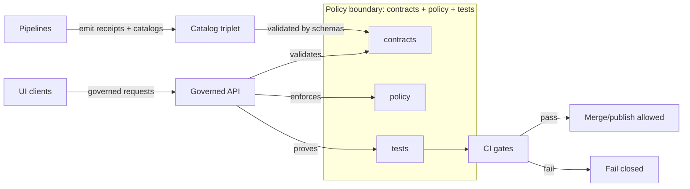

<!-- [KFM_META_BLOCK_V2]
doc_id: kfm://doc/5c4c213f-c067-4ada-8e8a-544fc4274a82
title: contracts — Governed API and Schema Contracts
type: standard
version: v2
status: draft
owners: KFM Platform Team (TBD)
created: 2026-03-03
updated: 2026-03-03
policy_label: public
related:
  - ../policy/
  - ../tools/
  - ../tests/
  - ../docs/
tags: [kfm, contracts, openapi, json-schema, governance]
notes:
  - This README is a directory contract. It avoids asserting unverified repo structure beyond what is documented.
[/KFM_META_BLOCK_V2] -->

# `contracts/` — Governed API & Schema Contracts
Machine-readable contracts (APIs + schemas + vocabularies) that define KFM’s **policy-boundary interfaces**.

---

## Impact
**Status:** `draft` (directory contract)  
**Owners:** `KFM Platform Team (TBD)` • _Recommended:_ add `CODEOWNERS` for `contracts/**`  
**Applies to:** any PR that changes OpenAPI / schemas / vocabularies used by governed surfaces  
**Change posture:** **fail-closed**, additive-first, versioned


**Quick links:**  
[Purpose](#purpose) · [Where this fits](#where-this-fits) · [Quickstart](#quickstart) ·
[Directory layout](#directory-layout) · [Contract registry](#contract-registry) ·
[Validation and CI gates](#validation-and-ci-gates) · [Change workflow](#change-workflow) ·
[Security and sensitivity](#security-and-sensitivity) · [Unknowns](#unknowns-and-verification-steps)

> NOTE  
> **CONFIRMED (design invariant):** KFM maintains a **trust membrane**: clients/UI must not bypass governed APIs and policy enforcement.  
> **PROPOSED (implementation rule):** contracts are part of the membrane because they make policy, validation, and compatibility testable.

---

## Evidence tags
KFM docs and PRs must keep claims traceable.

- **CONFIRMED** = explicitly documented in KFM artifacts (may still require repo checkout verification).
- **PROPOSED** = recommended standard/pattern, not guaranteed implemented everywhere yet.
- **UNKNOWN** = not verified; includes the *smallest verification step* to make it CONFIRMED.

[Back to top](#contracts---governed-api--schema-contracts)

---

## Purpose
- **CONFIRMED:** `contracts/` centralizes **machine-readable interface definitions** (OpenAPI, JSON Schema, and controlled vocabularies).
- **CONFIRMED:** contracts are **governance surfaces** used for validation, contract tests, and promotion gating.
- **PROPOSED:** treat `contracts/` as the *source of truth* for interface shape; generated artifacts (SDKs/stubs/docs) should be reproducible outputs with receipts (not hand-edited).

**Non-goals (scope control):**
- **CONFIRMED:** this folder is not a data lake, not a secrets store.
- **PROPOSED:** this folder is not the place for implementation logic (that lives in `apps/` and `packages/`).

[Back to top](#contracts---governed-api--schema-contracts)

---

## Where this fits
- **CONFIRMED (posture):** governed APIs are the only supported path from UI/clients to KFM data/services.
- **CONFIRMED (posture):** the catalog triplet (DCAT + STAC + PROV) is a contract surface for discovery, provenance, and promotion.
- **PROPOSED:** `contracts/` provides the **boundary definitions** that keep invariants testable and enforceable in CI.


```mermaid
flowchart LR
  subgraph Membrane["Policy boundary: contracts + policy + tests"]
    C[contracts]
    P[policy]
    T[tests]
  end

  UI[UI clients] -->|governed requests| API[Governed API]
  API -->|validates| C
  API -->|enforces| P
  API -->|proves| T

  Pipelines[Pipelines] -->|emit receipts + catalogs| Catalog[Catalog triplet]
  Catalog -->|validated by schemas| C
  T --> CI[CI gates]
  CI -->|pass| Merge[Merge/publish allowed]
  CI -->|fail| Block[Fail closed]
```

[Back to top](#contracts---governed-api--schema-contracts)

---

## Acceptable inputs
What belongs here (and why):

- **CONFIRMED:** OpenAPI documents for governed endpoints (REST boundary).
- **CONFIRMED:** JSON Schemas for request/response payloads, receipts/manifests, and contract-checked objects.
- **CONFIRMED:** controlled vocabularies (enums / code lists) used for normalization and policy allowlists.

**Optional contract surfaces (only if you already use them):**
- **PROPOSED:** STAC/DCAT/PROV **profiles** (pinning + constraints) used by catalog validation gates.
- **PROPOSED:** telemetry/event schemas if telemetry is treated as a governed surface.
- **PROPOSED:** GraphQL schema (`.graphql`) if GraphQL is exposed.

[Back to top](#contracts---governed-api--schema-contracts)

---

## Exclusions
> WARNING  
> `contracts/` is a **contract surface**, not a storage bucket.

- **CONFIRMED:** no secrets (tokens, credentials, private keys).
- **CONFIRMED:** no raw datasets or large binaries (those belong to lifecycle zones: RAW/WORK/PROCESSED/PUBLISHED).
- **PROPOSED:** no generated SDKs or generated stubs committed unless you have a reproducible-generation policy + receipts.
- **PROPOSED:** no one-off schemas without ownership/versioning and a compatibility story.

[Back to top](#contracts---governed-api--schema-contracts)

---

## Quickstart
Because this README cannot assume the repo’s exact toolchain is present, commands below are **pseudocode** patterns. Prefer running the **same commands CI runs**.

### 1) Discover the contract gates CI uses
```bash
# pseudocode — pick the command(s) actually used by your CI
rg -n "contracts/" .github/workflows || true
rg -n "openapi|spectral|redocly|ajv|jsonschema|schemathesis|dredd" .github/workflows || true
```

### 2) Run contract validation locally
```bash
# pseudocode — examples only (align to the repo's chosen tools)

# OpenAPI lint
spectral lint "contracts/openapi/**/*.y*ml"

# JSON Schema validation against examples/fixtures
ajv validate -s "contracts/jsonschema/**/*.json" -d "contracts/examples/**/*.json"

# Breaking-change detection (compare against main or last release snapshot)
openapi-diff --fail-on-incompatible "main.yaml" "pr.yaml"
```

### 3) Run contract tests
```bash
# pseudocode — run the contract test harness (mock server or integration test env)
make test-contracts
# OR: npm run test:contracts
# OR: pytest -m contract
```

[Back to top](#contracts---governed-api--schema-contracts)

---

## Directory layout
This layout is expressed as **documented minimum + expected extensions**, to avoid fabricating repo structure.

### Minimal documented contents
- **CONFIRMED:** `contracts/` exists as a top-level area for OpenAPI, JSON Schemas, and vocab files.

### Expected layout
```text
contracts/
├─ openapi/               # CONFIRMED: OpenAPI definitions (REST boundary)
├─ jsonschema/            # CONFIRMED: JSON Schemas (payloads, receipts, manifests, etc.)
├─ vocab/                 # CONFIRMED: controlled vocabularies / code lists
├─ examples/              # PROPOSED: minimal example payloads used by tests
├─ stac/                  # PROPOSED: STAC profiles/extensions pinned for KFM usage
├─ dcat/                  # PROPOSED: DCAT profile constraints/pinning
├─ prov/                  # PROPOSED: PROV profile constraints/pinning
└─ README.md              # this file
```

[Back to top](#contracts---governed-api--schema-contracts)

---

## Contract registry
Use this table as a checklist for “what contract surfaces exist” and “how are they validated”.

| Contract surface | Primary consumers | Where used | Gate/validation (expected) | Tag |
|---|---|---|---|---|
| OpenAPI (REST) | UI clients, API server | API boundary | lint + contract tests + breaking-change detection | **CONFIRMED** |
| JSON Schema | pipelines, API, validators, policy tests | payload validation | schema validation on examples/fixtures + CI enforcement | **CONFIRMED** |
| Controlled vocab | pipelines, UI filters, policy | normalization + policy allowlists | enum checks + policy alignment tests | **CONFIRMED** |
| STAC profile pinning | catalog tooling | catalog triplet | STAC validator + link checks | **PROPOSED** |
| DCAT profile pinning | catalog tooling | catalog triplet | DCAT validator | **PROPOSED** |
| PROV profile pinning | catalog tooling | catalog triplet | PROV shape checks (JSON-LD profile or JSON Schema) | **PROPOSED** |
| Telemetry schemas | UI + pipelines + governance | runtime audit + dashboards | schema validation + event-contract tests | **PROPOSED** |
| GraphQL schema | UI clients, API | API boundary | schema diff + contract tests | **PROPOSED** |

[Back to top](#contracts---governed-api--schema-contracts)

---

## Versioning and compatibility
- **PROPOSED:** contracts must be versioned so downstreams can evolve safely.
- **PROPOSED:** prefer additive changes:
  - add optional fields before requiring them,
  - deprecate before removal,
  - avoid renames without compatibility layers.
- **PROPOSED:** every breaking change includes:
  - migration notes,
  - updated tests/fixtures,
  - explicit version bump (SemVer or equivalent),
  - a rollback path.

### Minimal compatibility rubric
| Change type | Examples | Compatible? |
|---|---|---|
| Add optional field | new property with default | ✅ yes |
| Add required field | new required key | ❌ breaking |
| Remove/rename field | deletes/renames keys | ❌ breaking |
| Tighten enum | remove allowed values | ❌ breaking |
| Clarify docs only | text changes | ✅ yes |

[Back to top](#contracts---governed-api--schema-contracts)

---

## Validation and CI gates
- **CONFIRMED (posture):** KFM uses automated gates to prevent unsafe promotion; schema/contract validation is a core mechanism.
- **CONFIRMED (posture):** **fail closed** is the default for governed surfaces.
- **PROPOSED:** minimum CI checks for `contracts/**`:
  1. OpenAPI syntax + lint.
  2. JSON Schema validation on example payloads.
  3. Contract tests (API requests/responses) against a mock or test server.
  4. Breaking-change detection (diff against main branch contract snapshot).
  5. Policy alignment: contracts must not introduce bypass routes (e.g., “direct storage” endpoints).

### PR Definition of Done
- [ ] **CONFIRMED/PROPOSED:** change is scoped and reversible (small diff; rollback path documented if needed).
- [ ] **PROPOSED:** versioning updated (if needed) and migration notes included (breaking vs additive).
- [ ] **CONFIRMED/PROPOSED:** examples/fixtures updated to match.
- [ ] **PROPOSED:** contract tests updated/added.
- [ ] **CONFIRMED/PROPOSED:** policy implications documented (what access expands/tightens).
- [ ] **UNKNOWN:** verify CI has a merge-blocking job for contract validation. (See [Unknowns and verification steps](#unknowns-and-verification-steps))

[Back to top](#contracts---governed-api--schema-contracts)

---

## Change workflow
Treat contract changes like public APIs.

1. **PROPOSED:** open a PR labeled `contracts` and scope it to one surface when possible.
2. **PROPOSED:** include a short compatibility statement (additive vs breaking).
3. **PROPOSED:** update fixtures and contract tests in the same PR.
4. **PROPOSED:** require CODEOWNERS review from platform/governance owners.
5. **PROPOSED:** merge only when CI gates pass (fail closed).

<details>
<summary>PR template snippet (copy/paste)</summary>

```text
## Contract change summary
Tag: CONFIRMED | PROPOSED | UNKNOWN

- What changed:
- Why:
- Compatibility (additive vs breaking):
- Migration notes (if breaking):
- Tests/fixtures updated:
- Policy impact (access expanded/tightened):
- Rollback path (if needed):
```

</details>

[Back to top](#contracts---governed-api--schema-contracts)

---

## Security and sensitivity
- **CONFIRMED (posture):** the trust membrane exists to prevent policy bypass; contracts must not introduce “side doors”.
- **CONFIRMED (posture):** if contract payloads can include location data, follow classification/redaction obligations (default-deny; generalize where required).
- **PROPOSED:** add schema-level constraints when feasible (examples: precision caps for coordinates, pattern/format constraints, bounds checking).
- **PROPOSED:** contracts must not require clients to submit secrets that should remain server-side.

[Back to top](#contracts---governed-api--schema-contracts)

---

## Unknowns and verification steps
These are the smallest steps to convert UNKNOWN → CONFIRMED for this repo checkout.

1) **UNKNOWN:** What is the *actual* `contracts/` tree in this repo?  
- Verification: run `tree -L 3 contracts` and paste the output into this README under “Directory layout”.

2) **UNKNOWN:** Which CI jobs validate contracts and block merge?  
- Verification: inspect `.github/workflows/*` for jobs touching `contracts/**`; link them here and name the merge-blocking checks.

3) **UNKNOWN:** What exact contract versions are used?  
- Verification: open the contract files and record: OpenAPI (3.0 vs 3.1), JSON Schema draft, and any pinned STAC/DCAT/PROV profiles.

4) **UNKNOWN:** Is there a canonical “contract test harness” path?  
- Verification: search the repo for `contract test`, `openapi lint`, `spectral`, `dredd`, `schemathesis`, `prism`, or similar; link the chosen approach here.

[Back to top](#contracts---governed-api--schema-contracts)

---

<details>
<summary>Appendix — Suggested tooling matrix (PROPOSED)</summary>

This is not prescriptive. Prefer the tools already used in CI.

| Surface | Lint/validate | Break detection | Notes |
|---|---|---|---|
| OpenAPI | Spectral or Redocly | openapi-diff | Gate “incompatible” changes fail-closed |
| JSON Schema | AJV (JS) or jsonschema (Py) | schema-diff (if used) | Validate against minimal fixtures/examples |
| STAC | stac-validator | n/a | Ensure extensions are pinned consistently |
| DCAT | project validator | n/a | Validate required fields + JSON-LD shape |
| PROV | shape/schema checks | n/a | Prefer deterministic IDs + receipts |

</details>
