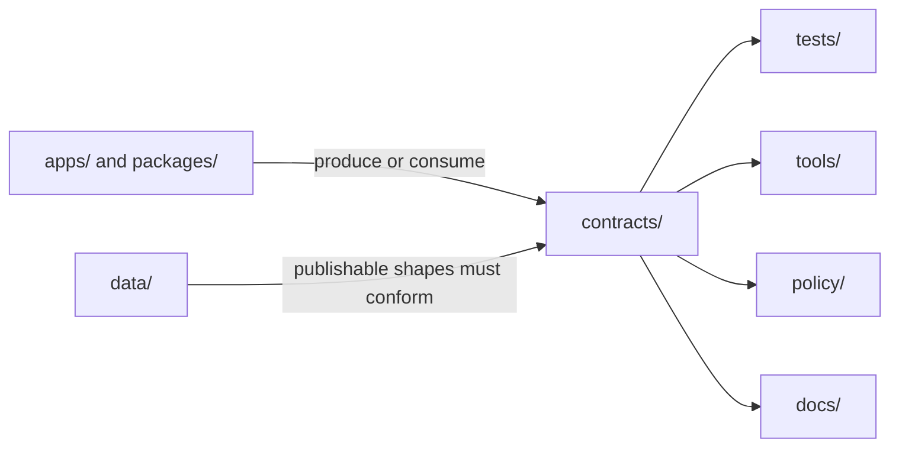

<!-- [KFM_META_BLOCK_V2]
doc_id: kfm://doc/0a4ee74d-7bc9-4f42-bfb7-641b52a2c4bb
title: contracts/README.md
type: standard
version: v1
status: draft
owners: TODO
created: 2026-03-07
updated: 2026-03-07
policy_label: public
related: [../README.md, ../apps/, ../packages/, ../policy/, ../schemas/, ../tests/, ../tools/, ../docs/]
tags: [kfm, contracts, openapi, json-schema, vocabulary, governance]
notes: [Directory README for interface-level agreements and validation surfaces.]
[/KFM_META_BLOCK_V2] -->

# `contracts/`
Governed home for interface-level agreements: OpenAPI, JSON Schema, vocabularies, examples, profiles, and compatibility rules.

> **Status:** active / under construction  
> **Owners:** TODO (`CODEOWNERS`)  
> **Change posture:** small, reversible, additive
>
>    
>
> **Quick jump:** [Scope](#scope) · [Repo fit](#repo-fit) · [Accepted inputs](#accepted-inputs) · [Exclusions](#exclusions) · [Directory tree](#directory-tree) · [Quickstart](#quickstart) · [Validation matrix](#validation-matrix) · [Change checklist](#change-checklist) · [FAQ](#faq)

---

## Scope

`contracts/` defines the machine-readable interface surfaces that other KFM subsystems are expected to honor.

### Evidence status ledger

- **CONFIRMED:** `contracts/` is the repository surface for API contracts and schemas.
- **CONFIRMED:** contracts are intended to be treated as production artifacts.
- **CONFIRMED:** changes should remain additive and versioned where possible.
- **PROPOSED:** this README expands the directory into a first-class contract registry with examples, profiles, and compatibility notes.
- **UNKNOWN:** the exact contract inventory that should exist in your current branch beyond `README.md`; verify before relying on any proposed layout below.

### What belongs here

This directory exists to make interface promises explicit, versioned, and testable.

Typical concerns include:

- request/response shapes for governed APIs
- schema definitions for published or exchanged artifacts
- enumerations and vocabularies that must stay stable across services
- contract examples used by tests, docs, and review workflows
- compatibility notes for breaking versus non-breaking changes

[Back to top](#contracts)

---

## Repo fit

**Path:** `contracts/`

This directory sits between producers/consumers and enforcement tooling.

### Upstream

- [`../apps/`](../apps/) — service and UI implementations that expose or consume public/internal interfaces
- [`../packages/`](../packages/) — reusable domain and integration modules
- [`../data/`](../data/) — governed data assets whose publishable forms may need contract-bound metadata
- [`../schemas/`](../schemas/) — adjacent schema surface for reusable or non-interface-specific models, if the repo distinguishes them

### Downstream

- [`../tests/`](../tests/) — contract tests, fixture checks, compatibility tests
- [`../tools/`](../tools/) — validators, linters, hashers, diff tools, release helpers
- [`../policy/`](../policy/) — policy gates that may enforce contract-linked invariants
- [`../docs/`](../docs/) — human-readable architecture, API, and governance documentation

### Design rule

**PROPOSED:** if both `contracts/schemas/` and `../schemas/` exist, reserve:

- `contracts/schemas/` for **published, interface-bound schemas** that are part of an external or cross-service contract
- `../schemas/` for **shared/internal model schemas** that are not themselves a release contract


```mermaid
flowchart LR
  A[apps/ and packages/] -->|produce or consume| B[contracts/]
  C[data/] -->|publishable shapes must conform| B
  B --> D[tests/]
  B --> E[tools/]
  B --> F[policy/]
  B --> G[docs/]
```

[Back to top](#contracts)

---

## Accepted inputs

Put only contract artifacts and their close support files here.

### CONFIRMED / expected categories

- **API contracts**  
  OpenAPI documents and related request/response examples.
- **Schema contracts**  
  JSON Schema or equivalent for payloads, events, manifests, and publishable metadata.
- **Controlled vocabularies**  
  Enumerations, code lists, profile vocab files, and related documentation.
- **Examples and fixtures**  
  Golden examples used by tests, docs, and review.
- **Compatibility notes**  
  Version notes, deprecation notices, migration guidance for contract consumers.

### PROPOSED file patterns

- `contracts/openapi/*.yaml`
- `contracts/schemas/**/*.schema.json`
- `contracts/vocab/**/*.{json,yaml,yml,md}`
- `contracts/examples/**/*.{json,yaml,yml}`
- `contracts/profiles/**/*.md`
- `contracts/compat/**/*.md`

[Back to top](#contracts)

---

## Exclusions

Do **not** place these in `contracts/`.

- application runtime code
- notebooks, experiments, or one-off analysis outputs
- raw, work, or processed data payloads
- policy bundles or enforcement logic themselves
- generated SDKs or compiled artifacts
- secrets, credentials, or environment files
- long-form architecture docs that belong in `../docs/`

When in doubt, keep `contracts/` narrow: it should describe the agreement, not implement the whole system.

[Back to top](#contracts)

---

## Directory tree

### Current observed minimum

```text
contracts/
└── README.md
```

### PROPOSED target layout

```text
contracts/
├── README.md
├── openapi/
│   ├── kfm-api.v1.yaml
│   └── fragments/
├── schemas/
│   ├── common/
│   ├── api/
│   ├── catalog/
│   └── evidence/
├── vocab/
│   ├── enums/
│   ├── code-lists/
│   └── profiles/
├── examples/
│   ├── requests/
│   ├── responses/
│   └── manifests/
├── compat/
│   ├── changelog.md
│   └── migration-notes/
└── tests/
    └── fixtures/
```

### Placement guidance

| Artifact type | Put it in | Why |
|---|---|---|
| Public REST surface | `openapi/` | Single, reviewable API contract |
| Contract-bound JSON payload | `schemas/` | Machine validation and compatibility checks |
| Stable enum / code list | `vocab/` | Avoid drift across services |
| Golden request/response sample | `examples/` | Powers docs and tests |
| Breaking-change notes | `compat/` | Makes versioning explicit |
| Test-only support samples | `tests/fixtures/` or `../tests/` | Keep validation inputs close to tests |

[Back to top](#contracts)

---

## Quickstart

### Inspect the current contract surface

```bash
find contracts -maxdepth 3 -type f | sort
```

### See what changed before review

```bash
git diff -- contracts
```

### Find code that depends on a contract

```bash
grep -R "openapi\|schema\|contract\|vocab" apps packages tests tools -n
```

### Create the recommended folders safely

```bash
mkdir -p contracts/{openapi,schemas/{common,api,catalog,evidence},vocab/{enums,code-lists,profiles},examples/{requests,responses,manifests},compat/migration-notes,tests/fixtures}
```

[Back to top](#contracts)

---

## Usage rules

### Versioning

- Prefer additive changes over breaking changes.
- When a breaking change is necessary, create a new versioned contract surface or document the migration explicitly.
- Do not silently repurpose an existing field, enum value, or response shape.

### Reviewability

- Every contract change should be human-readable in diff form.
- Examples should change alongside the schema or API document they illustrate.
- Consumer impact should be described in the same PR or change record.

### Determinism

- Contract artifacts should be canonicalized enough that semantically identical changes do not cause noisy churn.
- Stable ordering, formatting, and naming reduce accidental breakage.

### Naming

- Prefer explicit, boring names over clever names.
- Include version markers only where versioning strategy requires them.
- Keep filenames aligned with the surface they describe.

[Back to top](#contracts)

---

## Validation matrix

| Check | Purpose | Where it should run | Minimum expected outcome |
|---|---|---|---|
| Syntax validation | Catch malformed YAML/JSON early | local + CI | File parses cleanly |
| Schema validation | Confirm examples conform to schemas | CI + tests | All examples validate |
| OpenAPI linting | Enforce API contract hygiene | local + CI | No unresolved refs / structural errors |
| Compatibility review | Detect breaking changes | PR review + CI where possible | Breaking changes are explicit and approved |
| Consumer smoke test | Ensure apps/packages still work with updated contract | CI | Known consumers still pass |
| Policy alignment check | Confirm policy assumptions still match the contract surface | PR review + CI where wired | No drift between enforcement and contract |

### Definition of done for a contract change

- [ ] The artifact is in the correct subdirectory.
- [ ] The change is additive, or a breaking change is explicitly documented.
- [ ] Examples were added or updated.
- [ ] Validation passes.
- [ ] Consumer impact is named.
- [ ] Migration notes were added if needed.
- [ ] Reviewers can understand the diff without reverse-engineering the implementation.

[Back to top](#contracts)

---

## Change checklist

Use this checklist when opening a PR that touches `contracts/`.

1. Describe **what surface changed**.
2. State whether the change is **additive** or **breaking**.
3. Link or update the matching examples.
4. Link the consumer code or tests affected.
5. Note any migration steps for downstream clients.
6. Confirm that no data, policy bundles, or runtime code were misplaced here.

[Back to top](#contracts)

---

## FAQ

### Why keep contracts separate from implementation code?

Because the agreement needs to stay inspectable, testable, and reviewable even when implementation details change.

### Why not put every schema in `contracts/`?

Because not every schema is a released interface surface. Keep `contracts/` focused on promises made across subsystem boundaries.

### What if I need to change a field name?

Treat it as breaking unless you can preserve backward compatibility. Add migration notes and update examples in the same change.

### Where should contract validation logic live?

Validation **logic** belongs in [`../tools/`](../tools/) and/or [`../tests/`](../tests/). Validation **artifacts** (schemas, examples, profiles) belong here.

[Back to top](#contracts)

---

## Appendix

<details>
<summary>Suggested naming conventions and migration notes</summary>

### Suggested naming conventions

- `kfm-api.v1.yaml` for a primary OpenAPI document
- `*.schema.json` for JSON Schema files
- `examples/<surface>/<name>.json` for golden examples
- `compat/migration-notes/<from>-to-<to>.md` for breaking-change notes

### Migration note template

```md
# Migration: v1 → v2

## What changed
- renamed `oldField` → `newField`
- removed enum value `legacy`

## Who is affected
- API clients calling `...`
- validation tooling reading `...`

## Required actions
1. Update request builders.
2. Re-run contract fixtures.
3. Confirm policy assumptions still match.
```

### Minimal review questions

- Is this truly a contract change, or should it live elsewhere?
- Is the consumer impact obvious from the diff?
- Are examples and migration notes complete?
- Would a new contributor know where to extend this next?

</details>

[Back to top](#contracts)
