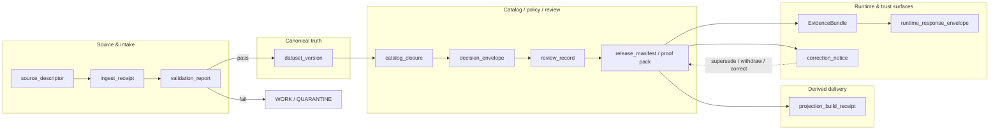
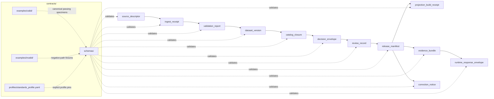

<!-- [KFM_META_BLOCK_V2]
doc_id: kfm://doc/<TODO-UUID>
title: Contracts
type: standard
version: v1
status: draft
owners: <TODO: verify owners / CODEOWNERS>
created: <TODO: YYYY-MM-DD>
updated: <TODO: YYYY-MM-DD>
policy_label: <TODO: verify public|restricted|internal|...>
related: [<TODO: verify related paths and kfm:// ids>]
tags: [kfm, contracts, schemas, verification]
notes: [Mounted March 2026 PDF corpus only in the current session; repo tree, owners, dates, adjacent paths, schema inventory, fixture inventory, and related links require direct verification before commit.]
[/KFM_META_BLOCK_V2] -->

# Contracts

Machine-readable contract backbone for KFM source admission, release, runtime trust, and correction.

> [!IMPORTANT]
> **Status:** `<TODO: verify experimental|active|stable|deprecated>` · **Doc status:** `draft`  
> **Owners:** `<TODO: verify owners / CODEOWNERS>`  
> **Path:** `contracts/README.md`  
>      
> **Quick jumps:** [Scope](#scope) · [Repo fit](#repo-fit) · [Accepted inputs](#accepted-inputs) · [Exclusions](#exclusions) · [Directory tree](#directory-tree) · [Quickstart](#quickstart) · [Usage](#usage) · [Diagram](#diagram) · [Tables](#tables) · [Task list](#task-list) · [FAQ](#faq) · [Appendix](#appendix)

> [!WARNING]
> This README is grounded in the mounted March 2026 KFM PDF corpus only. The target path `contracts/README.md` is user-specified, but adjacent repo paths, current schema inventory, fixture inventory, CODEOWNERS, workflow names, and live implementation depth remain **UNKNOWN / NEEDS VERIFICATION** until the actual repository tree is inspected.

## Scope

`contracts/` is where KFM stops speaking only in prose and starts speaking in typed objects.

In corpus terms, this directory is the **machine-readable edge of the governed truth path**: the contract lattice through which source admission, validation, catalog closure, policy outcome, review, release, evidence drill-through, runtime accountability, and visible correction become auditable.

### Truth posture used in this README

| Label | Meaning here |
| --- | --- |
| **CONFIRMED** | Directly supported by the mounted March 2026 KFM corpus |
| **PROPOSED** | Doctrine-consistent starter layout, file placement, or workflow shape not directly verified in a mounted repo |
| **UNKNOWN / NEEDS VERIFICATION** | Repo tree, schema inventory, fixture inventory, route files, CODEOWNERS, workflow YAML, manifests, and live resolver/runtime implementations |

### Why contracts come first

Across the mounted corpus, the strongest next move is not more broad conceptual writing. It is executable structure: first-wave schemas, valid and invalid fixtures, starter registries, deny-by-default policy bundles, an `EvidenceBundle` resolver path, a `runtime_response_envelope` path, and one hydrology-first governed slice.

[Back to top](#contracts)

## Repo fit

| Item | Value |
| --- | --- |
| Path | `contracts/README.md` |
| Directory role | Machine-readable home for KFM contract families, fixtures, and standards-profile pins |
| Upstream | [Scope](#scope) · [Accepted inputs](#accepted-inputs) · [Exclusions](#exclusions) |
| Downstream | [Quickstart](#quickstart) · [Tables](#tables) · [Task list](#task-list) |
| Expected adjacent surfaces | **PROPOSED / NEEDS VERIFICATION:** `policy/` or equivalent policy-bundle root; `tests/contracts/` or equivalent gate root; governed API route/DTO surfaces; `docs/` runbooks and ADRs |
| Main consumers | Policy enforcement, governed APIs, release/proof tooling, CI gates, EvidenceBundle resolution, runtime trust surfaces, and correction workflows |

> [!NOTE]
> The mounted corpus is strong on contract doctrine and weak on directly visible repo placement. Treat adjacent paths in this README as **starter placement guidance**, not as confirmed repository facts.

## Accepted inputs

The following belong in `contracts/`:

| Belongs here | Why it belongs here |
| --- | --- |
| JSON Schema or equivalent machine-readable contract files | Makes truth-bearing object families explicit enough to validate, diff, test, and version |
| `examples/valid/` fixtures | Provide canonical passing specimens for docs, gates, and review |
| `examples/invalid/` fixtures | Prove fail-closed behavior intentionally rather than by accident |
| Schema-facing registries | Stabilize reason codes, obligation codes, runtime outcomes, surface states, reviewer roles, and related contract vocabularies |
| Standards/publication profile artifacts | Keep outward-profile choices explicit instead of implicit |
| Short contract-local notes | Clarify join keys, lifecycle state, correction lineage, and versioning without hiding logic in prose elsewhere |

### Minimum bar for anything added here

- It is versioned.
- It is machine-validatable.
- It has at least one valid fixture.
- It has at least one invalid fixture.
- Required fields are explicit.
- Time basis is explicit.
- Join keys are explicit.
- Correction or supersession behavior is explicit.
- A named gate or test family exercises it.

## Exclusions

The following do **not** belong in `contracts/` as source-of-truth assets. Proposed destinations below are placeholders until the repo tree is directly verified.

| Does **not** belong here | Goes instead | Why |
| --- | --- | --- |
| Executable deny-by-default policy bundles | `policy/` or equivalent | Policy enforcement should stay executable, reviewable, and separately testable |
| Redaction/generalization transform catalogs | `policy/` or equivalent | Sensitivity handling should not hide inside schema comments |
| Route handlers or API implementation code | governed API packages | Transport implementation is adjacent to, not identical with, object contracts |
| Workflow execution and CI/CD plumbing | workflow / script roots | Gates consume contracts, but execution definitions are not the contracts directory |
| Runbooks, ADRs, and long operator prose | `docs/` or equivalent | Narrative guidance should not replace machine-readable objects |
| Deployment manifests and host/runtime configuration | config / deployment roots | Runtime topology and bind posture are separate governance concerns |
| Generated proof packs, release bundles, and emitted artifacts | release artifact roots | Generated outputs should not overwrite contract sources |
| Thin-slice domain fixtures and integration trails | fixture / test / slice roots | End-to-end proof material is broader than reusable contract specimens |

> [!TIP]
> A useful dividing line is simple: `contracts/` defines the shapes and vocabularies that other layers must obey. It should not silently become the place where those layers are executed.

## Directory tree

**PROPOSED starter layout — verify against the mounted repo before commit**

```text
contracts/
├─ README.md
├─ schemas/
│  ├─ source_descriptor.schema.json
│  ├─ ingest_receipt.schema.json
│  ├─ validation_report.schema.json
│  ├─ dataset_version.schema.json
│  ├─ catalog_closure.schema.json
│  ├─ decision_envelope.schema.json
│  ├─ review_record.schema.json
│  ├─ release_manifest.schema.json
│  ├─ projection_build_receipt.schema.json
│  ├─ evidence_bundle.schema.json
│  ├─ runtime_response_envelope.schema.json
│  └─ correction_notice.schema.json
├─ examples/
│  ├─ valid/
│  │  ├─ source_descriptor.min.json
│  │  ├─ ingest_receipt.min.json
│  │  ├─ validation_report.min.json
│  │  ├─ dataset_version.min.json
│  │  ├─ catalog_closure.min.json
│  │  ├─ decision_envelope.allow.json
│  │  ├─ review_record.min.json
│  │  ├─ release_manifest.min.json
│  │  ├─ projection_build_receipt.min.json
│  │  ├─ evidence_bundle.min.json
│  │  ├─ runtime_response_envelope.answer.json
│  │  └─ correction_notice.supersede.json
│  └─ invalid/
│     └─ <at least one failing specimen per contract family>
├─ registries/
│  ├─ reason_codes.json
│  ├─ obligation_codes.json
│  ├─ policy_labels.json
│  ├─ surface_states.json
│  ├─ runtime_outcomes.json
│  └─ reviewer_roles.json
└─ profiles/
   └─ standards_profile.yaml
```

## Quickstart

### 1) Validate a passing fixture

```bash
# Illustrative only — verify the repo's actual validator entrypoint first.
python -m jsonschema \
  -i contracts/examples/valid/source_descriptor.min.json \
  contracts/schemas/source_descriptor.schema.json
```

### 2) Prove that an invalid fixture fails

```bash
# Illustrative only — replace the fixture name with a real failing specimen.
python -m jsonschema \
  -i contracts/examples/invalid/source_descriptor.missing_rights.json \
  contracts/schemas/source_descriptor.schema.json
```

### 3) Run the contract pack gate

```bash
# Pseudocode — replace with the repo's actual gate once the tree is mounted.
<contract-gate-command>
```

### 4) Keep standards pins explicit

When a contract depends on a new outward profile or version-sensitive standard, update the machine-readable standards profile instead of leaving that choice implicit in prose.

### Illustrative minimal envelope skeleton

```json
{
  "$schema": "https://json-schema.org/draft/2020-12/schema",
  "$id": "kfm://schema/runtime_response_envelope/v1",
  "type": "object",
  "required": [
    "schema_version",
    "object_type",
    "audit_ref",
    "request_id",
    "evaluated_at",
    "surface_class",
    "surface_state",
    "result",
    "citations_check",
    "decision_ref"
  ]
}
```

> [!NOTE]
> The literal validator command, schema filenames, and registry locations above are **PROPOSED starter shapes**. The corpus confirms the contract families and gate burden more strongly than it confirms the exact mounted filenames or tooling entrypoints.

## Usage

### Add a new contract family

1. Add it only if it governs a real lifecycle step, trust boundary, or visible state.
2. Define the schema under `contracts/schemas/`.
3. Add at least one valid fixture under `contracts/examples/valid/`.
4. Add at least one invalid fixture under `contracts/examples/invalid/`.
5. Add or update any required registry entries.
6. Wire at least one named gate or test family that exercises the new object.
7. Update adjacent docs or runbooks if operator or trust-visible behavior changes.

### Change an existing contract safely

Keep changes additive by default.

- Prefer explicit version markers over silent semantic drift.
- Do not quietly rename public-facing trust objects.
- Do not reinterpret an existing enum or field without migration and correction handling.
- Do not let examples drift away from schemas.
- Do not let a UI or route depend on undocumented fields.
- Do not let a compatibility shim become permanent by inertia.

### Cross-contract expectations

| Expectation | Why it repeats across the lattice |
| --- | --- |
| Stable object ID | Enables joins across review, release, runtime, and correction |
| Explicit time basis | Prevents stale or ambiguous temporal meaning |
| `audit_ref` or equivalent | Keeps runtime, review, and incident reconstruction joined |
| Rights/sensitivity state | Preserves publication obligations downstream |
| Release or dataset linkage | Prevents derived layers from outranking release truth |
| Correction lineage | Makes supersession and withdrawal visible rather than silent |
| Digest/checksum identity | Keeps release and proof-bearing artifacts tamper-evident |

### Gate-to-contract closure rule

Every proof-bearing object should eventually have:

- a schema,
- a valid fixture,
- an invalid fixture, and
- a named gate or test family that proves it.

[Back to top](#contracts)

## Diagram


```mermaid
flowchart LR
    subgraph A["Source & intake"]
        SD[source_descriptor]
        IR[ingest_receipt]
        VR[validation_report]
    end

    subgraph B["Canonical truth"]
        DV[dataset_version]
    end

    subgraph C["Catalog / policy / review"]
        CC[catalog_closure]
        DE[decision_envelope]
        RR[review_record]
        RM[release_manifest / proof pack]
    end

    subgraph D["Derived delivery"]
        PBR[projection_build_receipt]
    end

    subgraph E["Runtime & trust surfaces"]
        EB[EvidenceBundle]
        RRE[runtime_response_envelope]
        CN[correction_notice]
    end

    SD --> IR --> VR
    VR -->|pass| DV
    VR -->|fail| Q[WORK / QUARANTINE]
    DV --> CC --> DE --> RR --> RM
    RM --> PBR
    RM --> EB --> RRE
    RM --> CN
    CN -. supersede / withdraw / correct .-> RM
```

## Tables

### Contract family starter map

| Contract family ID | Minimum purpose | Must include at least |
| --- | --- | --- |
| `source_descriptor` | Declare the intake contract for a source or endpoint | identity; owner/steward; access mode; rights posture; support; cadence; validation plan; publication intent |
| `ingest_receipt` | Prove that a fetch and landing event occurred | source reference; fetch time; integrity checks; result; output pointers |
| `validation_report` | Record what checks passed, failed, or quarantined | check list; severity; reason codes; subject refs |
| `dataset_version` | Carry an authoritative candidate or promoted subject set | stable ID; version ID; support; time semantics; provenance links |
| `catalog_closure` | Publish outward metadata closure and lineage linkage | STAC/DCAT/PROV refs; identifiers; release linkage; outward profile refs |
| `decision_envelope` | Express a policy result machine-readably | subject; action; lane; result; reason codes; obligation codes; policy basis; `audit_ref`; effective window |
| `review_record` | Capture human approval, denial, escalation, or note | reviewer role; decision; timestamp; refs; comments |
| `release_manifest` / `release_proof_pack` | Assemble a public-safe release and its proof | version refs; catalog refs; decision refs; docs/accessibility gate; rollback/correction posture; profile versions; bundle plan |
| `projection_build_receipt` | Prove a derived layer was built from a known release scope | release ref; projection type; surface class; build time; freshness basis; stale-after policy |
| `evidence_bundle` | Package support for a claim, feature, story, export preview, or answer | bundle ID; source basis; dataset refs; lineage summary; preview policy; transform receipts; rights/sensitivity state; `audit_ref` |
| `runtime_response_envelope` | Make runtime outcome accountable | schema version; object type; `audit_ref`; `request_id`; evaluated-at time; surface class; surface state; result; citations check; decision ref |
| `correction_notice` | Preserve visible lineage under change | affected releases; replacement releases; affected surface classes; rebuild refs; cause; public note |

### Starter registries

> [!NOTE]
> The corpus confirms the need for these registries more strongly than it confirms their exact mounted locations. Treat the table below as **minimum content burden**, not as a confirmed repo inventory.

| Registry | Minimum content / expectation |
| --- | --- |
| `reason_codes` | include fail-closed reasons such as `missing_policy_label`, `schema_invalid`, `citation_check_failed`, `stale_projection`, `withheld_policy`, `superseded`, `withdrawn` |
| `obligation_codes` | include values such as `none`, `redact`, `blur`, `generalize`, `fuzz_date`, `suppress_or_withhold`, `attribute`, `embargo` |
| `policy_labels` | at minimum: `public_safe`, `restricted`, `withheld`, `review_required`, or project-equivalent local vocabulary |
| `surface_states` | include visible states such as `available_generalized`, `stale_visible_with_warning`, `withheld_policy`, `superseded`, `withdrawn` |
| `runtime_outcomes` | normalize `ANSWER`, `ABSTAIN`, `DENY`, `ERROR` |
| `reviewer_roles` | local registry required; exact role codes remain **NEEDS VERIFICATION** |
| `standards_profile` | one machine-readable registry / ADR for adopted, proposed, and under-review pins plus replacement criteria |

<details>
<summary><strong>Standards publication profile</strong></summary>

| Concern | Corpus-aligned baseline | How contracts uses it | Local pin status |
| --- | --- | --- | --- |
| JSON object schemas | JSON Schema Draft 2020-12 | Primary machine-readable basis for contract files and fixtures | explicit local pin still needs verification |
| Governed HTTP route descriptions | OpenAPI 3.2.0 | Route/envelope publication for governed APIs | explicit local pin still needs verification |
| Dataset and release catalogs | DCAT 3 | Release-level dataset/distribution metadata | outward profile fit confirmed; local pin needs verification |
| Outward provenance vocabulary | PROV-O | Lineage, derivation, and correction linkage | outward vocabulary fit confirmed; local profile details need verification |
| Spatiotemporal asset description | STAC 1.x | Collection/item/asset packaging for public-safe geospatial release scope | good fit; exact local pin needs verification |
| Standards-aligned read surfaces | OGC API — Features / Maps / Tiles / Records | Feature, portrayal, tile, and discovery route families where exposed | fit confirmed; deployed conformance classes unknown |
| Accessibility baseline | WCAG 2.2 | Trust-visible public docs and surfaces | baseline confirmed; local gate implementation unknown |
| Policy execution | OPA / Rego bundles | Deny-by-default policy enforcement | doctrinal need confirmed; mounted bundle set unknown |
| Release integrity | OCI image-spec / Sigstore-Cosign | Digest-first publication, signatures, attestations, SBOM refs | posture confirmed; local adoption pin needs verification |
| Telemetry naming | OpenTelemetry semantic conventions | Stable joins across traces, metrics, audit refs, and runtime envelopes | useful discipline confirmed; exact local pin unknown |

</details>

### Verification by plane

| Plane | Primary artifacts | What verification must prove | Fail-closed consequence |
| --- | --- | --- | --- |
| Source & intake | `source_descriptor`; `ingest_receipt`; `validation_report` | admissibility; fetch integrity; descriptor completeness; replayability; quarantine routing | reject; register-only; hold; quarantine; retry |
| Canonical truth | `validation_report`; `dataset_version` | deterministic identity; schema validity; units/time/CRS discipline; controlled canonical write | no canonical write; remain in `WORK / QUARANTINE` |
| Catalog / policy / review | `catalog_closure`; `decision_envelope`; `review_record`; `release_manifest / proof pack` | metadata closure; rights/sensitivity posture; separation of duty; promotion readiness; correction governance | deny; hold; generalize; role-limit; no publication |
| Derived delivery | `projection_build_receipt`; export manifests | freshness; release linkage; rebuildability; inherited policy boundaries | block release; mark stale-visible; rebuild; withdraw |
| Runtime & trust surfaces | `EvidenceBundle`; `runtime_response_envelope`; `correction_notice` | evidence resolution; citation-negative behavior; visible surface state; audit reconstruction; correction propagation | `ABSTAIN` / `DENY` / `ERROR` plus visible stale/generalized/superseded/withdrawn states |

[Back to top](#contracts)

## Task list

### Definition of done for any contract added here

- [ ] Schema exists.
- [ ] At least one valid fixture exists.
- [ ] At least one invalid fixture exists.
- [ ] Required fields are explicit.
- [ ] Time basis is explicit.
- [ ] Lifecycle or publication state is explicit.
- [ ] Rights/sensitivity posture is explicit where relevant.
- [ ] Correction or supersession path is explicit.
- [ ] Join keys are explicit.
- [ ] A named gate or test family exercises the object.
- [ ] Examples and schemas are in sync.
- [ ] Adjacent docs or runbooks are updated when operator or trust-visible behavior changed.

### Review gates

- [ ] No invalid fixture now passes unexpectedly.
- [ ] No valid fixture now fails unexpectedly.
- [ ] No contract change silently broadens publication or runtime answer scope.
- [ ] No client-visible trust behavior depends on undocumented fields.
- [ ] No free-text-only decision logic exists where registries are required.
- [ ] No schema/example/docs drift leaves `contracts/` out of sync with gates or surfaces.
- [ ] No change weakens audit reconstruction, rollback, or correction lineage.
- [ ] No **UNKNOWN** has been silently promoted to fact without direct repo/runtime evidence.

## FAQ

### Why keep invalid fixtures?

Because KFM is fail-closed. A passing specimen proves the happy path; an invalid fixture proves the gate actually rejects bad structure on purpose.

### Why mention registries in a contracts README?

Because the corpus repeatedly pushes reason codes, obligation codes, runtime outcomes, surface states, and related vocabularies toward machine-readable stabilization. This README keeps that need visible while still separating executable policy bundles from schema sources.

### Why are literal route paths absent?

Because the mounted corpus confirms route **families** and trust obligations more strongly than it confirms deployed endpoint trees. This README documents the stable boundary rules without pretending mounted route paths were directly inspected.

### Why start with a hydrology-first thin slice?

Because the mounted corpus repeatedly selects it as the smallest high-value, comparatively public-safe first proof: place-rich, time-rich, evidence-drill-through friendly, and strong enough to exercise descriptor -> ingest -> validation -> release -> runtime -> correction without immediately taking on the hardest rights/sensitivity lanes.

## Appendix

<details>
<summary><strong>Evidence basis and current-session limits</strong></summary>

This README is grounded in the mounted March 2026 KFM PDF corpus, with the strongest weight given to the March 18 master reissue plus the March 19 contract, schema/contract, testing, app, configuration, policy, data, tooling, security, and documentation refinements.

Current-session limits remain material:

- PDFs were directly visible under `/mnt/data`.
- No repository checkout, `.git` metadata, CODEOWNERS file, schema registry, fixture directory, workflow YAML, deployment manifests, package manifests, dashboards, or runtime logs were directly visible.
- Treat printed repo-style paths inside PDFs as target-state placement examples unless the files themselves are directly surfaced.

</details>

<details>
<summary><strong>Direct verification backlog before commit</strong></summary>

The following should be checked against the real repo before this README is merged:

1. Top-level repo tree and actual `contracts/` directory presence.
2. Current schema inventory and fixture inventory.
3. Actual registry locations and whether they live under `contracts/`, `policy/`, or both.
4. Workflow inventory and required checks for schema/policy/release gates.
5. CODEOWNERS and approval boundaries for contract, policy, and release-significant changes.
6. Deployed route inventory and payload schemas for EvidenceBundle resolution and runtime envelopes.
7. Any mounted `EvidenceBundle` resolver or `runtime_response_envelope` implementation artifacts.
8. Release proof-pack samples, correction drill evidence, and rollback drill evidence.

</details>

<details>
<summary><strong>Core wave vs. full starter pack</strong></summary>

The mounted corpus supports two compatible ways to stage the first contract implementation.

**Core wave** — smallest high-leverage set:
- `source_descriptor`
- `dataset_version`
- `decision_envelope`
- `release_manifest`
- `evidence_bundle`
- `runtime_response_envelope`
- `correction_notice`

**Full starter pack** — first complete operational spine:
- `source_descriptor`
- `ingest_receipt`
- `validation_report`
- `dataset_version`
- `catalog_closure`
- `decision_envelope`
- `review_record`
- `release_manifest`
- `projection_build_receipt`
- `evidence_bundle`
- `runtime_response_envelope`
- `correction_notice`

Use the core wave to start quickly; expand to the full starter pack before claiming a governed slice is actually proven.

</details>

[Back to top](#contracts)<!-- [KFM_META_BLOCK_V2]
doc_id: kfm://doc/<TODO-UUID>
title: Contracts
type: standard
version: v1
status: draft
owners: <TODO: verify owners / CODEOWNERS>
created: <TODO: YYYY-MM-DD>
updated: <TODO: YYYY-MM-DD>
policy_label: <TODO: verify public|restricted|internal|...>
related: [<TODO: verify related paths and kfm:// ids>]
tags: [kfm, contracts, schemas, verification]
notes: [PDF corpus only in current session; repo tree, owners, dates, adjacent paths, schema inventory, and related links require direct verification before commit.]
[/KFM_META_BLOCK_V2] -->

# Contracts

Machine-readable contract backbone for KFM source intake, publication, runtime trust, and correction objects.

> [!IMPORTANT]
> **Status:** `<TODO: verify experimental|active|stable|deprecated>` · **Doc status:** `draft`  
> **Owners:** `<TODO: verify owners / CODEOWNERS>`  
> **Path:** `contracts/README.md`  
>      
> **Quick jumps:** [Scope](#scope) · [Repo fit](#repo-fit) · [Accepted inputs](#accepted-inputs) · [Exclusions](#exclusions) · [Directory tree](#directory-tree) · [Quickstart](#quickstart) · [Usage](#usage) · [Diagram](#diagram) · [Tables](#tables) · [Task list](#task-list) · [FAQ](#faq) · [Appendix](#appendix)

> [!WARNING]
> This README is grounded in the mounted March 2026 KFM PDF corpus, not in a directly mounted repository checkout. `contracts/README.md` is the requested target path, but adjacent repo paths, schema inventory, ownership markers, CI entrypoints, and live implementation details remain **NEEDS VERIFICATION** until the actual repo tree is inspected.

## Scope

`contracts/` is where KFM stops speaking only in prose and starts speaking in typed objects.

This directory is the machine-validatable home for the contract families that govern source admission, acquisition memory, validation, canonical versioning, catalog closure, policy outcome, review, release, runtime trust, and visible correction. In KFM terms, the contract layer is not a convenience layer. It is part of the trust system.

### Truth posture used in this README

| Label | Used for here |
| --- | --- |
| **CONFIRMED** | Contract families, the requirement for valid and invalid fixtures, explicit standards/profile pinning, reason/obligation registries, fail-closed verification, stable join keys, and the general role of contracts in the KFM trust path |
| **PROPOSED** | Starter directory layout, illustrative commands, versioning rules below, and adjacent repo paths beyond the requested target file |
| **UNKNOWN / NEEDS VERIFICATION** | Mounted repo topology, current schema inventory, CODEOWNERS, workflow names, validator entrypoints, and whether any proposed starter files already exist under different names |

### Why contracts first

Across the mounted corpus, the contract layer is the highest-leverage next build step because it turns doctrine into machine-checkable files, fixtures, proofs, and gates. Without explicit schemas, examples, registries, and fail-closed tests, KFM remains persuasive but less executable than its doctrine requires.

## Repo fit

| Item | Value |
| --- | --- |
| Path | `contracts/README.md` |
| Directory role | Machine-readable contract home for KFM object families, examples, and standards-profile pins |
| Upstream | [Accepted inputs](#accepted-inputs) · [Exclusions](#exclusions) |
| Downstream | [Quickstart](#quickstart) · [Tables](#tables) · [Task list](#task-list) |
| Expected adjacent repo surfaces | **PROPOSED / NEEDS VERIFICATION:** `policy/`, `apis/public/`, `apis/internal/`, `events/schemas/`, `fixtures/thin_slice/`, `tests/contracts/`, `tests/policy/`, `tests/e2e/`, `docs/runbooks/`, `observability/` |
| Downstream consumers | Policy bundles, governed APIs, release/proof tooling, fixtures, CI gates, app/runtime trust surfaces, and correction workflows |

> [!NOTE]
> Paths outside the requested target file are treated here as **starter-path suggestions**, not as confirmed repo facts.

## Accepted inputs

The following belong in `contracts/`:

| Belongs here | Why it belongs here |
| --- | --- |
| JSON Schema files for contract families | Make the object layer machine-validatable |
| `examples/valid/*` | Provide canonical passing specimens for docs, tests, and review |
| `examples/invalid/*` | Prove fail-closed behavior on purpose, not by accident |
| Standards-profile artifacts or pins | Keep external profile choices explicit instead of implicit |
| Short contract-local notes | Clarify required fields, join keys, lifecycle state, and correction behavior without hiding policy in schema prose |

### Minimum bar for anything added here

- It is versioned.
- It is machine-validatable.
- It has at least one valid example.
- It has at least one invalid example.
- Required fields are explicit.
- Time basis is explicit.
- Join keys are explicit.
- Correction or supersession behavior is explicit.
- Examples and schemas evolve together.

## Exclusions

The following do **not** belong in `contracts/` and should live elsewhere:

| Does **not** belong here | Goes instead | Why |
| --- | --- | --- |
| Policy bundles and deny-by-default rules | `policy/` | Policy should stay executable and reviewable, not hidden in schema comments |
| Reason, obligation, and reviewer-role registries | `policy/reason_codes.json`, `policy/obligation_codes.json`, `policy/reviewer_roles.json` | Prevents free-text drift in policy-significant decisions |
| Public route descriptions | `apis/public/` | Route contracts are adjacent to object contracts, not the same thing |
| Internal review/runtime route descriptions | `apis/internal/` | Keeps internal surfaces typed without collapsing them into object schemas |
| Lifecycle event grammar | `events/schemas/` | Events are their own contract family |
| Thin-slice proof bundles and domain fixtures | `fixtures/thin_slice/` | Keeps end-to-end proof material distinct from reusable contract specimens |
| Schema, policy, or E2E execution | `tests/contracts/`, `tests/policy/`, `tests/e2e/` | Execution belongs in tests, not in the source-of-truth contract directory |
| Runbooks and ADRs | `docs/runbooks/`, `docs/adr/` | Narrative operational guidance should not replace machine-readable contracts |
| Observability join-key specs | `observability/` | Observability is adjacent evidence, not the schema-definition layer |
| Deployment manifests and rollout notes | `deployment/` or equivalent | Deployment posture must remain reviewable without hiding contract sources |

## Directory tree

**PROPOSED starter layout grounded in the mounted March 2026 corpus**

```text
contracts/
├─ README.md
├─ schemas/
│  ├─ source_descriptor.schema.json
│  ├─ ingest_receipt.schema.json
│  ├─ validation_report.schema.json
│  ├─ dataset_version.schema.json
│  ├─ catalog_closure.schema.json
│  ├─ decision_envelope.schema.json
│  ├─ review_record.schema.json
│  ├─ release_manifest.schema.json
│  ├─ projection_build_receipt.schema.json
│  ├─ evidence_bundle.schema.json
│  ├─ runtime_response_envelope.schema.json
│  └─ correction_notice.schema.json
├─ examples/
│  ├─ valid/
│  │  ├─ source_descriptor.min.json
│  │  ├─ ingest_receipt.min.json
│  │  ├─ validation_report.quarantine.json
│  │  ├─ dataset_version.min.json
│  │  ├─ catalog_closure.min.json
│  │  ├─ decision_envelope.allow_with_obligations.json
│  │  ├─ review_record.min.json
│  │  ├─ release_manifest.min.json
│  │  ├─ projection_build_receipt.min.json
│  │  ├─ evidence_bundle.min.json
│  │  ├─ runtime_response_envelope.answer.json
│  │  └─ correction_notice.supersede.json
│  └─ invalid/
│     └─ <at least one failing specimen per contract family>
└─ profiles/
   └─ standards_profile.yaml
```

## Quickstart

### 1) Validate a passing example

```bash
# Illustrative only — verify the repo's actual environment and validator entrypoint.
python -m jsonschema \
  -i contracts/examples/valid/source_descriptor.min.json \
  contracts/schemas/source_descriptor.schema.json
```

### 2) Prove that an invalid fixture fails

```bash
# Illustrative only — replace <failing-specimen>.json with a real failing fixture from the repo.
python -m jsonschema \
  -i contracts/examples/invalid/<failing-specimen>.json \
  contracts/schemas/source_descriptor.schema.json
```

### 3) Keep standards pins explicit

When a contract depends on a new external profile or a version-sensitive standards choice, update `contracts/profiles/standards_profile.yaml` instead of leaving that assumption implicit in prose.

### 4) Run the repo-local contract gate

```bash
# Pseudocode — verify the real entrypoint once the repo tree is mounted.
<contract-test-command>
```

### Illustrative minimal schema skeleton

```json
{
  "$schema": "https://json-schema.org/draft/2020-12/schema",
  "$id": "kfm://schema/runtime_response_envelope/v1",
  "title": "runtime_response_envelope",
  "type": "object",
  "required": [
    "schema_version",
    "kind",
    "audit_ref",
    "request_id",
    "evaluated_at",
    "surface_class",
    "surface_state",
    "result"
  ]
}
```

> [!TIP]
> The main value is not the literal filename or URI shape by itself. The value is making the contract explicit enough to validate, diff, test, review, and fail closed.

## Usage

### Common envelope expectations

**PROPOSED normalized cross-contract rule until a repo-local ADR or schema base is directly verified**

| Field or class of field | Why it repeats across the lattice |
| --- | --- |
| `kind` / family identifier | Keeps producers and consumers explicit about object type |
| Stable object ID | Enables cross-object joins and audit reconstruction |
| Version or release reference | Prevents silent semantic drift |
| Lifecycle or publication state | Keeps trust state visible, not implied |
| Created/updated and relevant event-time fields | Carries time basis explicitly |
| Source / evidence / policy / review refs | Makes provenance and governance operational |
| Rights / sensitivity class refs | Preserves downstream publication obligations |
| Supersession / withdrawal / replacement refs | Makes correction lineage explicit |
| Digest / checksum / content identity | Keeps proof-bearing artifacts tamper-evident |

### Adding a new contract family

1. Add it only if it governs a real lifecycle step, boundary, or trust-visible state.
2. Create the schema under `contracts/schemas/`.
3. Add at least one valid example under `contracts/examples/valid/`.
4. Add at least one invalid example under `contracts/examples/invalid/`.
5. Update `contracts/profiles/standards_profile.yaml` if a new profile or pin is required.
6. Extend contract and policy tests.
7. Confirm join keys, clock fields, lifecycle state, and correction behavior are explicit.
8. Update adjacent docs or runbooks if operator behavior changes.

### Changing an existing contract

Use the smallest compatible change that preserves reviewability:

- add fields before renaming fields
- prefer versioned expansion over silent semantic drift
- keep correction and supersession traceable
- do not bury decision logic in free-text comments or UI-only conditionals
- do not let examples drift from schemas
- do not let derived-layer convenience rewrite authoritative object meaning

### Breaking vs non-breaking change shape

**PROPOSED working rules until a repo-local versioning policy is directly verified**

| Change shape | Working treatment | What must also change |
| --- | --- | --- |
| Add optional field | Usually additive | schema, valid fixture, invalid fixture if field interacts with rules, docs |
| Add enum value | Additive only if all consumers can fail closed or ignore safely | registries, fixtures, policy tests |
| Add required field | Breaking | version bump, migration note, fixtures, tests, docs |
| Rename or remove field | Breaking | version bump, migration/correction path, examples, downstream consumers |
| Semantic reinterpretation without shape change | Breaking | version bump, runbooks, tests, docs, likely review |
| New contract family | Additive to the lattice | starter schema, valid/invalid fixtures, gates, repo fit docs |

## Diagram


```mermaid
flowchart LR
    SD[source_descriptor] --> IR[ingest_receipt]
    IR --> VR[validation_report]
    VR --> DV[dataset_version]
    DV --> CC[catalog_closure]
    CC --> DE[decision_envelope]
    DE --> RR[review_record]
    RR --> RM[release_manifest]
    RM --> PBR[projection_build_receipt]
    RM --> EB[evidence_bundle]
    EB --> RRE[runtime_response_envelope]
    RM --> CN[correction_notice]

    subgraph contracts["contracts/"]
      S[schemas/]
      V[examples/valid/]
      I[examples/invalid/]
      P[profiles/standards_profile.yaml]
    end

    S -. validates .-> SD
    S -. validates .-> IR
    S -. validates .-> VR
    S -. validates .-> DV
    S -. validates .-> CC
    S -. validates .-> DE
    S -. validates .-> RR
    S -. validates .-> RM
    S -. validates .-> PBR
    S -. validates .-> EB
    S -. validates .-> RRE
    S -. validates .-> CN
    V -. canonical passing specimens .-> S
    I -. negative-path fixtures .-> S
    P -. explicit profile pins .-> S
```

## Tables

### Contract family starter map

| Contract family | Operational role | First schema file | First valid example | Must exist before |
| --- | --- | --- | --- | --- |
| `source_descriptor` | source access contract | `schemas/source_descriptor.schema.json` | `examples/valid/source_descriptor.min.json` | governed ingestion |
| `ingest_receipt` | acquisition attempt memory | `schemas/ingest_receipt.schema.json` | `examples/valid/ingest_receipt.min.json` | replayable intake |
| `validation_report` | structural, spatial, temporal, and policy QA | `schemas/validation_report.schema.json` | `examples/valid/validation_report.quarantine.json` | canonical write or quarantine |
| `dataset_version` | immutable candidate or released subject set | `schemas/dataset_version.schema.json` | `examples/valid/dataset_version.min.json` | catalog closure |
| `catalog_closure` | outward metadata and lineage closure | `schemas/catalog_closure.schema.json` | `examples/valid/catalog_closure.min.json` | release assembly |
| `decision_envelope` | machine-readable policy outcome | `schemas/decision_envelope.schema.json` | `examples/valid/decision_envelope.allow_with_obligations.json` | promotion or runtime admissibility |
| `review_record` | independent approval memory | `schemas/review_record.schema.json` | `examples/valid/review_record.min.json` | policy-significant transition |
| `release_manifest` | one governed release object | `schemas/release_manifest.schema.json` | `examples/valid/release_manifest.min.json` | public or restricted publication |
| `projection_build_receipt` | proof that a derivative came from a release | `schemas/projection_build_receipt.schema.json` | `examples/valid/projection_build_receipt.min.json` | derived visibility |
| `evidence_bundle` | human-inspectable trust object | `schemas/evidence_bundle.schema.json` | `examples/valid/evidence_bundle.min.json` | claim, feature, story, export preview, or answer support |
| `runtime_response_envelope` | request-time accountability | `schemas/runtime_response_envelope.schema.json` | `examples/valid/runtime_response_envelope.answer.json` | governed runtime release |
| `correction_notice` | lineage-preserving post-publication change | `schemas/correction_notice.schema.json` | `examples/valid/correction_notice.supersede.json` | visible correction workflow |

<details>
<summary><strong>Minimum semantic burden by contract family</strong></summary>

| Contract family | Must include at least |
| --- | --- |
| `source_descriptor` | identity; provider or steward; access mode; rights posture; support; cadence; validation plan; publication intent |
| `ingest_receipt` | source reference; fetch time; integrity checks; result; output pointers |
| `validation_report` | checklist; severity; reason codes; subject refs |
| `dataset_version` | stable ID; version ID; support; time semantics; provenance links |
| `catalog_closure` | STAC/DCAT/PROV refs; identifiers; release linkage; outward profile refs |
| `decision_envelope` | subject; action; lane; result; reason codes; obligation codes; policy basis; `audit_ref`; effective window |
| `review_record` | reviewer role; decision; timestamp; refs; comments |
| `release_manifest` / `release_proof_pack` | version refs; catalog refs; decision refs; docs/accessibility gate; rollback/correction posture; profile versions; bundle plan |
| `projection_build_receipt` | release ref; projection type; surface class; build time; freshness basis; stale-after policy |
| `evidence_bundle` | bundle ID; source basis; dataset refs; lineage summary; preview policy; transform receipts; rights/sensitivity state; `audit_ref` |
| `runtime_response_envelope` | schema version; object type; `audit_ref`; `request_id`; evaluated-at time; surface class; surface state; result; citations check; decision ref |
| `correction_notice` | affected releases; replacement releases; affected surface classes; rebuild refs; cause; public note |

</details>

### Corpus-supported standards publication profile

| Concern | Corpus-supported profile | How `contracts/` uses it | Local pin status |
| --- | --- | --- | --- |
| JSON object schemas | JSON Schema Draft 2020-12 | primary machine-readable basis for contract files, examples, invalid fixtures, and CI validation | explicit project pin recommended |
| Public/internal API descriptions | OpenAPI 3.2.0 | adjacent route and envelope descriptions, even if route files live outside `contracts/` | explicit pin recommended |
| Dataset and release catalogs | DCAT 3 | release-level dataset/distribution metadata and service discovery | likely adopted outward profile; verify locally |
| Outward provenance vocabulary | PROV-O | lineage, derivation, and correction linkage | use as outward vocabulary; local profile details still need verification |
| Spatiotemporal asset packaging | STAC | collection/item/asset packaging for public-safe geospatial release discovery | good fit; exact project pin remains PROPOSED |
| Authoritative feature reads | OGC API - Features | standards-aligned feature-read routes for released collections | recommended additive route family |
| Cartographic portrayal | OGC API - Maps | standards-aligned map/read surfaces | recommended additive route family |
| Tiled delivery | OGC API - Tiles | standards-aligned tile delivery for authoritative or generalized map products | recommended additive route family |
| Catalog search | OGC API - Records | search/browse route family for records discovery | useful additive option; exposure posture still needs project decision |
| Accessibility baseline | WCAG 2.2 | trust-visible public and steward docs/surfaces | baseline recommended |
| Telemetry semantics | OpenTelemetry semantic conventions | request, release, evidence, and runtime correlation naming | pin exact adopted version/categories locally |
| Release integrity | OCI image-spec + Sigstore/Cosign | digest-first artifact and attestation vocabulary where signing matters | profile candidate; verify local adoption |

### Required cross-contract join keys

| Join key | Why it matters |
| --- | --- |
| `release_id` | binds publication state to visible derivatives and runtime scope |
| `dataset_version_id` | ties canonical subject sets to release and correction paths |
| `decision_id` | joins policy outcomes to review, runtime, and correction objects |
| `review_id` | makes separation of duty inspectable |
| `bundle_id` or stable `EvidenceRef` | keeps evidence operational instead of decorative |
| `projection_id` | binds derived layers to release truth and freshness checks |
| `request_id` | distinguishes one governed response from another in runtime traces |
| `audit_ref` | lets runtime, traces, incidents, and support actions converge |
| `notice_id` | preserves correction lineage under supersession or withdrawal |

### Runtime outcomes these contracts must preserve

| Outcome class | Meaning | Typical trust-visible state |
| --- | --- | --- |
| `ANSWER` | admissible published scope resolved with inspectable evidence and audit linkage | `available` or `available_generalized` |
| `ABSTAIN` | support is partial, missing, stale, conflicting, or insufficiently scoped | `unavailable_evidence` or a narrowed/stale-visible state |
| `DENY` | policy, rights, sensitivity, or review state blocks the action or response | `withheld_policy` or equivalent governed denial state |
| `ERROR` | reliable execution is currently impossible and cannot safely downgrade to abstain or deny | `errored` with audit linkage |

[Back to top](#contracts)

## Task list

### Definition of done for any contract added here

- [ ] schema file exists
- [ ] at least one valid fixture exists
- [ ] at least one invalid fixture exists
- [ ] required fields are explicit
- [ ] time basis is explicit
- [ ] lifecycle state is explicit
- [ ] correction or supersession path is explicit
- [ ] join keys are explicit
- [ ] examples match the current schema
- [ ] policy dependencies are referenced, not buried in prose
- [ ] adjacent tests are updated
- [ ] adjacent docs or runbooks are updated if operator behavior changed

### Review gates

- [ ] no free-text-only decision logic where reason or obligation codes are required
- [ ] no client-visible trust behavior depends on undocumented fields
- [ ] no contract change silently broadens publication, export, or runtime answer scope
- [ ] no invalid fixture now passes unexpectedly
- [ ] no valid fixture now fails unexpectedly
- [ ] no change weakens audit reconstruction or correction lineage
- [ ] no schema/example/docs drift leaves `contracts/` out of sync with runtime trust surfaces

## FAQ

### Why keep invalid examples?

Because KFM’s verification posture is fail-closed. A passing specimen proves only the happy path; an invalid fixture proves that the contract and the gate actually reject bad structure on purpose.

### Why are policy registries excluded from this directory?

Because the corpus treats reason codes, obligation codes, reviewer-role maps, and deny-by-default policy logic as executable policy artifacts, not just structural metadata. Keeping them in `policy/` makes them versionable, reviewable, and reusable across release and runtime decisions.

### Why start with a small first schema wave?

Because the mounted corpus repeatedly prefers a modest, high-leverage first wave over contract sprawl: make the highest-trust objects explicit enough to validate, diff, test, and exercise end to end, then grow from a governed thin slice.

### Why are literal route paths absent?

Because the mounted corpus emphasizes route families and trust obligations more strongly than unverified literal endpoint trees. This README keeps that boundary explicit instead of promoting placeholder paths into repo fact.

### Why is this README still useful if the repo tree was not mounted?

Because the contract families, schema-wave priority, valid/invalid fixture requirement, standards-profile discipline, and fail-closed verification posture converge strongly across the mounted March 2026 contract, verification, testing, data, and documentation overlays. What remains unverified is local repo reality, not the contract-layer role.

## Appendix

<details>
<summary><strong>Evidence basis and current-session limits</strong></summary>

This README is grounded primarily in the mounted March 2026 KFM contract, verification, testing, schema, data-architecture, and documentation reconciliation overlays.

Strongest direct inputs for this file:

- co-primary doctrinal baseline: the March 2026 governed evidence and unified master references
- freshest executable overlay: contract/surface/artifact realization deepening
- formal placement: verification doctrine
- contract specifics: schema/contract reference and contract manuscript
- execution pressure: testing/verification reference, data architecture reference, and research priorities memo

Current-session constraint:

- the mounted workspace exposed PDF artifacts only
- no repo checkout, `.git` metadata, schema files, example fixtures, CODEOWNERS entries, workflow YAML, manifests, or runtime logs were directly verified

Interpretation rule used here:

- treat directory shape outside `contracts/README.md` as a **PROPOSED starter layout**
- ratify owners, dates, policy label, related links, adjacent paths, and local validator entrypoints against the mounted repo before commit

</details>

<details>
<summary><strong>Likely next files after this README</strong></summary>

High-leverage next artifacts, in probable order:

1. `contracts/schemas/source_descriptor.schema.json`
2. `contracts/schemas/ingest_receipt.schema.json`
3. `contracts/schemas/validation_report.schema.json`
4. `contracts/schemas/dataset_version.schema.json`
5. `contracts/schemas/catalog_closure.schema.json`
6. `contracts/schemas/decision_envelope.schema.json`
7. `contracts/schemas/release_manifest.schema.json`
8. `contracts/schemas/evidence_bundle.schema.json`
9. `contracts/schemas/runtime_response_envelope.schema.json`
10. `contracts/schemas/correction_notice.schema.json`
11. one valid and one invalid specimen per first-wave family
12. `contracts/profiles/standards_profile.yaml`

</details>

<details>
<summary><strong>Possible follow-on docs once the repo tree is visible</strong></summary>

These are **PROPOSED** follow-ons, not confirmed mounted paths:

- `contracts/how-to-add-a-schema.md`
- `contracts/guardrails.md`
- a short contract-versioning note if the repo does not already house that guidance elsewhere
- equivalent contributor docs under a `docs/contracts/` family **only if** the mounted repo already keeps contributor-facing docs outside the package root

</details>

[Back to top](#contracts)
