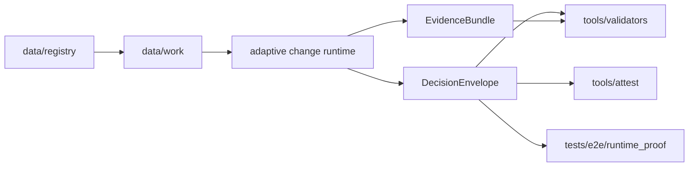

<!-- [KFM_META_BLOCK_V2]
doc_id: kfm://doc/NEEDS-VERIFICATION
title: Adaptive Vegetation Change Contract
type: standard
version: v1
status: draft
owners: @bartytime4life
created: 2026-04-12
updated: 2026-04-12
policy_label: public
related: [../../contracts/README.md, ../../schemas/README.md, ../../policy/README.md, ../../data/registry/README.md, ../../data/work/README.md, ../../data/receipts/README.md, ../../tools/validators/README.md, ../../tools/attest/README.md, ../../tests/README.md]
tags: [kfm, contracts, adaptive-change, ndvi, governance, evidence, runtime]
notes: [Evidence-bounded draft for a contract-first adaptive vegetation change surface. Exact mounted path, schema filenames, and runtime wiring remain NEEDS VERIFICATION.]
[/KFM_META_BLOCK_V2] -->

# Adaptive Vegetation Change Contract

Deterministic, evidence-first contract for **adaptive vegetation change assessment** in KFM, replacing fixed seasonal thresholds with **site-aware NDVI baseline modeling**, **QA-gated candidate generation**, and **finite governed outcomes**.

> [!NOTE]
> **Status:** draft  
> **Owners:** `@bartytime4life`  
>      
> **Quick jumps:** [Scope](#scope) · [Outcome Grammar](#finite-outcome-grammar) · [Decision Model](#decision-model) · [Evidence Requirements](#evidence-requirements) · [Validation Rules](#validation-rules) · [Schema Shape](#proposed-schema-shape) · [Tests](#test-obligations)

---

## Scope

This contract defines the **minimum machine-checkable runtime shape and decision logic** for adaptive vegetation change assessment over a declared spatial/temporal scope.

It governs:

- **adaptive baseline derivation** from historical NDVI distributions
- **candidate change assessment** against local variability
- **per-pixel or per-zone QA acceptance**
- **atmospheric contradiction gating**
- **sensor-consensus weighting**
- **finite governed outcomes**
- **evidence bundle requirements**
- **review-facing and machine-facing output fields**

It does **not** define:

- catalog publication rules for downstream datasets
- UI rendering or cartographic presentation
- biome-specific tuning policy beyond declared parameter carriage
- external source onboarding mechanics
- release promotion logic outside the runtime decision itself

---

## Repo Fit

**Path intent:** `contracts/adaptive_change/README.md`  
**Upstream authorities:** `contracts/README.md`, `schemas/README.md`, `policy/README.md`  
**Downstream consumers:** runtime services, validators, attest/proof helpers, e2e runtime-proof tests, reviewer surfaces



---

## Contract Intent

The system must answer a narrow question:

> **Given a declared spatial scope, temporal scope, and evidence inputs, is there sufficient governed evidence to emit a vegetation-change determination?**

This contract requires the answer to be one of the KFM finite outcomes and forbids unbounded best-effort ambiguity.

---

## Accepted Inputs

### Required conceptual inputs

| Input | Description | Required |
|---|---|---:|
| `scope` | Declared spatial unit, geometry ref, or zone identifier | yes |
| `as_of` | Runtime evaluation timestamp or valid-time anchor | yes |
| `baseline_window` | Historical window or profile used to derive percentile baseline | yes |
| `observation_window` | Current observation interval under review | yes |
| `ndvi_series` | Historical and current NDVI observations for scope | yes |
| `qa_series` | Pixel or scene QA acceptance data | yes |
| `threshold_profile` | Declared adaptive-threshold parameters | yes |
| `atmospheric_inputs` | Declared contradiction-gate inputs | yes |
| `sensor_inputs` | Declared sensor participation and agreement data | yes |

### Optional inputs

| Input | Description |
|---|---|
| `landcover_profile` | Optional tuning or interpretation context |
| `review_context` | Reviewer-facing notes or escalation hints |
| `previous_decision_ref` | Correction/rollback linkage when reevaluating prior emits |
| `policy_overrides` | Explicit, reviewable override references only |

---

## Exclusions

This contract is not:

- a hidden ML scoring lane
- a publication manifest
- a policy home for rights/sensitivity decisions
- a substitute for source-specific QA documentation
- a catch-all environmental event classifier

---

# Finite Outcome Grammar

The runtime must emit exactly one of the following:

| Outcome | Meaning |
|---|---|
| `ANSWER` | Sufficient evidence exists to emit a governed vegetation-change determination |
| `ABSTAIN` | Evidence exists, but is insufficient or contradicted for a trusted determination |
| `DENY` | Evaluation is not permitted or required policy/contract preconditions are not met |
| `ERROR` | Processing failed in a way that prevented normal governed evaluation |

> [!IMPORTANT]
> This contract is **fail-closed**.  
> Missing required evidence, undeclared parameterization, absent QA, or atmospheric contradiction without clear policy allowance must not silently degrade into an `ANSWER`.

---

## Outcome Constraints

### `ANSWER`
Allowed only when all are true:

- required inputs are present
- baseline is derivable or already declared
- QA acceptance passes minimum requirements
- adaptive threshold is computable from declared parameters
- candidate change exceeds threshold in the required direction/magnitude
- atmospheric contradiction gate does not veto the emit
- evidence bundle is complete enough for audit/replay

### `ABSTAIN`
Used when:

- atmospheric interference is present
- QA acceptance is insufficient but not policy-invalid
- signal is inconclusive relative to adaptive threshold
- sensor disagreement materially weakens confidence
- evidence is partially sufficient but not enough for trusted answer

### `DENY`
Used when:

- policy forbids evaluation in scope
- required rights/governance preconditions are not satisfied
- undeclared or disallowed source/parameter use is attempted
- request asks for behavior outside contract scope

### `ERROR`
Used when:

- computation fails unexpectedly
- upstream inputs are malformed beyond contract parsing
- required supporting objects cannot be resolved due to system failure

---

# Decision Model

## 1) Baseline derivation

For each evaluated unit (pixel, tile cell, or aggregated zone), the system derives a **historical NDVI baseline profile** from the declared baseline window.

Minimum baseline profile fields:

- `p10`
- `p50`
- `p90`

Derived spread:

```text
spread = p90 - p10
```

The baseline profile must be traceable to:

- declared source lineage
- declared baseline window
- declared harmonization assumptions
- declared QA inclusion rules

---

## 2) Adaptive threshold computation

The change threshold must be a deterministic function of local variability and a declared minimum absolute threshold.

Canonical example:

```text
threshold = max(abs_min, alpha * spread)
```

Where:

- `abs_min` is the minimum absolute NDVI-change threshold
- `alpha` is a declared sensitivity multiplier
- `spread` is the local baseline variability term

> [!NOTE]
> This README treats the exact threshold formula as **contract-declared and validator-checkable**, not helper-local convention.

---

## 3) Candidate change assessment

The runtime compares current NDVI conditions against expected conditions from the baseline profile.

Minimum conceptual fields:

```text
delta = observed_ndvi - expected_ndvi
```

Where `expected_ndvi` is generally anchored to the baseline median or equivalent declared expectation field.

A negative change candidate is typically:

```text
delta <= -threshold
```

A positive/anomalous greening contract could be added later, but this draft focuses on **loss/degradation style emits**.

---

## 4) QA gate

Pixels/zones must be accepted into candidate generation only if required QA rules pass.

Examples of contract-level QA checks:

- cloud / shadow / snow rejection
- minimum accepted-observation count
- maximum invalid-pixel fraction
- required harmonized-quality flags present
- no implicit inclusion of unknown-quality samples

If QA evidence is missing or below contract minimums, the system must **ABSTAIN or DENY**, not emit an answer.

---

## 5) Sensor-consensus weighting

Where multiple sensors or observation families are present, the runtime must carry a consensus summary.

Minimum conceptual behavior:

- single-sensor-only anomalies may reduce confidence
- multi-sensor agreement may increase confidence
- disagreement must be explicit in output
- agreement/disagreement cannot silently disappear in summary fields

This contract does **not** require a specific numeric weighting formula, but it does require:

- declared method name or profile id
- reproducible output
- evidence-visible participation summary

---

## 6) Atmospheric contradiction gate

A candidate emit must be reviewed against orthogonal atmospheric indicators.

Minimum conceptual inputs:

- aerosol / haze proxy
- smoke / plume or fire proxy
- forecast or modeled smoke/aerosol proxy

Canonical gate behavior:

```text
if contradiction_signals >= configured_minimum:
    veto or caution the emit
```

The gate outcome must be one of:

- `CLEAR`
- `CAUTION`
- `VETO`
- `UNKNOWN`

### Recommended fail-closed posture

| Gate status | Default contract effect |
|---|---|
| `CLEAR` | emit path may continue |
| `CAUTION` | emit may continue only if policy/profile allows |
| `VETO` | runtime must `ABSTAIN` unless explicit override exists |
| `UNKNOWN` | default to `ABSTAIN` if contradiction evidence is required |

---

# Required Runtime Objects

## DecisionEnvelope

The runtime’s primary governed output.

### Minimum required fields

| Field | Description |
|---|---|
| `type` | must equal `DecisionEnvelope` |
| `contract_id` | contract/version identifier |
| `outcome` | one of ANSWER / ABSTAIN / DENY / ERROR |
| `reason_code` | stable machine-readable outcome reason |
| `scope` | echoed scope under evaluation |
| `as_of` | echoed temporal anchor |
| `evidence_bundle_ref` | ref to supporting evidence bundle |
| `review_record_ref` | optional reviewer/escalation linkage |
| `freshness` | declared freshness or staleness summary |
| `obligations` | machine-readable obligations array |
| `audit_ref` | trace or receipt linkage |
| `correction_of` | optional prior decision ref |

### Additional `ANSWER` fields

| Field | Description |
|---|---|
| `decision.kind` | e.g. `vegetation_change_detected` |
| `decision.direction` | e.g. `decrease` |
| `decision.delta` | observed minus expected |
| `decision.threshold` | computed adaptive threshold |
| `decision.confidence` | declared confidence value or band |
| `decision.atmospheric_status` | CLEAR / CAUTION / VETO / UNKNOWN |
| `decision.sensor_consensus` | structured agreement summary |

---

## EvidenceBundle

The supporting object required to justify the decision.

### Minimum required contents

- baseline percentile snapshot
- threshold input parameters
- current observation summary
- QA acceptance summary
- atmospheric gate summary
- sensor participation/consensus summary
- provenance or source lineage refs
- receipt refs for the generating run

### Bundle expectations

The bundle must be:

- stable enough for review
- finite and inspectable
- linked to the emitting decision
- sufficient for replay or correction workflows

---

# Reason Codes

Illustrative starter vocabulary:

| Reason code | Typical outcome |
|---|---|
| `NDVI_DROP_ADAPTIVE_THRESHOLD` | ANSWER |
| `NO_MATERIAL_CHANGE` | ABSTAIN |
| `INSUFFICIENT_QA_ACCEPTANCE` | ABSTAIN |
| `ATMOSPHERIC_INTERFERENCE` | ABSTAIN |
| `SENSOR_DISAGREEMENT` | ABSTAIN |
| `POLICY_SCOPE_FORBIDDEN` | DENY |
| `UNDECLARED_PARAMETER_PROFILE` | DENY |
| `MALFORMED_INPUT_SERIES` | ERROR |
| `RUNTIME_COMPUTE_FAILURE` | ERROR |

> [!TIP]
> Final reason-code authority should remain in the policy/contracts vocabulary home rather than drifting into runtime helpers.

---

# Obligations

Illustrative obligations:

- `verify_with_secondary_source_if_high_impact`
- `retry_after_atmospheric_clearance`
- `attach_manual_review_before_promotion`
- `record_correction_link_if_superseding_prior_emit`
- `echo_threshold_profile_in_review_surface`

Obligations must be:

- explicit
- finite
- reviewable
- machine-readable

---

# Validation Rules

## Contract invariants

### Input invariants

- required fields must exist
- declared windows must be parseable
- threshold profile must be explicit
- QA profile must be explicit
- no undeclared source family may be used

### Decision invariants

- exactly one finite outcome must be present
- `ANSWER` requires `decision` payload and `evidence_bundle_ref`
- `ABSTAIN` requires a concrete abstention reason
- `DENY` requires a policy/governance reason
- `ERROR` must not masquerade as insufficiency or policy denial

### Evidence invariants

- bundle must include baseline + current observation + QA + atmospheric summary
- referenced objects must be internally consistent
- correction/supersession refs must not be cyclic
- receipt/proof separation must be preserved

---

## Fail-closed matrix

| Condition | Required behavior |
|---|---|
| Missing percentile baseline | `ABSTAIN` or `ERROR` |
| Missing QA evidence | `ABSTAIN` or `DENY` |
| Threshold profile absent | `DENY` |
| Atmospheric veto present | `ABSTAIN` |
| Sensor disagreement with weak evidence | `ABSTAIN` |
| Policy prohibits scope | `DENY` |
| Compute exception | `ERROR` |

---

# Proposed Schema Shape

> [!WARNING]
> Schema filenames and homes below are **PROPOSED** and need repo verification.

## `AdaptiveChangeRequest`

```json
{
  "type": "object",
  "required": [
    "contract_id",
    "scope",
    "as_of",
    "baseline_window",
    "observation_window",
    "threshold_profile"
  ],
  "properties": {
    "contract_id": { "type": "string" },
    "scope": {
      "type": "object",
      "required": ["scope_id"],
      "properties": {
        "scope_id": { "type": "string" },
        "geometry_ref": { "type": "string" }
      }
    },
    "as_of": { "type": "string", "format": "date-time" },
    "baseline_window": {
      "type": "object",
      "required": ["start", "end"],
      "properties": {
        "start": { "type": "string" },
        "end": { "type": "string" }
      }
    },
    "observation_window": {
      "type": "object",
      "required": ["start", "end"],
      "properties": {
        "start": { "type": "string" },
        "end": { "type": "string" }
      }
    },
    "threshold_profile": {
      "type": "object",
      "required": ["profile_id", "alpha", "abs_min"],
      "properties": {
        "profile_id": { "type": "string" },
        "alpha": { "type": "number" },
        "abs_min": { "type": "number" }
      }
    }
  }
}
```

## `AdaptiveChangeDecisionEnvelope`

```json
{
  "type": "object",
  "required": [
    "type",
    "contract_id",
    "outcome",
    "reason_code",
    "scope",
    "as_of",
    "evidence_bundle_ref",
    "audit_ref",
    "obligations"
  ],
  "properties": {
    "type": { "const": "DecisionEnvelope" },
    "contract_id": { "type": "string" },
    "outcome": {
      "type": "string",
      "enum": ["ANSWER", "ABSTAIN", "DENY", "ERROR"]
    },
    "reason_code": { "type": "string" },
    "scope": { "type": "object" },
    "as_of": { "type": "string", "format": "date-time" },
    "evidence_bundle_ref": { "type": "string" },
    "audit_ref": { "type": "string" },
    "obligations": {
      "type": "array",
      "items": { "type": "string" }
    },
    "decision": {
      "type": "object",
      "properties": {
        "kind": { "type": "string" },
        "direction": { "type": "string" },
        "delta": { "type": "number" },
        "threshold": { "type": "number" },
        "confidence": { "type": "number" },
        "atmospheric_status": { "type": "string" },
        "sensor_consensus": { "type": "object" }
      }
    }
  }
}
```

---

# Example Runtime Outputs

## Example `ANSWER`

```json
{
  "type": "DecisionEnvelope",
  "contract_id": "kfm.adaptive_change.v1",
  "outcome": "ANSWER",
  "reason_code": "NDVI_DROP_ADAPTIVE_THRESHOLD",
  "scope": {
    "scope_id": "zone:ks:ellis:sample-001",
    "geometry_ref": "kfm://geom/abc123"
  },
  "as_of": "2026-04-12T00:00:00Z",
  "evidence_bundle_ref": "kfm://bundle/adaptive-change/001",
  "audit_ref": "kfm://receipt/run/001",
  "obligations": [
    "verify_with_secondary_source_if_high_impact"
  ],
  "decision": {
    "kind": "vegetation_change_detected",
    "direction": "decrease",
    "delta": -0.23,
    "threshold": 0.11,
    "confidence": 0.82,
    "atmospheric_status": "CLEAR",
    "sensor_consensus": {
      "agreement": true,
      "participating_sensors": 2
    }
  }
}
```

## Example `ABSTAIN`

```json
{
  "type": "DecisionEnvelope",
  "contract_id": "kfm.adaptive_change.v1",
  "outcome": "ABSTAIN",
  "reason_code": "ATMOSPHERIC_INTERFERENCE",
  "scope": {
    "scope_id": "zone:ks:ellis:sample-001"
  },
  "as_of": "2026-04-12T00:00:00Z",
  "evidence_bundle_ref": "kfm://bundle/adaptive-change/002",
  "audit_ref": "kfm://receipt/run/002",
  "obligations": [
    "retry_after_atmospheric_clearance",
    "attach_manual_review_before_promotion"
  ]
}
```

---

# Test Obligations

This contract should be proven in `tests/e2e/runtime_proof/` and validator-specific tests.

## Minimum e2e cases

| Case | Expected outcome |
|---|---|
| strong NDVI decline, valid QA, no atmospheric veto | ANSWER |
| decline below threshold | ABSTAIN |
| missing QA profile | DENY or ABSTAIN |
| atmospheric contradiction veto | ABSTAIN |
| undeclared threshold profile | DENY |
| malformed NDVI input shape | ERROR |
| single-sensor anomaly with disagreement | ABSTAIN |

## Validator assertions

- threshold recomputation matches emitted threshold
- reason code is compatible with outcome
- bundle contains mandatory sections
- atmospheric veto blocks `ANSWER`
- no `ANSWER` without evidence ref
- receipts/proofs are not conflated

---

# Relationship to Neighbor Lanes

## `data/registry`
Owns source onboarding identity, publisher, cadence, rights, and default policy labels for input families.

## `data/work`
Owns staging transforms for baseline derivation, QA summaries, and candidate-signal preparation.

## `data/receipts`
Owns run memory, processing receipts, replay linkage, and correction readiness.

## `tools/validators`
Own deterministic contract and output validation, not policy authorship.

## `tools/attest`
Owns digest/proof-pack support for release-significant evidence artifacts, not runtime policy decisions.

## `policy`
Owns deny-by-default logic, reason/obligation authority, and any override grammar.

---

# Open Questions

> [!CAUTION]
> These are intentionally labeled, not silently assumed.

| Status | Question |
|---|---|
| `NEEDS VERIFICATION` | exact schema-home path for adaptive-change contracts |
| `NEEDS VERIFICATION` | whether contract should support both pixel and aggregated-zone request forms in v1 |
| `PROPOSED` | whether atmospheric gate should be contract-mandatory or profile-optional |
| `PROPOSED` | whether confidence should be numeric, banded, or both |
| `PROPOSED` | whether sensor-consensus weighting formula belongs in contract profile docs or separate standards profile |

---

# Implementation Starter

A deterministic helper surface might use a function shaped like:

```python
def adaptive_threshold(p10: float, p90: float, alpha: float, abs_min: float) -> float:
    spread = p90 - p10
    return max(abs_min, alpha * spread)
```

This helper is only acceptable when:

- profile parameters are explicit
- output is reproducible
- emitted threshold is validator-checkable
- helper logic does not become hidden authority

---

# Directory Starter

```text
contracts/
└── adaptive_change/
    ├── README.md
    ├── request.schema.json                 # PROPOSED
    ├── decision_envelope.schema.json       # PROPOSED
    ├── evidence_bundle.schema.json         # PROPOSED
    └── examples/
        ├── answer.min.json                 # PROPOSED
        └── abstain.atmospheric.json        # PROPOSED
```

---

# Appendix A — Minimal Reviewer Checklist

- Is the threshold profile explicitly declared?
- Is the baseline window explicit and reviewable?
- Did QA acceptance meet the contract minimum?
- Was an atmospheric contradiction check present?
- Does the reason code match the outcome?
- Is the evidence bundle sufficient for replay/correction?
- Are obligations concrete and finite?

---

# Appendix B — Contract Summary

The adaptive vegetation change contract exists so KFM can say:

- **what changed**
- **why the system believes it changed**
- **why the system refused to answer when trust was insufficient**
- **what evidence supports the decision**
- **what obligations follow from that decision**

That is the difference between a threshold and a governed runtime determination.