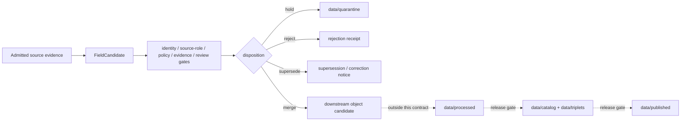

<!-- [KFM_META_BLOCK_V2]
doc_id: kfm://contract/agriculture/field-candidate
title: contracts/agriculture/FieldCandidate.md — FieldCandidate Contract
type: contract
version: v0.2
status: draft
owners: OWNER_TBD — Agriculture steward · Contract steward · Schema steward · Policy steward · Data steward · Docs steward
created: 2026-06-20
updated: 2026-06-20
policy_label: public; contract; agriculture; candidate; sensitive-field-level
related:
  - ../../docs/domains/agriculture/IDENTITY_MODEL.md
  - ../../docs/domains/agriculture/OBJECTS.md
  - ../../docs/domains/agriculture/OBJECT_FAMILIES.md
  - ../../docs/domains/agriculture/API_CONTRACTS.md
  - ../../docs/doctrine/directory-rules.md
  - ../../schemas/contracts/v1/domains/agriculture/
  - ../../policy/domains/agriculture/
  - ../../policy/sensitivity/agriculture/
  - ../../data/registry/sources/
  - ../../data/raw/
  - ../../data/quarantine/
  - ../../data/proofs/
  - ../../release/
tags: [kfm, contracts, agriculture, field-candidate, object-family, candidate, source-role, evidence, sensitivity, quarantine, promotion-gates, governance]
notes:
  - "Expanded from scaffold content into a draft semantic contract for FieldCandidate."
  - "Path posture is CONFLICTED / NEEDS VERIFICATION: current requested file is contracts/agriculture/FieldCandidate.md, while agriculture register/reference docs propose contracts/domains/agriculture/field_candidate.md. This file does not settle the canonical home."
  - "Machine-checkable shape belongs in schemas/contracts/v1/domains/agriculture/field_candidate.schema.json or another accepted schema home, not in this Markdown contract."
  - "Policy belongs in policy/domains/agriculture/ and policy/sensitivity/agriculture/, not in this contract."
  - "FieldCandidate is a candidate-disposition object, not a survey-confirmed field and not public-release material by default."
[/KFM_META_BLOCK_V2] -->

<a id="top"></a>

# FieldCandidate Contract

> Semantic contract for Agriculture `FieldCandidate` objects: candidate field polygons proposed for review, never survey-confirmed fields, and never public-release features until policy, evidence, and review gates close.

<p>
  
  
  
  
  
  
</p>

`contracts/agriculture/FieldCandidate.md`

## Quick jumps

[Status](#status) · [Scope](#scope) · [Path posture](#path-posture) · [Contract meaning](#contract-meaning) · [Accepted inputs](#accepted-inputs) · [Exclusions](#exclusions) · [Semantic fields](#semantic-fields) · [Identity contract](#identity-contract) · [Source-role contract](#source-role-contract) · [Sensitivity and release posture](#sensitivity-and-release-posture) · [Lifecycle boundary](#lifecycle-boundary) · [Validation](#validation) · [Evidence basis](#evidence-basis) · [Rollback](#rollback) · [Definition of done](#definition-of-done)

---

## Status

> [!IMPORTANT]
> **Status:** `draft` / semantic contract  
> **Owner:** `OWNER_TBD`  
> **Path:** `contracts/agriculture/FieldCandidate.md`  
> **Path posture:** `CONFLICTED` / `NEEDS VERIFICATION` against newer proposed home `contracts/domains/agriculture/field_candidate.md`  
> **Truth posture:** `CONFIRMED` current scaffold path and file update; FieldCandidate object-family meaning is supported by Agriculture domain docs; machine schema, validators, fixtures, CI, policy bundles, SourceDescriptor records, and release behavior remain `NEEDS VERIFICATION`.

---

## Scope

This contract defines the **semantic meaning** of a `FieldCandidate` in the Agriculture domain.

A `FieldCandidate` is a candidate field polygon or footprint proposed for review. It may be derived from satellite classification, boundary inference, a station footprint proxy, or another admitted evidence source. It is not an operator-confirmed field, not a parcel ownership claim, not a field survey record, and not public-release material by default.

This Markdown contract states object meaning, identity-bearing concepts, source-role constraints, sensitivity posture, lifecycle boundaries, and validation expectations. It does not define the machine schema, policy rules, release decisions, API DTO, UI behavior, or canonical storage path.

---

## Path posture

The requested and currently existing path is:

```text
contracts/agriculture/FieldCandidate.md
```

Newer Agriculture domain docs propose the semantic contract home as:

```text
contracts/domains/agriculture/field_candidate.md
```

This file does **not** resolve that conflict. Until an ADR, migration note, or Directory Rules update settles the canonical contract home, treat this file as a compatibility/lineage contract at the requested path.

| Path | Status | Meaning |
|---|---|---|
| `contracts/agriculture/FieldCandidate.md` | `CONFIRMED` current file | Existing/requested scaffold path now expanded. |
| `contracts/domains/agriculture/field_candidate.md` | `PROPOSED` in Agriculture docs | Likely canonical domain-contract home, but not created by this edit. |
| `schemas/contracts/v1/domains/agriculture/field_candidate.schema.json` | `PROPOSED` | Machine schema home; not proven present here. |

---

## Contract meaning

A `FieldCandidate` is a **candidate-disposition agriculture object** used to hold a proposed field-level geometry or footprint while KFM determines whether it can be merged, generalized, redacted, quarantined, denied, or promoted into another object family.

It exists to prevent three common trust failures:

1. treating a modeled or inferred polygon as an observed field;
2. treating a candidate as a published feature;
3. joining field-level candidates to operator, parcel, or private farm-operation context without policy closure.

A `FieldCandidate` may later support a `CropObservation`, `CropRotation`, `YieldObservation`, `ConservationPractice`, or aggregate publication, but it does not become any of those by file movement, inference, or display.

---

## Accepted inputs

| Input | Required posture |
|---|---|
| Candidate geometry | Must include geometry, source geometry lineage, CRS, precision, and support geometry where available. |
| Source reference | Must resolve to a SourceDescriptor or be held/quarantined until a SourceDescriptor exists. |
| Evidence reference | Must resolve to EvidenceRef/EvidenceBundle before consequential promotion or public use. |
| Source role | Must preserve source role from admission; modeled, observed, administrative, candidate, or mixed posture cannot be silently rewritten. |
| Candidate confidence | Must state score, class, method, or `UNKNOWN`; confidence is not proof. |
| Temporal fields | Must preserve observed/valid/retrieval/admission/correction times where material. |
| Sensitivity state | Must default to field-level review and escalate when joined to operator/private-parcel-adjacent context. |
| Review disposition | Must record whether candidate is pending, merged, rejected, superseded, quarantined, generalized, or redacted. |

---

## Exclusions

| `FieldCandidate` is not | Correct owner / surface |
|---|---|
| Machine schema | `schemas/contracts/v1/domains/agriculture/field_candidate.schema.json` or accepted schema home. |
| Policy bundle | `policy/domains/agriculture/`, `policy/sensitivity/agriculture/`. |
| SourceDescriptor | `data/registry/sources/`. |
| Survey-confirmed field | Requires separate evidence and review closure. |
| Parcel/title/operator record | People/Land or another governed source lane. |
| Public feature | Requires release gate and appropriate generalization/redaction. |
| Crop observation | `CropObservation` contract/schema after merge or derivation. |
| Aggregate publication | Requires `AggregationReceipt` and release approval. |
| Release decision | `release/` and governed release records. |

---

## Semantic fields

These fields describe the contract surface. They are not a JSON Schema.

| Field | Requirement | Notes |
|---|---|---|
| `candidate_id` | Required | Deterministic or registry-issued candidate identity. |
| `source_id` | Required | SourceDescriptor anchor or unresolved/quarantined placeholder. |
| `source_role` | Required | Must preserve admission role. |
| `candidate_disposition` | Required | `pending`, `merged`, `rejected`, `superseded`, `quarantined`, `generalized`, `redacted`, or schema-approved equivalent. |
| `geometry` | Required when spatial candidate exists | Polygon/footprint geometry; exact release may be denied or generalized. |
| `support_geometry` | Recommended | County, HUC, grid cell, source tile, or other non-sensitive support geometry. |
| `inferred_crop_code` | Optional | Source-derived crop/class code; not authoritative by itself. |
| `confidence` | Required or `UNKNOWN` | Must include method/scale if numeric. |
| `observed_time` | Required where material | Time of underlying observation, if any. |
| `valid_time` | Required where material | Crop year, growing season, or time interval. |
| `retrieval_time` | Required for source intake | When KFM retrieved source material. |
| `admission_time` | Required | Candidate identity uses admission/disposition timing. |
| `evidence_ref` | Required for promotion | Must resolve before consequential use. |
| `spec_hash` | Required once canonicalization exists | PROPOSED deterministic digest over meaning-bearing fields. |
| `policy_label` | Required before release | Public exact field-level release should fail closed unless policy allows. |
| `review_state` | Required | Steward review state and reviewer receipt references. |
| `rollback_ref` | Required after merge/promotion | Pointer to pre-merge candidate state and receipt trail. |

---

## Identity contract

`FieldCandidate` identity is evidence- and disposition-sensitive.

The Agriculture identity model gives `FieldCandidate` this proposed basis:

```text
source_id + candidate role + admission time + normalized digest
```

For this contract, the phrase `candidate role` means the object is in a **candidate-disposition lane**. The separate `source_role` field still preserves the role of the underlying source evidence, such as modeled or observed.

Identity must rotate or fork when any of the following change materially:

- source descriptor;
- source role;
- geometry or geometry precision;
- support geometry;
- crop code/classification;
- confidence method or value;
- temporal scope;
- evidence bundle;
- sensitivity posture;
- candidate disposition;
- normalized meaning-bearing digest.

---

## Source-role contract

A `FieldCandidate` must preserve the source role of the evidence that created it.

| Source-role posture | Allowed? | Contract rule |
|---|---:|---|
| `model` | Yes | Common for classified imagery or boundary inference. Must not be presented as observation or authority. |
| `observed` | Yes | Allowed where evidence is a direct or first-hand footprint/proxy. Must preserve scope and uncertainty. |
| `administrative` | Conditional | Allowed only where source is an administrative record; cannot become field truth without corroboration. |
| `aggregate` | Usually no | Aggregates must not be joined to a single field candidate except as contextual support. |
| `synthetic` | Conditional | Must carry representation/synthetic boundary and cannot assert field reality. |
| `candidate` | Yes as disposition | Use to describe the candidate state, not to overwrite underlying source role. |

> [!WARNING]
> A `FieldCandidate` is not a survey-confirmed field. Treating it as one is a source-role collapse and must be denied at promotion.

---

## Sensitivity and release posture

`FieldCandidate` is field-level and review-sensitive by default.

Minimum posture:

- baseline sensitivity: `T1` or equivalent field-level review tier;
- escalate to `T3+` or most-restrictive policy state when joined to operator identity, parcel/title/person context, private farm-operation details, or other privacy-sensitive context;
- public exact exposure should fail closed unless a policy decision, redaction/generalization receipt, evidence closure, review state, and release decision allow it;
- aggregate outputs must use aggregation receipts and must not be reverse-joined to a single candidate.

A `FieldCandidate` may be useful internally for validation, deduplication, review, and aggregation. That does not make it public.

---

## Lifecycle boundary



This contract defines the candidate object. It does not perform promotion, release, publication, or public display.

---

## Validation

Before relying on this contract, verify:

- canonical contract path is settled or compatibility path is documented;
- matching schema exists and validates in the accepted schema home;
- SourceDescriptor references resolve;
- EvidenceRef resolves before promotion or public use;
- source role cannot be silently rewritten;
- candidate disposition is required and auditable;
- geometry precision and support geometry are validated;
- field-level sensitivity defaults fail closed;
- operator/private-parcel-adjacent joins are denied or routed through review/redaction/generalization;
- release paths require policy decision, review state, receipts, and rollback target;
- public clients do not read raw, work, quarantine, or candidate stores directly.

---

## Evidence basis

| Source | Status | Supports | Limits |
|---|---|---|---|
| Existing `contracts/agriculture/FieldCandidate.md` scaffold | `CONFIRMED` | Target path existed, referenced `docs/domains/agriculture/IDENTITY_MODEL.md`, and warned that schema/policy/release authority live elsewhere. | Scaffold did not define contract semantics. |
| `docs/domains/agriculture/IDENTITY_MODEL.md` | `CONFIRMED` | Agriculture identity basis, FieldCandidate as entity/candidate-disposition, source-role as identity attribute, candidate publication denial. | Does not prove schema or validators exist. |
| `docs/domains/agriculture/OBJECT_FAMILIES.md` | `CONFIRMED` | `OF-AG-02 · FieldCandidate`, proposed contract/schema/policy/test/fixture paths, source-role set, sensitivity, and promotion-gate concerns. | Proposed path conflicts with current file path. |
| `docs/domains/agriculture/OBJECTS.md` | `CONFIRMED` | FieldCandidate purpose, proposed key fields, sensitivity default, operator-join denial, and warning against treating it as survey-confirmed. | Key fields are illustrative pending contract/schema. |
| `docs/domains/agriculture/API_CONTRACTS.md` | `CONFIRMED` | Agriculture public surfaces are aggregate/public-safe by default; field-level/operator-private material fails closed. | API route names and DTOs remain proposed/verification-bound. |

---

## Rollback

Rollback is required if this contract is used to justify public exact field-level exposure, operator/private-parcel-adjacent joins without review, schema authority outside the accepted schema home, or promotion without evidence/policy/release closure.

Rollback target: prior scaffold content SHA `ac6ed98a7d675a375a72ac0f717f143eb774b9a0`.

---

## Definition of done

- [ ] Canonical path conflict is resolved by ADR or migration note.
- [ ] Owners are confirmed and `OWNER_TBD` is replaced.
- [ ] Matching schema exists in accepted schema home and validates examples.
- [ ] Policy bundle defines sensitivity, denial, redaction, generalization, and review outcomes.
- [ ] SourceDescriptor and EvidenceRef requirements are testable.
- [ ] Candidate disposition is required by schema and receipts.
- [ ] Source-role mismatch tests deny promotion from model/candidate to authority/confirmed truth.
- [ ] Operator/private-parcel-adjacent joins fail closed by default.
- [ ] Release tests prove candidates cannot publish without policy, review, evidence, receipts, and rollback target.
- [ ] Public API/UI surfaces show only released, policy-safe, evidence-backed representations.

---

## Status summary

`FieldCandidate` is a governed Agriculture candidate object. It preserves proposed field-level evidence while review, policy, identity, and evidence gates decide whether the candidate is rejected, held, generalized, redacted, merged, or promoted into another governed object. It is not a survey-confirmed field, not an operator/parcel record, not a public feature, not a schema, not a policy bundle, not a release decision, and not publication authority.

<p align="right"><a href="#top">Back to top</a></p>
