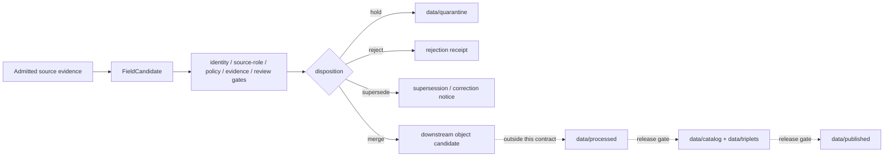

<!-- [KFM_META_BLOCK_V2]
doc_id: kfm://contract/agriculture/field-candidate
title: contracts/agriculture/FieldCandidate.md — FieldCandidate Contract
type: contract
version: v0.3
status: draft
owners: OWNER_TBD — Agriculture steward · Contract steward · Schema steward · Policy steward · Data steward · Docs steward
created: 2026-06-20
updated: 2026-09-07
policy_label: public; contract; agriculture; candidate; sensitive-field-level
related:
  - ../../docs/domains/agriculture/IDENTITY_MODEL.md
  - ../../docs/domains/agriculture/OBJECTS.md
  - ../../docs/domains/agriculture/OBJECT_FAMILIES.md
  - ../../docs/domains/agriculture/API_CONTRACTS.md
  - ../../docs/doctrine/directory-rules.md
  - ../../schemas/contracts/v1/domains/agriculture/
  - ../../policy/domains/agriculture/
  - ../../policy/sensitivity/agriculture/
  - ../../data/registry/sources/
  - ../../data/raw/
  - ../../data/quarantine/
  - ../../data/proofs/
  - ../../release/
tags: [kfm, contracts, agriculture, field-candidate, object-family, candidate, source-role, evidence, sensitivity, quarantine, promotion-gates, governance]
notes:
  - "Updated against current main@05293236fd4c9538d4b9dc8afb16fa9ac847c132; this remains a draft semantic contract, not a machine schema or implementation proof."
  - "contracts/agriculture/ is a confirmed live compatibility path. contracts/domains/agriculture/ is a confirmed semantic-contract lane, but the exact FieldCandidate successor and field_candidate schema are absent from current main; migration remains unresolved."
  - "Current Agriculture references use inconsistent source-role labels (model/observation and modeled/observed plus related proposed labels); this contract preserves the conflict and does not select a canonical enum."
  - "Machine-checkable shape belongs in schemas/contracts/v1/domains/agriculture/field_candidate.schema.json or another accepted schema home, not in this Markdown contract."
  - "Policy belongs in policy/domains/agriculture/ and policy/sensitivity/agriculture/, not in this contract."
  - "FieldCandidate is a candidate-disposition object, not a survey-confirmed field and not public-release material by default."
[/KFM_META_BLOCK_V2] -->

<a id="top"></a>

# FieldCandidate Contract

> Semantic contract for Agriculture `FieldCandidate` objects: candidate field polygons proposed for review, never survey-confirmed fields, and never public-release features until policy, evidence, and review gates close.

<p>
  
  
  
  
  
  
</p>

`contracts/agriculture/FieldCandidate.md`

## Quick jumps

[Status](#status) · [Scope](#scope) · [Path posture](#path-posture) · [Contract meaning](#contract-meaning) · [Accepted inputs](#accepted-inputs) · [Exclusions](#exclusions) · [Semantic fields](#semantic-fields) · [Identity contract](#identity-contract) · [Source-role contract](#source-role-contract) · [Sensitivity and release posture](#sensitivity-and-release-posture) · [Lifecycle boundary](#lifecycle-boundary) · [Validation](#validation) · [Evidence basis](#evidence-basis) · [Rollback](#rollback) · [Definition of done](#definition-of-done)

---

## Status

> [!IMPORTANT]
> **Status:** `draft` / semantic contract / compatibility path  
> **Owner:** `OWNER_TBD`  
> **Path:** `contracts/agriculture/FieldCandidate.md`  
> **Path posture:** `CONFIRMED` live compatibility path; `contracts/domains/agriculture/` semantic-contract lane confirmed; exact FieldCandidate successor remains `PROPOSED` and absent at current `main`  
> **Truth posture:** `CONFIRMED` current target and bounded companion readback at `main@05293236fd4c9538d4b9dc8afb16fa9ac847c132`; object meaning and safety boundaries are supported by current Agriculture docs; exact schema, validator, fixture, policy evaluator, runtime, release, and publication behavior remain `NEEDS VERIFICATION`.

---

## Scope

This contract defines the **semantic meaning** of a `FieldCandidate` in the Agriculture domain.

A `FieldCandidate` is a candidate field polygon or footprint proposed for review. It may be derived from satellite classification, boundary inference, a station footprint proxy, or another admitted evidence source. It is not an operator-confirmed field, not a parcel ownership claim, not a field survey record, and not public-release material by default.

This Markdown contract states object meaning, identity-bearing concepts, source-role constraints, sensitivity posture, lifecycle boundaries, and validation expectations. It does not define the machine schema, policy rules, release decisions, API DTO, UI behavior, or canonical storage path.

---

## Path posture

The requested and currently existing path is:

```text
contracts/agriculture/FieldCandidate.md
```

Current repository evidence confirms a two-part posture:

- `contracts/agriculture/` is a live compatibility path that preserves this existing contract and its inbound links.
- `contracts/domains/agriculture/` is the confirmed Agriculture semantic-contract lane, but its README still records `FieldCandidate` as `NEEDS VERIFICATION`.

Agriculture reference documents propose the exact successor `contracts/domains/agriculture/field_candidate.md` and the paired schema `schemas/contracts/v1/domains/agriculture/field_candidate.schema.json`. Direct current-main reads at `main@05293236fd4c9538d4b9dc8afb16fa9ac847c132` returned `404` for both paths. This edit does not create either path or settle the migration.

Until an accepted ADR, migration note, or equivalent Directory Rules decision settles the canonical writer, treat this file as the compatibility/lineage contract at the requested path. Do not expand the compatibility directory into a second Agriculture contract lane.

---

## Contract meaning

A `FieldCandidate` is a **candidate-disposition agriculture object** used to hold a proposed field-level geometry or footprint while KFM determines whether it can be merged, generalized, redacted, quarantined, denied, or promoted into another object family.

It exists to prevent three common trust failures:

1. treating a modeled or inferred polygon as an observed field;
2. treating a candidate as a published feature;
3. joining field-level candidates to operator, parcel, or private farm-operation context without policy closure.

A `FieldCandidate` may later support a `CropObservation`, `CropRotation`, `YieldObservation`, `ConservationPractice`, or aggregate publication, but it does not become any of those by file movement, inference, or display.

---

## Accepted inputs

| Input | Required posture |
|---|---|
| Candidate geometry | Must include geometry, source geometry lineage, CRS, precision, and support geometry where available. |
| Source reference | Must resolve to a SourceDescriptor or be held/quarantined until a SourceDescriptor exists. |
| Evidence references | Must resolve to EvidenceRef/EvidenceBundle before consequential promotion or public use. |
| Source role | Must preserve the exact admitted value and any raw/source label; no silent `model` → `modeled` or `observation` → `observed` rewrite is allowed while the vocabulary remains unsettled. |
| Candidate confidence | Must state score, class, method, or `UNKNOWN`; confidence is not proof. |
| Temporal fields | Must preserve source, observed, valid, retrieval, admission, release, and correction times where material, plus crop year or growing season when those are the claim's temporal anchors. |
| Sensitivity state | Must default to field-level review (`T1` in current Agriculture references) and escalate to the most restrictive posture when joined to operator, parcel, person, or private farm-operation context. |
| Candidate/review disposition | Must distinguish candidate role state (`pending`, `merged`, `rejected`, `quarantined` in the current identity reference) from supersession, generalization, redaction, or release-review outcomes. |

---

## Exclusions

| `FieldCandidate` is not | Correct owner / surface |
|---|---|
| Machine schema | `schemas/contracts/v1/domains/agriculture/field_candidate.schema.json` or accepted schema home. |
| Policy bundle | `policy/domains/agriculture/`, `policy/sensitivity/agriculture/`. |
| SourceDescriptor | `data/registry/sources/`. |
| Survey-confirmed field | Requires separate evidence and review closure. |
| Parcel/title/operator record | People/Land or another governed source lane. |
| Public feature | Requires release gate and appropriate generalization/redaction. |
| Crop observation | `CropObservation` contract/schema after merge or derivation. |
| Aggregate publication | Requires `AggregationReceipt` and release approval. |
| Release decision | `release/` and governed release records. |

---

## Semantic fields

These fields describe the contract surface. They are not a JSON Schema.

| Field | Requirement | Notes |
|---|---|---|
| `candidate_id` | Required | Deterministic or registry-issued candidate identity. |
| `source_id` | Required | SourceDescriptor anchor or unresolved/quarantined placeholder. |
| `source_role` | Required | Preserve the admitted source role; see the unresolved vocabulary matrix below. |
| `candidate_disposition` | Required | Candidate role state such as `pending`, `merged`, `rejected`, or `quarantined`; exact enum remains schema-bound. |
| `geometry` | Required when spatial candidate exists | Polygon/footprint geometry; exact release may be denied or generalized. |
| `support_geometry` | Recommended | County, HUC, grid cell, source tile, or other non-sensitive support geometry. |
| `inferred_crop_code` | Optional | Source-derived crop/class code; not authoritative by itself. |
| `confidence` | Required or `UNKNOWN` | Must include method/scale if numeric. |
| `source_time` | Required where material | Time assigned by the source, distinct from observation and retrieval time. |
| `observed_time` | Required where material | Time of the underlying observation or proxy. |
| `valid_time` | Required where material | Crop year, growing season, or bounded interval. |
| `retrieval_time` | Required for source intake | When KFM retrieved source material. |
| `admission_time` | Required | Candidate identity uses admission/disposition timing. |
| `release_time` | Required only for a released representation | Must remain distinct from observation/valid time. |
| `correction_time` | Required for a correction or supersession | Binds the corrected representation to its correction record. |
| `evidence_refs` | Required for consequential use | Compatibility singular `evidence_ref` may remain only until the accepted schema settles the cardinality. |
| `spec_hash` | Required once canonicalization is adopted | The algorithm and normalization rules remain `NEEDS VERIFICATION`; this field is not proof by itself. |
| `policy_label` | Required before release | Public exact field-level release should fail closed unless policy allows. |
| `review_state` | Required for a reviewed transition | Must link the applicable ReviewRecord/PolicyDecision where present. |
| `rollback_ref` | Required after merge or release-significant promotion | Points to the governed rollback target/receipt; exact field name is schema-bound. |

---

## Identity contract

`FieldCandidate` identity is evidence- and disposition-sensitive.

The Agriculture identity model gives `FieldCandidate` this proposed basis:

```text
source_id + candidate role + admission time + normalized digest
```

For this contract, the phrase `candidate role` means the object is in a **candidate-disposition lane**. The separate `source_role` field still preserves the role of the underlying source evidence, such as model/modeled or observation/observed, without silently choosing between the current labels.

The separate-versus-shared identity-space question remains open in the current Agriculture identity model. This contract therefore preserves the candidate-disposition distinction without claiming that a candidate shares the same identity namespace as a canonical Agriculture object.

Identity must rotate or fork when any of the following change materially:

- source descriptor;
- source role;
- geometry or geometry precision;
- support geometry;
- crop code/classification;
- confidence method or value;
- temporal scope;
- evidence bundle;
- sensitivity posture;
- candidate disposition;
- normalized meaning-bearing digest.

---

## Source-role contract

A `FieldCandidate` must preserve the source role of the evidence that created it. Source role is not the same thing as candidate disposition.

Current repository references expose an unresolved vocabulary conflict:

| Current label(s) | Posture | Contract rule |
|---|---|---|
| `model` / `modeled` | Conditional | Common for classified imagery or boundary inference. Preserve the label admitted by the source and do not present it as an observation or authority. |
| `observation` / `observed` | Conditional | May describe a direct or proxy observation. Preserve scope, uncertainty, and the raw/source label. |
| `regulatory` | Conditional | Proposed in the Agriculture identity/API references; not proven as a FieldCandidate source role in a mounted schema. |
| `administrative` | Conditional | Allowed only where the source is an administrative record; it cannot become field truth without corroboration. |
| `aggregate` | Usually no | An aggregate may provide contextual support but must not be joined to a single field candidate as if it were field-level evidence. |
| `synthetic` | Conditional | Must carry its synthetic basis and reality boundary; it cannot assert field reality. |
| `candidate` | Not an underlying source role | Use for candidate disposition or `role_candidate_disposition`; do not overwrite the admitted source role. |

The current `OBJECTS.md` / `OBJECT_FAMILIES.md` references use `model` and `observation`, while `IDENTITY_MODEL.md` / `API_CONTRACTS.md` propose `modeled`, `observed`, `regulatory`, `aggregate`, `administrative`, `candidate`, and `synthetic`. No current FieldCandidate schema or accepted ADR settles aliases or the canonical enum.

Until that decision exists:

- retain the raw/admitted source-role value;
- if an adapter emits a normalized alias, retain both values and the explicit mapping/receipt;
- reject or hold records whose source-role mapping would change evidentiary meaning; and
- never use a role mapping to upgrade `model`/`modeled` or `candidate` into `authority`/confirmed truth.

> [!WARNING]
> A `FieldCandidate` is not a survey-confirmed field. Treating it as one is a source-role collapse and must be denied at promotion.

## Sensitivity and release posture

`FieldCandidate` is field-level and review-sensitive by default.

Current Agriculture references converge on this minimum posture:

- baseline sensitivity: `T1` or the accepted equivalent field-level review tier;
- escalate to `T3+` or the most-restrictive policy state when joined to operator identity, parcel/title/person context, private farm-operation details, or another privacy-sensitive context;
- public exact exposure of field geometry should fail closed unless policy, evidence, review, release, and the required transform receipts all close;
- current pipeline/API references describe generalized polygon or aggregate/public-safe representations, but no such FieldCandidate release surface is proven in current main; and
- aggregate outputs must use an `AggregationReceipt` where applicable and must not be reverse-joined to a single candidate.

A `FieldCandidate` may be useful internally for validation, deduplication, review, and aggregation. That does not make it public.

## Lifecycle boundary


```mermaid
flowchart LR
  SRC[Admitted source evidence] --> FC[FieldCandidate]
  FC --> GATE[identity / source-role / policy / evidence / review gates]
  GATE --> DECIDE{disposition}
  DECIDE -->|hold| QUAR[data/quarantine]
  DECIDE -->|reject| REJ[rejection receipt]
  DECIDE -->|supersede| SUP[supersession / correction notice]
  DECIDE -->|merge| MERGE[downstream object candidate]
  MERGE -. outside this contract .-> PROC[data/processed]
  PROC -. release gate .-> CAT[data/catalog + data/triplets]
  CAT -. release gate .-> PUB[data/published]
```

This contract defines the candidate object. It does not perform promotion, release, publication, or public display.

---

## Validation

Before relying on this contract, verify:

- the compatibility relationship and canonical writer are settled by an accepted ADR or migration note;
- the exact successor contract and matching schema are present at the accepted paths; current main directly returned `404` for both proposed FieldCandidate paths;
- SourceDescriptor references resolve;
- EvidenceRef resolves before promotion or public use;
- source-role vocabulary aliases and normalization rules are settled without changing evidentiary meaning;
- candidate disposition is required and auditable;
- geometry precision, support geometry, and temporal facets are validated;
- field-level sensitivity defaults fail closed;
- operator/private-parcel-adjacent joins are denied or routed through review/redaction/generalization;
- release paths require policy decision, review state, receipts, and rollback target;
- public clients do not read raw, work, quarantine, or candidate stores directly; and
- current contract, schema, policy, validator, fixture, API, and release claims are backed by their own current evidence rather than by reference-document path lists.

---

## Evidence basis

| Source | Status | Supports | Limits |
|---|---|---|---|
| Current target readback at `main@05293236fd4c9538d4b9dc8afb16fa9ac847c132` | `CONFIRMED` | `contracts/agriculture/FieldCandidate.md` exists as the compatibility contract; current blob readback was `1cd54a8e425497edb77501815743313bfd0adfd4`. | A Markdown contract does not prove schema, policy, validator, runtime, release, or publication behavior. |
| `contracts/agriculture/README.md` at the same main pin | `CONFIRMED` | Compatibility-lane status, one-writer boundary, and the absence of a verified FieldCandidate successor/schema. | The README does not complete migration or machine enforcement. |
| `contracts/domains/agriculture/README.md` at the same main pin | `CONFIRMED` | `contracts/domains/agriculture/` is the Agriculture semantic-contract lane and still lists `FieldCandidate` as `NEEDS VERIFICATION`. | Lane presence does not prove the exact FieldCandidate contract exists there. |
| `docs/domains/agriculture/IDENTITY_MODEL.md` | `CONFIRMED current draft` | Candidate-disposition identity basis, temporal-role separation, source-role anti-collapse, EvidenceRef → EvidenceBundle resolution, and open identity/spec-hash questions. | It explicitly leaves the separate/shared identity space, source-role enum, and canonical spec-hash normalization unresolved. |
| `docs/domains/agriculture/OBJECT_FAMILIES.md` | `CONFIRMED current draft register` | `OF-AG-02`, proposed successor/schema paths, T1/T3+ sensitivity posture, model/observation labels, and source-role mismatch gate. | Placement and implementation rows remain proposed; its vocabulary differs from `IDENTITY_MODEL.md`. |
| `docs/domains/agriculture/OBJECTS.md` | `CONFIRMED current reference` | FieldCandidate purpose, illustrative key fields, T1 baseline, T3 operator escalation, and denial of survey-confirmed/authority collapse. | Key fields are illustrative and do not replace a schema. |
| `docs/domains/agriculture/PIPELINE.md` and `API_CONTRACTS.md` | `CONFIRMED current drafts` | Proposed generalized/public-safe handling, governed API boundary, finite outcomes, and no direct raw/work/quarantine/candidate access. | Route, DTO, release, and runtime behavior remain proposed or unverified. |
| `docs/doctrine/directory-rules.md` | `CONFIRMED repository file; doctrine status remains separately governed` | Responsibility-first placement and separation of contracts, schemas, policy, data, proofs, release, API, and UI. | The fetched document is a proposed successor edition; it does not by itself settle this Agriculture migration. |
| Drive: `KFM_Agriculture_Domain_Implementation_Dossier_REVISED_2026-04-21.pdf` | `PROPOSED lineage` | Preservation-aware lifecycle, source-role, evidence, sensitivity, and rollback design lineage. | The dossier explicitly says repo paths are proposed because no KFM checkout was mounted; it cannot override current GitHub evidence. |

---

## Rollback

Rollback is required if this contract is used to justify public exact field-level exposure, operator/private-parcel-adjacent joins without review, schema authority outside the accepted schema home, or promotion without evidence/policy/release closure.

Rollback target: prior scaffold content SHA `ac6ed98a7d675a375a72ac0f717f143eb774b9a0`.

---

## Definition of done

- [ ] Canonical writer/path relationship is resolved by ADR or migration note.
- [ ] Owners are confirmed and `OWNER_TBD` is replaced.
- [ ] Matching schema exists in the accepted schema home and validates examples.
- [ ] The source-role vocabulary conflict (`model`/`observation` versus `modeled`/`observed` and related labels) is resolved or explicitly represented as a compatibility alias with a mapping receipt.
- [ ] The candidate identity-space decision and `spec_hash` normalization are accepted and testable.
- [ ] Policy bundle defines sensitivity, denial, redaction, generalization, and review outcomes.
- [ ] SourceDescriptor and EvidenceRef requirements are testable.
- [ ] Candidate disposition is required by schema and receipts.
- [ ] Source-role mismatch tests deny promotion from model/candidate to authority/confirmed truth.
- [ ] Operator/private-parcel-adjacent joins fail closed by default.
- [ ] Release tests prove candidates cannot publish without policy, review, evidence, receipts, and rollback target.
- [ ] Public API/UI surfaces show only released, policy-safe, evidence-backed representations.

---

## Status summary

`FieldCandidate` is a governed Agriculture candidate object and remains a compatibility-path semantic contract. Current main confirms the compatibility file and the broader domain-contract lane, but not the exact canonical successor, machine schema, validator, policy evaluator, runtime route, release artifact, or public surface. The contract preserves proposed field-level evidence while identity, source-role, sensitivity, evidence, review, release, correction, and rollback gates decide whether a candidate is rejected, held, generalized, redacted, merged, or promoted into another governed object. It is not a survey-confirmed field, not an operator/parcel record, not a public feature, not a schema, not a policy bundle, not a release decision, and not publication authority.

<p align="right"><a href="#top">Back to top</a></p>
