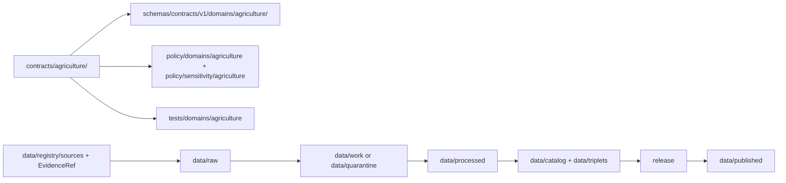

<!-- [KFM_META_BLOCK_V2]
doc_id: kfm://doc/contracts-agriculture-readme
title: contracts/agriculture/ — Agriculture Semantic Contracts
type: readme
version: v0.1
status: draft
owners: OWNER_TBD — Agriculture steward · Contract steward · Schema steward · Policy steward · Data steward · Docs steward
created: 2026-06-20
updated: 2026-06-20
policy_label: public; contracts; agriculture; semantic-contracts; compatibility-path
related:
  - ../README.md
  - ./FieldCandidate.md
  - ../../docs/domains/agriculture/IDENTITY_MODEL.md
  - ../../docs/domains/agriculture/OBJECTS.md
  - ../../docs/domains/agriculture/OBJECT_FAMILIES.md
  - ../../docs/domains/agriculture/API_CONTRACTS.md
  - ../../docs/doctrine/directory-rules.md
  - ../../schemas/contracts/v1/domains/agriculture/
  - ../../policy/domains/agriculture/
  - ../../policy/sensitivity/agriculture/
  - ../../tests/domains/agriculture/
  - ../../fixtures/domains/agriculture/
tags: [kfm, contracts, agriculture, semantic-contracts, object-families, field-candidate, schemas-separated, policy-separated, governance]
notes:
  - "Draft directory README for the current contracts/agriculture compatibility folder."
  - "Path posture is CONFLICTED / NEEDS VERIFICATION: current files exist under contracts/agriculture/, while newer agriculture domain docs propose contracts/domains/agriculture/."
  - "This README does not settle canonical contract placement; migration requires ADR or migration note."
  - "Contracts define semantic meaning; machine-checkable shape belongs in schemas/contracts/v1/domains/agriculture/ or another accepted schema home."
  - "Policy belongs in policy/domains/agriculture/ and policy/sensitivity/agriculture/, not in this contracts directory."
[/KFM_META_BLOCK_V2] -->

<a id="top"></a>

# Agriculture Semantic Contracts

> Directory contract for Agriculture object-family Markdown semantics. This folder documents meaning, boundaries, and trust posture; it does not define JSON Schema, policy, source data, release decisions, or public API/UI behavior.

<p>
  
  
  
  
  
  
</p>

`contracts/agriculture/`

## Quick jumps

[Status](#status) · [Scope](#scope) · [Path posture](#path-posture) · [Repo fit](#repo-fit) · [Accepted inputs](#accepted-inputs) · [Exclusions](#exclusions) · [Current directory snapshot](#current-directory-snapshot) · [Contract inventory](#contract-inventory) · [Semantic contract rules](#semantic-contract-rules) · [Lifecycle and trust boundary](#lifecycle-and-trust-boundary) · [Validation](#validation) · [Evidence basis](#evidence-basis) · [Rollback](#rollback) · [Definition of done](#definition-of-done)

---

## Status

> [!IMPORTANT]
> **Status:** `draft` / directory README  
> **Owner:** `OWNER_TBD`  
> **Path:** `contracts/agriculture/`  
> **Path posture:** `CONFLICTED` / `NEEDS VERIFICATION` against newer proposed home `contracts/domains/agriculture/`  
> **Truth posture:** `CONFIRMED` current README path and file update; Agriculture object-family names and FieldCandidate semantics are supported by domain docs; full contract inventory, canonical path, schemas, validators, fixtures, policy bundles, and CI behavior remain `NEEDS VERIFICATION`.

---

## Scope

`contracts/agriculture/` is the current Agriculture contract compatibility folder.

Contracts in this folder describe **semantic meaning** for Agriculture object families: what an object means, which identity attributes are load-bearing, what source roles may apply, what sensitivity posture constrains the object, what it must not be confused with, and what downstream validation must prove.

This folder does **not** define JSON Schema, executable validators, policy bundles, raw source data, processed records, catalog/triplet records, proof closure, release decisions, public API DTOs, public UI behavior, or map display behavior.

---

## Path posture

The current requested path is:

```text
contracts/agriculture/
```

Newer Agriculture domain docs propose:

```text
contracts/domains/agriculture/
```

This README keeps the current path usable while surfacing the conflict. It does not move, delete, redirect, or canonicalize any file.

| Path | Status | Meaning |
|---|---|---|
| `contracts/agriculture/` | `CONFIRMED` current folder path | Compatibility folder currently being filled. |
| `contracts/agriculture/FieldCandidate.md` | `CONFIRMED` current contract file | Expanded semantic contract for `FieldCandidate`. |
| `contracts/domains/agriculture/` | `PROPOSED` in Agriculture docs | Likely newer domain-contract home; requires ADR or migration note before becoming canonical. |
| `schemas/contracts/v1/domains/agriculture/` | `PROPOSED` schema home in Agriculture docs | Machine-checkable schema home; not replaced by Markdown contracts. |

---

## Repo fit

```text
contracts/
├── README.md
└── agriculture/
    ├── README.md
    └── FieldCandidate.md
```

Adjacent responsibility roots:

| Root | Relationship to this folder |
|---|---|
| `../README.md` | Root contracts guidance: contracts define meaning; schemas define shape. |
| `../../docs/domains/agriculture/` | Domain doctrine, object families, identity model, API posture, and sensitivity context. |
| `../../schemas/contracts/v1/domains/agriculture/` | Expected machine schema home. |
| `../../policy/domains/agriculture/`, `../../policy/sensitivity/agriculture/` | Policy and sensitivity gates. |
| `../../tests/domains/agriculture/` | Expected validators/contract tests. |
| `../../fixtures/domains/agriculture/` | Expected examples and fixtures. |
| `../../data/registry/sources/` | SourceDescriptor and source activation authority. |
| `../../release/` | Release decisions and rollback state. |

---

## Accepted inputs

| Belongs in this directory | Required posture |
|---|---|
| Markdown semantic contracts | Define meaning, identity, source-role boundaries, sensitivity posture, and validation expectations. |
| Object-family contract READMEs | Must preserve KFM lifecycle, trust membrane, cite-or-abstain, source-role anti-collapse, and policy-aware release rules. |
| Compatibility notes | Must clearly label path conflicts and migration requirements. |
| Evidence ledgers | Must cite Agriculture domain docs, object-family registers, root contract guidance, and current file evidence. |
| Validation checklists | Must point to schemas/tests/policy roots without claiming they exist unless verified. |
| Rollback notes | Must name prior content SHA or migration rollback target. |

---

## Exclusions

| Does not belong here | Correct home |
|---|---|
| JSON Schema or machine-checkable shape | `../../schemas/contracts/v1/domains/agriculture/` or accepted schema home. |
| Policy bundles, sensitivity rules, deny logic | `../../policy/domains/agriculture/`, `../../policy/sensitivity/agriculture/`. |
| SourceDescriptor records | `../../data/registry/sources/`. |
| Raw, work, quarantine, processed, catalog, triplet, or published data | `../../data/...` lifecycle roots. |
| EvidenceBundle or proof closure | `../../data/proofs/` and proof workflows. |
| Release decisions | `../../release/`. |
| Public API DTOs and route behavior | Governed API/app roots after verification. |
| Public UI/map behavior | Governed UI/app roots after release and policy gates. |
| Canonical path migration | ADR or migration note, not this README alone. |

---

## Current directory snapshot

> [!NOTE]
> This snapshot is based on current-session file inspection, not a complete repository inventory.

| File | Status | What it proves | What it does not prove |
|---|---|---|---|
| `contracts/agriculture/README.md` | `CONFIRMED` | This directory README exists and states compatibility-folder boundaries. | Does not settle canonical placement. |
| `contracts/agriculture/FieldCandidate.md` | `CONFIRMED` | A semantic contract exists for `FieldCandidate`. | Does not prove matching schema, policy, tests, or release behavior. |

---

## Contract inventory

| Object family | Current contract | Canonical-path posture | Schema posture |
|---|---|---|---|
| `FieldCandidate` | `./FieldCandidate.md` | `CONFLICTED` / `NEEDS VERIFICATION` | `schemas/contracts/v1/domains/agriculture/field_candidate.schema.json` is `PROPOSED`. |
| Other Agriculture families | `UNKNOWN` in this folder | Agriculture docs propose contracts under `contracts/domains/agriculture/` | `NEEDS VERIFICATION`. |

Agriculture domain docs identify multiple object families, including `CropObservation`, `FieldCandidate`, `CropRotation`, `YieldObservation`, `IrrigationLink`, `ConservationPractice`, `SoilCropSuitability`, `AgriculturalEconomyObservation`, `SupplyChainNode`, `DroughtStressIndicator`, `PestStressIndicator`, and `AggregationReceipt`. This folder does not yet prove semantic contracts for all of them.

---

## Semantic contract rules

Every Agriculture contract in this folder must state:

- object meaning;
- owning domain and cross-lane dependencies;
- accepted inputs and exclusions;
- identity-bearing fields;
- source-role constraints;
- temporal fields that matter;
- sensitivity default and escalation rules;
- evidence and SourceDescriptor expectations;
- lifecycle boundaries;
- validation requirements;
- rollback path;
- definition of done.

Agriculture contracts must preserve the acute anti-collapse rules surfaced in domain docs:

- aggregate values must not be joined to a single field-level record as if they were per-place truth;
- modeled outputs must not be presented as observations;
- unmerged candidates must not be published as features;
- operator/private-parcel-adjacent joins must fail closed unless policy and review allow otherwise.

---

## Lifecycle and trust boundary



Contracts describe meaning. They do not move data, validate schemas, make policy decisions, close evidence, or publish.

---

## Validation

Before relying on this directory, verify:

- canonical contract home is resolved by Directory Rules, ADR, or migration note;
- every Agriculture object family has exactly one semantic contract home or a documented compatibility redirect;
- matching JSON Schemas exist in the accepted schema home;
- policy bundles exist for sensitivity, redaction, aggregation, release, and denial outcomes;
- SourceDescriptor and EvidenceRef requirements are testable;
- validators cover identity, source role, temporal logic, geometry, evidence closure, sensitivity, and release gates;
- public API/UI surfaces do not read candidate, raw, work, quarantine, or unreleased contract-derived material directly;
- release and rollback records exist for promoted public surfaces.

---

## Evidence basis

| Source | Status | Supports | Limits |
|---|---|---|---|
| `contracts/README.md` | `CONFIRMED` | Contracts define semantic meaning and pair with schemas; executable validation, JSON Schema, policy code, and source data do not belong in contracts. | Root README is brief and does not settle Agriculture path conflict. |
| `contracts/agriculture/FieldCandidate.md` | `CONFIRMED` | Current compatibility-path contract exists for `FieldCandidate` and surfaces path conflict. | Does not prove matching schema or tests. |
| `docs/domains/agriculture/IDENTITY_MODEL.md` | `CONFIRMED` | Agriculture identity model, object-family identity basis, `FieldCandidate` candidate-disposition identity, and source-role anti-collapse. | Some schema/validator paths remain proposed. |
| `docs/domains/agriculture/OBJECT_FAMILIES.md` | `CONFIRMED` | Agriculture object-family register, `OF-AG-02 · FieldCandidate`, proposed contract/schema/policy/test paths, sensitivity and promotion gates. | Proposed path conflicts with current compatibility path. |
| `docs/domains/agriculture/OBJECTS.md` | `CONFIRMED` | Agriculture object-family meanings, sensitivity warning, and `FieldCandidate` purpose/key fields/release warning. | Key fields are illustrative pending contracts/schemas. |
| `docs/domains/agriculture/API_CONTRACTS.md` | `CONFIRMED` | Agriculture public surfaces are aggregate/public-safe by default; field-level/operator-private material fails closed. | API route names and DTOs remain proposed/verification-bound. |

---

## Rollback

Rollback is required if this README is used to claim that `contracts/agriculture/` is canonical despite newer proposed `contracts/domains/agriculture/` placement, or if it is used to justify schema, policy, release, API, UI, or public-claim authority.

Rollback target: initial blank file content SHA `8b137891791fe96927ad78e64b0aad7bded08bdc`.

---

## Definition of done

- [ ] Canonical contract path conflict is resolved by ADR or migration note.
- [ ] Owners are confirmed and `OWNER_TBD` is replaced.
- [ ] All Agriculture object-family contract files are inventoried.
- [ ] Every contract has a matching schema or documented `NEEDS VERIFICATION` gap.
- [ ] Policy bundles are linked and verified.
- [ ] Tests and fixtures are linked and verified.
- [ ] SourceDescriptor and EvidenceRef requirements are testable.
- [ ] Sensitive field-level and operator/private-parcel-adjacent public exposure fails closed.
- [ ] Release and rollback requirements are linked to release records.
- [ ] No schema, policy, data, proof, release, API, UI, or publication authority is asserted from this folder.

---

## Status summary

`contracts/agriculture/` is a compatibility folder for Agriculture semantic contracts. It currently contains the expanded `FieldCandidate` contract and this directory README. It is not yet confirmed as the canonical Agriculture contract home. It is not a schema home, policy home, source registry, data lifecycle root, proof root, release authority, public API surface, public UI surface, or publication authority.

<p align="right"><a href="#top">Back to top</a></p>
