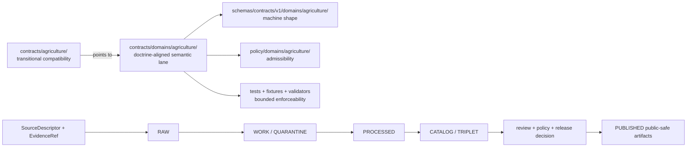

<!-- [KFM_META_BLOCK_V2]
doc_id: kfm://doc/contracts-agriculture-readme
title: contracts/agriculture/ — Agriculture Semantic Contracts
type: readme
version: v0.2
status: draft
owners: OWNER_TBD — Agriculture steward · Contract steward · Schema steward · Policy steward · Data steward · Docs steward
created: 2026-06-20
updated: 2026-07-27
policy_label: public; contracts; agriculture; semantic-contracts; compatibility-path
related:
  - ../README.md
  - ../domains/agriculture/README.md
  - ./FieldCandidate.md
  - ../../docs/domains/agriculture/IDENTITY_MODEL.md
  - ../../docs/domains/agriculture/OBJECTS.md
  - ../../docs/domains/agriculture/OBJECT_FAMILIES.md
  - ../../docs/domains/agriculture/API_CONTRACTS.md
  - ../../docs/architecture/directory-rules.md
  - ../../docs/adr/ADR-0001-schema-home--schemas-contracts-v1-is-canonical.md
  - ../../schemas/contracts/v1/domains/agriculture/README.md
  - ../../policy/domains/agriculture/README.md
  - ../../policy/sensitivity/agriculture/
  - ../../tests/domains/agriculture/README.md
  - ../../fixtures/domains/agriculture/README.md
  - ../../tools/validators/agriculture/README.md
tags: [kfm, contracts, agriculture, semantic-contracts, object-families, field-candidate, compatibility, transitional, schemas-separated, policy-separated, governance]
notes:
  - "This path is CONFIRMED present and is classified PROPOSED / transitional compatibility; the doctrine-aligned Agriculture semantic-contract lane is contracts/domains/agriculture/."
  - "No accepted migration or sunset record was verified for contracts/agriculture/; this README does not move, redirect, delete, or canonicalize files."
  - "New Agriculture semantic contracts belong in contracts/domains/agriculture/ unless an accepted ADR changes the Directory Rules domain-lane pattern."
  - "Contracts define semantic meaning; machine-checkable shape, policy, validators, fixtures, data, proofs, release decisions, APIs, and UI remain separate authority surfaces."
[/KFM_META_BLOCK_V2] -->

<a id="top"></a>

# Agriculture Semantic Contracts

[](#status)
[](#path-posture)
[](../README.md#authority-level)
[](#scope)

> Compatibility boundary for the older Agriculture contract path. This directory preserves the existing `FieldCandidate` semantic contract and stable links while new domain-contract work follows [`contracts/domains/agriculture/`](../domains/agriculture/README.md).

## Quick jumps

[Status](#status) · [Scope](#scope) · [Path posture](#path-posture) · [Repo fit](#repo-fit) · [Accepted inputs](#accepted-inputs) · [Exclusions](#exclusions) · [Current snapshot](#current-directory-snapshot) · [Companion coverage](#verified-companion-coverage) · [Contract inventory](#contract-inventory) · [Contract rules](#semantic-contract-rules) · [Lifecycle](#lifecycle-and-trust-boundary) · [Validation](#validation) · [Review and maintenance](#review-burden-and-maintenance) · [Evidence](#evidence-basis) · [Rollback](#rollback) · [Definition of done](#definition-of-done) · [Last reviewed](#last-reviewed)

---

## Status

> [!IMPORTANT]
> **Document status:** `draft`  
> **Owner:** `OWNER_TBD`  
> **Path:** `contracts/agriculture/`  
> **Authority level:** `PROPOSED` transitional compatibility lane under the canonical `contracts/` responsibility root  
> **Path posture:** `CONFIRMED` live path; `CONFIRMED` doctrine-aligned counterpart at `contracts/domains/agriculture/`; migration and sunset state remain `NEEDS VERIFICATION`  
> **Truth posture:** `CONFIRMED` repository presence and bounded companion inventory at `main@0b0309664313543b6816e8e5dcefc9593366aba5`. Contract, schema, policy, fixture, validator, test, runtime, release, and publication maturity must be read from their own evidence.

---

## Scope

`contracts/agriculture/` preserves semantic meaning and compatibility for Agriculture contract material that already exists at this older path.

The current object-level contract describes what a `FieldCandidate` means, which identity and source-role distinctions matter, what sensitivity constraints apply, and which downstream gates must close. This directory does **not** make a candidate true, validated, admissible, reviewed, released, public-safe, or published.

This directory is not the destination for new Agriculture object-family contracts. Directory Rules §12 places domain-specific semantic contracts under `contracts/domains/<domain>/`; the corresponding Agriculture lane is present at [`contracts/domains/agriculture/`](../domains/agriculture/README.md).

---

## Path posture

Both Agriculture contract paths exist at the pinned repository state, but they do not carry equal placement posture.

| Path | Verified state | Authority posture |
|---|---|---|
| `contracts/agriculture/` | `CONFIRMED` with this README and `FieldCandidate.md` | `PROPOSED` transitional compatibility lane. Preserve links and correct existing material; do not expand it into parallel authority. |
| [`contracts/domains/agriculture/`](../domains/agriculture/README.md) | `CONFIRMED` with a directory README and bounded object/support contracts | Doctrine-aligned domain lane under Directory Rules §12. Its own documents remain draft and mixed-maturity. |
| [`schemas/contracts/v1/domains/agriculture/`](../../schemas/contracts/v1/domains/agriculture/README.md) | `CONFIRMED` nonempty schema lane | Machine shape only. ADR-0001 remains `proposed`, so accepted decision status is not inferred from repository use. |
| Migration or sunset record for `contracts/agriculture/` | `NEEDS VERIFICATION` | No move, redirect, removal, or canonicalization is authorized by this README. |

> [!WARNING]
> Do not maintain two evolving Agriculture semantic-contract homes. Until a reviewed migration or supersession record closes the relationship, add new contracts to the doctrine-aligned domain lane and keep this path compatibility-only.

---

## Repo fit

This bounded snapshot records files verified at the pinned base; it is not a generated tree inventory.

```text
contracts/
├── README.md
├── agriculture/
│   ├── README.md
│   └── FieldCandidate.md
└── domains/
    └── agriculture/
        ├── README.md
        ├── aggregation-receipt.md
        ├── domain_feature_identity.md
        ├── domain_layer_descriptor.md
        ├── domain_observation.md
        └── domain_validation_report.md
```

| Responsibility surface | Relationship to this directory |
|---|---|
| [`contracts/README.md`](../README.md) | Canonical root for human-readable semantic meaning. |
| [`contracts/domains/agriculture/README.md`](../domains/agriculture/README.md) | Doctrine-aligned Agriculture contract lane and destination for new semantic contracts. |
| [`docs/domains/agriculture/`](../../docs/domains/agriculture/) | Domain references for object families, identity, API posture, and sensitivity context; docs do not replace contracts. |
| [`schemas/contracts/v1/domains/agriculture/`](../../schemas/contracts/v1/domains/agriculture/README.md) | Confirmed machine-shape lane with mixed-maturity schemas. |
| [`policy/domains/agriculture/`](../../policy/domains/agriculture/README.md) and [`policy/sensitivity/agriculture/`](../../policy/sensitivity/agriculture/) | Agriculture policy and sensitivity surfaces; current policy README reports scaffolds and no accepted production evaluator. |
| [`tests/domains/agriculture/`](../../tests/domains/agriculture/README.md) and [`fixtures/domains/agriculture/`](../../fixtures/domains/agriculture/README.md) | Enforceability and test-data surfaces; their own maturity statements govern. |
| [`tools/validators/agriculture/`](../../tools/validators/agriculture/README.md) | Agriculture validator documentation; validator topology and executable coverage require separate verification. |
| [`data/registry/sources/`](../../data/registry/sources/) | Source identity and activation records. |
| [`release/`](../../release/) | Release, correction, withdrawal, and rollback authority. |

---

## Accepted inputs

| Allowed here while this path remains | Required posture |
|---|---|
| This compatibility README | Must state the canonical counterpart, limits, open migration state, and rollback path. |
| Existing [`FieldCandidate.md`](./FieldCandidate.md) corrections | May repair accuracy, safety, links, and compatibility semantics without expanding this lane's authority. |
| Migration, supersession, or redirect notes | Must cite an accepted ADR or reviewed migration record and preserve stable inbound links. |
| Evidence-limited inventory notes | Must distinguish verified presence from schema, validator, policy, release, or runtime behavior. |

New Agriculture semantic contracts belong in [`../domains/agriculture/`](../domains/agriculture/README.md), not here, unless an accepted ADR changes the domain-lane rule.

---

## Exclusions

| Does not belong here | Owning surface |
|---|---|
| New Agriculture semantic contracts | [`../domains/agriculture/`](../domains/agriculture/README.md) |
| JSON Schema or machine-checkable shape | [`../../schemas/contracts/v1/domains/agriculture/`](../../schemas/contracts/v1/domains/agriculture/README.md) |
| Policy bundles, sensitivity rules, or deny logic | [`../../policy/domains/agriculture/`](../../policy/domains/agriculture/README.md) and [`../../policy/sensitivity/agriculture/`](../../policy/sensitivity/agriculture/) |
| Validator code, tests, or fixtures | `../../tools/validators/`, `../../tests/`, and `../../fixtures/` |
| SourceDescriptor records | [`../../data/registry/sources/`](../../data/registry/sources/) |
| Raw, work, quarantine, processed, catalog, triplet, or published data | `../../data/` lifecycle lanes |
| EvidenceBundle instances, receipts, or proof closure | Accepted `../../data/proofs/` and `../../data/receipts/` lanes |
| Release, correction, withdrawal, or rollback decisions | [`../../release/`](../../release/) |
| Public API DTOs, routes, UI behavior, or map rendering | Governed application, API, and UI roots |
| An unreviewed path move, redirect, or deletion | Accepted ADR or migration process; never this README alone |

---

## Current directory snapshot

| File | Status | What it proves | What it does not prove |
|---|---|---|---|
| `contracts/agriculture/README.md` | `CONFIRMED` | The compatibility boundary exists at this path. | Canonical placement, migration completion, schema coverage, or release state. |
| [`contracts/agriculture/FieldCandidate.md`](./FieldCandidate.md) | `CONFIRMED` draft semantic contract | `FieldCandidate` meaning and safety boundaries are documented. | A canonical-lane successor, paired schema, validator, tests, policy enforcement, or public release. |

The directory snapshot is intentionally small. New semantic coverage belongs in the doctrine-aligned Agriculture contract lane rather than growing this compatibility path.

---

## Verified companion coverage

The following surfaces were read or existence-checked at the pinned base. Presence is not maturity.

| Surface | Confirmed evidence | Bounded conclusion |
|---|---|---|
| [`contracts/domains/agriculture/README.md`](../domains/agriculture/README.md) | README plus five contract files shown in [Repo fit](#repo-fit) | The doctrine-aligned lane is nonempty; it does not yet provide a `FieldCandidate` successor or all named object-family contracts. |
| [`schemas/contracts/v1/domains/agriculture/`](../../schemas/contracts/v1/domains/agriculture/README.md) | `aggregation_receipt` plus four `domain_*` schemas | Machine-shape scaffolds exist; `field_candidate.schema.json` was not found at the pinned base. |
| [`policy/domains/agriculture/README.md`](../../policy/domains/agriculture/README.md) | Repository-grounded draft policy README | Policy scaffolds exist, but the README reports the evaluator and production enforcement as unimplemented. |
| [`tests/domains/agriculture/README.md`](../../tests/domains/agriculture/README.md) | Repository-grounded draft test README | The lane is documentation-heavy; the README does not establish executable Agriculture coverage. |
| [`fixtures/domains/agriculture/README.md`](../../fixtures/domains/agriculture/README.md) | Confirmed path | Fixture documentation exists; complete coverage and safe negative cases require separate verification. |
| [`tools/validators/agriculture/README.md`](../../tools/validators/agriculture/README.md) | Confirmed path | Validator documentation exists; callable implementations, orchestration, and results require separate verification. |

---

## Contract inventory

| Contract family | Current semantic contract | Doctrine-aligned counterpart | Machine-shape posture |
|---|---|---|---|
| `FieldCandidate` | [`./FieldCandidate.md`](./FieldCandidate.md) — `CONFIRMED` compatibility contract | `NEEDS VERIFICATION`; neither `field_candidate.md` nor `FieldCandidate.md` was found under `contracts/domains/agriculture/` at the pinned base | `field_candidate.schema.json` was not found under the Agriculture domain schema lane. |
| Agriculture aggregation receipt | No contract in this compatibility directory | [`../domains/agriculture/aggregation-receipt.md`](../domains/agriculture/aggregation-receipt.md) — `CONFIRMED`, with filename/home conflicts documented in that file | `aggregation_receipt.schema.json` is `CONFIRMED` present and scaffold maturity. |
| Domain support contracts | None in this compatibility directory | `domain_observation`, `domain_feature_identity`, `domain_layer_descriptor`, and `domain_validation_report` are `CONFIRMED` present | Four paired `domain_*` schemas are `CONFIRMED` present; contract files describe them as placeholders. |
| Remaining Agriculture object families | `UNKNOWN` here | Coverage remains incomplete or `NEEDS VERIFICATION` against the domain register | Verify per object; do not infer coverage from directory presence. |

Agriculture references name twelve object families. This compatibility lane must not become a second implementation plan for all twelve.

---

## Semantic contract rules

Any correction to Agriculture semantic contracts must preserve:

- object meaning and owning domain;
- identity-bearing and temporal distinctions;
- source role from admission through release;
- EvidenceRef-to-EvidenceBundle requirements for consequential claims;
- rights, sensitivity, spatial precision, and review posture;
- lifecycle and governed promotion boundaries;
- validation, correction, supersession, and rollback expectations;
- the separation between semantic contracts, schemas, policy, fixtures, validators, data, proofs, release decisions, APIs, and UI.

Agriculture contracts must prevent these anti-collapse failures:

- aggregate values presented as single-field or single-place truth;
- modeled outputs presented as observations;
- unmerged candidates presented as confirmed or published features;
- operator-, person-, parcel-, or private-farm-adjacent joins exposed without policy, evidence, review, and public-safe transformation closure.

---

## Lifecycle and trust boundary


```mermaid
flowchart LR
  LEGACY["contracts/agriculture/<br/>transitional compatibility"] -->|points to| CONTRACT["contracts/domains/agriculture/<br/>doctrine-aligned semantic lane"]
  CONTRACT --> SCHEMA["schemas/contracts/v1/domains/agriculture/<br/>machine shape"]
  CONTRACT --> POLICY["policy/domains/agriculture/<br/>admissibility"]
  CONTRACT --> TESTS["tests + fixtures + validators<br/>bounded enforceability"]
  SOURCE["SourceDescriptor + EvidenceRef"] --> RAW["RAW"]
  RAW --> WORK["WORK / QUARANTINE"]
  WORK --> PROC["PROCESSED"]
  PROC --> CAT["CATALOG / TRIPLET"]
  CAT --> RELEASE["review + policy + release decision"]
  RELEASE --> PUB["PUBLISHED public-safe artifacts"]
```

The upper path separates definition responsibilities; the lower path is the governed lifecycle for instances. Neither a Markdown edit nor a file move performs validation, policy evaluation, promotion, release, or publication.

---

## Validation

### Documentation checks for this README

- verify one H1, logical heading order, balanced fences, valid tables, supported alerts, and a final newline;
- verify every relative file, directory, fragment, and badge destination from the resulting branch;
- validate Mermaid syntax and confirm the diagram remains understandable in text;
- confirm the KFM Meta Block keeps the stable `doc_id` and `created` date;
- confirm the diff changes only `contracts/agriculture/README.md`;
- confirm the owner placeholder is visible in text but not promoted as a status badge;
- confirm no content implies that a contract, schema, workflow, PR, or merge is KFM publication.

### System checks before relying on or retiring this path

- approve a migration or supersession record for `contracts/agriculture/` and update inbound links;
- decide the canonical `FieldCandidate` filename and migrate the semantic contract without duplicate authority;
- add or explicitly defer a paired `FieldCandidate` schema, fixtures, validator, tests, and policy cases;
- reconcile the complete Agriculture contract-to-schema inventory;
- prove source-role, temporal, geometry, evidence, sensitivity, aggregation, and release-negative cases;
- ensure public clients use governed interfaces and never read candidate, raw, work, quarantine, or unreleased stores directly;
- link any promoted public surface to review, release, correction, and rollback records.

> [!NOTE]
> The pull request for this documentation change may trigger repository workflows. A green or held check proves only its declared scope; it is not contract completeness, policy enforcement, release approval, or publication evidence.

---

## Review burden and maintenance

Current [`CODEOWNERS`](../../.github/CODEOWNERS) routes `/contracts/` to `@bartytime4life`. That route is review routing only; it does not prove an accepted steward assignment, independent approval, branch protection, or merge authority.

Until ownership is resolved:

- keep `OWNER_TBD` visible;
- review semantic changes with the affected Agriculture and contract responsibilities represented;
- review cross-root claims against the current contract, schema, policy, test, fixture, validator, evidence, and release owners;
- update this README when the canonical counterpart, `FieldCandidate` migration, schema coverage, or path status changes;
- do not mark a draft PR ready or merge it without separate, current authorization and repository-control evidence.

---

## Evidence basis

| Source | Status | Supports | Limits |
|---|---|---|---|
| [`docs/architecture/directory-rules.md`](../../docs/architecture/directory-rules.md) | `CONFIRMED` live placement doctrine | `contracts/` owns meaning; domains use `contracts/domains/<domain>/`; compatibility paths must not evolve as parallel authority. | Directory Rules does not complete this path's migration. |
| [`contracts/README.md`](../README.md) | `CONFIRMED` canonical-root README | Semantic meaning belongs in `contracts/`; schemas, policy, evidence, release, runtime, and publication remain separate. | Root guidance does not prove every child contract or companion surface. |
| [`contracts/domains/agriculture/README.md`](../domains/agriculture/README.md) | `CONFIRMED` current lane README | The doctrine-aligned Agriculture contract lane exists and names this path as compatibility. | The README remains draft and does not close migration or implementation. |
| [`contracts/agriculture/FieldCandidate.md`](./FieldCandidate.md) | `CONFIRMED` compatibility contract | `FieldCandidate` meaning, candidate posture, source-role limits, and public-exposure warning. | No canonical-lane successor, schema, validator, or release behavior is inferred. |
| [`schemas/contracts/v1/domains/agriculture/README.md`](../../schemas/contracts/v1/domains/agriculture/README.md) and verified schema files | `CONFIRMED` nonempty schema lane | Five Agriculture schema files are present in the bounded snapshot. | Files are mixed-maturity scaffolds; no `FieldCandidate` schema was found. |
| [`policy/domains/agriculture/README.md`](../../policy/domains/agriculture/README.md) | `CONFIRMED` repository-grounded draft | Current policy inventory, fail-closed posture, and explicit evaluator limitations. | It does not prove active production enforcement. |
| [`tests/domains/agriculture/README.md`](../../tests/domains/agriculture/README.md) | `CONFIRMED` repository-grounded draft | Current test-lane inventory and explicit executable-coverage gaps. | It does not prove Agriculture test success. |
| Agriculture identity, object-family, object, and API references | `CONFIRMED` repository documents / mixed implementation posture | Stable object names, identity and source-role rules, field-level sensitivity, and governed public-surface expectations. | Proposed routes, DTOs, validators, and coverage remain verification-bound. |

---

## Rollback

Before merge, rollback is to close the draft pull request and leave the branch unmerged. After merge, revert the scoped documentation commit; do not rewrite shared history.

Immediate content rollback target: prior README blob `6ad0b16202119291fe9f391daabcce8f5d87b558`.

A future path retirement needs a separate migration rollback plan that preserves inbound links, document lineage, and the existing `FieldCandidate` contract until its canonical successor and companion surfaces are verified.

---

## Definition of done

### This documentation upgrade

- [x] Existing README remains at the same path with stable `doc_id` and `created` date.
- [x] Live Directory Rules and the doctrine-aligned Agriculture contract lane are linked.
- [x] Placeholder owner badge is removed; the unresolved owner remains visible in text.
- [x] Compatibility-only admission rules prevent this lane from growing into parallel authority.
- [x] Verified companion contracts, schemas, policy, tests, fixtures, and validator documentation are distinguished from maturity claims.
- [x] Validation, review, correction, and rollback boundaries are explicit.

### Migration and implementation closure

- [ ] A reviewed migration or supersession record resolves the two Agriculture contract paths.
- [ ] `FieldCandidate` has one canonical semantic contract and one verified machine-shape path.
- [ ] Owners and review requirements are confirmed without placeholder roles.
- [ ] The complete Agriculture contract-to-schema-to-policy-to-fixture-to-validator-to-test crosswalk is verified.
- [ ] Negative cases prove candidate, modeled, aggregate, sensitive-join, evidence-gap, correction, and rollback behavior.
- [ ] Released surfaces, if any, link to governed release, correction, and rollback records.

---

## Last reviewed

| Field | Value |
|---|---|
| Review date | 2026-07-27 |
| Repository | `bartytime4life/Kansas-Frontier-Matrix` |
| Base ref | `main` |
| Pinned base commit | `0b0309664313543b6816e8e5dcefc9593366aba5` |
| Prior README blob | `6ad0b16202119291fe9f391daabcce8f5d87b558` |
| Directory Rules blob | `18653c00ba193a4afaa3e07a0924452807fb98ef` |
| Path overlap at review time | No open pull request found for this target |

---

## Status summary

`contracts/agriculture/` is a confirmed live, proposed transitional compatibility lane. It preserves `FieldCandidate` meaning and stable links while [`contracts/domains/agriculture/`](../domains/agriculture/README.md) serves as the doctrine-aligned domain lane for new Agriculture semantic contracts. Neither directory is a schema, policy, source-registry, lifecycle-data, evidence, proof, release, API, UI, or publication authority.

<p align="right"><a href="#top">Back to top</a></p>
