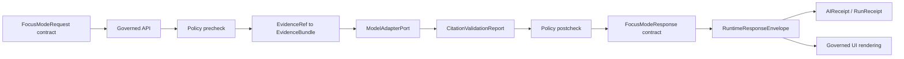

<!-- [KFM_META_BLOCK_V2]
doc_id: kfm://doc/contracts-ai-readme
title: contracts/ai/ — Governed AI Semantic Contracts
type: readme
version: v0.1
status: draft
owners: OWNER_TBD — Governed AI steward · Contract steward · Schema steward · Policy steward · Evidence steward · API steward · UI steward · Docs steward
created: 2026-06-20
updated: 2026-06-20
policy_label: public; contracts; ai; governed-ai; semantic-contracts; finite-outcome; cite-or-abstain
related:
  - ../README.md
  - ./focus_mode_request/README.md
  - ./focus_mode_response/README.md
  - ../../contracts/focus_mode/focus_mode_payload.md
  - ../../docs/architecture/governed-ai/FOCUS_FLOW.md
  - ../../docs/architecture/governed-ai/ADAPTER_CONTRACT.md
  - ../../schemas/contracts/v1/focus/
  - ../../schemas/contracts/v1/ai/
  - ../../schemas/contracts/v1/evidence/
  - ../../schemas/contracts/v1/policy/
  - ../../schemas/contracts/v1/runtime/
  - ../../policy/focus/
  - ../../data/receipts/ai/
  - ../../data/proofs/
  - ../../release/
tags: [kfm, contracts, ai, governed-ai, semantic-contracts, focus-mode, focus-mode-request, focus-mode-response, model-adapter, evidence-bundle, policy-decision, citation-validation, ai-receipt, finite-outcome, cite-or-abstain, governance]
notes:
  - "Draft parent README for the requested contracts/ai path."
  - "Path posture is PROPOSED / NEEDS VERIFICATION: governed-AI docs point to schemas/contracts/v1/focus/, schemas/contracts/v1/ai/, schemas/contracts/v1/runtime/, policy/focus/, and older contracts/focus_mode/ payload contract surfaces."
  - "This README coordinates AI semantic contracts only; it is not machine schema, prompt text, adapter code, policy code, receipt storage, release state, API implementation, or UI behavior."
  - "All governed-AI contract surfaces must keep generated language subordinate to EvidenceBundle, PolicyDecision, review state, release state, and citation validation."
  - "Public browser-to-model shortcuts and raw model output surfaces are forbidden."
[/KFM_META_BLOCK_V2] -->

<a id="top"></a>

# Governed AI Semantic Contracts

> Parent contract directory for governed-AI semantic contracts. This folder describes meanings and boundaries for AI request/response objects; it does not define schemas, prompts, adapters, policy, receipts, API routes, UI rendering, or release state.

<p>
  
  
  
  
  
  
</p>

`contracts/ai/`

## Quick jumps

[Status](#status) · [Scope](#scope) · [Path posture](#path-posture) · [Repo fit](#repo-fit) · [Accepted contents](#accepted-contents) · [Exclusions](#exclusions) · [Current directory snapshot](#current-directory-snapshot) · [Contract inventory](#contract-inventory) · [Governing invariants](#governing-invariants) · [Lifecycle and trust boundary](#lifecycle-and-trust-boundary) · [Validation](#validation) · [Evidence basis](#evidence-basis) · [Rollback](#rollback) · [Definition of done](#definition-of-done)

---

## Status

> [!IMPORTANT]
> **Status:** `draft` / parent directory README  
> **Owner:** `OWNER_TBD`  
> **Path:** `contracts/ai/`  
> **Path posture:** `PROPOSED` / `NEEDS VERIFICATION`  
> **Truth posture:** `CONFIRMED` current README path and file update; child request/response READMEs exist; governed-AI invariants are supported by architecture docs; machine schemas, validators, fixtures, routes, policy bundles, receipts, CI behavior, UI rendering, and runtime implementation remain `NEEDS VERIFICATION`.

---

## Scope

`contracts/ai/` is the requested parent directory for governed-AI semantic contracts.

Contracts in this folder define semantic meaning and trust boundaries for AI-facing objects, especially Focus Mode request and response contracts. They describe what these objects mean, what they require, what they must not bypass, and what downstream validation must prove.

This directory does **not** define JSON Schema, prompt templates, adapter implementation, provider configuration, policy rules, EvidenceBundle content, AIReceipt records, released payloads, API routes, UI rendering, model behavior, proof closure, or publication authority.

---

## Path posture

The requested path is:

```text
contracts/ai/
```

Current child paths in this directory:

```text
contracts/ai/focus_mode_request/README.md
contracts/ai/focus_mode_response/README.md
```

Related paths in current repo evidence include:

```text
contracts/focus_mode/focus_mode_payload.md
docs/architecture/governed-ai/FOCUS_FLOW.md
docs/architecture/governed-ai/ADAPTER_CONTRACT.md
schemas/contracts/v1/focus/              # PROPOSED in Focus Flow
schemas/contracts/v1/ai/                 # PROPOSED in Adapter Contract
schemas/contracts/v1/runtime/            # PROPOSED runtime envelope home
policy/focus/                            # PROPOSED in Focus Flow
```

This README does not settle whether the canonical semantic contract home should be `contracts/ai/`, `contracts/focus_mode/`, `contracts/runtime/`, or another accepted path. Any migration or consolidation must use an ADR or migration note.

---

## Repo fit

```text
contracts/
├── README.md
├── ai/
│   ├── README.md
│   ├── focus_mode_request/
│   │   └── README.md
│   └── focus_mode_response/
│       └── README.md
└── focus_mode/
    └── focus_mode_payload.md
```

Adjacent responsibility roots:

| Root | Relationship to `contracts/ai/` |
|---|---|
| `../README.md` | Root contracts guidance: contracts define meaning; schemas define shape. |
| `../../docs/architecture/governed-ai/` | Governed-AI architecture, flow, adapter boundary, and implementation posture. |
| `../../contracts/focus_mode/` | Older Focus Mode payload semantic contract surface. |
| `../../schemas/contracts/v1/focus/` | Proposed Focus Mode request/response schema home. |
| `../../schemas/contracts/v1/ai/` | Proposed AIReceipt/adapter-adjacent schema home. |
| `../../schemas/contracts/v1/runtime/` | Proposed runtime response envelope schema home. |
| `../../policy/focus/` | Proposed Focus Mode policy precheck/postcheck home. |
| `../../data/proofs/` | EvidenceBundle and proof families. |
| `../../data/receipts/ai/` | Proposed AIReceipt/run trace output; not proof closure. |
| `../../release/` | Release state and rollback posture. |

---

## Accepted contents

| Belongs in `contracts/ai/` | Required posture |
|---|---|
| AI semantic contract READMEs | Define meaning and trust boundaries, not machine shape or implementation. |
| Request-side contract docs | Must require bounded scope, policy precheck, EvidenceRef resolution, and no direct model path. |
| Response-side contract docs | Must require finite outcomes, citation validation, policy postcheck, and receipt linkage. |
| Compatibility notes | Must clearly mark path conflicts and proposed homes. |
| Evidence ledgers | Must cite governed-AI docs, root contract guidance, and current file evidence. |
| Validation checklists | Must point to schemas/tests/policy roots without claiming they exist unless verified. |
| Rollback notes | Must name prior content SHA or migration rollback target. |

---

## Exclusions

| Does not belong here | Correct home |
|---|---|
| JSON Schema or machine-checkable shape | `../../schemas/contracts/v1/focus/`, `../../schemas/contracts/v1/ai/`, `../../schemas/contracts/v1/runtime/`, or accepted schema home. |
| Prompt templates | Template registry or adapter configuration after accepted placement. |
| Model adapter code or provider configuration | Governed-AI implementation roots after accepted placement. |
| Policy precheck/postcheck rules | `../../policy/focus/` or accepted policy home. |
| EvidenceBundle content | `../../data/proofs/` and evidence workflows. |
| AIReceipt records | `../../data/receipts/ai/` or accepted receipt home. |
| Released Focus Mode payloads | `../../data/published/` after release gates. |
| API routes and DTO implementation | Governed API/app roots after verification. |
| Public UI rendering | Governed UI roots after release and policy gates. |
| Direct browser-to-model pathway or raw model output | Forbidden by governed-AI trust membrane. |

---

## Current directory snapshot

> [!NOTE]
> This snapshot is based on current-session file inspection, not a complete repository implementation inventory.

| File | Status | What it proves | What it does not prove |
|---|---|---|---|
| `contracts/ai/README.md` | `CONFIRMED` | Parent README exists and states AI semantic-contract boundaries. | Does not settle canonical pathing or implementation readiness. |
| `contracts/ai/focus_mode_request/README.md` | `CONFIRMED` | Request-side semantic contract exists. | Does not prove schema, policy, route, or runtime implementation. |
| `contracts/ai/focus_mode_response/README.md` | `CONFIRMED` | Response-side semantic contract exists. | Does not prove schema, policy, route, UI, or runtime implementation. |
| `contracts/focus_mode/focus_mode_payload.md` | `CONFIRMED` | Older payload semantic contract exists. | Does not settle request/response home or schema implementation. |
| `contracts/ai/*` schemas/tests/policies | `UNKNOWN` | Not verified by this README. | Requires separate repo inventory. |

---

## Contract inventory

| Contract surface | Current location | Meaning | Canonical-path posture |
|---|---|---|---|
| Focus Mode request | `./focus_mode_request/README.md` | Bounded evidence/policy request semantics. | `PROPOSED` / `NEEDS VERIFICATION`. |
| Focus Mode response | `./focus_mode_response/README.md` | Finite cited/policy-checked response-envelope semantics. | `PROPOSED` / `NEEDS VERIFICATION`. |
| Focus Mode payload | `../focus_mode/focus_mode_payload.md` | Released payload projection semantics. | Existing older surface; relationship to `contracts/ai/` requires review. |
| Model adapter contract | `../../docs/architecture/governed-ai/ADAPTER_CONTRACT.md` | Architecture/port contract, not a semantic object contract file. | Docs-root architecture surface. |
| Focus Flow | `../../docs/architecture/governed-ai/FOCUS_FLOW.md` | Flow standard, not a contract implementation. | Docs-root architecture surface. |

---

## Governing invariants

All contracts under `contracts/ai/` must preserve these invariants:

- evidence outranks generated language;
- public clients do not call model providers directly;
- adapter input is bounded, policy-prechecked, and evidence-limited;
- citations must validate before an `ANSWER`;
- policy postcheck runs before user display;
- runtime outcomes are finite: `ANSWER`, `ABSTAIN`, `DENY`, `ERROR`;
- adapter invocations are receipted and reversible;
- raw model output is never a public response;
- AI receipts are audit trail/process memory, not proof closure or release approval.

---

## Lifecycle and trust boundary



Contracts under this directory describe meaning. They do not move data, read lifecycle stores, call models, validate schemas, make policy decisions, close evidence, render UI, or publish.

---

## Validation

Before relying on this directory, verify:

- canonical AI contract home is resolved by Directory Rules, ADR, or migration note;
- every AI semantic contract has exactly one canonical home or a documented compatibility redirect;
- matching JSON Schemas exist in accepted schema homes;
- Focus policy precheck/postcheck rules exist and validate;
- EvidenceRef resolution is enforced before answer generation;
- CitationValidationReport is required before `ANSWER`;
- runtime outcome enum is closed and fail-closed;
- AIReceipt/run receipt linkage is implemented and verified;
- public API/UI surfaces consume only governed envelopes;
- tests deny direct browser-to-model paths, raw model output, and direct RAW/WORK/QUARANTINE/canonical-store access.

---

## Evidence basis

| Source | Status | Supports | Limits |
|---|---|---|---|
| `contracts/ai/README.md` before this edit | `CONFIRMED` | Target file existed but was blank. | No directory contract content before this edit. |
| `contracts/ai/focus_mode_request/README.md` | `CONFIRMED` | Request-side semantic contract, bounded request semantics, finite outcomes, evidence and policy gates. | Does not prove schemas or runtime implementation. |
| `contracts/ai/focus_mode_response/README.md` | `CONFIRMED` | Response-side semantic contract, finite envelope semantics, citation/policy gates, raw-output exclusion. | Does not prove schemas, UI, or runtime implementation. |
| `docs/architecture/governed-ai/FOCUS_FLOW.md` | `CONFIRMED` | Focus Mode flow, finite outcomes, request/evidence/adapter/citation/policy/envelope sequence. | Specific paths and implementation details remain proposed. |
| `docs/architecture/governed-ai/ADAPTER_CONTRACT.md` | `CONFIRMED` | Evidence outranks generation, no browser-to-model path, cite-or-abstain, finite outcomes, receipts, and adapter as interpretive layer. | TypeScript-like surfaces and file paths remain proposed. |
| `contracts/focus_mode/focus_mode_payload.md` | `CONFIRMED` | Existing semantic payload contract distinguishes released payload projection from request/response contracts and requires evidence, policy, promotion, and finite outcomes. | Payload projection is not request or response envelope implementation. |
| `contracts/README.md` | `CONFIRMED` | Contracts define semantic meaning; schemas define machine shape. | Root README is brief and does not settle AI contract pathing. |

---

## Rollback

Rollback is required if this README is used to justify direct model access, prompt-only answer generation, raw model output exposure, bypass of evidence/policy/citation gates, schema authority, policy authority, receipt-store authority, released-payload authority, API implementation, UI rendering, or publication authority.

Rollback target: initial blank file content SHA `8b137891791fe96927ad78e64b0aad7bded08bdc`.

---

## Definition of done

- [ ] Owners are confirmed and `OWNER_TBD` is replaced.
- [ ] Canonical AI semantic contract home is resolved by ADR or migration note.
- [ ] Request, response, payload, adapter, runtime envelope, and AI receipt contract relationships are mapped.
- [ ] Matching schemas exist in accepted schema homes.
- [ ] Policy precheck and postcheck rules exist and validate.
- [ ] CitationValidationReport and EvidenceBundle gates are enforced before `ANSWER`.
- [ ] AIReceipt/run receipt linkage is implemented and verified.
- [ ] Tests deny direct model path, raw model output, and lifecycle-store bypass.
- [ ] Public API/UI surfaces consume only governed envelopes.
- [ ] No schema, prompt, adapter, policy, data, proof, release, API, UI, or publication authority is asserted from this directory.

---

## Status summary

`contracts/ai/` is a draft parent directory for governed-AI semantic contracts. It currently contains Focus Mode request and response README contracts. It is not the machine schema home, prompt registry, adapter implementation, policy home, AIReceipt store, proof root, release authority, API implementation, UI rendering surface, or publication authority.

<p align="right"><a href="#top">Back to top</a></p>
