<!-- [KFM_META_BLOCK_V2]
doc_id: kfm://doc/contracts-ai-focus-mode-request-readme
title: contracts/ai/focus_mode_request/ — Focus Mode Request Contract
type: readme
version: v0.1
status: draft
owners: OWNER_TBD — Governed AI steward · Contract steward · Schema steward · Policy steward · Evidence steward · API steward · Docs steward
created: 2026-06-20
updated: 2026-06-20
policy_label: public; contracts; ai; focus-mode; request-contract; semantic-contract; evidence-bounded
related:
  - ../../README.md
  - ../../../docs/architecture/governed-ai/FOCUS_FLOW.md
  - ../../../docs/architecture/governed-ai/ADAPTER_CONTRACT.md
  - ../../../contracts/focus_mode/focus_mode_payload.md
  - ../../../schemas/contracts/v1/focus/
  - ../../../schemas/contracts/v1/ai/
  - ../../../schemas/contracts/v1/evidence/
  - ../../../schemas/contracts/v1/policy/
  - ../../../schemas/contracts/v1/runtime/
  - ../../../policy/focus/
  - ../../../data/receipts/ai/
  - ../../../data/proofs/
  - ../../../release/
tags: [kfm, contracts, ai, governed-ai, focus-mode, focus-mode-request, map-context-envelope, evidence-ref, evidence-bundle, policy-decision, citation-validation, finite-outcome, semantic-contract, governance]
notes:
  - "Draft directory README for the requested contracts/ai/focus_mode_request path."
  - "Path posture is PROPOSED / NEEDS VERIFICATION: Focus Flow points to schemas/contracts/v1/focus/ and policy/focus/ as proposed homes; older semantic payload contract exists under contracts/focus_mode/."
  - "This README defines request-side semantic boundaries, not machine schema, prompt text, model adapter code, policy, receipts, release state, API route implementation, or UI behavior."
  - "Focus Mode requests are evidence-bounded requests; generated language is downstream and subordinate to EvidenceBundle, PolicyDecision, review state, release state, and citation validation."
  - "Public browser-to-model shortcuts are forbidden; requests must pass through governed API boundaries."
[/KFM_META_BLOCK_V2] -->

<a id="top"></a>

# Focus Mode Request Contract

> Directory contract for the semantic meaning of a Focus Mode request: a bounded, policy-checked, evidence-referenced request for an answer. It is not a prompt file, not model output, not a payload release, not an API route, and not a public-client shortcut to an AI model.

<p>
  
  
  
  
  
  
</p>

`contracts/ai/focus_mode_request/`

## Quick jumps

[Status](#status) · [Scope](#scope) · [Path posture](#path-posture) · [Repo fit](#repo-fit) · [Accepted inputs](#accepted-inputs) · [Exclusions](#exclusions) · [Request semantics](#request-semantics) · [Finite outcomes](#finite-outcomes) · [Lifecycle and trust boundary](#lifecycle-and-trust-boundary) · [Validation](#validation) · [Evidence basis](#evidence-basis) · [Rollback](#rollback) · [Definition of done](#definition-of-done)

---

## Status

> [!IMPORTANT]
> **Status:** `draft` / directory README  
> **Owner:** `OWNER_TBD`  
> **Path:** `contracts/ai/focus_mode_request/`  
> **Path posture:** `PROPOSED` / `NEEDS VERIFICATION`  
> **Truth posture:** `CONFIRMED` current README path and file update; Focus Mode request flow and governed-AI invariants are supported by architecture docs; machine schema, validators, fixtures, routes, policy bundles, receipts, CI behavior, and runtime implementation remain `NEEDS VERIFICATION`.

---

## Scope

`contracts/ai/focus_mode_request/` is the requested semantic contract directory for Focus Mode request meaning.

A Focus Mode request is a bounded request for governed AI assistance. It carries a user question, a bounded map or non-map context, caller/audience posture, requested evidence references or evidence scope, and policy-relevant context. The request is allowed to enter the Focus Flow only if it can be schema-validated and policy-prechecked.

This directory describes request semantics and trust boundaries. It does not define JSON Schema, prompt templates, adapter code, policy code, API routes, model behavior, response envelopes, released payloads, public UI behavior, receipts as proof closure, or publication authority.

---

## Path posture

The requested path is:

```text
contracts/ai/focus_mode_request/
```

Related paths in current repo evidence include:

```text
docs/architecture/governed-ai/FOCUS_FLOW.md
schemas/contracts/v1/focus/              # PROPOSED in Focus Flow
policy/focus/                            # PROPOSED in Focus Flow
contracts/focus_mode/focus_mode_payload.md
```

This README does not settle whether the canonical semantic contract home should live under `contracts/ai/focus_mode_request/`, `contracts/focus_mode/`, `contracts/runtime/`, or another accepted path. Any migration or consolidation must use an ADR or migration note.

---

## Repo fit

```text
contracts/
├── ai/
│   └── focus_mode_request/
│       └── README.md
└── focus_mode/
    └── focus_mode_payload.md
```

Adjacent responsibility roots:

| Root | Relationship to this directory |
|---|---|
| `../../../docs/architecture/governed-ai/FOCUS_FLOW.md` | Governs the end-to-end request → policy → evidence → adapter → citation → response flow. |
| `../../../docs/architecture/governed-ai/ADAPTER_CONTRACT.md` | Defines model adapter boundary and finite outcome invariants. |
| `../../../contracts/focus_mode/focus_mode_payload.md` | Older semantic contract for Focus Mode payload projection, not request intake. |
| `../../../schemas/contracts/v1/focus/` | Proposed machine schema home for Focus Mode request/response shapes. |
| `../../../policy/focus/` | Proposed policy precheck/postcheck home. |
| `../../../data/proofs/` | EvidenceBundle and proof families. |
| `../../../data/receipts/ai/` | Proposed AIReceipt/run trace output; not proof closure. |
| `../../../release/` | Release state and rollback posture. |

---

## Accepted inputs

| Request element | Required posture |
|---|---|
| `question` | User intent in natural language; must be scoped and must not bypass policy or evidence gates. |
| `map_context_envelope` | Bounded map context when request originates from map UI: bounds, selected feature, visible layers, time window, and audience context. |
| `non_map_context` | Optional bounded context for non-map Focus surfaces. |
| `evidence_refs[]` | Evidence requested or preselected by the UI/API; must resolve to EvidenceBundle before claims are answered. |
| `scope` | County, feature, layer, domain, time window, or other bounded focus context. |
| `audience_class` / caller posture | Required for policy decisions and sensitivity gates. |
| `policy_context` | Active rights, sensitivity, release, review, and sovereignty/care-related posture where applicable. |
| `requested_output` | Must be bounded to allowed Focus Mode outputs and finite outcomes. |
| `correlation_id` / receipt seed | Required for auditability, AIReceipt linkage, and rollback/debug paths. |

---

## Exclusions

| Does not belong here | Correct home |
|---|---|
| JSON Schema for FocusModeRequest | `../../../schemas/contracts/v1/focus/` or accepted schema home. |
| Prompt templates | Template registry or adapter configuration after accepted placement. |
| Model adapter code | Governed AI adapter implementation roots after accepted placement. |
| Policy precheck/postcheck rules | `../../../policy/focus/` or accepted policy home. |
| EvidenceBundle content | `../../../data/proofs/` and evidence workflows. |
| AIReceipt records | `../../../data/receipts/ai/` or accepted receipt home. |
| Released Focus Mode payloads | `../../../data/published/` after release gates. |
| API routes and DTO implementation | Governed API/app roots after verification. |
| Public UI behavior | Governed UI roots after release and policy gates. |
| Direct browser-to-model pathway | Forbidden by governed-AI trust membrane. |

---

## Request semantics

A Focus Mode request is valid only as an input to the governed flow. It is not an answer request sent directly to a model.

Minimum semantic rules:

- request scope must be bounded before evidence retrieval;
- policy precheck must happen before adapter invocation;
- EvidenceRef values must resolve to EvidenceBundle before consequential claims are generated;
- adapter input must include admissible context only;
- citations must be validated before an `ANSWER` outcome;
- policy postcheck must inspect the generated candidate before user display;
- every invocation must emit a receipt or finite error envelope;
- request failure must produce `ABSTAIN`, `DENY`, or `ERROR`, never an uncited best-effort answer.

---

## Finite outcomes

Focus Mode request processing resolves to one of the governed finite outcomes:

| Outcome | Request-side meaning |
|---|---|
| `ANSWER` | Request is in scope, policy allows, evidence resolves, citations validate, and postcheck allows display. |
| `ABSTAIN` | Request cannot be answered due to insufficient, missing, stale, conflicted, or unvalidated evidence. |
| `DENY` | Request is forbidden by rights, sensitivity, release, review, policy, or audience context. |
| `ERROR` | Request cannot be evaluated due to malformed input, schema failure, resolver/adapter failure, infrastructure failure, or contract violation. |

Unknown outcomes must fail closed.

---

## Lifecycle and trust boundary

```mermaid
flowchart LR
  U[User / governed client] --> API[Governed API]
  API --> REQ[FocusModeRequest]
  REQ --> SCOPE[Scope validation]
  SCOPE --> POL1[Policy precheck]
  POL1 --> ER[EvidenceRef to EvidenceBundle]
  ER --> ADP[ModelAdapterPort]
  ADP --> CITE[Citation validation]
  CITE --> POL2[Policy postcheck]
  POL2 --> ENV[Runtime response envelope]
  ENV --> REC[AIReceipt / run receipt]
```



This directory defines the request-side semantic contract. It does not authorize direct model access, direct RAW/WORK/QUARANTINE reads, direct public display, or release.

---

## Validation

Before relying on this directory, verify:

- canonical contract home is resolved by Directory Rules, ADR, or migration note;
- matching `FocusModeRequest` schema exists and validates in the accepted schema home;
- request fields use closed enums and fail-closed validation;
- request scope cannot be unbounded;
- evidence references resolve to EvidenceBundles before answer generation;
- policy precheck and postcheck are both enforced;
- adapter receives only admissible bounded context;
- citation validation is required before `ANSWER`;
- all outcomes are finite and receipted;
- public clients cannot call model providers directly;
- public clients do not read raw, work, quarantine, canonical stores, unpublished candidates, vector indexes, graph stores, or credentials.

---

## Evidence basis

| Source | Status | Supports | Limits |
|---|---|---|---|
| `contracts/ai/focus_mode_request/README.md` before this edit | `CONFIRMED` | Target file existed but was blank. | No contract content before this edit. |
| `docs/architecture/governed-ai/FOCUS_FLOW.md` | `CONFIRMED` | Focus Mode is evidence-bounded; request flow is scope → policy → evidence → adapter → citation → policy → envelope; finite outcomes are `ANSWER`, `ABSTAIN`, `DENY`, `ERROR`. | Specific paths and implementation details remain proposed. |
| `docs/architecture/governed-ai/ADAPTER_CONTRACT.md` | `CONFIRMED` | Evidence outranks generation, no browser-to-model path, cite-or-abstain, finite outcomes, receipts, and adapter as interpretive layer. | TypeScript-like surfaces and file paths remain proposed. |
| `contracts/focus_mode/focus_mode_payload.md` | `CONFIRMED` | Existing semantic payload contract distinguishes FocusModePayload from machine schema and requires evidence, policy, promotion, and finite outcomes. | Payload is not the same as request intake. |
| `contracts/README.md` | `CONFIRMED` | Contracts define semantic meaning; schemas define machine shape. | Root README is brief and does not settle AI contract pathing. |

---

## Rollback

Rollback is required if this README is used to justify direct browser-to-model access, prompt-only answer generation, bypass of evidence/policy/citation gates, schema authority, policy authority, released-payload authority, API route implementation, UI behavior, or publication authority.

Rollback target: initial blank file content SHA `8b137891791fe96927ad78e64b0aad7bded08bdc`.

---

## Definition of done

- [ ] Owners are confirmed and `OWNER_TBD` is replaced.
- [ ] Canonical AI/Focus request contract home is resolved by ADR or migration note.
- [ ] Matching FocusModeRequest schema exists in accepted schema home.
- [ ] Policy precheck and postcheck rules exist and validate.
- [ ] EvidenceRef resolution is enforced before answer generation.
- [ ] CitationValidationReport is required before `ANSWER`.
- [ ] RuntimeResponseEnvelope outcome enum is closed and fail-closed.
- [ ] AIReceipt/run receipt linkage is implemented and verified.
- [ ] Tests deny direct browser-to-model path and direct RAW/WORK/QUARANTINE access.
- [ ] Public API/UI surfaces consume only governed envelopes, never raw model output.

---

## Status summary

`contracts/ai/focus_mode_request/` is a draft semantic contract directory for Focus Mode request meaning. It is not the machine schema, not prompt text, not adapter code, not policy code, not a response payload contract, not an API implementation, not UI behavior, not an AIReceipt store, not a release decision, and not publication authority.

<p align="right"><a href="#top">Back to top</a></p>
