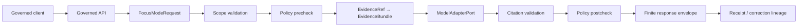

<!-- [KFM_META_BLOCK_V2]
doc_id: kfm://doc/contracts-ai-focus-mode-request-readme
title: contracts/ai/focus_mode_request/ — Focus Mode Request Contract
type: readme
version: v0.2
status: draft
owners: OWNER_TBD — Governed AI steward · Contract steward · Schema steward · Policy steward · Evidence steward · API steward · Docs steward
created: 2026-06-20
updated: 2026-09-07
policy_label: public; contracts; ai; focus-mode; request-contract; semantic-contract; evidence-bounded
related:
  - ../../README.md
  - ../../../docs/doctrine/directory-rules.md
  - ../../../docs/adr/ADR-0029-adopt-directory-governance-standard-v2.md
  - ../../../docs/architecture/governed-ai/FOCUS_FLOW.md
  - ../../../docs/architecture/governed-ai/ADAPTER_CONTRACT.md
  - ../../../contracts/ai/focus_mode_response/README.md
  - ../../../contracts/focus_mode/focus_mode_payload.md
  - ../../../schemas/contracts/v1/focus/
  - ../../../schemas/contracts/v1/ai/
  - ../../../policy/focus/
  - ../../../apps/explorer-web/src/features/focus_panel/
tags: [kfm, contracts, ai, governed-ai, focus-mode, focus-mode-request, map-context-envelope, evidence-ref, evidence-bundle, policy-decision, citation-validation, finite-outcome, semantic-contract, governance]
notes:
  - "This README records request-side semantics for an existing directory; it does not establish canonical schema ownership."
  - "Directory Rules §12.4 treats Focus Mode as a composition scope, not a new domain or repository root."
  - "The repository currently contains overlapping permissive schema scaffolds under schemas/contracts/v1/focus/ and schemas/contracts/v1/ai/. Canonical convergence remains unresolved."
  - "A bounded fixture-first Explorer client proof exists; no live governed Focus route, provider, active policy evaluator, or public transaction is established."
  - "Focus Mode requests are evidence-bounded; generated language is downstream and subordinate to EvidenceBundle, PolicyDecision, review state, release state, and citation validation."
  - "Public browser-to-model shortcuts are forbidden; requests must pass through governed API boundaries."
[/KFM_META_BLOCK_V2] -->

<a id="top"></a>

# Focus Mode Request Contract

> Directory contract for the semantic meaning of a Focus Mode request: a bounded, policy-checked, evidence-referenced request for an answer. It is not a prompt file, model output, payload release, API route, or public-client shortcut to an AI model.

<p>
  
  
  
  
  
  
</p>

`contracts/ai/focus_mode_request/`

## Quick jumps

[Status](#status) · [Scope](#scope) · [Path posture](#path-posture) · [Repo fit](#repo-fit) · [Accepted inputs](#accepted-inputs) · [Exclusions](#exclusions) · [Request semantics](#request-semantics) · [Current proof boundary](#current-proof-boundary) · [Finite outcomes](#finite-outcomes) · [Lifecycle and trust boundary](#lifecycle-and-trust-boundary) · [Validation](#validation) · [Evidence basis](#evidence-basis) · [Rollback](#rollback) · [Definition of done](#definition-of-done) · [Last reviewed](#last-reviewed)

---

## Status

> [!IMPORTANT]
> **Status:** `draft` / directory README  
> **Owner:** `OWNER_TBD`  
> **Path:** `contracts/ai/focus_mode_request/`  
> **Path posture:** `CONFIRMED` as a present request-semantic lane; canonical Focus contract/schema ownership is `NEEDS VERIFICATION` because overlapping schema lanes remain.  
> **Truth posture:** The target README, sibling request/response contract directories, schema files, policy files, Explorer Focus parser/tests, and governed-API registry were checked against `main@55a5e20c4fe613acbf7c1aa9e6a9b6e5db7c7ca6`. The repository proves a bounded client-side Focus slice, not a live governed Focus transaction.

---

## Scope

`contracts/ai/focus_mode_request/` is the request-side semantic boundary for Focus Mode. It explains what a governed client may ask for and what evidence, policy, scope, audience, and audit obligations travel with that request.

Directory Rules §12.4 (accepted through ADR-0029) treats a county, corridor, watershed, region, or Focus Mode as a composition scope—not a domain and not a new repository root. This directory therefore documents a compatibility/semantic lane; it does not by itself establish that `contracts/ai/` is the canonical Focus authority.

This README does not define JSON Schema, prompt templates, adapter code, policy code, response envelopes, released payloads, public UI behavior, receipts as proof closure, or publication authority.

---

## Path posture

The requested path is present:

```text
contracts/ai/focus_mode_request/README.md
```

Related current paths are:

```text
contracts/ai/focus_mode_response/README.md
contracts/ai/evaluator_harness/
contracts/focus_mode/focus_mode_payload.md
schemas/contracts/v1/focus/
schemas/contracts/v1/ai/
policy/focus/
docs/architecture/governed-ai/FOCUS_FLOW.md
```

The two schema lanes overlap:

- `schemas/contracts/v1/focus/focus_request.schema.json` is a permissive `PROPOSED` Focus scaffold.
- `schemas/contracts/v1/ai/focus_mode_request.schema.json` is a permissive `PROPOSED` AI compatibility scaffold.

Both currently allow open properties and do not name this README as a canonical contract document. Do not treat either file as the final `FocusModeRequest` authority until an ADR or migration note resolves ownership, field shape, validator behavior, and compatibility.

---

## Repo fit

```text
contracts/
├── ai/
│   ├── README.md
│   ├── evaluator_harness/
│   ├── focus_mode_request/
│   │   └── README.md
│   └── focus_mode_response/
│       └── README.md
└── focus_mode/
    ├── README.md
    └── focus_mode_payload.md
```

| Responsibility root | Relationship to this directory |
|---|---|
| `../../../docs/doctrine/directory-rules.md` | Placement authority; §12.4 classifies Focus Mode as a composition scope. |
| `../../../docs/adr/ADR-0029-adopt-directory-governance-standard-v2.md` | Accepted directory-governance decision and writable human-readable authority. |
| `../../../docs/architecture/governed-ai/FOCUS_FLOW.md` | Repository-grounded end-to-end Focus flow and current HOLD boundary. |
| `../../../contracts/ai/focus_mode_response/README.md` | Sibling response-semantic boundary. |
| `../../../contracts/focus_mode/focus_mode_payload.md` | Older Focus payload semantics; not proof of canonical request intake. |
| `../../../schemas/contracts/v1/focus/` | Four current Focus schema files, including permissive request/response scaffolds and a runtime-envelope compatibility alias. |
| `../../../schemas/contracts/v1/ai/` | Four current AI schema files, including overlapping permissive Focus request/response scaffolds. |
| `../../../policy/focus/` | Four present policy files; request/response modules and citation/finite-envelope files are inactive or proposed stubs. |
| `../../../apps/explorer-web/src/features/focus_panel/` | Bounded client parser/resolver/panel surface; not a live server transaction. |
| `../../../apps/governed-api/src/governed_api/routes/registry.py` | Current route registry; it contains `/bootstrap`, `/layers`, and `/evidence`, with no Focus route. |

---

## Accepted inputs

The semantic contract admits the following bounded request elements:

| Request element | Required posture |
|---|---|
| `question` | User intent in natural language; scoped, bounded, and never a bypass around policy or evidence gates. |
| `map_context_envelope` | Optional bounded map context: bounds, selected feature, visible layers, time window, and audience context. |
| `non_map_context` | Optional bounded context for non-map Focus surfaces. |
| `evidence_refs[]` | Requested or preselected references; each must resolve to an EvidenceBundle before consequential claims are answered. |
| `scope` | County, feature, layer, domain, time window, or other bounded focus context. |
| `audience_class` / caller posture | Required for rights, sensitivity, and release decisions. |
| `policy_context` | Rights, sensitivity, review, release, and care-related posture where applicable. |
| `requested_output` | Bounded to permitted Focus outputs and the finite outcome set. |
| `correlation_id` / receipt seed | Required for auditability, run linkage, correction, and rollback/debug paths. |

The current Explorer proof uses a separate app-local profile, `kfm.explorer.focus-composed-claim-request.v1`, with the exact fields `profile`, `requestId`, `claimId`, `question`, and `allowedEvidenceRefs`. That profile is evidence of a bounded client surface, not a canonical repository schema.

---

## Exclusions

| Does not belong here | Correct or pending authority |
|---|---|
| JSON Schema for `FocusModeRequest` | Resolve between `../../../schemas/contracts/v1/focus/` and `../../../schemas/contracts/v1/ai/` through ADR/migration. |
| Prompt templates | Accepted template registry or adapter configuration. |
| Model adapter code | Governed AI adapter implementation after an accepted boundary. |
| Policy precheck/postcheck rules | `../../../policy/focus/` only after active package/evaluator ownership is established. |
| EvidenceBundle content | Evidence/proof roots and evidence workflows. |
| AIReceipt records | Receipt/run roots; a receipt is not proof closure. |
| Released Focus payloads | Published/release roots after release gates. |
| API routes and DTO implementation | Governed API/app roots; no Focus route is currently registered. |
| Public UI behavior | Governed UI roots after policy and release gates. |
| Direct browser-to-model pathway | Forbidden by the governed-AI trust membrane. |

---

## Request semantics

A Focus Mode request is valid only as an input to a governed flow. It is not an answer request sent directly to a model.

Minimum semantic rules:

- scope must be bounded before evidence retrieval;
- policy precheck must happen before adapter invocation;
- every `EvidenceRef` must resolve to an admissible EvidenceBundle before consequential claims are generated;
- adapter input must include admissible context only;
- citations must validate before an `ANSWER` outcome;
- policy postcheck must inspect the generated candidate before display;
- every invocation must emit a receipt or finite error envelope;
- failure must produce `ABSTAIN`, `DENY`, or `ERROR`, never an uncited best-effort answer;
- correction, withdrawal, freshness, and release state must remain visible to downstream consumers;
- unknown fields, outcomes, references, and trust states fail closed at a machine-boundary implementation.

---

## Current proof boundary

The current tree supports a bounded, fixture-first client proof in `apps/explorer-web/src/features/focus_panel/`:

- strict parsing rejects unknown fields, duplicate references, unsafe/control-character questions, out-of-range lengths, and invalid finite values;
- an injected resolver boundary preserves `EvidenceRef` allowlists and citation/drawer parity;
- public-safe projections carry evidence, citation, policy/review/release/freshness, and receipt-reference fields;
- focused tests cover supported/qualified/corrected answers, unresolved/withdrawn abstentions, policy denial, scope mismatch, and no-leak behavior.

This proves a bounded client composition seam and its fixtures. It does **not** prove server-side evidence resolution, active policy evaluation, a model provider, a governed API route, runtime receipt persistence, release, deployment, promotion, or public publication. The current governed API registry has no Focus route, and the policy files under `policy/focus/` remain inactive/proposed scaffolds.

---

## Finite outcomes

Focus Mode processing resolves to one of the governed finite outcomes:

| Outcome | Request-side meaning |
|---|---|
| `ANSWER` | Scope is valid, policy allows, evidence resolves, citations validate, and postcheck permits display. |
| `ABSTAIN` | Evidence is insufficient, missing, stale, conflicted, withdrawn, or not validated. |
| `DENY` | Rights, sensitivity, release, review, policy, or audience context forbids the request. |
| `ERROR` | Malformed input, schema failure, resolver/adapter failure, infrastructure failure, or contract violation. |

The Explorer `FocusOutcome` enum and the proposed runtime envelope schemas express similar finite sets but are not thereby the same canonical authority. Unknown outcomes must fail closed.

---

## Lifecycle and trust boundary


```mermaid
flowchart LR
  U[Governed client] --> API[Governed API]
  API --> REQ[FocusModeRequest]
  REQ --> SCOPE[Scope validation]
  SCOPE --> PRE[Policy precheck]
  PRE --> EV[EvidenceRef → EvidenceBundle]
  EV --> ADP[ModelAdapterPort]
  ADP --> CIT[Citation validation]
  CIT --> POST[Policy postcheck]
  POST --> ENV[Finite response envelope]
  ENV --> REC[Receipt / correction lineage]
```

The repository currently proves only the bounded fixture-first client side of this diagram. It does not authorize direct model access, direct RAW/WORK/QUARANTINE reads, direct public display, or release.

---

## Validation

The following were checked at `main@55a5e20c4fe613acbf7c1aa9e6a9b6e5db7c7ca6`:

- this README and sibling request/response contract directories are present;
- both overlapping Focus schema lanes are present and their request/response files are permissive `PROPOSED` scaffolds;
- `policy/focus/` contains four files, but no active evaluator or bound production policy result was found;
- `apps/governed-api/src/governed_api/routes/registry.py` registers `/bootstrap`, `/layers`, and `/evidence`, not Focus;
- Explorer Focus types, parsers, fixtures, and focused tests are present and bounded;
- the current Focus architecture records client proof and a server-orchestration hold.

These checks establish repository state only. They do not establish runtime health, network/provider readiness, deployment, review approval, release, or publication.

---

## Evidence basis

| Source | Status | Supports | Limits |
|---|---|---|---|
| `contracts/ai/focus_mode_request/README.md` before this edit, blob `c22fb8778d0f4bca4a0214c36ca6ce7ca06460ae` | `CONFIRMED` | Existing semantic request boundary and finite-outcome intent. | It was not blank; its proposed-path and rollback claims were stale and have been corrected here. |
| `docs/doctrine/directory-rules.md` and ADR-0029 | `CONFIRMED` | Focus Mode is a composition scope, not a new domain/root; directory governance has an accepted authority. | This does not select a canonical Focus schema lane. |
| `docs/architecture/governed-ai/FOCUS_FLOW.md` | `CONFIRMED` | Evidence-bounded flow, finite outcomes, client-proof/server-hold boundary, and no-live-route posture. | Its embedded evidence snapshot can lag the pinned tree; direct current files are authoritative for the inventory above. |
| `apps/explorer-web/src/features/focus_panel/types.ts`, `parsers.ts`, and `tests/focus-composed-claim.test.ts` | `CONFIRMED` | Strict client profile, parser constraints, finite outcomes, fixture-first projection, and focused tests. | Client proof is not server orchestration, provider readiness, policy enforcement, or release. |
| `schemas/contracts/v1/focus/` and `schemas/contracts/v1/ai/` | `CONFIRMED` | Both request-schema lanes exist as permissive `PROPOSED` scaffolds; canonical ownership is unresolved. | Presence is not acceptance, validation closure, or runtime use. |
| `policy/focus/` | `CONFIRMED` | Request/response policy files and citation/finite-envelope stubs are present. | Files are inactive/proposed; no active evaluator or route binding is established. |
| `apps/governed-api/src/governed_api/routes/registry.py` | `CONFIRMED` | Current registry lacks a Focus route. | A route absence does not prove every deployment is identical. |
| `contracts/focus_mode/focus_mode_payload.md` | `CONFIRMED` | Older Focus payload semantics and distinction between semantic contracts and machine schemas. | It is not canonical request-intake proof. |
| Drive Focus planning lineage and Notion reconciliation | `LINEAGE` / read-only | Proposed Focus goals and the partial/blocked coordination posture. | Neither source is implementation authority; no private proposal is promoted to a repository fact. |

---

## Rollback

Rollback is required if this README is used to justify direct browser-to-model access, prompt-only answer generation, bypass of evidence/policy/citation gates, schema or policy authority, API route implementation, UI behavior, release, or publication.

Rollback target: prior README blob `c22fb8778d0f4bca4a0214c36ca6ce7ca06460ae`.

---

## Definition of done

- [x] Target directory and sibling request/response contract lanes are recorded.
- [x] Current schema and policy file presence is recorded without promoting permissive scaffolds to canonical authority.
- [x] Bounded Explorer client proof and its limits are recorded.
- [x] Current governed-API route absence is recorded.
- [ ] Owners replace `OWNER_TBD` and accept stewardship boundaries.
- [ ] Canonical Focus request contract/schema home is resolved by ADR or migration note.
- [ ] Request schema is closed, validated, and compatibility-tested in the accepted home.
- [ ] Active policy precheck/postcheck evaluator is bound to the request and response envelopes.
- [ ] EvidenceRef resolution, citation validation, correction, withdrawal, and freshness are enforced before `ANSWER`.
- [ ] Governed API route, provider adapter, runtime receipt linkage, and release gates are implemented and independently verified.
- [ ] Tests deny direct browser-to-model access and direct RAW/WORK/QUARANTINE access.
- [ ] Public API/UI surfaces consume governed envelopes only; no live transaction is claimed until those proofs exist.

---

## Last reviewed

| Field | Value |
|---|---|
| Review date | `2026-09-07` |
| Repository | `bartytime4life/Kansas-Frontier-Matrix` |
| Base ref | `main@55a5e20c4fe613acbf7c1aa9e6a9b6e5db7c7ca6` |
| Prior target blob | `c22fb8778d0f4bca4a0214c36ca6ce7ca06460ae` |
| Directory rules blob | `fd49a0b83e55cef52c1124281f093e263526898d` |
| Change posture | Documentation-only refresh; draft PR recommended; no merge, release, deployment, or publication claimed. |

Re-check exact current-tree evidence before merging if the base branch moves or if a schema/policy migration lands.

---

## Status summary

`contracts/ai/focus_mode_request/` is a draft semantic request lane with confirmed repository presence and a bounded fixture-first Explorer client proof. The repository does not yet establish one canonical Focus request schema, an active policy evaluator, a governed Focus API route, a live provider transaction, runtime receipt closure, release, deployment, promotion, or publication.

<p align="right"><a href="#top">Back to top</a></p>
