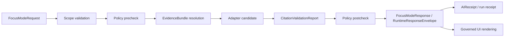

<!-- [KFM_META_BLOCK_V2]
doc_id: kfm://doc/contracts-ai-focus-mode-response-readme
title: contracts/ai/focus_mode_response/ — Focus Mode Response Contract
type: readme
version: v0.1
status: draft
owners: OWNER_TBD — Governed AI steward · Contract steward · Schema steward · Policy steward · Evidence steward · API steward · UI steward · Docs steward
created: 2026-06-20
updated: 2026-06-20
policy_label: public; contracts; ai; focus-mode; response-contract; semantic-contract; finite-outcome; cite-or-abstain
related:
  - ../../README.md
  - ../focus_mode_request/README.md
  - ../../../docs/architecture/governed-ai/FOCUS_FLOW.md
  - ../../../docs/architecture/governed-ai/ADAPTER_CONTRACT.md
  - ../../../contracts/focus_mode/focus_mode_payload.md
  - ../../../schemas/contracts/v1/focus/
  - ../../../schemas/contracts/v1/ai/
  - ../../../schemas/contracts/v1/evidence/
  - ../../../schemas/contracts/v1/policy/
  - ../../../schemas/contracts/v1/runtime/
  - ../../../policy/focus/
  - ../../../data/receipts/ai/
  - ../../../data/proofs/
  - ../../../release/
tags: [kfm, contracts, ai, governed-ai, focus-mode, focus-mode-response, runtime-response-envelope, evidence-bundle, policy-decision, citation-validation, ai-receipt, finite-outcome, cite-or-abstain, semantic-contract, governance]
notes:
  - "Draft directory README for the requested contracts/ai/focus_mode_response path."
  - "Path posture is PROPOSED / NEEDS VERIFICATION: Focus Flow points to schemas/contracts/v1/focus/ and runtime envelope schemas as proposed homes; older semantic payload contract exists under contracts/focus_mode/."
  - "This README defines response-side semantic boundaries, not machine schema, prompt text, raw model output, adapter code, policy, receipts, release state, API route implementation, or UI behavior."
  - "Focus Mode responses are finite governed envelopes; generated language must be subordinate to EvidenceBundle, PolicyDecision, review state, release state, and CitationValidationReport."
  - "Raw model output must never be returned directly to public clients."
[/KFM_META_BLOCK_V2] -->

<a id="top"></a>

# Focus Mode Response Contract

> Directory contract for the semantic meaning of a Focus Mode response: a finite, policy-checked, citation-validated, receipted response envelope. It is not raw model output, not a prompt result, not a released payload by itself, not an API route, and not UI behavior.

<p>
  
  
  
  
  
  
</p>

`contracts/ai/focus_mode_response/`

## Quick jumps

[Status](#status) · [Scope](#scope) · [Path posture](#path-posture) · [Repo fit](#repo-fit) · [Accepted outputs](#accepted-outputs) · [Exclusions](#exclusions) · [Response semantics](#response-semantics) · [Outcome carriers](#outcome-carriers) · [Citation and policy gates](#citation-and-policy-gates) · [Lifecycle and trust boundary](#lifecycle-and-trust-boundary) · [Validation](#validation) · [Evidence basis](#evidence-basis) · [Rollback](#rollback) · [Definition of done](#definition-of-done)

---

## Status

> [!IMPORTANT]
> **Status:** `draft` / directory README  
> **Owner:** `OWNER_TBD`  
> **Path:** `contracts/ai/focus_mode_response/`  
> **Path posture:** `PROPOSED` / `NEEDS VERIFICATION`  
> **Truth posture:** `CONFIRMED` current README path and file update; Focus Mode response flow and governed-AI invariants are supported by architecture docs; machine schema, validators, fixtures, routes, policy bundles, receipts, CI behavior, UI rendering, and runtime implementation remain `NEEDS VERIFICATION`.

---

## Scope

`contracts/ai/focus_mode_response/` is the requested semantic contract directory for Focus Mode response meaning.

A Focus Mode response is the governed envelope returned after request scope validation, policy precheck, evidence resolution, adapter execution, citation validation, and policy postcheck. It may carry a cited answer, an abstention, a denial, or an error. It must always preserve finite outcome semantics and auditability.

This directory describes response semantics and trust boundaries. It does not define JSON Schema, prompt templates, adapter code, policy code, API routes, model behavior, released payloads, public UI rendering, AIReceipt storage, proof closure, or publication authority.

---

## Path posture

The requested path is:

```text
contracts/ai/focus_mode_response/
```

Related paths in current repo evidence include:

```text
contracts/ai/focus_mode_request/README.md
contracts/focus_mode/focus_mode_payload.md
docs/architecture/governed-ai/FOCUS_FLOW.md
schemas/contracts/v1/focus/              # PROPOSED in Focus Flow
schemas/contracts/v1/runtime/            # PROPOSED runtime envelope home
policy/focus/                            # PROPOSED in Focus Flow
```

This README does not settle whether the canonical semantic contract home should live under `contracts/ai/focus_mode_response/`, `contracts/focus_mode/`, `contracts/runtime/`, or another accepted path. Any migration or consolidation must use an ADR or migration note.

---

## Repo fit

```text
contracts/
├── ai/
│   ├── focus_mode_request/
│   │   └── README.md
│   └── focus_mode_response/
│       └── README.md
└── focus_mode/
    └── focus_mode_payload.md
```

Adjacent responsibility roots:

| Root | Relationship to this directory |
|---|---|
| `../focus_mode_request/README.md` | Request-side semantic contract that precedes this response contract. |
| `../../../docs/architecture/governed-ai/FOCUS_FLOW.md` | Governs request → policy → evidence → adapter → citation → policy → envelope flow. |
| `../../../docs/architecture/governed-ai/ADAPTER_CONTRACT.md` | Defines adapter boundary, finite outcomes, receipts, and no raw model output. |
| `../../../contracts/focus_mode/focus_mode_payload.md` | Older semantic contract for released Focus Mode payload projection, not response envelope semantics. |
| `../../../schemas/contracts/v1/focus/` | Proposed machine schema home for Focus Mode request/response shapes. |
| `../../../schemas/contracts/v1/runtime/` | Proposed runtime response envelope schema home. |
| `../../../policy/focus/` | Proposed policy postcheck and response restriction home. |
| `../../../data/proofs/` | EvidenceBundle and proof families. |
| `../../../data/receipts/ai/` | Proposed AIReceipt/run trace output; not proof closure. |
| `../../../release/` | Release state and rollback posture. |

---

## Accepted outputs

| Response element | Required posture |
|---|---|
| `outcome` | Required closed enum: `ANSWER`, `ABSTAIN`, `DENY`, or `ERROR`. Unknown values fail closed. |
| `answer_text` | Allowed only for `ANSWER`; every consequential claim must cite validated evidence. |
| `citations[]` | Required for `ANSWER`; every citation must resolve through CitationValidationReport to EvidenceBundle. |
| `evidence_used[]` | Required for `ANSWER`; references EvidenceBundle IDs actually used. |
| `policy_decisions[]` | Required where policy allowed, denied, restricted, or shaped response content. |
| `abstain_reason` | Required for `ABSTAIN`; must identify evidence gap, staleness, conflict, or citation failure. |
| `deny_reason` | Required for `DENY`; must be safe to display and must not leak restricted details. |
| `error_code` | Required for `ERROR`; must be finite and actionable without leaking internals. |
| `citation_validation_report_id` | Required before `ANSWER`; may also appear for `ABSTAIN` caused by citation failure. |
| `ai_receipt_id` | Required when adapter/model was invoked; records bounded context and outcome path. |
| `correlation_id` | Required for audit trail and request/response pairing. |

---

## Exclusions

| Does not belong here | Correct home |
|---|---|
| JSON Schema for FocusModeResponse or RuntimeResponseEnvelope | `../../../schemas/contracts/v1/focus/` or `../../../schemas/contracts/v1/runtime/`. |
| Raw model provider output | Adapter trace stores / receipts after policy filtering; never public response. |
| Prompt templates | Template registry or adapter configuration after accepted placement. |
| Model adapter code | Governed AI adapter implementation roots after accepted placement. |
| Policy postcheck rules | `../../../policy/focus/` or accepted policy home. |
| EvidenceBundle content | `../../../data/proofs/` and evidence workflows. |
| AIReceipt records | `../../../data/receipts/ai/` or accepted receipt home. |
| Released Focus Mode payloads | `../../../data/published/` after release gates. |
| API routes and DTO implementation | Governed API/app roots after verification. |
| Public UI rendering | Governed UI roots after release and policy gates. |

---

## Response semantics

A Focus Mode response is valid only when it is a governed envelope. It is not whatever the model returns.

Minimum semantic rules:

- exactly one finite outcome must be present;
- `ANSWER` requires resolved EvidenceBundle support and passing citation validation;
- `ABSTAIN` must not emit substitute claims;
- `DENY` must not leak restricted geometry, identities, source internals, or sensitive detail;
- `ERROR` must be bounded and must not silently downgrade to `ANSWER`;
- policy postcheck must run after the adapter candidate and before user display;
- every adapter invocation must be receipted;
- public clients must receive governed envelopes, never raw model output.

---

## Outcome carriers

| Outcome | Allowed response content | Required carrier fields |
|---|---|---|
| `ANSWER` | Cited answer text, evidence references, policy state, citation report, receipt. | `answer_text`, `citations[]`, `evidence_used[]`, `policy_decisions[]`, `citation_validation_report_id`, `ai_receipt_id` when adapter invoked. |
| `ABSTAIN` | Evidence-gap or citation-failure explanation; optional next safe action. | `abstain_reason`, optional `evidence_gap[]`, optional `citation_validation_report_id`, `ai_receipt_id` when adapter invoked. |
| `DENY` | Safe denial reason and optional generalized alternative pointer. | `deny_reason`, `policy_decisions[]`, `ai_receipt_id` if adapter was invoked before postcheck denial. |
| `ERROR` | Finite diagnostic code and safe message. | `error_code`, `correlation_id`, no claim leakage. |

---

## Citation and policy gates

A response may not be treated as an `ANSWER` unless all of these are true:

1. request scope was valid;
2. policy precheck allowed the request;
3. EvidenceRef values resolved to EvidenceBundle;
4. adapter received only admissible bounded context;
5. candidate answer cited evidence spans;
6. CitationValidationReport passed;
7. policy postcheck allowed the cited candidate;
8. receipt linkage was recorded;
9. output envelope passed schema validation.

Any failed gate produces `ABSTAIN`, `DENY`, or `ERROR`, depending on the gate and reason.

---

## Lifecycle and trust boundary



This directory defines response-side semantics. It does not authorize direct model output, direct RAW/WORK/QUARANTINE reads, direct public display from candidate stores, or release.

---

## Validation

Before relying on this directory, verify:

- canonical contract home is resolved by Directory Rules, ADR, or migration note;
- matching FocusModeResponse and RuntimeResponseEnvelope schemas exist and validate in accepted schema homes;
- outcome enum is closed and fail-closed;
- `ANSWER` requires EvidenceBundle references and passing CitationValidationReport;
- `ABSTAIN`, `DENY`, and `ERROR` each have required reason/code fields;
- policy postcheck is enforced after adapter candidate generation;
- response envelope cannot include raw model output or restricted details;
- every adapter invocation has AIReceipt linkage;
- public API/UI surfaces consume only governed envelopes;
- public clients do not read raw, work, quarantine, canonical stores, unpublished candidates, vector indexes, graph stores, credentials, or raw provider responses.

---

## Evidence basis

| Source | Status | Supports | Limits |
|---|---|---|---|
| `contracts/ai/focus_mode_response/README.md` before this edit | `CONFIRMED` | Target file existed but was blank. | No contract content before this edit. |
| `contracts/ai/focus_mode_request/README.md` | `CONFIRMED` | Request-side companion contract, accepted inputs, finite outcomes, and governed request path. | Request contract is not response contract. |
| `docs/architecture/governed-ai/FOCUS_FLOW.md` | `CONFIRMED` | Focus Mode flow, finite outcomes, citation validation, policy postcheck, and envelope response path. | Specific paths and implementation details remain proposed. |
| `docs/architecture/governed-ai/ADAPTER_CONTRACT.md` | `CONFIRMED` | Evidence outranks generation, no browser-to-model path, cite-or-abstain, finite outcomes, receipts, and adapter as interpretive layer. | TypeScript-like surfaces and file paths remain proposed. |
| `contracts/focus_mode/focus_mode_payload.md` | `CONFIRMED` | Existing semantic payload contract distinguishes FocusModePayload from machine schema and requires evidence, policy, promotion, finite outcomes, and public-safe payload handling. | Payload projection is not the same as response envelope. |
| `contracts/README.md` | `CONFIRMED` | Contracts define semantic meaning; schemas define machine shape. | Root README is brief and does not settle AI contract pathing. |

---

## Rollback

Rollback is required if this README is used to justify returning raw model output, bypassing citation validation, bypassing policy postcheck, treating receipts as proof closure, schema authority, policy authority, released-payload authority, API route implementation, UI rendering, or publication authority.

Rollback target: initial blank file content SHA `8b137891791fe96927ad78e64b0aad7bded08bdc`.

---

## Definition of done

- [ ] Owners are confirmed and `OWNER_TBD` is replaced.
- [ ] Canonical AI/Focus response contract home is resolved by ADR or migration note.
- [ ] Matching FocusModeResponse and RuntimeResponseEnvelope schemas exist in accepted schema homes.
- [ ] `ANSWER` validation requires EvidenceBundle references and passing CitationValidationReport.
- [ ] `ABSTAIN`, `DENY`, and `ERROR` validation requires bounded reason/code fields.
- [ ] Policy postcheck is implemented and verified.
- [ ] Response envelopes cannot carry raw provider output or restricted details.
- [ ] AIReceipt/run receipt linkage is implemented and verified.
- [ ] Tests deny direct model output, direct browser-to-model path, and direct RAW/WORK/QUARANTINE access.
- [ ] Public API/UI surfaces consume only governed envelopes, never raw model output.

---

## Status summary

`contracts/ai/focus_mode_response/` is a draft semantic contract directory for Focus Mode response meaning. It is not the machine schema, not raw model output, not prompt text, not adapter code, not policy code, not a released payload contract, not an API implementation, not UI rendering, not an AIReceipt store, not a release decision, and not publication authority.

<p align="right"><a href="#top">Back to top</a></p>
