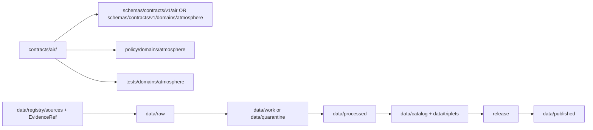

<!-- [KFM_META_BLOCK_V2]
doc_id: kfm://doc/contracts-air-readme
title: contracts/air/ — Air / Atmosphere Semantic Contracts
type: readme
version: v0.1
status: draft
owners: OWNER_TBD — Atmosphere steward · Air steward · Contract steward · Schema steward · Policy steward · Data steward · Docs steward
created: 2026-06-20
updated: 2026-06-20
policy_label: public; contracts; air; atmosphere; semantic-contracts; compatibility-path; slug-conflict
related:
  - ../README.md
  - ../../docs/domains/atmosphere/README.md
  - ../../docs/domains/atmosphere/API_CONTRACTS.md
  - ../../docs/domains/atmosphere/MAP_UI_CONTRACTS.md
  - ../../docs/domains/atmosphere/CANONICAL_PATHS.md
  - ../../docs/architecture/smoke-atmosphere-hazards.md
  - ../../docs/doctrine/directory-rules.md
  - ../../schemas/contracts/v1/air/
  - ../../schemas/contracts/v1/domains/atmosphere/
  - ../../policy/domains/atmosphere/
  - ../../tests/domains/atmosphere/
  - ../../fixtures/domains/atmosphere/
  - ../../data/registry/sources/
  - ../../data/proofs/
  - ../../release/
tags: [kfm, contracts, air, atmosphere, semantic-contracts, object-families, weather, air-quality, smoke-context, aod, climate, source-role, evidence, governance]
notes:
  - "Draft directory README for the current contracts/air compatibility folder."
  - "Path posture is CONFLICTED / NEEDS VERIFICATION: Atmosphere domain docs explicitly identify schema/contract slug drift between air and atmosphere."
  - "This README does not settle canonical contract placement; migration requires ADR or migration note."
  - "Contracts define semantic meaning; machine-checkable shape belongs in schemas/contracts/v1/air/ or schemas/contracts/v1/domains/atmosphere/ only after canonical placement is settled."
  - "Atmosphere/Air contracts are not emergency advisories, not life-safety direction, not model truth, and not public release authority."
[/KFM_META_BLOCK_V2] -->

<a id="top"></a>

# Air / Atmosphere Semantic Contracts

> Directory contract for Air / Atmosphere object-family Markdown semantics. This folder documents meaning, boundaries, and trust posture; it does not define JSON Schema, policy, source data, emergency guidance, release decisions, or public API/UI behavior.

<p>
  
  
  
  
  
  
</p>

`contracts/air/`

## Quick jumps

[Status](#status) · [Scope](#scope) · [Path posture](#path-posture) · [Repo fit](#repo-fit) · [Accepted inputs](#accepted-inputs) · [Exclusions](#exclusions) · [Current directory snapshot](#current-directory-snapshot) · [Contract inventory](#contract-inventory) · [Semantic contract rules](#semantic-contract-rules) · [Source-role and anti-collapse rules](#source-role-and-anti-collapse-rules) · [Lifecycle and trust boundary](#lifecycle-and-trust-boundary) · [Validation](#validation) · [Evidence basis](#evidence-basis) · [Rollback](#rollback) · [Definition of done](#definition-of-done)

---

## Status

> [!IMPORTANT]
> **Status:** `draft` / directory README  
> **Owner:** `OWNER_TBD`  
> **Path:** `contracts/air/`  
> **Path posture:** `CONFLICTED` / `NEEDS VERIFICATION` against `contracts/domains/atmosphere/` and schema slug variants  
> **Truth posture:** `CONFIRMED` current README path and file update; Atmosphere/Air domain meaning is supported by domain docs; full contract inventory, canonical path, schemas, validators, fixtures, policy bundles, and CI behavior remain `NEEDS VERIFICATION`.

---

## Scope

`contracts/air/` is the current compatibility folder for Air / Atmosphere semantic contracts.

Contracts in this folder should describe **semantic meaning** for air-quality, weather, smoke/aerosol, climate, and advisory-context object families: what an object means, which identity attributes are load-bearing, what source roles may apply, what sensitivity or public-safety posture constrains the object, what it must not be confused with, and what downstream validation must prove.

This folder does **not** define JSON Schema, executable validators, policy bundles, raw source data, processed records, catalog/triplet records, proof closure, emergency advisories, life-safety direction, release decisions, public API DTOs, public UI behavior, or map display behavior.

---

## Path posture

The requested path is:

```text
contracts/air/
```

Atmosphere domain docs explicitly identify slug drift between `air` and `atmosphere` contract/schema homes. Candidate homes include:

```text
contracts/air/
contracts/domains/atmosphere/
schemas/contracts/v1/air/
schemas/contracts/v1/domains/atmosphere/
```

This README keeps the requested path usable while surfacing the conflict. It does not move, delete, redirect, or canonicalize any file.

| Path | Status | Meaning |
|---|---|---|
| `contracts/air/` | `CONFIRMED` current requested folder path | Compatibility folder currently being filled. |
| `contracts/domains/atmosphere/` | `PROPOSED` in Atmosphere docs / Directory Rules style | Likely domain-contract home; requires ADR or migration note before becoming canonical. |
| `schemas/contracts/v1/air/` | `PROPOSED`/legacy slug variant | Machine schema candidate; not verified as canonical here. |
| `schemas/contracts/v1/domains/atmosphere/` | `PROPOSED` Directory Rules-style schema home | Machine schema candidate; not replaced by Markdown contracts. |

---

## Repo fit

```text
contracts/
├── README.md
└── air/
    └── README.md
```

Adjacent responsibility roots:

| Root | Relationship to this folder |
|---|---|
| `../README.md` | Root contracts guidance: contracts define meaning; schemas define shape. |
| `../../docs/domains/atmosphere/` | Domain doctrine, object families, scope boundaries, source roles, and verification backlog. |
| `../../schemas/contracts/v1/air/` | Candidate machine schema home using `air` slug. |
| `../../schemas/contracts/v1/domains/atmosphere/` | Candidate machine schema home using `domains/atmosphere` path. |
| `../../policy/domains/atmosphere/` | Policy and sensitivity gates. |
| `../../tests/domains/atmosphere/` | Expected validators/contract tests. |
| `../../fixtures/domains/atmosphere/` | Expected examples and fixtures. |
| `../../data/registry/sources/` | SourceDescriptor and source activation authority. |
| `../../release/` | Release decisions and rollback state. |

---

## Accepted inputs

| Belongs in this directory | Required posture |
|---|---|
| Markdown semantic contracts | Define meaning, identity, source-role boundaries, sensitivity posture, and validation expectations. |
| Object-family contract READMEs | Must preserve KFM lifecycle, trust membrane, cite-or-abstain, source-role anti-collapse, and policy-aware release rules. |
| Compatibility notes | Must clearly label `air` / `atmosphere` path conflicts and migration requirements. |
| Evidence ledgers | Must cite Atmosphere domain docs, source-family docs, root contract guidance, and current file evidence. |
| Validation checklists | Must point to schemas/tests/policy roots without claiming they exist unless verified. |
| Rollback notes | Must name prior content SHA or migration rollback target. |

---

## Exclusions

| Does not belong here | Correct home |
|---|---|
| JSON Schema or machine-checkable shape | `../../schemas/contracts/v1/air/`, `../../schemas/contracts/v1/domains/atmosphere/`, or accepted schema home. |
| Policy bundles, sensitivity rules, emergency redirect logic | `../../policy/domains/atmosphere/` and Hazards policy surfaces. |
| SourceDescriptor records | `../../data/registry/sources/`. |
| Raw, work, quarantine, processed, catalog, triplet, or published data | `../../data/...` lifecycle roots. |
| EvidenceBundle or proof closure | `../../data/proofs/` and proof workflows. |
| Release decisions | `../../release/`. |
| Emergency alerting or life-safety direction | Official issuing authorities and Hazards-lane redirect context. |
| Public API DTOs and route behavior | Governed API/app roots after verification. |
| Public UI/map behavior | Governed UI/app roots after release and policy gates. |
| Canonical path migration | ADR or migration note, not this README alone. |

---

## Current directory snapshot

> [!NOTE]
> This snapshot is based on current-session file inspection, not a complete repository inventory.

| File | Status | What it proves | What it does not prove |
|---|---|---|---|
| `contracts/air/README.md` | `CONFIRMED` | This directory README exists and states compatibility-folder boundaries. | Does not settle canonical placement. |
| Other `contracts/air/*` files | `UNKNOWN` | Not verified by this README. | Requires separate inventory. |

---

## Contract inventory

| Object family | Current contract | Canonical-path posture | Schema posture |
|---|---|---|---|
| `AirStation` | `UNKNOWN` | `CONFLICTED` / `NEEDS VERIFICATION` | Candidate homes require ADR. |
| `AirObservation` | `UNKNOWN` | `CONFLICTED` / `NEEDS VERIFICATION` | Candidate homes require ADR. |
| `PM25Observation` | `UNKNOWN` | `CONFLICTED` / `NEEDS VERIFICATION` | Candidate homes require ADR. |
| `OzoneObservation` | `UNKNOWN` | `CONFLICTED` / `NEEDS VERIFICATION` | Candidate homes require ADR. |
| `SmokeContext` | `UNKNOWN` | `CONFLICTED` / `NEEDS VERIFICATION` | Candidate homes require ADR. |
| `AODRaster` | `UNKNOWN` | `CONFLICTED` / `NEEDS VERIFICATION` | Candidate homes require ADR. |
| `WeatherStation` | `UNKNOWN` | `CONFLICTED` / `NEEDS VERIFICATION` | Candidate homes require ADR. |
| `WeatherObservation` | `UNKNOWN` | `CONFLICTED` / `NEEDS VERIFICATION` | Candidate homes require ADR. |
| `WindField` | `UNKNOWN` | `CONFLICTED` / `NEEDS VERIFICATION` | Candidate homes require ADR. |
| `PrecipitationObservation` | `UNKNOWN` | `CONFLICTED` / `NEEDS VERIFICATION` | Candidate homes require ADR. |
| `TemperatureObservation` | `UNKNOWN` | `CONFLICTED` / `NEEDS VERIFICATION` | Candidate homes require ADR. |
| `ClimateNormal` | `UNKNOWN` | `CONFLICTED` / `NEEDS VERIFICATION` | Candidate homes require ADR. |
| `ClimateAnomaly` | `UNKNOWN` | `CONFLICTED` / `NEEDS VERIFICATION` | Candidate homes require ADR. |
| `ForecastContext` | `UNKNOWN` | `CONFLICTED` / `NEEDS VERIFICATION` | Candidate homes require ADR. |
| `AdvisoryContext` | `UNKNOWN` | `CONFLICTED` / `NEEDS VERIFICATION` | Candidate homes require ADR. |

---

## Semantic contract rules

Every Air / Atmosphere contract in this folder must state:

- object meaning;
- owning domain and cross-lane dependencies;
- accepted inputs and exclusions;
- identity-bearing fields;
- source-role constraints;
- temporal and measurement units that matter;
- sensitivity, caveat, and public-safety posture;
- EvidenceRef, EvidenceBundle, and SourceDescriptor expectations;
- lifecycle boundaries;
- validation requirements;
- rollback path;
- definition of done.

---

## Source-role and anti-collapse rules

Air / Atmosphere contracts must preserve the domain’s anti-collapse rules:

- AQI is not concentration;
- AOD is not PM2.5;
- model fields are not observations;
- low-cost sensor outputs require correction, caveats, confidence, and limitations before public release;
- smoke and advisory context are not emergency/life-safety direction;
- atmosphere evidence may support agriculture, hydrology, biodiversity, settlement, or hazard context without owning those domains’ canonical claims.

---

## Lifecycle and trust boundary



Contracts describe meaning. They do not move data, validate schemas, make policy decisions, close evidence, issue alerts, direct user action, or publish.

---

## Validation

Before relying on this directory, verify:

- canonical `air` vs `atmosphere` contract/schema home is resolved by Directory Rules, ADR, or migration note;
- every Atmosphere object family has exactly one semantic contract home or a documented compatibility redirect;
- matching JSON Schemas exist in the accepted schema home;
- policy bundles exist for sensitivity, official-source redirection, caveats, release, and denial outcomes;
- SourceDescriptor and EvidenceRef requirements are testable;
- validators cover identity, source role, temporal logic, units, geometry/coverage, evidence closure, sensitivity, caveats, and release gates;
- public API/UI surfaces do not read raw, work, quarantine, or unreleased contract-derived material directly;
- release and rollback records exist for promoted public surfaces.

---

## Evidence basis

| Source | Status | Supports | Limits |
|---|---|---|---|
| `contracts/air/README.md` before this edit | `CONFIRMED` | Target file existed but was blank. | No contract-directory content before this edit. |
| `contracts/README.md` | `CONFIRMED` | Contracts define semantic meaning and pair with schemas; executable validation, JSON Schema, policy code, and source data do not belong in contracts. | Root README is brief and does not settle air/atmosphere path conflict. |
| `docs/domains/atmosphere/README.md` | `CONFIRMED` | Atmosphere/Air/Climate scope, canonical object-family list, non-emergency posture, source-role anti-collapse rules, and explicit `air` vs `atmosphere` slug conflict. | Does not prove schemas or validators exist. |

---

## Rollback

Rollback is required if this README is used to claim that `contracts/air/` is canonical despite unresolved `air` / `atmosphere` slug drift, or if it is used to justify schema, policy, source-data, alerting, emergency guidance, release, API, UI, or public-claim authority.

Rollback target: initial blank file content SHA `8b137891791fe96927ad78e64b0aad7bded08bdc`.

---

## Definition of done

- [ ] Canonical `air` vs `atmosphere` contract path conflict is resolved by ADR or migration note.
- [ ] Owners are confirmed and `OWNER_TBD` is replaced.
- [ ] All Atmosphere object-family contract files are inventoried.
- [ ] Every contract has a matching schema or documented `NEEDS VERIFICATION` gap.
- [ ] Policy bundles are linked and verified.
- [ ] Tests and fixtures are linked and verified.
- [ ] SourceDescriptor and EvidenceRef requirements are testable.
- [ ] Anti-collapse checks cover AQI/concentration, AOD/PM2.5, model/observation, advisory/emergency, and cross-domain claim boundaries.
- [ ] Release and rollback requirements are linked to release records.
- [ ] No schema, policy, source data, proof, release, API, UI, alerting, emergency guidance, or publication authority is asserted from this folder.

---

## Status summary

`contracts/air/` is a compatibility folder for Air / Atmosphere semantic contracts. It is not yet confirmed as the canonical Atmosphere contract home. It is not a schema home, policy home, source registry, data lifecycle root, proof root, emergency alerting system, release authority, public API surface, public UI surface, or publication authority.

<p align="right"><a href="#top">Back to top</a></p>
