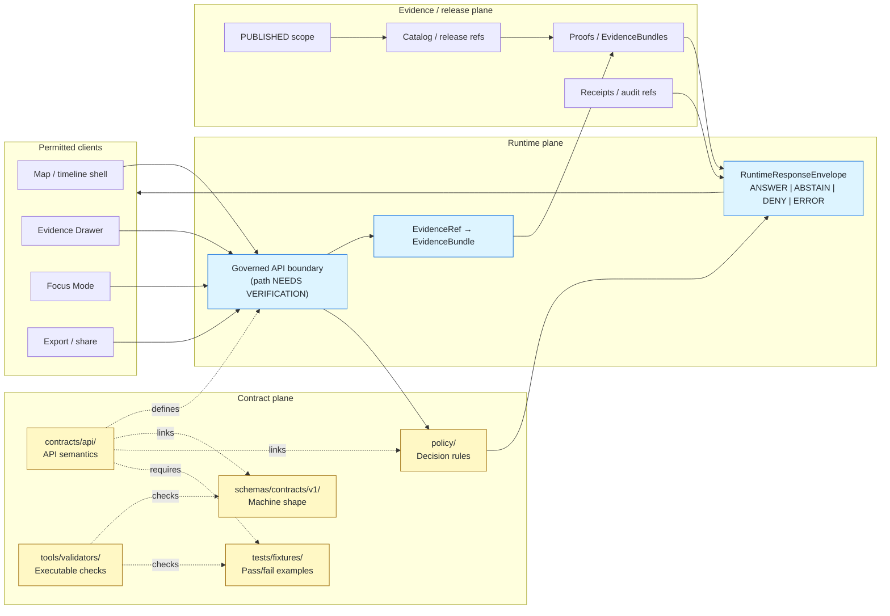

<!-- [KFM_META_BLOCK_V2]
doc_id: kfm://doc/NEEDS_VERIFICATION__contracts_api_readme
title: API Contracts
type: standard
version: v1
status: draft
owners: NEEDS_VERIFICATION
created: NEEDS_VERIFICATION__YYYY-MM-DD
updated: NEEDS_VERIFICATION__YYYY-MM-DD
policy_label: NEEDS_VERIFICATION__public_or_internal
related: [../README.md, ../../schemas/README.md, ../../policy/README.md, ../../tests/fixtures/README.md, ../../tools/validators/README.md, ../../data/receipts/README.md, ../../data/proofs/README.md, ../../docs/adr/README.md]
tags: [kfm, contracts, api, governed-api, evidence, runtime-envelope]
notes: [Target path requested for contracts/api/README.md. Current-session workspace did not expose a mounted KFM checkout; owner, dates, policy label, exact sibling paths, and executable validation commands need branch-level verification before merge.]
[/KFM_META_BLOCK_V2] -->

<a id="top"></a>

# API Contracts

Human-readable contract lane for KFM governed API request/response semantics, finite outcomes, and trust-visible payload obligations.

> [!IMPORTANT]
> **Status:** `experimental`  
> **Owners:** `NEEDS_VERIFICATION`  
> **Path:** `contracts/api/README.md`  
> **Repo fit:** child contract lane under [`../README.md`](../README.md), paired with schema, policy, fixture, validator, receipt, proof, and runtime implementation surfaces.  
> **Quick jumps:** [Scope](#scope) · [Repo fit](#repo-fit) · [Accepted inputs](#accepted-inputs) · [Exclusions](#exclusions) · [Directory tree](#directory-tree) · [Quickstart](#quickstart) · [Usage](#usage) · [Diagram](#diagram) · [Contract surfaces](#contract-surfaces) · [Outcome grammar](#outcome-grammar) · [Definition of done](#definition-of-done) · [FAQ](#faq) · [Appendix](#appendix)
>
> 
> 
> 
> 
> 
> 

> [!NOTE]
> **CONFIRMED:** This README is written for the requested path and grounded in KFM doctrine.  
> **UNKNOWN:** Current active-branch contents under `contracts/api/`, route names, DTO names, OpenAPI files, validators, workflow YAML, and runtime behavior were not directly inspectable in this session.  
> **Rule:** Do not upgrade a contract described here from `PROPOSED` to `CONFIRMED` until a branch-backed file, schema, fixture, validator, emitted artifact, or test proves it.

---

## Scope

`contracts/api/` documents the **governed API contract layer**: the promises KFM makes about what API surfaces accept, emit, refuse, cite, and preserve when a public, steward, review, Focus, map, export, or runtime surface crosses the trust membrane.

This directory is for **API meaning**, not raw implementation.

It should make the following inspectable:

- what request context is required before a consequential API response is emitted;
- how `EvidenceRef` values resolve to `EvidenceBundle` support;
- how `DecisionEnvelope` and `RuntimeResponseEnvelope` outcomes are shaped;
- how `ANSWER`, `ABSTAIN`, `DENY`, and `ERROR` remain first-class states;
- how release scope, review state, rights, sensitivity, freshness, correction lineage, and audit references travel with API responses;
- how UI surfaces such as the Evidence Drawer and Focus Mode consume governed payloads without reading raw stores, unpublished candidates, model runtimes, or internal handles directly.

### Status vocabulary used in this README

| Label | Meaning here |
|---|---|
| **CONFIRMED** | Supported by KFM doctrine or directly inspected current-session evidence. |
| **INFERRED** | Conservative structural conclusion from adjacent KFM docs, not direct implementation proof. |
| **PROPOSED** | Recommended contract shape, file family, or review rule pending repo verification. |
| **UNKNOWN** | Not verifiable from the visible workspace. |
| **NEEDS VERIFICATION** | Specific branch-backed check required before merge or before stronger wording. |
| **CONFLICTED** | Multiple possible homes or terms exist; resolve with an ADR before multiplying authority. |

[Back to top](#top)

---

## Repo fit

**Path:** `contracts/api/README.md`  
**Role:** API-specific child lane for human-readable governed API contracts.  
**Primary job:** define API payload meaning, finite outcomes, evidence obligations, policy visibility, compatibility expectations, and consumer boundaries.  
**Not this lane:** route handlers, storage adapters, source ingestion, policy authorship, machine-schema authority, emitted receipts/proofs, or UI rendering code.

> [!WARNING]
> The links below are the expected control-plane neighbors for this README. Re-check them against the target branch before merge, especially if the repo uses `apps/governed_api/` rather than `apps/api/`, or if `contracts/` and `schemas/` authority has been resolved differently.

| Direction | Surface | Relationship | Truth label |
|---|---|---|---|
| Parent | [`../README.md`](../README.md) | Contract-lane hub; should explain contract/schema/policy/fixture split. | **NEEDS VERIFICATION** |
| Root | [`../../README.md`](../../README.md) | Project orientation and trust posture. | **NEEDS VERIFICATION** |
| Schema authority | [`../../schemas/README.md`](../../schemas/README.md) | Machine-readable schema home and validation expectations. | **NEEDS VERIFICATION** |
| Runtime schema family | [`../../schemas/contracts/v1/runtime/README.md`](../../schemas/contracts/v1/runtime/README.md) | Likely home for runtime envelope schemas if current branch follows the surfaced pattern. | **NEEDS VERIFICATION** |
| Policy authority | [`../../policy/README.md`](../../policy/README.md) | Deny/abstain/allow rules, obligations, and role-sensitive decisions. | **NEEDS VERIFICATION** |
| Fixture surface | [`../../tests/fixtures/README.md`](../../tests/fixtures/README.md) | Valid/invalid request and response examples. | **NEEDS VERIFICATION** |
| Validator surface | [`../../tools/validators/README.md`](../../tools/validators/README.md) | Contract, schema, citation, catalog, and policy validators. | **NEEDS VERIFICATION** |
| Receipts | [`../../data/receipts/README.md`](../../data/receipts/README.md) | Process-memory outputs, not API contracts. | **NEEDS VERIFICATION** |
| Proofs | [`../../data/proofs/README.md`](../../data/proofs/README.md) | Proof bundles and evidence closure artifacts, not route code. | **NEEDS VERIFICATION** |
| ADRs | [`../../docs/adr/README.md`](../../docs/adr/README.md) | Schema-home, route-family, and compatibility decisions. | **NEEDS VERIFICATION** |
| Runtime implementation | `../../apps/api/` or `../../apps/governed_api/` | API code should consume these contracts; exact path is branch-dependent. | **UNKNOWN** |

[Back to top](#top)

---

## Accepted inputs

The following belong in `contracts/api/` when the branch confirms this lane as the API contract home.

| Accepted input | Why it belongs here | Minimum review burden |
|---|---|---|
| Route-family contract docs | Describe public/steward/review/Focus API behavior without claiming route implementation. | Contract + API reviewer |
| Request/response envelope docs | Stabilize field meaning before runtime code emits payloads. | Contract + schema reviewer |
| Finite outcome semantics | Preserve `ANSWER`, `ABSTAIN`, `DENY`, and `ERROR` as governed behavior. | Contract + policy reviewer |
| Evidence Drawer payload semantics | Keep support, source roles, freshness, sensitivity, review state, and correction lineage visible to clients. | Shell/UI + contract reviewer |
| Focus request/response semantics | Bound model-assisted synthesis to released evidence and policy-safe context. | AI/runtime + contract reviewer |
| API error and negative-state docs | Prevent silent fallbacks and vague success states. | Policy + API reviewer |
| Compatibility notes | Explain versioning, breaking changes, aliases, deprecations, and rollback references. | Contract reviewer |
| Small illustrative examples | Help reviewers see intended shape while pointing to real fixtures elsewhere. | Schema/test reviewer |
| OpenAPI surface references | Allowed only if the branch or ADR confirms OpenAPI files belong under `contracts/api/`. | Contract + schema-home reviewer |

[Back to top](#top)

---

## Exclusions

| Does **not** belong here | Go there instead | Reason |
|---|---|---|
| Route handlers, middleware, service code, adapter code | `apps/api/`, `apps/governed_api/`, or repo-native runtime path | Contract docs must not masquerade as implementation. |
| Machine-readable JSON Schema authority | `schemas/contracts/v1/` unless an ADR says otherwise | Keeps prose meaning and executable validation distinct. |
| Rego / policy bundles | `policy/` | Policy decides; contracts describe payload shape and visible obligations. |
| Valid/invalid fixture corpora | `tests/fixtures/` or repo-native fixture home | Fixtures prove contracts but should not be buried in prose docs. |
| Validator implementations | `tools/validators/` or repo-native tooling home | Validators enforce the contract; they are not the contract. |
| Run receipts, AI receipts, audit logs | `data/receipts/` or emitted runtime storage | Receipts are process memory, not API contract source. |
| Evidence bundles, proof packs, catalog closure outputs | `data/proofs/`, `data/catalog/`, or release artifact home | Proof objects support API responses but are not route docs. |
| Raw, work, quarantine, or unpublished source data | `data/raw/`, `data/work/`, `data/quarantine/` with governed access only | Public and normal UI paths must not read these directly. |
| UI component implementation | `apps/web/`, `web/`, or repo-native UI path | The API contract can shape payloads; it does not render them. |
| Model prompts or provider adapters | AI/runtime package path after verification | API contracts must not become a direct model-client path. |

[Back to top](#top)

---

## Directory tree

> [!CAUTION]
> **PROPOSED structure.** Use this layout only if the active branch does not already define a stronger `contracts/api/` convention. Do not create a parallel authority tree.

```text
contracts/api/
├── README.md
├── routes/
│   └── README.md
├── envelopes/
│   ├── README.md
│   ├── decision-envelope.md
│   ├── runtime-response-envelope.md
│   └── negative-state-payload.md
├── focus/
│   ├── README.md
│   ├── focus-query-request.md
│   └── focus-query-response.md
├── evidence-drawer/
│   ├── README.md
│   └── evidence-drawer-payload.md
├── review/
│   ├── README.md
│   └── governed-review-actions.md
├── exports/
│   ├── README.md
│   └── export-share-payload.md
├── examples/
│   ├── README.md
│   ├── answer.example.json
│   ├── abstain.example.json
│   ├── deny.example.json
│   └── error.example.json
└── openapi/
    └── README.md
```

### Naming rules

| Pattern | Use |
|---|---|
| `*-request.md` | Request contract semantics. |
| `*-response.md` | Response contract semantics. |
| `*-payload.md` | UI/API payload contract whose schema lives elsewhere. |
| `*-envelope.md` | Finite governed outcome object. |
| `*.example.json` | Small inline example only; canonical fixtures should live under tests. |
| `README.md` | Directory role, exclusions, links, and definition of done. |

[Back to top](#top)

---

## Quickstart

Use this sequence when adding or revising an API contract.

1. **Name the surface.** Identify whether the change is a route family, envelope, drawer payload, Focus payload, review action, export payload, or negative-state object.
2. **Locate the authority.** Confirm whether prose belongs in `contracts/api/` and machine shape belongs in `schemas/contracts/v1/`.
3. **Write the contract first.** Document scope, fields, outcome states, evidence obligations, policy obligations, and exclusions.
4. **Add or link schema.** Link the exact schema path, or mark it `NEEDS VERIFICATION` if the schema does not exist yet.
5. **Add pass/fail examples.** Provide one positive example and at least one negative example through the fixture surface.
6. **Define validation.** Link a validator, test, or CI gate, or explicitly mark executable coverage as `UNKNOWN`.
7. **Update downstream docs.** Ensure parent contracts, schema, policy, fixture, and runtime docs know the contract exists.
8. **Preserve rollback.** Document compatibility behavior and how clients should handle superseded or withdrawn payloads.

### Validation command placeholder

```text
# NEEDS VERIFICATION:
# Replace with the repo-native validator command after inspecting package manager,
# schema tooling, policy tooling, and CI workflow conventions.

<repo-validator> contracts/api/ schemas/contracts/v1/ tests/fixtures/
```

[Back to top](#top)

---

## Usage

### When documenting a governed route family

A route-family contract should answer:

- what actor or surface may call it;
- what scope must be supplied or inherited;
- which policy prechecks run before retrieval;
- which evidence or release scope is admissible;
- which finite outcomes are possible;
- which response envelope is emitted;
- which audit, receipt, or proof references must be linkable;
- which raw or internal resources are explicitly unreachable.

### When documenting an envelope

An envelope contract should make these seams visible:

- outcome grammar;
- reason codes;
- obligations;
- evidence references;
- policy decision reference;
- release and review state;
- freshness and sensitivity;
- correction and rollback references;
- audit reconstruction handles.

### When documenting Focus or model-assisted API behavior

Focus contracts must preserve the governed chain:

1. scope resolution;
2. policy precheck;
3. released evidence planning;
4. `EvidenceRef` → `EvidenceBundle` resolution;
5. bounded context assembly;
6. adapter call if allowed;
7. structured output validation;
8. citation validation;
9. policy postcheck;
10. `RuntimeResponseEnvelope` emission;
11. audit/log joins.

> [!IMPORTANT]
> Focus Mode is not a direct model client. It is an evidence-bounded API consumer that receives governed envelopes.

[Back to top](#top)

---

## Diagram



[Back to top](#top)

---

## Contract surfaces

| Surface | Contract role | Must include | Must never do | Status |
|---|---|---|---|---|
| Route-family contract | Defines externally meaningful behavior for a route group. | Scope, actor class, request shape, response shape, finite outcomes, links to schemas and fixtures. | Claim the route is implemented without inspected code or tests. | **PROPOSED** |
| `DecisionEnvelope` | Carries allow / deny / abstain / error-style decision state. | Outcome, reason codes, obligations, policy reference, audit reference. | Collapse policy decisions into a generic message string. | **PROPOSED** |
| `RuntimeResponseEnvelope` | Public/API runtime result wrapper. | Outcome, scope echo, evidence refs, release refs, policy state, freshness, review state, correction/audit refs. | Emit fluent prose without inspectable support. | **PROPOSED** |
| `EvidenceDrawerPayload` | Trust-visible support payload for claims, layers, Focus output, review, and export. | Source roles, support state, time basis, rights/sensitivity, review, freshness, correction lineage. | Behave like an optional tooltip or developer-only appendix. | **PROPOSED** |
| `FocusQueryRequest` | Scoped request to model-assisted or synthesis surfaces. | Place/time/surface scope, actor context, release scope, evidence constraints. | Permit raw prompt access to unpublished scope. | **PROPOSED** |
| `FocusQueryResponse` | Evidence-bounded synthesis response. | Finite outcome, citations, evidence refs, refusal reason, audit ref. | Become a detached chatbot transcript. | **PROPOSED** |
| `NegativeStatePayload` | User- and operator-legible non-answer result. | Safe reason codes, next proof needed when safe, audit ref, denial/abstain/error distinction. | Leak restricted asset existence or silently widen scope. | **PROPOSED** |
| Review action contract | Steward decision surface. | Actor, target, expected digest/version, decision, reason, receipt/audit link. | Implement client-side file mutation shortcuts. | **PROPOSED** |
| Export/share payload | Outward artifact contract. | Release/provenance state, trust cues, policy context, correction state. | Strip trust cues or generalization context. | **PROPOSED** |

[Back to top](#top)

---

## Outcome grammar

Every consequential API response should resolve to a finite state.

| Outcome | Meaning | Typical trigger | API obligation |
|---|---|---|---|
| `ANSWER` | The requested response is supported and policy-safe. | Evidence resolves, citations validate, policy permits, release scope is current enough. | Include evidence, release, review, freshness, sensitivity, and audit references. |
| `ABSTAIN` | KFM cannot support a safe answer. | Missing, stale, partial, conflicted, unresolved, or insufficient evidence. | Explain safe reason codes and preserve scope/audit context. |
| `DENY` | KFM may not provide the requested response. | Rights, sensitivity, actor role, publication state, or policy block. | Reveal only policy-safe denial context; do not leak restricted facts. |
| `ERROR` | Technical failure prevents reliable execution. | Resolver failure, validator failure, unavailable dependency, malformed request. | Fail closed and expose a stable audit/failure category. |

### Illustrative runtime envelope

> [!NOTE]
> This example is **illustrative**. Field names and schema IDs remain `NEEDS VERIFICATION` until linked to branch-backed schemas and fixtures.

```json
{
  "request_id": "kfm://request/NEEDS_VERIFICATION",
  "outcome": "ANSWER",
  "scope": {
    "place_ref": "kfm://place/NEEDS_VERIFICATION",
    "time_basis": "as_of",
    "as_of": "YYYY-MM-DD",
    "surface_class": "focus"
  },
  "reason_codes": [],
  "obligations": [],
  "evidence_refs": [
    "kfm://evidence-ref/NEEDS_VERIFICATION"
  ],
  "evidence_bundle_refs": [
    "kfm://bundle/NEEDS_VERIFICATION"
  ],
  "decision_ref": "kfm://decision/NEEDS_VERIFICATION",
  "policy_state": "allow",
  "release_ref": "kfm://release/NEEDS_VERIFICATION",
  "review_state": "promoted",
  "freshness": "current",
  "sensitivity": "public",
  "correction_ref": null,
  "audit_ref": "kfm://audit/NEEDS_VERIFICATION"
}
```

[Back to top](#top)

---

## Compatibility and versioning

API contracts should be versioned by **meaningful compatibility**, not by document churn.

| Change type | Version action | Required evidence |
|---|---|---|
| Editorial clarification | No schema version bump. | Reviewer confirms no field or behavior change. |
| New optional field | Minor contract note; schema compatibility check. | Valid fixture still passes; new fixture added. |
| Required field added | Breaking change; new version or migration plan. | Negative fixture proves old payload fails intentionally. |
| Outcome grammar change | ADR required. | Policy, schema, UI, fixtures, and runtime consumers reviewed together. |
| Field meaning change | Breaking change even if field name stays the same. | Migration note, deprecation path, rollback behavior. |
| Route-family relocation | ADR or compatibility note. | Old path behavior and client transition documented. |

[Back to top](#top)

---

## Definition of done

A contract change under `contracts/api/` is reviewable when all applicable checks below are satisfied.

- [ ] The contract states **scope**, **accepted inputs**, **exclusions**, and **not-this-lane** boundaries.
- [ ] The contract identifies whether it is `CONFIRMED`, `INFERRED`, `PROPOSED`, `UNKNOWN`, or `NEEDS VERIFICATION`.
- [ ] The contract links to parent contract docs and adjacent schema, policy, fixture, validator, receipt, proof, and runtime surfaces.
- [ ] The contract includes finite outcome behavior for `ANSWER`, `ABSTAIN`, `DENY`, and `ERROR` where applicable.
- [ ] The contract includes a safe negative-state path; missing evidence does not become guessed success.
- [ ] The contract identifies required evidence refs, release refs, policy state, review state, freshness, sensitivity, correction refs, and audit refs where consequential.
- [ ] A schema exists or the schema gap is explicitly marked `NEEDS VERIFICATION`.
- [ ] Valid and invalid fixtures exist or the fixture gap is explicitly marked `NEEDS VERIFICATION`.
- [ ] A validator or test exists or executable coverage is explicitly marked `UNKNOWN`.
- [ ] No contract instructs a public client, UI surface, or Focus path to access RAW, WORK, QUARANTINE, canonical stores, graph stores, model runtimes, internal service handles, credentials, or unpublished candidate data directly.
- [ ] Breaking changes include compatibility notes, deprecation guidance, and rollback/correction references.
- [ ] Parent README or object map is updated if this contract adds or renames a shared object family.

[Back to top](#top)

---

## FAQ

### Is this directory the source of truth for JSON Schema?

No. By default, `contracts/api/` is the human-readable API contract lane. Machine-readable schemas should live in the repo’s schema authority home, likely `schemas/contracts/v1/`, unless an ADR says otherwise.

### Can this directory contain OpenAPI files?

Only after branch verification or an ADR. If OpenAPI files live here, they should reference shared schemas rather than duplicate field law.

### Can a contract mention a route that is not implemented yet?

Yes, but only as `PROPOSED`. Do not present route names, DTO names, middleware behavior, or runtime outcomes as current implementation until code, tests, or emitted runtime evidence proves them.

### Why are negative outcomes part of API contracts?

Because `ABSTAIN`, `DENY`, and `ERROR` are not UI failures in KFM. They are governed states that preserve evidence discipline, policy boundaries, and user trust.

### What is the safest first API contract to formalize?

A small `RuntimeResponseEnvelope` or `EvidenceDrawerPayload` contract with one `ANSWER` fixture and one negative-state fixture is the safest first slice because it proves finite outcomes, evidence linkage, policy visibility, and UI trust behavior without requiring broad domain coverage.

[Back to top](#top)

---

## Appendix

<details>
<summary>Appendix A — Contract checklist for reviewers</summary>

| Question | Pass condition |
|---|---|
| Is the contract clearly bounded? | It states what it covers and what it does not cover. |
| Does it preserve KFM’s truth path? | It does not bypass governed lifecycle or release scope. |
| Does it preserve cite-or-abstain? | Unsupported claims return `ABSTAIN`, `DENY`, or `ERROR`. |
| Does it expose trust state? | Evidence, policy, freshness, sensitivity, review, correction, and audit context are visible where meaningful. |
| Does it avoid authority collapse? | Contracts, schemas, policy, fixtures, validators, receipts, and proofs remain distinct. |
| Does it avoid implementation overclaim? | Runtime behavior remains `UNKNOWN` or `PROPOSED` unless proved. |
| Does it protect sensitive state? | Denial and error detail do not leak restricted existence or exact sensitive data. |
| Does it support rollback? | Breaking changes carry version and rollback/correction notes. |

</details>

<details>
<summary>Appendix B — Suggested companion files if this lane is expanded</summary>

| Companion file | Purpose | Truth label |
|---|---|---|
| `contracts/api/envelopes/runtime-response-envelope.md` | Human-readable runtime envelope contract. | **PROPOSED** |
| `contracts/api/evidence-drawer/evidence-drawer-payload.md` | Evidence Drawer payload obligations. | **PROPOSED** |
| `contracts/api/focus/focus-query-request.md` | Scoped Focus request contract. | **PROPOSED** |
| `contracts/api/focus/focus-query-response.md` | Evidence-bounded Focus response contract. | **PROPOSED** |
| `contracts/api/envelopes/negative-state-payload.md` | Shared `ABSTAIN` / `DENY` / `ERROR` payload semantics. | **PROPOSED** |
| `contracts/api/review/governed-review-actions.md` | Steward action route contract. | **PROPOSED** |
| `contracts/api/examples/answer.example.json` | Minimal positive example. | **PROPOSED** |
| `contracts/api/examples/deny.example.json` | Minimal denial example. | **PROPOSED** |

</details>

<details>
<summary>Appendix C — Known verification backlog</summary>

- [ ] Confirm whether `contracts/api/` exists in the active branch.
- [ ] Confirm owner routing for `contracts/api/`.
- [ ] Confirm whether API contract prose belongs under `contracts/api/`, `contracts/runtime/`, `docs/api/`, or another existing home.
- [ ] Confirm whether machine schemas live in `schemas/contracts/v1/`, `contracts/`, or a split/mirrored structure.
- [ ] Confirm current runtime implementation path: `apps/api/`, `apps/governed_api/`, or another path.
- [ ] Confirm whether OpenAPI files already exist and where they are authoritative.
- [ ] Confirm schema validator command and CI workflow names.
- [ ] Confirm policy engine/tooling and reason-code vocabulary.
- [ ] Confirm existing fixtures for `RuntimeResponseEnvelope`, `DecisionEnvelope`, `EvidenceDrawerPayload`, and Focus request/response objects.
- [ ] Confirm emitted proof/receipt examples before marking runtime maturity as `CONFIRMED`.

</details>

[Back to top](#top)
