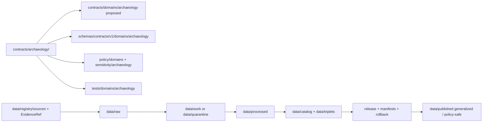

<!-- [KFM_META_BLOCK_V2]
doc_id: kfm://doc/contracts-archaeology-readme
title: contracts/archaeology/ — Archaeology Semantic Contracts
type: readme
version: v0.1
status: draft
owners: OWNER_TBD — Archaeology steward · Contract steward · Schema steward · Sensitivity reviewer · Rights-holder representative · Release steward · Docs steward
created: 2026-06-20
updated: 2026-06-20
policy_label: public; contracts; archaeology; cultural-heritage; semantic-contracts; compatibility-path; sensitive-domain; deny-by-default
related:
  - ../README.md
  - ../../docs/domains/archaeology/CANONICAL_PATHS.md
  - ../../docs/domains/archaeology/SENSITIVITY.md
  - ../../docs/domains/archaeology/PUBLICATION_AND_POLICY.md
  - ../../docs/domains/archaeology/API_CONTRACTS.md
  - ../../docs/domains/archaeology/MAP_UI_CONTRACTS.md
  - ../../docs/domains/archaeology/IDENTITY_MODEL.md
  - ../../docs/domains/archaeology/VALIDATORS.md
  - ../../docs/runbooks/archaeology/PROMOTION_RUNBOOK.md
  - ../../docs/runbooks/archaeology/ROLLBACK_RUNBOOK.md
  - ../../contracts/domains/archaeology/
  - ../../schemas/contracts/v1/domains/archaeology/
  - ../../policy/domains/archaeology/
  - ../../policy/sensitivity/archaeology/
  - ../../data/registry/sources/
  - ../../data/proofs/
  - ../../release/
tags: [kfm, contracts, archaeology, cultural-heritage, semantic-contracts, sensitive-domain, deny-by-default, redaction, sovereignty, care, exact-location-denial, release-gates, governance]
notes:
  - "Draft directory README for the current contracts/archaeology compatibility folder."
  - "Path posture is CONFLICTED / LINEAGE / NEEDS VERIFICATION: archaeology canonical-paths doctrine resolves in favor of contracts/domains/archaeology/ while Atlas/ENCY lineage used contracts/archaeology/."
  - "This README does not settle canonical contract placement; migration requires ADR or migration note."
  - "Contracts define semantic meaning; machine-checkable shape belongs in schemas/contracts/v1/domains/archaeology/ or another accepted schema home."
  - "Archaeology is a sensitive domain: exact site location, burial/human-remains context, sacred-site context, collection-security detail, and looting-risk exposure fail closed unless governed redaction/review/release gates close."
[/KFM_META_BLOCK_V2] -->

<a id="top"></a>

# Archaeology Semantic Contracts

> Compatibility directory contract for Archaeology / Cultural Heritage object-family Markdown semantics. This folder documents meaning, boundaries, and trust posture; it does not define JSON Schema, policy, source data, exact-location release, release decisions, public API behavior, public UI behavior, or publication authority.

<p>
  
  
  
  
  
  
</p>

`contracts/archaeology/`

## Quick jumps

[Status](#status) · [Scope](#scope) · [Path posture](#path-posture) · [Repo fit](#repo-fit) · [Accepted inputs](#accepted-inputs) · [Exclusions](#exclusions) · [Current directory snapshot](#current-directory-snapshot) · [Contract inventory](#contract-inventory) · [Semantic contract rules](#semantic-contract-rules) · [Sensitivity and publication rules](#sensitivity-and-publication-rules) · [Lifecycle and trust boundary](#lifecycle-and-trust-boundary) · [Validation](#validation) · [Evidence basis](#evidence-basis) · [Rollback](#rollback) · [Definition of done](#definition-of-done)

---

## Status

> [!IMPORTANT]
> **Status:** `draft` / directory README  
> **Owner:** `OWNER_TBD`  
> **Path:** `contracts/archaeology/`  
> **Path posture:** `CONFLICTED` / `LINEAGE` / `NEEDS VERIFICATION` against `contracts/domains/archaeology/`  
> **Truth posture:** `CONFIRMED` current README path and file update; archaeology sensitivity and placement doctrine are supported by current docs; full contract inventory, canonical path, schemas, validators, fixtures, policy bundles, release manifests, and CI behavior remain `NEEDS VERIFICATION`.

---

## Scope

`contracts/archaeology/` is the current compatibility folder for Archaeology / Cultural Heritage semantic contracts.

Contracts in this folder should describe **semantic meaning** for archaeology object families: what an object means, which identity attributes are load-bearing, what source roles may apply, what rights/sensitivity/sovereignty posture constrains the object, what it must not be confused with, and what downstream validation must prove.

This folder does **not** define JSON Schema, executable validators, policy bundles, source data, raw/work/quarantine records, processed records, catalog/triplet records, proof closure, release decisions, public API DTOs, public UI behavior, map display behavior, exact site-location publication, or sensitive-location release authority.

---

## Path posture

The requested path is:

```text
contracts/archaeology/
```

Archaeology canonical-paths documentation surfaces and resolves a path-form conflict in favor of the Directory Rules-style path:

```text
contracts/domains/archaeology/
schemas/contracts/v1/domains/archaeology/
```

This README keeps the requested compatibility path usable while surfacing the conflict. It does not move, delete, redirect, or canonicalize any file.

| Path | Status | Meaning |
|---|---|---|
| `contracts/archaeology/` | `CONFIRMED` current requested folder path | Compatibility / lineage folder currently being filled. |
| `contracts/domains/archaeology/` | `PROPOSED` / Directory Rules-preferred in canonical-paths doc | Likely canonical semantic contract home; requires ADR or migration note before repository-wide enforcement. |
| `schemas/contracts/v1/archaeology/` | `LINEAGE` / shorthand in Atlas/ENCY style | Machine schema shorthand, not canonicalized by this README. |
| `schemas/contracts/v1/domains/archaeology/` | `PROPOSED` Directory Rules-style schema home | Machine schema candidate; not replaced by Markdown contracts. |

---

## Repo fit

```text
contracts/
├── README.md
└── archaeology/
    └── README.md
```

Adjacent responsibility roots:

| Root | Relationship to this folder |
|---|---|
| `../README.md` | Root contracts guidance: contracts define meaning; schemas define shape. |
| `../../docs/domains/archaeology/` | Domain doctrine, placement, sensitivity, policy, API, UI, validators, and runbooks. |
| `../../contracts/domains/archaeology/` | Directory Rules-style candidate semantic contract home. |
| `../../schemas/contracts/v1/domains/archaeology/` | Candidate machine schema home. |
| `../../policy/domains/archaeology/`, `../../policy/sensitivity/archaeology/` | Policy, sensitivity, redaction, release, consent, and denial gates. |
| `../../data/registry/sources/` | SourceDescriptor and source activation authority. |
| `../../data/proofs/` | EvidenceBundle and proof families. |
| `../../release/` | Release decisions and rollback state. |

---

## Accepted inputs

| Belongs in this directory | Required posture |
|---|---|
| Markdown semantic contracts | Define meaning, identity, source-role boundaries, sensitivity posture, and validation expectations. |
| Object-family contract READMEs | Must preserve KFM lifecycle, trust membrane, cite-or-abstain, source-role anti-collapse, sovereignty, and policy-aware release rules. |
| Compatibility notes | Must clearly label `contracts/archaeology/` vs `contracts/domains/archaeology/` conflicts and migration requirements. |
| Evidence ledgers | Must cite archaeology domain docs, canonical-path docs, sensitivity docs, publication policy docs, root contract guidance, and current file evidence. |
| Validation checklists | Must point to schemas/tests/policy roots without claiming they exist unless verified. |
| Rollback notes | Must name prior content SHA or migration rollback target. |

---

## Exclusions

| Does not belong here | Correct home |
|---|---|
| JSON Schema or machine-checkable shape | `../../schemas/contracts/v1/domains/archaeology/` or accepted schema home. |
| Policy bundles, sensitivity rules, consent/revocation rules, redaction profiles | `../../policy/domains/archaeology/`, `../../policy/sensitivity/archaeology/`, and related policy roots. |
| SourceDescriptor records | `../../data/registry/sources/`. |
| Raw, work, quarantine, processed, catalog, triplet, or published data | `../../data/...` lifecycle roots. |
| EvidenceBundle or proof closure | `../../data/proofs/` and proof workflows. |
| RedactionReceipt, ReviewRecord, PolicyDecision, ReleaseManifest data | Receipt/proof/policy/release roots after accepted placement. |
| Release decisions | `../../release/`. |
| Exact sensitive-location release | Denied unless governed redaction/review/release gates close. |
| Public API DTOs and route behavior | Governed API/app roots after verification. |
| Public UI/map behavior | Governed UI/app roots after release and policy gates. |
| Canonical path migration | ADR or migration note, not this README alone. |

---

## Current directory snapshot

> [!NOTE]
> This snapshot is based on current-session file inspection, not a complete repository inventory.

| File | Status | What it proves | What it does not prove |
|---|---|---|---|
| `contracts/archaeology/README.md` | `CONFIRMED` | This directory README exists and states compatibility-folder boundaries. | Does not settle canonical placement. |
| Other `contracts/archaeology/*` files | `UNKNOWN` | Not verified by this README. | Requires separate inventory. |

---

## Contract inventory

This compatibility folder does not currently prove any object-family contract files beyond this README.

| Contract family | Current contract | Canonical-path posture | Schema posture |
|---|---|---|---|
| Archaeology site/object records | `UNKNOWN` | `CONFLICTED` / `NEEDS VERIFICATION` | Candidate homes require ADR or migration note. |
| Cultural knowledge / oral history records | `UNKNOWN` | `CONFLICTED` / `NEEDS VERIFICATION` | Requires consent, sovereignty, and revocation controls. |
| Redacted/public aggregate surfaces | `UNKNOWN` | `CONFLICTED` / `NEEDS VERIFICATION` | Requires redaction/aggregation receipts and release manifests. |
| Remote-sensing / derived candidate records | `UNKNOWN` | `CONFLICTED` / `NEEDS VERIFICATION` | Requires candidate-vs-confirmed and sensitive-geometry controls. |

---

## Semantic contract rules

Every Archaeology contract in this folder must state:

- object meaning;
- owning domain and cross-lane dependencies;
- accepted inputs and exclusions;
- identity-bearing fields;
- source-role constraints;
- temporal fields and evidence lineage;
- rights, sovereignty, CARE, consent, embargo, and revocation posture where applicable;
- sensitivity tier and per-record sensitivity rank;
- redaction/generalization requirements;
- EvidenceRef, EvidenceBundle, SourceDescriptor, ReviewRecord, PolicyDecision, and receipt expectations;
- lifecycle boundaries;
- validation requirements;
- rollback path;
- definition of done.

---

## Sensitivity and publication rules

Archaeology contracts must preserve the sensitive-domain rules:

- exact sensitive site geometry fails closed by default;
- burial/human-remains context, sacred-site context, collection-security detail, and looting-risk exposure fail closed;
- public transformations require named redaction/generalization posture, review, receipts, policy decision, and release state;
- sovereignty and rights-holder review must be represented where applicable;
- cultural knowledge and oral-history records require consent, revocation, embargo, and cache-invalidation posture where applicable;
- aggregate or generalized public products must not be reverse-joined to sensitive records;
- AI and public UI surfaces must cite or abstain and must not reveal restricted detail.

---

## Lifecycle and trust boundary



Contracts describe meaning. They do not move data, validate schemas, make policy decisions, close evidence, release exact locations, direct public display, or publish.

---

## Validation

Before relying on this directory, verify:

- canonical `contracts/archaeology/` vs `contracts/domains/archaeology/` home is resolved by Directory Rules, ADR, or migration note;
- every archaeology object family has exactly one semantic contract home or a documented compatibility redirect;
- matching JSON Schemas exist in the accepted schema home;
- policy bundles exist for sensitivity, redaction, consent, sovereignty review, release, and denial outcomes;
- SourceDescriptor and EvidenceRef requirements are testable;
- validators cover identity, source role, temporal logic, geometry/coverage, evidence closure, sensitivity rank, audience tier, CARE/sovereignty posture, review state, and release gates;
- public API/UI surfaces do not read raw, work, quarantine, candidate, or unreleased contract-derived material directly;
- release and rollback records exist for promoted public surfaces;
- exact sensitive-location exposure is denied unless policy, receipt, review, and release gates explicitly allow a safe transformed representation.

---

## Evidence basis

| Source | Status | Supports | Limits |
|---|---|---|---|
| `contracts/archaeology/README.md` before this edit | `CONFIRMED` | Target file existed but was blank. | No contract-directory content before this edit. |
| `contracts/README.md` | `CONFIRMED` | Contracts define semantic meaning and pair with schemas; executable validation, JSON Schema, policy code, and source data do not belong in contracts. | Root README is brief and does not settle archaeology path conflict. |
| `docs/domains/archaeology/CANONICAL_PATHS.md` | `CONFIRMED` | Archaeology path conflict is surfaced and resolved toward `contracts/domains/archaeology/` under Directory Rules; exact-location denial and release prerequisites are threaded through placement guidance. | Specific paths remain proposed until repo verification or ADR. |
| `docs/domains/archaeology/SENSITIVITY.md` | `CONFIRMED` | Deny-by-default posture, T4/rank-5 defaults, redaction receipts, CARE/sovereignty, consent/revocation, and sensitivity-review discipline. | Does not prove contracts or schemas exist. |
| `docs/domains/archaeology/PUBLICATION_AND_POLICY.md` | `CONFIRMED` | Trust membrane, publication controls, release/review/rollback posture, policy decisions, governed API surfaces, and AI citation discipline. | Navigational governance, not machine enforcement. |

---

## Rollback

Rollback is required if this README is used to claim that `contracts/archaeology/` is canonical despite current canonical-path guidance, or if it is used to justify schema, policy, source-data, exact-location release, proof, release, API, UI, AI, or public-claim authority.

Rollback target: initial blank file content SHA `8b137891791fe96927ad78e64b0aad7bded08bdc`.

---

## Definition of done

- [ ] Canonical `contracts/archaeology/` vs `contracts/domains/archaeology/` conflict is resolved by ADR or migration note.
- [ ] Owners are confirmed and `OWNER_TBD` is replaced.
- [ ] All archaeology object-family contract files are inventoried.
- [ ] Every contract has a matching schema or documented `NEEDS VERIFICATION` gap.
- [ ] Policy bundles for sensitivity, sovereignty, consent, redaction, release, and denial are linked and verified.
- [ ] Tests and fixtures are linked and verified.
- [ ] SourceDescriptor and EvidenceRef requirements are testable.
- [ ] RedactionReceipt, PolicyDecision, ReviewRecord, ReleaseManifest, and rollback requirements are testable.
- [ ] Public API/UI/AI surfaces deny exact sensitive-location exposure by default.
- [ ] No schema, policy, source data, proof, release, API, UI, AI, exact-location release, or publication authority is asserted from this folder.

---

## Status summary

`contracts/archaeology/` is a compatibility folder for Archaeology / Cultural Heritage semantic contracts. Current canonical-path guidance prefers `contracts/domains/archaeology/`, so this folder is not confirmed as canonical. It is not a schema home, policy home, source registry, data lifecycle root, proof root, release authority, exact-location release surface, public API surface, public UI surface, AI answer source, or publication authority.

<p align="right"><a href="#top">Back to top</a></p>
