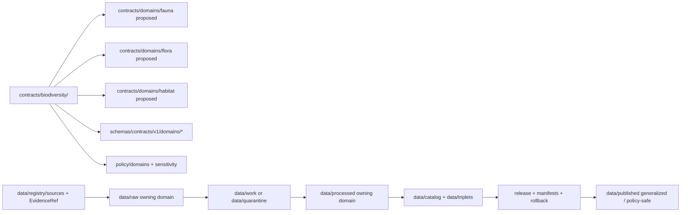

<!-- [KFM_META_BLOCK_V2]
doc_id: kfm://doc/contracts-biodiversity-readme
title: contracts/biodiversity/ — Biodiversity Semantic Contracts
type: readme
version: v0.1
status: draft
owners: OWNER_TBD — Biodiversity steward · Flora steward · Fauna steward · Habitat steward · Contract steward · Schema steward · Sensitivity steward · Data steward · Docs steward
created: 2026-06-20
updated: 2026-06-20
policy_label: public; contracts; biodiversity; semantic-contracts; cross-domain; compatibility-path; geoprivacy-sensitive
tags: [kfm, contracts, biodiversity, ecology, flora, fauna, habitat, semantic-contracts, rare-species, geoprivacy, source-role, evidence, governance]
related:
  - ../README.md
  - ../../docs/architecture/ecology-cross-domain.md
  - ../../docs/domains/fauna/
  - ../../docs/domains/flora/
  - ../../docs/domains/habitat/
  - ../../docs/domains/habitat/SENSITIVITY_AND_GEOPRIVACY.md
  - ../../docs/runbooks/SENSITIVITY_ESCALATION.md
  - ../../schemas/contracts/v1/domains/fauna/
  - ../../schemas/contracts/v1/domains/flora/
  - ../../schemas/contracts/v1/domains/habitat/
  - ../../policy/domains/fauna/
  - ../../policy/domains/flora/
  - ../../policy/domains/habitat/
  - ../../data/registry/sources/
  - ../../data/proofs/
  - ../../release/
notes:
  - "Draft directory README for the current contracts/biodiversity compatibility folder."
  - "Path posture is PROPOSED / NEEDS VERIFICATION: repo doctrine treats ecology/biodiversity as cross-domain composition, not a sovereign domain root."
  - "This README does not create a biodiversity domain, schema home, policy home, data lifecycle root, or publication authority."
  - "Atomic biodiversity facts remain with owning bounded contexts such as fauna, flora, and habitat."
  - "Rare-species and sensitive-location handling fails closed; public-safe forms require geoprivacy/redaction, review, policy decision, receipts, and release state."
[/KFM_META_BLOCK_V2] -->

<a id="top"></a>

# Biodiversity Semantic Contracts

> Compatibility directory contract for Biodiversity semantic contracts. This folder may document cross-domain biodiversity contract meanings, but it must not become a parallel Ecology/Biodiversity domain or a second authority over Flora, Fauna, Habitat, Soil, Hydrology, Atmosphere, Hazards, Agriculture, or Geology facts.

<p>
  
  
  
  
  
  
</p>

`contracts/biodiversity/`

## Quick jumps

[Status](#status) · [Scope](#scope) · [Path posture](#path-posture) · [Repo fit](#repo-fit) · [Accepted inputs](#accepted-inputs) · [Exclusions](#exclusions) · [Current directory snapshot](#current-directory-snapshot) · [Contract inventory](#contract-inventory) · [Semantic contract rules](#semantic-contract-rules) · [Geoprivacy and sensitivity rules](#geoprivacy-and-sensitivity-rules) · [Lifecycle and trust boundary](#lifecycle-and-trust-boundary) · [Validation](#validation) · [Evidence basis](#evidence-basis) · [Rollback](#rollback) · [Definition of done](#definition-of-done)

---

## Status

> [!IMPORTANT]
> **Status:** `draft` / directory README  
> **Owner:** `OWNER_TBD`  
> **Path:** `contracts/biodiversity/`  
> **Path posture:** `PROPOSED` / `NEEDS VERIFICATION`; must not be treated as a sovereign domain root  
> **Truth posture:** `CONFIRMED` current README path and file update; cross-domain ecology/biodiversity posture is supported by architecture docs; full contract inventory, canonical path, schemas, validators, fixtures, policy bundles, and CI behavior remain `NEEDS VERIFICATION`.

---

## Scope

`contracts/biodiversity/` is a compatibility folder for cross-domain biodiversity semantic-contract documentation.

It may describe **composite meanings** such as biodiversity index, species richness layer, occurrence-derived public-safe summary, ecological suitability surface, or cross-lane biodiversity product **only when the atomic facts remain owned by their bounded domains**.

This folder does **not** define JSON Schema, executable validators, policy bundles, raw source data, raw occurrence records, processed occurrence records, catalog/triplet records, proof closure, rare-species exact-location release, release decisions, public API DTOs, public UI behavior, or map display behavior.

---

## Path posture

The requested path is:

```text
contracts/biodiversity/
```

Current repo doctrine treats ecology/biodiversity as cross-domain composition rather than a sovereign domain. Candidate owning homes for atomic contracts include:

```text
contracts/domains/fauna/
contracts/domains/flora/
contracts/domains/habitat/
schemas/contracts/v1/domains/fauna/
schemas/contracts/v1/domains/flora/
schemas/contracts/v1/domains/habitat/
```

This README keeps the requested path usable for cross-domain contract coordination, but it does not create a canonical `biodiversity` domain. Any migration, canonicalization, or creation of a biodiversity-wide contract family requires an ADR or migration note.

| Path | Status | Meaning |
|---|---|---|
| `contracts/biodiversity/` | `CONFIRMED` current requested folder path | Compatibility / coordination folder currently being filled. |
| `contracts/domains/fauna/` | `PROPOSED` owning-domain contract home | Fauna-owned atomic concepts such as animal taxon and occurrence. |
| `contracts/domains/flora/` | `PROPOSED` owning-domain contract home | Flora-owned atomic concepts such as plant taxon and rare plant record. |
| `contracts/domains/habitat/` | `PROPOSED` owning-domain contract home | Habitat-owned atomic concepts such as habitat patch and derived habitat products. |
| `schemas/contracts/v1/domains/*` | `PROPOSED` machine schema homes | Machine shape belongs here or another accepted schema home, not in this README. |

---

## Repo fit

```text
contracts/
├── README.md
└── biodiversity/
    └── README.md
```

Adjacent responsibility roots:

| Root | Relationship to this folder |
|---|---|
| `../README.md` | Root contracts guidance: contracts define meaning; schemas define shape. |
| `../../docs/architecture/ecology-cross-domain.md` | Cross-domain doctrine: ecology/biodiversity composition must not become a new domain authority. |
| `../../docs/domains/fauna/` | Fauna object meanings and occurrence sensitivity. |
| `../../docs/domains/flora/` | Flora object meanings and rare plant sensitivity. |
| `../../docs/domains/habitat/` | Habitat object meanings and geoprivacy mechanics. |
| `../../schemas/contracts/v1/domains/fauna/` | Candidate machine schema home for fauna contracts. |
| `../../schemas/contracts/v1/domains/flora/` | Candidate machine schema home for flora contracts. |
| `../../schemas/contracts/v1/domains/habitat/` | Candidate machine schema home for habitat contracts. |
| `../../policy/domains/*` | Policy, sensitivity, redaction, geoprivacy, release, and denial gates. |
| `../../data/registry/sources/` | SourceDescriptor and source activation authority. |
| `../../data/proofs/` | EvidenceBundle and proof families. |
| `../../release/` | Release decisions and rollback state. |

---

## Accepted inputs

| Belongs in this directory | Required posture |
|---|---|
| Cross-domain semantic contract READMEs | Define composite meaning without moving atomic ownership out of flora/fauna/habitat/etc. |
| Biodiversity product contracts | Must identify every contributing domain and every EvidenceBundle dependency. |
| Compatibility notes | Must clearly label `biodiversity` as compatibility/cross-domain unless an ADR says otherwise. |
| Evidence ledgers | Must cite cross-domain ecology doctrine, owning-domain docs, source-role rules, and current file evidence. |
| Validation checklists | Must point to schemas/tests/policy roots without claiming they exist unless verified. |
| Rollback notes | Must name prior content SHA or migration rollback target. |

---

## Exclusions

| Does not belong here | Correct home |
|---|---|
| Atomic fauna contracts | `../domains/fauna/` or accepted fauna contract home. |
| Atomic flora contracts | `../domains/flora/` or accepted flora contract home. |
| Atomic habitat contracts | `../domains/habitat/` or accepted habitat contract home. |
| JSON Schema or machine-checkable shape | `../../schemas/contracts/v1/domains/*` or accepted schema home. |
| Policy bundles, sensitivity rules, geoprivacy transform values | `../../policy/domains/*`, `../../policy/sensitivity/*`, or accepted policy home. |
| SourceDescriptor records | `../../data/registry/sources/`. |
| Raw, work, quarantine, processed, catalog, triplet, or published data | `../../data/...` lifecycle roots. |
| EvidenceBundle or proof closure | `../../data/proofs/` and proof workflows. |
| Release decisions | `../../release/`. |
| Rare-species exact-location release | Denied unless governed redaction/review/release gates close. |
| Public API DTOs and route behavior | Governed API/app roots after verification. |
| Public UI/map behavior | Governed UI/app roots after release and policy gates. |
| Creation of a new sovereign biodiversity/ecology domain | ADR/migration note only; this README cannot authorize it. |

---

## Current directory snapshot

> [!NOTE]
> This snapshot is based on current-session file inspection, not a complete repository inventory.

| File | Status | What it proves | What it does not prove |
|---|---|---|---|
| `contracts/biodiversity/README.md` | `CONFIRMED` | This directory README exists and states compatibility/cross-domain boundaries. | Does not settle canonical placement or create a domain. |
| Other `contracts/biodiversity/*` files | `UNKNOWN` | Not verified by this README. | Requires separate inventory. |

---

## Contract inventory

This compatibility folder does not currently prove any object-family contract files beyond this README.

| Contract family | Current contract | Owning-domain posture | Schema posture |
|---|---|---|---|
| Biodiversity index / richness layer | `UNKNOWN` | Cross-domain derived product; atomic facts owned by fauna/flora/habitat/etc. | Candidate homes require ADR or migration note. |
| Public-safe occurrence summary | `UNKNOWN` | Derived from fauna/flora occurrence records with geoprivacy gates. | Requires redaction/aggregation receipts and release manifests. |
| Habitat-linked biodiversity surface | `UNKNOWN` | Habitat output becomes sensitive when joined to sensitive fauna/flora records. | Requires geoprivacy and cross-lane policy. |
| Invasive species composite | `UNKNOWN` | Owning domain depends on plant/animal subtype and source role. | Requires subtype and source-role controls. |
| Conservation / suitability composite | `UNKNOWN` | Derived cross-domain product; must preserve all contributing EvidenceBundles. | Requires release and rollback state. |

---

## Semantic contract rules

Every Biodiversity contract in this folder must state:

- composite object meaning;
- contributing domains and owning domain for each atomic fact;
- accepted inputs and exclusions;
- identity-bearing fields;
- source-role constraints;
- taxonomic authority anchors where applicable;
- temporal fields and evidence lineage;
- sensitivity tier and geoprivacy state;
- redaction/generalization/aggregation requirements;
- EvidenceRef, EvidenceBundle, SourceDescriptor, ReviewRecord, PolicyDecision, and receipt expectations;
- lifecycle boundaries;
- validation requirements;
- rollback path;
- definition of done.

---

## Geoprivacy and sensitivity rules

Biodiversity contracts must preserve sensitive-location discipline:

- rare-species precise locations fail closed by default;
- nests, dens, roosts, hibernacula, spawning sites, rare plant locations, and steward-withheld places require geoprivacy review;
- habitat or suitability products can inherit sensitivity from joined fauna/flora records;
- public outputs require public-safe geometry, redaction/generalization/aggregation receipts, review, policy decision, and release state where applicable;
- aggregate or generalized products must not be reverse-joined to sensitive records;
- AI and public UI surfaces must cite or abstain and must not reveal restricted detail;
- ecology/biodiversity composites must preserve ownership and correction paths back to contributing domains.

---

## Lifecycle and trust boundary



Contracts describe meaning. They do not move data, validate schemas, make policy decisions, close evidence, release sensitive locations, create a biodiversity domain, direct public display, or publish.

---

## Validation

Before relying on this directory, verify:

- whether `contracts/biodiversity/` is retained as compatibility/cross-domain coordination or replaced by owning-domain contracts;
- every biodiversity-related object family has exactly one semantic contract home or a documented compatibility redirect;
- matching JSON Schemas exist in the accepted schema homes;
- policy bundles exist for sensitivity, geoprivacy, redaction, aggregation, release, and denial outcomes;
- SourceDescriptor and EvidenceRef requirements are testable;
- validators cover identity, source role, taxonomy, temporal logic, geometry/coverage, evidence closure, sensitivity rank, audience tier, review state, and release gates;
- public API/UI surfaces do not read raw, work, quarantine, candidate, or unreleased contract-derived material directly;
- release and rollback records exist for promoted public surfaces;
- sensitive-location exposure is denied unless policy, receipt, review, and release gates explicitly allow a safe transformed representation.

---

## Evidence basis

| Source | Status | Supports | Limits |
|---|---|---|---|
| `contracts/biodiversity/README.md` before this edit | `CONFIRMED` | Target file existed but was blank. | No contract-directory content before this edit. |
| `contracts/README.md` | `CONFIRMED` | Contracts define semantic meaning and pair with schemas; executable validation, JSON Schema, policy code, and source data do not belong in contracts. | Root README does not settle biodiversity pathing. |
| `docs/architecture/ecology-cross-domain.md` | `CONFIRMED` | Ecology is not a KFM domain; biodiversity/ecology concepts compose atoms owned by fauna, flora, habitat, soil, hydrology, atmosphere, hazards, agriculture, and geology; rare-species posture is deny-default. | It is architecture doctrine, not an implementation inventory. |
| `docs/domains/habitat/SENSITIVITY_AND_GEOPRIVACY.md` | `CONFIRMED` | Habitat geoprivacy is join-induced and derivation-induced; sensitive fauna/flora joins require public-safe geometry, receipts, and policy-controlled geoprivacy. | Does not define all biodiversity contracts. |

---

## Rollback

Rollback is required if this README is used to claim that `contracts/biodiversity/` is a sovereign domain root, to duplicate fauna/flora/habitat authority, or to justify schema, policy, source-data, sensitive-location release, proof, release, API, UI, AI, or public-claim authority.

Rollback target: initial blank file content SHA `8b137891791fe96927ad78e64b0aad7bded08bdc`.

---

## Definition of done

- [ ] Canonical biodiversity contract posture is resolved by ADR or migration note.
- [ ] Owners are confirmed and `OWNER_TBD` is replaced.
- [ ] All biodiversity-related semantic contracts are inventoried across fauna, flora, habitat, and cross-domain surfaces.
- [ ] Every contract has a matching schema or documented `NEEDS VERIFICATION` gap.
- [ ] Policy bundles for sensitivity, geoprivacy, redaction, aggregation, release, and denial are linked and verified.
- [ ] Tests and fixtures are linked and verified.
- [ ] SourceDescriptor and EvidenceRef requirements are testable.
- [ ] RedactionReceipt, AggregationReceipt, PolicyDecision, ReviewRecord, ReleaseManifest, and rollback requirements are testable.
- [ ] Public API/UI/AI surfaces deny sensitive-location exposure by default.
- [ ] No schema, policy, source data, proof, release, API, UI, AI, sensitive-location release, or publication authority is asserted from this folder.

---

## Status summary

`contracts/biodiversity/` is a compatibility and cross-domain coordination folder for biodiversity semantic contracts. It is not confirmed as a canonical domain contract home and must not become a parallel Ecology/Biodiversity domain. It is not a schema home, policy home, source registry, data lifecycle root, proof root, release authority, sensitive-location release surface, public API surface, public UI surface, AI answer source, or publication authority.

<p align="right"><a href="#top">Back to top</a></p>
