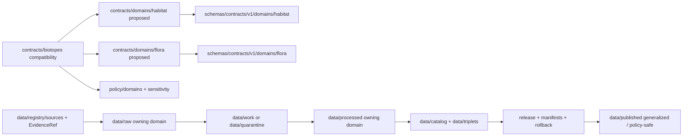

<!-- [KFM_META_BLOCK_V2]
doc_id: kfm://doc/contracts-biotopes-readme
title: contracts/biotopes/ — Biotopes Compatibility Contract Directory
type: readme
version: v0.1
status: draft
owners: OWNER_TBD — Habitat steward · Flora steward · Contract steward · Schema steward · Sensitivity steward · Data steward · Docs steward
created: 2026-06-20
updated: 2026-06-20
policy_label: public; contracts; biotopes; compatibility-path; non-canonical; habitat-sublane; semantic-contracts; geoprivacy-sensitive
related:
  - ../README.md
  - ../biodiversity/README.md
  - ../../docs/domains/habitat/sublanes/biotopes.md
  - ../../docs/domains/habitat/README.md
  - ../../docs/domains/habitat/SENSITIVITY_AND_GEOPRIVACY.md
  - ../../docs/domains/flora/README.md
  - ../../docs/domains/fauna/README.md
  - ../../schemas/contracts/v1/domains/habitat/
  - ../../schemas/contracts/v1/domains/flora/
  - ../../policy/domains/habitat/
  - ../../policy/domains/flora/
  - ../../policy/sensitivity/habitat/
  - ../../data/registry/sources/
  - ../../data/proofs/
  - ../../release/
tags: [kfm, contracts, biotopes, habitat, flora, compatibility, non-canonical, semantic-contracts, habitat-patch, land-cover-observation, ecological-system, vegetation-community, geoprivacy, governance]
notes:
  - "Draft README for the current contracts/biotopes compatibility folder."
  - "Path posture is CONFLICTED / NON-CANONICAL / NEEDS VERIFICATION: habitat biotopes doctrine says Biotope is not KFM ubiquitous language and must not create contracts/biotopes parallel authority."
  - "This README exists only to prevent silent drift and document the requested compatibility path."
  - "Canonical object meanings belong under Habitat and Flora-owned contract homes, not a sovereign Biotopes contract root."
  - "Machine-checkable shape belongs in accepted schemas/contracts/v1/domains/<owning-domain>/ homes, not here."
[/KFM_META_BLOCK_V2] -->

<a id="top"></a>

# Biotopes Compatibility Contract Directory

> Compatibility warning and coordination README for the requested `contracts/biotopes/` path. `Biotope` is not a KFM canonical object family or sovereign domain. This directory must not become parallel contract authority over Habitat or Flora object families.

<p>
  
  
  
  
  
  
</p>

`contracts/biotopes/`

## Quick jumps

[Status](#status) · [Scope](#scope) · [Path posture](#path-posture) · [Repo fit](#repo-fit) · [Accepted inputs](#accepted-inputs) · [Exclusions](#exclusions) · [Terminology crosswalk](#terminology-crosswalk) · [Current directory snapshot](#current-directory-snapshot) · [Contract inventory](#contract-inventory) · [Semantic contract rules](#semantic-contract-rules) · [Geoprivacy and sensitivity rules](#geoprivacy-and-sensitivity-rules) · [Lifecycle and trust boundary](#lifecycle-and-trust-boundary) · [Validation](#validation) · [Evidence basis](#evidence-basis) · [Rollback](#rollback) · [Definition of done](#definition-of-done)

---

## Status

> [!IMPORTANT]
> **Status:** `draft` / compatibility README  
> **Owner:** `OWNER_TBD`  
> **Path:** `contracts/biotopes/`  
> **Path posture:** `CONFLICTED` / `NON-CANONICAL` / `NEEDS VERIFICATION`  
> **Truth posture:** `CONFIRMED` current README path and file update; repo doctrine says biotopes are a Habitat documentation-layer grouping, not a new contract/schema/policy/data authority; full contract inventory, schemas, validators, fixtures, policy bundles, and CI behavior remain `NEEDS VERIFICATION`.

---

## Scope

`contracts/biotopes/` is a compatibility and drift-prevention README for a requested path that should not become a canonical contract root.

The Habitat biotopes sublane uses *biotope* as an umbrella for habitat-type assertions already owned by canonical KFM object families: `HabitatPatch`, `LandCoverObservation`, `EcologicalSystem`, and the Flora-owned `Vegetation Community`. This folder may document that compatibility mapping, but it must not create a new `Biotope` object family, schema, policy class, graph node type, data lane, release lane, or publication surface.

This folder does **not** define JSON Schema, executable validators, policy bundles, source data, raw/work/quarantine records, processed records, catalog/triplet records, proof closure, geoprivacy transform values, release decisions, public API DTOs, public UI behavior, or map display behavior.

---

## Path posture

The requested path is:

```text
contracts/biotopes/
```

The Habitat biotopes sublane explicitly warns that `Biotope` is not KFM ubiquitous language and that biotope concerns must not create parallel `contracts/biotopes/`, `schemas/biotopes/`, `policy/biotopes/`, or data authority. Canonical or likely owning homes are:

```text
contracts/domains/habitat/
contracts/domains/flora/
schemas/contracts/v1/domains/habitat/
schemas/contracts/v1/domains/flora/
policy/domains/habitat/
policy/domains/flora/
```

This README keeps the requested path visible so drift is auditable. It does not authorize the path as canonical.

| Path | Status | Meaning |
|---|---|---|
| `contracts/biotopes/` | `CONFIRMED` current requested folder path | Compatibility/drift-warning folder. |
| `contracts/domains/habitat/` | `PROPOSED` owning-domain contract home | Correct home for Habitat-owned object meanings. |
| `contracts/domains/flora/` | `PROPOSED` owning-domain contract home | Correct home for Flora-owned `Vegetation Community` meaning. |
| `schemas/contracts/v1/domains/habitat/` | `PROPOSED` machine schema home | Correct schema candidate for Habitat-owned shapes. |
| `schemas/contracts/v1/domains/flora/` | `PROPOSED` machine schema home | Correct schema candidate for Flora-owned shapes. |

---

## Repo fit

```text
contracts/
├── README.md
├── biodiversity/
│   └── README.md
└── biotopes/
    └── README.md
```

Adjacent responsibility roots:

| Root | Relationship to this folder |
|---|---|
| `../README.md` | Root contracts guidance: contracts define meaning; schemas define shape. |
| `../biodiversity/README.md` | Cross-domain compatibility sibling; also must not create a sovereign ecology/biodiversity domain. |
| `../../docs/domains/habitat/sublanes/biotopes.md` | Governing source for the biotope term posture and crosswalk. |
| `../../docs/domains/habitat/` | Habitat-owned doctrine and object meanings. |
| `../../docs/domains/flora/` | Flora-owned `Vegetation Community` meaning. |
| `../../docs/domains/fauna/` | Fauna occurrence context and geoprivacy-sensitive joins. |
| `../../schemas/contracts/v1/domains/habitat/` | Candidate Habitat schema home. |
| `../../schemas/contracts/v1/domains/flora/` | Candidate Flora schema home. |
| `../../policy/domains/habitat/`, `../../policy/sensitivity/habitat/` | Habitat/geoprivacy policy gates. |
| `../../data/proofs/` | EvidenceBundle and proof families. |
| `../../release/` | Release decisions and rollback state. |

---

## Accepted inputs

| Belongs in this directory | Required posture |
|---|---|
| Compatibility README content | Must state that `contracts/biotopes/` is non-canonical unless ratified. |
| Terminology crosswalks | Must map biotope usage to owning KFM object families. |
| Migration notes | Must point toward owning-domain contract homes and rollback paths. |
| Evidence ledgers | Must cite Habitat biotopes doctrine, root contract guidance, and current file evidence. |
| Validation checklists | Must point to owning-domain schemas/tests/policy roots without claiming they exist unless verified. |
| Rollback notes | Must name prior content SHA or migration rollback target. |

---

## Exclusions

| Does not belong here | Correct home |
|---|---|
| New `Biotope` object-family contract | Requires ADR; default is no. |
| HabitatPatch contract | `../domains/habitat/` or accepted Habitat contract home. |
| LandCoverObservation contract | `../domains/habitat/` or accepted Habitat contract home. |
| EcologicalSystem contract | `../domains/habitat/` or accepted Habitat contract home. |
| Vegetation Community contract | `../domains/flora/` or accepted Flora contract home. |
| JSON Schema or machine-checkable shape | `../../schemas/contracts/v1/domains/habitat/` or `../../schemas/contracts/v1/domains/flora/`. |
| Policy bundles or geoprivacy transform values | `../../policy/domains/habitat/`, `../../policy/sensitivity/habitat/`, or accepted policy homes. |
| SourceDescriptor records | `../../data/registry/sources/`. |
| Raw, work, quarantine, processed, catalog, triplet, or published data | `../../data/...` lifecycle roots. |
| EvidenceBundle or proof closure | `../../data/proofs/` and proof workflows. |
| Release decisions | `../../release/`. |
| Public API or UI behavior | Governed app/UI roots after verification and release. |
| Canonical path migration | ADR or migration note, not this README alone. |

---

## Terminology crosswalk

| External / umbrella usage | KFM canonical equivalent | Owning lane | Contract posture |
|---|---|---|---|
| Typed habitat area | `HabitatPatch` | Habitat | Belongs in Habitat contract home. |
| Land-cover class assignment | `LandCoverObservation` | Habitat | Belongs in Habitat contract home. |
| Ecological system label | `EcologicalSystem` | Habitat | Belongs in Habitat contract home. |
| Floristic plant community | `Vegetation Community` | Flora | Belongs in Flora contract home; cited by Habitat, not owned. |
| Regulatory critical habitat | Regulatory designation / source-role label | Habitat | Not a biotope type; preserve source-role label. |
| Modeled suitability surface | `SuitabilityModel`, `Habitat Quality Score` | Habitat | Out of biotopes scope; belongs to suitability context. |

---

## Current directory snapshot

> [!NOTE]
> This snapshot is based on current-session file inspection, not a complete repository inventory.

| File | Status | What it proves | What it does not prove |
|---|---|---|---|
| `contracts/biotopes/README.md` | `CONFIRMED` | This compatibility README exists and documents non-canonical posture. | Does not canonicalize `contracts/biotopes/`. |
| Other `contracts/biotopes/*` files | `UNKNOWN` | Not verified by this README. | Requires separate inventory. |

---

## Contract inventory

This compatibility folder does not currently prove any object-family contract files beyond this README.

| Contract family | Current contract | Owning-domain posture | Schema posture |
|---|---|---|---|
| `HabitatPatch` | `UNKNOWN here` | Habitat-owned | Candidate Habitat schema home requires verification. |
| `LandCoverObservation` | `UNKNOWN here` | Habitat-owned | Candidate Habitat schema home requires verification. |
| `EcologicalSystem` | `UNKNOWN here` | Habitat-owned | Candidate Habitat schema home requires verification. |
| `Vegetation Community` | `UNKNOWN here` | Flora-owned | Candidate Flora schema home requires verification. |
| `Biotope` | Not accepted as canonical | Umbrella term only unless ADR accepts otherwise. | No schema should be created here without ADR. |

---

## Semantic contract rules

Any compatibility contract text under this path must:

- state that `Biotope` is an umbrella term, not a KFM object family by default;
- identify the canonical object family and owning lane for every concept;
- preserve source role, classifier version, vintage, and effective time;
- distinguish model/classification output from observation;
- preserve EvidenceRef, EvidenceBundle, SourceDescriptor, ReviewRecord, PolicyDecision, and receipt expectations;
- route machine shape to the owning schema home;
- route policy and geoprivacy decisions to policy roots;
- deny public release unless governed release gates close;
- include rollback and migration posture.

---

## Geoprivacy and sensitivity rules

Biotope-like outputs can inherit sensitivity from joins and derivations.

- Habitat outputs joined to sensitive fauna/flora records must fail closed until geoprivacy gates close.
- A habitat patch, suitability surface, density layer, or typed area can leak a protected location even when the original occurrence is withheld.
- Public outputs require public-safe geometry where sensitivity applies.
- Redaction, generalization, aggregation, review, policy decision, receipts, and release state are required before public exposure where applicable.
- Aggregate or generalized products must not be reverse-joined to sensitive records.
- Public UI and AI surfaces must cite or abstain and must not reveal restricted detail.

---

## Lifecycle and trust boundary



Contracts describe meaning. They do not move data, validate schemas, make policy decisions, close evidence, release sensitive locations, create a Biotopes domain, direct public display, or publish.

---

## Validation

Before relying on this directory, verify:

- whether `contracts/biotopes/` is deleted, retained as compatibility, or redirected by ADR/migration note;
- every biotope-related concept maps to an owning KFM object family;
- no schema, policy, data, release, or API authority is created under a `biotopes` root;
- matching JSON Schemas exist in accepted owning-domain schema homes;
- policy bundles exist for sensitivity, geoprivacy, redaction, aggregation, release, and denial outcomes;
- SourceDescriptor and EvidenceRef requirements are testable;
- validators cover identity, source role, classifier version, temporal logic, geometry/coverage, evidence closure, sensitivity rank, audience tier, review state, and release gates;
- public API/UI surfaces do not read raw, work, quarantine, candidate, or unreleased contract-derived material directly;
- sensitive-location exposure is denied unless policy, receipt, review, and release gates explicitly allow a safe transformed representation.

---

## Evidence basis

| Source | Status | Supports | Limits |
|---|---|---|---|
| `contracts/biotopes/README.md` before this edit | `CONFIRMED` | Target file existed but was blank. | No contract-directory content before this edit. |
| `contracts/README.md` | `CONFIRMED` | Contracts define semantic meaning and pair with schemas; executable validation, JSON Schema, policy code, and source data do not belong in contracts. | Root README does not settle biotope pathing. |
| `docs/domains/habitat/sublanes/biotopes.md` | `CONFIRMED` | Biotope is not KFM ubiquitous language; the sublane maps it to Habitat object families and Flora-owned Vegetation Community; it must not create parallel contracts/schemas/policy/data authority. | Sublane convention and many paths remain proposed. |
| `docs/domains/habitat/SENSITIVITY_AND_GEOPRIVACY.md` | `CONFIRMED` | Habitat geoprivacy is join-induced and derivation-induced; protected locations require public-safe geometry, receipts, and policy-controlled geoprivacy. | Does not define a Biotope contract. |

---

## Rollback

Rollback is required if this README is used to claim that `contracts/biotopes/` is canonical, to create a new Biotope object family without ADR, to duplicate Habitat/Flora authority, or to justify schema, policy, source-data, sensitive-location release, proof, release, API, UI, AI, or public-claim authority.

Rollback target: initial blank file content SHA `8b137891791fe96927ad78e64b0aad7bded08bdc`.

---

## Definition of done

- [ ] Biotopes path posture is resolved by ADR or migration note.
- [ ] Owners are confirmed and `OWNER_TBD` is replaced.
- [ ] Every biotope-related concept is mapped to an owning object family.
- [ ] Any non-canonical files are deleted, redirected, or marked compatibility-only.
- [ ] Matching schemas exist only in accepted owning-domain schema homes.
- [ ] Policy bundles for sensitivity, geoprivacy, redaction, aggregation, release, and denial are linked and verified.
- [ ] Tests and fixtures are linked and verified.
- [ ] SourceDescriptor and EvidenceRef requirements are testable.
- [ ] Public API/UI/AI surfaces deny sensitive-location exposure by default.
- [ ] No schema, policy, source data, proof, release, API, UI, AI, sensitive-location release, or publication authority is asserted from this folder.

---

## Status summary

`contracts/biotopes/` is a compatibility and drift-warning folder for a non-canonical term. It must not become a Biotopes domain, object-family root, schema home, policy home, source registry, data lifecycle root, proof root, release authority, sensitive-location release surface, public API surface, public UI surface, AI answer source, or publication authority.

<p align="right"><a href="#top">Back to top</a></p>
