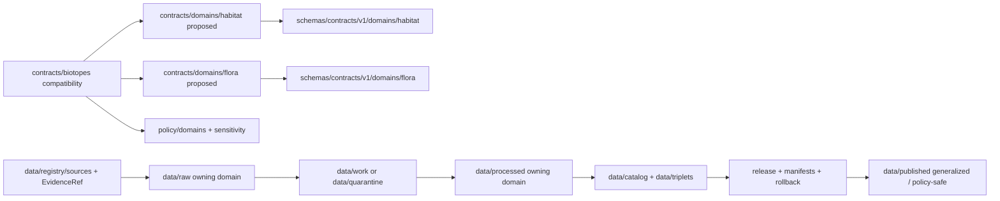

<!-- [KFM_META_BLOCK_V2]
doc_id: kfm://doc/contracts-biotopes-readme
title: contracts/biotopes/ — Biotopes Compatibility Contract Directory
type: readme
version: v0.2
status: draft; repository-grounded; compatibility-index; non-canonical; needs-verification
owners: OWNER_TBD — Habitat steward · Flora steward · Contract steward · Schema steward · Sensitivity steward · Data steward · Docs steward
created: 2026-06-20
updated: 2026-09-07
policy_label: public; contracts; biotopes; compatibility-path; non-canonical; habitat-sublane; semantic-contracts; geoprivacy-sensitive
related:
  - ../README.md
  - ../biodiversity/README.md
  - ../domains/habitat/
  - ../domains/flora/
  - ../../docs/domains/habitat/sublanes/biotopes.md
  - ../../docs/domains/habitat/CANONICAL_PATHS.md
  - ../../docs/domains/habitat/PIPELINE.md
  - ../../docs/domains/habitat/README.md
  - ../../docs/domains/habitat/SENSITIVITY_AND_GEOPRIVACY.md
  - ../../docs/domains/flora/README.md
  - ../../docs/domains/fauna/README.md
  - ../../schemas/contracts/v1/domains/habitat/
  - ../../schemas/contracts/v1/domains/flora/
  - ../../schemas/contracts/v1/domains/habitat/README.md
  - ../../schemas/contracts/v1/domains/flora/README.md
  - ../../policy/biotopes/README.md
  - ../../policy/domains/habitat/
  - ../../policy/domains/flora/
  - ../../policy/sensitivity/habitat/
  - ../../tests/domains/habitat/README.md
  - ../../fixtures/domains/habitat/README.md
  - ../../data/registry/sources/
  - ../../data/proofs/
  - ../../release/
tags: [kfm, contracts, biotopes, habitat, flora, compatibility, non-canonical, semantic-contracts, habitat-patch, land-cover-observation, ecological-system, vegetation-community, geoprivacy, governance]
notes:
  - "Repository-grounded compatibility README for the current contracts/biotopes compatibility index lane."
  - "Path posture remains CONFLICTED / NON-CANONICAL / NEEDS VERIFICATION: Habitat biotopes doctrine says Biotope is not KFM ubiquitous language and must not create contracts/biotopes parallel authority."
  - "This README prevents silent drift; it does not create a Biotope object family, accepted schema, policy family, data lane, release lane, or publication surface."
  - "Canonical object meanings remain under Habitat and Flora-owned contract homes; candidate shapes remain under schemas/contracts/v1/domains/<owning-domain>/ and are not accepted by this file."
evidence_snapshot:
  repository: bartytime4life/Kansas-Frontier-Matrix
  visibility: public
  base_ref: main
  base_commit: 0db0a76b3a825b6f47ee5a429a80752affda73d2
  target_baseline_blob: 4ae31607df03c3d1f4de99b783f88b99946e184a
  direct_lane_files_confirmed:
    - contracts/biotopes/README.md
  inventory_method: authenticated GitHub Contents and file reads against the exact base commit
  boundary_note: "Google Drive material is read-only doctrine/research lineage; GitHub repository evidence controls implementation claims."
[/KFM_META_BLOCK_V2] -->

<a id="top"></a>

# Biotopes Compatibility Contract Directory

> Compatibility warning and coordination README for the requested `contracts/biotopes/` path. `Biotope` is not a KFM canonical object family or sovereign domain. This directory must not become parallel contract authority over Habitat or Flora object families.

<p>
  
  
  
  
  
  
</p>

`contracts/biotopes/`

## Quick jumps

[Status](#status) · [Scope](#scope) · [Path posture](#path-posture) · [Repo fit](#repo-fit) · [Accepted inputs](#accepted-inputs) · [Exclusions](#exclusions) · [Terminology crosswalk](#terminology-crosswalk) · [Current directory snapshot](#current-directory-snapshot) · [Contract inventory](#contract-inventory) · [Semantic contract rules](#semantic-contract-rules) · [Geoprivacy and sensitivity rules](#geoprivacy-and-sensitivity-rules) · [Lifecycle and trust boundary](#lifecycle-and-trust-boundary) · [Validation](#validation) · [Evidence basis](#evidence-basis) · [Rollback](#rollback) · [Definition of done](#definition-of-done) · [Changelog](#changelog)

---

## Status

> [!IMPORTANT]
> **Status:** `draft` / repository-grounded compatibility index  
> **Owner:** `OWNER_TBD`  
> **Path:** `contracts/biotopes/`  
> **Path posture:** `CONFLICTED` / `NON-CANONICAL` / `NEEDS VERIFICATION`  
> **Truth posture:** `CONFIRMED` target path and direct one-entry folder inventory at `main@0db0a76b3a825b6f47ee5a429a80752affda73d2`; `CONFIRMED` Habitat/Flora owning lanes, crosswalk documentation, candidate schema files, and parent policy/fixture/test indexes; `PROPOSED` umbrella-term adoption and machine-checkable shapes; `NEEDS VERIFICATION` accepted authority, duplicate-path resolution, executable validators/tests, policy-runtime enforcement, active consumers, and release/public parity.

---

## Scope

`contracts/biotopes/` is a compatibility and drift-prevention README for a requested path that should not become a canonical contract root.

The Habitat biotopes sublane uses *biotope* as an umbrella for habitat-type assertions already owned by canonical KFM object families: `HabitatPatch`, `LandCoverObservation`, `EcologicalSystem`, and the Flora-owned `Vegetation Community`. This folder may document that compatibility mapping, but it must not create a new `Biotope` object family, schema, policy class, graph node type, data lane, release lane, or publication surface.

This folder does **not** define JSON Schema, executable validators, policy bundles, source data, raw/work/quarantine records, processed records, catalog/triplet records, proof closure, geoprivacy transform values, release decisions, public API DTOs, public UI behavior, or map display behavior.

---

## Path posture

The requested path is:

```text
contracts/biotopes/
```

The Habitat biotopes sublane explicitly warns that `Biotope` is not KFM ubiquitous language and that biotope concerns must not create parallel `contracts/biotopes/`, `schemas/biotopes/`, `policy/biotopes/`, or data authority. At the pinned base, the direct folder inventory contains only this README. That is point-in-time evidence, not permission to add a new authority.

Canonical or likely owning homes are:

```text
contracts/domains/habitat/
contracts/domains/flora/
schemas/contracts/v1/domains/habitat/
schemas/contracts/v1/domains/flora/
policy/domains/habitat/
policy/domains/flora/
```

This README keeps the requested path visible so drift is auditable. It does not authorize the path as canonical.

| Path | Status | Meaning |
|---|---|---|
| `contracts/biotopes/` | `CONFIRMED` direct compatibility-index lane | Compatibility/drift-warning folder only. |
| `contracts/domains/habitat/` | `CONFIRMED` lane; contents mixed | Habitat semantic homes exist, but the listed object contracts remain draft/PROPOSED and duplicate paths require classification. |
| `contracts/domains/flora/` | `CONFIRMED` lane; contents mixed | Flora owns VegetationCommunity meaning, but the contract paths remain PROPOSED and a case/filename duplicate is present. |
| `schemas/contracts/v1/domains/habitat/` | `CONFIRMED` candidate lane | The listed Habitat schemas are PROPOSED scaffolds; this README does not accept their shape or settle the schema-home conflict. |
| `schemas/contracts/v1/domains/flora/` | `CONFIRMED` candidate lane | Vegetation Community schema exists as a PROPOSED scaffold; this README does not accept its shape or settle the schema-home conflict. |
| `policy/biotopes/README.md` | `CONFIRMED` compatibility guardrail | Documentation-only guardrail; not operational Biotope policy authority. |
| `tests/domains/habitat/` and `fixtures/domains/habitat/` | `CONFIRMED` parent indexes | Their existence does not prove executable coverage, validator binding, or release enforcement. |

---

## Repo fit

```text
contracts/
├── README.md
├── biodiversity/
│   └── README.md
├── biotopes/
│   └── README.md
└── domains/
    ├── habitat/
    └── flora/
```

Adjacent responsibility roots:

| Root | Relationship to this folder |
|---|---|
| `../README.md` | Root contracts guidance: contracts define meaning; schemas define shape. |
| `../biodiversity/README.md` | Cross-domain compatibility sibling; it also must not create a sovereign ecology/biodiversity domain. |
| `../domains/habitat/` | Habitat-owned semantic meanings for HabitatPatch, LandCoverObservation, and EcologicalSystem. |
| `../domains/flora/` | Flora-owned semantic meaning for VegetationCommunity; Habitat may cite it but does not own it. |
| `../../docs/domains/habitat/sublanes/biotopes.md` | Governing source for the biotope term posture and crosswalk. |
| `../../docs/domains/habitat/CANONICAL_PATHS.md` | Current Habitat path index; it records proposed/conflicted path status. |
| `../../schemas/contracts/v1/domains/habitat/` and `../../schemas/contracts/v1/domains/flora/` | Candidate machine-shape lanes; listed schemas remain PROPOSED scaffolds. |
| `../../policy/biotopes/README.md` | Compatibility guardrail; no independent Biotope policy authority. |
| `../../policy/domains/habitat/`, `../../policy/sensitivity/habitat/` | Habitat/geoprivacy policy gates. |
| `../../fixtures/domains/habitat/` and `../../tests/domains/habitat/` | Synthetic fixture and test-index lanes; not proof of runtime enforcement. |
| `../../data/proofs/` | EvidenceBundle and proof families. |
| `../../release/` | Release decisions and rollback state. |

---

## Accepted inputs

| Belongs in this directory | Required posture |
|---|---|
| Compatibility README content | Must state that `contracts/biotopes/` is non-canonical unless ratified. |
| Terminology crosswalks | Must map biotope usage to owning KFM object families. |
| Migration notes | Must point toward owning-domain contract homes and rollback paths. |
| Evidence ledgers | Must cite Habitat biotopes doctrine, root contract guidance, and current file evidence. |
| Validation checklists | Must point to owning-domain schemas/tests/policy roots without claiming they exist unless verified. |
| Rollback notes | Must name prior content SHA or migration rollback target. |

---

## Exclusions

| Does not belong here | Correct home |
|---|---|
| New `Biotope` object-family contract | Requires ADR; default is no. |
| HabitatPatch contract | `../domains/habitat/` or accepted Habitat contract home. |
| LandCoverObservation contract | `../domains/habitat/` or accepted Habitat contract home. |
| EcologicalSystem contract | `../domains/habitat/` or accepted Habitat contract home. |
| Vegetation Community contract | `../domains/flora/` or accepted Flora contract home. |
| JSON Schema or machine-checkable shape | `../../schemas/contracts/v1/domains/habitat/` or `../../schemas/contracts/v1/domains/flora/`. |
| Policy bundles or geoprivacy transform values | `../../policy/domains/habitat/`, `../../policy/sensitivity/habitat/`, or accepted policy homes. |
| SourceDescriptor records | `../../data/registry/sources/`. |
| Raw, work, quarantine, processed, catalog, triplet, or published data | `../../data/...` lifecycle roots. |
| EvidenceBundle or proof closure | `../../data/proofs/` and proof workflows. |
| Release decisions | `../../release/`. |
| Public API or UI behavior | Governed app/UI roots after verification and release. |
| Canonical path migration | ADR or migration note, not this README alone. |

---

## Terminology crosswalk

| External / umbrella usage | KFM canonical equivalent | Owning lane | Contract posture |
|---|---|---|---|
| Typed habitat area | `HabitatPatch` | Habitat | Belongs in Habitat contract home. |
| Land-cover class assignment | `LandCoverObservation` | Habitat | Belongs in Habitat contract home. |
| Ecological system label | `EcologicalSystem` | Habitat | Belongs in Habitat contract home. |
| Floristic plant community | `Vegetation Community` | Flora | Belongs in Flora contract home; cited by Habitat, not owned. |
| Regulatory critical habitat | Regulatory designation / source-role label | Habitat | Not a biotope type; preserve source-role label. |
| Modeled suitability surface | `SuitabilityModel`, `Habitat Quality Score` | Habitat | Out of biotopes scope; belongs to suitability context. |

---

## Current directory snapshot

> [!NOTE]
> This snapshot is based on authenticated GitHub Contents inspection at `main@0db0a76b3a825b6f47ee5a429a80752affda73d2`. It is current for that base commit, not a permanent absence claim.

| File | Status | What it proves | What it does not prove |
|---|---|---|---|
| `contracts/biotopes/README.md` | `CONFIRMED` | This README exists and documents the non-canonical boundary. | Does not canonicalize `contracts/biotopes/`. |
| Other direct `contracts/biotopes/*` entries | `NOT OBSERVED at base` | The exact Contents response returned no other direct entries beyond `README.md`. | Does not prevent later additions or prove recursive absence elsewhere. |

---

## Contract inventory

The compatibility folder itself does not own any of these object families. The table records repository paths observed at the pinned base and keeps semantic-path, schema, and execution status separate.

| Contract family | Semantic contract path(s) observed | Candidate schema path(s) observed | Current posture |
|---|---|---|---|
| `HabitatPatch` | `contracts/domains/habitat/habitat_patch.md`<br>`contracts/domains/habitat/habitat-patch.contract.md` | `schemas/contracts/v1/domains/habitat/habitat_patch.schema.json` | Both semantic paths and the schema exist; contract files are `PROPOSED`/`NEEDS VERIFICATION`, the schema is an empty-properties `PROPOSED` scaffold, and duplicate-path resolution is open. |
| `LandCoverObservation` | `contracts/domains/habitat/land_cover_observation.md`<br>`contracts/domains/habitat/land_cover/observation.md` | `schemas/contracts/v1/domains/habitat/land_cover_observation.schema.json`<br>`schemas/contracts/v1/domains/habitat/land_cover/observation.schema.json` | The top-level contract explicitly marks itself `COMPATIBILITY_ALIAS`/`CONFLICTED`; both contract/schema locations are `PROPOSED` candidates and require owner/ADR classification. |
| `EcologicalSystem` | `contracts/domains/habitat/ecological_system.md` | `schemas/contracts/v1/domains/habitat/ecological_system.schema.json` | Contract path exists as `PROPOSED`; schema is an empty-properties `PROPOSED` scaffold. |
| `VegetationCommunity` | `contracts/domains/flora/vegetation_community.md`<br>`contracts/domains/flora/VegetationCommunity.md` | `schemas/contracts/v1/domains/flora/vegetation_community.schema.json` | Flora-owned meaning is represented by a `PROPOSED` semantic contract plus a case/filename scaffold duplicate; schema is a `PROPOSED` scaffold. Habitat cites this family; it does not own it. |
| `Biotope` | No canonical contract path observed | No schema permitted here | Documentation grouping only; adoption as KFM ubiquitous language remains `PROPOSED` and requires owner/ADR decision. |

---

## Semantic contract rules

Any compatibility contract text under this path must:

- state that `Biotope` is an umbrella term, not a KFM object family by default;
- identify the canonical object family and owning lane for every concept;
- preserve source role, classifier version, vintage, and effective time;
- distinguish model/classification output from observation;
- preserve EvidenceRef, EvidenceBundle, SourceDescriptor, ReviewRecord, PolicyDecision, and receipt expectations;
- route machine shape to the owning schema home;
- route policy and geoprivacy decisions to policy roots;
- deny public release unless governed release gates close;
- include rollback and migration posture.

---

## Geoprivacy and sensitivity rules

Biotope-like outputs can inherit sensitivity from joins and derivations.

- Habitat outputs joined to sensitive fauna/flora records must fail closed until geoprivacy gates close.
- A habitat patch, suitability surface, density layer, or typed area can leak a protected location even when the original occurrence is withheld.
- Public outputs require public-safe geometry where sensitivity applies.
- Redaction, generalization, aggregation, review, policy decision, receipts, and release state are required before public exposure where applicable.
- Aggregate or generalized products must not be reverse-joined to sensitive records.
- Public UI and AI surfaces must cite or abstain and must not reveal restricted detail.

---

## Lifecycle and trust boundary


```mermaid
flowchart LR
  COMPAT[contracts/biotopes compatibility] --> HAB[contracts/domains/habitat proposed]
  COMPAT --> FLORA[contracts/domains/flora proposed]
  HAB --> HS[schemas/contracts/v1/domains/habitat]
  FLORA --> FS[schemas/contracts/v1/domains/flora]
  COMPAT --> POLICY[policy/domains + sensitivity]
  SOURCE[data/registry/sources + EvidenceRef] --> RAW[data/raw owning domain]
  RAW --> WORK[data/work or data/quarantine]
  WORK --> PROC[data/processed owning domain]
  PROC --> CAT[data/catalog + data/triplets]
  CAT --> REL[release + manifests + rollback]
  REL --> PUB[data/published generalized / policy-safe]
```

Contracts describe meaning. They do not move data, validate schemas, make policy decisions, close evidence, release sensitive locations, create a Biotopes domain, direct public display, or publish.

---

## Validation

### Evidence checks completed for this README

- [x] Confirmed the direct `contracts/biotopes/` inventory at the pinned base: this README only.
- [x] Confirmed the Habitat biotopes crosswalk keeps `Biotope` out of KFM canonical ubiquitous language by default.
- [x] Confirmed the observed Habitat and Flora semantic paths, candidate schema paths, and their `PROPOSED`/`CONFLICTED` markers.
- [x] Confirmed parent index lanes for Habitat fixtures/tests and the compatibility guardrail at `policy/biotopes/README.md`.

### Still required before treating any owning lane as accepted

- [ ] Resolve the `Biotope` umbrella-term decision and all duplicate semantic/schema paths through the owning stewards and an accepted ADR or migration note.
- [ ] Confirm accepted schema-home authority and replace empty-properties scaffolds with domain-reviewed shapes.
- [ ] Confirm owner assignments, source-role/classifier-vintage requirements, temporal semantics, evidence closure, and geoprivacy obligations are executable rather than only documented.
- [ ] Confirm validator bindings, negative fixtures, test execution, no-network behavior, policy-runtime enforcement, and CI results.
- [ ] Confirm source registry admission, active pipeline consumers, catalog/proof closure, release manifests, correction/rollback paths, and public API/UI/AI route behavior.
- [ ] Confirm sensitive-location exposure is denied unless policy, transform receipt, review, and release gates explicitly allow a safe representation.

This README must not be used as proof that any unchecked item is implemented.

---

## Evidence basis

| Source | Status | Supports | Limits |
|---|---|---|---|
| `contracts/biotopes/README.md` at baseline blob `4ae31607df03c3d1f4de99b783f88b99946e184a` | `CONFIRMED` | The target was an existing compatibility README, not a blank file; this update uses it as the rollback baseline. | It does not prove any downstream implementation. |
| `contracts/biotopes/` Contents at `main@0db0a76b3a825b6f47ee5a429a80752affda73d2` | `CONFIRMED` | Direct lane contains `README.md` only at the inspected base. | Point-in-time inventory; not a permanent absence claim. |
| `contracts/README.md` | `CONFIRMED` | Contracts define semantic meaning and pair with schemas; executable validation, JSON Schema, policy code, and source data do not belong in contracts. | Root guidance does not settle biotope pathing. |
| `docs/domains/habitat/sublanes/biotopes.md` | `CONFIRMED` | `Biotope` is not KFM ubiquitous language; the sublane maps it to HabitatPatch, LandCoverObservation, EcologicalSystem, and Flora-owned VegetationCommunity without creating parallel authority. | The sublane itself keeps adoption and many implementation paths proposed. |
| `docs/domains/habitat/CANONICAL_PATHS.md` and `docs/domains/habitat/PIPELINE.md` | `CONFIRMED` | Current Habitat documentation records candidate contract/schema paths, source-role separation, lifecycle gates, and fail-closed sensitive joins. | These documents do not prove accepted schemas, executable runners, or passing tests. |
| Observed Habitat contract/schema files listed above | `CONFIRMED paths; PROPOSED content` | Exact current file presence and explicit scaffold/conflict markers. | Empty-properties schemas, duplicate semantic homes, and owner/ADR status remain unresolved. |
| Observed Flora contract/schema files listed above | `CONFIRMED paths; PROPOSED content` | Flora ownership of VegetationCommunity and the case/filename/schema path situation. | Does not accept either duplicate contract path or the empty-properties schema. |
| `fixtures/domains/habitat/README.md`, `tests/domains/habitat/README.md`, and `policy/biotopes/README.md` | `CONFIRMED indexes/guardrail` | Fixture/test/policy lanes and their documented boundaries exist. | Does not prove payloads, executable tests, evaluator binding, policy decisions, or release enforcement. |
| `KFM_Full_Atlas_seed_cards` (Google Drive; read-only task source) | `READ-ONLY LINEAGE` | Evidence-linked claims, source role, temporal/spatial scope, sensitivity, and cite-or-abstain framing used to keep this README claim-bounded. | Research/design synthesis; it does not establish repository paths or implementation. |
| `GIS in Sustainable Urban Planning and Management.pdf` (Google Drive; read-only task source) | `READ-ONLY RESEARCH` | GIS/land-cover context and uncertainty framing. | It does not select KFM canonical object families or prove schema, validator, runtime, or release behavior. |

---

## Rollback

Rollback is required if this README is used to claim that `contracts/biotopes/` is canonical, to create a new Biotope object family without ADR, to duplicate Habitat/Flora authority, or to justify schema, policy, source-data, sensitive-location release, proof, release, API, UI, AI, or public-claim authority.

Rollback target: baseline target blob `4ae31607df03c3d1f4de99b783f88b99946e184a` at `main@0db0a76b3a825b6f47ee5a429a80752affda73d2`; revert the single-file branch commit to restore the prior README.

---

## Definition of done

- [x] Direct folder inventory and baseline blob are recorded.
- [x] The README states that `Biotope` is non-canonical by default and maps concepts to owning Habitat/Flora families.
- [x] Observed contract/schema paths and their `PROPOSED`/`CONFLICTED` status are recorded without promoting them.
- [x] Google Drive material is treated as read-only lineage rather than repository authority.
- [ ] Biotopes path posture is resolved by an accepted ADR or migration note.
- [ ] Owners are confirmed and `OWNER_TBD` is replaced.
- [ ] Duplicate semantic and schema paths are classified, migrated, or explicitly retained as compatibility aliases.
- [ ] Accepted schemas, validators, fixtures, tests, policy bundles, registry bindings, and release/public consumers are linked and verified.
- [ ] Public API/UI/AI surfaces deny sensitive-location exposure by default and expose only governed public-safe derivatives.
- [x] No schema, policy, source data, proof, release, API, UI, AI, sensitive-location release, or publication authority is asserted from this folder.

---

## Changelog

| Version | Change |
|---|---|
| `v0.2` — 2026-09-07 | Reconciled the README with the pinned GitHub tree, recorded the direct one-entry inventory and rollback baseline, linked exact Habitat/Flora candidate paths, preserved duplicate/proposed status, and separated read-only Drive lineage from repository authority. |
## Status summary

`contracts/biotopes/` is a compatibility and drift-warning folder for a non-canonical term. It must not become a Biotopes domain, object-family root, schema home, policy home, source registry, data lifecycle root, proof root, release authority, sensitive-location release surface, public API surface, public UI surface, AI answer source, or publication authority.

<p align="right"><a href="#top">Back to top</a></p>
