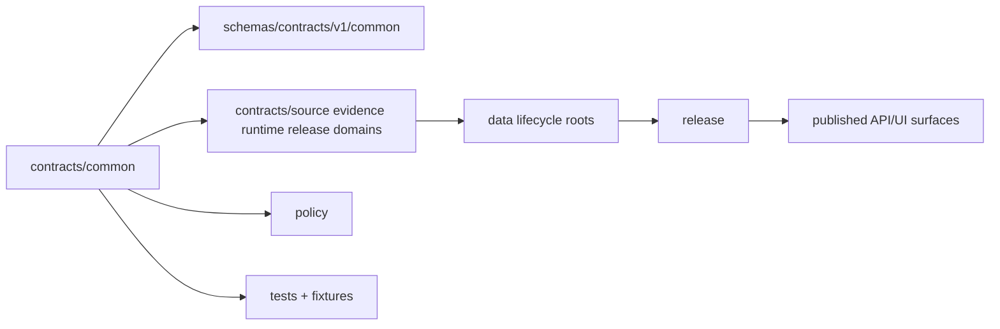

<!-- [KFM_META_BLOCK_V2]
doc_id: kfm://doc/contracts-common-readme
title: contracts/common/ — Common Semantic Contracts
type: readme
version: v0.2
status: draft
owners: OWNER_TBD — Contract steward · Schema steward · Architecture steward · Policy steward · Validation steward · Docs steward
created: 2026-06-20
updated: 2026-06-20
policy_label: public; contracts; common; semantic-contracts; shared-kernel; compatibility-root
tags: [kfm, contracts, common, semantic-contracts, shared-kernel, primitives, value-objects, evidence, governance]
related:
  - ../README.md
  - ../../docs/architecture/contract-schema-policy-split.md
  - ../../docs/doctrine/directory-rules.md
  - ../../schemas/contracts/v1/common/
  - ../../schemas/contracts/v1/source/
  - ../../schemas/contracts/v1/evidence/
  - ../../schemas/contracts/v1/runtime/
  - ../../schemas/contracts/v1/policy/
  - ../../schemas/contracts/v1/release/
  - ../../policy/
  - ../../tests/contracts/
  - ../../fixtures/
notes:
  - "Expanded from a short stub into a shared/common semantic-contract directory README."
  - "Common contracts define cross-cutting meaning only; machine-checkable shape belongs in schemas/contracts/v1/common/ or another accepted schema home."
  - "This directory must not become a dumping ground, parallel domain root, schema home, policy home, fixture store, or data lifecycle root."
  - "Specific common object-family inventory remains NEEDS VERIFICATION until current repo inventory, schemas, tests, and fixtures are checked."
[/KFM_META_BLOCK_V2] -->

<a id="top"></a>

# Common Semantic Contracts

> Shared semantic contract directory for common KFM meanings used across domains and runtime surfaces. This folder describes meaning and invariants; it does not define JSON Schema, policy, tests, fixtures, source data, release state, API behavior, or UI behavior.

<p>
  
  
  
  
  
  
</p>

`contracts/common/`

## Quick jumps

[Status](#status) · [Scope](#scope) · [Path posture](#path-posture) · [Repo fit](#repo-fit) · [Accepted inputs](#accepted-inputs) · [Exclusions](#exclusions) · [Current directory snapshot](#current-directory-snapshot) · [Common contract inventory](#common-contract-inventory) · [Semantic contract rules](#semantic-contract-rules) · [Shared-kernel discipline](#shared-kernel-discipline) · [Lifecycle and trust boundary](#lifecycle-and-trust-boundary) · [Validation](#validation) · [Evidence basis](#evidence-basis) · [Rollback](#rollback) · [Definition of done](#definition-of-done)

---

## Status

> [!IMPORTANT]
> **Status:** `draft` / directory README  
> **Owner:** `OWNER_TBD`  
> **Path:** `contracts/common/`  
> **Path posture:** `CONFIRMED` current folder path; exact common-object inventory `NEEDS VERIFICATION`  
> **Truth posture:** `CONFIRMED` current stub and replacement README content; contract/schema/policy/test split is supported by architecture docs; full inventory, matching schemas, validators, fixtures, policy references, CI behavior, and downstream usage remain `NEEDS VERIFICATION`.

---

## Scope

`contracts/common/` is for shared semantic contract material used across multiple KFM domains or subsystems.

A common contract may define meaning for small cross-cutting value objects, reference structures, shared enums, identity fragments, time/geometry/provenance carriers, or other reusable semantic components **only when no single domain owns the concept**.

This folder must stay narrow. It is not a place to avoid choosing an owner. When a concept has a clear owning domain or contract family, it belongs there instead.

---

## Path posture

The current path is:

```text
contracts/common/
```

The architecture split identifies `contracts/` as the semantic meaning layer and shows `schemas/contracts/v1/common/` as the paired machine-shape area. This README does not create or verify any specific common schema, validator, fixture, or runtime integration.

| Path | Status | Meaning |
|---|---|---|
| `contracts/common/` | `CONFIRMED` current requested folder path | Shared/common semantic-contract directory. |
| `schemas/contracts/v1/common/` | `PROPOSED` / `NEEDS VERIFICATION` | Machine schema home for common object shapes, if present/accepted. |
| `policy/` | `CONFIRMED root` / specific bundles `NEEDS VERIFICATION` | Admissibility and decision logic, not semantic meaning. |
| `tests/contracts/`, `fixtures/` | `NEEDS VERIFICATION` | Enforceability and examples, not authority by themselves. |

---

## Repo fit

```text
contracts/
├── README.md
└── common/
    └── README.md

schemas/
└── contracts/
    └── v1/
        └── common/        # machine shape, if present/accepted
```

Adjacent responsibility roots:

| Root | Relationship to this folder |
|---|---|
| `../README.md` | Root contract guidance: contracts define meaning; schemas define shape. |
| `../../docs/architecture/contract-schema-policy-split.md` | Explains the meaning/shape/admissibility/enforceability split. |
| `../../schemas/contracts/v1/common/` | Expected paired machine-shape home for common contracts. |
| `../../policy/` | Policy/admissibility decisions. |
| `../../tests/contracts/`, `../../fixtures/` | Enforceability and examples. |
| `../../contracts/source/`, `../../contracts/evidence/`, `../../contracts/runtime/`, `../../contracts/release/` | Specialized contract families that should not be duplicated under `common/`. |

---

## Accepted inputs

| Belongs in this directory | Required posture |
|---|---|
| Shared semantic-contract READMEs | Define meaning, invariants, and field intent for truly common concepts. |
| Common value-object contracts | Must be cross-domain and small enough not to imply domain ownership. |
| Shared enum/identifier meaning docs | Allowed when used by multiple contract families and not owned by one of them. |
| Compatibility notes | Must clearly route specialized concepts back to their proper families. |
| Evidence ledgers | Must cite contract/schema/policy split guidance and current file evidence. |
| Validation checklists | Must point to schema/test/policy homes without claiming they exist unless verified. |
| Rollback notes | Must name prior content SHA or migration rollback target. |

---

## Exclusions

| Does not belong here | Correct home |
|---|---|
| JSON Schema or machine-checkable shape | `../../schemas/contracts/v1/common/` or accepted schema home. |
| Policy rules or OPA/Rego bundles | `../../policy/`. |
| Tests and fixtures | `../../tests/`, `../../fixtures/`. |
| SourceDescriptor meaning | `../source/` or accepted source contract home. |
| EvidenceRef / EvidenceBundle meaning | `../evidence/` or accepted evidence contract home. |
| RuntimeResponseEnvelope, DecisionEnvelope, RunReceipt, AIReceipt | `../runtime/` or accepted runtime contract home. |
| ReleaseManifest, PromotionDecision, RollbackCard | `../release/` or accepted release contract home. |
| Domain-specific contracts | `../domains/<domain>/` or accepted domain contract home. |
| Raw/work/quarantine/processed/catalog/triplet/published data | `../../data/...` lifecycle roots. |
| API or UI behavior | Governed app/UI roots after verification and release. |
| Dumping ground for uncertain ownership | Use ADR, drift register, or narrowed domain owner review instead. |

---

## Current directory snapshot

> [!NOTE]
> This snapshot is based on current-session file inspection, not a complete repository inventory.

| File | Status | What it proves | What it does not prove |
|---|---|---|---|
| `contracts/common/README.md` | `CONFIRMED` | This README exists and states common-contract boundaries. | Does not prove any common contract object files exist. |
| Other `contracts/common/*` files | `UNKNOWN` | Not verified by this README. | Requires separate inventory. |

---

## Common contract inventory

The current session did not verify individual common contract files beyond this README.

| Contract family | Current contract | Status | Notes |
|---|---|---|---|
| Common identifiers | `UNKNOWN` | `NEEDS VERIFICATION` | May belong here only if not owned by source/evidence/runtime/release families. |
| Time interval / temporal carrier | `UNKNOWN` | `NEEDS VERIFICATION` | Must not duplicate temporal package or domain-specific time semantics. |
| Geometry reference / spatial carrier | `UNKNOWN` | `NEEDS VERIFICATION` | Must not duplicate map, geometry schema, or domain-specific location rules. |
| Provenance fragment | `UNKNOWN` | `NEEDS VERIFICATION` | Evidence/proof-family concepts may belong under `contracts/evidence/` instead. |
| Shared status/outcome enum | `UNKNOWN` | `NEEDS VERIFICATION` | Runtime outcome concepts may belong under `contracts/runtime/`. |

---

## Semantic contract rules

Every common contract in this directory must state:

- what the shared concept means;
- why no single domain or specialized family owns it;
- which contract families may reference it;
- which fields are identity-bearing;
- which fields are only representation or helper fields;
- evidence, source, policy, review, and release implications where applicable;
- schema home and validator expectations;
- negative examples showing what must not be put under `common/`;
- rollback path if the concept later moves to a more specific owner.

---

## Shared-kernel discipline

`common/` is a shared-kernel surface. Shared kernels are powerful and risky.

Rules:

- prefer a specific owner over `common/` when ownership is clear;
- do not put large domain vocabulary here;
- do not put domain policy or sensitivity decisions here;
- do not define schema shape in Markdown;
- do not duplicate source, evidence, runtime, policy, release, correction, or governance contract families;
- changes here should receive review from every affected steward family;
- any breaking change must include migration, test, fixture, and rollback posture.

---

## Lifecycle and trust boundary



Contracts describe meaning. They do not validate schemas, make policy decisions, create evidence, move lifecycle data, publish, or serve public clients.

---

## Validation

Before relying on this directory, verify:

- every common concept has no better specific owner;
- every common contract has a matching schema or documented `NEEDS VERIFICATION` gap;
- common schema shape lives under the accepted schema home, not this Markdown directory;
- policy references live in policy roots;
- tests and fixtures prove valid, invalid, denied, and abstain cases where applicable;
- no common contract duplicates SourceDescriptor, EvidenceBundle, runtime envelope, release, correction, governance, or domain-owned meanings;
- downstream domains reference the common contract explicitly instead of re-defining it;
- breaking changes have migration and rollback paths.

---

## Evidence basis

| Source | Status | Supports | Limits |
|---|---|---|---|
| `contracts/common/README.md` before this edit | `CONFIRMED` | Target file existed as a short common-family stub. | Stub did not define scope, exclusions, validation, or rollback. |
| `contracts/README.md` | `CONFIRMED` | Contracts define semantic meaning and pair with schemas; executable validation, JSON Schema, policy code, and source data do not belong in contracts. | Root README is brief and does not inventory common contracts. |
| `docs/architecture/contract-schema-policy-split.md` | `CONFIRMED` | KFM separates meaning (`contracts/`), shape (`schemas/`), admissibility (`policy/`), and enforceability (`tests/` + `fixtures/`); `common/` appears as a schema family under `schemas/contracts/v1/common/`. | Specific repo paths and inventory remain verification-bound. |

---

## Rollback

Rollback is required if this README is used to justify schemas, policy code, tests, fixtures, source data, lifecycle data, release state, API behavior, UI behavior, or domain-specific authority under `contracts/common/`.

Rollback target: prior stub content SHA `041de18762f24805c984fb49b80b3abe59cc1610`.

---

## Definition of done

- [ ] Owners are confirmed and `OWNER_TBD` is replaced.
- [ ] Full `contracts/common/` inventory is generated.
- [ ] Each common contract has a documented reason it is not owned by a specific family/domain.
- [ ] Matching schemas exist in accepted schema homes or gaps are marked `NEEDS VERIFICATION`.
- [ ] Policy references point outside this directory.
- [ ] Tests and fixtures are linked and verified.
- [ ] Duplicate definitions are removed or marked for migration.
- [ ] Affected stewards review shared-kernel changes.
- [ ] Rollback targets are recorded for any migrated or renamed common contract.
- [ ] No schema, policy, test, fixture, data, proof, release, API, UI, or publication authority is asserted from this folder.

---

## Status summary

`contracts/common/` is the semantic contract directory for truly shared KFM meanings. It is not a schema home, policy home, test/fixture home, source registry, lifecycle data root, proof root, release authority, API surface, UI surface, or dumping ground for unresolved ownership.

<p align="right"><a href="#top">Back to top</a></p>
