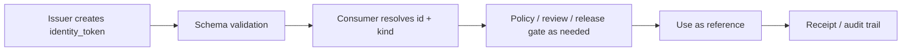

<!-- [KFM_META_BLOCK_V2]
doc_id: kfm://contract/common/identity-token
title: contracts/common/identity_token.md — IdentityToken Contract
type: contract
version: v0.3
status: draft
owners: OWNER_TBD — Contract steward · Schema steward · Runtime steward · Source steward · Evidence steward · Governance steward · Docs steward
created: 2026-06-20
updated: 2026-06-20
policy_label: public; contracts; common; identity-token; semantic-contract; shared-kernel
related:
  - ./README.md
  - ../../schemas/contracts/v1/common/identity_token.schema.json
  - ../../fixtures/contracts/v1/common/identity_token/
  - ../../tools/validators/validate_identity_token.py
  - ../../policy/common/
  - ../../docs/architecture/contract-schema-policy-split.md
  - ../../data/receipts/
  - ../../data/proofs/
  - ../../release/
tags: [kfm, contracts, common, identity-token, identity, shared-kernel, run, source, decision, review, bundle, actor, provenance, governance]
notes:
  - "v0.3 applies the KFM Repository Markdown Authoring Agent v2 revision standard: preserve strong material, surface evidence limits, add repo fit, accepted/excluded uses, examples, compatibility/versioning, no-loss preservation, and stronger QA gates."
  - "Machine-checkable shape remains in schemas/contracts/v1/common/identity_token.schema.json. This edit does not change schema fields, enums, or validation rules."
  - "Schema metadata points to fixtures/contracts/v1/common/identity_token/, tools/validators/validate_identity_token.py, and policy/common/, but validator/policy/fixture existence and behavior remain NEEDS VERIFICATION unless separately inspected."
  - "identity_token is a reference/identity carrier, not an authorization credential, security token, secret, login token, consent token, or proof of identity by itself."
[/KFM_META_BLOCK_V2] -->

<a id="top"></a>

# IdentityToken Contract

> Semantic contract for `identity_token`, a small common identity carrier used to reference governed KFM things such as runs, sources, decisions, reviews, evidence bundles, and actors without copying their full records.

<p>
  
  
  
  
  
  
</p>

`contracts/common/identity_token.md`

## Quick jumps

[Status](#status) · [Meaning](#meaning) · [Repo fit](#repo-fit) · [Schema pairing](#schema-pairing) · [Accepted uses](#accepted-uses) · [Exclusions](#exclusions) · [Fields](#fields) · [Invariants](#invariants) · [Allowed kinds](#allowed-kinds) · [Non-goals](#non-goals) · [Examples](#examples) · [Compatibility and versioning](#compatibility-and-versioning) · [Lifecycle](#lifecycle) · [Validation](#validation) · [No-loss preservation](#no-loss-preservation) · [Evidence basis](#evidence-basis) · [Rollback](#rollback) · [Definition of done](#definition-of-done)

---

## Status

> [!IMPORTANT]
> **Status:** `draft` / semantic contract  
> **Owner:** `OWNER_TBD`  
> **Contract path:** `contracts/common/identity_token.md`  
> **Schema path:** `schemas/contracts/v1/common/identity_token.schema.json`  
> **Truth posture:** `CONFIRMED` contract path, schema path, schema shape, and current update; validator, fixtures, policy behavior, runtime integration, and downstream references remain `NEEDS VERIFICATION`.

---

## Meaning

`identity_token` is a compact, typed identity reference for a governed KFM entity.

It answers four questions:

1. **What is being referenced?** — `id`.
2. **What kind of thing is it?** — `kind`.
3. **When was this token issued?** — `issued_at`.
4. **Who or what issued the token?** — `issuer`, when known.

An `identity_token` is useful when a contract, receipt, decision, review, evidence bundle, or runtime envelope needs to point at a governed thing without embedding that thing's complete record.

It is a shared-kernel value object. It must stay small, stable, and semantically narrow.

---

## Repo fit

```text
contracts/
└── common/
    ├── README.md
    └── identity_token.md

schemas/
└── contracts/
    └── v1/
        └── common/
            └── identity_token.schema.json
```

Adjacent responsibility roots:

| Root | Relationship to this contract |
|---|---|
| `./README.md` | Common contract directory boundary and shared-kernel discipline. |
| `../../schemas/contracts/v1/common/identity_token.schema.json` | Machine-checkable shape for this contract. |
| `../../fixtures/contracts/v1/common/identity_token/` | Schema-declared fixture root; existence and coverage remain `NEEDS VERIFICATION`. |
| `../../tools/validators/validate_identity_token.py` | Schema-declared validator; existence and behavior remain `NEEDS VERIFICATION`. |
| `../../policy/common/` | Schema-declared policy home; existence and behavior remain `NEEDS VERIFICATION`. |
| `../../contracts/source/`, `../../contracts/evidence/`, `../../contracts/runtime/`, `../../contracts/release/`, `../../contracts/governance/` | Specialized contract families that may resolve `identity_token` targets; this token does not replace them. |

---

## Schema pairing

The paired schema is:

```text
schemas/contracts/v1/common/identity_token.schema.json
```

The schema defines machine shape. This Markdown contract defines meaning.

The current schema metadata identifies:

| Schema metadata | Value | Verification posture |
|---|---|---|
| `$id` | `https://schemas.kfm.local/contracts/v1/common/identity_token.schema.json` | `CONFIRMED` from schema. |
| `contract_doc` | `contracts/common/identity_token.md` | `CONFIRMED` from schema. |
| `fixtures_root` | `fixtures/contracts/v1/common/identity_token/` | `NEEDS VERIFICATION` existence/coverage. |
| `validator` | `tools/validators/validate_identity_token.py` | `NEEDS VERIFICATION`; not proven present in this edit. |
| `policy` | `policy/common/` | `NEEDS VERIFICATION` existence/behavior. |
| `status` | `PROPOSED` | `CONFIRMED` from schema metadata. |

---

## Accepted uses

| Use | Allowed? | Rule |
|---|---:|---|
| Referencing a governed object from a receipt, decision, review, or runtime envelope | Yes | Use `id + kind`; resolve through the owning surface before relying on it. |
| Carrying a compact cross-family pointer in a contract or schema object | Yes | Keep the token small and do not embed the referenced object. |
| Linking a public-safe envelope to a released or reviewable identifier | Conditional | Public exposure still requires sensitivity, rights, audience, review, and release checks. |
| Recording issuer and issuance time for auditability | Yes | `issued_at` is required; `issuer` is optional by schema but may be required by downstream policy. |
| Proving that the referenced object exists or is policy-allowed | No | Token shape is not object existence, evidence closure, or policy allowance. |
| Authenticating a user or authorizing an action | No | This contract is not a security credential or consent token. |

---

## Exclusions

| Does not belong in `identity_token` | Correct owner / surface |
|---|---|
| Passwords, API keys, JWTs, bearer tokens, OAuth tokens, session IDs | Security/authentication contracts and policy, not this common value object. |
| Consent grants or revocation records | Consent/rights policy and governance contracts. |
| Full source metadata | SourceDescriptor/source contracts. |
| Full evidence payload | EvidenceBundle/evidence contracts. |
| Full review record | Governance/review contracts. |
| Full policy decision | Policy/decision contracts. |
| Full release manifest or rollback card | Release contracts. |
| Runtime trace or AIReceipt body | Runtime contracts and receipt stores. |
| Public display permission | Release and policy gates. |

---

## Fields

| Field | Required by schema | Semantic meaning | Notes |
|---|---:|---|---|
| `id` | Yes | Identifier of the referenced governed thing. | The referenced record must be resolved by the caller's owning context. This field alone does not prove existence. |
| `kind` | Yes | Closed classification of the referenced thing. | Current enum: `run`, `source`, `decision`, `review`, `bundle`, `actor`. |
| `issued_at` | Yes | Date-time when this token was issued. | This is token issuance time, not necessarily source observation time, evidence creation time, review time, or release time. |
| `issuer` | No | Component, actor, steward, service, or process that issued the token. | Optional in current schema; downstream policy may require it for some uses. |

---

## Invariants

An `identity_token` must preserve these invariants:

- `id` must identify exactly one referenced thing in the resolver context that consumes it.
- `kind` must remain a closed enum value until a schema version explicitly changes it.
- `issued_at` must be a valid date-time and must represent token issuance time.
- `issuer`, when present, must identify the token issuer, not necessarily the referenced entity's owner.
- The token must not carry secret material, credentials, personal identifiers beyond the referenced `actor` semantics, or embedded source/evidence payloads.
- The token must not replace SourceDescriptor, EvidenceBundle, ReviewRecord, PolicyDecision, ReleaseManifest, AIReceipt, or any other full governed object.
- Consumers must not treat a syntactically valid token as proof that the referenced object exists, is current, is released, or is policy-allowed.

---

## Allowed kinds

| `kind` | Meaning | Correct resolution surface |
|---|---|---|
| `run` | References a run, job, pipeline execution, model invocation, or comparable runtime event. | Runtime/run receipt surfaces. |
| `source` | References a source identity or admitted source object. | SourceDescriptor/source registry surfaces. |
| `decision` | References a policy, promotion, release, correction, or other decision object. | Policy/release/governance decision surfaces. |
| `review` | References a review record or review workflow artifact. | Governance/review surfaces. |
| `bundle` | References an evidence bundle or proof-supporting bundle. | Evidence/proof surfaces. |
| `actor` | References an actor identity in a governed context. | Actor/identity/governance surfaces; must not become an authentication credential. |

---

## Non-goals

`identity_token` is not:

- an authentication token;
- an authorization grant;
- a session token;
- a password, API key, JWT, bearer token, or secret;
- a consent token;
- proof that a referenced object exists;
- proof that evidence is valid;
- proof that policy allowed an action;
- a release manifest;
- a substitute for a full governed object;
- a public identifier suitable for all audiences by default.

If a workflow needs security credentials, access-control tokens, signed authorization, consent tokens, or identity-provider integration, it must use a separate security/consent contract and policy surface.

---

## Examples

These examples are illustrative and must still validate against the schema and owning resolvers.

### Valid shape — source reference

```json
{
  "id": "src-usgs-ngmdb",
  "kind": "source",
  "issued_at": "2026-06-20T21:00:00Z",
  "issuer": "kfm-source-registry"
}
```

### Valid shape — evidence bundle reference

```json
{
  "id": "evb-2026-06-20-0001",
  "kind": "bundle",
  "issued_at": "2026-06-20T21:05:00Z"
}
```

### Invalid shape — credential misuse

```json
{
  "id": "user-session-token",
  "kind": "actor",
  "issued_at": "2026-06-20T21:10:00Z",
  "secret": "do-not-put-secrets-here"
}
```

The invalid example fails the current schema because `additionalProperties` is false. It also violates this contract because `identity_token` is not a credential or secret carrier.

---

## Compatibility and versioning

Current compatibility posture:

- Schema status is `PROPOSED` according to `x-kfm.status`.
- Enum values are closed in the current schema.
- Adding a new `kind` is a breaking/compatibility-significant change unless versioned and migration-tested.
- Making `issuer` required would be a schema change and must be reflected in fixtures, validators, and downstream consumers.
- Existing tokens remain historical references; correction/supersession belongs in downstream receipts, correction notices, or rollback records.

Versioning expectations:

1. Update this contract when field meaning changes.
2. Update the schema when machine shape changes.
3. Add fixtures for valid and invalid cases.
4. Update validators and policy gates where applicable.
5. Record migration and rollback posture for consumers.

---

## Lifecycle



Lifecycle notes:

- A token may be created during RAW/WORK processing, runtime execution, review, evidence bundling, or release workflows.
- Schema validation proves only shape.
- Resolution proves only that a referenced object can be found in the relevant context.
- Policy/review/release gates decide whether the reference may be used for a specific purpose.
- Supersession of the referenced object does not automatically update prior tokens; receipts and downstream objects must record their own correction/rollback posture.

---

## Validation

Before relying on this contract, verify:

- schema validation passes against `schemas/contracts/v1/common/identity_token.schema.json`;
- `kind` remains a closed enum or versioned change is documented;
- validators exist and cover valid, invalid, missing-field, invalid-date-time, unknown-kind, extra-field, and optional-issuer cases;
- fixtures exist under the schema-declared fixture root;
- policy behavior, if any, is in `policy/common/` or a more specific policy root;
- every consumer resolves `id + kind` through the correct owning surface;
- no consumer treats `identity_token` as an authentication or authorization credential;
- release/public-display contexts check sensitivity, rights, audience, and release state before exposing tokens.

---

## No-loss preservation

| Existing element | Disposition | Reason |
|---|---|---|
| Prior meaning section | `KEEP + EXPAND` | The scaffold correctly identified this as governed semantics; v0.3 adds concrete meaning. |
| Schema URL | `KEEP + GROUND` | The paired schema exists and is now cited through repo evidence. |
| Field section | `KEEP + REPLACE WITH SEMANTIC TABLE` | The old field section delegated too much meaning to schema properties. |
| Invariants | `KEEP + STRENGTHEN` | Required fields/enums/no-extra-properties were preserved and expanded with KFM semantic constraints. |
| Lifecycle | `KEEP + CLARIFY` | The lifecycle now separates creation, validation, resolution, policy/review/release, use, and receipt. |
| Open questions | `KEEP + MOVE INTO VALIDATION / DEFINITION OF DONE` | Open verification items are now testable checklist items. |

---

## Evidence basis

| Source | Status | Supports | Limits |
|---|---|---|---|
| Prior `contracts/common/identity_token.md` scaffold | `CONFIRMED` | Contract existed and referenced the schema URL, lifecycle, and open verification note. | Scaffold delegated field meaning to schema and lacked semantic boundaries. |
| `schemas/contracts/v1/common/identity_token.schema.json` | `CONFIRMED` | Current field set, required fields, allowed `kind` enum values, no additional properties, x-kfm metadata. | Schema metadata points to validator/fixtures/policy, but their behavior is not proven by schema alone. |
| `contracts/common/README.md` | `CONFIRMED` | Common contracts may define small cross-cutting value objects only when no single domain owns them; common must stay narrow. | Does not prove individual common contract inventory. |
| `docs/architecture/contract-schema-policy-split.md` | `CONFIRMED` | Contracts define meaning; schemas define shape; policy decides admissibility; tests/fixtures prove enforceability. | Path presence and runtime behavior remain verification-bound. |
| Uploaded `KFM Repository Markdown Authoring Agent — Full Operating Prompt v2` | `CONFIRMED user-supplied guidance` | Requires no-loss preservation, evidence grounding, truth labels, GitHub polish, contract/schema doc sections, Markdown QA, and pre-publish discipline. | It is authoring guidance, not repo implementation proof. |

---

## Rollback

Rollback is required if this contract is used as an authentication/authorization credential, if it substitutes for the referenced governed object, or if it is used to bypass evidence, policy, review, release, or resolver checks.

Rollback target: prior v0.2 content SHA `e87a7fbd0ccbac9c165c3fa9adebe31e2959636d`.

---

## Definition of done

- [ ] Owners are confirmed and `OWNER_TBD` is replaced.
- [ ] Validator existence and behavior are verified.
- [ ] Fixtures exist and cover valid/invalid/denied/abstain cases where applicable.
- [ ] Policy behavior is either linked or explicitly marked not applicable.
- [ ] Consumer contracts document how `id + kind` resolves for each use case.
- [ ] Security review confirms this is not used as a credential or authorization grant.
- [ ] Public-release review confirms exposure rules for tokens in public envelopes.
- [ ] Any enum expansion is versioned and migration-tested.
- [ ] Downstream consumers are checked for misuse as proof of object existence, release, or policy allowance.

---

## Status summary

`identity_token` is a common semantic value object for typed references to governed KFM things. It is not the governed thing itself, not proof of existence, not proof of evidence, not proof of policy allowance, not a release artifact, not a consent artifact, and not a security credential.

<p align="right"><a href="#top">Back to top</a></p>
