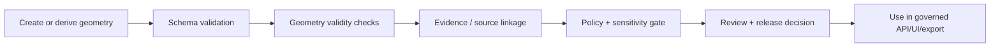

<!-- [KFM_META_BLOCK_V2]
doc_id: kfm://contract/common/spatial-geometry
title: contracts/common/spatial_geometry.md — SpatialGeometry Contract
type: contract
version: v0.2
status: draft
owners: OWNER_TBD — Contract steward · Schema steward · GIS steward · Policy steward · Validation steward · Release steward · Docs steward
created: 2026-06-20
updated: 2026-06-20
policy_label: public; contracts; common; spatial-geometry; semantic-contract; shared-kernel; geoprivacy-aware
related:
  - ./README.md
  - ../../schemas/contracts/v1/common/spatial_geometry.schema.json
  - ../../fixtures/contracts/v1/common/spatial_geometry/
  - ../../tools/validators/validate_spatial_geometry.py
  - ../../policy/common/
  - ../../policy/sensitivity/
  - ../../docs/architecture/contract-schema-policy-split.md
  - ../../data/proofs/
  - ../../release/
tags: [kfm, contracts, common, spatial-geometry, geometry, crs, precision-bucket, geoprivacy, shared-kernel, evidence, governance]
notes:
  - "Expanded from scaffold into a semantic contract for the common spatial_geometry object."
  - "Machine-checkable shape is in schemas/contracts/v1/common/spatial_geometry.schema.json. This edit does not change schema fields, enum values, or validation rules."
  - "Declared validator exists but is a greenfield placeholder that raises NotImplementedError; validation behavior remains NEEDS VERIFICATION."
  - "spatial_geometry is a geometry carrier, not a map-rendering instruction, not a CRS transformation engine, not a geocoder, not proof of survey accuracy, and not permission to expose sensitive locations."
[/KFM_META_BLOCK_V2] -->

<a id="top"></a>

# SpatialGeometry Contract

> Semantic contract for `spatial_geometry`, a common KFM geometry carrier that binds a geometry payload to an explicit coordinate reference system and a precision bucket so downstream policy, evidence, validation, and release gates can reason about spatial exposure.

<p>
  
  
  
  
  
  
</p>

`contracts/common/spatial_geometry.md`

## Quick jumps

[Status](#status) · [Meaning](#meaning) · [Repo fit](#repo-fit) · [Schema pairing](#schema-pairing) · [Accepted uses](#accepted-uses) · [Exclusions](#exclusions) · [Fields](#fields) · [Invariants](#invariants) · [Precision buckets](#precision-buckets) · [Sensitive-location posture](#sensitive-location-posture) · [Examples](#examples) · [Compatibility and versioning](#compatibility-and-versioning) · [Lifecycle](#lifecycle) · [Validation](#validation) · [No-loss preservation](#no-loss-preservation) · [Evidence basis](#evidence-basis) · [Rollback](#rollback) · [Definition of done](#definition-of-done)

---

## Status

> [!IMPORTANT]
> **Status:** `draft` / semantic contract  
> **Owner:** `OWNER_TBD`  
> **Contract path:** `contracts/common/spatial_geometry.md`  
> **Schema path:** `schemas/contracts/v1/common/spatial_geometry.schema.json`  
> **Truth posture:** `CONFIRMED` contract path, schema path, schema shape, and current update; validator file exists but is a placeholder; fixtures, policy behavior, runtime integration, CRS transformation behavior, geometry validity checks, and downstream usage remain `NEEDS VERIFICATION`.

---

## Meaning

`spatial_geometry` is a compact spatial carrier for a governed KFM geometry.

It answers three questions:

1. **What geometry is being carried?** — `geometry`.
2. **What coordinate reference system gives the coordinates meaning?** — `crs`.
3. **What precision/exposure tier should downstream gates assume?** — `precision_bucket`.

This contract exists because many KFM object families need to carry a geometry while preserving a shared language for coordinate reference, precision, geoprivacy, and release posture.

`spatial_geometry` is a shared-kernel value object. It must stay small, stable, and semantically narrow.

---

## Repo fit

```text
contracts/
└── common/
    ├── README.md
    ├── identity_token.md
    └── spatial_geometry.md

schemas/
└── contracts/
    └── v1/
        └── common/
            └── spatial_geometry.schema.json
```

Adjacent responsibility roots:

| Root | Relationship to this contract |
|---|---|
| `./README.md` | Common contract directory boundary and shared-kernel discipline. |
| `../../schemas/contracts/v1/common/spatial_geometry.schema.json` | Machine-checkable shape for this contract. |
| `../../fixtures/contracts/v1/common/spatial_geometry/` | Schema-declared fixture root; existence and coverage remain `NEEDS VERIFICATION`. |
| `../../tools/validators/validate_spatial_geometry.py` | Schema-declared validator; exists as a placeholder, behavior not implemented. |
| `../../policy/common/` | Schema-declared policy home; existence and behavior remain `NEEDS VERIFICATION`. |
| `../../policy/sensitivity/` | Expected sensitivity/geoprivacy policy surface for location exposure. |
| Domain contracts | Own domain-specific meaning of the thing being located; `spatial_geometry` only carries common geometry semantics. |

---

## Schema pairing

The paired schema is:

```text
schemas/contracts/v1/common/spatial_geometry.schema.json
```

The schema defines machine shape. This Markdown contract defines meaning.

The current schema metadata identifies:

| Schema metadata | Value | Verification posture |
|---|---|---|
| `$id` | `https://schemas.kfm.local/contracts/v1/common/spatial_geometry.schema.json` | `CONFIRMED` from schema. |
| `contract_doc` | `contracts/common/spatial_geometry.md` | `CONFIRMED` from schema. |
| `fixtures_root` | `fixtures/contracts/v1/common/spatial_geometry/` | `NEEDS VERIFICATION` existence/coverage. |
| `validator` | `tools/validators/validate_spatial_geometry.py` | `CONFIRMED` file exists; behavior is placeholder / `NEEDS IMPLEMENTATION`. |
| `policy` | `policy/common/` | `NEEDS VERIFICATION` existence/behavior. |
| `status` | `PROPOSED` | `CONFIRMED` from schema metadata. |

---

## Accepted uses

| Use | Allowed? | Rule |
|---|---:|---|
| Carrying a geometry with explicit CRS and precision posture | Yes | Required fields are `geometry`, `crs`, and `precision_bucket`. |
| Referencing a common geometry from domain contracts | Yes | Domain contract still owns what the geometry means. |
| Supporting policy decisions about location exposure | Yes | `precision_bucket` is policy-relevant but not policy by itself. |
| Public display after release gates | Conditional | Requires sensitivity, rights, audience, review, redaction/geoprivacy, and release checks where applicable. |
| Claiming survey accuracy | No | `precision_bucket: survey` is not proof of survey authority without evidence. |
| Performing CRS transformation or geometry repair | No | Transformation/repair belongs in tools, validators, or processing pipelines. |
| Encoding map styling or UI rendering | No | Map/UI behavior belongs in governed UI/style roots. |

---

## Exclusions

| Does not belong in `spatial_geometry` | Correct owner / surface |
|---|---|
| Domain meaning of the located object | Owning domain contract. |
| JSON Schema beyond the paired shape | `../../schemas/contracts/v1/common/spatial_geometry.schema.json`. |
| CRS transformation rules and coordinate reprojection logic | Processing tools / validators after accepted placement. |
| Geometry validity/repair implementation | Validators or geometry-processing packages. |
| Public geoprivacy transform values | Policy bundles; do not expose sensitive thresholds in public contract docs. |
| Source-derived precision evidence | EvidenceBundle / SourceDescriptor / source-family contracts. |
| Release permission | PolicyDecision, ReviewRecord, ReleaseManifest, and release gates. |
| Map rendering style | UI/style/map roots. |
| Tiles, PMTiles, GeoParquet, vector indexes, or scene assets | Data/artifact/publication roots after validation and release. |
| Exact sensitive-location publication | Denied unless governed redaction/review/policy/release gates allow safe transformed representation. |

---

## Fields

| Field | Required by schema | Semantic meaning | Notes |
|---|---:|---|---|
| `geometry` | Yes | Geometry payload being carried. | Current schema requires nested `type` and `coordinates`, but does not restrict geometry type or coordinate shape. |
| `crs` | Yes | Coordinate reference system identifier that gives the coordinates meaning. | Must be explicit. `UNKNOWN`/implicit CRS must not be normalized into public or promoted geometry. |
| `precision_bucket` | Yes | Coarse, policy-evaluable precision posture. | Current enum: `survey`, `parcel`, `community`, `region`, `coarse`. |

---

## Invariants

A `spatial_geometry` must preserve these invariants:

- `geometry`, `crs`, and `precision_bucket` must be present.
- `geometry.type` and `geometry.coordinates` must be present in the nested geometry object.
- `crs` must be explicit and meaningful to the consumer.
- `precision_bucket` must remain a closed enum value until a schema version explicitly changes it.
- `precision_bucket` is a policy-relevant declaration, not proof of accuracy or release permission.
- Exact or high-precision geometry must not be public by default.
- Sensitive-location exposure must be evaluated through policy/review/release gates before publication.
- A valid shape must not be treated as proof that the geometry is correct, source-authoritative, rights-cleared, policy-allowed, or released.
- Geometry used for claims must retain EvidenceRef/EvidenceBundle support through the owning object, receipt, or release surface.

---

## Precision buckets

| Bucket | Meaning | Governance posture |
|---|---|---|
| `survey` | Highest precision posture; may imply field-grade or instrument-grade geometry. | Requires evidence before being treated as authoritative; sensitive public exposure fails closed. |
| `parcel` | Parcel- or property-scale geometry. | May implicate land, ownership, infrastructure, or privacy; policy checks required. |
| `community` | Community/neighborhood/local-area precision. | Often safer than parcel/survey but still policy-relevant. |
| `region` | Regional generalized geometry. | Common public-safe posture when supported by release gates. |
| `coarse` | Very generalized geometry. | Lowest precision posture; still not automatically publishable. |

> [!CAUTION]
> `precision_bucket` is not a release decision. A geometry can be coarse and still sensitive, or survey-grade and allowed only in restricted/admin contexts.

---

## Sensitive-location posture

`spatial_geometry` is intentionally geoprivacy-aware.

Rules:

- sensitive ecology, archaeology, infrastructure, living-person, land/title, cultural, and other protected location contexts fail closed unless policy permits exposure;
- exact coordinates must not be exposed merely because they validate against shape;
- transformed public geometry must carry or link to appropriate redaction/generalization/aggregation receipts where required;
- public UI, API, AI, tile, scene, and export surfaces must use governed, released, policy-safe geometry;
- consumers must not reverse-join generalized public geometry back to restricted exact geometry.

---

## Examples

These examples are illustrative and must still validate against the schema, owning domain contracts, policy, and release gates.

### Valid shape — coarse regional polygon

```json
{
  "geometry": {
    "type": "Polygon",
    "coordinates": [
      [
        [-99.0, 38.0],
        [-98.5, 38.0],
        [-98.5, 38.5],
        [-99.0, 38.5],
        [-99.0, 38.0]
      ]
    ]
  },
  "crs": "EPSG:4326",
  "precision_bucket": "region"
}
```

### Valid shape — point with explicit CRS

```json
{
  "geometry": {
    "type": "Point",
    "coordinates": [-98.7654, 38.1234]
  },
  "crs": "EPSG:4326",
  "precision_bucket": "parcel"
}
```

### Invalid shape — missing CRS

```json
{
  "geometry": {
    "type": "Point",
    "coordinates": [-98.7654, 38.1234]
  },
  "precision_bucket": "parcel"
}
```

The invalid example fails the current schema because `crs` is required. It also violates this contract because coordinates without explicit CRS are not governed spatial evidence.

---

## Compatibility and versioning

Current compatibility posture:

- Schema status is `PROPOSED` according to `x-kfm.status`.
- `precision_bucket` values are closed in the current schema.
- The current schema allows any `geometry.type` string and unconstrained `coordinates`; stricter geometry typing would be a schema change.
- The current schema permits additional nested properties inside `geometry` but forbids additional top-level properties.
- Adding new precision buckets is compatibility-significant and requires schema, fixture, validator, policy, and consumer updates.
- Changing CRS requirements or default assumptions is compatibility-significant and requires migration review.

Versioning expectations:

1. Update this contract when field meaning changes.
2. Update the schema when machine shape changes.
3. Add fixtures for valid and invalid cases.
4. Update validators and policy gates where applicable.
5. Record migration and rollback posture for consumers.

---

## Lifecycle



Lifecycle notes:

- A geometry may be created during RAW/WORK processing, derived during PROCESSED generation, or transformed for public release.
- Schema validation proves only shape.
- Geometry validity checks prove only geometric consistency, not source authority or release eligibility.
- Policy/review/release gates decide whether a geometry may be exposed for a specific audience and purpose.
- Supersession of geometry must preserve correction/rollback posture in the owning object, receipt, or release record.

---

## Validation

Before relying on this contract, verify:

- schema validation passes against `schemas/contracts/v1/common/spatial_geometry.schema.json`;
- validator implementation exists beyond the current placeholder and covers valid/invalid cases;
- fixtures exist under the schema-declared fixture root;
- supported geometry types are either intentionally open or tightened by schema;
- coordinate order, dimensionality, ring closure, topology, and geometry validity checks are specified somewhere enforceable;
- CRS values are constrained or resolved by an accepted CRS policy/registry;
- `precision_bucket` remains closed or versioned changes are documented;
- policy behavior for sensitive/high-precision geometry exists in an accepted policy root;
- public-release contexts check sensitivity, rights, audience, review state, redaction/geoprivacy receipts, and release state before exposing geometry;
- downstream consumers do not treat schema-valid geometry as source-authoritative or release-approved by itself.

---

## No-loss preservation

| Existing element | Disposition | Reason |
|---|---|---|
| Prior meaning section | `KEEP + EXPAND` | The scaffold correctly identified governed semantics; v0.2 adds concrete spatial meaning. |
| Schema URL | `KEEP + GROUND` | The paired schema exists and is now cited through repo evidence. |
| Field section | `KEEP + REPLACE WITH SEMANTIC TABLE` | The old field section delegated too much meaning to schema properties. |
| Invariants | `KEEP + STRENGTHEN` | Required fields/enums/no-extra-properties were preserved and expanded with KFM spatial and geoprivacy constraints. |
| Lifecycle | `KEEP + CLARIFY` | The lifecycle now separates creation/derivation, schema validation, geometry checks, evidence linkage, policy, release, and use. |
| Open questions | `KEEP + MOVE INTO VALIDATION / DEFINITION OF DONE` | Open verification items are now testable checklist items. |

---

## Evidence basis

| Source | Status | Supports | Limits |
|---|---|---|---|
| Prior `contracts/common/spatial_geometry.md` scaffold | `CONFIRMED` | Contract existed and referenced the schema URL, lifecycle, and open verification note. | Scaffold delegated field meaning to schema and lacked semantic boundaries. |
| `schemas/contracts/v1/common/spatial_geometry.schema.json` | `CONFIRMED` | Current field set, required fields, precision enum values, top-level additionalProperties false, and x-kfm metadata. | Schema does not prove geometry validity, CRS policy, release permission, or validator behavior. |
| `tools/validators/validate_spatial_geometry.py` | `CONFIRMED placeholder` | Declared validator path exists. | It raises `NotImplementedError`; validation behavior is not implemented. |
| `contracts/common/README.md` | `CONFIRMED` | Common contracts may define small cross-cutting value objects only when no single domain owns them; common must stay narrow. | Does not prove individual common contract inventory. |
| `docs/architecture/contract-schema-policy-split.md` | `CONFIRMED` | Contracts define meaning; schemas define shape; policy decides admissibility; tests/fixtures prove enforceability. | Path presence and runtime behavior remain verification-bound. |
| Uploaded `KFM Repository Markdown Authoring Agent — Full Operating Prompt v2` | `CONFIRMED user-supplied guidance` | Requires no-loss preservation, evidence grounding, truth labels, GitHub polish, contract/schema doc sections, Markdown QA, and pre-publish discipline. | It is authoring guidance, not repo implementation proof. |

---

## Rollback

Rollback is required if this contract is used as a schema authority, CRS transformation engine, geometry repair implementation, map renderer, release decision, or permission to expose exact/sensitive locations.

Rollback target: prior scaffold content SHA `f0945594fb5f2553f62248de35052c3074a10056`.

---

## Definition of done

- [ ] Owners are confirmed and `OWNER_TBD` is replaced.
- [ ] Validator is implemented beyond placeholder behavior.
- [ ] Fixtures exist and cover valid/invalid/denied/abstain cases where applicable.
- [ ] Supported geometry types and coordinate rules are explicit and tested.
- [ ] CRS values are constrained or resolved by accepted CRS policy/registry.
- [ ] Policy behavior for precision buckets is linked and verified.
- [ ] Public-release review confirms geoprivacy and sensitivity exposure rules.
- [ ] Downstream consumers document how geometry is resolved, transformed, validated, and released.
- [ ] Any precision-bucket or geometry-type expansion is versioned and migration-tested.

---

## Status summary

`spatial_geometry` is a common semantic value object for carrying geometry, CRS, and precision posture. It is not the located object itself, not proof of spatial accuracy, not proof of source authority, not a CRS transformation engine, not a geometry validator, not map rendering instructions, not a release artifact, and not permission to expose sensitive location.

<p align="right"><a href="#top">Back to top</a></p>
