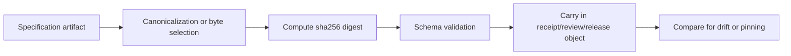

<!-- [KFM_META_BLOCK_V2]
doc_id: kfm://contract/common/spec-hash
title: contracts/common/spec_hash.md — SpecHash Contract
type: contract
version: v0.2
status: draft
owners: OWNER_TBD — Contract steward · Schema steward · Release steward · Validation steward · Provenance steward · Docs steward
created: 2026-06-20
updated: 2026-06-20
policy_label: public; contracts; common; spec-hash; semantic-contract; shared-kernel; integrity-reference
related:
  - ./README.md
  - ../../schemas/contracts/v1/common/spec_hash.schema.json
  - ../../fixtures/contracts/v1/common/spec_hash/
  - ../../tools/validators/validate_spec_hash.py
  - ../../policy/common/
  - ../../docs/architecture/contract-schema-policy-split.md
  - ../../data/proofs/
  - ../../release/
tags: [kfm, contracts, common, spec-hash, sha256, integrity, provenance, deterministic-reference, shared-kernel, governance]
notes:
  - "Expanded from scaffold into a semantic contract for the common spec_hash object."
  - "Machine-checkable shape is in schemas/contracts/v1/common/spec_hash.schema.json. This edit does not change schema fields, pattern, or validation rules."
  - "Declared validator exists but is a greenfield placeholder that raises NotImplementedError; validation behavior remains NEEDS VERIFICATION."
  - "spec_hash is an integrity/reference carrier for a specification byte/string representation, not proof of correctness, admissibility, release, policy approval, or evidence closure."
[/KFM_META_BLOCK_V2] -->

<a id="top"></a>

# SpecHash Contract

> Semantic contract for `spec_hash`, a compact common value object that carries a `sha256:<64 lowercase hex>` reference to a specification representation so KFM can compare, receipt, and audit whether two parties are referring to the same specification bytes or canonicalized text.

<p>
  
  
  
  
  
  
  
</p>

`contracts/common/spec_hash.md`

## Quick jumps

[Status](#status) · [Meaning](#meaning) · [Repo fit](#repo-fit) · [Schema pairing](#schema-pairing) · [Accepted uses](#accepted-uses) · [Exclusions](#exclusions) · [Fields](#fields) · [Invariants](#invariants) · [Hash semantics](#hash-semantics) · [Examples](#examples) · [Compatibility and versioning](#compatibility-and-versioning) · [Lifecycle](#lifecycle) · [Validation](#validation) · [No-loss preservation](#no-loss-preservation) · [Evidence basis](#evidence-basis) · [Rollback](#rollback) · [Definition of done](#definition-of-done)

---

## Status

> [!IMPORTANT]
> **Status:** `draft` / semantic contract  
> **Owner:** `OWNER_TBD`  
> **Contract path:** `contracts/common/spec_hash.md`  
> **Schema path:** `schemas/contracts/v1/common/spec_hash.schema.json`  
> **Truth posture:** `CONFIRMED` contract path, schema path, schema shape, schema pattern, and current update; validator file exists but is a placeholder; fixtures, policy behavior, canonicalization algorithm, producer behavior, and downstream usage remain `NEEDS VERIFICATION`.

---

## Meaning

`spec_hash` is a compact integrity/reference carrier for a specification representation.

It answers one narrow question:

> Are these parties referring to the same hashed specification representation?

A `spec_hash` may be used by contracts, schemas, policies, receipts, release manifests, validators, model/run receipts, or review records to reference a spec surface without embedding that whole spec.

It does **not** prove that the referenced specification is correct, complete, current, admissible, validated, policy-approved, evidence-backed, released, or safe to publish.

---

## Repo fit

```text
contracts/
└── common/
    ├── README.md
    ├── identity_token.md
    ├── spatial_geometry.md
    └── spec_hash.md

schemas/
└── contracts/
    └── v1/
        └── common/
            └── spec_hash.schema.json
```

Adjacent responsibility roots:

| Root | Relationship to this contract |
|---|---|
| `./README.md` | Common contract directory boundary and shared-kernel discipline. |
| `../../schemas/contracts/v1/common/spec_hash.schema.json` | Machine-checkable shape for this contract. |
| `../../fixtures/contracts/v1/common/spec_hash/` | Schema-declared fixture root; existence and coverage remain `NEEDS VERIFICATION`. |
| `../../tools/validators/validate_spec_hash.py` | Schema-declared validator; exists as a placeholder, behavior not implemented. |
| `../../policy/common/` | Schema-declared policy home; existence and behavior remain `NEEDS VERIFICATION`. |
| `../../data/proofs/` | Evidence/proof surfaces may cite or carry spec hashes but remain separate proof authority. |
| `../../release/` | Release surfaces may record spec hashes but release authority remains in release records, not in the hash. |

---

## Schema pairing

The paired schema is:

```text
schemas/contracts/v1/common/spec_hash.schema.json
```

The schema defines machine shape. This Markdown contract defines meaning.

The current schema metadata identifies:

| Schema metadata | Value | Verification posture |
|---|---|---|
| `$id` | `https://schemas.kfm.local/contracts/v1/common/spec_hash.schema.json` | `CONFIRMED` from schema. |
| `contract_doc` | `contracts/common/spec_hash.md` | `CONFIRMED` from schema. |
| `fixtures_root` | `fixtures/contracts/v1/common/spec_hash/` | `NEEDS VERIFICATION` existence/coverage. |
| `validator` | `tools/validators/validate_spec_hash.py` | `CONFIRMED` file exists; behavior is placeholder / `NEEDS IMPLEMENTATION`. |
| `policy` | `policy/common/` | `NEEDS VERIFICATION` existence/behavior. |
| `status` | `PROPOSED` | `CONFIRMED` from schema metadata. |

---

## Accepted uses

| Use | Allowed? | Rule |
|---|---:|---|
| Referencing a known specification representation in a receipt, manifest, review, or contract | Yes | The hash can identify the bytes/text representation used by the producer. |
| Detecting drift between two spec representations | Yes | Matching hashes imply same hashed representation; differing hashes imply a representation difference or canonicalization mismatch. |
| Pinning a versioned spec surface in audit records | Yes | Pair with version, source, issuer, date, and EvidenceRef where meaningful. |
| Proving a spec is correct or authoritative | No | Correctness and authority require review, evidence, and release context. |
| Proving schema validity | No | Schema validation belongs in validators/tests. |
| Proving policy admissibility | No | Policy decisions belong in policy roots and PolicyDecision records. |
| Storing secrets or signed credentials | No | This is a plain hash reference, not a secret or signature. |

---

## Exclusions

| Does not belong in `spec_hash` | Correct owner / surface |
|---|---|
| Full specification body | Owning contract/schema/policy/doc artifact. |
| Hash algorithm negotiation | Versioned schema/contract update or separate crypto/integrity standard. |
| Canonicalization algorithm | Validator/tooling docs or a separate canonicalization standard. |
| Digital signature or attestation | Signature/proof/attestation contract after accepted placement. |
| Policy allowance | PolicyDecision / policy roots. |
| Evidence closure | EvidenceBundle / proof roots. |
| Release authority | ReleaseManifest / PromotionDecision / rollback records. |
| Runtime validation result | ValidationReport / RunReceipt / Runtime contract family. |
| Secrets, credentials, API keys, JWTs, or bearer tokens | Security/authentication contracts and policy. |

---

## Fields

| Field | Required by schema | Semantic meaning | Notes |
|---|---:|---|---|
| `value` | Yes | SHA-256 hash reference in URI-like string form. | Current pattern is `^sha256:[a-f0-9]{64}$`. Lowercase hexadecimal is required by schema. |

---

## Invariants

A `spec_hash` must preserve these invariants:

- `value` must be present.
- `value` must match the current schema pattern: `sha256:` followed by 64 lowercase hexadecimal characters.
- The hash names a representation; it does not by itself name the semantic object being represented.
- The producer must know what was hashed and how it was canonicalized, but that canonicalization procedure is not defined by the current schema.
- Consumers must not treat a valid hash string as proof of correctness, authority, freshness, policy allowance, evidence closure, or release state.
- Hash comparison is only meaningful when the compared values were produced from the same canonicalization rules and intended spec surface.
- Any migration to a new algorithm, prefix, encoding, or canonicalization rule must be versioned and tested.

---

## Hash semantics

`spec_hash.value` has this structure:

```text
sha256:<64 lowercase hex characters>
```

Semantic interpretation:

| Segment | Meaning | Verification posture |
|---|---|---|
| `sha256:` | Algorithm prefix declared by current schema pattern. | `CONFIRMED` shape requirement. |
| `<64 lowercase hex>` | SHA-256 digest material in lowercase hexadecimal form. | `CONFIRMED` shape requirement. |
| Canonicalization source | The exact bytes or canonicalized text that were hashed. | `NEEDS VERIFICATION`; not represented in current schema. |
| Producer context | Who created the hash, when, and for what artifact. | `NEEDS VERIFICATION`; must be carried by surrounding receipt/review/release object if needed. |

---

## Examples

These examples are illustrative and must still validate against the schema and producer canonicalization rules.

### Valid shape

```json
{
  "value": "sha256:0123456789abcdef0123456789abcdef0123456789abcdef0123456789abcdef"
}
```

### Invalid shape — missing prefix

```json
{
  "value": "0123456789abcdef0123456789abcdef0123456789abcdef0123456789abcdef"
}
```

### Invalid shape — uppercase hex

```json
{
  "value": "sha256:0123456789ABCDEF0123456789ABCDEF0123456789ABCDEF0123456789ABCDEF"
}
```

The invalid examples fail the current schema pattern. They also violate the contract because the current semantic surface uses the exact `sha256:<lowercase-hex>` representation.

---

## Compatibility and versioning

Current compatibility posture:

- Schema status is `PROPOSED` according to `x-kfm.status`.
- Current schema supports only one top-level field: `value`.
- Current schema supports only the `sha256:` prefix with lowercase hex.
- Current schema does not represent canonicalization method, source artifact URI, issuer, timestamp, signature, or algorithm alternatives.
- Adding another algorithm, case variant, source field, canonicalization method, or signature field is compatibility-significant and requires schema, fixture, validator, policy, and consumer review.

Versioning expectations:

1. Update this contract when hash meaning changes.
2. Update the schema when machine shape or accepted pattern changes.
3. Add fixtures for valid and invalid cases.
4. Update validators and policy gates where applicable.
5. Record migration and rollback posture for consumers.

---

## Lifecycle



Lifecycle notes:

- `spec_hash` may be generated from a contract, schema, policy bundle, release manifest, review packet, validator spec, or other specification artifact.
- Schema validation proves only that the hash string has the accepted shape.
- Drift detection is meaningful only when producers used the same canonicalization rules.
- Release and policy decisions must be recorded outside this value object.
- If a referenced spec is corrected or superseded, downstream receipts and release records must preserve correction and rollback posture.

---

## Validation

Before relying on this contract, verify:

- schema validation passes against `schemas/contracts/v1/common/spec_hash.schema.json`;
- validator implementation exists beyond the current placeholder and covers valid/invalid cases;
- fixtures exist under the schema-declared fixture root;
- producers define what artifact or canonicalized representation is hashed;
- canonicalization rules are documented where hashes are compared across producers;
- hash comparisons are not used as proof of correctness, policy allowance, evidence closure, or release state;
- consumers do not store secrets, signatures, credentials, or source bodies in `spec_hash`;
- any future algorithm/pattern expansion is versioned and migration-tested.

---

## No-loss preservation

| Existing element | Disposition | Reason |
|---|---|---|
| Prior meaning section | `KEEP + EXPAND` | The scaffold correctly identified governed semantics; v0.2 adds concrete hash meaning. |
| Schema URL | `KEEP + GROUND` | The paired schema exists and is now cited through repo evidence. |
| Field section | `KEEP + REPLACE WITH SEMANTIC TABLE` | The old field section delegated too much meaning to schema properties. |
| Invariants | `KEEP + STRENGTHEN` | Required field and closed pattern were preserved and expanded with integrity/reference constraints. |
| Lifecycle | `KEEP + CLARIFY` | The lifecycle now separates artifact selection, canonicalization, digest computation, schema validation, receipt linkage, and drift comparison. |
| Open questions | `KEEP + MOVE INTO VALIDATION / DEFINITION OF DONE` | Open verification items are now testable checklist items. |

---

## Evidence basis

| Source | Status | Supports | Limits |
|---|---|---|---|
| Prior `contracts/common/spec_hash.md` scaffold | `CONFIRMED` | Contract existed and referenced the schema URL, lifecycle, and open verification note. | Scaffold delegated field meaning to schema and lacked semantic boundaries. |
| `schemas/contracts/v1/common/spec_hash.schema.json` | `CONFIRMED` | Current field set, required field, lowercase `sha256:<64 hex>` pattern, top-level additionalProperties false, and x-kfm metadata. | Schema does not prove canonicalization method, producer behavior, policy allowance, or validator behavior. |
| `tools/validators/validate_spec_hash.py` | `CONFIRMED placeholder` | Declared validator path exists. | It raises `NotImplementedError`; validation behavior is not implemented. |
| `contracts/common/README.md` | `CONFIRMED` | Common contracts may define small cross-cutting value objects only when no single domain owns them; common must stay narrow. | Does not prove individual common contract inventory. |
| `docs/architecture/contract-schema-policy-split.md` | `CONFIRMED` | Contracts define meaning; schemas define shape; policy decides admissibility; tests/fixtures prove enforceability. | Path presence and runtime behavior remain verification-bound. |
| Uploaded `KFM Repository Markdown Authoring Agent — Full Operating Prompt v2` | `CONFIRMED user-supplied guidance` | Requires no-loss preservation, evidence grounding, truth labels, GitHub polish, contract/schema doc sections, Markdown QA, and pre-publish discipline. | It is authoring guidance, not repo implementation proof. |

---

## Rollback

Rollback is required if this contract is used as proof of correctness, release approval, policy allowance, evidence closure, canonicalization behavior, digital signature, attestation, or secret/credential handling.

Rollback target: prior scaffold content SHA `0e597b209c53da691889875fae46cbf7a6be64a1`.

---

## Definition of done

- [ ] Owners are confirmed and `OWNER_TBD` is replaced.
- [ ] Validator is implemented beyond placeholder behavior.
- [ ] Fixtures exist and cover valid/invalid cases.
- [ ] Canonicalization rules are documented wherever hashes are compared across producers.
- [ ] Producers identify the artifact or representation being hashed in surrounding receipt/review/release records.
- [ ] Consumers do not treat `spec_hash` as proof of correctness, evidence closure, policy allowance, or release state.
- [ ] Any algorithm or pattern expansion is versioned and migration-tested.
- [ ] Policy behavior is either linked or explicitly marked not applicable.

---

## Status summary

`spec_hash` is a common semantic value object for carrying a `sha256:<64 lowercase hex>` specification hash. It is not the specification itself, not proof of correctness, not proof of evidence, not proof of policy allowance, not a release artifact, not a signature, not an attestation, and not a security credential.

<p align="right"><a href="#top">Back to top</a></p>
