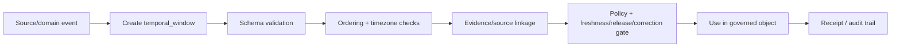

<!-- [KFM_META_BLOCK_V2]
doc_id: kfm://contract/common/temporal-window
title: contracts/common/temporal_window.md — TemporalWindow Contract
type: contract
version: v0.2
status: draft
owners: OWNER_TBD — Contract steward · Schema steward · Temporal steward · Policy steward · Validation steward · Release steward · Docs steward
created: 2026-06-20
updated: 2026-06-20
policy_label: public; contracts; common; temporal-window; semantic-contract; shared-kernel; time-aware
tags: [kfm, contracts, common, temporal-window, time-kind, observed, published, ingested, effective, corrected, superseded, provenance, governance]
related:
  - ./README.md
  - ../../schemas/contracts/v1/common/temporal_window.schema.json
  - ../../fixtures/contracts/v1/common/temporal_window/
  - ../../tools/validators/validate_temporal_window.py
  - ../../policy/common/
  - ../../docs/architecture/contract-schema-policy-split.md
  - ../../packages/temporal/
  - ../../data/proofs/
  - ../../release/
notes:
  - "Expanded from scaffold into a semantic contract for the common temporal_window object."
  - "Machine-checkable shape is in schemas/contracts/v1/common/temporal_window.schema.json. This edit does not change schema fields, enum values, or validation rules."
  - "Declared validator exists but is a greenfield placeholder that raises NotImplementedError; validation behavior remains NEEDS VERIFICATION."
  - "temporal_window is a time-window carrier with explicit time_kind, not proof of chronology, freshness, source authority, publication state, or correction closure by itself."
[/KFM_META_BLOCK_V2] -->

<a id="top"></a>

# TemporalWindow Contract

> Semantic contract for `temporal_window`, a common KFM time-window carrier that binds a start date-time, end date-time, and explicit `time_kind` so downstream evidence, policy, review, correction, and release gates can reason about what kind of time is being described.

<p>
  
  
  
  
  
  
</p>

`contracts/common/temporal_window.md`

## Quick jumps

[Status](#status) · [Meaning](#meaning) · [Repo fit](#repo-fit) · [Schema pairing](#schema-pairing) · [Accepted uses](#accepted-uses) · [Exclusions](#exclusions) · [Fields](#fields) · [Invariants](#invariants) · [Allowed time kinds](#allowed-time-kinds) · [Temporal semantics](#temporal-semantics) · [Examples](#examples) · [Compatibility and versioning](#compatibility-and-versioning) · [Lifecycle](#lifecycle) · [Validation](#validation) · [No-loss preservation](#no-loss-preservation) · [Evidence basis](#evidence-basis) · [Rollback](#rollback) · [Definition of done](#definition-of-done)

---

## Status

> [!IMPORTANT]
> **Status:** `draft` / semantic contract  
> **Owner:** `OWNER_TBD`  
> **Contract path:** `contracts/common/temporal_window.md`  
> **Schema path:** `schemas/contracts/v1/common/temporal_window.schema.json`  
> **Truth posture:** `CONFIRMED` contract path, schema path, schema shape, schema enum values, and current update; validator file exists but is a placeholder; fixtures, policy behavior, interval ordering checks, timezone normalization rules, temporal package integration, and downstream usage remain `NEEDS VERIFICATION`.

---

## Meaning

`temporal_window` is a compact time-window value object for governed KFM records.

It answers three questions:

1. **When does the window begin?** — `start`.
2. **When does the window end?** — `end`.
3. **What kind of time does this window represent?** — `time_kind`.

This contract exists because KFM records often need more than one kind of time. Observation time, source publication time, ingest time, effective time, correction time, and supersession time are not interchangeable.

`temporal_window` is a shared-kernel value object. It must stay small, stable, explicit, and semantically narrow.

---

## Repo fit

```text
contracts/
└── common/
    ├── README.md
    ├── identity_token.md
    ├── spatial_geometry.md
    ├── spec_hash.md
    └── temporal_window.md

schemas/
└── contracts/
    └── v1/
        └── common/
            └── temporal_window.schema.json
```

Adjacent responsibility roots:

| Root | Relationship to this contract |
|---|---|
| `./README.md` | Common contract directory boundary and shared-kernel discipline. |
| `../../schemas/contracts/v1/common/temporal_window.schema.json` | Machine-checkable shape for this contract. |
| `../../fixtures/contracts/v1/common/temporal_window/` | Schema-declared fixture root; existence and coverage remain `NEEDS VERIFICATION`. |
| `../../tools/validators/validate_temporal_window.py` | Schema-declared validator; exists as a placeholder, behavior not implemented. |
| `../../policy/common/` | Schema-declared policy home; existence and behavior remain `NEEDS VERIFICATION`. |
| `../../packages/temporal/` | Candidate temporal package/integration surface; behavior not proven by this contract. |
| Domain contracts | Own domain-specific temporal meaning beyond the common carrier. |

---

## Schema pairing

The paired schema is:

```text
schemas/contracts/v1/common/temporal_window.schema.json
```

The schema defines machine shape. This Markdown contract defines meaning.

The current schema metadata identifies:

| Schema metadata | Value | Verification posture |
|---|---|---|
| `$id` | `https://schemas.kfm.local/contracts/v1/common/temporal_window.schema.json` | `CONFIRMED` from schema. |
| `contract_doc` | `contracts/common/temporal_window.md` | `CONFIRMED` from schema. |
| `fixtures_root` | `fixtures/contracts/v1/common/temporal_window/` | `NEEDS VERIFICATION` existence/coverage. |
| `validator` | `tools/validators/validate_temporal_window.py` | `CONFIRMED` file exists; behavior is placeholder / `NEEDS IMPLEMENTATION`. |
| `policy` | `policy/common/` | `NEEDS VERIFICATION` existence/behavior. |
| `status` | `PROPOSED` | `CONFIRMED` from schema metadata. |

---

## Accepted uses

| Use | Allowed? | Rule |
|---|---:|---|
| Carrying an explicit time interval in a governed object | Yes | Use `start`, `end`, and `time_kind` together. |
| Distinguishing observation, publication, ingestion, effective, correction, and supersession windows | Yes | Use the current closed `time_kind` enum. |
| Supporting policy decisions about freshness, release, correction, or supersession | Yes | `time_kind` is policy-relevant but not policy by itself. |
| Representing open-ended time without `end` | No | Current schema requires `end`. Use a future schema change if open intervals are needed. |
| Treating `published` time as release approval | No | Publication timestamp is not a ReleaseManifest or PromotionDecision. |
| Treating `corrected` time as correction closure | No | Correction closure belongs in correction/review/release records. |
| Treating a valid interval as proof of source truth | No | Time shape is not evidence, source authority, or proof. |

---

## Exclusions

| Does not belong in `temporal_window` | Correct owner / surface |
|---|---|
| Full source publication metadata | SourceDescriptor/source contracts. |
| Full evidence time lineage | EvidenceBundle/evidence contracts. |
| Review, correction, or release decision state | Governance, correction, policy, and release contracts. |
| Runtime duration metrics | Runtime/run receipt contracts unless they intentionally carry this common value object. |
| Timezone normalization implementation | Temporal package or validator/tooling layer. |
| Calendar/date parsing rules | Temporal package or validator/tooling layer. |
| Policy thresholds for freshness/expiry/embargo | Policy roots. |
| Open-ended intervals, recurring intervals, fuzzy dates, or temporal uncertainty models | Future/versioned contract or domain-specific contract. |
| Domain-specific chronology claims | Owning domain contract and evidence bundle. |

---

## Fields

| Field | Required by schema | Semantic meaning | Notes |
|---|---:|---|---|
| `start` | Yes | Inclusive or declared beginning date-time of the window. | Current schema requires date-time format but does not enforce ordering or inclusivity semantics by itself. |
| `end` | Yes | Ending date-time of the window. | Current schema requires date-time format but does not define open-ended intervals. |
| `time_kind` | Yes | Kind of time represented by the window. | Current enum: `observed`, `published`, `ingested`, `effective`, `corrected`, `superseded`. |

---

## Invariants

A `temporal_window` must preserve these invariants:

- `start`, `end`, and `time_kind` must be present.
- `start` and `end` must be valid date-time strings according to the paired schema.
- `time_kind` must remain a closed enum value until a schema version explicitly changes it.
- A window must not collapse different time kinds into one timestamp.
- A syntactically valid window must not be treated as proof that a source observed, published, corrected, superseded, or released something unless the owning evidence supports that claim.
- Consumers must not treat `published` as release approval, `corrected` as correction closure, or `superseded` as rollback completion without the appropriate governed records.
- Interval ordering, timezone normalization, and temporal precision rules must be validated by tooling/policy or explicitly marked `NEEDS VERIFICATION`.

---

## Allowed time kinds

| `time_kind` | Meaning | Correct resolution surface |
|---|---|---|
| `observed` | Time window when the referenced phenomenon, event, measurement, or source-observed fact occurred or was observed. | Source/evidence/domain record. |
| `published` | Time window when a source or KFM artifact was published or made available. | SourceDescriptor, release metadata, or publication record. |
| `ingested` | Time window when KFM admitted or processed the object. | IngestReceipt, run receipt, pipeline record. |
| `effective` | Time window during which a rule, classification, boundary, status, or representation is considered effective. | Domain contract, policy, source evidence, or release state. |
| `corrected` | Time window associated with correction or amendment. | CorrectionNotice, ReviewRecord, PolicyDecision, release/rollback surface. |
| `superseded` | Time window associated with replacement or supersession. | Supersession/correction/release records. |

---

## Temporal semantics

`temporal_window` is explicit because KFM is time-aware.

A record may have multiple temporal windows at once. For example:

- an observation may have `observed` time;
- a source file may have `published` time;
- KFM may have `ingested` time;
- a boundary or rule may have `effective` time;
- a corrected claim may have `corrected` time;
- an older version may have `superseded` time.

These are different claims. They must not be silently merged.

> [!WARNING]
> A timestamp can be valid and still be the wrong kind of time. Consumers must check `time_kind` before using a window for freshness, policy, evidence, release, or correction logic.

---

## Examples

These examples are illustrative and must still validate against the schema and owning domain contracts.

### Valid shape — observed window

```json
{
  "start": "2026-06-20T14:00:00Z",
  "end": "2026-06-20T15:00:00Z",
  "time_kind": "observed"
}
```

### Valid shape — effective interval

```json
{
  "start": "2026-01-01T00:00:00Z",
  "end": "2026-12-31T23:59:59Z",
  "time_kind": "effective"
}
```

### Invalid shape — unknown time kind

```json
{
  "start": "2026-06-20T14:00:00Z",
  "end": "2026-06-20T15:00:00Z",
  "time_kind": "valid_time"
}
```

The invalid example fails the current schema because `time_kind` is a closed enum and `valid_time` is not one of the accepted values.

---

## Compatibility and versioning

Current compatibility posture:

- Schema status is `PROPOSED` according to `x-kfm.status`.
- Current schema supports exactly three top-level fields: `start`, `end`, and `time_kind`.
- Current schema requires all three fields.
- Current schema supports six `time_kind` values.
- Current schema does not represent timezone policy, inclusivity/exclusivity, fuzzy time, open intervals, recurring windows, temporal uncertainty, or source-specific precision.
- Adding a time kind, optional open-ended interval, precision field, or temporal uncertainty model is compatibility-significant and requires schema, fixture, validator, policy, and consumer review.

Versioning expectations:

1. Update this contract when time meaning changes.
2. Update the schema when machine shape or accepted enum values change.
3. Add fixtures for valid and invalid cases.
4. Update validators and policy gates where applicable.
5. Record migration and rollback posture for consumers.

---

## Lifecycle



Lifecycle notes:

- A window may be created during source admission, RAW/WORK processing, evidence bundling, review, correction, release, or runtime workflows.
- Schema validation proves only shape and enum membership.
- Ordering/timezone checks are not proven by current schema alone.
- Evidence/source linkage determines whether the time claim is supported.
- Policy/review/release gates decide whether the time claim may be used for a specific purpose.
- Supersession/correction must preserve correction and rollback posture outside this value object.

---

## Validation

Before relying on this contract, verify:

- schema validation passes against `schemas/contracts/v1/common/temporal_window.schema.json`;
- validator implementation exists beyond the current placeholder and covers valid/invalid cases;
- fixtures exist under the schema-declared fixture root;
- `start <= end` or accepted interval ordering rules are enforced somewhere;
- timezone normalization rules are documented and testable;
- interval boundary semantics are documented if inclusivity matters;
- time-kind-specific policy behavior is documented where used;
- consumers do not collapse observed/published/ingested/effective/corrected/superseded into one generic timestamp;
- public-release contexts check evidence, source role, review state, correction state, freshness, and release state before exposing time claims.

---

## No-loss preservation

| Existing element | Disposition | Reason |
|---|---|---|
| Prior meaning section | `KEEP + EXPAND` | The scaffold correctly identified governed semantics; v0.2 adds concrete temporal meaning. |
| Schema URL | `KEEP + GROUND` | The paired schema exists and is now cited through repo evidence. |
| Field section | `KEEP + REPLACE WITH SEMANTIC TABLE` | The old field section delegated too much meaning to schema properties. |
| Invariants | `KEEP + STRENGTHEN` | Required fields/enums/no-extra-properties were preserved and expanded with KFM temporal constraints. |
| Lifecycle | `KEEP + CLARIFY` | The lifecycle now separates window creation, schema validation, ordering/timezone checks, evidence linkage, policy, use, and receipt. |
| Open questions | `KEEP + MOVE INTO VALIDATION / DEFINITION OF DONE` | Open verification items are now testable checklist items. |

---

## Evidence basis

| Source | Status | Supports | Limits |
|---|---|---|---|
| Prior `contracts/common/temporal_window.md` scaffold | `CONFIRMED` | Contract existed and referenced the schema URL, lifecycle, and open verification note. | Scaffold delegated field meaning to schema and lacked semantic boundaries. |
| `schemas/contracts/v1/common/temporal_window.schema.json` | `CONFIRMED` | Current field set, required fields, six `time_kind` enum values, top-level additionalProperties false, and x-kfm metadata. | Schema does not prove ordering, timezone normalization, policy behavior, or validator behavior. |
| `tools/validators/validate_temporal_window.py` | `CONFIRMED placeholder` | Declared validator path exists. | It raises `NotImplementedError`; validation behavior is not implemented. |
| `contracts/common/README.md` | `CONFIRMED` | Common contracts may define small cross-cutting value objects only when no single domain owns them; common must stay narrow. | Does not prove individual common contract inventory. |
| `docs/architecture/contract-schema-policy-split.md` | `CONFIRMED` | Contracts define meaning; schemas define shape; policy decides admissibility; tests/fixtures prove enforceability. | Path presence and runtime behavior remain verification-bound. |
| Uploaded `KFM Repository Markdown Authoring Agent — Full Operating Prompt v2` | `CONFIRMED user-supplied guidance` | Requires no-loss preservation, evidence grounding, truth labels, GitHub polish, contract/schema doc sections, Markdown QA, and pre-publish discipline. | It is authoring guidance, not repo implementation proof. |

---

## Rollback

Rollback is required if this contract is used as proof of chronology, source truth, freshness, publication approval, correction closure, supersession completion, release state, validator behavior, or policy allowance.

Rollback target: prior scaffold content SHA `6dc5dd7c29fd78f2ab299164f228ee91611b820e`.

---

## Definition of done

- [ ] Owners are confirmed and `OWNER_TBD` is replaced.
- [ ] Validator is implemented beyond placeholder behavior.
- [ ] Fixtures exist and cover valid/invalid cases.
- [ ] Ordering and timezone normalization behavior is implemented and tested.
- [ ] Interval boundary semantics are documented where consequential.
- [ ] Policy behavior for freshness, embargo, correction, supersession, and release is linked and verified where used.
- [ ] Consumers document how each `time_kind` is resolved for their object family.
- [ ] Any time-kind expansion is versioned and migration-tested.

---

## Status summary

`temporal_window` is a common semantic value object for carrying a time interval and explicit time kind. It is not proof of chronology, not proof of source truth, not proof of freshness, not proof of release, not proof of correction closure, not proof of supersession completion, and not a policy decision.

<p align="right"><a href="#top">Back to top</a></p>
