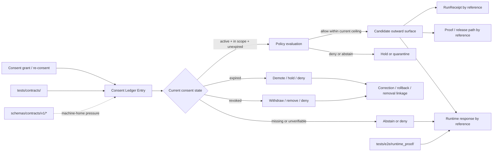

<!-- [KFM_META_BLOCK_V2]
doc_id: kfm://doc/NEEDS-VERIFICATION
title: Consent Ledger Contract
type: standard
version: v1
status: draft
owners: NEEDS-VERIFICATION__confirm_from_CODEOWNERS
created: NEEDS-VERIFICATION__YYYY-MM-DD
updated: NEEDS-VERIFICATION__YYYY-MM-DD
policy_label: NEEDS-VERIFICATION__governed_or_restricted
related: [
  ../README.md,
  ../../policy/README.md,
  ../../schemas/README.md,
  ../../schemas/contracts/README.md,
  ../../schemas/contracts/v1/README.md,
  ../../data/receipts/README.md,
  ../../data/proofs/README.md,
  ../../tests/README.md,
  ../../tests/contracts/README.md,
  ../../tests/e2e/runtime_proof/README.md,
  ../../.github/workflows/README.md
]
tags: [kfm, contracts, consent, privacy, revocation, runtime-proof, review]
notes: [Doctrine-grounded and repo-style-aligned; exact mounted path inventory, schema-home placement, owners, dates, and workflow enforcement still need direct branch verification.]
[/KFM_META_BLOCK_V2] -->

<a id="top"></a>

# Consent Ledger Contract

Reviewable contract boundary for **consent-bearing state**: explicit opt-in, scope, expiry, revocation, and downstream publication posture, kept separate from process-memory receipts, release proofs, runtime responses, and raw vendor payloads.

> [!IMPORTANT]
> **Status:** experimental  
> **Owners:** `NEEDS VERIFICATION`  
> **Path:** `contracts/consent_ledger/README.md`  
> **Repo fit:** child contract lane under [`../README.md`](../README.md); downstream of policy law in [`../../policy/README.md`](../../policy/README.md); adjacent to machine-contract scaffolds in [`../../schemas/contracts/v1/README.md`](../../schemas/contracts/v1/README.md); linked to receipt/proof separation in [`../../data/receipts/README.md`](../../data/receipts/README.md) and [`../../data/proofs/README.md`](../../data/proofs/README.md); verified through contract and runtime-proof neighbors in [`../../tests/contracts/README.md`](../../tests/contracts/README.md) and [`../../tests/e2e/runtime_proof/README.md`](../../tests/e2e/runtime_proof/README.md)  
> **Quick jumps:** [Scope](#scope) · [Repo fit](#repo-fit) · [Inputs](#inputs) · [Exclusions](#exclusions) · [Contract set](#contract-set) · [Invariants](#invariants) · [Lifecycle](#lifecycle) · [Directory tree](#directory-tree) · [Quickstart](#quickstart) · [Usage](#usage) · [Diagram](#diagram) · [Operating tables](#operating-tables) · [Task list](#task-list--definition-of-done) · [FAQ](#faq) · [Appendix](#appendix)


> [!WARNING]
> This README is **doctrine-grounded** and **repo-style-aligned**, but current surfaced evidence does **not** by itself prove a mounted `contracts/consent_ledger/` subtree, settled machine schema files, or active workflow enforcement for this lane. Keep owners, schema-home, fixture, validator, and merge-gate claims visibly bounded until the active branch proves them.

---

## Scope

`contracts/consent_ledger/` is the human-readable contract lane for **consent-bearing state**.

This lane defines what KFM means by:

- consent being explicitly granted
- the scope that consent covers
- the time window in which that consent is valid
- how revocation or expiry changes downstream behavior
- what linked objects must narrow, demote, withdraw, or deny outward use

This lane does **not** decide policy by itself, and it does **not** replace receipts, proofs, or runtime envelopes.

### Truth labels used in this README

| Label | Meaning here |
|---|---|
| **CONFIRMED** | Grounded in surfaced KFM doctrine or repo-facing documentation evidence |
| **INFERRED** | Strongly implied by adjacent KFM contract, policy, runtime, or trust-model materials |
| **PROPOSED** | Recommended starter shape for this lane, not yet verified as mounted implementation |
| **UNKNOWN** | Not verified strongly enough in the current evidence surface |
| **NEEDS VERIFICATION** | Specific item that should be checked before treating it as settled repo fact |

### Canonical one-line posture

Consent-ledger entries should remain **small, linked, rights-bearing state objects**: explicit about scope, timing, precision, and revocation, and separate from both process-memory receipts and release-proof objects.

[Back to top](#top)

## Repo fit

| Surface | Relationship | Why it matters |
|---|---|---|
| [`../README.md`](../README.md) | Parent contract surface | This lane should inherit contract-family discipline from the broader `contracts/` boundary. |
| [`../../policy/README.md`](../../policy/README.md) | Policy authority | Consent state informs policy but does not replace deny-by-default logic, obligations, or reasons. |
| [`../../schemas/README.md`](../../schemas/README.md) | Schema-side machine-file boundary | Machine validation belongs there once the exact schema home is settled. |
| [`../../schemas/contracts/README.md`](../../schemas/contracts/README.md) | Versioned machine-contract scaffold | This lane should complement machine files, not silently compete with them. |
| [`../../schemas/contracts/v1/README.md`](../../schemas/contracts/v1/README.md) | Visible machine-family inventory | The public docs expose a versioned contract family surface that this lane should align to. |
| [`../../data/receipts/README.md`](../../data/receipts/README.md) | Process memory surface | Usage and removal events may link into receipts, but consent state should not be flattened into receipts. |
| [`../../data/proofs/README.md`](../../data/proofs/README.md) | Release trust surface | Release-significant proof objects remain downstream and distinct from the consent ledger. |
| [`../../tests/contracts/README.md`](../../tests/contracts/README.md) | Contract-facing proof lane | Valid/invalid examples and drift checks should land there rather than hiding in prose. |
| [`../../tests/e2e/runtime_proof/README.md`](../../tests/e2e/runtime_proof/README.md) | Request-time governed behavior lane | Runtime proof should verify missing, expired, and revoked consent behavior as finite outcomes. |
| [`../../tests/README.md`](../../tests/README.md) | Repo-wide verification surface | Consent state becomes trustworthy only when negative-path drills stay inspectable. |
| [`../../.github/workflows/README.md`](../../.github/workflows/README.md) | Workflow boundary | Workflow references matter, but docs alone do not prove active merge-blocking enforcement. |

> [!NOTE]
> Current repo-facing docs expose a **split contract surface**: `contracts/` remains the stronger human-readable guide, while `schemas/contracts/v1/` is the visible machine scaffold. This README keeps that split explicit instead of pretending the authority question is already settled.

[Back to top](#top)

## Inputs

Accepted inputs for this lane should stay **small**, **reviewable**, and **reference-driven**.

| Input class | Examples | Why it belongs here | Status |
|---|---|---|---|
| Consent state records | grant, re-consent, expiry, revocation, supersession | This lane names the state transition burden itself. | **INFERRED / PROPOSED** |
| Scope and rights facts | source vendor, dataset/use scope, publication class, subject sensitivity flags | Consent must say what was allowed, not merely that something was “authorized.” | **CONFIRMED burden / PROPOSED local expression** |
| Time-bearing facts | granted_at, effective_at, expires_at, revoked_at, superseded_at | Consent is not timeless. | **CONFIRMED burden / PROPOSED local expression** |
| Precision and release posture | coarse vs fine publication, public-safe generalization level, export ceiling | Consent affects outward precision, not only retention. | **CONFIRMED burden / PROPOSED local expression** |
| Linkage refs | related `run_receipt`, `policy_decision`, `audit_ref`, rollback/correction refs | Adjacent objects should agree by reference rather than collapse into one oversized record. | **INFERRED / PROPOSED** |
| Minimal examples | valid grant, expired grant, revoked grant, superseded grant | Helps contract tests and runtime-proof drills stay inspectable. | **PROPOSED** |

### What this lane should prefer

1. Reference-based linkage over payload duplication.
2. Explicit scope over vague “allowed” flags.
3. Explicit expiry and revocation semantics.
4. Public-safe generalization by default.
5. No raw bearer secrets, raw vendor tokens, or exact sensitive payloads in checked-in examples.

[Back to top](#top)

## Exclusions

| Do **not** keep here as canonical truth | Keep it here instead | Why |
|---|---|---|
| Raw source exports, raw vendor payloads, or hidden source mirrors | RAW / WORK / QUARANTINE or governed source/onboarding lanes | This contract describes consent-bearing state; it should not become a covert source store. |
| Raw consent tokens, OAuth secrets, expiring download links, or credentials | Secret management / environment controls | Secrets are power, not documentation. |
| Full policy logic or executable allow/deny rules | [`../../policy/README.md`](../../policy/README.md) and executable policy lanes | Consent state informs policy; it should not replace policy. |
| Process-memory run history as the primary record | Receipt lanes and linked `run_receipt` objects | Receipts prove what ran; this lane names consent posture. |
| Release manifests, signatures, or proof packs | Proof / release surfaces | Proofs remain downstream and distinct from consent state. |
| Runtime answer payloads | Runtime contract lanes | Runtime should consume consent-bearing truth, not redefine it here. |
| Unredacted sensitive geometry, exact addresses, or precision-bearing subject data | Steward-facing review, quarantine, or restricted handling paths | Consent does not erase KFM safety, rights, or sensitivity burdens. |

> [!CAUTION]
> Active consent is **not** the same thing as automatic public release.  
> Publication still depends on policy, evidence closure, and the current release posture.

[Back to top](#top)

## Contract set

This lane should normalize a small family of distinct consent-related objects.

| Contract | Purpose | Typical downstream relationship | Status |
|---|---|---|---|
| `ConsentEnvelope` | Record explicit consent grant and scope | May authorize bounded usage if still valid and not revoked | **PROPOSED** |
| `ConsentUsage` | Record that a bounded execution used a specific active consent | Should link to a receipt; should not replace the receipt | **PROPOSED** |
| `ConsentRevocation` | Record explicit withdrawal or invalidation | Should trigger deny/demote/withdraw behavior downstream | **PROPOSED** |
| `RemovalReceipt` | Record purge, blackout, or withdrawal consequence after revocation | Should remain linkable from receipts or correction objects | **PROPOSED** |
| `ConsentSupersession` | Record that one consent entry replaced another | Preserves history without ambiguity about current authority | **PROPOSED** |

### Minimal contract burden

Even before machine schemas are settled, each consent-bearing object should answer:

- **who or what subject/scope pair does this apply to?**
- **what exact scope was granted or denied?**
- **when is it effective?**
- **when does it expire or stop being valid?**
- **has it been revoked or superseded?**
- **what linked downstream surfaces are affected?**

[Back to top](#top)

## Invariants

These are the strongest starter invariants for the lane.

| Invariant | Why it matters | Status |
|---|---|---|
| Consent MUST be explicit, scoped, and time-bearing | Prevents vague or timeless authorization claims | **PROPOSED, doctrine-aligned** |
| Consent MUST remain separate from receipts | Protects process-memory vs rights-state separation | **CONFIRMED doctrine** |
| Consent MUST remain separate from proofs | Protects release proof from being flattened into state records | **CONFIRMED doctrine** |
| Revocation MUST take precedence over cached or derived outward use | Enforces fail-closed downstream behavior | **PROPOSED, doctrine-aligned** |
| Expired consent MUST not silently behave as active consent | Prevents stale rights posture | **PROPOSED** |
| Usage MUST reference a specific consent record if consent is material to the action | Keeps execution and authorization inspectable | **PROPOSED** |
| Removal or demotion after revocation SHOULD emit a linked consequence object | Makes rollback/correction visible | **INFERRED / PROPOSED** |
| Runtime evaluation MUST collapse to finite outcomes | Aligns with ANSWER / ABSTAIN / DENY / ERROR doctrine | **CONFIRMED doctrine** |

> [!IMPORTANT]
> Treat the invariants above as the **starter contract burden** for this lane, not as proof that exact machine-enforced keys or enum members already exist on the active branch.

[Back to top](#top)

## Current evidence snapshot

| Evidence item | Status | How this README uses it |
|---|---|---|
| KFM requires explicit rights posture, sensitivity handling, reviewability, and fail-closed behavior | **CONFIRMED** | Grounds this lane as a rights/sensitivity boundary, not a convenience log. |
| `run_receipt`, `policy_decision`, correction/rollback, and runtime-visible trust objects are distinct families | **CONFIRMED doctrine** | Keeps consent state separate from process memory, runtime output, and release proof. |
| Public repo-facing docs expose a split contract surface (`contracts/` vs `schemas/contracts/v1/`) | **CONFIRMED** | Prevents this README from overstating machine-home certainty. |
| Runtime doctrine expects finite accountable outcomes rather than best-effort ambiguity | **CONFIRMED** | Grounds missing, expired, and revoked consent as deny/abstain paths, not soft fallback. |
| Exact mounted `contracts/consent_ledger/` subtree, exact schema file placement, fixture inventory, validator commands, and workflow coverage | **UNKNOWN / NEEDS VERIFICATION** | Left explicit as placeholders and reviewer checks rather than smoothed into confident prose. |

[Back to top](#top)

## Identity model

The consent ledger should carry **stable linkage**, not raw secret-bearing identity.

| Field family | Burden | Status |
|---|---|---|
| `entry_id` / `consent_id` | Stable identifier for the consent record | **PROPOSED** |
| `subject_ref` / `person_id` | Stable subject reference or pseudonymized identity handle | **PROPOSED** |
| `source_vendor` | Which upstream consent/vendor context this record is about | **PROPOSED** |
| `token_hash` or equivalent integrity ref | Hash or derived integrity marker instead of raw bearer secret | **PROPOSED** |
| `audit_ref` | Reviewer-visible trace into surrounding governance surfaces | **INFERRED / PROPOSED** |

### Recommended posture

- use **stable references**, not exact secret values
- prefer **hashes** over raw bearer material
- keep subject identity **minimized and pseudonymized** where possible
- let policy and steward review decide whether more direct identity linkage is ever appropriate

[Back to top](#top)

## Lifecycle

Consent should be modeled as a visible state transition chain rather than a single timeless “yes/no” flag.

### Starter lifecycle

1. **Grant**  
   Explicit scope-bearing consent is recorded.

2. **Use**  
   A bounded execution references that consent while it is still valid.

3. **Expire**  
   Time window lapses; downstream behavior narrows, demotes, or denies.

4. **Revoke**  
   Consent is actively withdrawn; downstream behavior must fail closed.

5. **Remove / Demote / Withdraw**  
   Outward artifacts are purged, blacked out, generalized, or withdrawn; consequence remains inspectable.

6. **Supersede**  
   A new consent record replaces the old one without erasing history.

### Reading rule

Consent history should remain **append-oriented and inspectable**, not silently overwritten into a single current-state blob.

[Back to top](#top)

## Directory tree

### Target landing shape

```text
contracts/
├── README.md
└── consent_ledger/
    └── README.md
```

### Adjacent machine-family scaffold already visible in repo-facing docs

```text
schemas/contracts/v1/
├── common/
├── correction/
├── data/
├── evidence/
├── policy/
├── release/
├── runtime/
└── source/
```

### Safest next local growth (`PROPOSED`)

```text
contracts/consent_ledger/
├── README.md
└── examples/
    ├── consent.grant.minimal.json
    ├── consent.expired.minimal.json
    ├── consent.revoked.minimal.json
    └── consent.superseded.minimal.json
```

> [!TIP]
> Keep local growth small.  
> The first useful move is one human-readable lane guide plus a few tiny examples, not an oversized subtree that outruns the repo’s actual machine-home decision.

[Back to top](#top)

## Quickstart

Use an inspection-first sequence so this README stays truthful as the branch evolves.

### 1) Re-read adjacent authority surfaces

```bash
sed -n '1,220p' contracts/README.md 2>/dev/null || true
sed -n '1,220p' policy/README.md 2>/dev/null || true
sed -n '1,220p' schemas/README.md 2>/dev/null || true
sed -n '1,220p' schemas/contracts/v1/README.md 2>/dev/null || true
sed -n '1,220p' data/receipts/README.md 2>/dev/null || true
sed -n '1,220p' data/proofs/README.md 2>/dev/null || true
sed -n '1,220p' tests/contracts/README.md 2>/dev/null || true
sed -n '1,220p' tests/e2e/runtime_proof/README.md 2>/dev/null || true
```

### 2) Inspect active-branch reality before claiming mounted support

```bash
find contracts schemas/contracts/v1 data/receipts data/proofs tests/contracts tests/e2e/runtime_proof -maxdepth 3 -print 2>/dev/null | sort
sed -n '1,220p' .github/CODEOWNERS 2>/dev/null || true
sed -n '1,220p' .github/workflows/README.md 2>/dev/null || true
```

### 3) Only then add the smallest evidence-bearing next step

```bash
mkdir -p contracts/consent_ledger/examples
printf '%s\n' '{}' > contracts/consent_ledger/examples/consent.grant.minimal.json
printf '%s\n' '{}' > contracts/consent_ledger/examples/consent.revoked.minimal.json
```

> [!NOTE]
> If the active branch already proves a schema-home decision, put machine files there and keep this lane human-readable.  
> If it does **not**, do not silently settle the dispute from this README.

[Back to top](#top)

## Usage

### 1) Use the ledger to separate permission state from process memory

A `run_receipt` records what one bounded execution fetched, validated, and emitted.

A consent-ledger entry should record something different:

- whether consent exists
- what it covers
- what publication ceiling it allows
- when it expires
- whether it was revoked or superseded

That separation keeps process memory inspectable **without** pretending that one pipeline run is the same thing as a subject’s continuing consent posture.

### 2) Drive fail-closed outward behavior

The ledger should never be read as “consent exists somewhere, so proceed.”

Instead, downstream surfaces should check:

- is consent present?
- is it still active?
- is it within scope?
- has it been revoked?
- does policy still allow this outward use?

Missing support should not degrade into silent best effort.

### 3) Treat revocation as a visible state change

A safe consent path should not hide revocation.

The outward consequence should remain legible:

1. mark the consent state as no longer active,
2. narrow, redact, withdraw, or deny downstream use,
3. keep previous evidence and linkage inspectable,
4. emit correction, rollback, or removal linkage where release or runtime trust requires it.

### 4) Keep cross-object linkage explicit

This lane should remain reference-heavy, not payload-heavy.

Typical downstream links may include:

- related `run_receipt`
- related `policy_decision`
- related correction or rollback reference
- related removal consequence
- `audit_ref` or equivalent reviewer-visible trace

Those links are useful precisely because they keep consent state **small** and **inspectable**.

[Back to top](#top)

## Diagram



[Back to top](#top)

## Operating tables

### Contract relationship map

| Object family | Primary job | Why this lane cares | Distinct from |
|---|---|---|---|
| Consent ledger entry | Record consent-bearing state for a subject/vendor/scope pair | This is the primary burden of the lane | run process memory, release proof, runtime response |
| `RunReceipt` | Record one bounded execution | Consent state may be linked from or to receipts, but should not be flattened into them | continuing rights posture |
| `PolicyDecision` | Record finite allow/deny/abstain/error policy outcome | Consent posture may constrain policy, but does not replace the policy object | execution memory and release readiness |
| Correction / rollback object | Record visible post-release or post-publication consequence | Revocation and withdrawal should remain inspectable | active consent state |
| `EvidenceBundle` / proof object | Carry outward support for a claim or release | Consent may constrain what is releasable | the consent ledger itself |
| Runtime response envelope | Make request-time answer / abstain / deny / error inspectable | Runtime should consume consent-bearing truth, not redefine it | underlying consent record |

### Starter field families (`PROPOSED`, not a mounted schema)

| Field family | What it should capture | Why it matters |
|---|---|---|
| Identity & linkage | stable entry id, subject ref, source vendor, related refs | Consent state must be inspectable and joinable without raw secret material. |
| Consent scope | dataset/use class/surface/publication scope covered | “Yes” is meaningless without scope. |
| Time & expiry | granted time, effective window, expiry, revocation time, supersession time | Consent is time-bearing and should fail closed when stale. |
| Precision & publication posture | coarse/fine level, allowed public ceiling, redaction expectation | Consent and publication safety are related but not identical. |
| Integrity & provenance | token hash, file hash, source export ref, audit reference | Supports deterministic traceability without storing raw bearer secrets. |
| Review & correction | obligations, supersedes/superseded_by, rollback/removal refs, notes | Keeps change and revocation visible instead of silent. |

### Safest lifecycle vocabulary to normalize first (`PROPOSED`)

| State | Meaning | Typical outward consequence |
|---|---|---|
| `ACTIVE` | consent is currently in force | downstream use may proceed only within current policy and precision ceilings |
| `EXPIRED` | consent lapsed by time or link expiry | hold, demote, redact, or deny until renewed |
| `REVOKED` | consent was explicitly withdrawn | withdraw, remove, or deny outward use; preserve lineage |
| `SUPERSEDED` | a newer consent entry replaced an older one | older entry remains historical, not current authority |
| `PENDING_REVIEW` | state is present but needs steward confirmation | no silent publish |
| `DENIED` | explicit non-consent or blocked scope | no outward use for the denied scope |

### Runtime consequence mapping (`PROPOSED`, doctrine-aligned)

| Consent posture at evaluation time | Expected runtime consequence |
|---|---|
| active, in scope, policy allows | proceed under normal governed path |
| missing consent where required | `DENY` or `ABSTAIN` |
| expired consent | `DENY` or `ABSTAIN` |
| revoked consent | `DENY` |
| unverifiable consent evidence | `ABSTAIN` or `ERROR` |
| internal validation failure | `ERROR` |

> [!IMPORTANT]
> Treat the tables above as **starter normalization aids**, not as a claim that these exact enum members or machine keys are already mounted truth on the active branch.

[Back to top](#top)

## Task list / Definition of done

Treat this README as healthy only when it stays both readable and truthful.

- [ ] The active branch was inspected and the target leaf still belongs under `contracts/`.
- [ ] `doc_id`, owners, created date, updated date, and `policy_label` were replaced with repo-backed values.
- [ ] This file does not imply a mounted schema body, fixture pack, or merge-gate that the branch does not prove.
- [ ] The split between `contracts/` narrative authority and `schemas/contracts/v1/` machine scaffolds remains visible.
- [ ] At least one tiny example exists for `ACTIVE`, `EXPIRED`, or `REVOKED` consent state.
- [ ] No checked-in example contains raw bearer tokens, exact sensitive geometry, or other restricted payloads.
- [ ] Runtime-proof neighbors cover missing, expired, and revoked consent paths as finite outcomes.
- [ ] Any future machine schema keeps consent state separate from `run_receipt`, `policy_decision`, and proof objects.
- [ ] Revocation and expiry remain explicit review/change states rather than disappearing into silent overwrite.

[Back to top](#top)

## FAQ

### Is this the same thing as a `RunReceipt`?

No.

A `RunReceipt` is **process memory** for one execution.  
A consent-ledger entry is **rights-bearing state** that may outlive many executions.

### Does active consent automatically authorize publication?

No.

KFM still requires policy, evidence closure, rights posture, and public-safe precision handling. This lane should help make those decisions inspectable, not bypass them.

### Should raw OAuth tokens, expiring vendor links, or exact sensitive coordinates live here?

No.

Store **hashes and references**, not bearer secrets or exact sensitive payloads.

### Does revocation erase history?

No.

The safer KFM reading is to preserve lineage, narrow or withdraw outward surfaces, and keep rollback/correction consequences visible.

### Are the field names in the operating tables settled machine truth?

No.

They are **PROPOSED starter shapes**. Final machine keys belong in the mounted schema home once the branch proves it.

### Where should fail-closed behavior be enforced?

In policy, validators, and runtime-proof surfaces.  
This contract lane defines the state burden that those downstream systems should consume.

[Back to top](#top)

## Appendix

<details>
<summary><strong>Illustrative only — starter consent-ledger JSON shape</strong></summary>

This example is a **starter review aid**, not a claim that the active branch already contains this exact schema.

```json
{
  "version": "v1",
  "consent_id": "kfm://consent/example-001",
  "subject_ref": "kfm://subject/example-person",
  "source_vendor": "example-vendor",
  "token_hash": "sha256:REDACTED_EXAMPLE",
  "scope": {
    "datasets": ["kfm://dataset/example"],
    "surfaces": ["map_overlay"],
    "publication_ceiling": "coarse"
  },
  "status": "REVOKED",
  "granted_at": "2026-03-10T12:00:00Z",
  "expires_at": "2027-03-10T12:00:00Z",
  "revoked_at": "2026-04-12T09:15:00Z",
  "related_refs": {
    "rollback_ref": "kfm://correction/example-102",
    "audit_ref": "kfm://audit/example-777"
  },
  "notes": "Outward overlays were withdrawn after revocation."
}
```

### Reading rule for the example

- keep raw tokens out
- keep exact sensitive geometry out
- keep publication posture explicit
- keep revocation and rollback linkable
- keep the object small and reference-based

[Back to top](#top)

</details>
