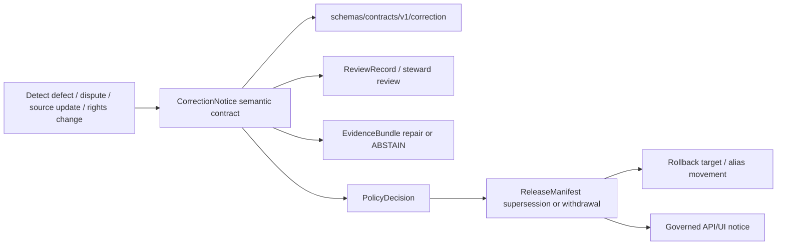

<!-- [KFM_META_BLOCK_V2]
doc_id: kfm://doc/contracts-correction-readme
title: contracts/correction/ — Correction Semantic Contracts
type: readme
version: v0.2
status: draft
owners: OWNER_TBD — Correction steward · Release steward · Governance steward · Contract steward · Schema steward · Policy steward · Docs steward
created: 2026-06-20
updated: 2026-06-20
policy_label: public; contracts; correction; semantic-contracts; first-class-corrections; rollback-aware
related:
  - ../README.md
  - ../release/README.md
  - ./correction_notice.md
  - ../../schemas/contracts/v1/correction/correction_notice.schema.json
  - ../../docs/doctrine/corrections-first-class.md
  - ../../docs/architecture/publication/CORRECTION.md
  - ../../docs/architecture/contract-schema-policy-split.md
  - ../../policy/correction/
  - ../../policy/release/
  - ../../fixtures/correction/correction_notice/
  - ../../tools/validators/correction/validate_correction_notice.py
  - ../../release/
  - ../../data/proofs/
tags: [kfm, contracts, correction, correction-notice, supersession, rollback, withdrawal, release, publication, semantic-contracts, first-class-corrections, auditability, governance]
notes:
  - "Expanded from a short stub into a correction-family semantic-contract directory README."
  - "Correction doctrine is CONFIRMED: corrections are first-class, append-only, public-visible where appropriate, and silent mutation of published artifacts is forbidden."
  - "Current correction_notice schema is CONFIRMED present but explicitly a greenfield placeholder; field completeness, validators, fixtures, policy behavior, and CI enforcement remain NEEDS VERIFICATION."
  - "This directory defines semantic meaning only; schemas, policy, tests, release state, proof closure, runtime behavior, and public UI/API behavior remain separate authority roots."
[/KFM_META_BLOCK_V2] -->

<a id="top"></a>

# Correction Semantic Contracts

> Directory contract for correction-family semantic contracts. This folder defines the meaning and trust boundaries of correction objects; it does not define schema shape, policy decisions, release execution, rollback mechanics, public UI behavior, or proof closure.

<p>
  
  
  
  
  
  
</p>

`contracts/correction/`

## Quick jumps

[Status](#status) · [Scope](#scope) · [Repo fit](#repo-fit) · [Accepted inputs](#accepted-inputs) · [Exclusions](#exclusions) · [Current directory snapshot](#current-directory-snapshot) · [Contract inventory](#contract-inventory) · [Correction doctrine](#correction-doctrine) · [Lifecycle and trust boundary](#lifecycle-and-trust-boundary) · [Validation](#validation) · [Evidence basis](#evidence-basis) · [Rollback](#rollback) · [Definition of done](#definition-of-done)

---

## Status

> [!IMPORTANT]
> **Status:** `draft` / directory README  
> **Owner:** `OWNER_TBD`  
> **Path:** `contracts/correction/`  
> **Truth posture:** `CONFIRMED` current path, current update, correction doctrine, and presence of a placeholder `correction_notice` schema; full correction contract inventory, validator behavior, fixture coverage, policy behavior, release integration, public UI/API behavior, and CI enforcement remain `NEEDS VERIFICATION`.

---

## Scope

`contracts/correction/` is the semantic contract family for KFM correction objects.

It describes the meanings, invariants, review posture, and trust boundaries for correction-related artifacts such as `CorrectionNotice`, correction summaries, supersession links, withdrawal context, affected-asset pointers, and rollback-adjacent relationships.

This folder does **not** execute corrections. It does not mutate release records, repoint public aliases, invalidate caches, issue policy decisions, close evidence, publish correction notices, run validators, or render UI badges.

---

## Repo fit

```text
contracts/
├── correction/
│   └── README.md
└── release/
    ├── README.md
    ├── correction_notice.md
    ├── rollback_card.md
    └── withdrawal_notice.md

schemas/
└── contracts/
    └── v1/
        └── correction/
            └── correction_notice.schema.json
```

Adjacent responsibility roots:

| Root | Relationship to this folder |
|---|---|
| `../README.md` | Root contracts guidance: semantic meaning only. |
| `../release/README.md` | Release-family semantic contracts, including release governance, rollback, corrections, and withdrawals. |
| `../../schemas/contracts/v1/correction/correction_notice.schema.json` | Current machine-shape placeholder for correction notices. |
| `../../policy/correction/`, `../../policy/release/` | Admissibility and release/correction decisions. |
| `../../fixtures/correction/correction_notice/` | Schema-declared fixture root; existence/coverage remain `NEEDS VERIFICATION`. |
| `../../tools/validators/correction/validate_correction_notice.py` | Schema-declared validator path; existence/behavior remain `NEEDS VERIFICATION`. |
| `../../docs/doctrine/corrections-first-class.md` | Governing correction doctrine. |
| `../../docs/architecture/publication/CORRECTION.md` | Publication correction flow and architecture posture. |
| `../../release/` | Release state, current aliases, manifests, and rollback targets. |
| `../../data/proofs/` | EvidenceBundle/proof support for corrected claims. |

> [!NOTE]
> There is a known relationship to `contracts/release/`, whose README currently lists `correction_notice.md` as a release-family file. This README does not settle whether `CorrectionNotice` is canonical under `contracts/correction/`, `contracts/release/`, or both via compatibility. Treat that relationship as `NEEDS VERIFICATION` unless an ADR or migration note resolves it.

---

## Accepted inputs

| Belongs in this directory | Required posture |
|---|---|
| Correction semantic contract READMEs | Define meaning, invariants, review posture, public visibility, and rollback relationship. |
| CorrectionNotice semantic contract | Must preserve named-operation, append-only history, evidence support, review state, and public visibility rules. |
| Compatibility notes | Must surface correction/release placement conflicts rather than silently duplicating authority. |
| Evidence ledgers | Must cite correction doctrine, publication correction architecture, schema evidence, and current file evidence. |
| Validation checklists | Must point to schemas/tests/policy/release roots without claiming behavior unless verified. |
| Rollback notes | Must name prior content SHA or migration rollback target. |

---

## Exclusions

| Does not belong here | Correct home |
|---|---|
| JSON Schema or machine-checkable shape | `../../schemas/contracts/v1/correction/` or accepted schema home. |
| Policy rules for ALLOW/DENY/RESTRICT/ABSTAIN | `../../policy/correction/`, `../../policy/release/`, or accepted policy home. |
| Validator code | `../../tools/validators/` or accepted validation package. |
| Fixtures | `../../fixtures/` or accepted test fixture root. |
| Release manifests and current public aliases | `../../release/`. |
| Evidence bundles and proof closure | `../../data/proofs/` and evidence workflows. |
| Rollback execution | Rollback runbooks/pipelines and release authority. |
| Public UI badges/routes | Governed UI/API roots after release verification. |
| Silent published-asset mutation | Forbidden. Corrections must be typed, reviewable, and auditable. |

---

## Current directory snapshot

> [!NOTE]
> This snapshot is based on current-session file inspection, not a complete repository inventory.

| File | Status | What it proves | What it does not prove |
|---|---|---|---|
| `contracts/correction/README.md` | `CONFIRMED` | This directory README exists and states correction-family boundaries. | Does not prove object contracts, validators, fixtures, or policy are complete. |
| `contracts/correction/correction_notice.md` | `UNKNOWN` | Not inspected in this task. | Requires separate inventory. |
| `contracts/release/correction_notice.md` | `LINEAGE / NEEDS VERIFICATION` | Release README lists it as part of release-family contracts. | Does not settle canonical correction contract home. |

---

## Contract inventory

| Contract family | Current evidence | Status | Notes |
|---|---|---|---|
| `CorrectionNotice` | Schema exists at `schemas/contracts/v1/correction/correction_notice.schema.json`. | `CONFIRMED placeholder schema` | Schema says greenfield placeholder; only `id` is required. |
| `SupersessionRecord` | Doctrine describes supersession as a correction pattern. | `PROPOSED / NEEDS VERIFICATION` | Separate schema/contract not verified here. |
| `WithdrawalNotice` | Release README lists `withdrawal_notice.md`. | `LINEAGE / NEEDS VERIFICATION` | May live under release family. |
| `RollbackCard` / rollback target | Release README lists rollback card and doctrine requires rollback targets. | `CONFIRMED release-family lineage` | Execution and schema behavior not verified here. |
| `RedactionReceipt` | Doctrine references sensitivity-change correction posture. | `PROPOSED / NEEDS VERIFICATION` | Receipt home and schema not verified here. |

---

## Correction doctrine

Correction contracts must preserve these rules:

- corrections are first-class, named operations;
- silent replacement is a defect;
- correction history is append-only;
- prior releases, manifests, and proof packs remain inspectable;
- public visibility is required where a public artifact or claim was corrected, superseded, withdrawn, stale, or redacted;
- every release must have a correction path and rollback target before public exposure;
- correction does not bypass the trust membrane;
- cite-or-abstain survives correction;
- rights and sensitivity changes fail closed when policy/evidence is insufficient;
- AI-authored correction prose requires receipt linkage and must remain evidence-subordinate.

---

## Lifecycle and trust boundary



Contracts describe meaning. They do not validate schema shape, perform rollback, modify public aliases, emit public notices, invalidate derivatives, or publish.

---

## Validation

Before relying on this directory, verify:

- canonical placement of `CorrectionNotice` between `contracts/correction/` and `contracts/release/`;
- complete semantic contract file for `CorrectionNotice`;
- schema completeness beyond the current greenfield placeholder;
- validator implementation and fixture coverage;
- policy bundles for correction, release, sensitivity, rights, stale evidence, withdrawal, and rollback;
- ReviewRecord linkage and separation-of-duties behavior;
- EvidenceBundle references resolve for corrected claims;
- ReleaseManifest and rollback target are required before publication;
- public UI/API surfaces show stale, superseded, withdrawn, or corrected state without exposing restricted content;
- AI-authored public summaries have generated-receipt linkage where applicable;
- tests prove silent mutation of published artifacts fails closed.

---

## Evidence basis

| Source | Status | Supports | Limits |
|---|---|---|---|
| Prior `contracts/correction/README.md` scaffold | `CONFIRMED` | Target file existed as a correction-family stub. | Stub did not define scope, exclusions, evidence basis, or validation. |
| `schemas/contracts/v1/correction/correction_notice.schema.json` | `CONFIRMED placeholder` | Current schema path exists; x-kfm metadata points to contract doc, fixtures, validator, policy; only `id` is required. | Schema explicitly says greenfield placeholder; field completeness and behavior are not proven. |
| `docs/doctrine/corrections-first-class.md` | `CONFIRMED doctrine` | Corrections are first-class; silent replacement is a defect; append-only history, public visibility, and rollback path are required. | Many implementation paths/fields remain proposed or verification-bound. |
| `docs/architecture/publication/CORRECTION.md` | `CONFIRMED doctrine / PROPOSED implementation` | Correction is a publication requirement, not an afterthought; correction flow and defect classes preserve trust membrane and cite-or-abstain. | Route names, schema homes, and implementation maturity remain proposed unless separately verified. |
| `contracts/release/README.md` | `CONFIRMED` | Release contracts include release manifests, promotion decisions, rollback, corrections, and withdrawals, with schema/policy split. | It creates a placement relationship that remains unresolved with this correction directory. |
| `docs/architecture/contract-schema-policy-split.md` | `CONFIRMED` | Meaning, shape, admissibility, and enforceability remain separate layers. | Does not verify correction-specific runtime implementation. |

---

## Rollback

Rollback is required if this README is used to claim implementation maturity, schema completeness, policy enforcement, validator coverage, public-route behavior, canonical object placement, or release/rollback execution that has not been verified.

Rollback target: prior stub content SHA `5f6cc23a4588eda1c1c1634d3d5a6881ab3cc462`.

---

## Definition of done

- [ ] Owners are confirmed and `OWNER_TBD` is replaced.
- [ ] Canonical correction contract placement is resolved between correction and release roots.
- [ ] `CorrectionNotice` semantic contract is complete.
- [ ] `CorrectionNotice` schema is expanded beyond greenfield placeholder or gap is intentionally accepted.
- [ ] Validator implementation and fixtures are verified.
- [ ] Correction/release/sensitivity/rights policy bundles are linked and tested.
- [ ] EvidenceBundle, ReviewRecord, PolicyDecision, ReleaseManifest, and rollback linkages are testable.
- [ ] Public notice behavior is verified without exposing restricted details.
- [ ] Silent mutation of published artifacts is covered by tests.
- [ ] AI-authored correction prose requires receipt linkage where applicable.

---

## Status summary

`contracts/correction/` is the semantic contract directory for correction-family meanings. It is not a schema home, policy home, validator package, fixture store, release state root, proof root, rollback executor, public API surface, public UI surface, or permission to silently mutate published artifacts.

<p align="right"><a href="#top">Back to top</a></p>
