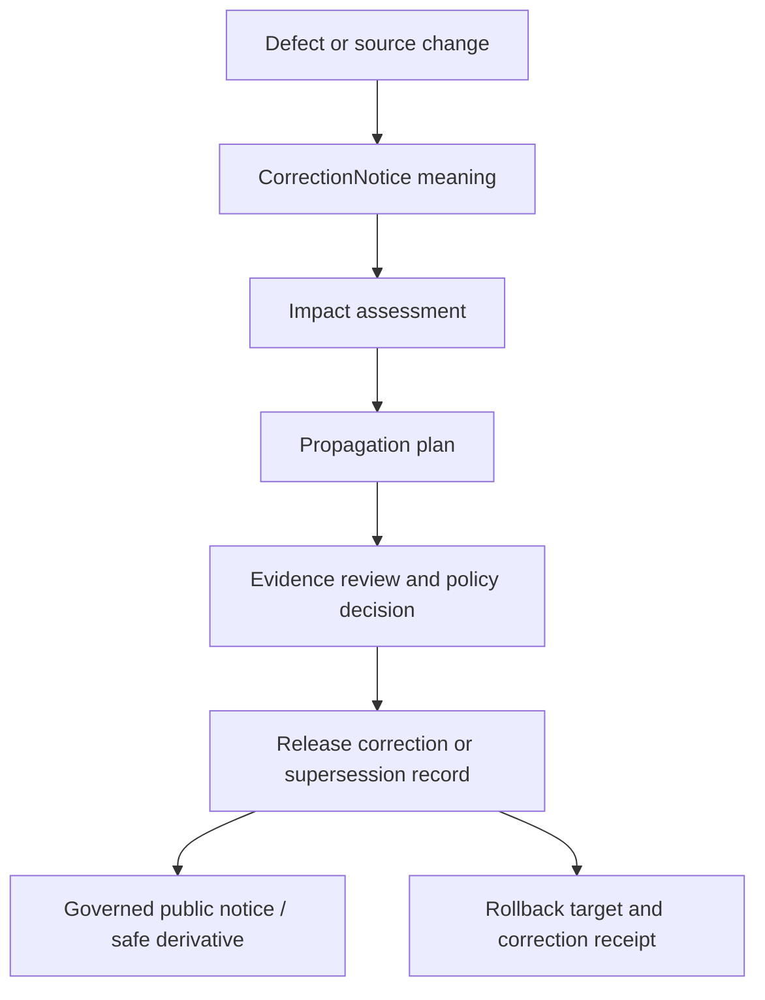

<!-- [KFM_META_BLOCK_V2]
doc_id: kfm://doc/contracts-correction-readme
title: contracts/correction/ — Correction Semantic Contracts
type: readme
version: v0.3
status: draft; repository-grounded; current-state-reconciled; placement-conflicted; bounded-shape-only; non-release; non-publication
owners: OWNER_TBD — Correction steward · Release steward · Governance steward · Contract steward · Schema steward · Policy steward · Docs steward
created: 2026-06-20
updated: 2026-09-07
policy_label: public; contracts; correction; semantic-contracts; first-class-corrections; rollback-aware; placement-conflicted
related:
  - ../README.md
  - ../release/README.md
  - ./correction_notice.md
  - ./correction_impact_assessment.md
  - ./correction_propagation_plan.md
  - ./supersession_notice.md
  - ../../schemas/contracts/v1/correction/
  - ../../schemas/contracts/v1/correction/correction_notice.schema.json
  - ../../schemas/contracts/v1/corrections/README.md
  - ../../schemas/contracts/v1/corrections/correction_notice_candidate.schema.json
  - ../../docs/doctrine/corrections-first-class.md
  - ../../docs/architecture/publication/CORRECTION.md
  - ../../docs/architecture/contract-schema-policy-split.md
  - ../../docs/runbooks/EVIDENCE_CORRECTION.md
  - ../../docs/registers/RELEASE_STATE.md
  - ../../policy/correction/
  - ../../policy/release/
  - ../../fixtures/correction/correction_notice/
  - ../../tools/validators/correction/
  - ../../tests/validators/correction/
  - ../../release/correction_notices/
  - ../../release/
  - ../../data/proofs/
tags: [kfm, contracts, correction, correction-notice, supersession, rollback, withdrawal, release, publication, semantic-contracts, first-class-corrections, auditability, governance, placement-conflict]
notes:
  - "Current GitHub evidence is pinned to main@daf554239d8f22b7825a7e8700b70ad71c14b3b0; this folder contains five direct semantic-contract files."
  - "Correction doctrine is CONFIRMED: corrections are first-class, append-only, public-visible where appropriate, and silent mutation of published artifacts is forbidden."
  - "CorrectionNotice and SupersessionNotice remain paired to PROPOSED thin schemas; CorrectionImpactAssessment and CorrectionPropagationPlan have richer PROPOSED schema surfaces but remain non-executing planning contracts."
  - "The singular correction schema lane is the active candidate referenced by the paired contract; the plural corrections lane is compatibility/candidate material and is not selected as authority here."
  - "Google Drive and Notion records are read-only doctrine/coordination lineage; GitHub repository evidence controls implementation claims and currentness."
evidence_snapshot:
  repository: bartytime4life/Kansas-Frontier-Matrix
  visibility: public
  base_ref: main
  base_commit: daf554239d8f22b7825a7e8700b70ad71c14b3b0
  target_baseline_blob: 0e48db075585ad2e4406cd50492d2a08af64ecc4
  direct_lane_files_confirmed:
    - contracts/correction/README.md @ 0e48db075585ad2e4406cd50492d2a08af64ecc4
    - contracts/correction/correction_impact_assessment.md @ c397c83f558299388f9d5ca0a9c58deffb3f8c86
    - contracts/correction/correction_notice.md @ 4716f2bc6e714ad2ab873d95144417d7855f5beb
    - contracts/correction/correction_propagation_plan.md @ b61e7fb0ecd0e68588a29642f3c47e0cb810eff9
    - contracts/correction/supersession_notice.md @ 22f1fdb4a82063b7e66d0478fcc83cb03a89d68b
  inventory_method: authenticated GitHub Contents and exact file reads against the pinned base
  boundary_note: "Drive/Notion lineage is read-only; this README does not accept a contract, schema, policy, validator, release, or publication authority."
[/KFM_META_BLOCK_V2] -->

<a id="top"></a>

# Correction Semantic Contracts

> Directory contract for correction-family semantic contracts. This folder defines the meaning and trust boundaries of correction objects; it does not define schema shape, policy decisions, release execution, rollback mechanics, public UI behavior, or proof closure.

<p>
  
  
  
  
  
  
</p>

`contracts/correction/`

## Quick jumps

[Status](#status) · [Scope](#scope) · [Repo fit](#repo-fit) · [Accepted inputs](#accepted-inputs) · [Exclusions](#exclusions) · [Current directory snapshot](#current-directory-snapshot) · [Contract inventory](#contract-inventory) · [Correction doctrine](#correction-doctrine) · [Lifecycle and trust boundary](#lifecycle-and-trust-boundary) · [Validation](#validation) · [Evidence basis](#evidence-basis) · [Rollback](#rollback) · [Definition of done](#definition-of-done) · [Changelog](#changelog)

---

## Status

> [!IMPORTANT]
> **Status:** `draft` / repository-grounded semantic-contract index  
> **Owner:** `OWNER_TBD`  
> **Path:** `contracts/correction/`  
> **Truth posture:** `CONFIRMED` five-file direct semantic lane, `CorrectionNotice` contract path, singular correction schema family, correction validator, minimal correction fixtures, and release correction-notice index; `PROPOSED` most machine shapes and policy/release/runtime integration; `CONFLICTED` correction-vs-release semantic placement and singular-vs-plural schema compatibility; `NEEDS VERIFICATION` accountable owners, accepted ADR/path authority, complete test binding, policy enforcement, evidence closure, downstream propagation, and public-surface behavior.

---

## Scope

`contracts/correction/` is the semantic contract family and coordination index for KFM correction objects.

It describes meaning, invariants, review posture, and trust boundaries for `CorrectionNotice`, `CorrectionImpactAssessment`, `CorrectionPropagationPlan`, `SupersessionNotice`, withdrawal context, affected-carrier pointers, and rollback-adjacent relationships.

`CorrectionNotice` records a defect or required change in a released or release-facing claim. `CorrectionImpactAssessment` inventories downstream carriers; `CorrectionPropagationPlan` describes bounded invalidation/rebuild obligations; and `SupersessionNotice` records replacement lineage. These artifacts remain non-executing unless separately accepted implementation and release authority exists.

This folder does **not** execute corrections, mutate release records, repoint public aliases, invalidate caches, issue policy decisions, close evidence, publish correction notices, authorize rollback, or render UI badges. Semantic meaning belongs here; machine shape, policy, validation, fixtures, evidence, release state, runtime behavior, and public presentation remain separate authority surfaces.

---

## Repo fit

```text
contracts/
├── correction/
│   ├── README.md
│   ├── correction_impact_assessment.md
│   ├── correction_notice.md
│   ├── correction_propagation_plan.md
│   └── supersession_notice.md
└── release/
    ├── README.md
    ├── release_manifest.md
    ├── rollback_card.md
    └── withdrawal_notice.md

schemas/contracts/v1/
├── correction/
│   ├── README.md
│   ├── correction_notice.schema.json
│   ├── correction_impact_assessment.schema.json
│   ├── correction_propagation_plan.schema.json
│   └── supersession_notice.schema.json
└── corrections/
    ├── README.md
    └── correction_notice_candidate.schema.json

fixtures/correction/correction_notice/
tools/validators/correction/
release/correction_notices/
```

Adjacent responsibility roots:

| Root | Relationship to this folder |
|---|---|
| `../README.md` | Root contracts guidance: semantic meaning only. |
| `../release/README.md` | Release-family semantic contracts and a documented correction/release placement seam; no direct `contracts/release/correction_notice.md` was observed at the pinned base. |
| `../../schemas/contracts/v1/correction/` | Singular correction schema family currently paired to the correction contracts; shapes remain mixed/proposed. |
| `../../schemas/contracts/v1/corrections/` | Plural compatibility/index lane with a candidate schema; not selected as correction authority by this README. |
| `../../policy/correction/`, `../../policy/release/` | Admissibility, review, rights, sensitivity, release, withdrawal, and rollback decisions. |
| `../../fixtures/correction/correction_notice/` | Current minimal positive/negative fixture lane for the thin `CorrectionNotice` schema. |
| `../../tools/validators/correction/` | Correction validators exist for `CorrectionNotice`, `CorrectionImpactAssessment`, and `CorrectionPropagationPlan`; behavior remains bounded to their declared profiles. |
| `../../tests/validators/correction/` | Current direct test inventory includes impact-assessment coverage; dedicated `CorrectionNotice` test file was not observed. |
| `../../release/correction_notices/` | Release/publication record index with `.gitkeep`, README, and domain sublanes; not semantic contract prose. |
| `../../docs/doctrine/corrections-first-class.md` | Governing correction doctrine. |
| `../../docs/runbooks/EVIDENCE_CORRECTION.md` | Human intake, classification, bounded validation, and held operational correction guidance. |
| `../../data/proofs/` | EvidenceBundle/proof support for corrected claims. |

> [!NOTE]
> `contracts/release/README.md`, `release/correction_notices/README.md`, and the correction runbook preserve a relationship between semantic correction meaning and release/publication records. This README does not settle whether any `CorrectionNotice` meaning is duplicated under the release family; an accepted ADR or migration note is still required.

---

## Accepted inputs

| Belongs in this directory | Required posture |
|---|---|
| Correction semantic contract READMEs | Define meaning, invariants, review posture, public visibility, and rollback relationship. |
| CorrectionNotice semantic contract | Must preserve named-operation, append-only history, evidence support, review state, and public visibility rules. |
| Compatibility notes | Must surface correction/release placement conflicts rather than silently duplicating authority. |
| Evidence ledgers | Must cite correction doctrine, publication correction architecture, schema evidence, and current file evidence. |
| Validation checklists | Must point to schemas/tests/policy/release roots without claiming behavior unless verified. |
| Rollback notes | Must name prior content SHA or migration rollback target. |

---

## Exclusions

| Does not belong here | Correct home |
|---|---|
| JSON Schema or machine-checkable shape | `../../schemas/contracts/v1/correction/` or accepted schema home. |
| Policy rules for ALLOW/DENY/RESTRICT/ABSTAIN | `../../policy/correction/`, `../../policy/release/`, or accepted policy home. |
| Validator code | `../../tools/validators/` or accepted validation package. |
| Fixtures | `../../fixtures/` or accepted test fixture root. |
| Release manifests and current public aliases | `../../release/`. |
| Evidence bundles and proof closure | `../../data/proofs/` and evidence workflows. |
| Rollback execution | Rollback runbooks/pipelines and release authority. |
| Public UI badges/routes | Governed UI/API roots after release verification. |
| Silent published-asset mutation | Forbidden. Corrections must be typed, reviewable, and auditable. |

---

## Current directory snapshot

> [!NOTE]
> This snapshot is based on authenticated GitHub Contents inspection at `main@daf554239d8f22b7825a7e8700b70ad71c14b3b0`. It is current for that base commit, not a permanent absence claim.

| File | Status | What it proves | What it does not prove |
|---|---|---|---|
| `contracts/correction/README.md` | `CONFIRMED` | This directory README exists and states correction-family boundaries. | Does not prove object contracts, validators, fixtures, or policy are complete. |
| `contracts/correction/correction_notice.md` | `CONFIRMED path; DRAFT semantic contract` | The object-level `CorrectionNotice` semantic contract exists and explicitly pairs to the singular schema/fixture/validator surfaces. | Does not make the schema complete or authorize correction/release execution. |
| `contracts/correction/correction_impact_assessment.md` | `CONFIRMED path; PROPOSED-INACTIVE` | A non-authoritative downstream-carrier assessment contract exists. | Does not execute impact assessment or prove release closure. |
| `contracts/correction/correction_propagation_plan.md` | `CONFIRMED path; PROPOSED / FIXTURE-ONLY` | A non-executing propagation-planning contract exists. | Does not invalidate, rebuild, repoint, publish, or roll back carriers. |
| `contracts/correction/supersession_notice.md` | `CONFIRMED path; DRAFT semantic contract` | A supersession-lineage contract exists and pairs to a proposed schema. | Does not prove a supersession validator or fixture lane exists. |
| Other direct `contracts/correction/*` entries | `NOT OBSERVED at base` | The exact Contents response returned no other direct entries. | Does not prevent later additions or prove recursive absence elsewhere. |

---

## Contract inventory

The direct correction folder contains semantic contracts only. The machine-shape, validation, fixture, test, policy, evidence, release, and public-surface columns are deliberately separate.

| Contract family | Semantic contract | Machine / validation surfaces observed | Current posture |
|---|---|---|---|
| `CorrectionNotice` | `contracts/correction/correction_notice.md` | `schemas/contracts/v1/correction/correction_notice.schema.json` (`PROPOSED`, `id`-only required, additional properties allowed); `tools/validators/correction/validate_correction_notice.py`; `fixtures/correction/correction_notice/valid/minimal.json`; `fixtures/correction/correction_notice/invalid/missing_id.json` | `CONFIRMED paths; BOUNDED SHAPE ONLY`. The fixture/validator lane proves only the current thin schema profile; no dedicated correction-notice test file was observed. |
| `CorrectionImpactAssessment` | `contracts/correction/correction_impact_assessment.md` | `schemas/contracts/v1/correction/correction_impact_assessment.schema.json` (closed object with required assessment, policy, rollback, carrier, and authorization fields); `tools/validators/correction/validate_correction_impact_assessment.py`; `tests/validators/correction/test_correction_impact_assessment.py` | `PROPOSED-INACTIVE / FIXTURE-ONLY`. Richer shape exists, but execution, policy authority, and release closure remain unproven. |
| `CorrectionPropagationPlan` | `contracts/correction/correction_propagation_plan.md` | `schemas/contracts/v1/correction/correction_propagation_plan.schema.json` (closed object with plan, release, surface, entry, governance, and spec fields); `tools/validators/correction/validate_correction_propagation_plan.py` | `PROPOSED / FIXTURE-ONLY / NO-NETWORK / NON-EXECUTING`. No dedicated test file was observed in the direct correction validator-test directory. |
| `SupersessionNotice` | `contracts/correction/supersession_notice.md` | `schemas/contracts/v1/correction/supersession_notice.schema.json` (`PROPOSED`, `id`-only required, additional properties allowed); schema declares `tools/validators/correction/validate_supersession_notice.py`, but that path and a dedicated fixture README were not observed at the pinned base. | `DRAFT semantic contract; BOUNDED SCHEMA STUB`. |
| Plural candidate lane | No paired semantic contract selected | `schemas/contracts/v1/corrections/correction_notice_candidate.schema.json` plus `schemas/contracts/v1/corrections/README.md` | `PROPOSED COMPATIBILITY MATERIAL`; not an alternate authority. |
| Release correction records | Not semantic contract prose | `release/correction_notices/README.md`, `.gitkeep`, and domain sublanes | `RELEASE/PUBLICATION INDEX`; records and decisions require separate release authority. |

---

## Correction doctrine

Correction contracts must preserve these rules:

- corrections are first-class, named operations;
- silent replacement of a released claim or artifact is a defect;
- correction and supersession history is append-only;
- prior releases, manifests, evidence bundles, proof packs, and receipts remain inspectable;
- `CorrectionNotice` names the defect, affected claim/release, correction disposition, and required lineage; it does not itself authorize publication;
- `CorrectionImpactAssessment` and `CorrectionPropagationPlan` make affected carriers and required invalidation/rebuild work explicit; they do not execute that work;
- `SupersessionNotice` records replacement lineage without deleting the superseded object;
- public visibility is required where a public artifact or claim was corrected, superseded, withdrawn, stale, or redacted, subject to sensitive-detail controls;
- every public release needs a correction path and rollback target before exposure;
- evidence, rights, sensitivity, review, policy, and release gates fail closed when required inputs are missing;
- cite-or-abstain survives correction, and AI-authored correction prose remains receipt-linked and evidence-subordinate;
- schema validity, validator PASS, or fixture success is not evidence of correction issuance, policy approval, release, publication, or downstream propagation.

---

## Lifecycle and trust boundary


```mermaid
flowchart TD
  DETECT[Defect or source change] --> NOTICE[CorrectionNotice meaning]
  NOTICE --> IMPACT[Impact assessment]
  IMPACT --> PLAN[Propagation plan]
  PLAN --> REVIEW[Evidence review and policy decision]
  REVIEW --> RELEASE[Release correction or supersession record]
  RELEASE --> PUBLIC[Governed public notice / safe derivative]
  RELEASE --> ROLLBACK[Rollback target and correction receipt]
```

Contracts describe meaning. They do not validate schema shape, perform impact assessment, invalidate derivatives, modify public aliases, emit public notices, execute rollback, or publish. Those transitions require separately governed validators, policy decisions, evidence closure, release records, receipts, and accountable review.

---

## Validation

### Evidence checks completed for this README

- [x] Re-pinned `main` to `daf554239d8f22b7825a7e8700b70ad71c14b3b0` and recorded the target baseline blob.
- [x] Confirmed the five direct semantic files under `contracts/correction/`.
- [x] Confirmed the singular correction schema family, plural compatibility candidate lane, correction validator directory, minimal `CorrectionNotice` fixtures, and release correction-notice index.
- [x] Confirmed the correction/release placement seam remains unresolved and is not selected by this README.
- [x] Confirmed Google Drive and Notion material is read-only doctrine/coordination lineage rather than implementation authority.

### Still required before treating correction behavior as accepted

- [ ] Confirm accountable owners and resolve canonical semantic placement between `contracts/correction/`, `contracts/release/`, and release correction records through an accepted ADR or migration note.
- [ ] Decide whether the thin `CorrectionNotice` and `SupersessionNotice` schemas are sufficient or expand them with domain-reviewed fields, policy, evidence, review, rights, sensitivity, and release bindings.
- [ ] Run and record validator/fixture checks for each supported profile; add dedicated `CorrectionNotice` and `SupersessionNotice` tests or document the accepted coverage boundary.
- [ ] Verify policy bundles, ReviewRecord/PolicyDecision linkage, EvidenceBundle closure, rights/sensitivity handling, and separation of duties.
- [ ] Verify correction propagation to catalog, cache, index, tile, graph, API, map, Focus Mode, story, export, and citation surfaces where applicable.
- [ ] Verify ReleaseManifest, correction notice, supersession/withdrawal state, rollback target, receipts, and public-safe disclosure before publication.
- [ ] Prove silent mutation of a published artifact fails closed under repository-native tests and hosted validation.

This README records presence and declared boundaries; it does not claim that unchecked behavior is implemented.

---

## Evidence basis

| Source | Status | Supports | Limits |
|---|---|---|---|
| `contracts/correction/README.md` at baseline blob `0e48db075585ad2e4406cd50492d2a08af64ecc4` | `CONFIRMED` | Target was an existing correction-family README; this update uses the exact blob as rollback baseline. | Prior README assertions were stale on direct inventory, validator presence, and fixture presence. |
| `contracts/correction/` Contents at `main@daf554239d8f22b7825a7e8700b70ad71c14b3b0` | `CONFIRMED` | Direct lane contains exactly five semantic files observed in the current base. | Point-in-time inventory; not a permanent absence claim. |
| `contracts/correction/correction_notice.md` and `supersession_notice.md` | `CONFIRMED paths; DRAFT` | Current semantic meanings and declared pairings exist. | Both remain draft; `SupersessionNotice` declares a validator/fixture path not found at the pinned base. |
| `contracts/correction/correction_impact_assessment.md` and `correction_propagation_plan.md` | `CONFIRMED paths; PROPOSED` | Non-executing planning contracts define downstream-carrier and propagation boundaries. | They do not authorize or perform correction, invalidation, release, rollback, or publication. |
| `schemas/contracts/v1/correction/` | `CONFIRMED family; mixed maturity` | Singular schemas exist; impact/propagation are structured closed shapes while notice/supersession remain thin `id`-only stubs. | Schema presence does not establish accepted authority or runtime integration. |
| `schemas/contracts/v1/corrections/` | `PROPOSED compatibility lane` | Plural README and candidate schema are visible as a compatibility/index surface. | This README does not select the plural lane or allow duplicate authority. |
| `tools/validators/correction/`, `fixtures/correction/correction_notice/`, and `tests/validators/correction/` | `CONFIRMED paths; bounded coverage` | Notice validator and minimal positive/negative fixtures exist; direct test inventory includes impact-assessment coverage. | No dedicated Notice test, Supersession validator, or Supersession fixture README was observed at the pinned base. |
| `contracts/release/README.md` and `release/correction_notices/README.md` | `CONFIRMED adjacent lanes` | Release semantics and public correction-record indexing are separate from semantic contract prose. | Placement and release-authority decisions remain unresolved or separately governed. |
| `docs/doctrine/corrections-first-class.md`, `docs/runbooks/EVIDENCE_CORRECTION.md`, and `docs/architecture/publication/CORRECTION.md` | `CONFIRMED doctrine / bounded guidance` | First-class append-only corrections, cite-or-abstain, held operational correction, and publication trust boundaries. | Documentation does not prove executable implementation or current route behavior. |
| `KFM Issue 4228 — Frozen Catalog Correction-Mechanism Decision Package` (Google Drive; read-only) | `READ-ONLY LINEAGE` | Trusted-base, exact-transition, fail-closed, two-stage correction design and explicit no-self-authorization boundary. | The package labels itself historical/readback-only and its repository pins are stale; it cannot authorize current implementation. |
| `KFM Issue #4228 — Frozen Catalog Correction-Mechanism Decision Package` and `KFM Repository Workbench` (Notion; read-only coordination) | `COORDINATION LINEAGE` | Stage 1B hold, GitHub-as-authority, branch-first containment, and separation of decision, implementation, release, and publication transitions. | Notion pages are unverified coordination records with stale historical pins; no Notion content is treated as repository authority here. |

---

## Rollback

Rollback is required if this README is used to claim accepted schema authority, policy enforcement, validator completeness, correction issuance, downstream invalidation, canonical correction/release placement, release/rollback execution, public publication, or permission to silently mutate published artifacts.

Rollback target: baseline target blob `0e48db075585ad2e4406cd50492d2a08af64ecc4` at `main@daf554239d8f22b7825a7e8700b70ad71c14b3b0`; revert the single-file branch commit to restore the prior README.

---

## Definition of done

- [x] Current `main` pin, target baseline blob, direct five-file inventory, and adjacent correction/release surfaces are recorded.
- [x] The README separates semantic contracts from schemas, policy, validators, fixtures, tests, evidence, release records, and public behavior.
- [x] CorrectionNotice, impact assessment, propagation plan, and supersession boundaries are documented without granting execution authority.
- [x] Google Drive and Notion material is labeled read-only lineage/coordination rather than repository authority.
- [ ] Owners are confirmed and `OWNER_TBD` is replaced.
- [ ] Canonical correction placement is resolved between correction and release roots.
- [ ] Schema maturity, validator coverage, fixture coverage, and dedicated tests are accepted by accountable stewards.
- [ ] Policy, evidence, rights, sensitivity, review, release, correction-propagation, rollback, and public-safe disclosure linkages are executable and verified.
- [ ] Silent mutation of published artifacts fails closed in repository-native and hosted validation.
- [x] This folder is not presented as a schema home, policy engine, validator package, fixture store, release-state root, rollback executor, public API surface, public UI surface, or publication authority.

---

## Changelog

| Version | Change |
|---|---|
| `v0.3` — 2026-09-07 | Reconciled the README with current GitHub contents, expanded the direct contract inventory, recorded mixed schema/validator/fixture maturity, separated release correction records from semantic contracts, and labeled Drive/Notion lineage as non-authoritative. |

## Status summary

`contracts/correction/` is the semantic contract directory for correction-family meanings. It is not a schema home, policy home, validator package, fixture store, release state root, proof root, rollback executor, public API surface, public UI surface, or permission to silently mutate published artifacts.

<p align="right"><a href="#top">Back to top</a></p>
