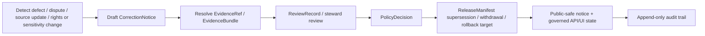

<!-- [KFM_META_BLOCK_V2]
doc_id: kfm://contract/correction/correction-notice
title: contracts/correction/correction_notice.md — CorrectionNotice Contract
type: contract
version: v0.2
status: draft
owners: OWNER_TBD — Correction steward · Release steward · Governance steward · Contract steward · Schema steward · Policy steward · Docs steward
created: 2026-06-20
updated: 2026-06-20
policy_label: public; contracts; correction; correction-notice; semantic-contract; first-class-corrections; rollback-aware
related:
  - ./README.md
  - ../release/README.md
  - ../../schemas/contracts/v1/correction/correction_notice.schema.json
  - ../../fixtures/correction/correction_notice/
  - ../../tools/validators/correction/validate_correction_notice.py
  - ../../policy/correction/
  - ../../policy/release/
  - ../../docs/doctrine/corrections-first-class.md
  - ../../docs/architecture/publication/CORRECTION.md
  - ../../docs/architecture/contract-schema-policy-split.md
  - ../../release/
  - ../../data/proofs/
tags: [kfm, contracts, correction, correction-notice, supersession, withdrawal, rollback, publication, release, review, evidence, policy, auditability, governance]
notes:
  - "Expanded from a greenfield scaffold into the object-level CorrectionNotice semantic contract."
  - "Machine-checkable shape is in schemas/contracts/v1/correction/correction_notice.schema.json, but that schema is explicitly a greenfield placeholder with only id required and additional properties allowed."
  - "The schema-declared validator path was not found in this session; validator behavior remains UNKNOWN / NEEDS VERIFICATION."
  - "CorrectionNotice is a named correction artifact, not a silent edit, not proof closure by itself, not a ReleaseManifest, not a RollbackCard, and not policy approval by itself."
[/KFM_META_BLOCK_V2] -->

<a id="top"></a>

# CorrectionNotice Contract

> Semantic contract for `CorrectionNotice`, the named artifact that records a post-release correction, dispute, supersession, withdrawal, stale-evidence action, rights change, sensitivity change, or other trust-significant repair without silently mutating the prior published record.

<p>
  
  
  
  
  
  
</p>

`contracts/correction/correction_notice.md`

## Quick jumps

[Status](#status) · [Meaning](#meaning) · [Repo fit](#repo-fit) · [Schema pairing](#schema-pairing) · [Accepted uses](#accepted-uses) · [Exclusions](#exclusions) · [Fields](#fields) · [Recommended semantic fields](#recommended-semantic-fields) · [Invariants](#invariants) · [Correction scenarios](#correction-scenarios) · [Lifecycle](#lifecycle) · [Validation](#validation) · [No-loss preservation](#no-loss-preservation) · [Evidence basis](#evidence-basis) · [Rollback](#rollback) · [Definition of done](#definition-of-done)

---

## Status

> [!IMPORTANT]
> **Status:** `draft` / semantic contract  
> **Owner:** `OWNER_TBD`  
> **Contract path:** `contracts/correction/correction_notice.md`  
> **Schema path:** `schemas/contracts/v1/correction/correction_notice.schema.json`  
> **Truth posture:** `CONFIRMED` contract path, current update, correction doctrine, and placeholder schema presence. `CONFLICTED / NEEDS VERIFICATION` placement remains between correction and release contract families. Validator path was not found. Field completeness, fixtures, policy behavior, release integration, public route/UI behavior, and tests remain `NEEDS VERIFICATION`.

---

## Meaning

`CorrectionNotice` is the semantic record that a KFM published object, claim, release, layer, artifact, answer, or public-facing statement has been corrected, superseded, withdrawn, redacted, disputed, or otherwise trust-modified after crossing the `PUBLISHED` boundary.

It exists to prevent silent mutation.

A `CorrectionNotice` must tell maintainers and governed consumers:

1. **What was affected.** Which claim, release, asset, layer, answer, catalog record, or artifact is implicated.
2. **Why correction happened.** Which defect, dispute, source update, rights change, sensitivity change, stale evidence event, validation defect, or policy defect triggered it.
3. **What evidence supports the correction.** Which EvidenceRef/EvidenceBundle or source/update record supports the notice.
4. **Who reviewed or must review it.** Which steward/reviewer/release role is responsible.
5. **What public posture follows.** Corrected, superseded, withdrawn, stale, redacted, abstained, denied, or pending review.
6. **How rollback or supersession is handled.** What prior release remains inspectable and what target or successor should be used.

`CorrectionNotice` is a trust object. It is not the corrected artifact itself.

---

## Repo fit

```text
contracts/
├── correction/
│   ├── README.md
│   └── correction_notice.md
└── release/
    ├── README.md
    ├── correction_notice.md        # listed by release README; canonical home unresolved
    ├── rollback_card.md
    └── withdrawal_notice.md

schemas/
└── contracts/
    └── v1/
        └── correction/
            └── correction_notice.schema.json
```

Adjacent responsibility roots:

| Root | Relationship to this contract |
|---|---|
| `./README.md` | Correction-family directory boundary and doctrine summary. |
| `../release/README.md` | Release-family boundary; currently lists correction, rollback, and withdrawal contracts. |
| `../../schemas/contracts/v1/correction/correction_notice.schema.json` | Current placeholder schema for this semantic contract. |
| `../../fixtures/correction/correction_notice/` | Schema-declared fixture root; existence/coverage remain `NEEDS VERIFICATION`. |
| `../../tools/validators/correction/validate_correction_notice.py` | Schema-declared validator path; not found in this session. |
| `../../policy/correction/`, `../../policy/release/` | Policy decision homes for correction/release behavior. |
| `../../docs/doctrine/corrections-first-class.md` | Governing correction doctrine. |
| `../../docs/architecture/publication/CORRECTION.md` | Publication correction flow and defect-class posture. |
| `../../release/` | Release state, manifests, aliases, rollback targets, supersession lineage. |
| `../../data/proofs/` | EvidenceBundle/proof support for correction reasons. |

> [!WARNING]
> `contracts/release/README.md` currently lists `correction_notice.md` as a release-family file. This contract does not resolve whether `CorrectionNotice` is canonical under `contracts/correction/`, `contracts/release/`, or both via compatibility. Treat placement as `CONFLICTED / NEEDS VERIFICATION` until ADR or migration note resolves it.

---

## Schema pairing

The paired schema is:

```text
schemas/contracts/v1/correction/correction_notice.schema.json
```

The schema defines machine shape. This Markdown contract defines meaning.

The current schema metadata identifies:

| Schema metadata | Value | Verification posture |
|---|---|---|
| `$id` | `https://schemas.kfm.local/contracts/v1/correction/correction_notice.schema.json` | `CONFIRMED` from schema. |
| `contract_doc` | `contracts/correction/correction_notice.md` | `CONFIRMED` from schema metadata. |
| `fixtures_root` | `fixtures/correction/correction_notice/` | `NEEDS VERIFICATION` existence/coverage. |
| `validator` | `tools/validators/correction/validate_correction_notice.py` | `UNKNOWN / NOT FOUND` in this session. |
| `policy` | `policy/correction/` | `NEEDS VERIFICATION` existence/behavior. |
| `status` | `PROPOSED` | `CONFIRMED` from schema metadata. |

> [!CAUTION]
> The current schema is explicitly a greenfield placeholder. It only requires `id`, allows additional properties, and does not yet encode the full semantic requirements in this contract.

---

## Accepted uses

| Use | Allowed? | Rule |
|---|---:|---|
| Recording that a published claim/artifact/release was corrected | Yes | Must name affected object and preserve prior record inspectability. |
| Recording a supersession or withdrawal reason | Yes | Must link to release/rollback state where applicable. |
| Recording rights, sensitivity, stale evidence, source update, or validation defect | Yes | Must route through appropriate policy/review gates. |
| Public-facing notice summary | Conditional | Must be safe to publish and must not expose restricted details. |
| AI-authored public summary | Conditional | Requires generated-receipt linkage and evidence-subordinate review. |
| Replacing a published artifact silently | No | Silent mutation is a defect. |
| Serving as the corrected artifact | No | The notice documents the correction; it does not replace the corrected object. |
| Serving as policy approval or release approval | No | PolicyDecision and ReleaseManifest remain separate. |

---

## Exclusions

| Does not belong in `CorrectionNotice` | Correct owner / surface |
|---|---|
| Corrected dataset/layer/report body | Owning release or artifact root. |
| Full EvidenceBundle content | Evidence/proof root. |
| Full ReviewRecord body | Review/governance contract family. |
| Policy decision logic | `policy/correction/`, `policy/release/`, or appropriate policy root. |
| ReleaseManifest or current alias movement | Release root and release contracts. |
| Rollback execution mechanics | Rollback runbooks/pipelines and release authority. |
| Redacted sensitive content | Do not expose in public notice; link restricted evidence internally as policy allows. |
| Validator code | Tools/validators root. |
| Public UI badge implementation | Governed UI/app roots. |

---

## Fields

The current placeholder schema only defines these machine fields:

| Field | Required by current schema | Semantic meaning | Verification posture |
|---|---:|---|---|
| `id` | Yes | Canonical identifier for the notice. | `CONFIRMED` schema field; format not constrained by current schema. |
| `version` | No | Contract/object version for the notice. | `CONFIRMED` schema field; semantics need stronger schema support. |
| `spec_hash` | No | Deterministic content/spec hash reference. | `CONFIRMED` schema field; current schema says string only and does not enforce `spec_hash` common pattern. |

---

## Recommended semantic fields

The doctrine and publication architecture require more semantic structure than the current placeholder schema enforces.

These fields are `PROPOSED` for future schema/fixture/validator work unless already adopted elsewhere:

| Field | Semantic role | Why it matters |
|---|---|---|
| `notice_id` or canonical `id` | Stable notice identifier. | Makes the correction inspectable and linkable. |
| `affected_claims` / `affected_assets` / `affected_release` | Objects corrected or superseded. | Prevents vague correction notices. |
| `reason` / `defect_class` | Typed reason for correction. | Drives policy/review/rollback posture. |
| `severity` | Materiality of defect. | Helps decide review burden and public urgency. |
| `source_refs` / `evidence_refs` | Evidence supporting the correction. | Preserves cite-or-abstain and EvidenceBundle resolution. |
| `review_state` | Draft, steward review, approved, rejected, withdrawn, superseded. | Prevents unreviewed correction publication. |
| `created_by_role` / `issuer` | Role or process creating the notice. | Supports accountability and separation of duties. |
| `public_summary` | Human-readable public-safe summary. | Supports visible correction without leaking restricted details. |
| `supersedes` / `superseded_by` | Lineage pointers. | Preserves append-only history. |
| `rollback_target` | Prior release or route target. | Supports reversible correction. |
| `generated_receipt_ref` | AI-authorship receipt where applicable. | Keeps generated prose evidence-subordinate. |
| `policy_decision_ref` | Linked policy decision. | Separates notice semantics from policy authority. |
| `release_manifest_ref` | Linked release/supersession state. | Separates notice semantics from release authority. |

---

## Invariants

A `CorrectionNotice` must preserve these invariants:

- every correction is a named operation;
- correction history is append-only;
- affected public claims/artifacts/releases remain inspectable unless policy requires restricted access;
- silent replacement of published material is forbidden;
- correction reasons must be evidence-supported or the corrected claim must ABSTAIN/DENY as appropriate;
- rights and sensitivity changes fail closed when evidence/policy is insufficient;
- public summaries must be safe for the intended audience;
- restricted details must not be exposed in public correction notices;
- correction notices do not replace EvidenceBundle, ReviewRecord, PolicyDecision, ReleaseManifest, RollbackCard, or RedactionReceipt objects;
- rollback targets and supersession links must be preserved outside the notice where release machinery requires them.

---

## Correction scenarios

| Scenario | Required notice posture | Required external support |
|---|---|---|
| Error in claim | Identify defect and affected claim; route superseding candidate through release. | EvidenceBundle, ReviewRecord, ReleaseManifest. |
| Disputed claim | Attach dispute/caveat or ABSTAIN if material. | Steward review and evidence support. |
| Source update | Record source revision and supersession relationship. | SourceDescriptor/DatasetVersion and comparison receipt. |
| Rights change | Deny or withdraw public use where rights no longer support publication. | PolicyDecision and legal/reviewer signoff where applicable. |
| Sensitivity change | Redact/generalize/withdraw and avoid leaking restricted content. | Sensitivity policy, RedactionReceipt, ReviewRecord, ReleaseManifest. |
| Stale evidence | Mark stale or ABSTAIN rather than pretend current status. | Freshness policy and evidence/source lineage. |
| Superseded artifact | Link old and new release/artifact. | Supersession record or release manifest. |
| Withdrawn release | Preserve audit while removing public route. | Withdrawal notice, rollback/release state. |

---

## Lifecycle



Lifecycle notes:

- A notice may begin as a draft, user report, steward report, validator finding, policy finding, source update, or AI audit finding.
- Schema validation proves only shape.
- Review/policy/release gates decide whether the notice changes public behavior.
- Public visibility must preserve transparency without exposing restricted content.
- Prior releases are not deleted or silently overwritten.

---

## Validation

Before relying on this contract, verify:

- canonical placement of `CorrectionNotice` between correction and release contract roots;
- schema expanded beyond the current greenfield placeholder or intentionally accepted as placeholder;
- validator path exists and behavior is implemented;
- fixtures cover error, dispute, source update, rights change, sensitivity change, stale evidence, supersession, and withdrawal cases;
- required fields identify affected assets/claims/releases;
- evidence references resolve to EvidenceBundle where consequential;
- review and policy decisions are linked;
- release manifests preserve supersession/withdrawal/rollback state;
- public summaries are safe and do not leak restricted content;
- AI-authored fields carry generated-receipt linkage where applicable;
- tests fail on silent mutation of published artifacts.

---

## No-loss preservation

| Existing element | Disposition | Reason |
|---|---|---|
| Prior title/family/status scaffold | `KEEP + EXPAND` | Preserved correction family and proposed scaffold posture. |
| Schema path | `KEEP + GROUND` | Current placeholder schema exists and is cited. |
| Meaning section | `KEEP + REPLACE WITH CONCRETE SEMANTICS` | The scaffold asked what meaning should be; this edit supplies doctrine-grounded meaning. |
| Fields section | `KEEP + CLARIFY` | Current schema fields are documented, and recommended semantic fields are labeled `PROPOSED`. |
| Invariants | `KEEP + STRENGTHEN` | General invariant placeholders are replaced with correction-specific trust invariants. |
| Lifecycle | `KEEP + CLARIFY` | Lifecycle now separates draft, evidence, review, policy, release, public notice, and audit. |
| Open questions | `KEEP + MOVE INTO VALIDATION / DEFINITION OF DONE` | Verification gaps are now actionable. |

---

## Evidence basis

| Source | Status | Supports | Limits |
|---|---|---|---|
| Prior `contracts/correction/correction_notice.md` scaffold | `CONFIRMED` | Target file existed as proposed greenfield scaffold with family and schema path. | It contained placeholders, not complete semantics. |
| `schemas/contracts/v1/correction/correction_notice.schema.json` | `CONFIRMED placeholder` | Current schema exists; x-kfm metadata points to this contract, fixtures, validator, and policy; `id` is the only required field. | Schema explicitly says greenfield placeholder and does not enforce full correction semantics. |
| `tools/validators/correction/validate_correction_notice.py` | `UNKNOWN / NOT FOUND` | Schema-declared validator path was checked. | File was not found in this session; behavior is not implemented evidence. |
| `contracts/correction/README.md` | `CONFIRMED` | Correction directory README defines correction-family boundaries and notes placeholder schema / placement uncertainty. | Does not complete object-level schema or validator behavior. |
| `docs/doctrine/corrections-first-class.md` | `CONFIRMED doctrine` | Corrections are named, append-only, visible where appropriate, and must not silently replace published records. | Some implementation paths/fields remain proposed or verification-bound. |
| `docs/architecture/publication/CORRECTION.md` | `CONFIRMED doctrine / PROPOSED implementation` | Correction flow, defect classes, trust membrane, cite-or-abstain, and release/rollback relationship. | Route names, schema homes, and implementation maturity remain proposed unless separately verified. |
| `contracts/release/README.md` | `CONFIRMED` | Release contracts include correction, rollback, withdrawal, and release governance objects. | Creates a placement relationship that remains unresolved with this correction directory. |

---

## Rollback

Rollback is required if this contract is used to claim schema completeness, validator coverage, policy enforcement, canonical placement, release execution, public-route behavior, or implementation maturity not verified in this session.

Rollback target: prior scaffold content SHA `893fb609e07324de5076ee43ff8baf93efc3df08`.

---

## Definition of done

- [ ] Owners are confirmed and `OWNER_TBD` is replaced.
- [ ] Canonical placement is resolved between `contracts/correction/` and `contracts/release/`.
- [ ] Schema is expanded beyond greenfield placeholder or placeholder status is intentionally accepted.
- [ ] Validator path exists and behavior is implemented.
- [ ] Fixtures cover correction scenarios and invalid cases.
- [ ] EvidenceRef/EvidenceBundle linkage is required where consequential.
- [ ] ReviewRecord and PolicyDecision linkage is defined and tested.
- [ ] ReleaseManifest / rollback target / supersession linkage is testable.
- [ ] Public-safe summary behavior is verified.
- [ ] Tests fail on silent mutation of published artifacts.

---

## Status summary

`CorrectionNotice` is the semantic trust object that names and explains a correction. It is not the corrected artifact, not proof closure, not policy approval, not release approval, not rollback execution, not a public-route implementation, and not permission to mutate published history silently.

<p align="right"><a href="#top">Back to top</a></p>
