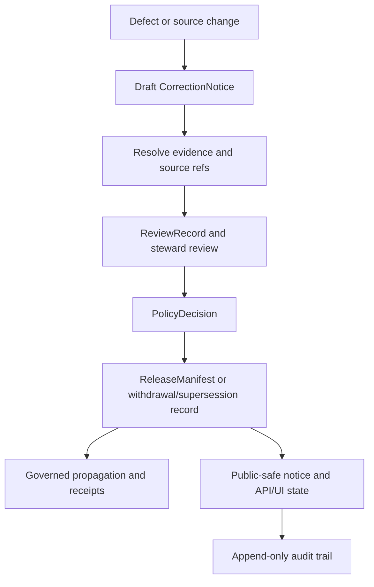

<!-- [KFM_META_BLOCK_V2]
doc_id: kfm://contract/correction/correction-notice
title: contracts/correction/correction_notice.md — CorrectionNotice Contract
type: contract
version: v0.3
status: draft; repository-grounded; bounded-shape-only; non-executing; placement-conflicted; non-release; non-publication
owners: OWNER_TBD — Correction steward · Release steward · Governance steward · Contract steward · Schema steward · Policy steward · Docs steward
created: 2026-06-20
updated: 2026-09-07
policy_label: public; contracts; correction; correction-notice; semantic-contract; first-class-corrections; rollback-aware; bounded-shape-only
related:
  - ./README.md
  - ./correction_impact_assessment.md
  - ./correction_propagation_plan.md
  - ./supersession_notice.md
  - ../release/README.md
  - ../../schemas/contracts/v1/correction/README.md
  - ../../schemas/contracts/v1/correction/correction_notice.schema.json
  - ../../schemas/contracts/v1/corrections/README.md
  - ../../schemas/contracts/v1/corrections/correction_notice_candidate.schema.json
  - ../../fixtures/correction/correction_notice/
  - ../../tools/validators/correction/validate_correction_notice.py
  - ../../tools/validators/validate_correction_notice.py
  - ../../tests/validators/test_validate_correction_notice.py
  - ../../tests/validators/correction/test_correction_impact_assessment.py
  - ../../policy/correction/
  - ../../policy/release/
  - ../../docs/doctrine/corrections-first-class.md
  - ../../docs/runbooks/EVIDENCE_CORRECTION.md
  - ../../docs/architecture/publication/CORRECTION.md
  - ../../release/correction/
  - ../../release/corrections/
  - ../../release/correction_notices/
  - ../../release/
  - ../../data/proofs/
tags: [kfm, contracts, correction, correction-notice, supersession, withdrawal, rollback, publication, release, review, evidence, policy, auditability, governance, currentness]
notes:
  - "Current GitHub implementation authority is pinned to main@ec203a9ba11fb83b52245f9523ce36cc1ec6ac66 for this update."
  - "The paired schema, canonical validator, compatibility entry point, dedicated validator test, and minimal fixture lane are present at the pinned base."
  - "The paired schema remains PROPOSED, requires only id, allows additional properties, and therefore enforces only a thin shape profile."
  - "CorrectionNotice remains a semantic trust object; it does not itself issue a correction, approve policy, release a replacement, execute rollback, propagate invalidation, or publish a notice."
  - "Google Drive and Notion material is read-only doctrine/coordination lineage; GitHub paths and accepted repository authority control implementation claims."
evidence_snapshot:
  repository: bartytime4life/Kansas-Frontier-Matrix
  visibility: public
  base_ref: main
  base_commit: ec203a9ba11fb83b52245f9523ce36cc1ec6ac66
  target_baseline_blob: 4716f2bc6e714ad2ab873d95144417d7855f5beb
  directory_readme_blob: 0e48db075585ad2e4406cd50492d2a08af64ecc4
  paired_schema_blob: 8f260eb5a5adba0b4966adfeffebfbcf6960277d
  canonical_validator_blob: 06f873716c0ba20579f208f92d92a3b8073a6917
  compatibility_validator_blob: e74e34bb225020c24eecb029700b6fe678727f8f
  dedicated_test_blob: ccca90523b33eb6f3cbbf0f3f229dfdee2242170
  fixture_readme_blob: f1d43d19977e31b5677a4fa12d3aac802eecc5fd
  valid_fixture_blob: abbfbc61ce4b6e39ba28f69f6f85a886278a84ef
  invalid_fixture_blob: b6d24b9c77037632bfd4f1ccb3a5791310ada9d3
  direct_contract_neighbors:
    - contracts/correction/correction_impact_assessment.md @ 2ef4e4373bec9edd06454e5337d0a2062ae880fd
    - contracts/correction/correction_propagation_plan.md @ b61e7fb0ecd0e68588a29642f3c47e0cb810eff9
    - contracts/correction/supersession_notice.md @ 22f1fdb4a82063b7e66d0478fcc83cb03a89d68b
  inventory_method: authenticated GitHub exact-file reads and Contents listings against the pinned base
  boundary_note: "The target update is scoped to this file. It does not refresh the separate directory README, schema, policy, release, runtime, or Notion records."
[/KFM_META_BLOCK_V2] -->

<a id="top"></a>

# CorrectionNotice Contract

> Semantic contract for **CorrectionNotice**, the named trust object that records a post-release or release-facing correction need without silently mutating the prior published record.

<p>
  
  
  
  
  
  
</p>

contracts/correction/correction_notice.md

## Quick jumps

[Status](#status) · [Meaning](#meaning) · [Repo fit](#repo-fit) · [Schema pairing](#schema-pairing) · [Current evidence](#current-evidence) · [Accepted uses](#accepted-uses) · [Exclusions](#exclusions) · [Fields](#fields) · [Recommended semantics](#recommended-semantics) · [Invariants](#invariants) · [Correction scenarios](#correction-scenarios) · [Lifecycle](#lifecycle) · [Validation](#validation) · [No-loss preservation](#no-loss-preservation) · [Evidence basis](#evidence-basis) · [Rollback](#rollback) · [Definition of done](#definition-of-done) · [Changelog](#changelog)

---

## Status

> [!IMPORTANT]
> **Status:** draft / repository-grounded semantic contract  
> **Owner:** OWNER_TBD  
> **Contract path:** contracts/correction/correction_notice.md  
> **Schema path:** schemas/contracts/v1/correction/correction_notice.schema.json  
> **Truth posture:** CONFIRMED contract path, correction doctrine, paired schema, canonical validator, compatibility entry point, dedicated validator test, and minimal fixture lane. BOUNDED machine evidence currently proves only the proposed thin schema and JSON/fixture safety profile. CONFLICTED / NEEDS VERIFICATION canonical placement across correction and release lanes, policy authority, accountable ownership, review/evidence closure, release behavior, propagation, and public-surface behavior.

This file records semantic meaning and non-authority boundaries. It does not adopt the proposed schema, accept a policy bundle, establish a release transition, or authorize a runtime or public mutation.

---

## Meaning

**CorrectionNotice** is the semantic record that a KFM claim, release, layer, artifact, answer, catalog record, report, or public-facing statement has a material defect, dispute, stale-evidence condition, source update, rights change, sensitivity change, validation defect, withdrawal need, or other trust-significant correction condition.

It exists to make the correction named, inspectable, reviewable, and append-only.

A notice should tell maintainers and governed consumers:

1. **What is affected.** Identify the claim, object, release, asset, layer, answer, record, or public surface.
2. **Why correction is needed.** Use a typed reason or defect class where available.
3. **What supports the notice.** Point to evidence, source updates, validation receipts, review records, or policy findings.
4. **What review is required.** Identify the responsible steward or accountable decision boundary without treating the notice as approval.
5. **What posture is proposed.** For example: corrected, superseded, withdrawn, stale, redacted, abstained, denied, deferred, or pending review.
6. **What lineage must remain visible.** Preserve the prior release, artifact, evidence, and rollback or successor relationship.
7. **What must not happen silently.** Do not overwrite a published object or imply that a notice alone changed public state.

A CorrectionNotice is a trust object. It is not the corrected artifact, a ReleaseManifest, a RollbackCard, an EvidenceBundle, a ReviewRecord, a PolicyDecision, a propagation executor, or a public-route implementation.

---

## Repo fit

```text
contracts/
├── correction/
│   ├── README.md
│   ├── correction_notice.md          # this contract
│   ├── correction_impact_assessment.md
│   ├── correction_propagation_plan.md
│   └── supersession_notice.md
└── release/
    └── README.md                     # release semantic-contract lane

schemas/contracts/v1/
├── correction/                       # singular correction schema family
│   ├── README.md
│   ├── correction_notice.schema.json
│   ├── correction_impact_assessment.schema.json
│   ├── correction_propagation_plan.schema.json
│   └── supersession_notice.schema.json
└── corrections/                     # compatibility/index lane
    ├── README.md
    └── correction_notice_candidate.schema.json

fixtures/correction/correction_notice/
├── README.md
├── valid/minimal.json
└── invalid/missing_id.json

tools/validators/
├── correction/validate_correction_notice.py
└── validate_correction_notice.py    # compatibility entry point

tests/validators/
├── test_validate_correction_notice.py
└── correction/test_correction_impact_assessment.py

release/
├── correction/                       # review lane
├── corrections/                      # domain-scoped correction records
└── correction_notices/               # notice/index lane
```

Adjacent responsibility roots:

| Root | Relationship to this contract |
|---|---|
| ./README.md | Correction-family directory boundary; separate from this object-level contract. |
| ./correction_impact_assessment.md | Non-authoritative carrier assessment; it inventories impact but does not execute correction. |
| ./correction_propagation_plan.md | Non-executing derivative-propagation planning contract. |
| ./supersession_notice.md | Lineage contract for replacement of a prior governed object. |
| ../../schemas/contracts/v1/correction/ | Singular, active candidate schema family paired to this contract. |
| ../../schemas/contracts/v1/corrections/ | Plural compatibility/index lane; not selected as a second schema authority. |
| ../../fixtures/correction/correction_notice/ | Minimal positive/negative fixture lane for the current proposed schema. |
| ../../tools/validators/correction/ | Canonical bounded validators; the CorrectionNotice validator exists and is non-network/non-publishing. |
| ../../tools/validators/validate_correction_notice.py | Compatibility entry point that re-exports the canonical validator surface. |
| ../../tests/validators/test_validate_correction_notice.py | Dedicated validator regression tests, including malformed JSON and CLI-boundary cases. |
| ../../policy/correction/ | Declared by the schema metadata, but no direct policy/correction/ directory was observed at the pinned base. |
| ../../docs/doctrine/corrections-first-class.md | Governing first-class, append-only, visible-correction doctrine. |
| ../../docs/runbooks/EVIDENCE_CORRECTION.md | Draft intake, classification, bounded validation, and review-handoff guidance. |
| ../../docs/architecture/publication/CORRECTION.md | Publication correction, supersession, derivative, and trust-boundary architecture. |
| ../../release/correction/ | Singular release correction review lane with rollback child lane. |
| ../../release/corrections/ | Plural release correction index with domain sublanes. |
| ../../release/correction_notices/ | Release-facing notice/index lane with domain sublanes. |
| ../../release/ | Release state, manifests, public aliases, rollback records, and related release authority. |

> [!WARNING]
> The repository has both correction semantic-contract material and several release correction lanes. contracts/release/README.md also links to ../correction/correction_notice.md. This contract does not resolve whether CorrectionNotice has one canonical semantic home, a correction-owned home with release references, or a governed compatibility relationship. Treat placement as CONFLICTED / NEEDS VERIFICATION until an accepted ADR or migration note resolves it.

---

## Schema pairing

The paired machine-shape file is:

```text
schemas/contracts/v1/correction/correction_notice.schema.json
```

The schema defines machine shape. This Markdown contract defines meaning and authority boundaries.

Current paired-schema facts at the pinned base:

| Schema element | Current value | What it proves |
|---|---|---|
| $schema | Draft 2020-12 | The schema declares its validation dialect. |
| $id | https://schemas.kfm.local/contracts/v1/correction/correction_notice.schema.json | The schema declares a stable identifier. |
| x-kfm.contract_doc | contracts/correction/correction_notice.md | The schema points back to this semantic contract. |
| x-kfm.fixtures_root | fixtures/correction/correction_notice/ | The schema declares a fixture lane. |
| x-kfm.validator | tools/validators/correction/validate_correction_notice.py | The schema declares the canonical validator path. |
| x-kfm.policy | policy/correction/ | The schema declares a policy path; that direct path was not observed at the pinned base. |
| x-kfm.status | PROPOSED | The schema is not accepted normative authority. |
| required | id only | The current minimum is intentionally thin. |
| additionalProperties | true | The current schema does not close the object or enforce the semantic field set. |

> [!CAUTION]
> The paired schema is a greenfield/proposed placeholder. It requires only id, permits additional properties, and cannot currently enforce the evidence, review, public-safety, lineage, release, or rollback semantics described below.

---

## Current evidence

The following is a point-in-time repository inventory, not a claim that any correction has been issued or published.

| Surface | Base evidence | Current posture |
|---|---|---|
| contracts/correction/correction_notice.md | Blob 4716f2bc6e714ad2ab873d95144417d7855f5beb | Existing draft contract; this update's exact rollback baseline. |
| contracts/correction/ direct neighbors | Impact 2ef4e437…, propagation b61e7fb…, supersession 22f1fdb… | Five-file correction semantic lane when combined with the directory README; maturity is mixed. |
| Paired schema | Blob 8f260eb5a5adba0b4966adfeffebfbcf6960277d | Proposed id-only shape with open properties. |
| Canonical validator | tools/validators/correction/validate_correction_notice.py @ 06f873716c0ba20579f208f92d92a3b8073a6917 | Present; bounded JSON safety and paired-schema validation only. |
| Compatibility validator | tools/validators/validate_correction_notice.py @ e74e34bb225020c24eecb029700b6fe678727f8f | Present; delegates to the canonical validator. |
| Dedicated test | tests/validators/test_validate_correction_notice.py @ ccca90523b33eb6f3cbbf0f3f229dfdee2242170 | Present; covers schema validity, fixture polarity, duplicate keys, root type, non-finite numbers, symlink lanes, CLI option boundaries, and both entry points. |
| Fixture README | Blob f1d43d19977e31b5677a4fa12d3aac802eecc5fd | Explicitly limits proof to the proposed schema and bounded JSON safety. |
| Valid fixture | valid/minimal.json @ abbfbc61ce4b6e39ba28f69f6f85a886278a84ef | Demonstrates the current id-only minimum. |
| Invalid fixture | invalid/missing_id.json @ b6d24b9c77037632bfd4f1ccb3a5791310ada9d3 | Demonstrates missing-id rejection under the current schema. |
| Policy path | policy/correction/ | Declared by schema metadata; not observed in the pinned direct Contents read. |
| Release lanes | release/correction/, release/corrections/, release/correction_notices/ | Present as separate draft review/index lanes; not interchangeable with this semantic contract. |

The validator and test surfaces are implementation evidence for a bounded profile. They are not evidence of policy acceptance, human approval, release transition, downstream invalidation, rollback execution, or public publication.

---

## Accepted uses

| Use | Allowed? | Rule |
|---|---:|---|
| Record a suspected or confirmed correction condition | Yes | Name the affected object and preserve prior-record inspectability. |
| Record a source update, stale-evidence finding, validation defect, rights change, sensitivity change, dispute, withdrawal need, or supersession need | Yes | Link the appropriate evidence and route through review/policy gates. |
| Prepare a reviewable correction candidate | Yes | Keep it non-executing and label unresolved fields or decisions. |
| Prepare a public-safe notice summary | Conditional | Publish only after separate review, policy, release, and sensitive-detail checks. |
| Include AI-authored prose | Conditional | Require generated-receipt linkage where applicable and human/evidence-subordinate review. |
| Replace a published artifact silently | No | Silent mutation is a trust defect. |
| Serve as the corrected artifact | No | The notice describes the correction; it does not replace the affected object. |
| Serve as policy approval or release approval | No | PolicyDecision, ReleaseManifest, and accountable review remain separate. |
| Trigger cache/index/tile/API/map/AI propagation | No | Use a separately governed propagation plan and execution boundary. |
| Execute rollback or repoint a public alias | No | Use release/rollback authority and a recorded transition. |

---

## Exclusions

| Does not belong in CorrectionNotice | Correct owner / surface |
|---|---|
| Corrected dataset, layer, report, answer, or release body | Owning artifact/release root. |
| Full evidence or proof content | Evidence/proof root and linked receipts. |
| Full review record | Review/governance contract family. |
| Policy decision logic | Accepted policy root; the declared policy/correction/ path requires verification. |
| Release manifest or current-alias movement | release/ and release contracts. |
| Rollback execution mechanics | Release rollback runbooks and accountable release authority. |
| Restricted sensitive detail | Private evidence/review surface; public notice must be safe or abstain. |
| Validator code or fixture data | tools/validators/ and fixtures/. |
| Public UI/API badge or route implementation | Governed application/API roots after release verification. |
| Silent published-asset mutation | Forbidden. |

---

## Fields

The current proposed schema defines only this machine-checkable field set:

| Field | Required now | Current machine meaning | Limitation |
|---|---:|---|---|
| id | Yes | Canonical identifier string. | No format, namespace, uniqueness, or lifecycle binding is enforced. |
| version | No | Contract or object version string. | Not required and not semantically constrained. |
| spec_hash | No | Deterministic content/spec hash string. | No algorithm, binding, or required use is enforced. |
| Any additional property | Allowed | Open extension surface. | Additional properties are not evidence of accepted semantics. |

The semantic field set below is recommended, not currently schema-required.

---

## Recommended semantics

These fields should be treated as a future schema/ADR/fixture/validator worklist unless separately adopted:

| Field or group | Semantic role | Required safeguard |
|---|---|---|
| notice_id or canonical id | Stable notice identity. | Collision-resistant, deterministic identity rule. |
| affected_claims, affected_assets, affected_release, affected_surfaces | Exact correction scope. | Resolve each pointer or abstain. |
| reason, defect_class, severity | Typed cause and materiality. | Enumerated values and policy mapping. |
| source_refs, evidence_refs, evidence_bundle_ref | Support for the correction. | Evidence closure and cite-or-abstain behavior. |
| review_state, review_record_ref, reviewed_by_role | Review boundary. | Separation of duties and accountable review. |
| policy_decision_ref | Admissibility and rights/sensitivity decision. | Fail closed when missing or unresolved. |
| release_manifest_ref, rollback_target_ref | Release and reversibility binding. | Do not imply release/publication from notice prose. |
| supersedes, superseded_by, withdrawal_ref | Append-only lineage. | Preserve prior object and successor/withdrawal relation. |
| public_status, public_summary, public_effect | Safe public posture. | Redact restricted detail; publish only after release authority. |
| created_at, observed_at, effective_at | Temporal ordering. | Define timezone and ordering semantics. |
| issuer, created_by_role, generated_receipt_ref | Accountability and AI provenance. | Receipt linkage for generated text; no self-authorization. |
| propagation_plan_ref, impact_assessment_ref | Downstream carrier planning. | Planning records remain non-executing. |

Recommended public-status vocabulary includes PENDING_REVIEW, CORRECTED, SUPERSEDED, WITHDRAWN, STALE, REDACTED, ABSTAIN, DENY, and DEFER. The current schema does not enforce this vocabulary.

---

## Invariants

A CorrectionNotice must preserve these semantic invariants:

- every correction is a named operation, not an unexplained replacement;
- correction history is append-only;
- affected claims, artifacts, releases, and evidence remain inspectable subject to access policy;
- silent replacement of published material is forbidden;
- consequential correction reasons are evidence-supported, or the affected claim is marked ABSTAIN/DENY as appropriate;
- rights and sensitivity changes fail closed when evidence or policy is insufficient;
- public summaries are safe for the intended audience;
- restricted details are not exposed through public notice text;
- a notice does not replace EvidenceBundle, ReviewRecord, PolicyDecision, ReleaseManifest, RollbackCard, SupersessionNotice, or RedactionReceipt;
- release and publication effects require separately governed transitions;
- impact and propagation records describe work but do not execute it;
- AI-authored correction prose remains receipt-linked and evidence-subordinate;
- schema validity, validator PASS, or fixture success never proves correction issuance, policy approval, release, rollback, propagation, or publication.

---

## Correction scenarios

| Scenario | Required notice posture | External support still required |
|---|---|---|
| Error in claim or artifact | Identify the defect and affected object; propose repair or supersession. | Evidence, review, policy, release record. |
| Disputed claim | Preserve dispute context and caveat or abstain if material. | Steward review and source/evidence support. |
| Source update | Record source revision and replacement lineage. | Source descriptor/version and comparison receipt. |
| Rights change | Restrict, withdraw, or deny public use when rights no longer support it. | Policy decision and accountable rights review. |
| Sensitivity change | Redact, generalize, withdraw, or abstain without leaking the sensitive basis. | Sensitivity policy, redaction receipt, review, release state. |
| Stale evidence | Mark stale or abstain rather than presenting an old claim as current. | Freshness rule and evidence/source lineage. |
| Superseded object | Link prior and replacement objects without deleting the prior record. | Supersession notice and release manifest. |
| Withdrawn release | Preserve audit history while removing or restricting public access. | Withdrawal record, release decision, rollback/alias evidence. |
| Downstream derivative impact | Identify affected carriers and planned work. | Impact assessment, propagation plan, execution receipts. |

---

## Lifecycle


```mermaid
flowchart TD
  DETECT[Defect or source change] --> DRAFT[Draft CorrectionNotice]
  DRAFT --> EVID[Resolve evidence and source refs]
  EVID --> REVIEW[ReviewRecord and steward review]
  REVIEW --> POLICY[PolicyDecision]
  POLICY --> RELEASE[ReleaseManifest or withdrawal/supersession record]
  RELEASE --> PROP[Governed propagation and receipts]
  RELEASE --> PUBLIC[Public-safe notice and API/UI state]
  PUBLIC --> AUDIT[Append-only audit trail]
```

Lifecycle boundaries:

- A notice may begin as a user report, steward report, validator finding, policy finding, source update, dispute, or AI audit finding.
- Schema validation proves only machine shape.
- Review and policy determine whether a correction candidate is admissible.
- Release authority determines whether public state changes.
- Propagation authority determines whether derivatives are invalidated, rebuilt, repointed, or re-published.
- Public notice behavior must preserve transparency without exposing restricted details.
- Prior releases, evidence, receipts, and correction history are not deleted or silently overwritten.

---

## Validation

### Evidence confirmed for this contract

- [x] Current main was re-pinned to ec203a9ba11fb83b52245f9523ce36cc1ec6ac66.
- [x] The target baseline blob was recorded as 4716f2bc6e714ad2ab873d95144417d7855f5beb.
- [x] The paired Draft 2020-12 schema exists and points to this contract.
- [x] The canonical validator exists at tools/validators/correction/validate_correction_notice.py.
- [x] The compatibility entry point exists at tools/validators/validate_correction_notice.py.
- [x] The dedicated validator test exists at tests/validators/test_validate_correction_notice.py.
- [x] The positive and negative fixture lanes exist.
- [x] The fixture README explicitly limits its proof to bounded schema/JSON safety.
- [x] The correction semantic lane and separate release correction lanes were inspected.

### Still required before treating correction behavior as accepted

- [ ] Run the canonical and compatibility fixture commands on the exact candidate head and retain their outputs.
- [ ] Decide whether the id-only proposed schema is an intentional first profile or expand it through an accepted ADR and domain review.
- [ ] Define and verify the canonical policy path; the schema-declared policy/correction/ directory was not observed at the pinned base.
- [ ] Resolve semantic placement between contracts/correction/, contracts/release/, and release correction/index lanes without creating duplicate authority.
- [ ] Add or verify schema/fixture/validator coverage for evidence, review, policy, release, rollback, public-safe summary, supersession, withdrawal, rights, and sensitivity semantics.
- [ ] Verify the declared SupersessionNotice validator and fixture paths; they were not observed at the pinned base.
- [ ] Link and test EvidenceBundle, ReviewRecord, PolicyDecision, ReleaseManifest, rollback, impact, and propagation records.
- [ ] Verify propagation behavior across catalog, cache, index, tile, graph, API, map, Focus Mode, story, export, and citation surfaces where applicable.
- [ ] Verify public-safe notice behavior and restricted-detail handling.
- [ ] Prove that silent mutation of a published artifact fails closed under repository-native and hosted validation.
- [ ] Confirm accountable owners and independent review.

The presence of validators, tests, and fixtures is useful repository evidence, but this contract does not claim that those checks were executed during this documentation update or that they establish correction authority.

---

## No-loss preservation

| Existing element | Disposition | Reason |
|---|---|---|
| Prior title, family, and draft posture | KEEP + RECONCILE | Preserves the existing object-level contract identity while updating currentness. |
| Schema path and meaning/schema split | KEEP + GROUND | The paired schema exists, but remains a proposed thin stub. |
| Meaning section | KEEP + STRENGTHEN | Makes the trust-object boundary explicit. |
| Accepted uses and exclusions | KEEP + CLARIFY | Separates candidate preparation from policy, release, and execution authority. |
| Fields and recommended fields | KEEP + RECONCILE | Distinguishes current machine fields from proposed semantic fields. |
| Invariants and scenarios | KEEP + STRENGTHEN | Preserves correction doctrine while labeling external support requirements. |
| Lifecycle | KEEP + BOUND | Separates draft, evidence, review, policy, release, propagation, public, and audit transitions. |
| Validation gaps | KEEP + REPLACE WITH CURRENT EVIDENCE | Corrects stale claims that the validator and fixtures were missing. |
| Historical rollback note | KEEP AS LINEAGE | The prior document named scaffold blob 893fb609e07324de5076ee43ff8baf93efc3df08; this update uses the exact current GitHub baseline blob below for reversible branch work. |

---

## Evidence basis

| Source | Status | Supports | Limits |
|---|---|---|---|
| contracts/correction/correction_notice.md at baseline blob 4716f2bc6e714ad2ab873d95144417d7855f5beb | CONFIRMED | Target existed as a draft object-level contract; this is the exact branch rollback baseline. | Prior assertions about missing validator/fixtures were stale. |
| schemas/contracts/v1/correction/correction_notice.schema.json @ 8f260eb5a5adba0b4966adfeffebfbcf6960277d | CONFIRMED PROPOSED STUB | Schema, contract link, fixture link, validator link, and id-only minimum. | Does not enforce full semantic requirements or policy/release behavior. |
| tools/validators/correction/validate_correction_notice.py @ 06f873716c0ba20579f208f92d92a3b8073a6917 | CONFIRMED BOUNDED VALIDATOR | Duplicate-key, size, JSON-root, finite-number, schema, fixture-polarity, no-network, and non-publisher boundaries in code. | Does not issue corrections, approve policy, release, publish, propagate, or roll back. |
| tools/validators/validate_correction_notice.py @ e74e34bb225020c24eecb029700b6fe678727f8f | CONFIRMED COMPATIBILITY ENTRY POINT | Legacy path delegates to the canonical validator surface. | Does not add independent correction authority. |
| tests/validators/test_validate_correction_notice.py @ ccca90523b33eb6f3cbbf0f3f229dfdee2242170 | CONFIRMED TEST SOURCE | Dedicated regression coverage for schema, fixtures, malformed inputs, symlink lanes, CLI option boundaries, and both entry points. | Presence of test code is not proof that it passed on this candidate or that runtime/release behavior is complete. |
| fixtures/correction/correction_notice/ | CONFIRMED MINIMAL LANE | Positive id-only and negative missing-id examples plus explicit proof limits. | Does not cover the proposed semantic field set or public/release transitions. |
| contracts/correction/ direct neighbors | CONFIRMED MIXED MATURITY | Impact assessment, propagation plan, and supersession semantic surfaces exist. | Impact/propagation are non-executing; SupersessionNotice still declares unverified validator/fixture paths. |
| contracts/release/README.md, release/correction/README.md, release/corrections/README.md, and release/correction_notices/README.md | CONFIRMED ADJACENT LANES | Release correction review, domain records, and notice/index responsibilities are separate from this semantic object contract. | Canonical placement and migration relationship remain unresolved. |
| docs/doctrine/corrections-first-class.md | CONFIRMED DOCTRINE | First-class named corrections, append-only history, visibility, rollback/correction path, and fail-closed trust posture. | Doctrine does not prove executable implementation. |
| docs/runbooks/EVIDENCE_CORRECTION.md | CONFIRMED DRAFT GUIDANCE | Intake, classification, bounded validation, review handoff, and held operational/release boundaries. | Its historical pins are not current implementation authority. |
| docs/architecture/publication/CORRECTION.md | CONFIRMED DOCTRINE / PROPOSED IMPLEMENTATION | Publication correction, supersession lineage, derivative invalidation, review, and trust-visible status concepts. | Route names and implementation maturity remain separately governed. |
| KFM Issue 4228 — Frozen Catalog Correction-Mechanism Decision Package (Google Drive; read-only) | READ-ONLY LINEAGE | Trusted-base exact-transition, fail-closed, one-use, and no-self-authorization design principles. | Historical/readback-only package; its repository pins are stale and it does not authorize this contract. |
| KFM Issue #4228 — Frozen Catalog Correction-Mechanism Decision Package and KFM Repository Workbench (Notion; read-only) | COORDINATION LINEAGE | Stage 1B hold, GitHub-as-implementation-authority, branch-first containment, and separate decision/implementation/release/publication boundaries. | Unverified coordination pages with stale historical pins; no Notion content is treated as repository authority. |

---

## Rollback

Rollback is required if this contract is used to claim accepted schema authority, policy enforcement, correction issuance, downstream invalidation, canonical placement, release/rollback execution, public publication, or permission to silently mutate published artifacts without the missing evidence.

Rollback target for this update: current baseline blob 4716f2bc6e714ad2ab873d95144417d7855f5beb at main@ec203a9ba11fb83b52245f9523ce36cc1ec6ac66. Reverting the single-file branch commit restores the exact pre-update content.

---

## Definition of done

- [x] Current main pin and exact target baseline blob are recorded.
- [x] Current schema, canonical validator, compatibility entry point, dedicated test, and fixture lanes are recorded without overstating their authority.
- [x] The semantic meaning/schema-shape/policy/release/publication boundaries are explicit.
- [x] Correction, impact, propagation, and supersession relationships are described.
- [x] Correction/release placement conflict and singular/plural release lanes are surfaced.
- [x] Drive and Notion material is labeled read-only lineage/coordination.
- [ ] Owners are confirmed and OWNER_TBD is replaced.
- [ ] The canonical semantic placement is resolved by accepted repository authority.
- [ ] The proposed schema is expanded or intentionally accepted as a bounded first profile.
- [ ] Policy, evidence, review, rights, sensitivity, release, rollback, supersession, and public-safe disclosure linkages are implemented and tested.
- [ ] Silent mutation of published artifacts fails closed in repository-native and hosted validation.
- [ ] Independent accountable review and exact-head validation are recorded.

---

## Changelog

| Version | Change |
|---|---|
| v0.3 — 2026-09-07 | Reconciled the contract with current GitHub evidence at main@ec203a9…; corrected stale validator/fixture claims; recorded canonical and compatibility validator paths, dedicated regression tests, exact fixture evidence, separate release correction lanes, and Drive/Notion authority boundaries. |

## Status summary

CorrectionNotice is the semantic trust object that names and explains a correction condition. It is not the corrected artifact, proof closure, policy approval, release approval, rollback execution, propagation executor, public API/UI implementation, or permission to mutate published history silently.

<p align="right"><a href="#top">Back to top</a></p>
